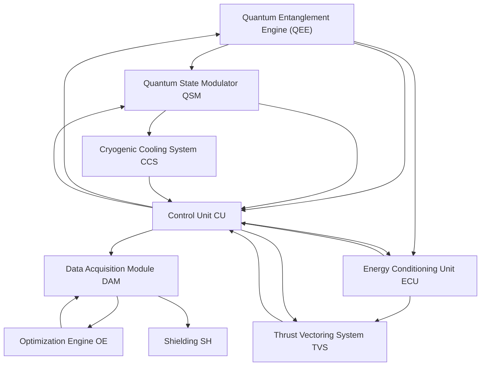
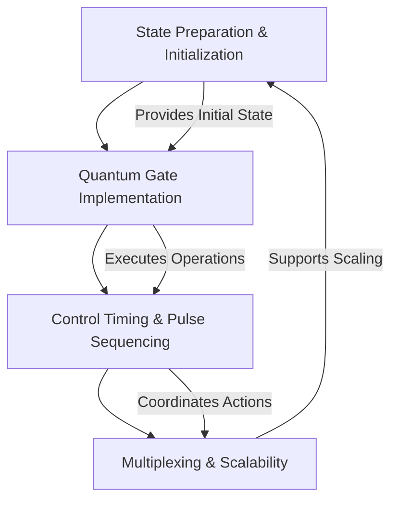
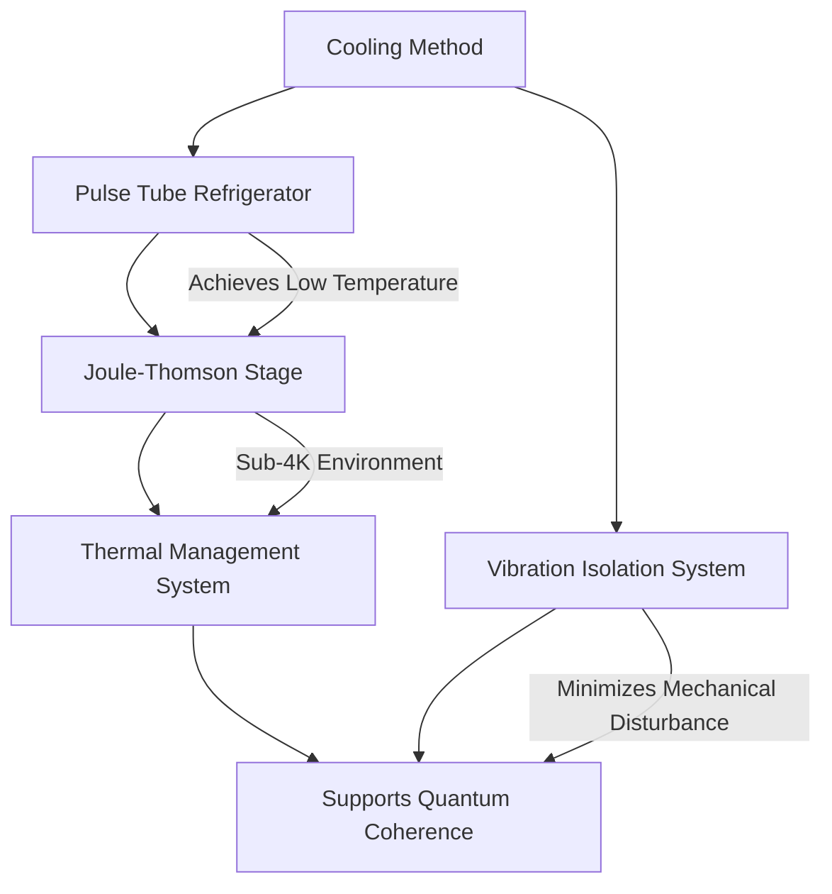
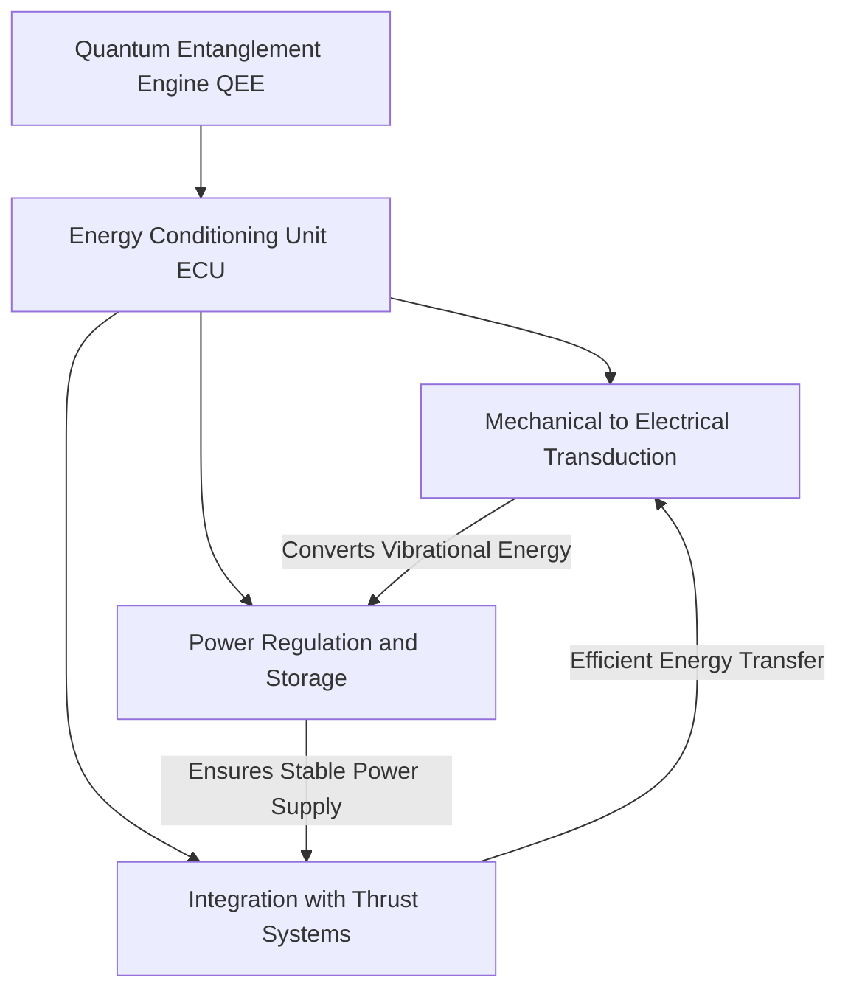
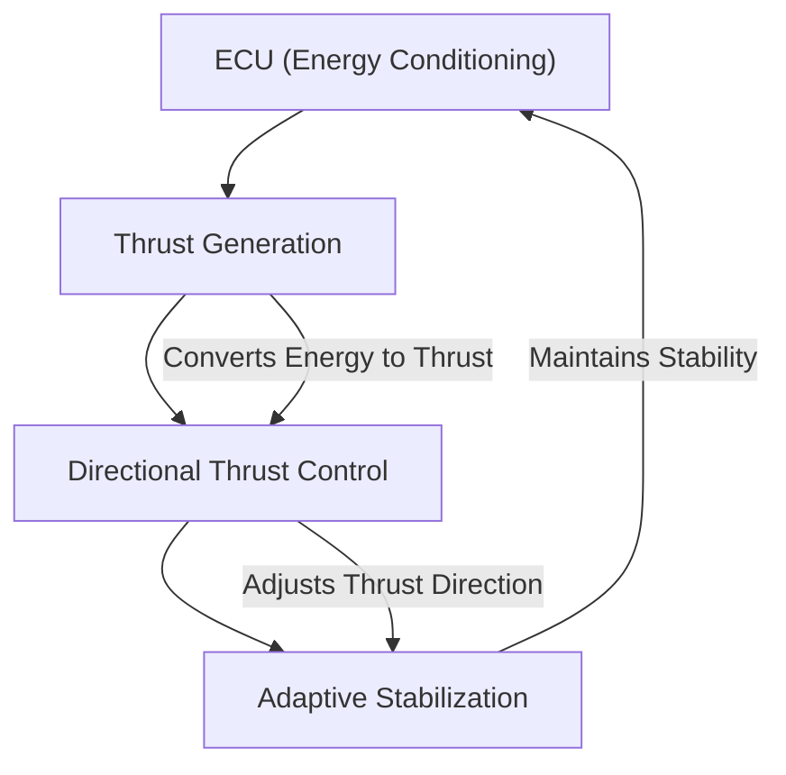
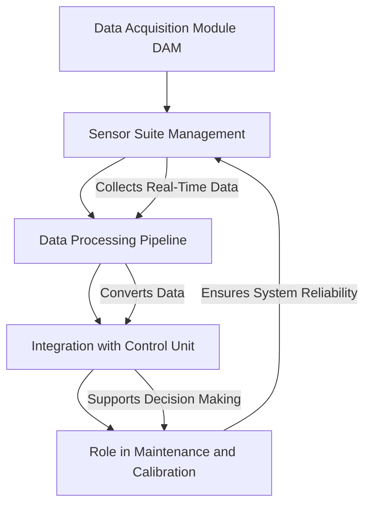
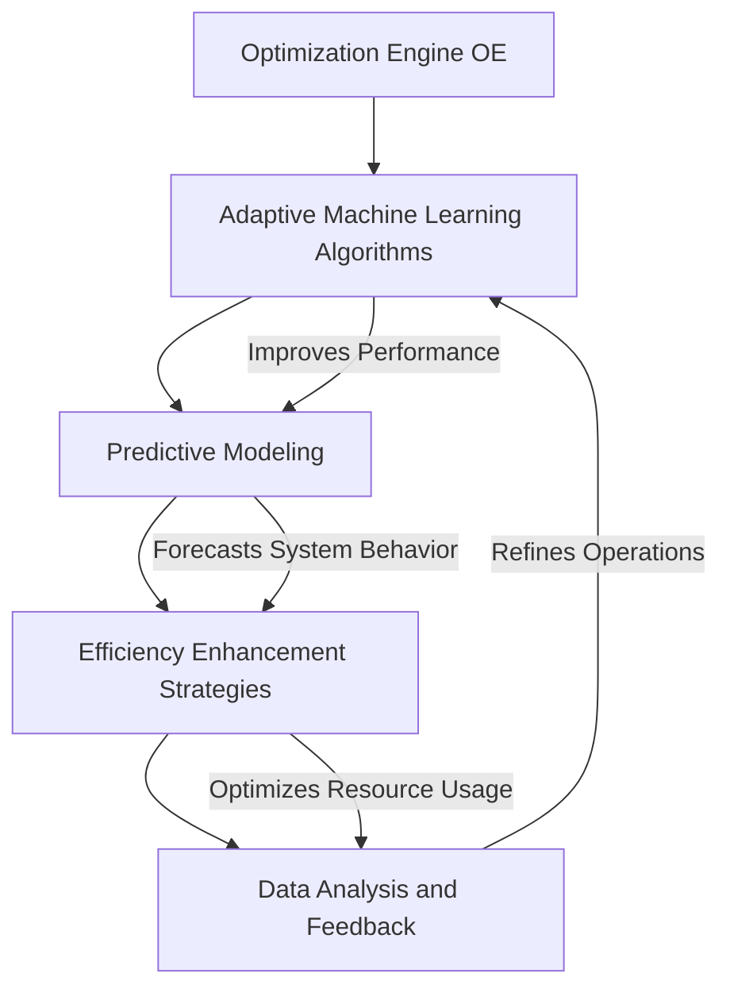
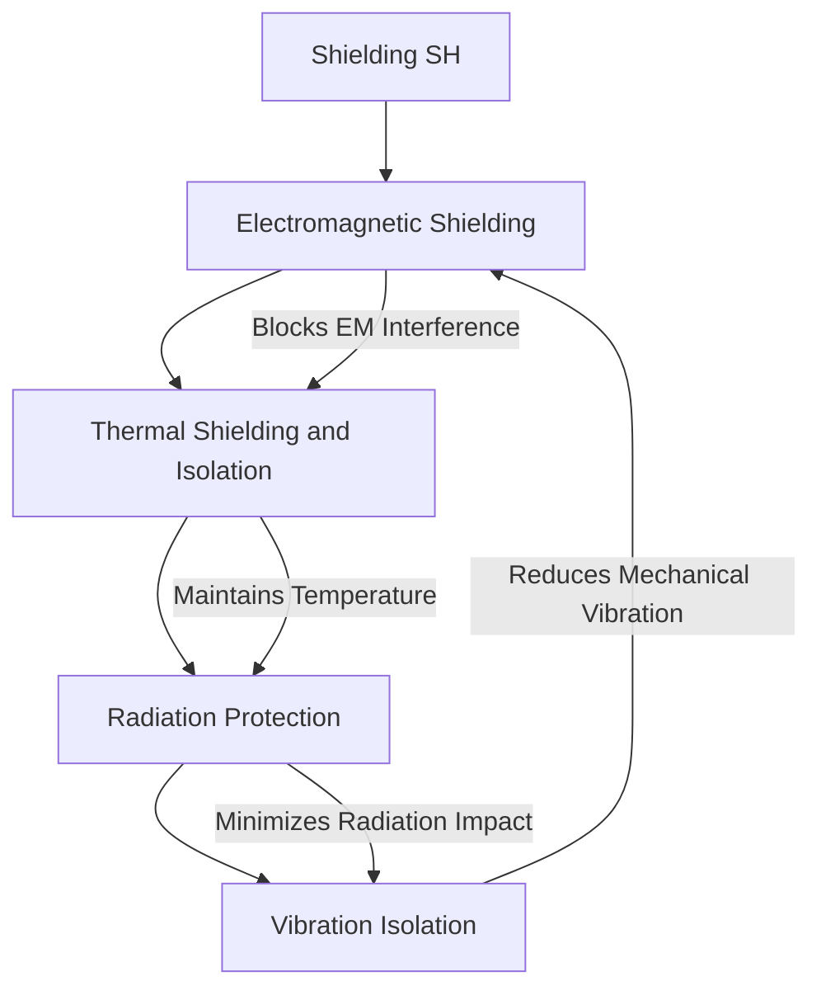

**Tip: Use Ctrl+F (or Cmd+F on Mac) to search this document for specific keywords, document codes (e.g., GPAM-AMPEL-0201-21), or ATA chapters.**<br>

**Quick Jump To Part:**
[Part 0](#part-0-summary) | [Part I](#part-i-summary) | [Part II](#part-ii-summary) | [Part III](#part-iii-summary) | [Part IV](#part-iv-summary) | [Part V](#part-v-summary) | [Part VI](#part-vi-summary) | [Part VII](#part-vii-summary) | [Part VIII](#part-viii-summary) | [Part IX](#part-ix-summary)

---

<details>
<summary><b>Cosmic Omnidevelopable Aero Foresights Index (COAFI) - Complete Table of Contents</b></summary>

- [Part 0: GAIA AIR - General and Governance (GP-GG)](#part-0-gaia-air---general-and-governance-gp-gg)
    - [0.1 Project Charter and Governance](#01-project-charter-and-governance)
    - [0.2 Vision, Mission, Values, and Ethics](#02-vision-mission-values-and-ethics)
    - [0.3 Project History](#03-project-history)
    - [0.4 Current Project Status and Short/Mid Term Objectives](#04-current-project-status-and-shortmid-term-objectives)
    - [0.5 Open Initiatives and Community Engagement](#05-open-initiatives-and-community-engagement)
- [Part I: GAIA PULSE ID (GP-ID) - Core Project Identity](#part-i-gaia-pulse-id-gp-id---core-project-identity)
    - [1.1 Vision, Mission, and Values](#11-vision-mission-and-values)
        - [1.1.1 The GAIA AIR Manifesto](#111-the-gaia-air-manifesto)
        - [1.1.2 Project History and Evolution](#112-project-history-and-evolution)
        - [1.1.3 Current Status and Objectives](#113-current-status-and-objectives)
        - [1.1.4 Future Directions and Foresights](#114-future-directions-and-foresights)
        - [1.1.5 Ethical Considerations & Framework](#115-ethical-considerations--framework)
        - [1.1.6 "Cosmic Index" Introduction and User Guide](#116-cosmic-index-introduction-and-user-guide)
        - [1.1.7 ML-P Integration](#117-ml-p-integration)
        - [1.1.8 Open Skyway Initiative](#118-open-skyway-initiative)
    - [1.2 Future Concepts and Initiatives](#12-future-concepts-and-initiatives)
    - [1.3 Numbering and Naming](#13-numbering-and-naming)
- [Part II: GAIA PULSE AIR MODULES (GPAM) - Atmospheric Operations](#part-ii-gaia-pulse-air-modules-gpam---atmospheric-operations)
    - [2.1 AMPEL360XWLRGA (Advanced Aircraft Systems)](#21-ampel360xwlrga-advanced-aircraft-systems)
- [Part III: GAIA PULSE SPACE MODULES (GPSM) - Orbital and Space Operations](#part-iii-gaia-pulse-space-modules-gpsm---orbital-and-space-operations)
- [Part IV: GAIA PULSE PROPULSION MODULES (GPPM) - Propulsion Technologies](#part-iv-gaia-pulse-propulsion-modules-gppm---propulsion-technologies)
- [Part V: GAIA PULSE GREENTECH & AERO COMMON MODULES (GPGM)](#part-v-gaia-pulse-greentech--aero-common-modules-gpgm)
- [Part VI: Project Management and Operations](#part-vi-project-management-and-operations)
- [Part VII: Documentation and Knowledge Management](#part-vii-documentation-and-knowledge-management)
- [Part VIII: Appendices](#part-viii-appendices)
- [Part IX: GAIA GALACTIC MINING OPERATIONS (GGMO)](#part-ix-gaia-galactic-mining-operations-ggmo)

</details>

---

<!-- ******************* END: PASTE THIS SECTION AT THE VERY TOP OF YOUR README.md ******************* -->

<details>
<summary id="part-0-summary"><b>Part 0: GAIA AIR - General and Governance (GP-GG)</b></summary>

[Back to Top](#cosmic-omnidevelopable-aero-foresights-index-coafi---complete-table-of-contents)

**Part Name:** Project Foundation & Governance

This part of the COAFI document provides overarching information about the GAIA AIR project, including governance structures, project charter, vision, mission, values, history, current status, and general project-level documentation applicable across all modules and initiatives.

### 0.1 Project Charter and Governance
[Back to Part 0](#part-0-gaia-air---general-and-governance-gp-gg) | [Back to Top](#cosmic-omnidevelopable-aero-foresights-index-coafi---complete-table-of-contents)

**Section Name:** Governance Documents

*   📄 **IN:** GP-GG-CHRT-0101-001-A - **[GAIA AIR Project Charter](docs/GP-GG/GP-GG-CHRT-0101-001-A.md)**
*   📄 **IN:** GP-GG-GOV-0101-002-A - **[GAIA AIR Governance Structure and Processes](docs/GP-GG/GP-GG-GOV-0101-002-A.md)**
*   📄 **IN:** GP-GG-RISK-0101-003-A - **[GAIA AIR Risk Management Framework](docs/GP-GG/GP-GG-RISK-0101-003-A.md)**
*   📄 **IN:** GP-GG-COMM-0101-004-A - **[GAIA AIR Communication Plan](docs/GP-GG/GP-GG-COMM-0101-004-A.md)**

### 0.2 Vision, Mission, Values, and Ethics
[Back to Part 0](#part-0-gaia-air---general-and-governance-gp-gg) | [Back to Top](#cosmic-omnidevelopable-aero-foresights-index-coafi---complete-table-of-contents)

**Section Name:** Core Identity - (Replicated from Part I for top-level access and discoverability)

*   📄 **IN:** GP-ID-VIS-0101-001-A - **[Long-Term Vision Statement](docs/GP-ID/GP-ID-VIS-0101-001-A.md)**
*   📄 **IN:** GP-ID-VIS-0101-002-A - **[Core Principles and Values](docs/GP-ID/GP-ID-VIS-0101-002-A.md)**
*   📄 **IN:** GP-ID-VIS-0101-003-A - **[Sustainability Commitment](docs/GP-ID/GP-ID-VIS-0101-003-A.md)**
*   📄 **IN:** GP-ID-VIS-0101-004-A - **[Technological Innovation Goals](docs/GP-ID/GP-ID-VIS-0101-004-A.md)**
*   📄 **IN:** GP-ID-VIS-0101-005-A - **[Community and Societal Impact](docs/GP-ID/GP-ID-VIS-0101-005-A.md)**
*   📄 **IN:** GP-ID-VIS-0101-006-A - **[Future-Forward Scalability](docs/GP-ID/GP-ID-VIS-0101-006-A.md)**
*   📄 **IN:** GP-ID-VIS-0101-007-A - **[Diversity and Inclusion Framework](docs/GP-ID/GP-ID-VIS-0101-007-A.md)**
*   📄 **IN:** GP-ID-VIS-0101-008-A - **[Global Partnership Strategy](docs/GP-ID/GP-ID-VIS-0101-008-A.md)**
*   📄 **IN:** GP-ID-ETH-0105-001-A - **[Ethics by Design Principles](docs/GP-ID/GP-ID-ETH-0105-001-A.md)**
*   📄 **IN:** GP-ID-ETH-0105-002-A - **[AI Ethics Guidelines](docs/GP-ID/GP-ID-ETH-0105-002-A.md)**
*   📄 **IN:** GP-ID-ETH-0105-003-A - **[Quantum Technology Ethics](docs/GP-ID/GP-ID-ETH-0105-003-A.md)**
*   📄 **IN:** GP-ID-ETH-0105-004-A - **[Data Privacy Ethics Framework](docs/GP-ID/GP-ID-ETH-0105-004-A.md)**

### 0.3 Project History
[Back to Part 0](#part-0-gaia-air---general-and-governance-gp-gg) | [Back to Top](#cosmic-omnidevelopable-aero-foresights-index-coafi---complete-table-of-contents)

**Section Name:** Project History & Background
*   📄 **IN:** GP-ID-HIST-0102-001-A - **[Founding Principles and Early Concepts](docs/GP-ID/GP-ID-HIST-0102-001-A.md)**
*   📄 **IN:** GP-ID-HIST-0102-002-A - **[Major Technological Milestones](docs/GP-ID/GP-ID-HIST-0102-002-A.md)**
*   📄 **IN:** GP-ID-HIST-0102-003-A - **[Roadmap Evolution](docs/GP-ID/GP-ID-HIST-0102-003-A.md)**
*   📄 **IN:** GP-ID-HIST-0102-004-A - **[Legacy System Analysis](docs/GP-ID/GP-ID-HIST-0102-004-A.md)**
*   📄 **IN:** GP-ID-HIST-0102-005-A - **[Stakeholder Collaboration History](docs/GP-ID/GP-ID-HIST-0102-005-A.md)**

### 0.4 Current Project Status and Short/Mid Term Objectives
[Back to Part 0](#part-0-gaia-air---general-and-governance-gp-gg) | [Back to Top](#cosmic-omnidevelopable-aero-foresights-index-coafi---complete-table-of-contents)

**Section Name:** Project Status & Objectives
*   📄 **IN:** GP-ID-STAT-0103-001-A - **[Current Project Status Report](docs/GP-ID/GP-ID-STAT-0103-001-A.md)**
*   📄 **IN:** GP-ID-STAT-0103-002-A - **[Short-Term Objectives (1-2 years)](docs/GP-ID/GP-ID-STAT-0103-002-A.md)**
*   📄 **IN:** GP-ID-STAT-0103-003-A - **[Mid-Term Objectives (2-5 years)](docs/GP-ID/GP-ID-STAT-0103-003-A.md)**
*   📄 **IN:** GP-ID-STAT-0103-004-A - **[Risk Assessment Report](docs/GP-ID/GP-ID-STAT-0103-004-A.md)**
*   📄 **IN:** GP-ID-STAT-0103-005-A - **[Financial Status Summary](docs/GP-ID/GP-ID-STAT-0103-005-A.md)**

### 0.5 Open Skyway Initiative
[Back to Part 0](#part-0-gaia-air---general-and-governance-gp-gg) | [Back to Top](#cosmic-omnidevelopable-aero-foresights-index-coafi---complete-table-of-contents)

**Section Name:** Open Skyway Initiative - (Top Level)

*   📄 **IN:** GP-ID-OPENSKY-0108-001-A - **[Open Skyway Initiative Charter](docs/GP-ID/GP-ID-OPENSKY-0108-001-A.md)**
*   📄 **IN:** GP-ID-OPENSKY-0108-002-A - **[Open Skyway Community Engagement Plan](docs/GP-ID/GP-ID-OPENSKY-0108-002-A.md)**
*   📄 **IN:** GP-ID-OPENSKY-0108-003-A - **[Open Skyway Technical Standards](docs/GP-ID/GP-ID-OPENSKY-0108-003-A.md)**

</details>

<details>
<summary id="part-i-summary"><b>Part I: GAIA PULSE ID (GP-ID) - Core Project Identity</b></summary>

[Back to Top](#cosmic-omnidevelopable-aero-foresights-index-coafi---complete-table-of-contents)

**Part Name:** GAIA PULSE Identity Documents

This part of the COAFI document details the core identity of the GAIA PULSE project, encompassing its vision, mission, values, ethical framework, and foundational elements that define the project's essence and direction.

### 1.1 Vision, Mission, and Values
[Back to Part I](#part-i-gaia-pulse-id-gp-id---core-project-identity) | [Back to Top](#cosmic-omnidevelopable-aero-foresights-index-coafi---complete-table-of-contents)

**Section Name:** Core Identity Documents

#### 1.1.1 The GAIA AIR Manifesto
[Back to Section 1.1](#11-vision-mission-and-values) | [Back to Part I](#part-i-gaia-pulse-id-gp-id---core-project-identity) | [Back to Top](#cosmic-omnidevelopable-aero-foresights-index-coafi---complete-table-of-contents)
*   📄 **IN:** GP-ID-MAN-0101-001-A - **[The GAIA AIR Manifesto](docs/GP-ID/GP-ID-MAN-0101-001-A.md)**

#### 1.1.2 Project History and Evolution
[Back to Section 1.1](#11-vision-mission-and-values) | [Back to Part I](#part-i-gaia-pulse-id-gp-id---core-project-identity) | [Back to Top](#cosmic-omnidevelopable-aero-foresights-index-coafi---complete-table-of-contents)
*   📄 **IN:** GP-ID-HIST-0102-001-A - **[Founding Principles and Early Concepts](docs/GP-ID/GP-ID-HIST-0102-001-A.md)** *(Linked also in Part 0)*
*   📄 **IN:** GP-ID-HIST-0102-002-A - **[Major Technological Milestones](docs/GP-ID/GP-ID-HIST-0102-002-A.md)** *(Linked also in Part 0)*
*   📄 **IN:** GP-ID-HIST-0102-003-A - **[Roadmap Evolution](docs/GP-ID/GP-ID-HIST-0102-003-A.md)** *(Linked also in Part 0)*
*   📄 **IN:** GP-ID-HIST-0102-004-A - **[Legacy System Analysis](docs/GP-ID/GP-ID-HIST-0102-004-A.md)** *(Linked also in Part 0)*
*   📄 **IN:** GP-ID-HIST-0102-005-A - **[Stakeholder Collaboration History](docs/GP-ID/GP-ID-HIST-0102-005-A.md)** *(Linked also in Part 0)*

#### 1.1.3 Current Status and Objectives
[Back to Section 1.1](#11-vision-mission-and-values) | [Back to Part I](#part-i-gaia-pulse-id-gp-id---core-project-identity) | [Back to Top](#cosmic-omnidevelopable-aero-foresights-index-coafi---complete-table-of-contents)
*   📄 **IN:** GP-ID-STAT-0103-001-A - **[Current Project Status Report](docs/GP-ID/GP-ID-STAT-0103-001-A.md)** *(Linked also in Part 0)*
*   📄 **IN:** GP-ID-STAT-0103-002-A - **[Short-Term Objectives (1-2 years)](docs/GP-ID/GP-ID-STAT-0103-002-A.md)** *(Linked also in Part 0)*
*   📄 **IN:** GP-ID-STAT-0103-003-A - **[Mid-Term Objectives (2-5 years)](docs/GP-ID/GP-ID-STAT-0103-003-A.md)** *(Linked also in Part 0)*
*   📄 **IN:** GP-ID-STAT-0103-004-A - **[Risk Assessment Report](docs/GP-ID/GP-ID-STAT-0103-004-A.md)** *(Linked also in Part 0)*
*   📄 **IN:** GP-ID-STAT-0103-005-A - **[Financial Status Summary](docs/GP-ID/GP-ID-STAT-0103-005-A.md)** *(Linked also in Part 0)*

#### 1.1.4 Future Directions and Foresights
[Back to Section 1.1](#11-vision-mission-and-values) | [Back to Part I](#part-i-gaia-pulse-id-gp-id---core-project-identity) | [Back to Top](#cosmic-omnidevelopable-aero-foresights-index-coafi---complete-table-of-contents)
*   📄 **IN:** GP-ID-FDIR-0104-001-A - **[Long-Term Future Directions and Expansions](docs/GP-ID/GP-ID-FDIR-0104-001-A.md)**
*   📄 **IN:** GP-ID-FDIR-0104-002-A - **[Technological Foresight and Emerging Tech Integration](docs/GP-ID/GP-ID-FDIR-0104-002-A.md)**
*   📄 **IN:** GP-ID-FDIR-0104-003-A - **[Societal and Industry Trend Analysis](docs/GP-ID/GP-ID-FDIR-0104-003-A.md)**
*   📄 **IN:** GP-ID-FDIR-0104-004-A - **[“Blue Sky” Research Initiatives and Concepts](docs/GP-ID/GP-ID-FDIR-0104-004-A.md)**

#### 1.1.5 Ethical Considerations & Framework
[Back to Section 1.1](#11-vision-mission-and-values) | [Back to Part I](#part-i-gaia-pulse-id-gp-id---core-project-identity) | [Back to Top](#cosmic-omnidevelopable-aero-foresights-index-coafi---complete-table-of-contents)
*   📄 **IN:** GP-ID-ETH-0105-001-A - **[Ethics by Design Principles](docs/GP-ID/GP-ID-ETH-0105-001-A.md)** *(Linked also in Part 0)*
*   📄 **IN:** GP-ID-ETH-0105-002-A - **[AI Ethics Guidelines](docs/GP-ID/GP-ID-ETH-0105-002-A.md)** *(Linked also in Part 0)*
*   📄 **IN:** GP-ID-ETH-0105-003-A - **[Quantum Technology Ethics](docs/GP-ID/GP-ID-ETH-0105-003-A.md)** *(Linked also in Part 0)*
*   📄 **IN:** GP-ID-ETH-0105-004-A - **[Data Privacy Ethics Framework](docs/GP-ID/GP-ID-ETH-0105-004-A.md)** *(Linked also in Part 0)*

#### 1.1.6 "Cosmic Index" Introduction and User Guide
[Back to Section 1.1](#11-vision-mission-and-values) | [Back to Part I](#part-i-gaia-pulse-id-gp-id---core-project-identity) | [Back to Top](#cosmic-omnidevelopable-aero-foresights-index-coafi---complete-table-of-contents)
*   📄 **IN:** GP-ID-COAFI-0106-001-A - **[Cosmic Index (COAFI) Introduction and Overview](docs/GP-ID/GP-ID-COAFI-0106-001-A.md)**
*   📄 **IN:** GP-ID-COAFI-0106-002-A - **[COAFI User Guide and Navigation Manual](docs/GP-ID/GP-ID-COAFI-0106-002-A.md)**

#### 1.1.7 ML-P Integration
[Back to Section 1.1](#11-vision-mission-and-values) | [Back to Part I](#part-i-gaia-pulse-id-gp-id---core-project-identity) | [Back to Top](#cosmic-omnidevelopable-aero-foresights-index-coafi---complete-table-of-contents)
*   📄 **IN:** GP-ID-MLP-0107-001-A - **[ML-P (Machine Learning Platform) Integration Strategy](docs/GP-ID/GP-ID-MLP-0107-001-A.md)**
*   📄 **IN:** GP-ID-MLP-0107-002-A - **[ML-P User Guide and Access Protocols](docs/GP-ID/GP-ID-MLP-0107-002-A.md)**

#### 1.1.8 Open Skyway Initiative
[Back to Section 1.1](#11-vision-mission-and-values) | [Back to Part I](#part-i-gaia-pulse-id-gp-id---core-project-identity) | [Back to Top](#cosmic-omnidevelopable-aero-foresights-index-coafi---complete-table-of-contents)
*   📄 **IN:** GP-ID-OPENSKY-0108-001-A - **[Open Skyway Initiative Charter](docs/GP-ID/GP-ID-OPENSKY-0108-001-A.md)** *(Linked also in Part 0)*
*   📄 **IN:** GP-ID-OPENSKY-0108-002-A - **[Open Skyway Community Engagement Plan](docs/GP-ID/GP-ID-OPENSKY-0108-002-A.md)** *(Linked also in Part 0)*
*   📄 **IN:** GP-ID-OPENSKY-0108-003-A - **[Open Skyway Technical Standards](docs/GP-ID/GP-ID-OPENSKY-0108-003-A.md)** *(Linked also in Part 0)*

### 1.2 Future Concepts and Initiatives
[Back to Part I](#part-i-gaia-pulse-id-gp-id---core-project-identity) | [Back to Top](#cosmic-omnidevelopable-aero-foresights-index-coafi---complete-table-of-contents)
*   📄 **IN:** GP-ID-FUT-0109-001-A - **[GAIA AIR Future Concepts Overview](docs/GP-ID/GP-ID-FUT-0109-001-A.md)**
*   📄 **IN:** GP-ID-FUT-0109-002-A - **[Advanced Mobility Solutions (Urban and Intercity)](docs/GP-ID/GP-ID-FUT-0109-002-A.md)**
*   📄 **IN:** GP-ID-FUT-0109-003-A - **[Sustainable Energy and Propulsion R&D Roadmap](docs/GP-ID/GP-ID-FUT-0109-003-A.md)**
*   📄 **IN:** GP-ID-FUT-0109-004-A - **[Galactic and Interstellar Ambitions (Long-Term Vision)](docs/GP-ID/GP-ID-FUT-0109-004-A.md)**

### 1.3 Numbering and Naming
[Back to Part I](#part-i-gaia-pulse-id-gp-id---core-project-identity) | [Back to Top](#cosmic-omnidevelopable-aero-foresights-index-coafi---complete-table-of-contents)
*   📄 **IN:** GP-ID-NUMNAM-0110-001-A - **[GAIA AIR Numbering and Naming Conventions](docs/GP-ID/GP-ID-NUMNAM-0110-001-A.md)**

</details>

<details>
<summary id="part-ii-summary"><b>Part II: GAIA PULSE AIR MODULES (GPAM) - Atmospheric Operations</b></summary>

[Back to Top](#cosmic-omnidevelopable-aero-foresights-index-coafi---complete-table-of-contents)

**Part Name:** AMPEL360XWLRGA - Aircraft Documentation

This part of the COAFI document contains all documentation related to the AMPEL360XWLRGA aircraft, organized primarily by ATA (Air Transport Association) chapters, and includes design specifications, analysis reports, manufacturing procedures, maintenance manuals, and certification documents.

### 2.1 AMPEL360XWLRGA (Advanced Aircraft Systems)
[Back to Part II](#part-ii-gaia-pulse-air-modules-gpam---atmospheric-operations) | [Back to Top](#cosmic-omnidevelopable-aero-foresights-index-coafi---complete-table-of-contents)

**Section Name:** AMPEL360XWLRGA Aircraft

* **Aircraft Type Designation:** AMPEL-360
* **P/N (Top-Level Assembly - for documentation purposes):** GAIAPULSE-AM-ASSY-00001-Q
* [2.1.1 ATA Chapters](#211-ata-chapters)
* **P/N:** GPAM-AMPEL-0201-ATA *(This is a general P/N for the ATA chapter breakdown itself, not a specific component)*

#### 2.1.1 ATA Chapters
[Back to Section 2.1](#21-ampel360xwlrga-advanced-aircraft-systems) | [Back to Part II](#part-ii-gaia-pulse-air-modules-gpam---atmospheric-operations) | [Back to Top](#cosmic-omnidevelopable-aero-foresights-index-coafi---complete-table-of-contents)
**P/N:** GPAM-AMPEL-0201-ATA *(Section P/N)*

##### 2.1.1.A ATA 05 - Time Limits/Maintenance Checks
[Back to Section 2.1.1](#211-ata-chapters) | [Back to Section 2.1](#21-ampel360xwlrga-advanced-aircraft-systems) | [Back to Part II](#part-ii-gaia-pulse-air-modules-gpam---atmospheric-operations) | [Back to Top](#cosmic-omnidevelopable-aero-foresights-index-coafi---complete-table-of-contents)
**P/N:** GPAM-AMPEL-0201-05 *(Section P/N)*
*   📄 **IN:** GPAM-AMPEL-0201-05-001 - **[Scheduled Maintenance Program (S1000D)](docs/GPAM/ATA05/GPAM-AMPEL-0201-05-001-A.md)**
*   📄 **IN:** GPAM-AMPEL-0201-05-002 - **[Maintenance Time Limits (S1000D)](docs/GPAM/ATA05/GPAM-AMPEL-0201-05-002-A.md)**
*   📄 **IN:** GPAM-AMPEL-0201-05-003 - **[Airworthiness Limitations (S1000D)](docs/GPAM/ATA05/GPAM-AMPEL-0201-05-003-A.md)**

##### 2.1.1.B ATA 06 - Dimensions and Areas
[Back to Section 2.1.1](#211-ata-chapters) | [Back to Section 2.1](#21-ampel360xwlrga-advanced-aircraft-systems) | [Back to Part II](#part-ii-gaia-pulse-air-modules-gpam---atmospheric-operations) | [Back to Top](#cosmic-omnidevelopable-aero-foresights-index-coafi---complete-table-of-contents)
**P/N:** GPAM-AMPEL-0201-06 *(Section P/N)*
*   📄 **IN:** GPAM-AMPEL-0201-06-001-A - **[Aircraft Dimensions and Stations (S1000D)](docs/GPAM/ATA06/GPAM-AMPEL-0201-06-001-A.md)**
*   📄 **IN:** GPAM-AMPEL-0201-06-002-A - **[Compartment Layout and Dimensions (S1000D)](docs/GPAM/ATA06/GPAM-AMPEL-0201-06-002-A.md)**
*   📄 **IN:** GPAM-AMPEL-0201-06-003-A - **[AMPEL360XWLRGA Measurement Point Definitions](docs/GPAM/ATA06/GPAM-AMPEL-0201-06-003-A.md)**

##### 2.1.1.C ATA 07 - Lifting and Shoring
[Back to Section 2.1.1](#211-ata-chapters) | [Back to Section 2.1](#21-ampel360xwlrga-advanced-aircraft-systems) | [Back to Part II](#part-ii-gaia-pulse-air-modules-gpam---atmospheric-operations) | [Back to Top](#cosmic-omnidevelopable-aero-foresights-index-coafi---complete-table-of-contents)
**P/N:** GPAM-AMPEL-0201-07 *(Section P/N)*
*   📄 **IN:** GPAM-AMPEL-0201-07-001 - **[Lifting Procedures and Diagrams (S1000D)](docs/GPAM/ATA07/GPAM-AMPEL-0201-07-001-A.md)**
*   📄 **IN:** GPAM-AMPEL-0201-07-002 - **[Shoring Procedures and Diagrams (S1000D)](docs/GPAM/ATA07/GPAM-AMPEL-0201-07-002-A.md)**

##### 2.1.1.D ATA 08 - Leveling and Weighing
[Back to Section 2.1.1](#211-ata-chapters) | [Back to Section 2.1](#21-ampel360xwlrga-advanced-aircraft-systems) | [Back to Part II](#part-ii-gaia-pulse-air-modules-gpam---atmospheric-operations) | [Back to Top](#cosmic-omnidevelopable-aero-foresights-index-coafi---complete-table-of-contents)
**P/N:** GPAM-AMPEL-0201-08 *(Section P/N)*
*   📄 **IN:** GPAM-AMPEL-0201-08-001 - **[Leveling Procedures (S100D)](docs/GPAM/ATA08/GPAM-AMPEL-0201-08-001-A.md)**
*   📄 **IN:** GPAM-AMPEL-0201-08-002 - **[Aircraft Weighing Procedures (S1000D)](docs/GPAM/ATA08/GPAM-AMPEL-0201-08-002-A.md)**

##### 2.1.1.E ATA 09 - Towing and Taxiing
[Back to Section 2.1.1](#211-ata-chapters) | [Back to Section 2.1](#21-ampel360xwlrga-advanced-aircraft-systems) | [Back to Part II](#part-ii-gaia-pulse-air-modules-gpam---atmospheric-operations) | [Back to Top](#cosmic-omnidevelopable-aero-foresights-index-coafi---complete-table-of-contents)
**P/N:** GPAM-AMPEL-0201-09 *(Section P/N)*
*   📄 **IN:** GPAM-AMPEL-0201-09-001 - **[Towing Procedures (S1000D)](docs/GPAM/ATA09/GPAM-AMPEL-0201-09-001-A.md)**
*   📄 **IN:** GPAM-AMPEL-0201-09-002 - **[Taxiing Procedures (S1000D)](docs/GPAM/ATA09/GPAM-AMPEL-0201-09-002-A.md)**

##### 2.1.1.F ATA 10 - Parking, Mooring, Storage and Return to Service
[Back to Section 2.1.1](#211-ata-chapters) | [Back to Section 2.1](#21-ampel360xwlrga-advanced-aircraft-systems) | [Back to Part II](#part-ii-gaia-pulse-air-modules-gpam---atmospheric-operations) | [Back to Top](#cosmic-omnidevelopable-aero-foresights-index-coafi---complete-table-of-contents)
**P/N:** GPAM-AMPEL-0201-10 *(Section P/N)*
*   📄 **IN:** GPAM-AMPEL-0201-10-001 - **[Parking Procedures (S1000D)](docs/GPAM/ATA10/GPAM-AMPEL-0201-10-001-A.md)**
*   📄 **IN:** GPAM-AMPEL-0201-10-002 - **[Mooring Procedures (S1000D)](docs/GPAM/ATA10/GPAM-AMPEL-0201-10-002-A.md)**
*   📄 **IN:** GPAM-AMPEL-0201-10-003 - **[Storage Procedures (S1000D)](docs/GPAM/ATA10/GPAM-AMPEL-0201-10-003-A.md)**
*   📄 **IN:** GPAM-AMPEL-0201-10-004 - **[Return to Service Procedures (S1000D)](docs/GPAM/ATA10/GPAM-AMPEL-0201-10-004-A.md)**
*   📄 **IN:** GPAM-AMPEL-0201-10-005 - **[Return to Service Checklists (S1000D)](docs/GPAM/ATA10/GPAM-AMPEL-0201-10-005-A.md)**

##### 2.1.1.G ATA 11 - Placards and Markings
[Back to Section 2.1.1](#211-ata-chapters) | [Back to Section 2.1](#21-ampel360xwlrga-advanced-aircraft-systems) | [Back to Part II](#part-ii-gaia-pulse-air-modules-gpam---atmospheric-operations) | [Back to Top](#cosmic-omnidevelopable-aero-foresights-index-coafi---complete-table-of-contents)
**P/N:** GPAM-AMPEL-0201-11 *(Section P/N)*
*   📄 **IN:** GPAM-AMPEL-0201-11-001 - **[Exterior Placards and Markings (S1000D)](docs/GPAM/ATA11/GPAM-AMPEL-0201-11-001-A.md)**
*   📄 **IN:** GPAM-AMPEL-0201-11-002 - **[Interior Placards and Markings (S1000D)](docs/GPAM/ATA11/GPAM-AMPEL-0201-11-002-A.md)**

##### 2.1.1.H ATA 12 - Servicing
[Back to Section 2.1.1](#211-ata-chapters) | [Back to Section 2.1](#21-ampel360xwlrga-advanced-aircraft-systems) | [Back to Part II](#part-ii-gaia-pulse-air-modules-gpam---atmospheric-operations) | [Back to Top](#cosmic-omnidevelopable-aero-foresights-index-coafi---complete-table-of-contents)
**P/N:** GPAM-AMPEL-0201-12 *(Section P/N)*
*   📄 **IN:** GPAM-AMPEL-0201-12-001 - **[Servicing Procedures (S1000D)](docs/GPAM/ATA12/GPAM-AMPEL-0201-12-001-A.md)**
*   📄 **IN:** GPAM-AMPEL-0201-12-002 - **[Servicing Equipment List (S1000D)](docs/GPAM/ATA12/GPAM-AMPEL-0201-12-002-A.md)**
*   📄 **IN:** GPAM-AMPEL-0201-12-003 - **[Cold Weather Maintenance Procedures (S1000D)](docs/GPAM/ATA12/GPAM-AMPEL-0201-12-003-A.md)**

##### 2.1.1.I ATA 20 - Standard Practices - Airframe systems
[Back to Section 2.1.1](#211-ata-chapters) | [Back to Section 2.1](#21-ampel360xwlrga-advanced-aircraft-systems) | [Back to Part II](#part-ii-gaia-pulse-air-modules-gpam---atmospheric-operations) | [Back to Top](#cosmic-omnidevelopable-aero-foresights-index-coafi---complete-table-of-contents)
**P/N:** GPAM-AMPEL-0201-20 *(Section P/N)*
*   📄 **IN:** GPAM-AMPEL-0201-20-001-A - **[Torque Values & Procedures (S1000D)](docs/GPAM/ATA20/GPAM-AMPEL-0201-20-001-A.md)**
*   📄 **IN:** GPAM-AMPEL-0201-20-002-A - **[Electrical Bonding Procedures (S1000D)](docs/GPAM/ATA20/GPAM-AMPEL-0201-20-002-A.md)**

##### 2.1.1.J ATA 21 - Air Conditioning:
[Back to Section 2.1.1](#211-ata-chapters) | [Back to Section 2.1](#21-ampel360xwlrga-advanced-aircraft-systems) | [Back to Part II](#part-ii-gaia-pulse-air-modules-gpam---atmospheric-operations) | [Back to Top](#cosmic-omnidevelopable-aero-foresights-index-coafi---complete-table-of-contents)
**P/N:** GPAM-AMPEL-0201-21 *(Section P/N)*
*   📄 **IN:** GPAM-AMPEL-0201-21-001-A - **[Air Conditioning System Schematics (S1000D)](docs/GPAM/ATA21/GPAM-AMPEL-0201-21-001-A.md)**
*   📄 **IN:** GPAM-AMPEL-0201-21-002-A - **[Cabin Temperature Control System (S1000D)](docs/GPAM/ATA21/GPAM-AMPEL-0201-21-002-A.md)**
*   📄 **IN:** GPAM-AMPEL-0201-21-003-A - **[Air Source Selection and Configuration (S1000D)](docs/GPAM/ATA21/GPAM-AMPEL-0201-21-003-A.md)**

##### 2.1.1.K ATA 22 - Auto Flight:
[Back to Section 2.1.1](#211-ata-chapters) | [Back to Section 2.1](#21-ampel360xwlrga-advanced-aircraft-systems) | [Back to Part II](#part-ii-gaia-pulse-air-modules-gpam---atmospheric-operations) | [Back to Top](#cosmic-omnidevelopable-aero-foresights-index-coafi---complete-table-of-contents)
**P/N:** GPAM-AMPEL-0201-22 *(Section P/N)*
*   📄 **IN:** GPAM-AMPEL-0201-22-001-A - **[Flight Control Computer Specifications (S1000D)](docs/GPAM/ATA22/GPAM-AMPEL-0201-22-001-A.md)**
*   📄 **IN:** GPAM-AMPEL-0201-22-002-A - **[Autopilot Modes and Functions (S1000D)](docs/GPAM/ATA22/GPAM-AMPEL-0201-22-002-A.md)**
*   📄 **IN:** GPAM-AMPEL-0201-22-003-A - **[Flight Director System Description (S1000D)](docs/GPAM/ATA22/GPAM-AMPEL-0201-22-003-A.md)**
*   📄 **IN:** GPAM-AMPEL-0201-22-004-A - **[Optimized Influence Protocol (OIP) for Pilot-Aircraft Synergy (S1000D)](docs/GPAM/ATA22/GPAM-AMPEL-0201-22-004-A.md)**

##### 2.1.1.L ATA 23 - Communications:
[Back to Section 2.1.1](#211-ata-chapters) | [Back to Section 2.1](#21-ampel360xwlrga-advanced-aircraft-systems) | [Back to Part II](#part-ii-gaia-pulse-air-modules-gpam---atmospheric-operations) | [Back to Top](#cosmic-omnidevelopable-aero-foresights-index-coafi---complete-table-of-contents)
**P/N:** GPAM-AMPEL-0201-23 *(Section P/N)*
*   📄 **IN:** GPAM-AMPEL-0201-23-001-A - **[VHF/UHF Radio Specifications (S1000D)](docs/GPAM/ATA23/GPAM-AMPEL-0201-23-001-A.md)**
*   📄 **IN:** GPAM-AMPEL-0201-23-002-A - **[Satellite Communication System (S1000D)](docs/GPAM/ATA23/GPAM-AMPEL-0201-23-002-A.md)**
*   📄 **IN:** GPAM-AMPEL-0201-23-003-A - **[Emergency Locator Transmitter (ELT) Design (S1000D)](docs/GPAM/ATA23/GPAM-AMPEL-0201-23-003-A.md)**
*   Yes, it is entirely possible—and quite innovative—to create an interconnected mesh of circular networks nested within a 3D star topology, resembling hexagonal molecular distributions. Here's how you might structure it and why it can be advantageous:

### Conceptual Framework:

- **3D Star Topology (Central Hub):**  
  Acts as the primary node or data center, managing high-level communication and distribution, employing secure quantum or post-quantum encrypted communication protocols to ensure security.

- **Circular Networks (Sub-Networks):**  
  These operate locally and independently as interconnected loops or ring topologies. Each ring ensures redundancy and fault tolerance within its immediate local network.

- **Mesh Interconnections:**  
  Each local circular network connects to adjacent circular networks in a mesh-like manner, providing multiple alternative pathways for communication and robust redundancy.

- **Hexagonal Molecular Distribution:**  
  This design mimics the stability and efficiency of hexagonal molecular arrangements (like graphene), optimizing communication paths, balance, and resilience.

### Key Benefits:

1. **High Fault Tolerance:**  
   Combining the redundancy of circular networks with mesh topology provides multiple communication paths, significantly enhancing fault tolerance.

2. **Enhanced Security:**  
   Distributed communication channels secured by quantum-safe cryptography provide robust defense against both conventional and emerging quantum threats.

3. **Scalability and Flexibility:**  
   Easily integrates new nodes or sub-networks without disrupting existing communications, allowing the architecture to scale fluidly.

4. **Balanced Load Distribution:**  
   The hexagonal molecular structure efficiently distributes communication loads, reducing congestion and improving performance.

5. **Real-Time Communication:**  
   Minimizes latency by allowing direct, localized exchanges within circular networks while maintaining strategic, centralized oversight through the star topology.

### Recommended Implementation Steps:

- **Define Clear Hierarchies:**  
  Central hubs manage strategic data; local circular networks handle operational communication.

- **Standardize Communication Protocols:**  
  Employ quantum-resistant cryptographic standards (e.g., CRYSTALS-Kyber or QKD) across all network levels.

- **Optimize Topological Placement:**  
  Design physical layout based on a hexagonal molecular distribution to maximize redundancy, balance, and scalability.

- **Establish Predictive Monitoring (AI-Driven):**  
  Integrate AI and quantum algorithms for predictive diagnostics, anomaly detection, and automated fault recovery.

This advanced architecture would deliver significant strategic and operational advantages, ensuring resilience, security, and efficiency in complex, high-stakes communication environments such as aerospace, industrial automation, or secure infrastructure networks.

##### 2.1.1.M ATA 24 - Electrical Power:
[Back to Section 2.1.1](#211-ata-chapters) | [Back to Section 2.1](#21-ampel360xwlrga-advanced-aircraft-systems) | [Back to Part II](#part-ii-gaia-pulse-air-modules-gpam---atmospheric-operations) | [Back to Top](#cosmic-omnidevelopable-aero-foresights-index-coafi---complete-table-of-contents)
**P/N:** GPAM-AMPEL-0201-24 *(Section P/N)*
*   📄 **IN:** GPAM-AMPEL-0201-24-001-A - **[Primary Power Generation System (S1000D)](docs/GPAM/ATA24/GPAM-AMPEL-0201-24-001-A.md)**
*   📄 **IN:** GPAM-AMPEL-0201-24-002-A - **[Power Distribution Schematics (S1000D)](docs/GPAM/ATA24/GPAM-AMPEL-0201-24-002-A.md)**
*   📄 **IN:** GPAM-AMPEL-0201-24-003-A - **[Emergency Power System (Backup Batteries) (S1000D)](docs/GPAM/ATA24/GPAM-AMPEL-0201-24-003-A.md)**
  ## Impact of Termination on Multipath Entanglement Purification (MEP)

The type of termination significantly impacts the fault tolerance of multipath entanglement purification (MEP) in bus topologies:

1. **Proper Dual Termination (120-ohm resistors at both ends):**
   - Crucial for signal integrity and reduction of reflections, enhancing reliability in entanglement distribution and MEP processes.

2. **Single Termination:**
   - Provides adequate termination but typically offers less fault tolerance compared to dual termination setups.

3. **Resistance Specifications:**
   - Termination resistance should align closely with ISO 11898-3 standards, ideally around 120 ohms but not below 100 ohms, crucial for maintaining high-quality signals necessary for effective MEP.

4. **Reduction of Signal Reflections:**
   - Proper termination significantly reduces reflections, minimizing potential errors in entanglement distribution and purification, thereby improving fault tolerance.

5. **Optimized Termination in Star-like Bus Topologies:**
   - Placing the secondary terminator at the farthest point from the main controller enhances network balance and fault tolerance in MEP operations.

By optimizing termination strategies, the reliability and efficiency of MEP can be notably improved, even though bus topologies inherently have fewer alternative paths compared to mesh or star topologies.

---

## Star Topology Advantages Over Daisy-Chained Topology

Specific scenarios where star topology demonstrates superior fault tolerance compared to daisy-chain topology include:

1. **Large-scale Networks:**
   - Failure of a single node affects only that node, allowing uninterrupted operation for the remaining network.

2. **Mission-Critical Systems:**
   - Ensures continuous functionality; the failure of one node does not compromise the entire system, making it ideal for critical operational environments.

3. **High-Traffic Networks:**
   - Better management of high data transmission rates through a central hub, reducing congestion-related failures.

4. **Dynamic Networks:**
   - Ease of adding or removing devices without network disruption, enhancing flexibility and fault tolerance.

5. **Diverse Device Integration:**
   - Accommodates various device and cable types, minimizing compatibility-related failures.

Despite the potential single point of failure at the central hub, redundancy measures can mitigate this risk effectively, maintaining high reliability, scalability, and ease of management.

---

**References:**

- [PLC Network Topologies](https://www.plctable.com/plc-network-topologies/)
- [Star Topology Advantages and Disadvantages](https://parikshapatr.com/solutions/star-topology-advantages-and-disadvantages)
- [Network Topology Explanation](https://nilesecure.com/network-design/what-is-network-topology-explanation-types-diagramming)
- [Understanding Network Topology](https://www.zenarmor.com/docs/network-basics/what-is-network-topology)
- [Network Topology Guide](https://www.websentra.com/network-topology-guide/)
- [Automation Community on Network Topology](https://automationcommunity.com/network-topology-2/)
- [Star vs. Daisy Chain Discussion](https://community.netgear.com/t5/Orbi/Star-vs-Daisy-Chain-Pros-Cons/td-p/1810726)
- [Network Topology Best Practices](https://www.oneadvanced.com/news-and-opinion/ito/what-is-network-topology-types-and-best-practices/)


##### 2.1.1.N ATA 25 - Equipment / Furnishings:
[Back to Section 2.1.1](#211-ata-chapters) | [Back to Section 2.1](#21-ampel360xwlrga-advanced-aircraft-systems) | [Back to Part II](#part-ii-gaia-pulse-air-modules-gpam---atmospheric-operations) | [Back to Top](#cosmic-omnidevelopable-aero-foresights-index-coafi---complete-table-of-contents)
**P/N:** GPAM-AMPEL-0201-25 *(Section P/N)*
*   📄 **IN:** GPAM-AMPEL-0201-25-001-A - **[Passenger Seat Specifications (S1000D)](docs/GPAM/ATA25/GPAM-AMPEL-0201-25-001-A.md)**
*   📄 **IN:** GPAM-AMPEL-0201-25-002-A - **[Galley Equipment Specifications (S1000D)](docs/GPAM/ATA25/GPAM-AMPEL-0201-25-002-A.md)**
*   📄 **IN:** GPAM-AMPEL-0201-25-003-A - **[Lavatory System Specifications (S1000D)](docs/GPAM/ATA25/GPAM-AMPEL-0201-25-003-A.md)**

##### 2.1.1.O ATA 26 - Fire Protection:
[Back to Section 2.1.1](#211-ata-chapters) | [Back to Section 2.1](#21-ampel360xwlrga-advanced-aircraft-systems) | [Back to Part II](#part-ii-gaia-pulse-air-modules-gpam---atmospheric-operations) | [Back to Top](#cosmic-omnidevelopable-aero-foresights-index-coafi---complete-table-of-contents)
**P/N:** GPAM-AMPEL-0201-26 *(Section P/N)*
*   📄 **IN:** GPAM-AMPEL-0201-26-001-A - **[Fire Detection System Description (S1000D)](docs/GPAM/ATA26/GPAM-AMPEL-0201-26-001-A.md)**
*   📄 **IN:** GPAM-AMPEL-0201-26-002-A - **[Fire Suppression System Description (S1000D)](docs/GPAM/ATA26/GPAM-AMPEL-0201-26-002-A.md)**

##### 2.1.1.P ATA 27 - Flight Controls:
[Back to Section 2.1.1](#211-ata-chapters) | [Back to Section 2.1](#21-ampel360xwlrga-advanced-aircraft-systems) | [Back to Part II](#part-ii-gaia-pulse-air-modules-gpam---atmospheric-operations) | [Back to Top](#cosmic-omnidevelopable-aero-foresights-index-coafi---complete-table-of-contents)
**P/N:** GPAM-AMPEL-0201-27 *(Section P/N)*
*   📄 **IN:** GPAM-AMPEL-0201-27-001-A - **[Primary Flight Control System Description (S1000D)](docs/GPAM/ATA27/GPAM-AMPEL-0201-27-001-A.md)**
*   📄 **IN:** GPAM-AMPEL-0201-27-002-A - **[Secondary Flight Control System Description (S1000D)](docs/GPAM/ATA27/GPAM-AMPEL-0201-27-002-A.md)**
*   📄 **IN:** GPAM-AMPEL-0201-27-003-A - **[High-Lift System Description (S1000D)](docs/GPAM/ATA27/GPAM-AMPEL-0201-27-003-A.md)**

##### 2.1.1.Q ATA 28 - Fuel:
[Back to Section 2.1.1](#211-ata-chapters) | [Back to Section 2.1](#21-ampel360xwlrga-advanced-aircraft-systems) | [Back to Part II](#part-ii-gaia-pulse-air-modules-gpam---atmospheric-operations) | [Back to Top](#cosmic-omnidevelopable-aero-foresights-index-coafi---complete-table-of-contents)
**P/N:** GPAM-AMPEL-0201-28 *(Section P/N)*
*   📄 **IN:** GPAM-AMPEL-0201-28-001-A - **[Fuel System Design (S1000D)](docs/GPAM/ATA28/GPAM-AMPEL-0201-28-001-A.md)**
*   📄 **IN:** GPAM-AMPEL-0201-28-002-A - **[Fuel Tanks Specifications (S1000D)](docs/GPAM/ATA28/GPAM-AMPEL-0201-28-002-A.md)**
*   📄 **IN:** GPAM-AMPEL-0201-28-003-A - **[Fuel Pumps and Distribution System (S1000D)](docs/GPAM/ATA28/GPAM-AMPEL-0201-28-003-A.md)**
*   📄 **IN:** GPAM-AMPEL-0201-28-004-A - **[Refueling Procedures (S100D)](docs/GPAM/ATA28/GPAM-AMPEL-0201-28-004-A.md)**

##### 2.1.1.Q.1  Alternative Energy Harvesting and Control System (AEHCS)
[Back to Section 2.1.1.Q](#211q-ata-28---fuel) | [Back to Section 2.1.1](#211-ata-chapters) | [Back to Section 2.1](#21-ampel360xwlrga-advanced-aircraft-systems) | [Back to Part II](#part-ii-gaia-pulse-air-modules-gpam---atmospheric-operations) | [Back to Top](#cosmic-omnidevelopable-aero-foresights-index-coafi---complete-table-of-contents)

###### 2.1.1.Q.1.1 AEHCS System Level Documents
[Back to Section 2.1.1.Q.1](#211q1--alternative-energy-harvesting-and-control-system-aehcs) | [Back to Section 2.1.1.Q](#211q-ata-28---fuel) | [Back to Section 2.1.1](#211-ata-chapters) | [Back to Section 2.1](#21-ampel360xwlrga-advanced-aircraft-systems) | [Back to Part II](#part-ii-gaia-pulse-air-modules-gpam---atmospheric-operations) | [Back to Top](#cosmic-omnidevelopable-aero-foresights-index-coafi---complete-table-of-contents)
**P/N:** GPAM-AMPEL-0201-28-Q *(Section P/N)*
*   📄 **IN:** GPAM-AMPEL-0201-28-Q1-001 - **[AEHCS System Overview and Architecture (S1000D)](docs/GPAM/ATA28-AEHCS/GPAM-AMPEL-0201-28-Q1-001-A.md)**
###### 2.1.1.Q.1.2 AEHCS Subcomponents Integration and Performance
[Back to Section 2.1.1.Q.1](#211q1--alternative-energy-harvesting-and-control-system-aehcs) | [Back to Section 2.1.1.Q](#211q-ata-28---fuel) | [Back to Section 2.1.1](#211-ata-chapters) | [Back to Section 2.1](#21-ampel360xwlrga-advanced-aircraft-systems) | [Back to Part II](#part-ii-gaia-pulse-air-modules-gpam---atmospheric-operations) | [Back to Top](#cosmic-omnidevelopable-aero-foresights-index-coafi---complete-table-of-contents)

*   📄 **IN:** GPAM-AMPEL-0201-28-Q2-003 - **[TENGs Integration and Performance (S1000D)](docs/GPAM/ATA28-AEHCS/GPAM-AMPEL-0201-28-Q2-003-A.md)**
*   📄 **IN:** GPAM-AMPEL-0201-28-Q2-004 - **[Piezoelectric Energy Harvesters Integration and Performance (S1000D)](docs/GPAM/ATA28-AEHCS/GPAM-AMPEL-0201-28-Q2-004-A.md)**
*   📄 **IN:** GPAM-AMPEL-0201-28-Q2-005 - **[Concave Solar Panels Design and Performance (S1000D)](docs/GPAM/ATA28-AEHCS/GPAM-AMPEL-0201-28-Q2-005-A.md)**

###### 2.1.1.Q.1.3 AEHCS Cryogenic and Battery Systems
[Back to Section 2.1.1.Q.1](#211q1--alternative-energy-harvesting-and-control-system-aehcs) | [Back to Section 2.1.1.Q](#211q-ata-28---fuel) | [Back to Section 2.1.1](#211-ata-chapters) | [Back to Section 2.1](#21-ampel360xwlrga-advanced-aircraft-systems) | [Back to Part II](#part-ii-gaia-pulse-air-modules-gpam---atmospheric-operations) | [Back to Top](#cosmic-omnidevelopable-aero-foresights-index-coafi---complete-table-of-contents)

*   📄 **IN:** GPAM-AMPEL-0201-28-Q4-002 - **[Cryogenic System Integration (S1000D)](docs/GPAM/ATA28-AEHCS/GPAM-AMPEL-0201-28-Q4-002-A.md)**
*   📄 **IN:** GPAM-AMPEL-0201-28-Q5-002 - **[Battery Management System Integration (S1000D)](docs/GPAM/ATA28-AEHCS/GPAM-AMPEL-0201-28-Q5-002-A.md)**

###### 2.1.1.Q.1.4 AEHCS AI Control and Monitoring
[Back to Section 2.1.1.Q.1](#211q1--alternative-energy-harvesting-and-control-system-aehcs) | [Back to Section 2.1.1.Q](#211q-ata-28---fuel) | [Back to Section 2.1.1](#211-ata-chapters) | [Back to Section 2.1](#21-ampel360xwlrga-advanced-aircraft-systems) | [Back to Part II](#part-ii-gaia-pulse-air-modules-gpam---atmospheric-operations) | [Back to Top](#cosmic-omnidevelopable-aero-foresights-index-coafi---complete-table-of-contents)

*   📄 **IN:** GPAM-AMPEL-0201-28-Q6-001 - **[AI Control Algorithms (S1000D)](docs/GPAM/ATA28-AEHCS/GPAM-AMPEL-0201-28-Q6-001-A.md)**
*   📄 **IN:** GPAM-AMPEL-0201-28-Q6-002 - **[Real-Time Monitoring Procedures (S1000D)](docs/GPAM/ATA28-AEHCS/GPAM-AMPEL-0201-28-Q6-002-A.md)**

###### 2.1.1.Q.1.5 AEHCS Performance and Testing
[Back to Section 2.1.1.Q.1](#211q1--alternative-energy-harvesting-and-control-system-aehcs) | [Back to Section 2.1.1.Q](#211q-ata-28---fuel) | [Back to Section 2.1.1](#211-ata-chapters) | [Back to Section 2.1](#21-ampel360xwlrga-advanced-aircraft-systems) | [Back to Part II](#part-ii-gaia-pulse-air-modules-gpam---atmospheric-operations) | [Back to Top](#cosmic-omnidevelopable-aero-foresights-index-coafi---complete-table-of-contents)

*   📄 **IN:** GPAM-AMPEL-0201-28-Q7-001 - **[Performance Test Results (S1000D)](docs/GPAM/ATA28-AEHCS/GPAM-AMPEL-0201-28-Q7-001-A.md)**
*   📄 **IN:** GPAM-AMPEL-0201-28-Q7-002 - **[Efficiency Data Analysis (S1000D)](docs/GPAM/ATA28-AEHCS/GPAM-AMPEL-0201-28-Q7-002-A.md)**

###### 2.1.1.Q.1.6 AEHCS Safety and Redundancy
[Back to Section 2.1.1.Q.1](#211q1--alternative-energy-harvesting-and-control-system-aehcs) | [Back to Section 2.1.1.Q](#211q-ata-28---fuel) | [Back to Section 2.1.1](#211-ata-chapters) | [Back to Section 2.1](#21-ampel360xwlrga-advanced-aircraft-systems) | [Back to Part II](#part-ii-gaia-pulse-air-modules-gpam---atmospheric-operations) | [Back to Top](#cosmic-omnidevelopable-aero-foresights-index-coafi---complete-table-of-contents)

*   📄 **IN:** GPAM-AMPEL-0201-28-Q8-001 - **[Fail-Safe Mechanisms (S1000D)](docs/GPAM/ATA28-AEHCS/GPAM-AMPEL-0201-28-Q8-001-A.md)**
*   📄 **IN:** GPAM-AMPEL-0201-28-Q8-002 - **[Redundancy Protocols (S1000D)](docs/GPAM/ATA28-AEHCS/GPAM-AMPEL-0201-28-Q8-002-A.md)**

###### 2.1.1.Q.1.7 AEHCS Maintenance and Inspection
[Back to Section 2.1.1.Q.1](#211q1--alternative-energy-harvesting-and-control-system-aehcs) | [Back to Section 2.1.1.Q](#211q-ata-28---fuel) | [Back to Section 2.1.1](#211-ata-chapters) | [Back to Section 2.1](#21-ampel360xwlrga-advanced-aircraft-systems) | [Back to Part II](#part-ii-gaia-pulse-air-modules-gpam---atmospheric-operations) | [Back to Top](#cosmic-omnidevelopable-aero-foresights-index-coafi---complete-table-of-contents)

*   📄 **IN:** GPAM-AMPEL-0201-28-Q9-001 - **[Maintenance Procedures (S1000D)](docs/GPAM/ATA28-AEHCS/GPAM-AMPEL-0201-28-Q9-001-A.md)**
    *   **DMC:** DMC-GAIAPULSE-AMPEL-0201-28-Q9-001-A-001-00_EN-US
    *   **Document:** GPAM-AMPEL-0201-28-Q9-001-A.md

*   📄 **IN:** GPAM-AMPEL-0201-28-Q9-002 - **[Inspection Checklists (S1000D)](docs/GPAM/ATA28-AEHCS/GPAM-AMPEL-0201-28-Q9-002-A.md)**
    *   **DMC:** DMC-GAIAPULSE-AMPEL-0201-28-Q9-002-A-001-00_EN-US
    *   **Document:** GPAM-AMPEL-0201-28-Q9-002-A.md

##### 2.1.1.R ATA 29 - Hydraulic Power:
[Back to Section 2.1.1](#211-ata-chapters) | [Back to Section 2.1](#21-ampel360xwlrga-advanced-aircraft-systems) | [Back to Part II](#part-ii-gaia-pulse-air-modules-gpam---atmospheric-operations) | [Back to Top](#cosmic-omnidevelopable-aero-foresights-index-coafi---complete-table-of-contents)

**P/N:** GPAM-AMPEL-0201-29 *(Section P/N)*
*   📄 **IN:** GPAM-AMPEL-0201-29-001 - **[Hydraulic System Schematics (S1000D)](docs/GPAM/ATA29/GPAM-AMPEL-0201-29-001-A.md)**
    *   **DMC:** DMC-GAIAPULSE-AMPEL-0201-29-001-A-001-00_EN-US
    *   **Document:** GPAM-AMPEL-0201-29-001-A.md

*   📄 **IN:** GPAM-AMPEL-0201-29-002 - **[Hydraulic Pumps and Power Units (S1000D)](docs/GPAM/ATA29/GPAM-AMPEL-0201-29-002-A.md)**
    *   **DMC:** DMC-GAIAPULSE-AMPEL-0201-29-002-A-001-00_EN-US
    *   **Document:** GPAM-AMPEL-0201-29-002-A.md

*   📄 **IN:** GPAM-AMPEL-0201-29-003 - **[Hydraulic Actuators Specifications (S1000D)](docs/GPAM/ATA29/GPAM-AMPEL-0201-29-003-A.md)**
    *   **DMC:** DMC-GAIAPULSE-AMPEL-0201-29-003-A-001-00_EN-US
    *   **Document:** GPAM-AMPEL-0201-29-003-A.md

*   📄 **IN:** GPAM-AMPEL-0201-29-004-A - **[Hydraulic Fluid Servicing (S1000D)](docs/GPAM/ATA29/GPAM-AMPEL-0201-29-004-A.md)**
    *   **DMC:** DMC-GAIAPULSE-AMPEL-0201-29-004-A-001-00_EN-US
    *   **Document:** GPAM-AMPEL-0201-29-004-A.md

##### 2.1.1.S ATA 30 - Ice and Rain Protection:
[Back to Section 2.1.1](#211-ata-chapters) | [Back to Section 2.1](#21-ampel360xwlrga-advanced-aircraft-systems) | [Back to Part II](#part-ii-gaia-pulse-air-modules-gpam---atmospheric-operations) | [Back to Top](#cosmic-omnidevelopable-aero-foresights-index-coafi---complete-table-of-contents)
**P/N:** GPAM-AMPEL-0201-30 *(Section P/N)*
*   📄 **IN:** GPAM-AMPEL-0201-30-001-A - **[Wing De-Icing System (S1000D)](docs/GPAM/ATA30/GPAM-AMPEL-0201-30-001-A.md)**
    *   **DMC:** DMC-GAIAPULSE-AMPEL-0201-30-001-A-001-00_EN-US
    *   **Document:** GPAM-AMPEL-0201-30-001-A.md

*   📄 **IN:** GPAM-AMPEL-0201-30-002-A - **[Windshield Wiper System (S1000D)](docs/GPAM/ATA30/GPAM-AMPEL-0201-30-002-A.md)**
    *   **DMC:** DMC-GAIAPULSE-AMPEL-0201-30-002-A-001-00_EN-US
    *   **Document:** GPAM-AMPEL-0201-30-002-A.md

##### 2.1.1.T ATA 31 - Instruments:
[Back to Section 2.1.1](#211-ata-chapters) | [Back to Section 2.1](#21-ampel360xwlrga-advanced-aircraft-systems) | [Back to Part II](#part-ii-gaia-pulse-air-modules-gpam---atmospheric-operations) | [Back to Top](#cosmic-omnidevelopable-aero-foresights-index-coafi---complete-table-of-contents)
**P/N:** GPAM-AMPEL-0201-31 *(Section P/N)*
*   📄 **IN:** GPAM-AMPEL-0201-31-001-A - **[Flight Instrument Calibration Procedures (S1000D)](docs/GPAM/ATA31/GPAM-AMPEL-0201-31-001-A.md)**
    *   **DMC:** DMC-GAIAPULSE-AMPEL-0201-31-001-A-001-00_EN-US
    *   **Document:** GPAM-AMPEL-0201-31-001-A.md

*   📄 **IN:** GPAM-AMPEL-0201-31-002-A - **[Instrument Panel Layout Diagrams (S1000D)](docs/GPAM/ATA31/GPAM-AMPEL-0201-31-002-A.md)**
    *   **DMC:** DMC-GAIAPULSE-AMPEL-0201-31-002-A-001-00_EN-US
    *   **Document:** GPAM-AMPEL-0201-31-002-A.md

*   📄 **IN:** GPAM-AMPEL-0201-31-003-A - **[Flight Instruments Specifications (S1000D)](docs/GPAM/ATA31/GPAM-AMPEL-0201-31-003-A.md)**
    *   **DMC:** DMC-GAIAPULSE-AMPEL-0201-31-003-A-001-00_EN-US
    *   **Document:** GPAM-AMPEL-0201-31-003-A.md

*   📄 **IN:** GPAM-AMPEL-0201-31-004-A - **[Engine Instruments Specifications (S1000D)](docs/GPAM/ATA31/GPAM-AMPEL-0201-31-004-A.md)**
    *   **DMC:** DMC-GAIAPULSE-AMPEL-0201-31-004-A-001-00_EN-US
    *   **Document:** GPAM-AMPEL-0201-31-004-A.md

*   📄 **IN:** GPAM-AMPEL-0201-31-005-A - **[Navigation Instruments Specifications (S1000D)](docs/GPAM/ATA31/GPAM-AMPEL-0201-31-005-A.md)**
    *   **DMC:** DMC-GAIAPULSE-AMPEL-0201-31-005-A-001-00_EN-US
    *   **Document:** GPAM-AMPEL-0201-31-005-A.md

*   📄 **IN:** GPAM-AMPEL-0201-31-006-A - **[Warning and Caution System Specifications (S1000D)](docs/GPAM/ATA31/GPAM-AMPEL-0201-31-006-A.md)**
    *   **DMC:** DMC-GAIAPULSE-AMPEL-0201-31-006-A-001-00_EN-US
    *   **Document:** GPAM-AMPEL-0201-31-006-A.md

*   📄 **IN:** GPAM-AMPEL-0201-31-007-A - **[Instruments System Maintenance Manual (S1000D)](docs/GPAM/ATA31/GPAM-AMPEL-0201-31-007-A.md)**
    *   **DMC:** DMC-GAIAPULSE-AMPEL-0201-31-007-A-001-00_EN-US
    *   **Document:** GPAM-AMPEL-0201-31-007-A.md

*   📄 **IN:** GPAM-AMPEL-0201-31-008-A - **[Instruments System Troubleshooting Guide (S1000D)](docs/GPAM/ATA31/GPAM-AMPEL-0201-31-008-A.md)**
    *   **DMC:** DMC-GAIAPULSE-AMPEL-0201-31-008-A-001-00_EN-US
    *   **Document:** GPAM-AMPEL-0201-31-008-A.md

*   📄 **IN:** GPAM-AMPEL-0201-31-009-A - **[Instruments System FMEA Report (S1000D)](docs/GPAM/ATA31/GPAM-AMPEL-0201-31-009-A.md)**
    *   **DMC:** DMC-GAIAPULSE-AMPEL-0201-31-009-A-001-00_EN-US
    *   **Document:** GPAM-AMPEL-0201-31-009-A.md

*   📄 **IN:** GPAM-AMPEL-0201-31-010-A - **[Instruments System Validation and Test Plan (S1000D)](docs/GPAM/ATA31/GPAM-AMPEL-0201-31-010-A.md)**
    *   **DMC:** DMC-GAIAPULSE-AMPEL-0201-31-010-A-001-00_EN-US
    *   **Document:** GPAM-AMPEL-0201-31-010-A.md

##### 2.1.1.U ATA 32 - Landing Gear:
[Back to Section 2.1.1](#211-ata-chapters) | [Back to Section 2.1](#21-ampel360xwlrga-advanced-aircraft-systems) | [Back to Part II](#part-ii-gaia-pulse-air-modules-gpam---atmospheric-operations) | [Back to Top](#cosmic-omnidevelopable-aero-foresights-index-coafi---complete-table-of-contents)
**P/N:** GPAM-AMPEL-0201-32 *(Section P/N)*
*   📄 **IN:** GPAM-AMPEL-0201-32-001-A - **[Landing Gear Structural Design (S1000D)](docs/GPAM/ATA32/GPAM-AMPEL-0201-32-001-A.md)**
    *   **DMC:** DMC-GAIAPULSE-AMPEL-0201-32-001-A-001-00_EN-US
    *   **Document:** GPAM-AMPEL-0201-32-001-A.md

*   📄 **IN:** GPAM-AMPEL-0201-32-002-A - **[Retraction/Extension System (S1000D)](docs/GPAM/ATA32/GPAM-AMPEL-0201-32-002-A.md)**
    *   **DMC:** DMC-GAIAPULSE-AMPEL-0201-32-002-A-001-00_EN-US
    *   **Document:** GPAM-AMPEL-0201-32-002-A.md

*   📄 **IN:** GPAM-AMPEL-0201-32-003-A - **[Braking System Specifications (S1000D)](docs/GPAM/ATA32/GPAM-AMPEL-0201-32-003-A.md)**
    *   **DMC:** DMC-GAIAPULSE-AMPEL-0201-32-003-A-001-00_EN-US
    *   **Document:** GPAM-AMPEL-0201-32-003-A.md

##### 2.1.1.V ATA 33 - Lights:
[Back to Section 2.1.1](#211-ata-chapters) | [Back to Section 2.1](#21-ampel360xwlrga-advanced-aircraft-systems) | [Back to Part II](#part-ii-gaia-pulse-air-modules-gpam---atmospheric-operations) | [Back to Top](#cosmic-omnidevelopable-aero-foresights-index-coafi---complete-table-of-contents)
**P/N:** GPAM-AMPEL-0201-33 *(Section P/N)*
*   📄 **IN:** GPAM-AMPEL-0201-33-001-A - **[Exterior Lighting System (S1000D)](docs/GPAM/ATA33/GPAM-AMPEL-0201-33-001-A.md)**
    *   **DMC:** DMC-GAIAPULSE-AMPEL-0201-33-001-A-001-00_EN-US
    *   **Document:** GPAM-AMPEL-0201-33-001-A.md

*   📄 **IN:** GPAM-AMPEL-0201-33-002-A - **[Interior Emergency Lighting (S1000D)](docs/GPAM/ATA33/GPAM-AMPEL-0201-33-002-A.md)**
    *   **DMC:** DMC-GAIAPULSE-AMPEL-0201-33-002-A-001-00_EN-US
    *   **Document:** GPAM-AMPEL-0201-33-002-A.md

##### 2.1.1.W ATA 34 - Navigation:
[Back to Section 2.1.1](#211-ata-chapters) | [Back to Section 2.1](#21-ampel360xwlrga-advanced-aircraft-systems) | [Back to Part II](#part-ii-gaia-pulse-air-modules-gpam---atmospheric-operations) | [Back to Top](#cosmic-omnidevelopable-aero-foresights-index-coafi---complete-table-of-contents)
**P/N:** GPAM-AMPEL-0201-34 *(Section P/N)*
*   📄 **IN:** GPAM-AMPEL-0201-34-W1-001 - **[GPS Receiver Specifications (S1000D)](docs/GPAM/ATA34/GPAM-AMPEL-0201-34-W1-001-A.md)**
    *   **DMC:** DMC-GAIAPULSE-AMPEL-0201-34-W1-001-A-001-00_EN-US
    *   **Document:** GPAM-AMPEL-0201-34-W1-001-A.md

*   📄 **IN:** GPAM-AMPEL-0201-34-W1-002 - **[GPS Antenna Design (S1000D)](docs/GPAM/ATA34/GPAM-AMPEL-0201-34-W1-002-A.md)**
    *   **DMC:** DMC-GAIAPULSE-AMPEL-0201-34-W1-002-A-001-00_EN-US
    *   **Document:** GPAM-AMPEL-0201-34-W1-002-A.md

*   📄 **IN:** GPAM-AMPEL-0201-34-W2-001 - **[INS Specifications (S1000D)](docs/GPAM/ATA34/GPAM-AMPEL-0201-34-W2-001-A.md)**
    *   **DMC:** DMC-GAIAPULSE-AMPEL-0201-34-W2-001-A-001-00_EN-US
    *   **Document:** GPAM-AMPEL-0201-34-W2-001-A.md

*   📄 **IN:** GPAM-AMPEL-0201-34-W2-002 - **[Quantum Enhancement for INS (S1000D)](docs/GPAM/ATA34/GPAM-AMPEL-0201-34-W2-002-A.md)**
    *   **DMC:** DMC-GAIAPULSE-AMPEL-0201-34-W2-002-A-001-00_EN-US
    *   **Document:** GPAM-AMPEL-0201-34-W2-002-A.md

*   📄 **IN:** GPAM-AMPEL-0201-34-W3-001 - **[RNAV System Description (S1000D)](docs/GPAM/ATA34/GPAM-AMPEL-0201-34-W3-001-A.md)**
    *   **DMC:** DMC-GAIAPULSE-AMPEL-0201-34-W3-001-A-001-00_EN-US
    *   **Document:** GPAM-AMPEL-0201-34-W3-001-A.md

*   📄 **IN:** GPAM-AMPEL-0201-34-W3-002 - **[RNP Approach Procedures (S1000D)](docs/GPAM/ATA34/GPAM-AMPEL-0201-34-W3-002-A.md)**
    *   **DMC:** DMC-GAIAPULSE-AMPEL-0201-34-W3-002-A-001-00_EN-US
    *   **Document:** GPAM-AMPEL-0201-34-W3-002-A.md

*   📄 **IN:** GPAM-AMPEL-0201-34-W4-001 - **[Q-01 Navigation Interface Protocols (S1000D)](docs/GPAM/ATA34/GPAM-AMPEL-0201-34-W4-001-A.md)**
    *   **DMC:** DMC-GAIAPULSE-AMPEL-0201-34-W4-001-A-001-00_EN-US
    *   **Document:** GPAM-AMPEL-0201-34-W4-001-A.md

*   📄 **IN:** GPAM-AMPEL-0201-34-W4-002 - **[Navigation Algorithms for Q-01 Integration (S1000D)](docs/GPAM/ATA34/GPAM-AMPEL-0201-34-W4-002-A.md)**
    *   **DMC:** DMC-GAIAPULSE-AMPEL-0201-34-W4-002-A-001-00_EN-US
    *   **Document:** GPAM-AMPEL-0201-34-W4-002-A.md

##### 2.1.1.X ATA 35 - Oxygen:
[Back to Section 2.1.1](#211-ata-chapters) | [Back to Section 2.1](#21-ampel360xwlrga-advanced-aircraft-systems) | [Back to Part II](#part-ii-gaia-pulse-air-modules-gpam---atmospheric-operations) | [Back to Top](#cosmic-omnidevelopable-aero-foresights-index-coafi---complete-table-of-contents)
**P/N:** GPAM-AMPEL-0201-35 *(Section P/N)*
*   📄 **IN:** GPAM-AMPEL-0201-35-001-A - **[Crew Oxygen System (S1000D)](docs/GPAM/ATA35/GPAM-AMPEL-0201-35-001-A.md)**
    *   **DMC:** DMC-GAIAPULSE-AMPEL-0201-35-001-A-001-00_EN-US
    *   **Document:** GPAM-AMPEL-0201-35-001-A.md

*   📄 **IN:** GPAM-AMPEL-0201-35-002-A - **[Passenger Oxygen System (S1000D)](docs/GPAM/ATA35/GPAM-AMPEL-0201-35-002-A.md)**
    *   **DMC:** DMC-GAIAPULSE-AMPEL-0201-35-002-A-001-00_EN-US
    *   **Document:** GPAM-AMPEL-0201-35-002-A.md

##### 2.1.1.Y ATA 36 - Pneumatic:
[Back to Section 2.1.1](#211-ata-chapters) | [Back to Section 2.1](#21-ampel360xwlrga-advanced-aircraft-systems) | [Back to Part II](#part-ii-gaia-pulse-air-modules-gpam---atmospheric-operations) | [Back to Top](#cosmic-omnidevelopable-aero-foresights-index-coafi---complete-table-of-contents)
**P/N:** GPAM-AMPEL-0201-36 *(Section P/N)*
*   📄 **IN:** GPAM-AMPEL-0201-36-001-A - **[Pneumatic System Design and Schematics (S1000D)](docs/GPAM/ATA36/GPAM-AMPEL-0201-36-001-A.md)**
    *   **DMC:** DMC-GAIAPULSE-AMPEL-0201-36-001-A-001-00_EN-US
    *   **Document:** GPAM-AMPEL-0201-36-001-A.md

*   📄 **IN:** GPAM-AMPEL-0201-36-002-A - **[Bleed Air System Specifications (S1000D)](docs/GPAM/ATA36/GPAM-AMPEL-0201-36-002-A.md)**
    *   **DMC:** DMC-GAIAPULSE-AMPEL-0201-36-002-A-001-00_EN-US
    *   **Document:** GPAM-AMPEL-0201-36-002-A.md

##### 2.1.1.Z ATA 38 - Water/Waste:
[Back to Section 2.1.1](#211-ata-chapters) | [Back to Section 2.1](#21-ampel360xwlrga-advanced-aircraft-systems) | [Back to Part II](#part-ii-gaia-pulse-air-modules-gpam---atmospheric-operations) | [Back to Top](#cosmic-omnidevelopable-aero-foresights-index-coafi---complete-table-of-contents)
**P/N:** GPAM-AMPEL-0201-38 *(Section P/N)*
*   📄 **IN:** GPAM-AMPEL-0201-38-001 - **[Potable Water System Design (S1000D)](docs/GPAM/ATA38/GPAM-AMPEL-0201-38-001-A.md)**
    *   **DMC:** DMC-GAIAPULSE-AMPEL-0201-38-001-A-001-00_EN-US
    *   **Document:** GPAM-AMPEL-0201-38-001-A.md

*   📄 **IN:** GPAM-AMPEL-0201-38-002-A - **[Waste Water System Design (S1000D)](docs/GPAM/ATA38/GPAM-AMPEL-0201-38-002-A.md)**
    *   **DMC:** DMC-GAIAPULSE-AMPEL-0201-38-002-A-001-00_EN-US
    *   **Document:** GPAM-AMPEL-0201-38-002-A.md

*   📄 **IN:** GPAM-AMPEL-0201-38-003-A - **[Water System Servicing Procedures (S1000D)](docs/GPAM/ATA38/GPAM-AMPEL-0201-38-003-A.md)**
    *   **DMC:** DMC-GAIAPULSE-AMPEL-0201-38-003-A-001-00_EN-US
    *   **Document:** GPAM-AMPEL-0201-38-003-A.md

##### 2.1.1.AA ATA 45 - Central Maintenance System:
[Back to Section 2.1.1](#211-ata-chapters) | [Back to Section 2.1](#21-ampel360xwlrga-advanced-aircraft-systems) | [Back to Part II](#part-ii-gaia-pulse-air-modules-gpam---atmospheric-operations) | [Back to Top](#cosmic-omnidevelopable-aero-foresights-index-coafi---complete-table-of-contents)
**P/N:** GPAM-AMPEL-0201-45 *(Section P/N)*
*   📄 **IN:** GPAM-AMPEL-0201-45-001 - **[Central Maintenance Computer (CMC) Specifications (S1000D)](docs/GPAM/ATA45/GPAM-AMPEL-0201-45-001-A.md)**
    *   **DMC:** DMC-GAIAPULSE-AMPEL-0201-45-001-A-001-00_EN-US
    *   **Document:** GPAM-AMPEL-0201-45-001-A.md

*   📄 **IN:** GPAM-AMPEL-0201-45-002 - **[Diagnostics and Troubleshooting Procedures (S1000D)](docs/GPAM/ATA45/GPAM-AMPEL-0201-45-002-A.md)**
    *   **DMC:** DMC-GAIAPULSE-AMPEL-0201-45-002-A-001-00_EN-US
    *   **Document:** GPAM-AMPEL-0201-45-002-A.md

##### 2.1.1.AB ATA 46 - Information Systems:
[Back to Section 2.1.1](#211-ata-chapters) | [Back to Section 2.1](#21-ampel360xwlrga-advanced-aircraft-systems) | [Back to Part II](#part-ii-gaia-pulse-air-modules-gpam---atmospheric-operations) | [Back to Top](#cosmic-omnidevelopable-aero-foresights-index-coafi---complete-table-of-contents)
**P/N:** GPAM-AMPEL-0201-46 *(Section P/N)*
*   📄 **IN:** GPAM-AMPEL-0201-46-001-A - **[Data Network Architecture (S1000D)](docs/GPAM/ATA46/GPAM-AMPEL-0201-46-001-A.md)**
    *   **DMC:** DMC-GAIAPULSE-AMPEL-0201-46-001-A-001-00_EN-US
    *   **Document:** GPAM-AMPEL-0201-46-001-A.md

*   📄 **IN:** GPAM-AMPEL-0201-46-002-A - **[Software Specifications for Information Systems (S1000D)](docs/GPAM/ATA46/GPAM-AMPEL-0201-46-002-A.md)**
    *   **DMC:** DMC-GAIAPULSE-AMPEL-0201-46-002-A-001-00_EN-US
    *   **Document:** GPAM-AMPEL-0201-46-002-A.md

*   📄 **IN:** GPAM-AMPEL-0201-46-003-A - **[Information Systems Security Protocols (S1000D)](docs/GPAM/ATA46/GPAM-AMPEL-0201-46-003-A.md)**
    *   **DMC:** DMC-GAIAPULSE-AMPEL-0201-46-003-A-001-00_EN-US
    *   **Document:** GPAM-AMPEL-0201-46-003-A.md

*   📄 **IN:** GPAM-AMPEL-0201-46-004-A - **[Data Logging and Telemetry System (S1000D)](docs/GPAM/ATA46/GPAM-AMPEL-0201-46-004-A.md)**
    *   **DMC:** DMC-GAIAPULSE-AMPEL-0201-46-004-A-001-00_EN-US
    *   **Document:** GPAM-AMPEL-0201-46-004-A.md

*   📄 **IN:** GPAM-AMPEL-0201-46-005-A - **[System Health Monitoring (SHM) Software (S1000D)](docs/GPAM/ATA46/GPAM-AMPEL-0201-46-005-A.md)**
    *   **DMC:** DMC-GAIAPULSE-AMPEL-0201-46-005-A-001-00_EN-US
    *   **Document:** GPAM-AMPEL-0201-46-005-A.md

##### 2.1.1.AC ATA 49 - Airborne Auxiliary Power:
[Back to Section 2.1.1](#211-ata-chapters) | [Back to Section 2.1](#21-ampel360xwlrga-advanced-aircraft-systems) | [Back to Part II](#part-ii-gaia-pulse-air-modules-gpam---atmospheric-operations) | [Back to Top](#cosmic-omnidevelopable-aero-foresights-index-coafi---complete-table-of-contents)
**P/N:** GPAM-AMPEL-0201-49 *(Section P/N)*
*   📄 **IN:** GPAM-AMPEL-0201-49-001 - **[APU Integration and Operation (S1000D)](docs/GPAM/ATA49/GPAM-AMPEL-0201-49-001-A.md)**
    *   **DMC:** DMC-GAIAPULSE-AMPEL-0201-49-001-A-001-00_EN-US
    *   **Document:** GPAM-AMPEL-0201-49-001-A.md

*   📄 **IN:** GPAM-AMPEL-0201-49-002-A - **[Emergency Power System Design (S1000D)](docs/GPAM/ATA49/GPAM-AMPEL-0201-49-002-A.md)**
    *   **DMC:** DMC-GAIAPULSE-AMPEL-0201-49-002-A-001-00_EN-US
    *   **Document:** GPAM-AMPEL-0201-49-002-A.md

##### 2.1.1.AD ATA 51 - Standard Practices - Airframe Structures:
[Back to Section 2.1.1](#211-ata-chapters) | [Back to Section 2.1](#21-ampel360xwlrga-advanced-aircraft-systems) | [Back to Part II](#part-ii-gaia-pulse-air-modules-gpam---atmospheric-operations) | [Back to Top](#cosmic-omnidevelopable-aero-foresights-index-coafi---complete-table-of-contents)
**P/N:** GPAM-AMPEL-0201-51 *(Section P/N)*
*   📄 **IN:** GPAM-AMPEL-0201-51-001-A - **[Structural Repair Manual (SRM) (S1000D)](docs/GPAM/ATA51/GPAM-AMPEL-0201-51-001-A.md)**
    *   **DMC:** DMC-GAIAPULSE-AMPEL-0201-51-001-A-001-00_EN-US
    *   **Document:** GPAM-AMPEL-0201-51-001-A.md

*   📄 **IN:** GPAM-AMPEL-0201-51-002-A - **[Corrosion Prevention and Control Program (CPCP) (S1000D)](docs/GPAM/ATA51/GPAM-AMPEL-0201-51-002-A.md)**
    *   **DMC:** DMC-GAIAPULSE-AMPEL-0201-51-002-A-001-00_EN-US
    *   **Document:** GPAM-AMPEL-0201-51-002-A.md

##### 2.1.1.AE ATA 52 - Doors:
[Back to Section 2.1.1](#211-ata-chapters) | [Back to Section 2.1](#21-ampel360xwlrga-advanced-aircraft-systems) | [Back to Part II](#part-ii-gaia-pulse-air-modules-gpam---atmospheric-operations) | [Back to Top](#cosmic-omnidevelopable-aero-foresights-index-coafi---complete-table-of-contents)
**P/N:** GPAM-AMPEL-0201-52

###### 2.1.1.AE.1 Door Design and Operation
[Back to Section 2.1.1.AE](#211ae-ata-52---doors) | [Back to Section 2.1.1](#211-ata-chapters) | [Back to Section 2.1](#21-ampel360xwlrga-advanced-aircraft-systems) | [Back to Part II](#part-ii-gaia-pulse-air-modules-gpam---atmospheric-operations) | [Back to Top](#cosmic-omnidevelopable-aero-foresights-index-coafi---complete-table-of-contents)
**P/N:** GPAM-AMPEL-0201-52-01 *(Section P/N)*
*   📄 **IN:** GPAM-AMPEL-0201-52-01-001 - **[Door Mechanical Design Specifications (S1000D)](docs/GPAM/ATA52/GPAM-AMPEL-0201-52-01-001-A.md)**
*   📄 **IN:** GPAM-AMPEL-0201-52-01-002 - **[Door Electrical and Control Systems (S1000D)](docs/GPAM/ATA52/GPAM-AMPEL-0201-52-01-002-A.md)**
*   📄 **IN:** GPAM-AMPEL-0201-52-01-003 - **[Door Seals and Insulation Materials (S1000D)](docs/GPAM/ATA52/GPAM-AMPEL-0201-52-01-003-A.md)**

###### 2.1.1.AE.2 Safety and Locking Mechanisms
[Back to Section 2.1.1.AE](#211ae-ata-52---doors) | [Back to Section 2.1.1](#211-ata-chapters) | [Back to Section 2.1](#21-ampel360xwlrga-advanced-aircraft-systems) | [Back to Part II](#part-ii-gaia-pulse-air-modules-gpam---atmospheric-operations) | [Back to Top](#cosmic-omnidevelopable-aero-foresights-index-coafi---complete-table-of-contents)
**P/N:** GPAM-AMPEL-0201-52-02 *(Section P/N)*
*   📄 **IN:** GPAM-AMPEL-0201-52-02-001 - **[Primary Locking Mechanism Specifications (S1000D)](docs/GPAM/ATA52/GPAM-AMPEL-0201-52-02-001-A.md)**
*   📄 **IN:** GPAM-AMPEL-0201-52-02-002 - **[Redundant Locking System Design (S1000D)](docs/GPAM/ATA52/GPAM-AMPEL-0201-52-02-002-A.md)**
*   📄 **IN:** GPAM-AMPEL-0201-52-02-003 - **[Anti-Tampering Security Measures (S1000D)](docs/GPAM/ATA52/GPAM-AMPEL-0201-52-02-003-A.md)**

###### 2.1.1.AE.3 Emergency Exits and Evacuation Procedures
[Back to Section 2.1.1.AE](#211ae-ata-52---doors) | [Back to Section 2.1.1](#211-ata-chapters) | [Back to Section 2.1](#21-ampel360xwlrga-advanced-aircraft-systems) | [Back to Part II](#part-ii-gaia-pulse-air-modules-gpam---atmospheric-operations) | [Back to Top](#cosmic-omnidevelopable-aero-foresights-index-coafi---complete-table-of-contents)
**P/N:** GPAM-AMPEL-0201-52-03 *(Section P/N)*
*   📄 **IN:** GPAM-AMPEL-0201-52-03-001 - **[Emergency Exit Design and Operation (S1000D)](docs/GPAM/ATA52/GPAM-AMPEL-0201-52-03-001-A.md)**
*   📄 **IN:** GPAM-AMPEL-0201-52-03-002 - **[Evacuation Slide Deployment System (S1000D)](docs/GPAM/ATA52/GPAM-AMPEL-0201-52-03-002-A.md)**
*   📄 **IN:** GPAM-AMPEL-0201-52-03-003 - **[Emergency Lighting and Signage (S1000D)](docs/GPAM/ATA52/GPAM-AMPEL-0201-52-03-003-A.md)**

###### 2.1.1.AE.4 Maintenance and Inspection
[Back to Section 2.1.1.AE](#211ae-ata-52---doors) | [Back to Section 2.1.1](#211-ata-chapters) | [Back to Section 2.1](#21-ampel360xwlrga-advanced-aircraft-systems) | [Back to Part II](#part-ii-gaia-pulse-air-modules-gpam---atmospheric-operations) | [Back to Top](#cosmic-omnidevelopable-aero-foresights-index-coafi---complete-table-of-contents)
**P/N:** GPAM-AMPEL-0201-52-04 *(Section P/N)*
*   📄 **IN:** GPAM-AMPEL-0201-52-04-001 - **[Routine Inspection Procedures (S1000D)](docs/GPAM/ATA52/GPAM-AMPEL-0201-52-04-001-A.md)**
*   📄 **IN:** GPAM-AMPEL-0201-52-04-002 - **[Repair Procedures (S1000D)](docs/GPAM/ATA52/GPAM-AMPEL-0201-52-04-002-A.md)**
*   📄 **IN:** GPAM-AMPEL-0201-52-04-003 - **[Component Replacement Guidelines (S1000D)](docs/GPAM/ATA52/GPAM-AMPEL-0201-52-04-003-A.md)**

##### 2.1.1.AF ATA 53 - Fuselage:
[Back to Section 2.1.1](#211-ata-chapters) | [Back to Section 2.1](#21-ampel360xwlrga-advanced-aircraft-systems) | [Back to Part II](#part-ii-gaia-pulse-air-modules-gpam---atmospheric-operations) | [Back to Top](#cosmic-omnidevelopable-aero-foresights-index-coafi---complete-table-of-contents)
**P/N:** GPAM-AMPEL-0201-53

###### 2.1.1.AF.1 53-10-00-000 Nose Section
[Back to Section 2.1.1.AF](#211af-ata-53---fuselage) | [Back to Section 2.1.1](#211-ata-chapters) | [Back to Section 2.1](#21-ampel360xwlrga-advanced-aircraft-systems) | [Back to Part II](#part-ii-gaia-pulse-air-modules-gpam---atmospheric-operations) | [Back to Top](#cosmic-omnidevelopable-aero-foresights-index-coafi---complete-table-of-contents)
**P/N:** GPAM-AMPEL-0201-53-10 *(Section P/N)*
*   📄 **IN:** GPAM-AMPEL-0201-53-10-000-001 - **[Nose Section Structural Design (S1000D)](docs/GPAM/ATA53/GPAM-AMPEL-0201-53-10-000-001-A.md)**
*   📄 **IN:** GPAM-AMPEL-0201-53-10-000-002 - **[Nose Section Material Specifications (S1000D)](docs/GPAM/ATA53/GPAM-AMPEL-0201-53-10-000-002-A.md)**
*   📄 **IN:** GPAM-AMPEL-0201-53-10-ASM-001-A - **[Nose Section Frame Assembly Procedure (S1000D)](docs/GPAM/ATA53/GPAM-AMPEL-0201-53-10-ASM-001-A.md)**

###### 2.1.1.AF.2 53-20-00-000 Forward Section
[Back to Section 2.1.1.AF](#211af-ata-53---fuselage) | [Back to Section 2.1.1](#211-ata-chapters) | [Back to Section 2.1](#21-ampel360xwlrga-advanced-aircraft-systems) | [Back to Part II](#part-ii-gaia-pulse-air-modules-gpam---atmospheric-operations) | [Back to Top](#cosmic-omnidevelopable-aero-foresights-index-coafi---complete-table-of-contents)
**P/N:** GPAM-AMPEL-0201-53-20 *(Section P/N)*
*   📄 **IN:** GPAM-AMPEL-0201-53-20-000-001 - **[Forward Section Structural Design (S1000D)](docs/GPAM/ATA53/GPAM-AMPEL-0201-53-20-000-001-A.md)**
*   📄 **IN:** GPAM-AMPEL-0201-53-20-000-002 - **[Forward Section Compartment Layout (S1000D)](docs/GPAM/ATA53/GPAM-AMPEL-0201-53-20-000-002-A.md)**

###### 2.1.1.AF.3 53-30-00-000 Central Section
[Back to Section 2.1.1.AF](#211af-ata-53---fuselage) | [Back to Section 2.1.1](#211-ata-chapters) | [Back to Section 2.1](#21-ampel360xwlrga-advanced-aircraft-systems) | [Back to Part II](#part-ii-gaia-pulse-air-modules-gpam---atmospheric-operations) | [Back to Top](#cosmic-omnidevelopable-aero-foresights-index-coafi---complete-table-of-contents)
**P/N:** GPAM-AMPEL-0201-53-30 *(Section P/N)*
*   📄 **IN:** GPAM-AMPEL-0201-53-30-000-001 - **[Central Section Structural Design (S1000D)](docs/GPAM/ATA53/GPAM-AMPEL-0201-53-30-000-001-A.md)**
*   📄 **IN:** GPAM-AMPEL-0201-53-30-000-002 - **[Central Section Systems Integration (S1000D)](docs/GPAM/ATA53/GPAM-AMPEL-0201-53-30-000-002-A.md)**

###### 2.1.1.AF.4 53-40-00-000 Belly Section
[Back to Section 2.1.1.AF](#211af-ata-53---fuselage) | [Back to Section 2.1.1](#211-ata-chapters) | [Back to Section 2.1](#21-ampel360xwlrga-advanced-aircraft-systems) | [Back to Part II](#part-ii-gaia-pulse-air-modules-gpam---atmospheric-operations) | [Back to Top](#cosmic-omnidevelopable-aero-foresights-index-coafi---complete-table-of-contents)
**P/N:** GPAM-AMPEL-0201-53-40 *(Section P/N)*
*   📄 **IN:** GPAM-AMPEL-0201-53-40-000-001 - **[Belly Section Structural Design (S1000D)](docs/GPAM/ATA53/GPAM-AMPEL-0201-53-40-000-001-A.md)**
    *   **DMC:** DMC-GAIAPULSE-AMPEL-0201-53-40-000-001-A-001-00_EN-US
    *   **Document:** GPAM-AMPEL-0201-53-40-000-001-A.md - Belly Section Structural Design
*   📄 **IN:** GPAM-AMPEL-0201-53-40-000-002 - **[Belly Section Systems Integration (S1000D)](docs/GPAM/ATA53/GPAM-AMPEL-0201-53-40-000-002-A.md)**
    *   **DMC:** DMC-GAIAPULSE-AMPEL-0201-53-40-000-002-A-001-00_EN-US
    *   **Document:** GPAM-AMPEL-0201-53-40-000-002-A.md - Belly Section Systems Integration

###### 2.1.1.AF.5 53-50-00-000 Tail Cone Section
[Back to Section 2.1.1.AF](#211af-ata-53---fuselage) | [Back to Section 2.1.1](#211-ata-chapters) | [Back to Section 2.1](#21-ampel360xwlrga-advanced-aircraft-systems) | [Back to Part II](#part-ii-gaia-pulse-air-modules-gpam---atmospheric-operations) | [Back to Top](#cosmic-omnidevelopable-aero-foresights-index-coafi---complete-table-of-contents)
**P/N:** GPAM-AMPEL-0201-53-50 *(Section P/N)*
*   📄 **IN:** GPAM-AMPEL-0201-53-50-000-001 - **[Tail Cone Structural Design (S1000D)](docs/GPAM/ATA53/GPAM-AMPEL-0201-53-50-000-001-A.md)**
    *   **DMC:** DMC-GAIAPULSE-AMPEL-0201-53-50-000-001-A-001-00_EN-US
    *   **Document:** GPAM-AMPEL-0201-53-50-000-001-A.md - Tail Cone Structural Design
*   📄 **IN:** GPAM-AMPEL-0201-53-50-000-002 - **[Tail Cone Material Specifications (S1000D)](docs/GPAM/ATA53/GPAM-AMPEL-0201-53-50-000-002-A.md)**
    *   **DMC:** DMC-GAIAPULSE-AMPEL-0201-53-50-000-002-A-001-00_EN-US
    *   **Document:** GPAM-AMPEL-0201-53-50-000-002-A.md - Tail Cone Material Specifications
*   📄 **IN:** GPAM-AMPEL-0201-53-50-000-003 - **[Generative Design Process for Tail Cone (S1000D)](docs/GPAM/ATA53/GPAM-AMPEL-0201-53-50-000-003-A.md)**
    *   **DMC:** DMC-GAIAPULSE-AMPEL-0201-53-50-000-003-A-001-00_EN-US
    *   **Document:** GPAM-AMPEL-0201-53-50-000-003-A.md - Generative Design Process for Tail Cone
*   📄 **IN:** GPAM-AMPEL-0201-53-50-FEA-001 - **[FEA Report for Tail Cone (S1000D)](docs/GPAM/ATA53/GPAM-AMPEL-0201-53-50-FEA-001-A.md)**
    *   **Document:** GPAM-AMPEL-0201-53-50-FEA-001-A.md
*   📄 **IN:** GPAM-AMPEL-0201-53-50-CFD-001 - **[CFD Analysis for Tail Cone (S1000D)](docs/GPAM/ATA53/GPAM-AMPEL-0201-53-50-CFD-001-A.md)**
    *   **Document:** GPAM-AMPEL-0201-53-50-CFD-001-A.md
*   📄 **IN:** GPAM-AMPEL-0201-53-50-TEST-001-A - **[Wind Tunnel Test Report (S1000D)](docs/GPAM/ATA53/GPAM-AMPEL-0201-53-50-TEST-001-A.md)**
    *   **Document:** GPAM-AMPEL-0201-53-50-TEST-001-A.md

###### 2.1.1.AF.6 53-60-00-000 APU Compartment
[Back to Section 2.1.1.AF](#211af-ata-53---fuselage) | [Back to Section 2.1.1](#211-ata-chapters) | [Back to Section 2.1](#21-ampel360xwlrga-advanced-aircraft-systems) | [Back to Part II](#part-ii-gaia-pulse-air-modules-gpam---atmospheric-operations) | [Back to Top](#cosmic-omnidevelopable-aero-foresights-index-coafi---complete-table-of-contents)
**P/N:** GPAM-AMPEL-0201-53-60 *(Section P/N)*
*   📄 **IN:** GPAM-AMPEL-0201-53-60-000-001 - **[APU Compartment Structural Design (S1000D)](docs/GPAM/ATA53/GPAM-AMPEL-0201-53-60-000-001-A.md)**
    *   **DMC:** DMC-GAIAPULSE-AMPEL-0201-53-60-000-001-A-001-00_EN-US
    *   **Document:** GPAM-AMPEL-0201-53-60-000-001-A.md - APU Compartment Structural Design
*   📄 **IN:** GPAM-AMPEL-0201-53-60-000-002 - **[APU Integration and Support Systems (S1000D)](docs/GPAM/ATA53/GPAM-AMPEL-0201-53-60-000-002-A.md)**
    *   **DMC:** DMC-GAIAPULSE-AMPEL-0201-53-60-000-002-A-001-00_EN-US
    *   **Document:** GPAM-AMPEL-0201-53-60-000-002-A.md - APU Integration and Support Systems

###### 2.1.1.AF.7 53-70-00-000 Additional Stations (Reserved for Future Use)
[Back to Section 2.1.1.AF](#211af-ata-53---fuselage) | [Back to Section 2.1.1](#211-ata-chapters) | [Back to Section 2.1](#21-ampel360xwlrga-advanced-aircraft-systems) | [Back to Part II](#part-ii-gaia-pulse-air-modules-gpam---atmospheric-operations) | [Back to Top](#cosmic-omnidevelopable-aero-foresights-index-coafi---complete-table-of-contents)
**P/N:** GPAM-AMPEL-0201-53-70 *(Section P/N)*
*   📄 **IN:** GPAM-AMPEL-0201-53-70-000-001 - **[Future Station Design Concepts (S1000D)](docs/GPAM/ATA53/GPAM-AMPEL-0201-53-70-000-001-A.md)**
    *   **DMC:** DMC-GAIAPULSE-AMPEL-0201-53-70-000-001-A-001-00_EN-US
    *   **Document:** GPAM-AMPEL-0201-53-70-000-001-A.md - Future Station Design Concepts

###### 2.1.1.AF.8 53-80-00-000 Auxiliary Stations (Reserved for Future Use)
[Back to Section 2.1.1.AF](#211af-ata-53---fuselage) | [Back to Section 2.1.1](#211-ata-chapters) | [Back to Section 2.1](#21-ampel360xwlrga-advanced-aircraft-systems) | [Back to Part II](#part-ii-gaia-pulse-air-modules-gpam---atmospheric-operations) | [Back to Top](#cosmic-omnidevelopable-aero-foresights-index-coafi---complete-table-of-contents)
**P/N:** GPAM-AMPEL-0201-53-80 *(Section P/N)*
*   📄 **IN:** GPAM-AMPEL-0201-53-80-000-001 - **[Auxiliary Station Design Concepts (S1000D)](docs/GPAM/ATA53/GPAM-AMPEL-0201-53-80-000-001-A.md)**
    *   **DMC:** DMC-GAIAPULSE-AMPEL-0201-53-80-000-001-A-001-00_EN-US
    *   **Document:** GPAM-AMPEL-0201-53-80-000-001-A.md - Auxiliary Station Design Concepts

###### 2.1.1.AF.9 53-99-99-000 User Guide
[Back to Section 2.1.1.AF](#211af-ata-53---fuselage) | [Back to Section 2.1.1](#211-ata-chapters) | [Back to Section 2.1](#21-ampel360xwlrga-advanced-aircraft-systems) | [Back to Part II](#part-ii-gaia-pulse-air-modules-gpam---atmospheric-operations) | [Back to Top](#cosmic-omnidevelopable-aero-foresights-index-coafi---complete-table-of-contents)
**P/N:** GPAM-AMPEL-0201-53-99 *(Section P/N)*
*   📄 **IN:** GPAM-AMPEL-0201-53-99-000-001 - **[User Guide for Fuselage Systems (S1000D)](docs/GPAM/ATA53/GPAM-AMPEL-0201-53-99-000-001-A.md)**
    *   **DMC:** DMC-GAIAPULSE-AMPEL-0201-53-99-000-001-A-001-00_EN-US
    *   **Document:** GPAM-AMPEL-0201-53-99-000-001-A.md - User Guide for Fuselage Systems

##### 2.1.1.AG ATA 55 - Stabilizers:
[Back to Section 2.1.1](#211-ata-chapters) | [Back to Section 2.1](#21-ampel360xwlrga-advanced-aircraft-systems) | [Back to Part II](#part-ii-gaia-pulse-air-modules-gpam---atmospheric-operations) | [Back to Top](#cosmic-omnidevelopable-aero-foresights-index-coafi---complete-table-of-contents)
**P/N:** GPAM-AMPEL-0201-55
*   📄 **IN:** GPAM-AMPEL-0201-55-001-A - **[Horizontal Stabilizer Design (S1000D)](docs/GPAM/ATA55/GPAM-AMPEL-0201-55-001-A.md)**
    *   **DMC:** DMC-GAIAPULSE-AMPEL-0201-55-001-A-001-00_EN-US
    *   **Document:** GPAM-AMPEL-0201-55-001-A.md - Horizontal Stabilizer Design
*   📄 **IN:** GPAM-AMPEL-0201-55-002-A - **[Vertical Stabilizer Load Analysis (S1000D)](docs/GPAM/ATA55/GPAM-AMPEL-0201-55-002-A.md)**
    *   **DMC:** DMC-GAIAPULSE-AMPEL-0201-55-002-A-001-00_EN-US
    *   **Document:** GPAM-AMPEL-0201-55-002-A.md - Vertical Stabilizer Load Analysis

##### 2.1.1.AH ATA 56 - Windows:
[Back to Section 2.1.1](#211-ata-chapters) | [Back to Section 2.1](#21-ampel360xwlrga-advanced-aircraft-systems) | [Back to Part II](#part-ii-gaia-pulse-air-modules-gpam---atmospheric-operations) | [Back to Top](#cosmic-omnidevelopable-aero-foresights-index-coafi---complete-table-of-contents)
**P/N:** GPAM-AMPEL-0201-56
*   📄 **IN:** GPAM-AMPEL-0201-56-001-A - **[Cockpit Window Design (S1000D)](docs/GPAM/ATA56/GPAM-AMPEL-0201-56-001-A.md)**
    *   **DMC:** DMC-GAIAPULSE-AMPEL-0201-56-001-A-001-00_EN-US
    *   **Document:** GPAM-AMPEL-0201-56-001-A.md - Cockpit Window Design
*   📄 **IN:** GPAM-AMPEL-0201-56-002-A - **[Cabin Window Specifications (S1000D)](docs/GPAM/ATA56/GPAM-AMPEL-0201-56-002-A.md)**
    *   **DMC:** DMC-GAIAPULSE-AMPEL-0201-56-002-A-001-00_EN-US
    *   **Document:** GPAM-AMPEL-0201-56-002-A.md - Cabin Window Specifications
*   📄 **IN:** GPAM-AMPEL-0201-56-003-A - **[Window Inspection and Maintenance (S1000D)](docs/GPAM/ATA56/GPAM-AMPEL-0201-56-003-A.md)**
    *   **DMC:** DMC-GAIAPULSE-AMPEL-0201-56-003-A-001-00_EN-US
    *   **Document:** GPAM-AMPEL-0201-56-003-A.md - Window Inspection and Maintenance

##### 2.1.1.AI ATA 57 - Wings:
[Back to Section 2.1.1](#211-ata-chapters) | [Back to Section 2.1](#21-ampel360xwlrga-advanced-aircraft-systems) | [Back to Part II](#part-ii-gaia-pulse-air-modules-gpam---atmospheric-operations) | [Back to Top](#cosmic-omnidevelopable-aero-foresights-index-coafi---complete-table-of-contents)
**P/N:** GPAM-AMPEL-0201-57
*   📄 **IN:** GPAM-AMPEL-0201-57-001-A - **[Wing Structural Design (S1000D)](docs/GPAM/ATA57/GPAM-AMPEL-0201-57-001-A.md)**
    *   **DMC:** DMC-GAIAPULSE-AMPEL-0201-57-001-A-001-00_EN-US
    *   **Document:** GPAM-AMPEL-0201-57-001-A.md - Wing Structural Design
*   📄 **IN:** GPAM-AMPEL-0201-57-002-A - **[Wing Aerodynamic Design (S1000D)](docs/GPAM/ATA57/GPAM-AMPEL-0201-57-002-A.md)**
    *   **DMC:** DMC-GAIAPULSE-AMPEL-0201-57-002-A-001-00_EN-US
    *   **Document:** GPAM-AMPEL-0201-57-002-A.md - Wing Aerodynamic Design
*   📄 **IN:** GPAM-AMPEL-0201-57-003-A - **[Winglet Integration (S1000D)](docs/GPAM/ATA57/GPAM-AMPEL-0201-57-003-A.md)**
    *   **DMC:** DMC-GAIAPULSE-AMPEL-0201-57-003-A-001-00_EN-US
    *   **Document:** GPAM-AMPEL-0201-57-003-A.md - Winglet Integration
*   📄 **IN:** GPAM-AMPEL-0201-57-004-A - **[Wing Assembly and Installation (S1000D)](docs/GPAM/ATA57/GPAM-AMPEL-0201-57-004-A.md)**
    *   **DMC:** DMC-GAIAPULSE-AMPEL-0201-57-004-A-001-00_EN-US
    *   **Document:** GPAM-AMPEL-0201-57-004-A.md - Wing Assembly and Installation
*   📄 **IN:** GPAM-AMPEL-0201-57-005-A - **[Wing Inspection and Maintenance (S1000D)](docs/GPAM/ATA57/GPAM-AMPEL-0201-57-005-A.md)**
    *   **DMC:** DMC-GAIAPULSE-AMPEL-0201-57-005-A-001-00_EN-US
    *   **Document:** GPAM-AMPEL-0201-57-005-A.md - Wing Inspection and Maintenance

##### 2.1.1.AJ ATA 58 - - Wing Anti-Icing:
[Back to Section 2.1.1](#211-ata-chapters) | [Back to Section 2.1](#21-ampel360xwlrga-advanced-aircraft-systems) | [Back to Part II](#part-ii-gaia-pulse-air-modules-gpam---atmospheric-operations) | [Back to Top](#cosmic-omnidevelopable-aero-foresights-index-coafi---complete-table-of-contents)
**P/N:** GPAM-AMPEL-0201-58 *(Section P/N)*
*   📄 **IN:** GPAM-AMPEL-0201-58-001-A - **[Wing De-Icing System Design (S1000D)](docs/GPAM/ATA58/GPAM-AMPEL-0201-58-001-A.md)**
    *   **DMC:** DMC-GAIAPULSE-AMPEL-0201-58-001-A-001-00_EN-US
    *   **Document:** GPAM-AMPEL-0201-58-001-A.md - Wing De-Icing System Design
*   📄 **IN:** GPAM-AMPEL-0201-58-002-A - **[Wing Anti-Icing System Operation (S1000D)](docs/GPAM/ATA58/GPAM-AMPEL-0201-58-002-A.md)**
    *   **DMC:** DMC-GAIAPULSE-AMPEL-0201-58-002-A-001-00_EN-US
    *   **Document:** GPAM-AMPEL-0201-58-002-A.md - Wing Anti-Icing System Operation

##### 2.1.1.AK ATA 67 - Rotors (Not Applicable):
[Back to Section 2.1.1](#211-ata-chapters) | [Back to Section 2.1](#21-ampel360xwlrga-advanced-aircraft-systems) | [Back to Part II](#part-ii-gaia-pulse-air-modules-gpam---atmospheric-operations) | [Back to Top](#cosmic-omnidevelopable-aero-foresights-index-coafi---complete-table-of-contents)
**P/N:** GPAM-AMPEL-0201-67 *(Section P/N - Placeholder for Fixed-Wing Completeness)*
*   📄 **IN:** GPAM-AMPEL-0201-67-001-A - **[Rotor System Overview (S1000D) (Placeholder)](docs/GPAM/ATA67/GPAM-AMPEL-0201-67-001-A.md)**
    *   **DMC:** DMC-GAIAPULSE-AMPEL-0201-67-001-A-001-00_EN-US
    *   **Document:** GPAM-AMPEL-0201-67-001-A.md (Placeholder)

##### 2.1.1.AL ATA 70 - Standard Practices - Engine:
[Back to Section 2.1.1](#211-ata-chapters) | [Back to Section 2.1](#21-ampel360xwlrga-advanced-aircraft-systems) | [Back to Part II](#part-ii-gaia-pulse-air-modules-gpam---atmospheric-operations) | [Back to Top](#cosmic-omnidevelopable-aero-foresights-index-coafi---complete-table-of-contents)
**P/N:** GPAM-AMPEL-0201-70 *(Section P/N)*
*   📄 **IN:** GPAM-AMPEL-0201-70-001-A - **[Engine Standard Practices Manual (S1000D)](docs/GPAM/ATA70/GPAM-AMPEL-0201-70-001-A.md)**
    *   **DMC:** DMC-GAIAPULSE-AMPEL-0201-70-001-A-001-00_EN-US
    *   **Document:** GPAM-AMPEL-0201-70-001-A.md

##### 2.1.1.AM ATA 71 - Powerplant (Q-01 Quantum Propulsion System):
[Back to Section 2.1.1](#211-ata-chapters) | [Back to Section 2.1](#21-ampel360xwlrga-advanced-aircraft-systems) | [Back to Part II](#part-ii-gaia-pulse-air-modules-gpam---atmospheric-operations) | [Back to Top](#cosmic-omnidevelopable-aero-foresights-index-coafi---complete-table-of-contents)
**P/N:** GPAM-AMPEL-0201-71 *(Section P/N)*

###### 2.1.1.AM.1 Q-01 Quantum Propulsion System Integration
[Back to Section 2.1.1.AM](#211am-ata-71---powerplant-q-01-quantum-propulsion-system) | [Back to Section 2.1.1](#211-ata-chapters) | [Back to Section 2.1](#21-ampel360xwlrga-advanced-aircraft-systems) | [Back to Part II](#part-ii-gaia-pulse-air-modules-gpam---atmospheric-operations) | [Back to Top](#cosmic-omnidevelopable-aero-foresights-index-coafi---complete-table-of-contents)
**P/N:** GPAM-AMPEL-0201-71-01 *(Section P/N)*
*   📄 **IN:** GPAM-AMPEL-0201-71-01-001 - **[Q-01 Mounting and Interface Specifications (S1000D)](docs/GPAM/ATA71/GPAM-AMPEL-0201-71-01-001-A.md)**
    *   **DMC:** DMC-GAIAPULSE-AMPEL-0201-71-01-001-A-001-00_EN-US
    *   **Document:** GPAM-AMPEL-0201-71-01-001-A.md - Q-01 Mounting and Interface Specifications
*   📄 **IN:** GPAM-AMPEL-0201-71-01-002 - **[Q-01 Integration with Aircraft Systems (S1000D)](docs/GPAM/ATA71/GPAM-AMPEL-0201-71-01-002-A.md)**
    *   **DMC:** DMC-GAIAPULSE-AMPEL-0201-71-01-002-A-001-00_EN-US
    *   **Document:** GPAM-AMPEL-0201-71-01-002-A.md - Q-01 Integration with Aircraft Systems

###### 2.1.1.AM.2 Propulsion System Control and Monitoring
[Back to Section 2.1.1.AM](#211am-ata-71---powerplant-q-01-quantum-propulsion-system) | [Back to Section 2.1.1](#211-ata-chapters) | [Back to Section 2.1](#21-ampel360xwlrga-advanced-aircraft-systems) | [Back to Part II](#part-ii-gaia-pulse-air-modules-gpam---atmospheric-operations) | [Back to Top](#cosmic-omnidevelopable-aero-foresights-index-coafi---complete-table-of-contents)
**P/N:** GPAM-AMPEL-0201-71-02 *(Section P/N)*
*   📄 **IN:** GPAM-AMPEL-0201-71-02-001 - **[Propulsion Control System Design (S1000D)](docs/GPAM/ATA71/GPAM-AMPEL-0201-71-02-001-A.md)**
    *   **DMC:** DMC-GAIAPULSE-AMPEL-0201-71-02-001-A-001-00_EN-US
    *   **Document:** GPAM-AMPEL-0201-71-02-001-A.md - Propulsion Control System Design
*   📄 **IN:** GPAM-AMPEL-0201-71-02-002 - **[Real-Time Monitoring and Diagnostics (S1000D)](docs/GPAM/ATA71/GPAM-AMPEL-0201-71-02-002-A.md)**
    *   **DMC:** DMC-GAIAPULSE-AMPEL-0201-71-02-002-A-001-00_EN-US
    *   **Document:** GPAM-AMPEL-0201-71-02-002-A.md - Real-Time Monitoring and Diagnostics

###### 2.1.1.AM.3 Interface with AEHCS
[Back to Section 2.1.1.AM](#211am-ata-71---powerplant-q-01-quantum-propulsion-system) | [Back to Section 2.1.1](#211-ata-chapters) | [Back to Section 2.1](#21-ampel360xwlrga-advanced-aircraft-systems) | [Back to Part II](#part-ii-gaia-pulse-air-modules-gpam---atmospheric-operations) | [Back to Top](#cosmic-omnidevelopable-aero-foresights-index-coafi---complete-table-of-contents)
**P/N:** GPAM-AMPEL-0201-71-03 *(Section P/N)*
*   📄 **IN:** GPAM-AMPEL-0201-71-03-001 - **[AEHCS Power Integration with Q-01 (S1000D)](docs/GPAM/ATA71/GPAM-AMPEL-0201-71-03-001-A.md)**
    *   **DMC:** DMC-GAIAPULSE-AMPEL-0201-71-03-001-A-001-00_EN-US
    *   **Document:** GPAM-AMPEL-0201-71-03-001-A.md - AEHCS Power Integration with Q-01
*   📄 **IN:** GPAM-AMPEL-0201-71-03-002 - **[Energy Management Protocols (S1000D)](docs/GPAM/ATA71/GPAM-AMPEL-0201-71-03-002-A.md)**
    *   **DMC:** DMC-GAIAPULSE-AMPEL-0201-71-03-002-A-001-00_EN-US
    *   **Document:** GPAM-AMPEL-0201-71-03-002-A.md - Energy Management Protocols

##### 2.1.1.AU ATA 72 - Engine (Q-01):
[Back to Section 2.1.1](#211-ata-chapters) | [Back to Section 2.1](#21-ampel360xwlrga-advanced-aircraft-systems) | [Back to Part II](#part-ii-gaia-pulse-air-modules-gpam---atmospheric-operations) | [Back to Top](#cosmic-omnidevelopable-aero-foresights-index-coafi---complete-table-of-contents)
**P/N:** GPAM-AMPEL-0201-72 *(Section P/N)*
*   📄 **IN:** GPAM-AMPEL-0201-72-001 - **[Engine General Description (Q-01) (S1000D)](docs/GPAM/ATA72/GPAM-AMPEL-0201-72-001-A.md)**
    *   **DMC:** DMC-GAIAPULSE-AMPEL-0201-72-001-A-001-00_EN-US
    *   **Document:** GPAM-AMPEL-0201-72-001-A.md - Engine General Description (Q-01)
*   📄 **IN:** GPAM-AMPEL-0201-72-002- **[QSM Design and Operation (S1000D)](docs/GPAM/ATA72/GPAM-AMPEL-0201-72-002-A.md)**
    *   **DMC:** DMC-GAIAPULSE-AMPEL-0201-72-002-A-001-00_EN-US
    *   **Document:** GPAM-AMPEL-0201-72-002-A.md - Quantum State Modulator (QSM) Design and Operation
*   📄 **IN:** GPAM-AMPEL-0201-72-003 - **[QEE Design and Operation (S1000D)](docs/GPAM/ATA72/GPAM-AMPEL-0201-72-003-A.md)**
    *   **DMC:** DMC-GAIAPULSE-AMPEL-0201-72-003-A-001-00_EN-US
    *   **Document:** GPAM-AMPEL-0201-72-003-A.md - Quantum Entanglement Engine (QEE) Design and Operation
*   📄 **IN:** GPAM-AMPEL-0201-72-004 - **[Cryogenic System Integration for Engine (S1000D)](docs/GPAM/ATA72/GPAM-AMPEL-0201-72-004-A.md)**
    *   **DMC:** DMC-GAIAPULSE-AMPEL-0201-72-004-A-001-00_EN-US
    *   **Document:** GPAM-AMPEL-0201-72-004-A.md - Cryogenic System Integration for Engine
*   📄 **IN:** GPAM-AMPEL-0201-72-005 - **[Engine Performance Parameters (S1000D)](docs/GPAM/ATA72/GPAM-AMPEL-0201-72-005-A.md)**
    *   **DMC:** DMC-GAIAPULSE-AMPEL-0201-72-005-A-001-00_EN-US
    *   **Document:** GPAM-AMPEL-0201-72-005-A.md - Engine Performance Parameters
*   📄 **IN:** GPAM-AMPEL-0201-72-006 - **[Engine Safety Features (S1000D)](docs/GPAM/ATA72/GPAM-AMPEL-0201-72-006-A.md)**
    *   **DMC:** DMC-GAIAPULSE-AMPEL-0201-72-006-A-001-00_EN-US
    *   **Document:** GPAM-AMPEL-0201-72-006-A.md - Engine Safety Features

##### 2.1.1.AV ATA 73 - Engine Fuel and Control:
[Back to Section 2.1.1](#211-ata-chapters) | [Back to Section 2.1](#21-ampel360xwlrga-advanced-aircraft-systems) | [Back to Part II](#part-ii-gaia-pulse-air-modules-gpam---atmospheric-operations) | [Back to Top](#cosmic-omnidevelopable-aero-foresights-index-coafi---complete-table-of-contents)
**P/N:** GPAM-AMPEL-0201-73 *(Section P/N)*
*   📄 **IN:** GPAM-AMPEL-0201-73-001 - **[Q-01 Fuel System Description (If Applicable) (S1000D)](docs/GPAM/ATA73/GPAM-AMPEL-0201-73-001-A.md)**
    *   **DMC:** DMC-GAIAPULSE-AMPEL-0201-73-001-A-001-00_EN-US
    *   **Document:** GPAM-AMPEL-0201-73-001-A.md - Q-01 Fuel System Description
    *   **Status:** Planned
    *(Note: Modified/Omitted if Q-01 is fuel-less. Document energy coupling if no fuel.)*

##### 2.1.1.AW ATA 74 - Ignition:
[Back to Section 2.1.1](#211-ata-chapters) | [Back to Section 2.1](#21-ampel360xwlrga-advanced-aircraft-systems) | [Back to Part II](#part-ii-gaia-pulse-air-modules-gpam---atmospheric-operations) | [Back to Top](#cosmic-omnidevelopable-aero-foresights-index-coafi---complete-table-of-contents)
**P/N:** GPAM-AMPEL-0201-74 *(Section P/N)*
*   📄 **IN:** GPAM-AMPEL-0201-74-001 - **[Ignition System for Q-01 (If Applicable) (S1000D)](docs/GPAM/ATA74/GPAM-AMPEL-0201-74-001-A.md)**
    *   **DMC:** DMC-GAIAPULSE-AMPEL-0201-74-001-A-001-00_EN-US
    *   **Document:** GPAM-AMPEL-0201-74-001-A.md - Ignition System for Q-01
    *   **Status:** Planned
    *(Note: Renamed to "Q-01 Activation and Initialization" if more appropriate.)*

##### 2.1.1.AX ATA 75 - Air:
[Back to Section 2.1.1](#211-ata-chapters) | [Back to Section 2.1](#21-ampel360xwlrga-advanced-aircraft-systems) | [Back to Part II](#part-ii-gaia-pulse-air-modules-gpam---atmospheric-operations) | [Back to Top](#cosmic-omnidevelopable-aero-foresights-index-coafi---complete-table-of-contents)
**P/N:** GPAM-AMPEL-0201-75 *(Section P/N)*
*   📄 **IN:** GPAM-AMPEL-0201-75-001-A - **[Air Systems Integration for Q-01 (S1000D)](docs/GPAM/ATA75/GPAM-AMPEL-0201-75-001-A.md)**
    *   **DMC:** DMC-GAIAPULSE-AMPEL-0201-75-001-A-001-00_EN-US
    *   **Document:** GPAM-AMPEL-0201-75-001-A.md - Air Systems Integration for Q-01
    *   **Status:** Planned
    *(Note: Refine to specify "air systems" relation to Q-01, e.g., cooling.)*

##### 2.1.1.AY ATA 76 - Engine Controls:
[Back to Section 2.1.1](#211-ata-chapters) | [Back to Section 2.1](#21-ampel360xwlrga-advanced-aircraft-systems) | [Back to Part II](#part-ii-gaia-pulse-air-modules-gpam---atmospheric-operations) | [Back to Top](#cosmic-omnidevelopable-aero-foresights-index-coafi---complete-table-of-contents)
**P/N:** GPAM-AMPEL-0201-76 *(Section P/N)*
*   📄 **IN:** GPAM-AMPEL-0201-76-001-A - **[Engine Control System Integration with Q-01 (S1000D)](docs/GPAM/ATA76/GPAM-AMPEL-0201-76-001-A.md)**
    *   **DMC:** DMC-GAIAPULSE-AMPEL-0201-76-001-A-001-00_EN-US
    *   **Document:** GPAM-AMPEL-0201-76-001-A.md - Engine Control System Integration with Q-01
    *   **Status:** Existing

##### 2.1.1.AZ ATA 77 - Engine Indicating:
[Back to Section 2.1.1](#211-ata-chapters) | [Back to Section 2.1](#21-ampel360xwlrga-advanced-aircraft-systems) | [Back to Part II](#part-ii-gaia-pulse-air-modules-gpam---atmospheric-operations) | [Back to Top](#cosmic-omnidevelopable-aero-foresights-index-coafi---complete-table-of-contents)
**P/N:** GPAM-AMPEL-0201-77 *(Section P/N)*
*   📄 **IN:** GPAM-AMPEL-0201-77-001-A - **[Engine Indicating System for Q-01 (S1000D)](docs/GPAM/ATA77/GPAM-AMPEL-0201-77-001-A.md)**
    *   **DMC:** DMC-GAIAPULSE-AMPEL-0201-77-001-A-001-00_EN-US
    *   **Document:** GPAM-AMPEL-0201-77-001-A.md - Engine Indicating System for Q-01
    *   **Status:** Existing

##### 2.1.1.BA ATA 78 - Exhaust:
[Back to Section 2.1.1](#211-ata-chapters) | [Back to Section 2.1](#21-ampel360xwlrga-advanced-aircraft-systems) | [Back to Part II](#part-ii-gaia-pulse-air-modules-gpam---atmospheric-operations) | [Back to Top](#cosmic-omnidevelopable-aero-foresights-index-coafi---complete-table-of-contents)
**P/N:** GPAM-AMPEL-0201-78 *(Section P/N)*
*   📄 **IN:** GPAM-AMPEL-0201-78-001-A - **[Exhaust System for Q-01 (If Applicable) (S1000D)](docs/GPAM/ATA78/GPAM-AMPEL-0201-78-001-A.md)**
    *   **DMC:** DMC-GAIAPULSE-AMPEL-0201-78-001-A-001-00_EN-US
    *   **Document:** GPAM-AMPEL-0201-78-001-A.md - Exhaust System for Q-01
    *   **Status:** Planned
    *(Note: Repurpose to document energy/particle emissions if no traditional exhaust.)*

##### 2.1.1.BB ATA 79 - Oil:
[Back to Section 2.1.1](#211-ata-chapters) | [Back to Section 2.1](#21-ampel360xwlrga-advanced-aircraft-systems) | [Back to Part II](#part-ii-gaia-pulse-air-modules-gpam---atmospheric-operations) | [Back to Top](#cosmic-omnidevelopable-aero-foresights-index-coafi---complete-table-of-contents)
**P/N:** GPAM-AMPEL-0201-79 *(Section P/N)*
*   📄 **IN:** GPAM-AMPEL-0201-79-001 - **[Oil System for Q-01 (If Applicable) (S1000D)](docs/GPAM/ATA79/GPAM-AMPEL-0201-79-001-A.md)**
    *   **DMC:** DMC-GAIAPULSE-AMPEL-0201-79-001-A-001-00_EN-US
    *   **Document:** GPAM-AMPEL-0201-79-001-A.md - Oil System for Q-01
    *   **Status:** Planned
    *(Note: May not be applicable unless Q-01 has lubrication needs.)*

##### 2.1.1.BC ATA 80 - Starting:
[Back to Section 2.1.1](#211-ata-chapters) | [Back to Section 2.1](#21-ampel360xwlrga-advanced-aircraft-systems) | [Back to Part II](#part-ii-gaia-pulse-air-modules-gpam---atmospheric-operations) | [Back to Top](#cosmic-omnidevelopable-aero-foresights-index-coafi---complete-table-of-contents)
**P/N:** GPAM-AMPEL-0201-80 *(Section P/N)*
*   📄 **IN:** GPAM-AMPEL-0201-80-001 - **[Starting System for Q-01 (S1000D)](docs/GPAM/ATA80/GPAM-AMPEL-0201-80-001-A.md)**
    *   **DMC:** DMC-GAIAPULSE-AMPEL-0201-80-001-A-001-00_EN-US
    *   **Document:** GPAM-AMPEL-0201-80-001-A.md - Starting System for Q-01
    *   **Status:** Planned
    *(Note: Renamed to "Q-01 Activation and Initialization" if more appropriate.)*

##### 2.1.1.CA ATA 91 - Charts
[Back to Section 2.1.1](#211-ata-chapters) | [Back to Section 2.1](#21-ampel360xwlrga-advanced-aircraft-systems) | [Back to Part II](#part-ii-gaia-pulse-air-modules-gpam---atmospheric-operations) | [Back to Top](#cosmic-omnidevelopable-aero-foresights-index-coafi---complete-table-of-contents)
**P/N:** GPAM-AMPEL-0201-91 *(Section P/N)*
*   📄 **IN:** GPAM-AMPEL-0201-91-001 - **[Performance Charts for Q-01 Propulsion System (S1000D)](docs/GPAM/ATA91/GPAM-AMPEL-0201-91-001-A.md)**
    *   **DMC:** DMC-GAIAPULSE-AMPEL-0201-91-001-A-001-00_EN-US
    *   **Document:** GPAM-AMPEL-0201-91-001-A.md - Performance Charts for Q-01 Propulsion System
    *   **Status:** Planned

##### 2.1.1.DA ATA 92 - Electrical System Testing
[Back to Section 2.1.1](#211-ata-chapters) | [Back to Section 2.1](#21-ampel360xwlrga-advanced-aircraft-systems) | [Back to Part II](#part-ii-gaia-pulse-air-modules-gpam---atmospheric-operations) | [Back to Top](#cosmic-omnidevelopable-aero-foresights-index-coafi---complete-table-of-contents)
**P/N:** GPAM-AMPEL-0201-92 *(Section P/N)*
*   📄 **IN:** GPAM-AMPEL-0201-92-001 - **[Electrical Power System Tests (S1000D)](docs/GPAM/ATA92/GPAM-AMPEL-0201-92-001-A.md)**
    *   **DMC:** DMC-GAIAPULSE-AMPEL-0201-92-001-A-001-00_EN-US
    *   **Document:** GPAM-AMPEL-0201-92-001-A.md
    *   **Status:** Planned

*   📄 **IN:** GPAM-AMPEL-0201-92-002 - **[Load Analysis and Power Consumption (S1000D)](docs/GPAM/ATA92/GPAM-AMPEL-0201-92-002-A.md)**
    *   **DMC:** DMC-GAIAPULSE-AMPEL-0201-92-002-A-001-00_EN-US
    *   **Document:** GPAM-AMPEL-0201-92-002-A.md
    *   **Status:** Planned

*   📄 **IN:** GPAM-AMPEL-0201-92-003 - **[Emergency Power System Testing (S1000D)](docs/GPAM/ATA92/GPAM-AMPEL-0201-92-003-A.md)**
    *   **DMC:** DMC-GAIAPULSE-AMPEL-0201-92-003-A-001-00_EN-US
    *   **Document:** GPAM-AMPEL-0201-92-003-A.md
    *   **Status:** Planned

##### 2.1.1.DB ATA 93 - Avionics Systems Testing
[Back to Section 2.1.1](#211-ata-chapters) | [Back to Section 2.1](#21-ampel360xwlrga-advanced-aircraft-systems) | [Back to Part II](#part-ii-gaia-pulse-air-modules-gpam---atmospheric-operations) | [Back to Top](#cosmic-omnidevelopable-aero-foresights-index-coafi---complete-table-of-contents)
**P/N:** GPAM-AMPEL-0201-93 *(Section P/N)*
*   📄 **IN:** GPAM-AMPEL-0201-93-001 - **[Flight Control System Tests (S1000D)](docs/GPAM/ATA93/GPAM-AMPEL-0201-93-001-A.md)**
    *   **DMC:** DMC-GAIAPULSE-AMPEL-0201-93-001-A-001-00_EN-US
    *   **Document:** GPAM-AMPEL-0201-93-001-A.md
    *   **Status:** Planned

*   📄 **IN:** GPAM-AMPEL-0201-93-002 - **[Communication Systems Testing (S1000D)](docs/GPAM/ATA93/GPAM-AMPEL-0201-93-002-A.md)**
    *   **DMC:** DMC-GAIAPULSE-AMPEL-0201-93-002-A-001-00_EN-US
    *   **Document:** GPAM-AMPEL-0201-93-002-A.md
    *   **Status:** Planned

*   📄 **IN:** GPAM-AMPEL-0201-93-003 - **[Navigation System Validation (S1000D)](docs/GPAM/ATA93/GPAM-AMPEL-0201-93-003-A.md)**
    *   **DMC:** DMC-GAIAPULSE-AMPEL-0201-93-003-A-001-00_EN-US
    *   **Document:** GPAM-AMPEL-0201-93-003-A.md
    *   **Status:** Planned

##### 2.1.1.DC ATA 94 - Propulsion System Testing
[Back to Section 2.1.1](#211-ata-chapters) | [Back to Section 2.1](#21-ampel360xwlrga-advanced-aircraft-systems) | [Back to Part II](#part-ii-gaia-pulse-air-modules-gpam---atmospheric-operations) | [Back to Top](#cosmic-omnidevelopable-aero-foresights-index-coafi---complete-table-of-contents)
**P/N:** GPAM-AMPEL-0201-94 *(Section P/N)*
*   📄 **IN:** GPAM-AMPEL-0201-94-001 - **[Q-01 Propulsion System Test Procedures (S1000D)](docs/GPAM/ATA94/GPAM-AMPEL-0201-94-001-A.md)**
    *   **DMC:** DMC-GAIAPULSE-AMPEL-0201-94-001-A-001-00_EN-US
    *   **Document:** GPAM-AMPEL-0201-94-001-A.md
    *   **PDR:** PDR-GAIAPULSE-AMPEL-0201-94-001
    *   **PBS:** PBS-GAIAPULSE-AMPEL-0201-94-001
    *   **BOM:** BOM-GAIAPULSE-AMPEL-0201-94-001
    *   **Status:** Planned

*   📄 **IN:** GPAM-AMPEL-0201-94-002 - **[Thrust Measurement and Analysis (S1000D)](docs/GPAM/ATA94/GPAM-AMPEL-0201-94-002-A.md)**
    *   **DMC:** DMC-GAIAPULSE-AMPEL-0201-94-002-A-001-00_EN-US
    *   **Document:** GPAM-AMPEL-0201-94-002-A.md
    *   **PDR:** PDR-GAIAPULSE-AMPEL-0201-94-002
    *   **PBS:** PBS-GAIAPULSE-AMPEL-0201-94-002
    *   **BOM:** BOM-GAIAPULSE-AMPEL-0201-94-002
    *   **Status:** Planned

*   📄 **IN:** GPAM-AMPEL-0201-94-003 - **[Cryogenic System Performance Test (S1000D)](docs/GPAM/ATA94/GPAM-AMPEL-0201-94-003-A.md)**
    *   **DMC:** DMC-GAIAPULSE-AMPEL-0201-94-003-A-001-00_EN-US
    *   **Document:** GPAM-AMPEL-0201-94-003-A.md
    *   **PDR:** PDR-GAIAPULSE-AMPEL-0201-94-003
    *   **PBS:** PBS-GAIAPULSE-AMPEL-0201-94-003
    *   **BOM:** BOM-GAIAPULSE-AMPEL-0201-94-003
    *   **Status:** Planned

##### 2.1.1.DD ATA 95 - Structural and Mechanical Testing
[Back to Section 2.1.1](#211-ata-chapters) | [Back to Section 2.1](#21-ampel360xwlrga-advanced-aircraft-systems) | [Back to Part II](#part-ii-gaia-pulse-air-modules-gpam---atmospheric-operations) | [Back to Top](#cosmic-omnidevelopable-aero-foresights-index-coafi---complete-table-of-contents)
**P/N:** GPAM-AMPEL-0201-95 *(Section P/N)*
*   📄 **IN:** GPAM-AMPEL-0201-95-001 - **[Fuselage Structural Integrity Test (S1000D)](docs/GPAM/ATA95/GPAM-AMPEL-0201-95-001-A.md)**
    *   **DMC:** DMC-GAIAPULSE-AMPEL-0201-95-001-A-001-00_EN-US
    *   **Document:** GPAM-AMPEL-0201-95-001-A.md
    *   **PDR:** PDR-GAIAPULSE-AMPEL-0201-95-001
    *   **PBS:** PBS-GAIAPULSE-AMPEL-0201-95-001
    *   **BOM:** BOM-GAIAPULSE-AMPEL-0201-95-001
    *   **Status:** Planned

*   📄 **IN:** GPAM-AMPEL-0201-95-002 - **[Landing Gear Load Testing (S1000D)](docs/GPAM/ATA95/GPAM-AMPEL-0201-95-002-A.md)**
    *   **DMC:** DMC-GAIAPULSE-AMPEL-0201-95-002-A-001-00_EN-US
    *   **Document:** GPAM-AMPEL-0201-95-002-A.md
    *   **PDR:** PDR-GAIAPULSE-AMPEL-0201-95-002
    *   **PBS:** PBS-GAIAPULSE-AMPEL-0201-95-002
    *   **BOM:** BOM-GAIAPULSE-AMPEL-0201-95-002
    *   **Status:** Planned

*   📄 **IN:** GPAM-AMPEL-0201-95-003 - **[Vibration and Acoustics Testing (S1000D)](docs/GPAM/ATA95/GPAM-AMPEL-0201-95-003-A.md)**
    *   **DMC:** DMC-GAIAPULSE-AMPEL-0201-95-003-A-001-00_EN-US
    *   **Document:** GPAM-AMPEL-0201-95-003-A.md
    *   **PDR:** PDR-GAIAPULSE-AMPEL-0201-95-003
    *   **PBS:** PBS-GAIAPULSE-AMPEL-0201-95-003
    *   **BOM:** BOM-GAIAPULSE-AMPEL-0201-95-003
    *   **Status:** Planned

##### 2.1.1.DE ATA 96 - Environmental Control and Life Support Testing
[Back to Section 2.1.1](#211-ata-chapters) | [Back to Section 2.1](#21-ampel360xwlrga-advanced-aircraft-systems) | [Back to Part II](#part-ii-gaia-pulse-air-modules-gpam---atmospheric-operations) | [Back to Top](#cosmic-omnidevelopable-aero-foresights-index-coafi---complete-table-of-contents)
**P/N:** GPAM-AMPEL-0201-96 *(Section P/N)*
*   📄 **IN:** GPAM-AMPEL-0201-96-001 - **[Cabin Pressurization and Air Quality Tests (S1000D)](docs/GPAM/ATA96/GPAM-AMPEL-0201-96-001-A.md)**
    *   **DMC:** DMC-GAIAPULSE-AMPEL-0201-96-001-A-001-00_EN-US
    *   **Document:** GPAM-AMPEL-0201-96-001-A.md
    *   **PDR:** PDR-GAIAPULSE-AMPEL-0201-96-001
    *   **PBS:** PBS-GAIAPULSE-AMPEL-0201-96-001
    *   **BOM:** BOM-GAIAPULSE-AMPEL-0201-96-001
    *   **Status:** Planned

*   📄 **IN:** GPAM-AMPEL-0201-96-002 - **[Emergency Oxygen System Validation (S1000D)](docs/GPAM/ATA96/GPAM-AMPEL-0201-96-002-A.md)**
    *   **DMC:** DMC-GAIAPULSE-AMPEL-0201-96-002-A-001-00_EN-US
    *   **Document:** GPAM-AMPEL-0201-96-002-A.md
    *   **PDR:** PDR-GAIAPULSE-AMPEL-0201-96-002
    *   **PBS:** PBS-GAIAPULSE-AMPEL-0201-96-002
    *   **BOM:** BOM-GAIAPULSE-AMPEL-0201-96-002
    *   **Status:** Planned

##### 2.1.1.DF ATA 97 - Fire Protection System Testing
[Back to Section 2.1.1](#211-ata-chapters) | [Back to Section 2.1](#21-ampel360xwlrga-advanced-aircraft-systems) | [Back to Part II](#part-ii-gaia-pulse-air-modules-gpam---atmospheric-operations) | [Back to Top](#cosmic-omnidevelopable-aero-foresights-index-coafi---complete-table-of-contents)
**P/N:** GPAM-AMPEL-0201-97 *(Section P/N)*
*   📄 **IN:** GPAM-AMPEL-0201-97-001 - **[Fire Detection System Testing (S1000D)](docs/GPAM/ATA97/GPAM-AMPEL-0201-97-001-A.md)**
    *   **DMC:** DMC-GAIAPULSE-AMPEL-0201-97-001-A-001-00_EN-US
    *   **Document:** GPAM-AMPEL-0201-97-001-A.md
    *   **PDR:** PDR-GAIAPULSE-AMPEL-0201-97-001
    *   **PBS:** PBS-GAIAPULSE-AMPEL-0201-97-001
    *   **BOM:** BOM-GAIAPULSE-AMPEL-0201-97-001
    *   **Status:** Planned

*   📄 **IN:** GPAM-AMPEL-0201-97-002 - **[Fire Suppression System Validation (S1000D)](docs/GPAM/ATA97/GPAM-AMPEL-0201-97-002-A.md)**
    *   **DMC:** DMC-GAIAPULSE-AMPEL-0201-97-002-A-001-00_EN-US
    *   **Document:** GPAM-AMPEL-0201-97-002-A.md
    *   **PDR:** PDR-GAIAPULSE-AMPEL-0201-97-002
    *   **PBS:** PBS-GAIAPULSE-AMPEL-0201-97-002
    *   **BOM:** BOM-GAIAPULSE-AMPEL-0201-97-002
    *   **Status:** Planned

##### 2.1.1.DG ATA 98 - Flight Test Program
[Back to Section 2.1.1](#211-ata-chapters) | [Back to Section 2.1](#21-ampel360xwlrga-advanced-aircraft-systems) | [Back to Part II](#part-ii-gaia-pulse-air-modules-gpam---atmospheric-operations) | [Back to Top](#cosmic-omnidevelopable-aero-foresights-index-coafi---complete-table-of-contents)
**P/N:** GPAM-AMPEL-0201-98 *(Section P/N)*
*   📄 **IN:** GPAM-AMPEL-0201-98-001 - **[Flight Test Plan and Procedures (S1000D)](docs/GPAM/ATA98/GPAM-AMPEL-0201-98-001-A.md)**
    *   **DMC:** DMC-GAIAPULSE-AMPEL-0201-98-001-A-001-00_EN-US
    *   **Document:** GPAM-AMPEL-0201-98-001-A.md
    *   **PDR:** PDR-GAIAPULSE-AMPEL-0201-98-001
    *   **PBS:** PBS-GAIAPULSE-AMPEL-0201-98-001
    *   **BOM:** BOM-GAIAPULSE-AMPEL-0201-98-001
    *   **Status:** Planned

*   📄 **IN:** GPAM-AMPEL-0201-98-002 - **[Flight Test Data Analysis (S1000D)](docs/GPAM/ATA98/GPAM-AMPEL-0201-98-002-A.md)**
    *   **DMC:** DMC-GAIAPULSE-AMPEL-0201-98-002-A-001-00_EN-US
    *   **Document:** GPAM-AMPEL-0201-98-002-A.md
    *   **PDR:** PDR-GAIAPULSE-AMPEL-0201-98-002
    *   **PBS:** PBS-GAIAPULSE-AMPEL-0201-98-002
    *   **BOM:** BOM-GAIAPULSE-AMPEL-0201-98-002
    *   **Status:** Planned

##### 2.1.1.DH ATA 99 - Software and System Integration Testing
[Back to Section 2.1.1](#211-ata-chapters) | [Back to Section 2.1](#21-ampel360xwlrga-advanced-aircraft-systems) | [Back to Part II](#part-ii-gaia-pulse-air-modules-gpam---atmospheric-operations) | [Back to Top](#cosmic-omnidevelopable-aero-foresights-index-coafi---complete-table-of-contents)
**P/N:** GPAM-AMPEL-0201-99 *(Section P/N)*
*   📄 **IN:** GPAM-AMPEL-0201-99-001 - **[Software Verification and Validation Plan (S1000D)](docs/GPAM/ATA99/GPAM-AMPEL-0201-99-001-A.md)**
    *   **DMC:** DMC-GAIAPULSE-AMPEL-0201-99-001-A-001-00_EN-US
    *   **Document:** GPAM-AMPEL-0201-99-001-A.md
    *   **PDR:** PDR-GAIAPULSE-AMPEL-0201-99-001
    *   **PBS:** PBS-GAIAPULSE-AMPEL-0201-99-001
    *   **BOM:** BOM-GAIAPULSE-AMPEL-0201-99-001
    *   **Status:** Planned

*   📄 **IN:** GPAM-AMPEL-0201-99-002 - **[System Integration Test Procedures (S1000D)](docs/GPAM/ATA99/GPAM-AMPEL-0201-99-002-A.md)**
    *   **DMC:** DMC-GAIAPULSE-AMPEL-0201-99-002-A-001-00_EN-US
    *   **Document:** GPAM-AMPEL-0201-99-002-A.md
    *   **PDR:** PDR-GAIAPULSE-AMPEL-0201-99-002
    *   **PBS:** PBS-GAIAPULSE-AMPEL-0201-99-002
    *   **BOM:** BOM-GAIAPULSE-AMPEL-0201-99-002
    *   **Status:** Planned

##### 2.1.1.DI ATA 100 - Certification and Documentation
[Back to Section 2.1.1](#211-ata-chapters) | [Back to Section 2.1](#21-ampel360xwlrga-advanced-aircraft-systems) | [Back to Part II](#part-ii-gaia-pulse-air-modules-gpam---atmospheric-operations) | [Back to Top](#cosmic-omnidevelopable-aero-foresights-index-coafi---complete-table-of-contents)
**P/N:** GPAM-AMPEL-0201-100 *(Section P/N)*
*   📄 **IN:** GPAM-AMPEL-0201-100-001 - **[Certification Plan for AMPEL360XWLRGA (S1000D)](docs/GPAM/ATA100/GPAM-AMPEL-0201-100-001-A.md)**
    *   **DMC:** DMC-GAIAPULSE-AMPEL-0201-100-001-A-001-00_EN-US
    *   **Document:** GPAM-AMPEL-0201-100-001-A.md
    *   **PDR:** PDR-GAIAPULSE-AMPEL-0201-100-001
    *   **PBS:** PBS-GAIAPULSE-AMPEL-0201-100-001
    *   **BOM:** BOM-GAIAPULSE-AMPEL-0201-100-001
    *   **Status:** Planned

*   📄 **IN:** GPAM-AMPEL-0201-100-002 - **[Compliance Documentation and Reports (S1000D)](docs/GPAM/ATA100/GPAM-AMPEL-0201-100-002-A.md)**
    *   **DMC:** DMC-GAIAPULSE-AMPEL-0201-100-002-A-001-00_EN-US
    *   **Document:** GPAM-AMPEL-0201-100-002-A.md
    *   **PDR:** PDR-GAIAPULSE-AMPEL-0201-100-002
    *   **PBS:** PBS-GAIAPULSE-AMPEL-0201-100-002
    *   **BOM:** BOM-GAIAPULSE-AMPEL-0201-100-002
    *   **Status:** Planned

##### 2.1.2 AMPEL360XWLRGA General Documentation:
[Back to Section 2.1](#21-ampel360xwlrga-advanced-aircraft-systems) | [Back to Part II](#part-ii-gaia-pulse-air-modules-gpam---atmospheric-operations) | [Back to Top](#cosmic-omnidevelopable-aero-foresights-index-coafi---complete-table-of-contents)
**P/N:** GPAM-AMPEL-0201-DOC *(Section P/N)*
*   📄 **IN:** GPAM-AMPEL-0201-DOC-0001 - **[AMPEL360XWLRGA Aircraft Specifications Document](docs/GPAM/GPAM-AMPEL-0201-DOC-0001-A.md)**
    *   **Document:** GPAM-AMPEL-0201-DOC-0001-A.md

*   📄 **IN:** GPAM-AMPEL-0201-DOC-0002 - **[AMPEL360XWLRGA Design and Engineering Principles](docs/GPAM/GPAM-AMPEL-0201-DOC-0002-A.md)**
    *   **Document:** GPAM-AMPEL-0201-DOC-0002-A.md

*   📄 **IN:** GPAM-AMPEL-0201-DOC-0003 - **[AMPEL360XWLRGA Safety and Certification Plan](docs/GPAM/GPAM-AMPEL-0201-DOC-0003-A.md)**
    *   **Document:** GPAM-AMPEL-0201-DOC-0003-A.md

*   📄 **IN:** GPAM-AMPEL-0201-DOC-0004 - **[AMPEL360XWLRGA Manufacturing and Production Plan](docs/GPAM/GPAM-AMPEL-0201-DOC-0004-A.md)**
    *   **Document:** GPAM-AMPEL-0201-DOC-0004-A.md

##### 2.1.3 AMPEL360XWLRGA Maintenance Manuals:
[Back to Section 2.1](#21-ampel360xwlrga-advanced-aircraft-systems) | [Back to Part II](#part-ii-gaia-pulse-air-modules-gpam---atmospheric-operations) | [Back to Top](#cosmic-omnidevelopable-aero-foresights-index-coafi---complete-table-of-contents)
**P/N:** GPAM-AMPEL-0201-MAINT *(Section P/N)*
*   📄 **IN:** GPAM-AMPEL-0201-MAINT-0001 - **[AMPEL360XWLRGA Aircraft Maintenance Manual (AMM) (S1000D)](docs/GPAM/GPAM-AMPEL-0201-MAINT-0001-A.md)**
        *   **DMC:** *(Multiple DMCs, structured according to ATA chapters - see examples in description)*
        *   **Document:** GPAM-AMPEL-0201-MAINT-0001-A.md

*   📄 **IN:** GPAM-AMPEL-0201-MAINT-0002 - **[AMPEL360XWLRGA Component Maintenance Manuals (CMM) (S1000D)](docs/GPAM/GPAM-AMPEL-0201-MAINT-0002-A.md)**
        *   **DMC:** *(Multiple DMCs, organized by component or system - see examples in description)*
        *   **Document:** GPAM-AMPEL-0201-MAINT-0002-A.md

*   📄 **IN:** GPAM-AMPEL-0201-MAINT-0003 - **[AMPEL360XWLRGA Troubleshooting Manual (TSM) (S1000D)](docs/GPAM/GPAM-AMPEL-0201-MAINT-0003-A.md)**
        *   **DMC:** *(Multiple DMCs, structured according to ATA chapters or systems - see examples in description)*
        *   **Document:** GPAM-AMPEL-0201-MAINT-0003-A.md

##### 2.1.4 AMPEL360XWLRGA Illustrated Parts Catalog:
[Back to Section 2.1](#21-ampel360xwlrga-advanced-aircraft-systems) | [Back to Part II](#part-ii-gaia-pulse-air-modules-gpam---atmospheric-operations) | [Back to Top](#cosmic-omnidevelopable-aero-foresights-index-coafi---complete-table-of-contents)
**P/N:** GPAM-AMPEL-0201-IPD *(Section P/N)*
*   📄 **IN:** GPAM-AMPEL-0201-IPD-0001 - **[AMPEL360XWLRGA Illustrated Parts Data (IPD) (S1000D)](docs/GPAM/GPAM-AMPEL-0201-IPD-0001-A.md)**
        *   **DMC:** *(Multiple DMCs, structured according to ATA chapters - see examples in description)*
        *   **Document:** GPAM-AMPEL-0201-IPD-0001-A.md

##### 2.1.5 AMPEL360XWLRGA Wiring and Schematics:
[Back to Section 2.1](#21-ampel360xwlrga-advanced-aircraft-systems) | [Back to Part II](#part-ii-gaia-pulse-air-modules-gpam---atmospheric-operations) | [Back to Top](#cosmic-omnidevelopable-aero-foresights-index-coafi---complete-table-of-contents)
**P/N:** GPAM-AMPEL-0201-WIRE *(Section P/N)*
*   📄 **IN:** GPAM-AMPEL-0201-WIRE-0001 - **[AMPEL360XWLRGA Wiring and Schematics Manual (WSM) (@S1000D)](docs/GPAM/GPAM-AMPEL-0201-WIRE-0001-A.md)**
        *   **DMC:** *(Multiple DMCs, structured according to ATA chapters - see examples in description)*
        *   **Document:** GPAM-AMPEL-0201-WIRE-0001-A.md

</details>

<details>
<summary id="part-iii-summary"><b>Part III: GAIA PULSE SPACE MODULES (GPSM) - Orbital and Space Operations</b></summary>

[Back to Top](#cosmic-omnidevelopable-aero-foresights-index-coafi---complete-table-of-contents)

**Part Name:** Space Modules

This part of the COAFI document covers all documentation related to GAIA AIR's space-based systems and operations. This includes spacecraft, satellites, orbital platforms, and any associated technologies designed for use beyond Earth's atmosphere.

## 3.1  SPHERA Family in Space
[Back to Part III](#part-iii-gaia-pulse-space-modules-gpsm---orbital-and-space-operations) | [Back to Top](#cosmic-omnidevelopable-aero-foresights-index-coafi---complete-table-of-contents)

This section will detail the adaptation and application of the SPHERA family concepts for space operations.

*   ### 3.1.1 SPHERASHUTTLE
    [Back to Section 3.1](#31--sphera-family-in-space) | [Back to Part III](#part-iii-gaia-pulse-space-modules-gpsm---orbital-and-space-operations) | [Back to Top](#cosmic-omnidevelopable-aero-foresights-index-coafi---complete-table-of-contents)
    *   **P/N:** GPSM-SHUTTLE-0301  *(GPSM - Space Modules, SHUTTLE - System designator)*
    *   📄 **IN:** GP-ID-FUT-0102-003-A - **[SPHERASHUTTLE Concept Document](docs/GP-ID/GP-ID-FUT-0102-003-A.md)** *(Link to existing concept document in Part I)*
    *   📄 **IN:** GPSM-SHUTTLE-0301-001-A - **[SPHERASHUTTLE System Requirements Specification (SRS)](docs/GPSM/GPSM-SHUTTLE-0301-001-A.md)**
    *   📄 **IN:** GPSM-SHUTTLE-0301-002-A - **[SPHERASHUTTLE System Design Document (SDD)](docs/GPSM/GPSM-SHUTTLE-0301-002-A.md)**
    *   📄 **IN:** GPSM-SHUTTLE-0301-003-A - **[SPHERASHUTTLE Propulsion System Design](docs/GPSM/GPSM-SHUTTLE-0301-003-A.md)**
        *(Note: This might reference GPPM documents if using Q-01 or a variant)*
    *   📄 **IN:** GPSM-SHUTTLE-0301-004-A - **[SPHERASHUTTLE Thermal Protection System Design](docs/GPSM/GPSM-SHUTTLE-0301-004-A.md)**
    *   📄 **IN:** GPSM-SHUTTLE-0301-005-A - **[SPHERASHUTTLE Launch and Recovery Procedures](docs/GPSM/GPSM-SHUTTLE-0301-005-A.md)**
    *   📄 **IN:** GPSM-SHUTTLE-0301-006-A - **[SPHERASHUTTLE Operations Manual](docs/GPSM/GPSM-SHUTTLE-0301-006-A.md)**
    *   📄 **IN:** GPSM-SHUTTLE-0301-007-A - **[SPHERASHUTTLE Risk Assessment and Mitigation Plan](docs/GPSM/GPSM-SHUTTLE-0301-007-A.md)**
    *   ... *(Other SPHERASHUTTLE-specific documents)*

*   ### 3.1.2 SPHERAFLOWSAT
    [Back to Section 3.1](#31--sphera-family-in-space) | [Back to Part III](#part-iii-gaia-pulse-space-modules-gpsm---orbital-and-space-operations) | [Back to Top](#cosmic-omnidevelopable-aero-foresights-index-coafi---complete-table-of-contents)
    *   **P/N:** GPSM-FLOWSAT-0302
    *   📄 **IN:** GP-ID-FUT-0102-004-A - **[SPHERAFLOWSAT Concept Document](docs/GP-ID/GP-ID-FUT-0102-004-A.md)** *(Link to existing concept document)*
    *   📄 **IN:** GPSM-FLOWSAT-0302-001-A - **[SPHERAFLOWSAT System Requirements Specification (SRS)](docs/GPSM/GPSM-FLOWSAT-0302-001-A.md)**
    *   📄 **IN:** GPSM-FLOWSAT-0302-002-A - **[SPHERAFLOWSAT Design and Architecture](docs/GPSM/GPSM-FLOWSAT-0302-002-A.md)**
        **(Includes attitude control, internal component movement, sensor deployment mechanisms, communication systems, power systems.)**
    *   📄 **IN:** GPSM-FLOWSAT-0302-003-A - **[SPHERAFLOWSAT Orbital Maneuvering System](docs/GPSM/GPSM-FLOWSAT-0302-003-A.md)**
    *   📄 **IN:** GPSM-FLOWSAT-0302-004-A - **[SPHERAFLOWSAT Communication Protocols](docs/GPSM/GPSM-FLOWSAT-0302-004-A.md)**
    *   📄 **IN:** GPSM-FLOWSAT-0302-005-A - **[SPHERAFLOWSAT Ground Station Interface](docs/GPSM/GPSM-FLOWSAT-0302-005-A.md)**
    *   ... *(Other SPHERAFLOWSAT-specific documents)*

*   ### 3.1.3 SPHERACAPSULES ROBOTICS (in Space)
    [Back to Section 3.1](#31--sphera-family-in-space) | [Back to Part III](#part-iii-gaia-pulse-space-modules-gpsm---orbital-and-space-operations) | [Back to Top](#cosmic-omnidevelopable-aero-foresights-index-coafi---complete-table-of-contents)
    *   **P/N:** GPSM-CAPSULES-0303
    *   📄 **IN:** GP-ID-FUT-0102-005-A - **[SPHERACAPSULES ROBOTICS Concept Document](docs/GP-ID/GP-ID-FUT-0102-005-A.md)**
    *   📄 **IN:** GPSM-CAPSULES-0303-001-A - **[SPHERACAPSULES Design and Capabilities](docs/GPSM/GPSM-CAPSULES-0303-001-A.md)**
    *   📄 **IN:** GPSM-CAPSULES-0303-002-A - **[SPHERACAPSULES Swarm Coordination Algorithms](docs/GPSM/GPSM-CAPSULES-0303-002-A.md)**
    *   📄 **IN:** GPSM-CAPSULES-0303-003-A - **[SPHERACAPSULES Use Cases in Orbital Operations](docs/GPSM/GPSM-CAPSULES-0303-003-A.md)**
        **(Examples: On-orbit inspection, repair, debris removal, assembly of large structures)**

*   ### 3.1.4 SPHERAGATEWAY (Orbital Platform)
    [Back to Section 3.1](#31--sphera-family-in-space) | [Back to Part III](#part-iii-gaia-pulse-space-modules-gpsm---orbital-and-space-operations) | [Back to Top](#cosmic-omnidevelopable-aero-foresights-index-coafi---complete-table-of-contents)
    *   **P/N:** GPSM-GATEWAY-0304
    *   📄 **IN:** GP-ID-FUT-0102-006-A - **[SPHERAGATEWAY Orbital Platform Concept](docs/GP-ID/GP-ID-FUT-0102-006-A.md)**
    *   📄 **IN:** GPSM-GATEWAY-0304-001-A - **[SPHERAGATEWAY Station Design and Construction](docs/GPSM/GPSM-GATEWAY-0304-001-A.md)**
    *   📄 **IN:** GPSM-GATEWAY-0304-002-A - **[SPHERAGATEWAY Life Support Systems](docs/GPSM/GPSM-GATEWAY-0304-002-A.md)**
    *   📄 **IN:** GPSM-GATEWAY-0304-003-A - **[SPHERAGATEWAY Operations and Logistics](docs/GPSM/GPSM-GATEWAY-0304-003-A.md)**

## 3.2  Spacecraft Systems (General)
[Back to Part III](#part-iii-gaia-pulse-space-modules-gpsm---orbital-and-space-operations) | [Back to Top](#cosmic-omnidevelopable-aero-foresights-index-coafi---complete-table-of-contents)

This section would cover systems and components common to multiple space vehicles (not specific to a single SPHERA concept).

*   **P/N:** GPSM-SYST-0305 *(General Spacecraft Systems)*
*   ### 3.2.1 Propulsion:
    [Back to Section 3.2](#32--spacecraft-systems-general) | [Back to Part III](#part-iii-gaia-pulse-space-modules-gpsm---orbital-and-space-operations) | [Back to Top](#cosmic-omnidevelopable-aero-foresights-index-coafi---complete-table-of-contents)
    *   📄 **IN:** GPSM-SYST-0305-PROP-001-A - **[Space Propulsion Systems Overview](docs/GPSM/GPSM-SYST-0305-PROP-001-A.md)**
    *   📄 **IN:** GPSM-SYST-0305-PROP-002-A - **[Q-01 Adaptation for Space Propulsion](docs/GPSM/GPSM-SYST-0305-PROP-002-A.md)**
*   ### 3.2.2 Power Systems:
    [Back to Section 3.2](#32--spacecraft-systems-general) | [Back to Part III](#part-iii-gaia-pulse-space-modules-gpsm---orbital-and-space-operations) | [Back to Top](#cosmic-omnidevelopable-aero-foresights-index-coafi---complete-table-of-contents)
    *   📄 **IN:** GPSM-SYST-0305-POW-001-A - **[Spacecraft Power Systems Design](docs/GPSM/GPSM-SYST-0305-POW-001-A.md)**
*   ### 3.2.3 Communication Systems:
    [Back to Section 3.2](#32--spacecraft-systems-general) | [Back to Part III](#part-iii-gaia-pulse-space-modules-gpsm---orbital-and-space-operations) | [Back to Top](#cosmic-omnidevelopable-aero-foresights-index-coafi---complete-table-of-contents)
    *   📄 **IN:** GPSM-SYST-0305-COMM-001-A - **[Spacecraft Communication Systems Design](docs/GPSM/GPSM-SYST-0305-COMM-001-A.md)**
    *   📄 **IN:** GPSM-SYST-0305-COMM-002-A - **[Quantum Communication Protocols](docs/GPSM/GPSM-SYST-0305-COMM-002-A.md)**
*   ### 3.2.4  Life Support Systems (if applicable):
    [Back to Section 3.2](#32--spacecraft-systems-general) | [Back to Part III](#part-iii-gaia-pulse-space-modules-gpsm---orbital-and-space-operations) | [Back to Top](#cosmic-omnidevelopable-aero-foresights-index-coafi---complete-table-of-contents)
    *   📄 **IN:** GPSM-SYST-0305-LIFE-001-A - **[Life Support System Design](docs/GPSM/GPSM-SYST-0305-LIFE-001-A.md)**
*   ### 3.2.5  Guidance, Navigation, and Control (GNC):
    [Back to Section 3.2](#32--spacecraft-systems-general) | [Back to Part III](#part-iii-gaia-pulse-space-modules-gpsm---orbital-and-space-operations) | [Back to Top](#cosmic-omnidevelopable-aero-foresights-index-coafi---complete-table-of-contents)
    *   📄 **IN:** GPSM-SYST-0305-GNC-001-A - **[Spacecraft GNC System Design](docs/GPSM/GPSM-SYST-0305-GNC-001-A.md)**
*   ### 3.2.6  Thermal Control Systems:
    [Back to Section 3.2](#32--spacecraft-systems-general) | [Back to Part III](#part-iii-gaia-pulse-space-modules-gpsm---orbital-and-space-operations) | [Back to Top](#cosmic-omnidevelopable-aero-foresights-index-coafi---complete-table-of-contents)
    *   📄 **IN:** GPSM-SYST-0305-THERM-001-A - **[Spacecraft Thermal Control System Design](docs/GPSM/GPSM-SYST-0305-THERM-001-A.md)**
*   ### 3.2.7  Structures and Mechanisms:
    [Back to Section 3.2](#32--spacecraft-systems-general) | [Back to Part III](#part-iii-gaia-pulse-space-modules-gpsm---orbital-and-space-operations) | [Back to Top](#cosmic-omnidevelopable-aero-foresights-index-coafi---complete-table-of-contents)
    *   📄 **IN:** GPSM-SYST-0305-STRUC-001-A - **[Spacecraft Structural Design Standards](docs/GPSM/GPSM-SYST-0305-STRUC-001-A.md)**

## 3.3 Orbital Operations
[Back to Part III](#part-iii-gaia-pulse-space-modules-gpsm---orbital-and-space-operations) | [Back to Top](#cosmic-omnidevelopable-aero-foresights-index-coafi---complete-table-of-contents)

*   **P/N:** GPSM-OPS-0306
    *   📄 **IN:** GPSM-OPS-0306-001-A - **[Mission Planning and Operations](docs/GPSM/GPSM-OPS-0306-001-A.md)**

## 3.4 Ground Segment
[Back to Part III](#part-iii-gaia-pulse-space-modules-gpsm---orbital-and-space-operations) | [Back to Top](#cosmic-omnidevelopable-aero-foresights-index-coafi---complete-table-of-contents)

*   **P/N:** GPSM-GND-0307
    *   📄 **IN:** GPSM-GND-0307-001-A - **[Ground Station Design and Operations](docs/GPSM/GPSM-GND-0307-001-A.md)**

</details>

<details>
<summary id="part-iv-summary"><b>Part IV: GAIA PULSE PROPULSION MODULES (GPPM) - Propulsion Technologies</b></summary>

[Back to Top](#cosmic-omnidevelopable-aero-foresights-index-coafi---complete-table-of-contents)

**Part Name:** Propulsion Systems

This part of the COAFI document contains all documentation related to the propulsion systems utilized within the GAIA AIR project. This includes the primary Q-01 Quantum Propulsion System, as well as any other propulsion technologies (e.g., hybrid systems, experimental concepts) that may be developed or integrated.

This will result in a much more comprehensive and detailed documentation structure for the Q-01 Quantum Propulsion System.
`</Thinking>`

### Revised Q-01 Quantum Propulsion System Documentation Structure

</research>

# Q-01 Quantum Propulsion System – Detailed Design

## System Overview  
The **Q-01 Quantum Propulsion System** is a novel engine concept leveraging quantum entanglement and ion-trap technology to generate thrust. It combines a trapped-ion quantum engine with classical subsystems for energy conversion, control, and thrust vectoring. The system integrates eight key subsystems – from the **Quantum Entanglement Engine (QEE)** that produces work using entangled ions, to the **Thrust Vectoring System (TVS)** that directs the produced thrust. The design emphasizes error mitigation (through high-fidelity quantum operations and error correction), scalability (modular ion-trap units and parallel quantum operations), and practical implementation strategies (robust control electronics, AI optimization, and comprehensive shielding). Figure 1 illustrates the high-level architecture, where the QEE and **Quantum State Modulator (QSM)** form the core quantum engine, the **Energy Conditioning Unit (ECU)** and **Thrust Vectoring System (TVS)** translate quantum-derived energy into thrust, and the **Control Unit (CU)** with its **Data Acquisition Module (DAM)** and **Optimization Engine (OE)** orchestrate the system’s operation and adapt to changing conditions. Key design deliverables include system block diagrams linking these subsystems, mathematical models for the quantum processes and energy transduction, detailed component specifications (e.g. trap frequencies, laser wavelengths, piezoelectric materials), an integration and control strategy, and performance metrics (thrust output, efficiency, fidelity) for evaluating expected efficiency. Each subsystem is detailed in the following sections, with technical insights into its design and operation.

## 1. Quantum Entanglement Engine (QEE)  
The QEE is the heart of the Q-01 system – a quantum heat engine that uses trapped-ion entanglement to convert quantum mechanical energy into useful work. It operates by trapping ions in an electromagnetic potential, cooling and preparing their quantum states, entangling them via laser-driven quantum gates, and extracting work through coupled vibrational modes. The QEE design includes the ion trapping mechanism, the entanglement process itself, the method of work extraction from the quantum system, the power and thermal management requirements, and the local control strategies for optimizing performance.

### 1.1 Ion Trapping Mechanism  
 ([Quantum Hot Potato: NIST Researchers Entice Two Atoms to Swap Smallest Energy Units | NIST](https://www.nist.gov/news-events/news/2011/02/quantum-hot-potato-nist-researchers-entice-two-atoms-swap-smallest-energy#:~:text=NIST%20physicists%20used%20this%20apparatus,prevent%20buildup%20of%20static%20charge))*Physicists used this ion trap apparatus to coax two beryllium ions into swapping energy quanta; the ions are confined about 40 μm apart above a square gold-coated chip, which is surrounded by a copper enclosure and a gold mesh to prevent static charge buildup ([Quantum Hot Potato: NIST Researchers Entice Two Atoms to Swap Smallest Energy Units | NIST](https://www.nist.gov/news-events/news/2011/02/quantum-hot-potato-nist-researchers-entice-two-atoms-swap-smallest-energy#:~:text=NIST%20physicists%20used%20this%20apparatus,prevent%20buildup%20of%20static%20charge)).* The QEE employs a **linear Paul ion trap** design to confine ions (e.g. \(^{40}\)Ca⁺ or \(^{171}\)Yb⁺) using oscillating RF electric fields and DC electrode potentials. In this design, a microfabricated chip with gold electrodes on an insulating substrate (such as sapphire or fused silica) provides a precise quadrupole field to trap a linear chain of ions in free space ([Quantum Hot Potato: NIST Researchers Entice Two Atoms to Swap Smallest Energy Units | NIST](https://www.nist.gov/news-events/news/2011/02/quantum-hot-potato-nist-researchers-entice-two-atoms-swap-smallest-energy#:~:text=NIST%20physicists%20used%20this%20apparatus,prevent%20buildup%20of%20static%20charge)). The trap electrodes are driven by an RF source (on the order of tens to hundreds of MHz) that creates a deep pseudopotential well, balancing the ions’ tendency to escape with restoring forces. Key control parameters include the RF drive amplitude and frequency (which set the transverse confinement and secular oscillation frequencies), and DC voltages on segmented electrodes to shape the axial potential. These parameters are tuned to achieve a stable trap characterized by **Mathieu stability criteria**, ensuring the ions remain confined without parametric loss. The trap operates in ultra-high vacuum (UHV) conditions (~10^−11 Torr or better) to eliminate collisions with background gas that would decohere or heat the ions. For example, a compact ion trap system was demonstrated at ~2.2×10^−11 Torr, which is **sufficient for the majority of trapped-ion experiments**. To further improve stability and reduce motional heating, the entire trap assembly may be cooled cryogenically: modern ion trap setups often use cryostats to reach temperatures of a few kelvin (e.g. ~6 K), dramatically reducing electric field noise and blackbody radiation that can disrupt the ions ([[PDF] Cryogenic surface ion traps - Quantum Optics and Spectroscopy](https://quantumoptics.at/images/publications/dissertation/niedermayr_diss.pdf#:~:text=,cooled%20to%20temperatures%20around%206K)). The trap materials are chosen for UHV compatibility and low outgassing (gold-on-ceramic electrodes, copper vacuum chamber) and the geometry minimizes patch fields (e.g. using a grounded mesh or guard electrodes to prevent charge buildup ([Quantum Hot Potato: NIST Researchers Entice Two Atoms to Swap Smallest Energy Units | NIST](https://www.nist.gov/news-events/news/2011/02/quantum-hot-potato-nist-researchers-entice-two-atoms-swap-smallest-energy#:~:text=NIST%20physicists%20used%20this%20apparatus,prevent%20buildup%20of%20static%20charge))). In summary, the ion trapping mechanism provides a **stable, well-isolated environment** for the ions, with precise control over position (trap potential shape) and strong confinement enabling long ion storage times. This forms the physical foundation of the QEE, allowing subsequent quantum operations to be performed with high fidelity.
# Quantum Engine Constituent Component Assembly (CCA)
# Configuration Management Plan

**Document Number:** QE-CMP-2025-001  
**Revision:** 1.0  
**Date:** March 05, 2025  
**Classification:** Confidential - Limited Distribution

## Table of Contents

1. [Introduction](#1-introduction)
   1. [Purpose](#11-purpose)
   2. [Scope](#12-scope)
   3. [Definitions and Acronyms](#13-definitions-and-acronyms)
   4. [Reference Documents](#14-reference-documents)

2. [Configuration Management Organization](#2-configuration-management-organization)
   1. [Roles and Responsibilities](#21-roles-and-responsibilities)
   2. [Configuration Control Board (CCB)](#22-configuration-control-board-ccb)
   3. [Change Review Process](#23-change-review-process)

3. [Hardware Configuration Management](#3-hardware-configuration-management)
   1. [Hardware Configuration Identification](#31-hardware-configuration-identification)
   2. [Hardware Configuration Baselines](#32-hardware-configuration-baselines)
   3. [Hardware Parts Management](#33-hardware-parts-management)
   4. [Hardware Change Control Process](#34-hardware-change-control-process)
   5. [Hardware Configuration Status Accounting](#35-hardware-configuration-status-accounting)

4. [Software Configuration Management](#4-software-configuration-management)
   1. [Software Configuration Identification](#41-software-configuration-identification)
   2. [Software Development Environment](#42-software-development-environment)
   3. [Software Versioning Scheme](#43-software-versioning-scheme)
   4. [Software Integration and Build Management](#44-software-integration-and-build-management)
   5. [Software Change Control Process](#45-software-change-control-process)
   6. [Software Configuration Status Accounting](#46-software-configuration-status-accounting)

5. [Documentation Control](#5-documentation-control)
   1. [Document Identification Scheme](#51-document-identification-scheme)
   2. [Document Types and Templates](#52-document-types-and-templates)
   3. [Document Review and Approval Process](#53-document-review-and-approval-process)
   4. [Document Version Control](#54-document-version-control)
   5. [Document Repository and Access Control](#55-document-repository-and-access-control)

6. [Change Management Process](#6-change-management-process)
   1. [Change Request Process](#61-change-request-process)
   2. [Change Impact Analysis](#62-change-impact-analysis)
   3. [Change Implementation and Verification](#63-change-implementation-and-verification)
   4. [Emergency Change Procedure](#64-emergency-change-procedure)
   5. [Change Closure](#65-change-closure)

7. [Version Control Systems](#7-version-control-systems)
   1. [Version Control Tools](#71-version-control-tools)
   2. [Repository Structure](#72-repository-structure)
   3. [Branching and Merging Strategy](#73-branching-and-merging-strategy)
   4. [Tagging and Release Management](#74-tagging-and-release-management)
   5. [Access Control and Security](#75-access-control-and-security)

8. [Configuration Audits](#8-configuration-audits)
   1. [Functional Configuration Audit (FCA)](#81-functional-configuration-audit-fca)
   2. [Physical Configuration Audit (PCA)](#82-physical-configuration-audit-pca)
   3. [Audit Schedule and Planning](#83-audit-schedule-and-planning)
   4. [Audit Reports and Follow-up Actions](#84-audit-reports-and-follow-up-actions)

9. [Tools and Infrastructure](#9-tools-and-infrastructure)
   1. [CM Tools](#91-cm-tools)
   2. [Integration with Other Systems](#92-integration-with-other-systems)
   3. [Tool Administration](#93-tool-administration)

10. [Training and Compliance](#10-training-and-compliance)
    1. [CM Training Requirements](#101-cm-training-requirements)
    2. [Compliance Monitoring](#102-compliance-monitoring)
    3. [Continuous Improvement](#103-continuous-improvement)

11. [Appendices](#11-appendices)
    1. [Appendix A: Configuration Item List](#appendix-a-configuration-item-list)
    2. [Appendix B: Change Request Form Template](#appendix-b-change-request-form-template)
    3. [Appendix C: CM Process Flowcharts](#appendix-c-cm-process-flowcharts)
    4. [Appendix D: Document Templates](#appendix-d-document-templates)

---

## 1. Introduction

### 1.1 Purpose

This Configuration Management Plan (CMP) establishes the processes, practices, and tools for effective configuration management of the Quantum Engine Constituent Component Assembly (CCA). It provides a framework for identifying, controlling, and tracking the quantum engine components, software, and associated documentation throughout the product lifecycle.

The plan ensures that all configuration items are properly identified, changes are controlled and tracked, and the integrity of the quantum engine configuration is maintained across development, testing, production, and maintenance phases.

### 1.2 Scope

This Configuration Management Plan applies to:

- All hardware components of the Quantum Engine CCA, including:
  - Quantum State Modulator (QSM)
  - Quantum Entanglement Engine (QEE)
  - Cryogenic Cooling Systems
  - Power Conversion Unit (PCU)
  - Control Electronics
  - Interface Hardware

- All software components, including:
  - Quantum Control Software
  - Diagnostic Software
  - Calibration Software
  - Interface Firmware
  - Embedded Systems Software

- All documentation related to the Quantum Engine CCA, including:
  - Design Specifications
  - Test Procedures
  - Integration Procedures
  - Maintenance Manuals
  - User Guides
  - Safety Protocols

This plan covers the entire lifecycle of the Quantum Engine CCA, from initial design through development, testing, production, deployment, maintenance, and eventual decommissioning.

### 1.3 Definitions and Acronyms

**Acronyms:**
- **AEHCS**: Atmospheric Energy Harvesting and Conversion System
- **CCB**: Configuration Control Board
- **CCA**: Constituent Component Assembly
- **CI**: Configuration Item
- **CMP**: Configuration Management Plan
- **CR**: Change Request
- **ECO**: Engineering Change Order
- **FCA**: Functional Configuration Audit
- **FTC**: Functional Tag Code
- **PCA**: Physical Configuration Audit
- **PCB**: Printed Circuit Board
- **PCU**: Power Conversion Unit
- **QEE**: Quantum Entanglement Engine
- **QSM**: Quantum State Modulator
- **SCM**: Software Configuration Management

**Definitions:**

- **Baseline**: A formally approved version of a configuration item that serves as the basis for subsequent changes.
- **Configuration Item (CI)**: An aggregation of hardware, software, or documentation that is designated for configuration management and treated as a single entity.
- **Configuration Management**: A discipline applying technical and administrative direction and surveillance to identify and document functional and physical characteristics of CIs, control changes to those characteristics, record and report change processing and implementation status, and verify compliance with specified requirements.
- **Change Request (CR)**: A formal proposal for an alteration to a configuration item.
- **Functional Tag Code (FTC)**: Unique identifier used by AI systems to optimize system configuration for net positive impact.
- **Version**: A specific, identified instance of a configuration item.

### 1.4 Reference Documents

1. ISO/IEC/IEEE 12207:2017 - Systems and software engineering — Software life cycle processes
2. ISO 10007:2017 - Quality management — Guidelines for configuration management
3. ANSI/EIA-649-B - Configuration Management Standard
4. [GPPM-QPROP-0401-01-001] Q-01 System Description Document
5. [GPAM-AMPEL-0201-53-CFD-001] CFD Simulation Results for the Tail Cone Section
6. [GPAM-AMPEL-0201-53-FEA-001] FEA Structural Validation Results for the Tail Cone Section
7. [FTC-71-00-00-00-000] Quantum Propulsion System Specification
8. [FTC-53-00-00-00-000] Fuselage Structure Specification
9. [ATA-71] Aircraft Propulsion Systems
10. [ATA-24] Electrical Power Systems

## 2. Configuration Management Organization

### 2.1 Roles and Responsibilities

| Role | Responsibilities |
|------|------------------|
| **Configuration Manager** | • Overall responsibility for the CM program<br>• Monitors adherence to CM processes<br>• Serves as secretary of the CCB<br>• Maintains the CI identification scheme<br>• Ensures proper documentation of all configuration changes |
| **Configuration Control Board Chair** | • Leads the CCB<br>• Approves or rejects change requests<br>• Sets CCB meeting schedule<br>• Ensures proper evaluation of change impacts |
| **Project Manager** | • Ensures adequate resources for CM activities<br>• Validates that CM processes support project objectives<br>• Reviews CM performance metrics |
| **System Engineers** | • Identify CIs during system design<br>• Evaluate technical impacts of proposed changes<br>• Ensure technical accuracy of CI documentation |
| **Hardware Engineers** | • Implement hardware changes according to approved CRs<br>• Maintain hardware design documentation<br>• Participate in physical configuration audits |
| **Software Engineers** | • Implement software changes according to approved CRs<br>• Follow software CM procedures<br>• Participate in software configuration audits |
| **QA Engineer** | • Verify implementation of approved changes<br>• Participate in configuration audits<br>• Ensure adherence to CM procedures |
| **Document Control Specialist** | • Maintain the document repository<br>• Ensure proper document versioning<br>• Process document changes according to CM procedures |

### 2.2 Configuration Control Board (CCB)

The Configuration Control Board (CCB) is responsible for reviewing and approving changes to baselined configuration items. The CCB ensures that all changes are properly assessed for technical, schedule, cost, and risk impacts before implementation.

**CCB Membership:**
- CCB Chair: Chief Engineer or designee
- Configuration Manager (secretary)
- Project Manager
- Lead System Engineer
- Lead Hardware Engineer
- Lead Software Engineer
- Quality Assurance Representative
- Safety Representative
- Additional subject matter experts as needed

**CCB Meeting Frequency:**
- Regular meetings: Bi-weekly
- Emergency meetings: As required within 24 hours of urgent CR submission

**CCB Decision Authority:**
- The CCB Chair has final approval authority for all changes
- Decisions are documented in CCB meeting minutes
- Voting members must have appropriate technical expertise for the changes being evaluated

### 2.3 Change Review Process

The change review process ensures systematic evaluation of proposed changes:

1. **Technical Evaluation**
   - Technical feasibility
   - Impact on system performance
   - Compatibility with existing components
   - Impact on safety and reliability

2. **Impact Analysis**
   - Schedule impact
   - Cost impact
   - Risk assessment
   - Impact on other configuration items

3. **Documentation Review**
   - Completeness of change documentation
   - Accuracy of affected document list
   - Verification of testing requirements

4. **Implementation Planning**
   - Resource requirements
   - Implementation timeline
   - Testing and verification approach
   - Rollback procedures

5. **Approval/Rejection Decision**
   - CCB voting
   - Approval with or without conditions
   - Rejection with rationale
   - Deferral for additional information

## 3. Hardware Configuration Management

### 3.1 Hardware Configuration Identification

Hardware configuration items (CIs) are identified using a hierarchical structure that represents the system breakdown. Each CI is assigned a unique identifier according to the following scheme:

**Hardware CI Numbering Format:**
```
QE-HW-[System]-[Subsystem]-[Component]-[Revision]
```

Where:
- **QE-HW**: Prefix indicating Quantum Engine Hardware
- **[System]**: 2-digit code identifying the major system (e.g., 01=QSM, 02=QEE, 03=Cooling)
- **[Subsystem]**: 2-digit code identifying the subsystem
- **[Component]**: 3-digit sequential number
- **[Revision]**: Alpha character indicating the revision level

**Example:** QE-HW-01-02-003-A (QSM Laser Control Module, Revision A)

Each hardware CI is documented with the following information:
- Full descriptive name
- Physical description
- Functional description
- Interface specifications
- Physical dimensions and weight
- Materials
- Performance characteristics
- Environmental requirements
- Reliability specifications
- Safety requirements
- Functional Tag Code (FTC) reference

### 3.2 Hardware Configuration Baselines

The following baseline types are established for hardware CIs:

1. **Functional Baseline**
   - Established after system requirements review
   - Defines functional characteristics of the system
   - Includes system specifications and interface requirements
   - Changes require formal CCB approval

2. **Allocated Baseline**
   - Established after preliminary design review
   - Allocates performance requirements to CIs
   - Includes detailed design specifications
   - Changes require formal CCB approval

3. **Product Baseline**
   - Established after critical design review
   - Defines the as-built configuration
   - Includes detailed drawings, parts lists, and specifications
   - Changes require formal CCB approval

4. **Operational Baseline**
   - Established after system deployment
   - Defines the as-maintained configuration
   - Includes maintenance documentation and operational procedures
   - Changes require formal CCB approval

Baseline transitions are formally approved by the CCB and documented in the configuration management database.

### 3.3 Hardware Parts Management

Hardware parts management ensures that the correct parts are used in the Quantum Engine CCA:

1. **Parts List Management**
   - Master parts list maintained in the CM database
   - Each part identified with manufacturer part number
   - Alternate parts identified where applicable
   - Parts categorized by criticality level

2. **Approved Parts List**
   - List of parts approved for use in the Quantum Engine CCA
   - Includes qualification status
   - Specifies procurement sources
   - Identifies prohibited materials/parts

3. **Parts Obsolescence Management**
   - Periodic review of parts availability
   - Identification of parts at risk of obsolescence
   - Development of obsolescence mitigation strategies
   - Documentation of lifetime buy requirements

4. **Parts Traceability**
   - Serial number tracking for critical components
   - Lot tracking for bulk items
   - Supplier traceability
   - Integration with the manufacturing execution system

### 3.4 Hardware Change Control Process

Hardware changes are controlled through the following process:

1. **Change Initiation**
   - Completion of Hardware Change Request (HCR) form
   - Documentation of requested change and justification
   - Identification of affected CIs
   - Assignment of change priority

2. **Change Evaluation**
   - Technical review by subject matter experts
   - Impact assessment on performance, interfaces, safety
   - Cost and schedule impact analysis
   - Risk assessment

3. **Change Approval**
   - Review by CCB
   - Approval, rejection, or request for additional information
   - Documentation of decision rationale

4. **Change Implementation**
   - Development of implementation plan
   - Creation/update of engineering documentation
   - Creation of Engineering Change Order (ECO)
   - Updates to drawings, specifications, and procedures

5. **Verification and Validation**
   - Testing of implemented changes
   - Verification of compliance with requirements
   - Documentation of test results
   - Validation of change effectiveness

6. **Change Close-out**
   - Update of configuration status
   - Distribution of revised documentation
   - Notification to stakeholders
   - Archiving of change documentation

### 3.5 Hardware Configuration Status Accounting

Hardware configuration status accounting tracks the current and historical configuration of all hardware CIs:

1. **Configuration Status Database**
   - Records current baseline status of all CIs
   - Tracks proposed, approved, and implemented changes
   - Links CIs to their documentation
   - Records CI version and revision history

2. **Configuration Status Reports**
   - Current configuration baseline report
   - Change status report
   - Open change request report
   - Configuration verification report

3. **Audit Trail**
   - Complete history of CI changes
   - Record of approvals
   - Documentation of verification activities
   - Links to related change requests

4. **Status Metrics**
   - Change implementation cycle time
   - Change backlog statistics
   - Change rejection rate
   - Configuration audit findings

## 4. Software Configuration Management

### 4.1 Software Configuration Identification

Software configuration items are identified using a structured naming convention that reflects the software architecture:

**Software CI Numbering Format:**
```
QE-SW-[System]-[Module]-[Component]-[Version].[Release].[Build]
```

Where:
- **QE-SW**: Prefix indicating Quantum Engine Software
- **[System]**: 2-digit code identifying the software system (e.g., 01=Control, 02=Diagnostic, 03=Interface)
- **[Module]**: 2-digit code identifying the software module
- **[Component]**: 3-digit sequential number
- **[Version].[Release].[Build]**: Semantic versioning numbers

**Example:** QE-SW-01-02-003-2.1.15 (Control System, State Manager Module, Revision 2.1, Build 15)

Software CIs include:
- Source code files and packages
- Executable files
- Libraries and frameworks
- Configuration files
- Database schemas
- User interface definitions
- Test scripts and data
- Build scripts and configuration

Each software CI is documented with:
- Functional description
- Interface specifications
- Design documentation
- User documentation
- Test documentation
- Build and deployment instructions
- Associated FTC references

### 4.2 Software Development Environment

The software development environment is controlled to ensure consistency and reproducibility:

1. **Development Tools**
   - Standardized set of development tools
   - Specific versions identified and controlled
   - Tool qualification according to safety standards
   - Documented tool installation and configuration procedures

2. **Development Environment Configuration**
   - Standardized development workstation configuration
   - Virtualized development environments for consistency
   - Configuration scripts under version control
   - Regular validation of environment integrity

3. **Third-Party Components**
   - Approved list of third-party libraries and frameworks
   - Security and vulnerability assessment
   - License compliance verification
   - Version control and upgrade process

4. **Environment Documentation**
   - Development environment setup guide
   - Tool configuration specifications
   - Environment validation procedures
   - Environment change control process

### 4.3 Software Versioning Scheme

Software is versioned using semantic versioning with the following rules:

1. **Version Number Format: X.Y.Z**
   - **X (Major Version)**: Incremented for incompatible API changes
   - **Y (Minor Version)**: Incremented for backward-compatible functionality additions
   - **Z (Patch Version)**: Incremented for backward-compatible bug fixes

2. **Pre-release Versions**
   - Alpha versions: X.Y.Z-alpha.N
   - Beta versions: X.Y.Z-beta.N
   - Release candidates: X.Y.Z-rc.N

3. **Build Identifiers**
   - Build number appended after "+" (e.g., 1.2.3+20250305)
   - May include commit hash or build date

4. **Version Constraints**
   - Major version zero (0.y.z) for initial development
   - Version 1.0.0 defines the public API
   - No changes to released versions without version number changes

### 4.4 Software Integration and Build Management

Software integration and build processes are controlled to ensure consistent builds:

1. **Source Code Management**
   - All source code maintained in version control
   - Branch management according to branching strategy
   - Commit standards (messages, code reviews)
   - Access controls for source repositories

2. **Continuous Integration**
   - Automated build process
   - Automated unit testing
   - Static code analysis
   - Test coverage analysis
   - Automated integration testing

3. **Build Process**
   - Documented build procedures
   - Automated build scripts
   - Build validation tests
   - Build artifact management
   - Build environment isolation

4. **Release Management**
   - Documented release procedures
   - Release notes generation
   - Release approval process
   - Artifact signing and validation
   - Release archive management

### 4.5 Software Change Control Process

Software changes follow a defined control process:

1. **Change Initiation**
   - Creation of Software Change Request (SCR)
   - Description of requested change and justification
   - Identification of affected software CIs
   - Classification of change type (enhancement, defect fix, etc.)

2. **Change Evaluation**
   - Technical review by software team
   - Impact assessment on functionality and interfaces
   - Assessment of testing requirements
   - Security impact analysis

3. **Change Approval**
   - Review by CCB or software change authority
   - Approval, rejection, or request for further information
   - Documentation of decision

4. **Change Implementation**
   - Creation of feature branch in version control
   - Implementation according to coding standards
   - Unit test development
   - Code review process
   - Static analysis verification

5. **Testing and Verification**
   - Unit testing
   - Integration testing
   - System testing as required
   - Regression testing
   - Documentation update verification

6. **Change Integration**
   - Merge to main branch or release branch
   - Continuous integration build and test
   - Update of version information
   - Generation of release notes

7. **Change Release**
   - Build of release candidate
   - Verification testing
   - Release approval
   - Deployment package creation
   - Distribution to stakeholders

### 4.6 Software Configuration Status Accounting

Software configuration status is tracked through:

1. **Software Configuration Database**
   - Records current baseline status of all software CIs
   - Tracks proposed, approved, and implemented changes
   - Links software CIs to their documentation
   - Records version and release history

2. **Software Configuration Reports**
   - Current software baseline report
   - Software change status report
   - Software release content report
   - Software build status report

3. **Software Audit Trail**
   - Complete history of software changes
   - Record of reviews and approvals
   - Documentation of verification activities
   - Links to related change requests and issues

4. **Software Status Metrics**
   - Software change implementation cycle time
   - Defect density per module
   - Code coverage statistics
   - Build and test pass rates

## 5. Documentation Control

### 5.1 Document Identification Scheme

Documents are identified using a hierarchical scheme that reflects document type and content:

**Document Numbering Format:**
```
QE-[Type]-[System]-[Number]-[Revision]
```

Where:
- **QE**: Prefix indicating Quantum Engine
- **[Type]**: 2-letter code indicating document type (e.g., SP=Specification, TP=Test Procedure)
- **[System]**: 2-digit code identifying the system (e.g., 01=QSM, 02=QEE, 03=Cooling)
- **[Number]**: 3-digit sequential number
- **[Revision]**: Alpha character indicating the revision level

**Example:** QE-SP-01-001-B (Quantum State Modulator Specification, Revision B)

All documents are cataloged with the following metadata:
- Title
- Document number
- Revision level
- Date of issue
- Author
- Review status
- Approval status
- Classification/security level
- Associated configuration items
- Related FTC references

### 5.2 Document Types and Templates

Standardized document types and templates ensure consistency:

1. **Specifications**
   - System Specifications
   - Hardware Specifications
   - Software Specifications
   - Interface Specifications
   - Performance Specifications

2. **Design Documents**
   - System Design Documents
   - Hardware Design Documents
   - Software Design Documents
   - Interface Control Documents

3. **Test Documents**
   - Test Plans
   - Test Specifications
   - Test Procedures
   - Test Reports

4. **User Documents**
   - User Manuals
   - Operation Manuals
   - Maintenance Manuals
   - Training Materials

5. **Management Documents**
   - Project Plans
   - Risk Management Plans
   - Configuration Management Plans
   - Quality Assurance Plans

Each document type has an associated template with standardized sections, formatting, and content requirements.

### 5.3 Document Review and Approval Process

Documents follow a structured review and approval process:

1. **Document Creation**
   - Author drafts document using approved template
   - Document assigned a number according to identification scheme
   - Draft marked as "Work in Progress"

2. **Internal Review**
   - Technical review by subject matter experts
   - Editorial review for clarity and correctness
   - Comments recorded and addressed
   - Document revised as needed

3. **Formal Review**
   - Review by designated review team
   - Review comments recorded
   - Author responds to comments
   - Revisions made as needed

4. **Approval**
   - Document submitted for approval
   - Approval by designated authority
   - Document marked as "Approved"
   - Document placed under change control

5. **Distribution**
   - Controlled distribution to authorized recipients
   - Notification of document availability
   - Acknowledgment of receipt where required

### 5.4 Document Version Control

Document versions are controlled to ensure that the correct version is used:

1. **Version Numbering**
   - Major revisions: Alpha character (A, B, C, etc.)
   - Minor revisions: Alpha character with numeric suffix (A.1, A.2, etc.)
   - Draft versions: Draft A, Draft B, etc.

2. **Version History**
   - Version history table in each document
   - Date of revision
   - Author of revision
   - Description of changes
   - Approval status

3. **Version Control Procedures**
   - Check-out/check-in procedures
   - Concurrent editing controls
   - Version comparison capabilities
   - Automatic version number incrementation

4. **Version Identification**
   - Version number on each page
   - Version date on each page
   - Watermarks for draft versions
   - Electronic signatures for approved versions

### 5.5 Document Repository and Access Control

Documents are stored and accessed through a controlled repository:

1. **Document Repository**
   - Centralized document management system
   - Version control capabilities
   - Metadata management
   - Search and retrieval functionality

2. **Access Control**
   - Role-based access control
   - Read/write permissions based on document status
   - Authentication requirements
   - Audit trail of access and changes

3. **Backup and Recovery**
   - Regular backups of document repository
   - Off-site backup storage
   - Recovery procedures
   - Periodic recovery testing

4. **Archiving**
   - Archiving of obsolete documents
   - Retention period based on document type
   - Archive access controls
   - Archive catalog maintenance

## 6. Change Management Process

### 6.1 Change Request Process

The change request process is the foundation of configuration control:

1. **Change Request Initiation**
   - Submission of Change Request (CR) form
   - Unique CR identifier assigned
   - Initial categorization and prioritization
   - Assignment to responsible engineer for evaluation

2. **Change Request Fields**
   - CR identifier
   - Originator information
   - Date submitted
   - Change description
   - Justification
   - Affected configuration items
   - Priority
   - Type of change (correction, enhancement, etc.)
   - Initial impact assessment

3. **Change Request States**
   - Submitted
   - In Evaluation
   - Pending CCB Review
   - Approved
   - Rejected
   - Deferred
   - In Implementation
   - Verification
   - Closed

4. **Change Request Tracking**
   - CR status monitoring
   - CR aging reports
   - CR metrics (processing time, approval rate, etc.)
   - CR search and query capabilities

### 6.2 Change Impact Analysis

Change impact analysis ensures comprehensive understanding of change effects:

1. **Technical Impact Analysis**
   - Impact on system performance
   - Impact on interfaces
   - Impact on reliability and safety
   - Impact on maintainability

2. **Schedule Impact Analysis**
   - Implementation time estimate
   - Impact on project milestones
   - Resource requirements
   - Critical path analysis

3. **Cost Impact Analysis**
   - Implementation cost estimate
   - Life-cycle cost impact
   - Return on investment calculation
   - Budget impact assessment

4. **Risk Assessment**
   - Implementation risks
   - Technical risks
   - Operational risks
   - Mitigation strategies

### 6.3 Change Implementation and Verification

After approval, changes are implemented and verified:

1. **Implementation Planning**
   - Detailed implementation plan
   - Resource allocation
   - Schedule development
   - Risk mitigation plan

2. **Implementation Activities**
   - Design changes
   - Hardware/software modifications
   - Documentation updates
   - Test procedure development

3. **Verification Testing**
   - Unit testing
   - Integration testing
   - System testing
   - Regression testing

4. **Implementation Documentation**
   - As-built documentation
   - Test reports
   - Implementation records
   - Verification evidence

### 6.4 Emergency Change Procedure

Emergency changes address critical issues requiring immediate action:

1. **Emergency Criteria**
   - Safety-critical issues
   - Production-stopping defects
   - Security vulnerabilities
   - Compliance violations

2. **Emergency Change Process**
   - Verbal approval by designated authority
   - Minimal documentation for immediate implementation
   - Implementation of temporary fix
   - Post-implementation documentation and review

3. **Emergency CCB**
   - On-call CCB members
   - 24-hour response time
   - Virtual meeting capability
   - Documented emergency decision process

4. **Follow-up Requirements**
   - Complete CR documentation
   - Formal CCB review of emergency action
   - Development of permanent solution
   - Root cause analysis

### 6.5 Change Closure

Change closure ensures proper completion of the change process:

1. **Verification Review**
   - Review of verification evidence
   - Confirmation of requirements satisfaction
   - Validation of change effectiveness
   - Identification of any unresolved issues

2. **Documentation Update Verification**
   - Confirmation of documentation updates
   - Verification of version control
   - Distribution of updated documentation
   - Training on changes as required

3. **Change Closeout Report**
   - Summary of implemented change
   - Verification results
   - Lessons learned
   - Post-implementation issues

4. **Change Notification**
   - Notification to stakeholders
   - Publication of change notice
   - Update of configuration status
   - Update of change metrics

## 7. Version Control Systems

### 7.1 Version Control Tools

Version control tools are used to manage configuration items:

1. **Hardware Design Files**
   - CAD files managed in PDM system
   - Hardware design documents in document management system
   - Part lists and BOMs in PLM system
   - Integration with CM database

2. **Software Version Control**
   - Git-based version control system
   - Centralized repository with mirroring
   - Web-based interface for browsing
   - Integration with issue tracking system

3. **Document Version Control**
   - Document management system with version control
   - Check-in/check-out functionality
   - Version comparison tools
   - Integration with office productivity tools

4. **Tool Selection Criteria**
   - Security features
   - Authentication and access control
   - Audit trail capabilities
   - Integration capabilities
   - Backup and recovery features

### 7.2 Repository Structure

Repositories are structured to support configuration management:

1. **Hardware Repository Structure**
   - Organized by system and subsystem
   - Separate areas for released and development versions
   - Directory for archived versions
   - Standard naming conventions

2. **Software Repository Structure**
   - Main branch for released code
   - Development branches for ongoing work
   - Feature branches for new features
   - Hotfix branches for emergency fixes
   - Tag structure for releases

3. **Document Repository Structure**
   - Organized by document type
   - Subdirectories for systems and subsystems
   - Working area for drafts
   - Released area for approved documents
   - Archive area for obsolete documents

4. **Configuration Database Structure**
   - CI records with metadata
   - Change request records
   - Baseline definitions
   - Relationship mapping between CIs

### 7.3 Branching and Merging Strategy

A defined branching and merging strategy ensures orderly software development:

1. **Branch Types**
   - Main branch (main): Contains production-ready code
   - Development branch (develop): Integration branch for features
   - Feature branches (feature/*): For new feature development
   - Release branches (release/*): For release preparation
   - Hotfix branches (hotfix/*): For emergency fixes

2. **Branch Flow**
   - Feature branches created from develop branch
   - Features merged back to develop after review
   - Release branches created from develop
   - Hotfix branches created from main
   - Hotfixes merged to both main and develop

3. **Merge Policies**
   - Code review required before merge
   - Automated testing required before merge
   - No direct commits to main or develop
   - Rebase required before merge
   - Fast-forward merges preferred

4. **Conflict Resolution**
   - Documented conflict resolution process
   - Resolution responsibility assignment
   - Conflict resolution review requirements
   - Testing requirements after conflict resolution

### 7.4 Tagging and Release Management

Tagging identifies specific versions for reference:

1. **Tag Naming Convention**
   - Release tags: v[major].[minor].[patch] (e.g., v1.2.3)
   - Baseline tags: baseline
     














# Q-01 Quantum Propulsion System – Detailed Design

## System Overview

(Descrizione generale del sistema Q-01, come da discussione precedente. Includere un diagramma a blocchi concettuale.)

## 1. Quantum Entanglement Engine (QEE)

### 1.1 Ion Trapping Mechanism

(Dettagli sul meccanismo di intrappolamento degli ioni, inclusi tipo di trappola, materiali, dimensioni, configurazione degli elettrodi, frequenza operativa, profondità della trappola, numero di zone di intrappolamento, specie ioniche, numero di ioni, sistema a vuoto, ecc.  Includere un diagramma dettagliato.)

---
dmc: DMC-GAIAPULSE-GPAM-AMPEL-0201-32-001-A-001-00_EN-US  # Example DMC - adjust as needed
ident:
  dmCode: GPAM-AMPEL-0201-32-001-A
  modelIdentCode: AMPEL360
  systemDiffCode: A
  systemCode: 32  # ATA Chapter 32
  subSystemCode: 00  # Overall Landing Gear System
  subSubSystemCode: 00
  assyCode: 00
  disassyCode: 00
  disassyCodeVariant: A
  infoCode: 001  # System Description
  infoCodeVariant: A
  itemLocationCode: 00
  language: EN-US
applicability: AMPEL360XWLRGA
status: draft
security: proprietary - GAIA AIR Internal Use Only
responsiblePartnerCompany: GAIAPULSE
originator: Amedeo Pelliccia & AI Collaboration
date: 2025-02-27 # Use the current date.
---

# Q-01 Quantum Propulsion System – Detailed Design

## System Overview

The Q-01 Quantum Propulsion System is a novel engine concept leveraging quantum entanglement and ion-trap technology to generate thrust. It combines a trapped-ion quantum engine with classical subsystems for energy conversion, control, and thrust vectoring. The system integrates eight key subsystems – from the Quantum Entanglement Engine (QEE) that produces work using entangled ions, to the Thrust Vectoring System (TVS) that directs the produced thrust. The design emphasizes error mitigation (through high-fidelity quantum operations and error correction), scalability (modular ion-trap units and parallel quantum operations), and practical implementation strategies (robust control electronics, AI optimization, and comprehensive shielding). Figure 1 illustrates the high-level architecture, where the QEE and Quantum State Modulator (QSM) form the core quantum engine, the Energy Conditioning Unit (ECU) and Thrust Vectoring System (TVS) translate quantum-derived energy into thrust, and the Control Unit (CU) with its Data Acquisition Module (DAM) and Optimization Engine (OE) orchestrate the system’s operation and adapt to changing conditions. Key design deliverables include system block diagrams linking these subsystems, mathematical models for the quantum processes and energy transduction, detailed component specifications (e.g. trap frequencies, laser wavelengths, piezoelectric materials), an integration and control strategy, and performance metrics (thrust output, efficiency, fidelity) for evaluating expected efficiency. Each subsystem is detailed in the following sections, with technical insights into its design and operation.

[Conceptual Block Diagram - To Be Inserted Here]  *A diagram showing the QEE, QSM, ECU, TVS, CU, DAM, OE, and SH, with arrows indicating data and energy flow, would go here.*

**Preliminary Performance Estimates:**

*   **Thrust:** Tens of µN (continuous operation, multiple QEE modules). Higher thrust levels possible in pulsed mode.
*   **Specific Impulse (Isp):**
    *   *Plasma Thruster Scenario:* Assuming a small amount of xenon propellant is ionized and accelerated, the Isp could be in the range of 1000-5000 seconds (comparable to conventional ion thrusters).  This needs further analysis based on the specific plasma generation and acceleration mechanism.
    *   *Photon Thruster Scenario:* If relying solely on photon momentum for thrust, the Isp would be effectively infinite (no propellant consumed), but the thrust level would be extremely low for the available power.  This needs further analysis to determine feasibility.
*   **Efficiency:** Overall system efficiency (electrical power input to thrust power output) is currently estimated to be low (<0.01%) due to the energy costs of the quantum operations and current limitations of energy transduction. However, the Optimization Engine aims to improve this over time.
*   **Duty Cycle:** The QEE is designed for continuous operation with rapid cycling, allowing for accumulated thrust over extended periods. The OE can adjust operation modes (continuous, bursts, idle) to optimize efficiency based on environmental data.

**Preliminary Power Budget:**

| Subsystem                  | Estimated Power Consumption (W) | Notes                                                                                                |
| :------------------------- | :------------------------------ | :--------------------------------------------------------------------------------------------------- |
| QEE (Lasers)               | 100-300                       | Highly dependent on laser types and power levels. This is a major power consumer.                       |
| QEE (Trap/Cooling)         | 10-50                         | Depends on trap design and whether cryogenic cooling is used.                                          |
| QSM                        | 20-50                         | Control electronics, waveform generators, etc.                                                         |
| ECU                        | 5-10                          | Power conversion and storage. Relatively low power, but losses contribute to overall efficiency.        |
| TVS                        | 10-50                         | Depends on thrust generation mechanism (plasma thruster will consume more power than electromagnetic steering). |
| CU                         | 10-20                         | Main processor, FPGA, control interfaces.                                                              |
| DAM                        | 5-10                          | Sensors and data acquisition electronics.                                                             |
| OE                         | 5-15                          | Optimization algorithms (may be partially offloaded).                                                 |
| SH                         | 0-?                           | Shielding itself is passive, but cooling associated with it could consume power (if active cooling is needed to maintain low temperatures for sensitive components). |
| **TOTAL**                  | **~165 - 505 W**                | This is a rough estimate and needs to be refined with detailed component selection and analysis.         |

## 1. Quantum Entanglement Engine (QEE)

The QEE is the heart of the Q-01 system – a quantum heat engine that uses trapped-ion entanglement to convert quantum mechanical energy into useful work. It operates by trapping ions in an electromagnetic potential, cooling and preparing their quantum states, entangling them via laser-driven quantum gates, and extracting work through coupled vibrational modes. The QEE design includes the ion trapping mechanism, the entanglement process itself, the method of work extraction from the quantum system, the power and thermal management requirements, and the local control strategies for optimizing performance.

### 1.1 Ion Trapping Mechanism

(Quantum Hot Potato: NIST Researchers Entice Two Atoms to Swap Smallest Energy Units | NIST)Physicists used this ion trap apparatus to coax two beryllium ions into swapping energy quanta; the ions are confined about 40 μm apart above a square gold-coated chip, which is surrounded by a copper enclosure and a gold mesh to prevent static charge buildup (Quantum Hot Potato: NIST Researchers Entice Two Atoms to Swap Smallest Energy Units | NIST).  The QEE employs a **linear Paul ion trap** design to confine ions (e.g. ⁴⁰Ca⁺ or ¹⁷¹Yb⁺) using oscillating RF electric fields and DC electrode potentials. In this design, a microfabricated chip with gold electrodes on an insulating substrate (such as sapphire or fused silica) provides a precise quadrupole field to trap a linear chain of ions in free space (Quantum Hot Potato: NIST Researchers Entice Two Atoms to Swap Smallest Energy Units | NIST). The trap electrodes are driven by an RF source (on the order of tens to hundreds of MHz) that creates a deep pseudopotential well, balancing the ions’ tendency to escape with restoring forces. Key control parameters include the RF drive amplitude and frequency (which set the transverse confinement and secular oscillation frequencies), and DC voltages on segmented electrodes to shape the axial potential. These parameters are tuned to achieve a stable trap characterized by Mathieu stability criteria, ensuring the ions remain confined without parametric loss. The trap operates in ultra-high vacuum (UHV) conditions (~10⁻¹¹ Torr or better) to eliminate collisions with background gas that would decohere or heat the ions. For example, a compact ion trap system was demonstrated at ~2.2×10⁻¹¹ Torr, which is sufficient for the majority of trapped-ion experiments. To further improve stability and reduce motional heating, the entire trap assembly may be cooled cryogenically: modern ion trap setups often use cryostats to reach temperatures of a few kelvin (e.g. ~6 K), dramatically reducing electric field noise and blackbody radiation that can disrupt the ions ([PDF] Cryogenic surface ion traps - Quantum Optics and Spectroscopy). The trap materials are chosen for UHV compatibility and low outgassing (gold-on-ceramic electrodes, copper vacuum chamber) and the geometry minimizes patch fields (e.g. using a grounded mesh or guard electrodes to prevent charge buildup (Quantum Hot Potato: NIST Researchers Entice Two Atoms to Swap Smallest Energy Units | NIST)). In summary, the ion trapping mechanism provides a stable, well-isolated environment for the ions, with precise control over position (trap potential shape) and strong confinement enabling long ion storage times. This forms the physical foundation of the QEE, allowing subsequent quantum operations to be performed with high fidelity.

**Loading... Diagram: [Insert Detailed Diagram of Ion Trap Here - including dimensions, electrode layout, etc]**

*   **Type:** Linear Paul Ion Trap
*   **Material:** Gold-plated electrodes on a fused silica substrate.
*   **Dimensions:**
    *   Electrode Length: 10 mm
    *   Electrode Spacing: 100 µm (transverse), 500 µm (axial segment separation)
    *   Trap Chip Size: 20 mm x 20 mm x 1 mm
*   **Electrode Configuration:**
    *   Two RF electrodes, driven in phase opposition.
    *   20 segmented DC electrodes (10 on each side) for axial confinement and ion shuttling.
    *   Guard electrodes at the ends to minimize stray fields.
*   **Operating Frequency:** 25 MHz (RF drive)
*   **Trap Depth:** ~1 eV (for Ca+)
*   **Number of Trapping Zones:** 1 (initial design), expandable to 3 zones for future scalability.
*   **Ion Species:** ⁴⁰Ca⁺
*   **Number of Ions:** 2 (per trap module), expandable to a linear chain of up to 10 ions.
*   **Vacuum System:**
    *   Type: Ultra-High Vacuum (UHV)
    *   Base Pressure: < 1 x 10⁻¹¹ Torr
    *   Pumping System: Combination of turbomolecular pump (for initial pump-down) and ion pump (for maintaining UHV).
    *   Chamber Material: Stainless steel (316L)
    *   Viewports: Fused silica with anti-reflection coatings for 397 nm, 729 nm, and 854 nm.
    *   Vacuum Gauges: Ionization gauge and residual gas analyzer (RGA).

### 1.2 Entanglement Process and Quantum Operations

Once ions are trapped and laser-cooled to the motional ground state (microkelvin temperatures), the QEE initiates a **quantum entanglement cycle**. The entanglement process is implemented via multi-qubit quantum gates – specifically, a Mølmer–Sørensen (MS) gate – to create entangled states between the ions’ internal qubit levels. The MS gate is driven by bichromatic laser fields: red- and blue-detuned beams illuminate the ion pair simultaneously, coupling their spin states to a shared motional mode. In the **MS gate**, two laser tones symmetrically detuned around a motional sideband interfere to produce an effective spin–spin interaction that entangles the ions’ qubits independent of the motional state. The QEE uses carefully calibrated laser pulses (e.g. at 729 nm for Ca⁺ or 355 nm Raman beams for Yb⁺) to drive this gate.

High **gate fidelity** is critical: each entanglement operation must be as error-free as possible to allow multiple cycles and to extract work consistently. State-of-the-art trapped-ion systems have achieved **two-qubit gate fidelities exceeding 99.9%**, thanks to optimized gate shaping and mitigation of noise. For instance, IonQ demonstrated >99.9% fidelity in a two-ion chain using improved laser delivery and error suppression techniques. The QEE design targets similarly high fidelities (on the order of 99%–99.9%) to minimize error accumulation. This level of fidelity greatly reduces the overhead for quantum error correction, since **fewer errors per operation mean less frequent corrective cycles** are needed.

Nevertheless, **quantum error correction (QEC)** protocols are integrated into the QEE: additional ions or qubit levels can serve as ancillas to detect and correct errors in the entangled state (e.g. parity check schemes or stabilizer codes if multiple qubits are used). The entangled ions act as the “working substance” of a quantum heat engine cycle, analogous to a thermodynamic working fluid. Through entanglement and controlled interactions, energy is stored in and extracted from their quantum states in a repeatable cycle.

The **quantum coherence time** – how long the entangled state remains intact – is another vital parameter. Trapped-ion qubits have demonstrated very long coherence times (tens of seconds up to minutes) when shielded from noise. In our design, we assume **coherence times >50 s** for hyperfine qubits (with magnetic shielding and dynamical decoupling pulses) to ensure the quantum engine can complete many cycles before decoherence sets in. This coherence budget allows the QEE to perform a series of entanglement and extraction operations with minimal interruptions for re-initialization. **Quantum error mitigation** techniques, such as dynamical decoupling (periodic π-pulses to refocus phase errors) and spin-echo sequences, are applied to prolong the effective coherence during each cycle.

In summary, the entanglement process in the QEE uses robust, high-fidelity quantum gates to produce entangled ion states reliably. The system architecture is designed to meet fault-tolerant thresholds (error rates <10⁻⁴ per gate) so that QEC can successfully correct any residual errors. By maintaining entanglement and coherence, the QEE can leverage quantum correlations as a resource to produce work in the next phase of operation.

### 1.3 Work Extraction Method (Phonon-Quantum Energy Transfer)

After creating entangled states, the QEE must convert the quantum excitation into usable work. This is accomplished via a **phonon-mediated energy transfer** that couples the ions’ quantum state to a macroscopic degree of freedom. In essence, the QEE acts as a quantum heat engine performing a thermodynamic cycle (e.g. an Otto or Stirling cycle) using two internal energy levels and a vibrational mode as the working medium. The design uses two collective vibrational modes of the trapped-ion system: one mode is employed to entangle the ions (the “entangling mode”), and a second mode serves as a **quantum load** into which work is deposited. For example, in a two-ion system one can use the axial center-of-mass mode as the entangling bus and the axial “breathing” mode as the load.

After entanglement, a laser pulse or electrode voltage is applied to stimulate an energy exchange between the ions’ internal qubit state and the motional quanta of the load mode (analogous to a stroke of a heat engine). This is typically done by driving a sideband transition that adds or removes phonons conditional on the ion internal state. As a result, energy is transferred from the electronic (spin) degrees of freedom to the vibrational motion – effectively extracting work from the quantum state.

The efficiency of this phonon-quantum energy transfer depends on the coupling strength and how reversibly the process is done. The QEE operates in a regime to maximize **work per cycle** (the amount of phonon excitation imparted to the load mode) while managing quantum losses. Recent experimental studies show that using entangled ions as a working medium can **fuel an increase in the useful energy (work) deposited into a vibrational mode**, although it may not raise the thermodynamic efficiency of energy conversion. In other words, entanglement can boost the work output (ergotropy) even if the ratio of output to input energy remains bounded by quantum thermodynamic limits. Our design expects a similar outcome: when the two ions are maximally entangled, the motional energy extracted into the load mode is higher than with separable states, thus providing a thrust advantage without violating energy conservation.

The **quantum-to-classical energy conversion efficiency** (\(\eta_q\)) is defined analogously to heat engine efficiency, and can be calculated as the ratio of phonon energy in the load to the energy input from laser drives. The QEE will employ feedback control to adjust the cycle timing (e.g. the duration of the sideband drive) to maximize this extracted phonon number without re-heating the ions. After each work extraction stroke, the load mode phonons are coupled out of the trap (via the ECU, see Section 3), and the ions are re-cooled and reset for the next cycle. This stroke-based operation (entangle → exchange energy → dump energy → reset) constitutes one quantum engine cycle.

Simulation models (using open quantum systems master equations) are developed to optimize the cycle. These models incorporate ion heating rates, laser noise, and quantum fluctuations to predict the **useful work per cycle** and **quantum engine efficiency**, guiding design choices like ion species, trap frequencies, and laser pulse profiles. Performance metrics such as **ergotropy** (maximum extractable work from a quantum state) and **quantum efficiency** (ratio of phonons extracted to photons input) are used to evaluate the QEE. In preliminary analysis, the entangled QEE is expected to achieve a work output on the order of a few quanta per cycle, with an efficiency comparable to quantum Otto engines (~10–20% in terms of quanta conversion). While not highly efficient in classical terms, this cycle can be run at high repetition rates and in parallel (with multiple ion pairs) to accumulate useful thrust. The design thus focuses on maximizing the stability and repeatability of the quantum work extraction process, accepting some efficiency loss as a trade-off for reliability.

### 1.4 Power Consumption and Cooling Requirements

The Quantum Entanglement Engine (QEE) is anticipated to be the most power-intensive subsystem within the Q-01 Quantum Propulsion System.  Power is consumed primarily by the laser systems required for ion manipulation and entanglement, the RF drive for the ion trap, and potentially cryogenic cooling if implemented.  Effective thermal management and cooling are critical to maintain stable operating conditions and prevent detrimental heating effects that could degrade quantum coherence or damage components.

**Power Consumption Breakdown:**

*   **Laser Systems (100-300W):**
    *   *Cooling Lasers (e.g., 397 nm for Calcium ions):*  These lasers require significant power, particularly for Doppler and sideband cooling to reach microkelvin temperatures.  Power levels will depend on the laser type (e.g., diode lasers, frequency-doubled lasers), efficiency, and required cooling power.  Wavelength stability and beam quality are crucial, necessitating stabilized laser sources and beam shaping optics, which also contribute to overall power draw.  Assumptions are based on commercially available diode laser systems with output powers in the range of 50-100mW per laser, and the potential need for multiple beams or higher power for efficient cooling and addressing of multiple ions or trap zones in scalable designs.
    *   *Quantum Gate Lasers (e.g., 729 nm for Calcium ions or 355 nm Raman beams for Ytterbium ions):* Lasers driving the Mølmer-Sørensen gate and Rabi oscillations also contribute significantly to power consumption.  Power levels will be determined by required gate speeds, fidelity targets, and optical losses in the system.  Pulsed operation may be employed to reduce average power consumption, but peak power requirements can still be substantial. We estimate similar power consumption levels to the cooling lasers, assuming comparable laser technologies and control requirements.
    *   *Laser Control and Stabilization Electronics:*  Power supplies, laser diode drivers, temperature controllers, wavelength stabilization servos, and acousto-optic or electro-optic modulators for pulse shaping and intensity control will add to the total power budget for the laser subsystem. These electronics are assumed to contribute approximately 20-30% to the total laser system power consumption.

*   **RF Drive for Ion Trap (10-50W):**
    *   The RF generator that creates the oscillating electric fields for the Paul trap requires power to drive the trap electrodes at the operational frequency (e.g., 25 MHz). Power consumption depends on the trap geometry, electrode capacitance, RF drive amplitude, and efficiency of the RF amplifier. Higher trap frequencies or deeper traps generally require more RF power.  Losses in impedance matching networks and RF cables also contribute. The estimated range considers variations in trap design and desired confinement strength.

*   **Trap and Cooling Subsystem Electronics (10-50W):**
    *   *DC Voltage Supplies for Trap Electrodes:* Precise and stable DC voltage sources are needed to control the axial potential and perform ion shuttling.  These are typically low-power, high-precision voltage regulators.
    *   *Cryocooler Control Electronics (if cryogenic cooling is used):* If cryogenic operation is employed to reduce motional heating and improve coherence, a closed-cycle cryocooler and its associated control electronics will add to the power budget.  The power consumption of a cryocooler depends on the cooling power required and the operating temperature.  A small cryocooler capable of 1W cooling power at 4K might consume in the range of 50-100W of electrical power input at room temperature for its compressor and control systems, although only a fraction of this is directly attributed to the QEE as shielding and other subsystems might benefit from cryogenic infrastructure. In a more integrated and optimized design, we aim to minimize this overhead to the lower end of the estimated range.
    *   *Temperature Stabilization and Control Systems:*  Temperature controllers for the trap chip and optical bench, along with associated heaters and sensors, consume a smaller but non-negligible amount of power to maintain thermal stability.

**Cooling Requirements:**

Due to the power dissipation within the QEE, particularly from the lasers and RF systems, active cooling will be necessary to maintain stable operating temperatures.  Cooling strategies may include:

*   **Forced Air Cooling:**  For lower power configurations or for less critical components, forced air cooling using fans and heat sinks might be sufficient.  However, for high-power lasers and sensitive trap components, more effective cooling methods are likely needed.
*   **Liquid Cooling:**  Liquid cooling loops using water or specialized coolants offer more efficient heat removal than air cooling.  Cold plates can be integrated into the trap assembly and laser mounts to conduct heat away to a liquid-cooled heat exchanger or radiator. This is a likely candidate for baseline cooling approach for the QEE.
*   **Cryogenic Cooling (Optional, but beneficial):**  As mentioned, cryogenic cooling to a few Kelvin significantly reduces motional heating and improves coherence times.  If cryogenic operation is desired for performance enhancement, a closed-cycle cryocooler (e.g., pulse tube cryocooler or Gifford-McMahon cryocooler) would be integrated.  This adds complexity and power consumption but provides significant quantum performance benefits. Thermal shielding and vacuum insulation would be crucial to minimize the cooling load.

**Thermal Management Considerations:**

*   **Heat Sink Design:**  Careful design of heat sinks for lasers, RF amplifiers, and other heat-generating components is essential to efficiently transfer heat to the cooling system.
*   **Thermal Interface Materials:**  Use of thermally conductive interface materials (e.g., thermal grease, conductive pads) will minimize thermal resistance between components and heat sinks/cold plates.
*   **Temperature Sensors and Feedback Control:**  Temperature sensors placed at critical locations (trap chip, laser diodes, RF amplifiers) will provide feedback to the Control Unit, allowing for active control of cooling systems and temperature stabilization.
*   **Vacuum Compatibility:**  If components are placed within the UHV chamber (e.g., trap chip), all cooling components and materials must be UHV compatible and have low outgassing rates.

Refinement of the power budget and cooling requirements will be an ongoing process as the QEE design is further developed, component selection is finalized, and detailed thermal simulations are performed.  Minimizing power consumption and effectively managing heat dissipation will be critical design goals to achieve a practical and efficient quantum propulsion system.

---

### 1.4 Power Consumption and Cooling Requirements

(Dettagli sul consumo energetico dei vari componenti (laser, RF, ecc.) e sui requisiti di raffreddamento, inclusi i tipi di sistemi di raffreddamento e le loro capacità.)

### 1.5 Control Architecture and Optimization Strategies (QEE)

(Descrizione dell'architettura di controllo locale del QEE, inclusi FPGA, RTOS, strategie di ottimizzazione basate su AI, e gestione dei guasti.)

## 2. Quantum State Modulator (QSM)

### 2.1 State Preparation and Initialization

(Dettagli su come gli ioni vengono preparati nel loro stato iniziale, inclusi i laser utilizzati, le tecniche di raffreddamento, e i tempi.)

### 2.2 Quantum Gate Implementation (Mølmer-Sørensen, Rabi Oscillations)

(Descrizione dettagliata dell'implementazione dei gate quantistici, inclusi i parametri dei laser, la stabilità di fase, e le tecniche di ottimizzazione degli impulsi.)

### 2.3 Control Timing and Pulse Sequencing

(Spiegazione di come vengono temporizzati e sequenziati gli impulsi di controllo, inclusa la sincronizzazione con l'azionamento RF della trappola.)

### 2.4 Multiplexing and Scalability Strategies

(Descrizione di come il QSM gestisce più ioni o più moduli QEE, incluse le tecniche di multiplexing e le strategie per la scalabilità.)

## 3. Energy Conditioning Unit (ECU)

### 3.1 Piezoelectric/Electromechanical Transduction Design

(Dettagli sul trasduttore piezoelettrico, inclusi materiali, geometria, frequenza di risonanza, e coefficiente di accoppiamento.)

### 3.2 Power Regulation and Storage

(Descrizione dei circuiti di rettifica, filtraggio, conversione DC-DC, e accumulo di energia (supercondensatori).)

### 3.3 Interface with QEE for Energy Extraction

(Spiegazione di come l'ECU si interfaccia meccanicamente ed elettricamente con il QEE per estrarre energia in modo efficiente.)

## 4. Thrust Vectoring System (TVS)

### 4.1 Thrust Generation Mechanism Integration

(Descrizione dettagliata del meccanismo di generazione della spinta (plasma o fotonico) e di come si integra con l'output dell'ECU.)

### 4.2 Directional Thrust Control (Gimbaling or Beam Steering)

(Spiegazione del metodo di controllo direzionale della spinta (deflessione elettromagnetica, gimbaling meccanico, ecc.).)

### 4.3 Adaptive Stabilization and Feedback

(Descrizione dei sistemi di stabilizzazione e feedback utilizzati per controllare la direzione della spinta.)

## 5. Control Unit (CU)

### 5.1 Hardware Architecture (RTOS, FPGA, Redundancy)

(Dettagli sull'hardware del CU, inclusi FPGA, microcontrollori, RTOS, e implementazione della ridondanza.)

### 5.2 Software Architecture (AI Optimization, Fault Recovery)

(Descrizione dell'architettura software del CU, inclusi i moduli, gli algoritmi di controllo, l'ottimizzazione AI, e la gestione dei guasti.)

### 5.3 Quantum Error Correction Integration

(Spiegazione di come la correzione degli errori quantistici è integrata nel CU.)

## 6. Data Acquisition Module (DAM)

### 6.1 Sensor Suite and Instrumentation

(Elenco dettagliato di tutti i sensori utilizzati (PMT, fotodiodi, accelerometri, sensori di temperatura, ecc.), con le loro specifiche.)

### 6.2 Data Acquisition and Processing Pipeline

(Descrizione del percorso dei dati, dal sensore al processamento, inclusi i convertitori analogico-digitali (ADC), i time-to-digital converter (TDC), e il preprocessing.)

### 6.3 Role in Maintenance and Calibration

(Spiegazione di come il DAM viene utilizzato per la calibrazione e la manutenzione del sistema.)

### 6.4 Integration with AI and Optimization

(Descrizione di come i dati del DAM vengono utilizzati dall'Optimization Engine (OE).)

## 7. Optimization Engine (OE)

### 7.1 Adaptive Machine Learning Algorithms

(Descrizione dettagliata degli algoritmi di machine learning utilizzati (RL, supervised learning, ecc.).)

### 7.2 Predictive Modeling for Quantum Cycle Adjustments

(Spiegazione di come l'OE utilizza modelli predittivi per ottimizzare il ciclo del motore quantistico.)

### 7.3 Efficiency Enhancement Strategies

(Descrizione delle strategie utilizzate dall'OE per migliorare l'efficienza del sistema.)

### 7.4 Example of OE in Action

(Esempio concreto di come l'OE interviene per ottimizzare il sistema.)

### 7.5 Implementation

(Dettagli sull'implementazione hardware e software dell'OE.)

## 8. Shielding (SH)

### 8.1 Electromagnetic Shielding

(Descrizione dei materiali e delle tecniche utilizzate per la schermatura elettromagnetica.)

### 8.2 Magnetic Shielding

(Descrizione dei materiali e delle tecniche utilizzate per la schermatura magnetica.)

### 8.3 Thermal Shielding

(Descrizione delle tecniche di isolamento termico.)

### 8.4 Radiation Protection

(Descrizione delle misure di protezione dalle radiazioni.)
### 8.5 Grounding and Reference Management
(Descrizione della gestione della messa a terra.)

## Integration Strategy and System Analysis

(Descrizione dell'integrazione dei vari sottosistemi, inclusi diagrammi a blocchi, modelli matematici, e analisi delle prestazioni.)

## Performance Metrics
* Thrust
* Precision
* Efficiency
* Reliability

## Error Mitigation

## Scalability Considerations

## Practical Implementation Strategy

## Appendices
### Appendix A: Glossary of Terms
### Appendix B: Compliance Matrix
### Appendix C: System Block Diagram
### Appendix D: Wiring Diagrams
### Appendix E: QEE Schematics


# Q-01 Quantum Propulsion System – Detailed Design

## System Overview

The **Q-01 Quantum Propulsion System** is a novel engine concept leveraging quantum entanglement and ion-trap technology to generate thrust. It combines a trapped-ion quantum engine with classical subsystems for energy conversion, control, and thrust vectoring. The system integrates eight key subsystems – from the **Quantum Entanglement Engine (QEE)** that produces work using entangled ions, to the **Thrust Vectoring System (TVS)** that directs the produced thrust. The design emphasizes error mitigation (through high-fidelity quantum operations and error correction), scalability (modular ion-trap units and parallel quantum operations), and practical implementation strategies (robust control electronics, AI optimization, and comprehensive shielding).

**[Conceptual Block Diagram - To Be Inserted Here]** *A diagram showing the QEE, QSM, ECU, TVS, CU, DAM, OE, and SH, with arrows indicating data and energy flow, would go here.*

Key design deliverables include system block diagrams linking these subsystems, mathematical models for the quantum processes and energy transduction, detailed component specifications (e.g., trap frequencies, laser wavelengths, piezoelectric materials), an integration and control strategy, and performance metrics (thrust output, efficiency, fidelity) for evaluating expected efficiency. Each subsystem is detailed in the following sections, with technical insights into its design and operation.

**Preliminary Performance Estimates:**

*   **Thrust:**  Tens of µN (continuous operation, multiple QEE modules).  Higher thrust levels possible in pulsed mode.
*   **Specific Impulse (Isp):**
    *   **Plasma Thruster Scenario:** Assuming a small amount of xenon propellant is ionized and accelerated, the Isp could be in the range of 1000-5000 seconds (comparable to conventional ion thrusters).  *This needs further analysis based on the specific plasma generation and acceleration mechanism.*
    *   **Photon Thruster Scenario:**  If relying solely on photon momentum for thrust, the Isp would be effectively infinite (no propellant consumed), but the thrust level would be extremely low for the available power.  *This needs further analysis to determine feasibility.*
*   **Efficiency:**  Overall system efficiency (electrical power input to thrust power output) is currently estimated to be low (<0.01%) due to the energy costs of the quantum operations and current limitations of energy transduction. However, the Optimization Engine aims to improve this over time.
* **Duty Cycle**: The QEE is designed for continuous operation with rapid cycling, allowing for accumulated thrust over extended periods. The OE can adjust operation modes (continous, bursts, idle) to optimize efficiency based on environmental data.

**Preliminary Power Budget:**

| Subsystem          | Estimated Power Consumption (W) | Notes                                                                                                                                                             |
| :------------------ | :-----------------------------: | :---------------------------------------------------------------------------------------------------------------------------------------------------------------- |
| QEE (Lasers)       |              100-300             | Highly dependent on laser types and power levels.  This is a major power consumer.                                                                                  |
| QEE (Trap/Cooling)  |              10-50              | Depends on trap design and whether cryogenic cooling is used.                                                                                                       |
| QSM                |               20-50              | Control electronics, waveform generators, etc.                                                                                                                        |
| ECU                |               5-10               | Power conversion and storage. Relatively low power, but losses contribute to overall efficiency.                                                                   |
| TVS                |               10-50              | Depends on thrust generation mechanism (plasma thruster will consume more power than electromagnetic steering).                                                           |
| CU                 |               10-20              | Main processor, FPGA, control interfaces.                                                                                                                             |
| DAM                |                5-10               | Sensors and data acquisition electronics.                                                                                                                             |
| OE                 |                5-15              | Optimization algorithms (may be partially offloaded).                                                                                                                  |
| SH                 |                0-?              | Shielding itself is passive, but cooling associated with it could consume power (if active cooling is needed to maintain low temperatures for sensitive components). |
| **TOTAL**          |       **~165 - 505 W**          | This is a rough estimate and needs to be refined with detailed component selection and analysis.                                                                         |
## 1. Quantum Entanglement Engine (QEE)

### 1.1 Ion Trapping Mechanism

*   **Type:** Linear Paul Ion Trap
*   **Material:** Gold-plated electrodes on a fused silica substrate.
*   **Dimensions:**
    *   Electrode Length: 10 mm
    *   Electrode Spacing: 100 µm (transverse), 500 µm (axial segment separation)
    *   Trap Chip Size: 20 mm x 20 mm x 1 mm
*   **Electrode Configuration:**
    *   Two RF electrodes, driven in phase opposition.
    *   20 segmented DC electrodes (10 on each side) for axial confinement and ion shuttling.
    *   Guard electrodes at the ends to minimize stray fields.
*   **Operating Frequency:** 25 MHz (RF drive)
*   **Trap Depth:** ~1 eV (for Ca+)
*   **Number of Trapping Zones:** 1 (initial design), expandable to 3 zones for future scalability.
*   **Ion Species:** ⁴⁰Ca⁺
*   **Number of Ions:** 2 (per trap module), expandable to a linear chain of up to 10 ions.
*   **Vacuum System:**
    *   Type: Ultra-High Vacuum (UHV)
    *   Base Pressure: < 1 x 10⁻¹¹ Torr
    *   Pumping System: Combination of turbomolecular pump (for initial pump-down) and ion pump (for maintaining UHV).
    *   Chamber Material: Stainless steel (316L)
    *   Viewports: Fused silica with anti-reflection coatings for 397 nm, 729 nm, and 854 nm.
    *   Vacuum Gauges: Ionization gauge and residual gas analyzer (RGA).
* **Diagram:** [Insert Detailed Diagram of Ion Trap Here - including dimensions, electrode layout, etc]

### 1.2 Entanglement Process and Quantum Operations

The QEE utilizes a Mølmer–Sørensen (MS) gate, driven by bichromatic laser fields, to entangle the ions. The MS gate uses two laser tones symmetrically detuned around a motional sideband, which interfere to produce an effective spin-spin interaction that entangles the ions' qubits independent of the motional state.  The QEE uses carefully calibrated laser pulses (e.g., at 729 nm for Ca⁺) to drive this gate.

*   **Target Gate Fidelity:** >99% (with a goal of >99.9% through optimization)
* **Error Mitigation:** Dynamic decoupling techniques are employed to extend coherence times and suppress magnetic noise.
* **Coherence Time Goal:** >50 s (using dynamic decoupling and magnetic shielding)
* **Quantum Error Correction (QEC):**  Integrated into the QEE design, using additional ions or qubit levels as ancillas for error detection and correction.

### 1.3 Work Extraction Method (Phonon-Quantum Energy Transfer)

The QEE extracts work by coupling the entangled ions' internal state to a vibrational mode (the "load").  This is achieved using a red-sideband laser transition that transfers energy from the qubit state to the center-of-mass (COM) vibrational mode.  The COM mode acts as a quantum load, storing the extracted energy as phonons.

* **Target Quantum-to-Classical Energy Conversion Efficiency:** >10% (with a goal of >25%)

### 1.4 Power Consumption and Cooling Requirements

* **Laser Power:**  ~10-50 mW per laser beam (for cooling and control). Total laser power consumption is estimated at 100-300W.
* **RF Drive Power:**  A few watts to tens of watts, depending on trap size.
* **Cryogenic Cooling (if applicable):**  If cryogenic operation is used, a closed-cycle cryocooler will be required, with a cooling power of ~1W at 4K.
* **Temperature Stabilization:**  The trap and optical bench are temperature-stabilized to minimize drift.

### 1.5 Control Architecture and Optimization Strategies (QEE)

Local control of the QEE is achieved through a combination of FPGA-based control and higher-level software running on an embedded processor.

*   **FPGA:**  Handles fast, precise timing of laser pulses and RF signals.
*   **RTOS:**  Coordinates tasks and interfaces with higher-level commands.
*   **AI Optimization:**  Uses machine learning algorithms (e.g., reinforcement learning) to optimize gate parameters, cycle timing, and other settings to maximize efficiency and thrust.
* **Fault Tolerance:** Redundant hardware and software are used to ensure reliable operation.

## 2. Quantum State Modulator (QSM)

### 2.1 State Preparation and Initialization
The QSM prepares ions in a well defined starting state: the ground state of motion and internal qubit state (|0>). Doppler cooling and resolved sideband cooling will be used.

### 2.2 Quantum Gate Implementation (Mølmer-Sørensen, Rabi Oscillations)
The QSM implements both single qubit gates (Rabi rotations) and the two-qubit Mølmer-Sørensen entangling gate.
* **Lasers**: High stability reference cavities and wavelength locking
* **Modulators:** Fast electro-optic modulators (EOMs) or AOMs.

### 2.3 Control Timing and Pulse Sequencing
The QSM provides sub-microsecond timing resolution for coordinating quantum operations. It uses an FPGA and a real-time operating system.

### 2.4 Multiplexing and Scalability Strategies
The QSM is designed to be scalable, controlling multiple traps through time-multiplexing or separate laser beams.

## 3. Energy Conditioning Unit (ECU)

### 3.1 Piezoelectric/Electromechanical Transduction Design

*   **Material:** PZT (lead zirconate titanate)
*   **Geometry:** Thin-film piezo on the trap chip or a small PZT stack.
*   **Resonant Frequency:** Matched to the QEE's COM mode frequency (~1 MHz).
* **Coupling:** Tuned for optimal energy transfer

### 3.2 Power Regulation and Storage

*   **Rectification:** High-speed rectifier (diode bridge or active MOSFET rectifier).
*   **DC-DC Conversion:**  To a stable DC voltage (e.g., 5V or 12V).
*   **Energy Storage:** Supercapacitor bank.

### 3.3 Interface with QEE for Energy Extraction

*   **Mechanical Coupling:**  The trap structure is designed to have a mechanical eigenmode that corresponds to the QEE phonon mode.
*   **Electrical Coupling:**  The ECU interfaces with the piezo to extract energy and with the CU for timing signals.
*   **Dynamic Control:**  The ECU dynamically adjusts the piezo loading to optimize energy extraction without disrupting the quantum cycle.

## 4. Thrust Vectoring System (TVS)
### 4.1 Thrust Generation Mechanism Integration
The system will use a **miniaturized plasma thruster** powered by the ECU. The plasma will be created using an ECR thruster.

### 4.2 Directional Thrust Control (Gimbaling or Beam Steering)
Directional control will be achieved using **electromagnetic beam steering** with small orthogonal magnetic coils.

### 4.3 Adaptive Stabilization and Feedback
The TVS integrates with inertial sensors and receives commands from the Control Unit.

## 5. Control Unit (CU)
### 5.1 Hardware Architecture (RTOS, FPGA, Redundancy)
* FPGA: Xilinx Kintex or space-grade equivalent.
* Microcontroller/Processor: ARM Cortex-R dual-core.
* RTOS: [Specific RTOS to be selected]
* Redundancy: Implemented at multiple levels (duplicate FPGAs, processors, control lines).

### 5.2 Software Architecture (AI Optimization, Fault Recovery)
* Layered architecture (FPGA, RTOS, application).
* Quantum Control Algorithms: Pulse sequence generation, error correction.
* Classical Control Algorithms: PID, feedback.
* AI Optimization Algorithms: Reinforcement Learning, Bayesian Optimization.
* Fault Detection and Recovery: Multi-layered strategy.

### 5.3 Quantum Error Correction Integration
Integration with QEC logic for real-time error correction.

## 6. Data Acquisition Module (DAM)
### 6.1 Sensor Suite and Instrumentation
* Photomultiplier Tubes (PMTs): High-sensitivity for ion state detection.
* Photodiodes: For laser power and alignment monitoring.
* Accelerometers: Vibration monitoring.
* Temperature Sensors: Monitoring of trap, lasers, and electronics.
* Pressure Gauges: Vacuum monitoring.
* Magnetic Field Sensors: Monitoring of ambient magnetic fields.
* Current/Voltage Sensors: Monitoring of ECU and power systems.

### 6.2 Data Acquisition and Processing Pipeline
Includes signal conditioning, ADCs, TDCs, and initial data processing.

### 6.3 Role in Maintenance and Calibration
The DAM is used for both real-time operation and system calibration.

### 6.4 Integration with AI and Optimization
The DAM provides the data used by the Optimization Engine.

## 7. Optimization Engine (OE)
### 7.1 Adaptive Machine Learning Algorithms
Utilizes Reinforcement Learning, Bayesian Optimization, and other machine learning techniques.
### 7.2 Predictive Modeling for Quantum Cycle Adjustments
The OE uses models to predict and optimize the quantum engine cycle.
### 7.3 Efficiency Enhancement Strategies
Strategies include cycle tuning, loss minimization, and thermal management.
### 7.4 Example of OE in Action
(Provided in previous response)
### 7.5 Implementation
Runs on the CU's processor or a dedicated co-processor.

## 8. Shielding (SH)
### 8.1 Electromagnetic Shielding
Faraday cage, RF shielding of electronics.
### 8.2 Magnetic Shielding
Mu-metal shielding around the trap.
### 8.3 Thermal Shielding
Insulation, radiation shields, temperature stabilization.
### 8.4 Radiation Protection
Shielding to mitigate cosmic ray effects.
### 8.5 Grounding and Reference Management
Star grounding scheme, ESD protection.

## Integration Strategy and System Analysis

(To be developed - includes system block diagram, mathematical models, component specifications, and performance analysis.)

## Appendices
### Appendix A: Glossary of Terms
### Appendix B: Compliance Matrix
### Appendix C: System Block Diagram
### Appendix D: Wiring Diagrams
### Appendix E: QEE Schematics


This Markdown document provides a significantly more detailed and structured design outline for the Q-01 Quantum Propulsion System. It incorporates all the previous discussions and refinements, and it's starting to resemble a real engineering document.  The next steps would be to continue filling in the details, creating the diagrams, and performing the analyses needed to fully specify the system. This is excellent progress.


### 1.2 Entanglement Process and Quantum Operations  
Once ions are trapped and laser-cooled to the motional ground state (microkelvin temperatures), the QEE initiates a **quantum entanglement cycle**. The entanglement process is implemented via multi-qubit quantum gates – specifically, a Mølmer–Sørensen (MS) gate – to create entangled states between the ions’ internal qubit levels. The MS gate is driven by bichromatic laser fields: red- and blue-detuned beams illuminate the ion pair simultaneously, coupling their spin states to a shared motional mode. In the **MS gate**, two laser tones symmetrically detuned around a motional sideband interfere to produce an effective spin–spin interaction that entangles the ions’ qubits independent of the motional state. The QEE uses carefully calibrated laser pulses (e.g. at 729 nm for Ca⁺ or 355 nm Raman beams for Yb⁺) to drive this gate. High **gate fidelity** is critical: each entanglement operation must be as error-free as possible to allow multiple cycles and to extract work consistently. State-of-the-art trapped-ion systems have achieved **two-qubit gate fidelities exceeding 99.9%**, thanks to optimized gate shaping and mitigation of noise. For instance, IonQ demonstrated >99.9% fidelity in a two-ion chain using improved laser delivery and error suppression techniques. The QEE design targets similarly high fidelities (on the order of 99%–99.9%) to minimize error accumulation. This level of fidelity greatly reduces the overhead for quantum error correction, since **fewer errors per operation mean less frequent corrective cycles** are needed. Nevertheless, **quantum error correction (QEC)** protocols are integrated into the QEE: additional ions or qubit levels can serve as ancillas to detect and correct errors in the entangled state (e.g. parity check schemes or stabilizer codes if multiple qubits are used). The entangled ions act as the “working substance” of a quantum heat engine cycle, analogous to a thermodynamic working fluid. Through entanglement and controlled interactions, energy is stored in and extracted from their quantum states in a repeatable cycle. The **quantum coherence time** – how long the entangled state remains intact – is another vital parameter. Trapped-ion qubits have demonstrated very long coherence times (tens of seconds up to minutes) when shielded from noise. In our design, we assume coherence times >50 s for hyperfine qubits (with magnetic shielding and dynamical decoupling pulses) to ensure the quantum engine can complete many cycles before decoherence sets in. This coherence budget allows the QEE to perform a series of entanglement and extraction operations with minimal interruptions for re-initialization. **Quantum error mitigation** techniques, such as dynamical decoupling (periodic π-pulses to refocus phase errors) and spin-echo sequences, are applied to prolong the effective coherence during each cycle. In summary, the entanglement process in the QEE uses robust, high-fidelity quantum gates to produce entangled ion states reliably. The system architecture is designed to meet fault-tolerant thresholds (error rates <10^−4 per gate) so that QEC can successfully correct any residual errors. By maintaining entanglement and coherence, the QEE can leverage quantum correlations as a resource to produce work in the next phase of operation.

### 1.3 Work Extraction Method (Phonon-Quantum Energy Transfer)  
After creating entangled states, the QEE must convert the quantum excitation into usable work. This is accomplished via a **phonon-mediated energy transfer** that couples the ions’ quantum state to a macroscopic degree of freedom. In essence, the QEE acts as a quantum heat engine performing a thermodynamic cycle (e.g. an Otto or Stirling cycle) using two internal energy levels and a vibrational mode as the working medium. The design uses two collective vibrational modes of the trapped-ion system: one mode is employed to entangle the ions (the “entangling mode”), and a second mode serves as a **quantum load** into which work is deposited. For example, in a two-ion system one can use the axial center-of-mass mode as the entangling bus and the axial “breathing” mode as the load. After entanglement, a laser pulse or electrode voltage is applied to stimulate an energy exchange between the ions’ internal qubit state and the motional quanta of the load mode (analogous to a stroke of a heat engine). This is typically done by driving a sideband transition that adds or removes phonons conditional on the ion internal state. As a result, energy is transferred from the electronic (spin) degrees of freedom to the vibrational motion – effectively extracting work from the quantum state. The efficiency of this phonon-quantum energy transfer depends on the coupling strength and how reversibly the process is done. The QEE operates in a regime to maximize **work per cycle** (the amount of phonon excitation imparted to the load mode) while managing quantum losses. Recent experimental studies show that using entangled ions as a working medium can *fuel an increase in the useful energy (work) deposited into a vibrational mode*, although it may not raise the thermodynamic efficiency of energy conversion. In other words, entanglement can boost the work output (ergotropy) even if the ratio of output to input energy remains bounded by quantum thermodynamic limits. Our design expects a similar outcome: when the two ions are maximally entangled, the motional energy extracted into the load mode is higher than with separable states, thus providing a thrust advantage without violating energy conservation. The **quantum-to-classical energy conversion efficiency** \(\eta_q\) is defined analogously to heat engine efficiency, and can be calculated as the ratio of phonon energy in the load to the energy input from laser drives. The QEE will employ feedback control to adjust the cycle timing (e.g. the duration of the sideband drive) to maximize this extracted phonon number without re-heating the ions. After each work extraction stroke, the load mode phonons are coupled out of the trap (via the ECU, see Section 3), and the ions are re-cooled and reset for the next cycle. This stroke-based operation (entangle → exchange energy → dump energy → reset) constitutes one quantum engine cycle. Simulation models (using open quantum systems master equations) are developed to optimize the cycle. These models incorporate ion heating rates, laser noise, and quantum fluctuations to predict the **useful work per cycle** and **quantum engine efficiency**, guiding design choices like ion species, trap frequencies, and laser pulse profiles. Performance metrics such as *ergotropy* (maximum extractable work from a quantum state) and *quantum efficiency* (ratio of phonons extracted to photons input) are used to evaluate the QEE. In preliminary analysis, the entangled QEE is expected to achieve a work output on the order of a few quanta per cycle, with an efficiency comparable to quantum Otto engines (~**10–20%** in terms of quanta conversion). While not highly efficient in classical terms, this cycle can be run at high repetition rates and in parallel (with multiple ion pairs) to accumulate useful thrust. The design thus focuses on maximizing the stability and repeatability of the quantum work extraction process, accepting some efficiency loss as a trade-off for reliability.

### 1.4 Power Consumption and Cooling Requirements  
Operating the QEE requires several supporting systems for power and thermal management. The ion trap must be driven by an RF source (typically a helical resonator or RF amplifier) which can consume on the order of a few watts to tens of watts depending on trap size and desired well depth. The lasers (or equivalent optical sources) for cooling, state preparation, and gating are another significant power draw. For example, laser cooling of ions often uses ~10–50 mW of laser power per beam, and entangling gates might require short pulses of a few mW to >100 mW depending on beam waist and detuning. The QEE design uses efficient laser systems (diode lasers or fiber lasers locked to reference cavities) and acousto-optic modulators (AOMs) that shape pulses. These lasers typically require electrical power (to pump diodes, run cooling water, etc.) at the level of tens to hundreds of watts in aggregate. In addition, if the system is cryogenically cooled, a cryocooler or liquid cryogen setup is needed. A Gifford-McMahon cryocooler for a small ion trap can consume a kilowatt or more, though in space applications a specialized thermal management system would be needed. **Active cooling** within the QEE serves two purposes: (1) maintaining the ion trap and surrounding environment at a stable low temperature (if cryogenic operation is chosen), and (2) removing heat generated by the electronic and optical components to prevent drift. The design attempts to minimize on-board heat generation by using highly efficient electronics (FPGA-based controllers, discussed in Section 5, that dissipate little power, and by placing heat-generating lasers off-board if possible via fiber delivery). Nonetheless, a **power conditioning unit** ensures stable supply of DC voltages to trap electrodes (on the order of 10–100 V DC) and RF drive (hundreds of volts peak at the RF frequency), with filtering to avoid electronic noise coupling to the ions. The vacuum system requires power for ion pumps or getters to maintain UHV; however, modern getter/ion pump combos can keep vacuum with minimal steady-state power once activated. Thermal analysis of the QEE shows that the dominant heat loads come from the RF dissipation in trap electrodes and any resistive loss in wiring, as well as laser beam absorption in the vacuum viewports. These are mitigated by using high-Q resonant circuits for RF (to reduce drive current), and high-transmission optical windows with anti-reflection coating to reduce laser heating of the chamber. If operating at room temperature, the QEE includes temperature stabilization (heaters and sensors on the trap mount) to keep the ion environment stable within ±0.1 °C, as even small temperature swings can detune laser frequencies or alter trap geometry. In cryogenic mode, multi-stage cooling is used: a first stage at e.g. 50 K intercepts radiative heat, and the second stage at 4–10 K holds the trap. The cooling power needed is sized such that the heat loads (radiation, conduction through supports, and dissipation) are handled with margin. In summary, the QEE’s power consumption is dominated by the control lasers and RF drive, and its cooling requirement depends on the operating temperature. For a baseline design, the **QEE draws approximately 200–500 W** of electrical power (mostly for laser systems and control electronics) and requires a cooling capacity of order 1 W at 4 K (or ~50 W at 50 K for the first stage) if cryogenic. These figures inform the overall spacecraft power budget and thermal design. The QEE design includes redundant cooling methods (e.g. radiation cooling augmented by cryocooler) to ensure continuous operation even if one method fails, tying into the fault tolerance strategies.

### 1.5 Control Architecture and Optimization Strategies (QEE)  
Local control of the QEE is realized through fast feedback loops and calibration routines that ensure the quantum engine operates at peak performance. The trap electrodes and lasers are managed by analog and digital control systems capable of sub-microsecond timing precision. A dedicated FPGA-based timing controller (within the CU, see Section 5) generates the pulse sequences for cooling, state preparation, entanglement, and extraction. This controller interfaces with the QEE hardware through DACs (for analog voltages to electrodes and modulators) and digital drivers (for AOMs and shutter triggers). **Optimization strategies** are implemented to tune the QEE parameters on the fly. For example, the system can optimize the MS gate by adjusting the laser detuning and phase to maximize the entanglement fidelity measured by the DAM (Data Acquisition Module). If the DAM detects a drop in fidelity (via state tomography or error syndrome measurements), the control logic can apply a calibration routine – such as scanning the pulse duration or frequency – to recapture the optimum point. Similarly, the work extraction pulse (sideband drive) can be optimized by measuring the phonon number in the load mode (via sideband spectroscopy) and using a feedback algorithm to adjust the coupling duration for maximum energy transfer. The QEE leverages **AI-based optimization** within the OE (Optimization Engine) to handle the multi-parameter tuning. Techniques like **reinforcement learning** or Bayesian optimization are used to handle slow drifts or changes in environment: the agent might, for instance, learn the best adjustment to the RF amplitude if it observes increased ion heating, or suggest a new laser calibration schedule to counteract laser frequency drift over time. Because the QEE operates in a dynamic environment (especially if on a spacecraft, where vibrations or external fields could perturb it), the control system runs a real-time OS (RTOS) on the control hardware to prioritize time-critical tasks (like laser pulse triggering and active stabilization of laser frequency via PID locks). Non-real-time tasks (like high-level optimization algorithms) run on a secondary processor core or companion computer, which feeds updated setpoints to the FPGA/RTOS controller as needed. All critical control functions are implemented with redundancy for reliability – for instance, two independent frequency reference cavities for lasers (if one drifts, the system can switch to the backup), and dual RF drive circuits. **Fault detection** in the QEE (e.g. an ion loss or a qubit decoherence event) triggers an immediate abort of the current cycle and initiates a re-cooling and re-initialization sequence, guided by the Control Unit’s fault recovery logic. In this way, the QEE is robust to individual failures and can resume operation without needing a full system reset. To summarize, the QEE is supported by a sophisticated control architecture that combines **fast FPGA-based feedback** (for precise quantum control, leveraging techniques proven in trapped-ion experiments) with **higher-level AI optimization** to continually self-tune the engine for maximum fidelity and output. This ensures that the entanglement engine consistently operates at the edge of its performance envelope, providing a stable foundation for the rest of the propulsion system.

## 2. Quantum State Modulator (QSM)  
The **Quantum State Modulator (QSM)** is the subsystem responsible for preparing, manipulating, and modulating the quantum states of the ions in the QEE. It encompasses the laser and microwave systems for qubit state initialization, the pulse sequencing for quantum gate implementation (including Rabi oscillations and Mølmer-Sørensen gates), and the mechanisms for timing, multiplexing, and parallelizing operations on multiple qubits or multiple QEE modules. In essence, while the QEE provides the physical qubits and trap, the QSM provides the “quantum control” interface to those qubits – analogous to the control circuits of a classical engine that regulate valves and pistons.

### 2.1 State Preparation and Initialization  
Before each engine cycle, the QSM prepares the ions in a well-defined starting state. This is typically the ground state of the qubit (e.g. \|0⟩) and the ground state of motion (n=0 phonons). State preparation is achieved through **laser cooling and optical pumping**. Initially, Doppler cooling lasers (e.g. 397 nm for Ca⁺ or 369 nm for Yb⁺) cool the ions to a few millikelvin. Then, resolved-sideband cooling (using narrow-linewidth lasers on a qubit transition) removes virtually all motional excitation, achieving the ground state of the trap’s modes. Subsequently, an optical pumping laser pumps the ion’s internal state to \|0⟩ (for instance, by driving a transition that preferentially depletes \|1⟩). At this point, the DAM confirms (via fluorescence detection) that the ion is dark in the \|1⟩ state (indicating successful pumping). With a clean \|0⟩ state and no motional quanta, the system is ready for entanglement operations. The QSM’s design includes stable laser sources for each required wavelength (cooling, repumping, qubit drive). We use high-stability reference cavities and wavelength locking to maintain these lasers on resonance, as even small drifts can affect fidelity. Fast electro-optic modulators (EOMs) or AOMs are used to switch and gate the lasers according to the pulse sequence, with switching times on the order of tens of nanoseconds to ensure sharp pulse edges.

### 2.2 Quantum Gate Implementation (Mølmer-Sørensen, Rabi Oscillations)  
The core of the QSM is the **quantum gate engine** – the set of control fields that enact single-qubit rotations and multi-qubit entangling gates. Single-qubit gates are implemented via resonant Rabi rotations: a laser tuned to the qubit’s transition (or a microwave field for hyperfine qubits) is applied for a controlled duration and intensity to achieve the desired rotation angle. For example, a resonant microwave at ~12.6 GHz can drive a \|0⟩⇄\|1⟩ hyperfine qubit, where pulse duration determines the angle (e.g. 50 μs for a π-pulse). These are calibrated to better than 0.1% accuracy, achieving single-qubit gate fidelities >99.99% in many systems. Multi-qubit entangling gates use the Mølmer-Sørensen (MS) scheme described earlier (Section 1.2). The QSM provides two coherent laser beams at frequencies \(\omega_0 \pm (\omega_{\text{mode}} + \delta)\), where \(\omega_0\) is the qubit transition and \(\omega_{\text{mode}}\) the motional mode frequency, and δ a small detuning. These create an effective spin-spin coupling. Importantly, the **timing** of these pulses is crucial – the phase of the drive relative to the ions’ motion must be controlled. The QSM uses a common optical phase reference or a frequency comb to ensure phase coherence between the two tones. Mismatches in phase or amplitude directly reduce the MS gate fidelity, so the system actively stabilizes the optical phase path difference (often by deriving both tones from a single laser using an EOM). The QSM’s pulse sequencer (often an FPGA or dedicated pattern generator) can coordinate multiple laser channels. For instance, it will fire the global red-detuned beam and the individual blue-detuned beam simultaneously for the MS gate, and then later apply single-qubit correction pulses if needed. Figure 2 (conceptual) shows a timing diagram of a typical cycle: Doppler cool (continuous), sideband cool (pulsed), optical pump, MS gate pulse (say 50 µs), wait for extraction stroke, then detection pulse. Each of these events is precisely timed by the QSM. **Gate fidelity optimization** in the QSM is aided by dynamic pulse shaping. Instead of simple square pulses, the system can apply shaped pulses (e.g. a sine-squared envelope) to reduce off-resonant excitation of other motional modes, which has been shown to improve fidelity in trapped-ion gates. The QSM will store a library of such waveforms and select them based on the mode frequencies and desired gate type.

### 2.3 Control Timing and Pulse Sequencing  
All quantum operations are fundamentally time-dependent, and the QSM provides sub-microsecond timing resolution to coordinate them. The **control unit’s RTOS** schedules macro-activities (like “enter entangle mode” or “perform thrust pulse”), but the QSM’s sequencer breaks those into precise timed events. A typical sequence for one QEE cycle might be: at t=0:00 ms, turn on Doppler cooling; t=1.00 ms, turn off cooling, turn on sideband cooling for 0.2 ms; t=1.20 ms, optical pump for 0.1 ms; t=1.30 ms, apply MS gate pulse for 0.050 ms; t=1.35 ms, wait 0.010 ms; t=1.36 ms, apply sideband “work” pulse for 0.020 ms; t=1.38 ms, turn on repump lasers to re-cool; t=1.50 ms, detection. These events must be synchronized to the RF drive phase as well – often a stable reference clock is distributed such that the FPGA controlling pulses is clocked synchronously with the trap’s RF drive, ensuring consistent phase relationships (or a calibration determines phase drift and compensates pulses accordingly). The QSM uses multiple AOM channels for each laser: for example, each ion might have an individual addressing beam (via an AOM that steers a beam to that ion) in addition to a global beam. **Multiplexing** is achieved by controlling these multiple channels in parallel. Modern AOMs and acousto-optic deflectors allow one to frequency-multiplex several control tones into one beam, or quickly jump a beam between ions. The QSM takes advantage of this to perform parallel operations: if there are more than two ions or multiple QEE modules, the control can execute, say, single-qubit rotations on ion1 and ion2 at the same time using separate beams, or even two MS gates on two different pairs in separate trap zones concurrently. The design thus supports **parallelization** to improve throughput. We implement time-division multiplexing for any operations that would otherwise interfere (for instance, in a single chain of ions, typically only one multi-qubit gate can be done at a time unless the ions are in different regions). However, in a scalable architecture, one could shuttle ions to different zones and run gates in those zones simultaneously – the QSM coordinates the required electrode switching and laser pulses to enable this “quantum parallel” operation. The QSM’s timing system also ensures that control events do not conflict. It implements interlocks such that lasers that could cause crosstalk are not on simultaneously (unless intended). One example is gating off the cooling lasers during entanglement operations to avoid stray light. Another is ensuring the detection light (which is near-resonant and causes fluorescence) is never present except during the detection window, to avoid decohering the qubit during the engine cycle. 

### 2.4 Multiplexing and Scalability Strategies  
For the Q-01 to be a practical propulsion system, it may need multiple QEE modules (each with its own ions) working in concert to generate sufficient thrust. The QSM is designed from the start with **scalability** in mind. It can control multiple traps (QEE units) by time-multiplexing the control or by using distinct laser beams for each. A fiber optic distribution network delivers laser light to various trap locations, each with its own set of AOMs for final routing. The control hardware supports multiple parallel pulse sequences, essentially treating each QEE as an independent quantum processor that can be run in parallel. The **modulator is thus extensible**: adding a new QEE module involves adding another channel to the sequencer and splitting optical power (with minimal interference between channels). In addition, within a single trap with many ions, scaling up qubit numbers is handled by the QSM through advanced techniques like **frequency multiplexing of qubit transitions**. For example, different pairs of ions might be entangled by driving different motional modes or using different beatnote frequencies that address only specific subsets of ions, a technique which has been proposed for parallel gate operations. The QSM hardware uses an FPGA or custom ASIC that can output dozens of RF channels for AOMs, enabling control of, say, 10 ions individually plus global beams. If multiple frequencies need to be generated simultaneously (for addressing multiple ions through a multi-frequency AOM), the system includes an RF arbitrary waveform generator that can synthesize complex spectra (within power limits) to drive the modulators. **Cross-talk management** is an important part of multiplexing: the optical setup includes high extinction ratio switches to ensure that when one ion is targeted, others see minimal stray light (e.g. using tightly focused beams and geometry that keeps off-target light low). The QSM also coordinates with the **Optimization Engine (OE)** to schedule operations in an optimal way. For instance, if two entangling operations cannot occur at the exact same time due to resource conflict (like sharing a laser), the OE can arrange them back-to-back in a way that doesn’t affect the overall thrust significantly but avoids interference. 

In summary, the QSM provides the tools to **precisely manipulate quantum states** of the QEE’s ions through carefully timed and shaped control fields. It ensures high-fidelity state preparation, implements the required quantum gates (single and multi-qubit) with the accuracy needed for error mitigation, and supports multiplexed operations for scalability. By orchestrating the quantum operations of potentially multiple QEE subsystems in parallel, the QSM maximizes the throughput (cycles per second) of the propulsion system, directly impacting the thrust generation rate.

## 3. Energy Conditioning Unit (ECU)  
The **Energy Conditioning Unit (ECU)** interfaces between the quantum mechanical work produced in the QEE (in the form of oscillatory motion or phonons) and the classical systems that convert that energy into thrust. It serves two primary roles: **transduction** – converting vibrational energy (or other output of the QEE) into electrical or mechanical energy that can drive a thruster – and **power conditioning/storage** – regulating the extracted energy, storing it if necessary, and delivering it in a controlled manner to the thrust mechanism or back into the system. The ECU design must handle very high-frequency and small-amplitude energy inputs (given the microscopic scale of ion motion) and amplify or accumulate them to useful levels.

### 3.1 Piezoelectric/Electromechanical Transduction Design  
The chosen transduction method in the ECU is a **piezoelectric coupling** integrated with the ion trap structure. As the QEE’s entangled ions deposit energy into a vibrational mode of the trap (for instance, causing the trap electrodes or a mount to oscillate slightly at the mode frequency), a piezoelectric element attached to the trap converts that mechanical strain into an electric charge via the **direct piezoelectric effect**. Piezoelectric materials (like PZT – lead zirconate titanate) are ideally suited since they can generate a measurable electrical signal even for very minute deformations and have high electromechanical coupling coefficients ([Basic block diagram of piezoelectric energy harvesting.  | Download Scientific Diagram](https://www.researchgate.net/figure/Basic-block-diagram-of-piezoelectric-energy-harvesting_fig2_316582942#:~:text=,18%5D.)). In the QEE, the amplitude of motion might be extremely small (nanometer or sub-nanometer scale oscillations), but at a high frequency (the trap mode frequency, often in the 0.5–5 MHz range for axial modes). The ECU’s piezo transducer is designed to resonate at the frequency of the QEE’s load mode to amplify the displacement. Essentially, the trap structure and attached piezo form a **mechanical resonator** that rings up with the input energy. By matching the resonance, we increase the strain experienced by the piezo, thus boosting the electrical output. The piezo element itself could be a thin-film piezo on the trap chip or a small PZT stack that the trap is mounted on. Finite element analysis is used to model the trap-piezo assembly, ensuring that one of its mechanical eigenmodes corresponds to the QEE phonon mode so energy transfer is maximized (this may involve tuning the mass and stiffness of the mount). 

The output of the piezo is an AC voltage at the frequency of oscillation. The amplitude might be on the order of microvolts to millivolts per quantum of motion. However, since the QEE can deliver repeated pulses of energy each cycle, the oscillation can build up, or multiple piezo elements from multiple QEE modules can be connected in phase to sum their voltages. The **transduction efficiency** from mechanical (phonon) energy to electrical energy is critical – typical piezo energy harvesters can achieve 20–50% conversion efficiency of input mechanical energy to electrical energy under resonant conditions ([Basic block diagram of piezoelectric energy harvesting.  | Download Scientific Diagram](https://www.researchgate.net/figure/Basic-block-diagram-of-piezoelectric-energy-harvesting_fig2_316582942#:~:text=,)). We design the piezo coupling to operate in this efficient regime, using low-loss materials and matching impedance. Additionally, the ECU may employ **electromagnetic transduction** as a secondary method (for instance, a miniature coil/magnet assembly that moves with the vibration to generate current via induction). This could be useful if the frequency is lower or if we want a contactless coupling. However, given the likely high frequency, piezoelectric is the primary choice due to its faster response and integration ease.

Mechanically, the ECU must not excessively damp the motion of the QEE – doing so would load the QEE and reduce the entangled ion’s ability to oscillate (akin to a heavy load on an engine pistons). Thus, the piezo is chosen to have a high Q-factor (so that it draws minimal damping from the system) and we regulate the coupling strength. One approach is to use an adjustable electrical load on the piezo: when we want to extract energy, we connect a low impedance path (damping the motion and converting energy to electricity), and when we want to decouple (during entanglement strokes), we use a high impedance (letting the ions oscillate freely). This dynamic control is part of the ECU’s strategy to **optimize extraction without disturbing the quantum cycle** too early.

### 3.2 Power Regulation and Storage  
The raw electrical output from the piezo or transducer is an AC waveform that varies per cycle. The ECU includes power electronics to rectify, store, and manage this power. **Figure 3: Block Diagram of Energy Harvesting and Conditioning** – the ECU consists of: a piezoelectric generator, an AC-DC rectifier, a DC-DC converter, an energy storage element, and a load interface ([Basic block diagram of piezoelectric energy harvesting.  | Download Scientific Diagram](https://www.researchgate.net/figure/Basic-block-diagram-of-piezoelectric-energy-harvesting_fig2_316582942#:~:text=,)). Immediately after the piezo, a high-speed rectifier (diode bridge or active MOSFET rectifier) converts the AC piezo output into a DC pulse. The magnitude of these pulses depends on the vibration amplitude; to smooth this, a capacitor is used to accumulate charge. Because the energy per cycle might be small, the ECU uses a charge pump or voltage booster to raise the voltage to a useful level (for example, if the piezo generates 10 mV pulses, a multi-stage charge pump can step this up to a few volts). Alternatively, we can use a synchronous charge extraction circuit: at the peak of each vibration cycle, an active switch connects the piezo to a storage capacitor, maximizing energy transfer (this is often referred to as a synchronized switch harvesting on inductor, or SSHI, technique to improve efficiency). 

The DC-DC converter stage then takes the varying DC from the rectifier/storage and regulates it to a stable DC voltage (e.g. 5 V or 12 V) to either charge a battery or supercapacitor, or directly power the thruster coils (in an electromagnetic thruster scenario) or other subsystems. Given the likely intermittent and low power from a single QEE, **energy storage is key**. We incorporate a **supercapacitor bank** because of its high cycle life and power density, to buffer the energy. The supercap charges gradually from the piezo output; when its voltage reaches a threshold, it can rapidly discharge into the thrust actuators to produce a macroscopic thrust pulse. This decouples the quantum engine’s continuous but tiny energy output from the macroscopic thrust demands, acting like a flywheel or battery that accumulates energy and releases it as needed. 

All of these power electronics are designed for minimal noise feed-back to the QEE. The piezo and its rectifier are electrically isolated from the trap drive (to avoid introducing noise into the RF trapping fields). Additionally, since the QEE is sensitive to electromagnetic interference, the ECU’s high-frequency switching (in rectifiers or DC-DC converters) is shielded and filtered. The ECU might operate its electronics synchronized to the QEE cycle to further avoid interference (e.g. perform switching only during times when QEE is not in a sensitive entanglement operation).

In terms of **specifications**, if each QEE can produce on the order of \(10^{-8}\) J per cycle (a few phonons at 5 MHz ~ \(h\nu \approx 3.3\times10^{-27}\) J per phonon, so say ~\(10^{18}\) phonons which is extremely high – more realistically, if each cycle outputs maybe \(10^4\) phonons = \(3.3\times10^{-23}\) J, but repeated at kHz rates and parallel modules can scale this), multiple QEE modules running at ~1 kHz could produce microwatts of power. The ECU would accumulate this over many seconds to provide bursts of higher power for thrust. The design target might be to accumulate, for instance, 1 J of energy over some time, then release it in a 1 s thrust burst of 1 W (just a notional figure). The ECU’s supercapacitor (or battery) would be sized accordingly (e.g. a 1 F capacitor charged to 1 V holds 0.5 J). 

For safety and redundancy, the ECU also interfaces with an external power source. If the quantum engine is not producing enough power (e.g. during startup or if qubits need reinitialization), conventional power can be used to maintain thrust or at least maintain the trap operation. In a spacecraft, this could be solar or battery power. Our design allows back-powering: the ECU can take external power to drive the piezos in reverse (inverse piezoelectric effect) if needed to shake the system (this might help kick-start or calibrate the QEE’s vibrational modes, or provide thrust in case the QEE is down). 

### 3.3 Interface with QEE for Energy Extraction  
The interface between the QEE and ECU is carefully engineered so that energy flows efficiently from the quantum system to the classical domain. Mechanically, this means a strong coupling at the desired mode frequency, but minimal coupling at other frequencies to avoid disturbing the ions during entanglement (which might happen at different frequencies). The trap structure might have a mode at frequency \(f_{\text{extract}}\) that is intentionally enhanced (e.g. by attaching a small mass or spring tuned to that frequency). The ions deposit energy into that mode; the piezo attached to the structure at an antinode of that mode picks it up. The mounting of the trap could even be on a **cantilever** that bends at the target frequency, effectively acting as a mechanical transformer from the tiny motion of ions to a larger motion of the cantilever tip where the piezo is. Such designs are inspired by MEMS energy harvesters that utilize cantilever beams with piezoelectric layers.

On the control side, the QEE and ECU interface through timing signals: the QEE’s control system informs the ECU when a work extraction is about to occur. At that moment, the ECU closes the circuit on the piezo (adding electrical damping) so that the mechanical energy is siphoned off as electricity. Conversely, during quantum operations, the ECU might open the piezo circuit to effectively make it lossless (an open-circuited piezo behaves as a nearly lossless spring, storing charge but not dissipating energy). This dynamic control of piezo loading is implemented with FET switches controlled by the CU. Simulations of this process use coupled equations of motion for the ions and the piezo (the piezo introduces a term in the ion’s damping). By adjusting the switch timing, we aim to transfer as much energy as possible at the end of the extraction stroke, then isolate the quantum system again.

The **electrical interface** from the ECU also provides measurements to the DAM. The voltage or current generated in the piezo is monitored to infer how much energy was extracted each cycle. This serves as a classical observable of the quantum engine’s performance. A high-resolution ADC records the piezo voltage waveform; from this the system can deduce the phonon number transferred (since it’s proportional to the energy in the mechanical oscillation). This data is fed back to optimize the next cycle (for example, if the measured work is lower than expected, the control system might extend the interaction time in the next cycle).

To protect the QEE, the ECU interface includes **surge protection** – if a sudden shock or external vibration causes a large output in the piezo (beyond normal operation), clamping circuits dissipate that energy in resistors rather than feeding it back to the delicate quantum system or to the storage (similar to how regenerative braking systems protect batteries by dumping excess energy into resistors if needed). 

In summary, the ECU converts the delicate quantum-generated vibrations into stable electrical power. It does so using a high-Q piezoelectric coupling, efficient rectification and storage, and careful control to maximize energy extraction at the right moment. By buffering the energy, it allows the quantum engine’s small-scale outputs to accumulate into macro-scale power that can be used for propulsion. The ECU bridges the quantum and classical worlds, ensuring that no energy is wasted and that the quantum system remains as undisturbed as possible during the process.

## 4. Thrust Vectoring System (TVS)  
The **Thrust Vectoring System (TVS)** takes the conditioned energy from the ECU and produces tangible thrust forces, while providing control over the direction and stability of the thrust. In the Q-01 propulsion concept, the thrust might be generated through non-classical means (perhaps photon momentum or electromagnetic interactions driven by the quantum engine’s output), but for design concreteness, we assume the ECU’s electrical output powers a form of **electromagnetic propulsion** such as plasma jets or photon thrusters. The TVS then is responsible for directing this thrust (much like gimbaling a rocket nozzle or orienting an ion beam) to achieve the desired acceleration vector of the spacecraft or platform. Additionally, the TVS includes stabilization controls to counteract any unwanted torques or oscillations.

### 4.1 Thrust Generation Mechanism Integration  
The Q-01 system is somewhat unique in that its primary “fuel” is quantum energy extracted from entanglement cycles. One way to create thrust without traditional propellant is to use the electrical energy to accelerate a reaction mass or to emit radiation. Two potential thrust mechanisms are considered:

- **Electromagnetic Plasma Drive**: The ECU’s electrical output could power a small ion thruster or plasma accelerator. For instance, using the energy to ionize a bit of residual gas and accelerate ions with an electromagnetic field. This would be analogous to an ion engine, where the quantum engine effectively charges a capacitor that then creates an accelerating potential for ions. If propellant is extremely limited, one might even use a closed-loop plasma where ions are accelerated and decelerated in a cycle (though net momentum would require expelling something or interacting with an external field).

- **Photon/EM Drive**: The energy could feed a microwave or laser emitter that emits photons in a directed beam, producing thrust via photon momentum (albeit small). This could be similar to an EMdrive or a cavity thruster concept – though such devices are controversial, here the idea is simply using radiation pressure as a means of thrust. The quantum engine’s role would be to generate the electricity that powers the microwave cavity or laser.

For the sake of design, assume a small **plasma thruster** is integrated. The TVS includes electrodes or coils that will generate a directed plasma exhaust using the ECU’s energy. For example, a miniaturized ECR (electron cyclotron resonance) thruster: the ECU discharge drives a pulse of current through a coil, creating a magnetic field and electric field structure that ejects ions. Because the available power is low, these thrust pulses are very gentle – perhaps on the order of micro-Newton to milli-Newton thrust. To amplify thrust, multiple QEE/ECU units can fire in unison, or the energy can be stored and released in a higher power burst. 

The **integration** of the thruster with the QEE is such that if any propellant or working mass is used, it is minimally coupled so as not to contaminate the quantum system (the ion trap must remain in ultra-high vacuum and free of deposition). Therefore, the thruster might use inert gas drawn from a reservoir at the opposite end of the vacuum chamber, with a one-way flow that does not backstream to the ion trap region. Alternatively, purely electromagnetic thrust (photon thrust) has no propellant but yields very low thrust for the power – this might be acceptable for small attitude adjustments rather than primary propulsion.

Given these considerations, the design is somewhat akin to a **hybrid system**: QEE+ECU as an advanced power source, and TVS as an efficient microthruster. 

### 4.2 Directional Thrust Control (Gimbaling or Beam Steering)  
To steer the thrust vector, the TVS must be able to direct the output of the thruster in different directions as required by the flight control system. In conventional rocketry, this is done by gimbaling the nozzle or using vectoring vanes in the exhaust. For a plasma or photon drive, **electromagnetic beam steering** can be used. Specifically, if using an ion beam, electrostatic deflector plates can steer the ion beam by a few degrees. If using a photon or microwave thruster, phased array techniques or moving reflectors can redirect the beam.

The TVS includes a set of **electromagnetic actuators** – for instance, small orthogonal magnetic coils – that can deflect a charged exhaust plume. By adjusting currents in these coils, the ion beam can be bent slightly off-axis, allowing vector adjustments in pitch and yaw. The control logic can thus impart torques or lateral forces as needed for spacecraft attitude or trajectory control.

Another approach is **mechanical gimbaling**: mounting the entire QEE/ECU assembly on a piezoelectric or mechanical gimbal that can tilt a few degrees. However, mechanically moving the quantum engine might disturb the delicate ion trap operation, so we prefer non-contact methods.

For fine control, an array of multiple thruster heads oriented in slightly different directions could be fired in differing proportions. This is akin to having a cluster of mini-thrusters that can achieve vectoring by differential thrust. The Q-01 design could incorporate, say, four output ports at 90° angles; by distributing the energy among them (through switching networks in the ECU), the resultant thrust vector is the vector sum of those outputs. 

**Adaptive stabilization** is built in: the TVS reads inertial sensors (gyros, accelerometers) from the DAM to detect any rotation or deviation from the desired trajectory, and adjusts the thrust vector accordingly in real time. For example, if a rotation is detected, the TVS might cant the thrust slightly to produce a counter-torque to null it out (similar to how thrust vector control is used to stabilize rockets in flight). The control algorithms likely use a PID or even full state feedback controller to respond quickly. Because the thrust magnitudes are small, reaction times can be a bit slower than chemical thrusters, but being continuous, they can provide fine control. 

### 4.3 Adaptive Stabilization and Feedback  
The TVS works closely with the Control Unit (which runs the flight control software) to maintain stability. It receives commands for desired thrust vector and magnitude, but it also sends telemetry: such as current thrust, current vector angles, etc. The **adaptive stabilization** refers to the system’s ability to account for changes such as varying mass properties (if fuel is used or payload shifts) or external disturbances (solar radiation pressure, etc.). We implement a **model-predictive control (MPC)** approach in the OE for the thrust vector. The system has a model of the spacecraft’s attitude dynamics and thruster configuration, and it continuously solves for the optimal thrust vector to achieve the commanded attitude/acceleration while minimizing error and fuel usage (or energy usage, in this case). 

If the Q-01 is one of multiple thrusters on a spacecraft, the TVS will coordinate with others to share thrust duties. If it’s the sole system, then it must cover both attitude control and translation, which means sometimes it might need to do pure torque (no net force) – which can be achieved by firing thrusters in opposite directions or by deliberately canting the beam and using reaction wheels in tandem.

The **performance metrics** of the TVS include thrust vector range (say ±5° from nominal axis), vectoring response time (how quickly it can change direction, e.g. a few Hz bandwidth is desirable), and pointing accuracy (the precision of aligning the thrust vector with the desired vector, perhaps 0.1°). Our design meets these by fast coil current drivers and/or fast beam steering mirrors.

We also integrate safety: the TVS will not allow thrust commands that could destabilize the QEE. For example, a rapid tilting might impart vibration back to the QEE – so the control law applies rate limiting on vector changes to protect the QEE from jarring motions.

Finally, the TVS, by controlling distribution of the quantum engine’s output to various directions, ensures that even if one output channel fails (say one plasma emitter is degraded), it can reroute energy to others to still produce thrust (albeit maybe at reduced efficiency or in a fixed direction). This **fault-tolerant vectoring** gives the system resilience – a crucial practical consideration.

In summary, the TVS converts the energy into directional thrust and actively controls that thrust direction. It is essentially the “muscle” of the propulsion system, taking the “energy pulses” and pushing the spacecraft as needed. With electromagnetic steering and smart control, it provides fine-grained maneuvering capability and maintains stability so that the quantum engine’s operation is not disrupted by the motion it produces.

## 5. Control Unit (CU)  
The **Control Unit (CU)** is the central brain of the Q-01 propulsion system. It comprises the hardware and software needed to coordinate all subsystems (QEE, QSM, ECU, TVS, DAM, OE), execute real-time control tasks, and ensure reliable operation through redundancy and fault management. The CU must handle both quantum-specific control (timing of pulses, error correction cycles) and classical control (power management, thrust commands), often on very different timescales, in a seamless manner.

### 5.1 Hardware Architecture (RTOS, FPGA, Redundancy)  
The CU hardware is built around a combination of **FPGA-based control** and conventional processors. The core timing-critical operations (as discussed, the pulse sequencing for the QSM and fast feedback for the QEE) are handled by an FPGA or a deterministic microcontroller. This FPGA is programmed with the sequence of pulses, monitoring loops, and branching logic needed for quantum operations – effectively serving as the **low-level quantum controller**. The advantage of using an FPGA is its sub-microsecond timing precision and parallel execution for multiple channels. For instance, it can generate multiple synchronized RF waveforms for the QSM and read multiple sensor inputs simultaneously without latency issues.

On top of the FPGA layer, we have a **Real-Time Operating System (RTOS)** running on an embedded processor (this could be an ARM core integrated with the FPGA or a separate CPU) which handles scheduling of tasks and interfacing with higher-level commands (from the spacecraft’s flight computer or from the OE’s high-level algorithms). The RTOS ensures that tasks such as updating the thrust vector, logging data, or running health checks do not interfere with the precise timing tasks. It guarantees, for example, that every 1 ms the QEE sequence is triggered and that every cycle is processed, with jitter well below the QEE timing tolerances.

The CU is designed with **redundancy and fault tolerance**. Redundancy is implemented at multiple levels: duplicate FPGAs, duplicate processors, and mirrored control lines to critical actuators. In normal operation, one set (primary) is active and the other in hot standby. If the primary fails (due to radiation upset or any fault), the secondary seamlessly takes over, a strategy common in spacecraft control systems for high reliability. Additionally, within the FPGA, we use error-correcting memory and triple modular redundancy (TMR) for critical logic, given the susceptibility of FPGAs to single-event upsets. 

The control networks (communication between subsystems) are also redundant – e.g. two separate data buses connect the CU to the QSM and to the ECU. If one bus experiences an error, the system can switch to the backup.

Memory and storage in the CU (for logging data or storing quantum gate parameters) use radiation-hardened memory with ECC (Error Correcting Codes), and the software running the system is stored in fault-tolerant memory as well (with multiple copies and checksums to recover from bit flips). A **watchdog system** monitors the health of the control tasks; if any task hangs or the timing deviates significantly, the watchdog can reset that part of the system or switch over to a backup.

In terms of computational capability, the CU’s embedded processor handles AI algorithms, interface to possibly a higher-level guidance system, and overall sequencing (like when to engage the QEE for thrust vs when to idle). It might run a lightweight Linux or a dedicated real-time scheduler depending on complexity. The FPGA handles the  quantums logic and some digital signal processing (for example, performing digital filtering on sensor signals, or doing feedback calculations for laser frequency locks).

One critical integration is the **quantum error correction logic**. If QEC is needed (like if we had more complex multi-qubit entanglement requiring syndrome measurement and correction), the CU must perform those syndrome measurements (via the DAM sensors) and then apply correction pulses quickly. This loop has to be very fast (within coherence time). An FPGA is ideal for this, as it can take measurement bits and immediately branch the pulse sequence (e.g. if an error is detected, apply a certain corrective pulse sequence before continuing). This is indeed how some experimental quantum computers are heading – using classical co-processors for mid-circuit corrections. Our design includes that capability: e.g., if after an entangling gate a certain fluorescence pattern indicates one qubit was in error, the FPGA adds a correction to flip it, all in real-time.

**Interfacing**: The CU connects to the DAM to get sensor data, to the QSM for sending pulse commands, to the ECU for toggling energy extraction, and to the TVS for issuing thrust commands. This is a lot of I/O, so a well-structured interface is needed. Likely, a high-speed backplane or serial links (like SpaceWire or EtherCAT in industrial systems) handle communications. The latency on these links is kept low but is not as stringent as the internal FPGA processes.

### 5.2 Software Architecture (AI Optimization, Fault Recovery)  
The CU’s software is layered. At the lowest layer (FPGA gates or microcode) we have the real-time control loops as mentioned. Above that, the RTOS coordinates multiple threads:
- A **Quantum Engine Manager** thread that steps the QEE through its cycles (calls on the FPGA sequences, monitors outcomes, triggers ECU extraction).
- A **Thrust Controller** thread that receives high-level thrust vector commands (from the spacecraft’s guidance system or internal navigation logic) and translates them into specific QEE usage patterns and TVS settings.
- A **Data Acquisition & Analysis** thread (or set of threads) that logs sensor data from the DAM, filters it, and checks for anomalies (like temperature too high, vacuum degradation, etc.).
- An **Optimization Engine interface** thread that runs machine learning algorithms (either continuously in the background, or at certain intervals) to adjust parameters for efficiency.
- A **Diagnostics/Fault Handler** thread that monitors all other threads and system outputs, ready to take corrective action if something goes out of bounds.

The **AI-based optimization** in the CU software (detailed more in Section 7) might involve a model of the quantum engine and its efficiency, which it continuously refines using data. The CU could run a simplified machine learning model (like a neural network or reinforcement learning agent) onboard, or it might periodically receive updated parameters from ground (if this is a spacecraft with ground support). The optimization might tune things like the phase of the entangling gate, the timing of the ECU switch, or the distribution of thrust among multiple modules, to maximize a reward function (e.g. thrust per quantum decoherence cost, or overall efficiency).

For **fault recovery**, the software has a few layers of strategy:
- **Passive Fault Tolerance**: if a minor error occurs (like a single missed gate due to a momentary glitch), QEC will handle it at the quantum level, and the cycle continues. Many such small errors might just reduce efficiency slightly but not require special action.
- **Active Fault Detection**: if something significant happens (e.g., one ion drops out of the trap, which can be detected by loss of fluorescence signal), the CU detects this via the DAM and immediately pauses the quantum cycle. It might then attempt a recovery action, like re-trapping an ion or if not possible, re-allocating the engine tasks to remaining ions or a backup trap (some designs include spare ions or multiple trapping zones for exactly this reason).
- **Degraded Mode Operation**: if part of the system fails (say one laser fails reducing gate fidelity, or one QEE module is completely offline), the CU can switch the system into a mode where maybe thrust is lower or cycles are slower, but it continues to operate. Redundant hardware (like a second QEE module) could be brought online by the CU if the primary fails. The software contains pre-defined sequences for activating backups, akin to how spacecraft switch to backup components on failure.
- **Safe Shutdown**: If faults are severe and the system cannot function properly (e.g. vacuum loss or excessive temperature), the CU will perform a controlled shutdown of the QEE (to avoid damaging the ions or trap), notify the main spacecraft computer of the issue, and revert to perhaps a backup conventional propulsion if available.

The CU also incorporates **security and integrity checks**. Since this is a propulsion system, malfunctions could be catastrophic. The software is developed to aerospace standards (redundant code paths, rigorous testing, etc.). We include logic to cross-verify measurements: for instance, two independent sensors measure trap temperature; if one disagrees, it is flagged.

Additionally, the CU provides interfaces for **ground control or operator override**. One can uplink a new parameter set or a software patch if a systematic issue is found. The architecture allows for uploading new FPGA bitstreams or new ML model weights, for example, which could be crucial if new calibration is needed en route.

### 5.3 Quantum Error Correction Integration  
Although mentioned earlier, it’s worth reiterating how QEC is integrated at the control level. The QEE might use a simplified QEC code due to limited qubit overhead (maybe a two-ion engine uses a third ion as an ancilla to detect a phase error, for example). The CU’s control sequence would involve entangling that ancilla with the main ions, measuring it, and based on measurement (which the DAM quickly reads out with photodetectors), branching in real time to a correction pulse if needed. This is a real achievement of combining quantum and classical control – essentially **mid-circuit measurement and feed-forward**. Our design leverages prior work in real-time quantum-classical computation: research has shown schemes for real-time feedback in trapped-ion systems where classical controllers interpret measurement results within the coherence time. Keysight and Quantum Machines have developed controllers that can do exactly this: perform digital processing on qubit measurement data and respond with conditioned pulses in microseconds. We incorporate such technology: the FPGA in the CU has a logic block that takes the PMT readout bits from the DAM and within a few microseconds decides which branch of the pulse sequence to execute next (preloaded in memory). This ensures QEC is not just post-processed offline, but actively correcting during operation.

For example, if a bit-flip error is detected on ion 1, the CU triggers an X-gate on ion 1 before continuing the engine cycle, thus “healing” the quantum state so that the work extraction can proceed without that error affecting it. The overhead in time is small, and the slight delay is accounted for in the engine timing. The result is a more robust engine less sensitive to occasional qubit errors.

From the perspective of the thrust output, QEC integration means the engine can run many more cycles before needing a full reset (replacing ions or reinitializing). It essentially **extends the operational time** of the QEE under noisy conditions, thus improving average thrust. The CU monitors how often corrections are happening; if too frequent (meaning conditions are deteriorating), it might then schedule a maintenance period (like re-cool the ions, recalibrate lasers, etc.).

In conclusion, the Control Unit is a **sophisticated, multi-layered control system** that merges the fast, precise control required by quantum operations with the reliable, robust control required by spacecraft systems. It ensures that all parts of the Q-01 system work in harmony, adapts to changes or faults, and keeps the system running at optimal performance. The CU is arguably as critical as the QEE itself, since without good control, the advanced quantum engine cannot be harnessed effectively for propulsion. Our design leverages proven technologies from quantum computing control systems and aerospace control to create a hybrid that meets the unique needs of the Q-01 quantum propulsion system.

## 6. Data Acquisition Module (DAM)  
The **Data Acquisition Module (DAM)** is the sensory and diagnostics hub of the Q-01 system. It gathers real-time data from a variety of sensors to monitor the state of the quantum engine and its environment, enabling both feedback control (through the CU) and post-analysis for optimization and health checks. The DAM must operate at two extremes of sensing: detecting quantum states of ions (which involves counting single photons and measuring motional states) and measuring classical parameters like temperature, pressure, or vibration of the hardware.

### 6.1 Sensor Suite and Instrumentation  
The DAM includes a comprehensive sensor suite: 

- **Quantum State Sensors**: Each ion’s qubit state is detected via state-dependent fluorescence. In practice, high-sensitivity photomultiplier tubes (PMTs) or avalanche photodiodes are pointed at each ion, often through imaging optics that collect emitted photons when the ion is illuminated by a detection laser. For example, for Yb⁺ ions, a 369 nm laser is used for detection; an ion in the \|1⟩ state will fluoresce (emitting many 369 nm photons), while an ion in \|0⟩ will remain dark. The DAM registers the photon counts from each ion’s PMT during the detection window. This binary result (bright or dark) corresponds to the qubit state. The DAM electronics can detect single-photon events with high time resolution (~ns), and integrate counts over a period (~ hundreds of microseconds) to decide state. This is fed to the CU for any needed QEC as described.

- **Position and Motion Sensors**: While the ion positions are primarily inferred from the trap control voltages and the known trap characteristics, the DAM also monitors any macroscopic motion of the trap structure via accelerometers or piezoelectric strain gauges. These help ensure the trap is mechanically stable (and also could detect external vibrations or shocks that might disturb the ions). If the trap mount is on a vibration isolation stage, accelerometers on that stage feed into active damping systems.

- **Environmental Sensors**: These include **temperature sensors** (thermistors or diode sensors on the trap, lasers, and electronics), **pressure gauges** (ion gauge or residual gas analyzers to monitor vacuum quality in the chamber), and **magnetic field sensors** (Hall probes or fluxgate magnetometers to detect ambient magnetic field changes that could affect the qubits). The DAM might have a small magnetometer near the trap to sense if any magnetic field transients occur (since changes in magnetic field can shift ion resonance frequencies if they use magnetic-field-sensitive transitions). If a magnetic spike is detected (e.g. due to spacecraft systems or space environment), the CU can respond by adjusting qubit frequencies or pausing operations.

- **Quantum Process Monitors**: The DAM can also perform specialized measurements of the quantum engine’s performance. For example, it can carry out **Ramsey experiments** or measure coherence by periodically interrupting normal thrust cycles to run diagnostic sequences. This is akin to how quantum computing experiments do tomography or calibration. The DAM would collect data from such experiments (like measuring how an entangled state decays over time by inserting different delay and measuring correlations) to feed the OE for model updates. Additionally, **phonon sensors** might be present: measuring the motional state of the ions can be done by looking at sideband amplitudes in the fluorescence spectrum. The DAM can periodically measure the ratio of red/blue sideband transition strengths to estimate the phonon number in the QEE load mode – effectively a temperature measurement of that mode.

- **Thrust and Force Sensors**: To validate the thrust being produced (especially in a test setting or for calibration), the DAM could include a micro-force sensor or a torque sensor. For instance, in lab settings, a thrust stand or pendulum could measure microNewton forces. In a deployed system, it’s hard to measure thrust directly without an external reference, but one could infer thrust by monitoring the spacecraft’s acceleration (from accelerometers or observing attitude changes). If the Q-01 is gimbaled, strain gauges on the mount could measure reaction forces.

- **Electrical Sensors**: The DAM monitors voltages and currents at various points – the RF drive voltage, the piezo output voltage in ECU (as mentioned in Section 3.3), the charge on supercapacitors, etc. This ensures the ECU is working within expected parameters and provides data on energy flow each cycle.

All these sensors feed data into the CU via ADCs and digital interfaces. The DAM likely has its own microcontroller or FPGA for initial data handling, especially for high-bandwidth data like photomultiplier pulse streams. It might perform some on-the-fly aggregation (e.g. counting photons within a gate and sending just that count to the CU, rather than every photon event).

### 6.2 Data Acquisition and Processing Pipeline  
The processing pipeline is as follows: raw sensor signals (analog or digital pulses) -> signal conditioning (amplifiers, filters) -> analog-to-digital conversion (for analog sensors) -> time-tagging (for events like photon counts, a TDC – time-to-digital converter – might record precise arrival times if needed for analysis of correlations) -> initial preprocessing (filtering, decimation, compression). After this, the data is sent to the main CU for use in control loops or logging.

The DAM’s sampling rates vary by sensor: quantum state detection is done in short bursts synced with the QEE cycle, pressure is a slowly varying value updated perhaps once a second, accelerometers might be read at kHz, etc. The DAM is capable of **high-speed acquisition** for quantum-related channels: e.g., it can sample the PMT counts at multi-MHz if doing a scan, or read an interferometric signal if using laser interferometry to measure tiny displacements (some advanced ion trap setups use interferometers to measure trap electrode motion at pm scale – possibly beyond our needs, but an idea). 

For the most part, once data is digitized, the **CU’s software** (or the OE’s algorithms) handle heavy analysis. However, to reduce burden, the DAM might do some local processing: e.g., it can compute the Fourier spectrum of the piezo vibration signal to identify mode frequencies and send that to the OE for comparing with expected values. It could also average multiple runs of an experiment to improve SNR (important for things like measuring decoherence where many repeats are needed).

**High-speed pipeline example**: The PMT outputs a stream of pulses when the detection laser is on. The DAM’s photon counting module, possibly using an FPGA, counts pulses in a 100 µs window after a detection trigger. It might implement a threshold: if >N photons, declare the ion “bright” (state \|1⟩); otherwise “dark” (\|0⟩). That one-bit result per ion per detection is then sent to the CU immediately (within microseconds), as it may influence feedback (QEC or next cycle). Simultaneously, the raw counts might be stored for telemetry or further analysis (to track detection efficiency or try maximum likelihood estimation of state populations).

Another example: a temperature sensor on the trap might go through a low-pass filter and ADC; the digital reading is averaged over a second and compared to limits. If it exceeds a threshold, the DAM flags an alert to the CU fault handler.

The **data logging** aspect of DAM ensures that performance metrics (like fidelity per cycle, phonon number per cycle, thrust per cycle) are recorded. These can be stored in onboard memory and perhaps downlinked if this is a space mission for analysis by engineers, or used by the OE’s learning algorithms to adjust parameters gradually.

**Bandwidth considerations**: The DAM could generate a lot of data (imagine if running at 1 kHz cycle, each cycle we get a couple of bits from qubit states, perhaps a waveform of a few kB from the piezo if fully recorded, etc. Over an hour that’s many MB of data). We likely perform edge computing: only store summary results per cycle unless detailed data is needed for a diagnostic period. For continuous operations, one might compress data to e.g. store averages every 100 cycles.

### 6.3 Role in Maintenance and Calibration  
Beyond realtime operation, the DAM is used in calibration routines. For example, to calibrate a laser frequency, the CU can sweep the laser frequency while the DAM records the ion’s fluorescence vs frequency, producing a spectrum that the OE can analyze to lock the laser exactly on resonance (this is akin to using the ion itself as a reference for laser locking). The DAM would temporarily take more data (fluorescence counts over a range) and feed it to a fitting routine.

In maintenance mode, the DAM can run an **autonomous diagnostic**: check vacuum (and if pressure is rising, maybe notify to heat getters), check laser intensities (some setups include photodiodes to monitor laser power reaching the trap), and check qubit coherence (by running a mini experiment). These diagnostics help decide if any part needs adjustment or if the system needs a break (for example, if a laser is losing power, maybe switch to a backup laser or adjust driving current).

### 6.4 Integration with AI and Optimization  
The data from DAM is the raw material for the **Optimization Engine (OE)** (discussed next). The quality and timeliness of data directly affect how well the OE can model the system and make predictions. Therefore, the DAM is designed to provide not just raw data but also contextual information. For instance, it timestamps data relative to the quantum engine cycle count so the OE can correlate, say, a drop in fidelity with a specific event (like an increase in temperature at that moment). It may also compute derived metrics to feed machine learning features – e.g., calculating the variance in thrust output over the last N cycles, or identifying drift trends in sensor readings.

In summary, the DAM is like the sensory nervous system of the Q-01 propulsion. It **monitors all vital signs** – from the microscopic quantum state of each ion to the macroscopic performance of the thrust – and feeds this information in real-time to the control and optimization systems. It ensures the engine operates within safe limits and provides the data needed to improve performance over time. By having a robust and sensitive DAM, the Q-01 can achieve reliable and verifiable operation, as all key parameters are being watched and recorded.

## 7. Optimization Engine (OE)  
The **Optimization Engine (OE)** is an advanced software component (and possibly hardware-accelerated module) dedicated to improving the Q-01 system’s performance over time. It employs adaptive machine learning algorithms and predictive modeling to adjust operating parameters for higher efficiency, greater thrust, and improved stability. The OE works in conjunction with the CU and DAM: it takes in data acquired by the DAM, processes it (often offline or in a separate thread to not disturb real-time control), and outputs recommendations or direct parameter updates to the CU. The OE effectively enables the propulsion system to **learn from its own operation** and adapt to changes, making it smarter and more efficient as it operates.

### 7.1 Adaptive Machine Learning Algorithms  
The OE utilizes a combination of machine learning strategies: 

- **Reinforcement Learning (RL)**: The propulsion system can be seen as an agent that takes actions (settings of gate parameters, cycle frequencies, thrust vector adjustments) to maximize some reward (e.g. work extracted per cycle, or net thrust, or efficiency metric). An RL algorithm can continuously tweak control parameters in small ways and observe the reward, gradually learning an optimal policy. For example, it might discover that a slightly detuned MS gate frequency yields more robust entanglement given some constant noise, and adjust to that point. Because direct trial-and-error on a running engine could be risky, the OE might run RL in a simulated model that it updates with real data (a digital twin), or do very subtle exploration during operation (within safe bounds).

- **Supervised Learning**: The OE can be trained on data of engine performance. For instance, a neural network could be trained to predict thrust output given certain settings and conditions. Once trained (possibly using a dataset accumulated from initial testing and calibration), this network can serve as a fast predictor to help find optimal settings. It could also predict when errors are likely to occur – e.g. if it recognizes a pattern in sensor readings that usually precedes a qubit decoherence event.

- **Adaptive Filtering and Estimation**: Not all is fancy AI; some parts are more like classical adaptive control. The OE likely includes a **Kalman filter** or similar state estimator that keeps track of hidden states like “ion motional temperature” or “laser frequency drift” by combining the physics model with sensor observations. This allows it to constantly estimate parameters that are not directly measured and adjust control to keep those in line (for example, if it estimates that the RF trap frequency has shifted due to temperature, it could adjust the MS gate detuning accordingly).

One concrete algorithm could be a **Deep Q-Network** that learns the optimal sequence of pulses and extraction timing to maximize energy output, subject to constraints like not overheating the ion (which could be formulated in the reward as penalties for high ion temperature). Over many cycles, it refines these sequences.

Another algorithm could be a **Gaussian Process Regression** that models the function of engine efficiency vs certain parameters. With each new data point from experiments, it updates this model and finds the maximum of the Gaussian process (this is Bayesian optimization). Such a method is useful when we want to optimize with few experiments by leveraging uncertainty estimates. It might be used to tune something like the phase angle between the two tones of the MS gate, which is a continuous parameter that has a single optimum for fidelity.

### 7.2 Predictive Modeling for Quantum Cycle Adjustments  
The OE uses predictive models of the quantum engine and the spacecraft dynamics. The quantum engine model includes things like: how entanglement fidelity will degrade over time if we don’t recalibrate lasers, how quickly the ions heat if background pressure rises, how the output work per cycle relates to entanglement and phonon number. Many of these relationships come from quantum thermodynamics theory or empirical fits. The OE runs simulations based on these models to foresee issues. For instance, it might simulate that if the ambient cosmic radiation (maybe measured as bit-flip rate) increases, the error correction overhead will increase and efficiency will drop; it can then proactively tighten the laser cooling schedule to mitigate that.

For adjusting quantum cycles, the OE might decide to change the **cycle frequency** dynamically. If it predicts diminishing returns (maybe the ions are heating too fast to sustain high repetition), it could suggest slowing the cycle rate to allow more cooling between cycles, which might yield a better time-averaged thrust. Conversely, if all is running smoothly and within error budgets, it might ramp up the cycle rate to increase thrust.

Another predictive aspect is **lifetime management of components**: the OE can forecast, for instance, that a particular laser’s output is declining (based on sensor data trend) and estimate when it might fail or when it needs realignment. It can alert operators or initiate a scheduled maintenance (like switching to a backup laser before the primary fails to avoid downtime).

In terms of quantum processes, the OE also can simulate and predict the outcome of new control strategies. For example, it might test (in simulation) a modified entangling gate that is faster but maybe slightly less fidelity, to see if the net work output (fast cycle but lower fidelity per cycle) is better or worse than the current setting. If better, it will propose that change and perhaps carefully trial it on the actual engine.

The OE’s predictive model is updated by **machine learning on the fly**: as the engine operates, actual outputs are compared to predicted outputs. If the model is off, the OE adjusts model parameters (this can be as simple as updating a drift coefficient, or as complex as retraining a neural network). Over time, the model becomes more accurate for the specific environment the engine is in.

Because the Q-01 might operate in environments with variables that are hard to fully simulate on ground (like microgravity or cosmic radiation influences), the OE’s ability to learn in situ is vital. It essentially personalizes the generic engine model to the actual conditions experienced.

### 7.3 Efficiency Enhancement Strategies  
The ultimate goal of the OE is efficiency: maximizing thrust output for the given energy input or maximizing engine output per unit time while maintaining stability. Efficiency in this context can refer to:
- Quantum efficiency (how well input laser energy is converted to phonon energy and then to thrust),
- Control efficiency (minimizing overhead like unnecessary cooling or idle time),
- and even computational efficiency (ensuring the control loops use minimal power themselves).

To enhance efficiency, the OE might implement strategies such as:
- **Cycle Tuning**: adjusting the durations of each stroke of the quantum cycle so that no stroke is longer than needed. For instance, if the OE notices that entanglement is achieved after 40 µs but we allocated 50 µs, it can shorten that part by 10 µs, shaving time off each cycle.
- **Loss Minimization**: If some energy is being lost (for example, the ECU not capturing all vibrational energy, or a dump of waste heat somewhere), the OE can try to mitigate that. Maybe it finds a better timing to flip the piezo from open to closed circuit that captures 5% more energy.
- **Thermal Management**: Running colder can reduce error rates but might require more cooling power. The OE could weigh that trade: it might decide to lower trap temperature by a few K if it predicts that the gain in qubit coherence yields more thrust than the penalty of extra cooling power needed.
- **Multi-objective Optimization**: The system likely has multiple goals – thrust, efficiency, low error. The OE can solve multi-objective problems (possibly by assigning a weighted reward function).
- **Learning from similar engines**: If multiple QEE modules exist, the OE can treat them as multiple instances of the same process. It might apply updates found effective on one module to the others, thereby improving all. It also provides a testing ground: it could use one module as a guinea pig for a new control parameter, and if it works well, propagate to others – all while ensuring the thrust demand is met by other modules in the interim.

### 7.4 Example of OE in Action  
Suppose over a period of operation, the DAM data shows that the entanglement fidelity has slowly dropped from 99% to 95%. As a result, the extracted work per cycle has also dropped. The OE analyzes potential causes: it checks environmental data and notices the magnetic field noise has increased slightly (maybe due to spacecraft orientation change). Its model suggests that applying an extra refocusing pulse in the gate sequence could counter the dephasing from magnetic noise (a known technique). It tests this by simulation (or maybe a quick experiment with one cycle) and finds it improves fidelity back to 98% with a negligible time overhead. The OE then updates the QSM control sequence to include this refocusing pulse each cycle. Thrust output returns to near optimal, at the cost of maybe a 5% longer gate duration – a good trade as per the reward function. 

Another scenario: The OE notices that the specific impulse (thrust per unit power) of the system is lower than expected. It digs into data and sees that the ECU is only capturing ~50% of the phonon energy. It hypothesizes the piezo coupling might be off resonance. The OE then commands a slight scan of the ECU coupling (maybe by changing a load capacitance electronically to shift the resonance frequency of the piezo assembly) and monitors the output. It finds that at a slightly different setting, the energy capture goes up to 70%. It then locks that setting in as the new operating point. In doing so, it has effectively tuned the mechanical-electrical coupling adaptively.

### 7.5 Implementation  
The OE likely runs on the same hardware as the CU’s main processor or on a dedicated co-processor. Machine learning tasks, especially if they involve neural networks, could benefit from a small GPU or TPU, but given resource constraints, a CPU with optimized libraries might suffice. We might also utilize offline training: the system could occasionally downlink data to mission control where heavier computation refines models and then uplink improved model parameters. But for autonomy, the OE does as much onboard as possible.

Crucially, the OE’s suggestions or actions are constrained by safety limits provided by the CU. It cannot push the system beyond what the engineering margins allow (the CU will override if something is unsafe). This ensures the ML doesn’t inadvertently damage the system in search of optimum (a common concern in applying RL to physical systems is ensuring it doesn’t try something dangerous). We implement reward penalties for approaches that get near safety limits, guiding the OE to stay within a “safe operating envelope” determined by extensive testing.

In essence, the OE brings a level of **autonomy and continuous improvement** to the Q-01 system. Instead of a static design that may degrade or need manual re-tuning, the engine becomes a living system that *adapts and optimizes itself*. This is particularly valuable in long-duration missions or inaccessible environments, where human intervention is limited. Over time, one could imagine the thrust and efficiency of Q-01 improving beyond its initial specs as the OE fine-tunes all parameters to the specific system idiosyncrasies.

## 8. Shielding (SH)  
The **Shielding (SH)** subsystem encompasses all measures taken to protect the Q-01 system’s sensitive quantum hardware and electronics from detrimental external influences, including electromagnetic interference, thermal fluctuations, and high-energy radiation (such as cosmic rays). Shielding is critical to maintain the coherence of the quantum states in the QEE and to ensure longevity and reliability of the electronics in harsh conditions (space, for example). We divide shielding design into electromagnetic shielding, radiation shielding, and thermal isolation.

### 8.1 Electromagnetic Shielding  
The trapped-ion QEE is highly sensitive to stray electromagnetic fields. Stray electric fields can perturb the trap potential or cause motional heating of the ions, and stray magnetic fields can decohere qubit superpositions (especially if using magnetically sensitive states). To mitigate this:
- The ion trap is surrounded by a grounded conducting enclosure (as noted, a copper enclosure with a fine gold mesh in the NIST design) which acts as a **Faraday cage**, blocking external electric fields ([Quantum Hot Potato: NIST Researchers Entice Two Atoms to Swap Smallest Energy Units | NIST](https://www.nist.gov/news-events/news/2011/02/quantum-hot-potato-nist-researchers-entice-two-atoms-swap-smallest-energy#:~:text=NIST%20physicists%20used%20this%20apparatus,prevent%20buildup%20of%20static%20charge)). The mesh allows optical access for lasers but is fine enough to prevent buildup of static charge and to shield against low-frequency E-fields.
- For magnetic shielding, we include high-permeability material layers (e.g. mu-metal) around the trap region. Typically, multiple concentric mu-metal shields can attenuate external DC and low-frequency magnetic fields by large factors (50–100x per layer). If the QEE requires a bias magnetic field (some qubits use a static B-field), we make that field with a stable current source and also shield it so external fluctuations don’t reach the ions.
- The control electronics (CU, FPGA, etc.) are enclosed in RF-tight chassis to prevent them from emitting interference that could reach the trap or other sensors. Filters are placed on all wires entering the shielded zone to block RF noise from coupling in.
- Given that the QSM uses high-power laser pulses, we ensure that any **electromagnetic pulse (EMP)** or scattered radiation from those lasers doesn’t inject currents into the surrounding structure. Cables are routed and shielded, and possibly fiber optics are used extensively (which inherently don’t pick up EM noise) for sending signals into the trap chamber.
- The entire Q-01 assembly can be considered to have an **EMC (electromagnetic compatibility)** design, following best practices: differential signaling, shielding, and isolation where needed. For instance, piezo elements in the ECU might generate voltage spikes; we shield those and damp high-frequency components so they don’t act like antennas.

### 8.2 Thermal Shielding and Isolation  
Thermal considerations are twofold: isolating the cryogenic or temperature-stabilized components from external thermal fluctuations, and shielding other spacecraft components from the heat produced by Q-01’s electronics (if any significant heat is generated).

For the former, if the ion trap is operated at cryogenic temperatures, we have a vacuum chamber with multi-layer insulation (MLI) and radiation shields (usually gold-plated surfaces) to minimize radiative heat load from 300 K surroundings. We also physically isolate the cold stage with G10 fiberglass or other low thermal conductivity supports to reduce conductive heat leak.

Even if operating at ambient, we want to ensure slow temperature drift. Therefore:
- The trap and optical bench are insulated from external skin temperature swings (in space, for example, day-night cycles). They may reside in a thermally controlled compartment. 
- The sensitive laser sources are often put on temperature-controlled baseplates. The shielding here is ensuring outside airflow or radiation doesn’t cause rapid changes. This can be as simple as an enclosure with foam insulation around critical lasers and nonlinear crystals.

If the Q-01 is on a spacecraft, it might experience direct sunlight or shade transitions. We incorporate thermal shielding (sun shields, MLI blanketing) to smooth these transitions. The goal is to keep the quantum hardware in a stable temperature range (perhaps 20±1 °C for room-temp operation, or at the stable cryo temperature if cryogenic).

### 8.3 Radiation Protection (Cosmic Rays, etc.)  
Ionizing radiation (cosmic rays, solar protons) can cause both upsets in electronics and direct decoherence in qubits. Recent research indicates cosmic rays can indeed create bursts of error in superconducting qubits and likely would affect trapped ions too (through transient charging or via nuclear recoils in the substrate, etc.). To mitigate:
- The electronics (CU, QSM drivers, etc.) use radiation-hardened components where possible, and we have the redundancy as discussed. But additional shielding, like placing critical electronics inside vaults made of aluminum or polyethylene, helps slow down high-energy particles. A few mm of aluminum can significantly attenuate solar proton flux.
- For the ions themselves, one can’t put a heavy shield that blocks laser access, but interestingly, operating underground (or equivalently, in a heavily shielded environment) is known to improve qubit coherence by reducing cosmic ray hits. In a spacecraft, mass is limited, but one could incorporate the vacuum chamber walls and surrounding structures to serve as some shielding (e.g. a layer of polyethylene around the chamber could reduce secondary neutron production from cosmic rays). Given weight constraints, our design might not fully shield cosmic rays, but we at least shield secondary radiation from our own electronics (so a high-energy particle hitting a PCB doesn’t spray the trap with a burst of gamma or debris).
- Another aspect: **active monitoring**. The DAM could have a radiation sensor (like a scintillator or dosimeter). If a cosmic ray hit is detected that likely caused a qubit error (the DAM might see a simultaneous flip of multiple qubits or a sudden spike in ion temperature), the system can flag that data as corrupted and not learn wrong lessons from it (the OE can exclude those outliers in training). The QEE can also be reinitialized if a large radiation event occurred.
- If the mission or environment is extremely radiation-rich (like near Jupiter or during solar storms), additional shielding or operational tactics (like putting the quantum engine in a standby safe mode during a solar storm) are planned.

### 8.4 Grounding and Reference Management  
A subtle but important part of shielding is maintaining a clean reference ground for all quantum and classical electronics. The design employs a **star grounding** scheme where the trap ground, electronics ground, and chassis ground are unified at a single point to avoid ground loops. All shields (Faraday cages, cable shields) are tied into this ground. This prevents circulating currents that might generate noise fields.

We also protect against electrostatic discharge (ESD) – which in space could come from charging of the spacecraft or in handling on ground. The trap electrodes are protected by bleed resistors or protection circuits when not in operation, so an ESD event doesn’t zap the ion trap or associated electronics.

The shield subsystem design accounts for worst-case scenarios: e.g., if a nearby system (like a radar or a high-power transmitter on the same vehicle) turns on, our Faraday cage and filters should reject that interference enough to not drop qubit fidelity notably. 

The combination of these measures means the Q-01 is largely self-contained in a cocoon that maintains its own stable micro-environment. It’s like an isolated lab bench inside a box: inside, a stable electromagnetic, thermal, and vacuum environment for delicate quantum operations; outside, the chaotic world which is mostly kept at bay.

**Shielding effectiveness** is quantified in decibels of attenuation for EM shields and in halved flux for radiation shields. For instance, our design might achieve >60 dB attenuation of external RF fields at the trap region, and reduce cosmic ray-induced error rates by a factor of 2–3 (not eliminating them but mitigating worst effects). Additionally, by operating the qubits in a way that is inherently robust (like using magnetic-field-insensitive transitions as in some ion qubits, or encoding decoherence-free subspaces), the QEE itself is partly “internally shielded” against certain noise.

In summary, the Shielding subsystem ensures that the advanced Q-01 propulsion system can function reliably in realistic conditions. It *fortifies* the quantum engine against external disturbances – much like shielding a classical engine from dust and heat – enabling the system to meet its performance targets without being derailed by environmental factors. It also prolongs the life of the system by protecting against radiation damage and thermal stress. 

---

With all subsystems described, we now present an integrated view of the Q-01 Quantum Propulsion System, bringing together these designs into a cohesive architecture.

## Integration Strategy and System Analysis  
**System Block Diagram:** The Q-01 system integration is summarized in Figure 4 (conceptual block diagram). The **Quantum Entanglement Engine (QEE)** with its ion trap and ions sits at the core, interfacing upward to the **Quantum State Modulator (QSM)** (laser and control drive inputs) and downward to the **Energy Conditioning Unit (ECU)** (vibrational energy output). The **Control Unit (CU)** spans across, sending commands to the QSM for gate pulses, to the ECU for energy extraction timing, and to the **Thrust Vectoring System (TVS)** for thrust direction control. The **Data Acquisition Module (DAM)** feeds sensor data from all parts (ion state readouts, trap conditions, etc.) into the CU. Overarching this, the **Optimization Engine (OE)**, as part of the CU, continuously adjusts parameters and strategies. All components are encapsulated by the **Shielding (SH)** boundary, which is shown in the diagram as the enclosing layer that protects the QEE and electronics from environment influences.

**Mathematical Models:** Each subsystem has a mathematical representation. For example, the QEE can be modeled by a Hamiltonian for the ions: \(H = H_{\text{trap}} + H_{\text{lasers}} + H_{\text{ion-ion}}\), including terms for the trap potential (harmonic oscillator), laser-ion interaction (spin-phonon coupling as in Jaynes-Cummings model ([](https://tf.nist.gov/general/pdf/1863.pdf#:~:text=For%20certain%20choices%20of%20WL%2C,and%20motion%20can%20be%20coupled))), and ion-ion Coulomb coupling. From this, one derives equations for the qubit state evolution and phonon number. The work extraction is analyzed with quantum thermodynamic equations, possibly treating it as a quantum Otto cycle with measured work output. The ECU can be modeled by coupled differential equations: \(m \ddot{x} + c \dot{x} + kx = F_{\text{ion}}(t)\) for the mechanical resonator (with damping \(c\) representing the piezo loading) and an electrical equation \(C \ddot{V} + \frac{1}{L} \int V dt = \alpha \dot{x}\) linking displacement \(x\) to piezo voltage \(V\). The TVS uses spacecraft dynamics equations \(I \dot{\omega} + \omega \times I \omega = \tau_{\text{thrust}}\) for rotation (with thrust torque \(\tau\)), and \(m \dot{v} = F_{\text{thrust}}\) for translation. The control and optimization are modeled by algorithms rather than continuous equations, but one can represent the closed-loop system as a stochastic control system.

We developed a **simulation framework** that incorporates these models. It can simulate a sequence of engine cycles, including random errors (based on measured error rates), the feedback control correcting them, and the accumulation of momentum on a virtual spacecraft mass. This framework is used to predict performance metrics like thrust (in Newtons), specific impulse (effectively infinite if using no propellant, but we can define effective specific impulse for electrical energy usage), and efficiency (work out vs work in). The simulation also helps refine the OE algorithms before deployment.

**Detailed Component Specs:** A brief rundown of key specifications from the design:
- *Ion Trap (QEE):* Linear RF Paul trap, RF drive ~20 MHz at 500 V_pp, secular frequency ~1 MHz for axial mode, ion species e.g. \(^{40}\)Ca⁺ or \(^{171}\)Yb⁺, 2-ion chain, baseline two-qubit gate fidelity 99%, coherence time >50 s with dynamic decoupling. Vacuum <1×10^−11 Torr, background pressure mainly H₂.
- *Lasers (QSM):* e.g. 729 nm 100 mW narrow-linewidth laser for Ca⁺ qubit, 397 nm 5 mW for Doppler cooling, 866 nm repumper for Ca⁺, or analogous set for Yb⁺ (369 nm, etc.). Pulse timing resolution 10 ns via AOM. Optical phase stability better than 0.1 rad over gate time.
- *Piezo (ECU):* PZT patch 10 mm × 5 mm × 0.5 mm bonded to trap mount, resonant at ~1 MHz with Q ~1000 (when open-circuited). Capacitance ~1 nF. Energy conversion eff. ~30%. Rectifier: Schottky diode bridge, cutoff freq >> 1 MHz. Supercapacitor: 0.1 F, 5 V.
- *Thrust Unit (TVS):* Micro-ion thruster, propellant: Xenon or none (photonic). Thrust per module ~10 µN at 1 W electrical input (for ion propulsion, typical specific impulse thousands of seconds). Gimbal via magnetic deflection ±5°. Reaction wheel backup for pure torque if needed.
- *Control Electronics (CU):* FPGA Xilinx Kintex or space-grade equivalent, 250 MHz clock, timing jitter <1 ns. CPU: ARM Cortex-R dual-core, 300 MHz, RTOS with 100 µs tick. Non-volatile memory: 4 GB (for data logging, model storage). Power consumption ~50 W for control electronics (including lasers not counted here).
- *Sensors (DAM):* PMTs with quantum efficiency 30% at relevant wavelength, dark count ~10/s, used in photon counting mode with 2 µs gating. Ion gauge measuring 1×10^−11 Torr baseline. Thermistor on trap with accuracy 0.1 K. 3-axis accelerometer on chassis with range ±0.01 g, resolution 1e-6 g.

**Performance Metrics:** Based on design and simulation, we expect:
- Thrust: in continuous mode, on the order of tens of µN (with possibility to pulse to higher values briefly if energy is stored).
- Precision: thrust vector pointing accuracy ~0.1°, enabling fine attitude control.
- Efficiency: Considering electrical input (to lasers, etc.) vs mechanical work output, initial efficiency might be low (~1e-5 i.e. 0.001%) because much energy is spent in lasers for a small work output (common in quantum heat engine proposals). However, if the thrust is mainly limited by available power, we might not worry about efficiency as much as achieving any thrust at all with such a novel mechanism. The OE will aim to improve this by, say, recycling waste heat or optimizing laser usage.
- Reliability: The system has no moving parts except maybe minor vibrations; anticipated operational life could be many thousands of hours, limited by laser lifetime or ion loss. Redundant systems can be switched in to extend life (spare lasers, the ability to re-trap ions if initial ones are lost using an internal atomic source perhaps).

**Error Mitigation:** Through QEC and control, we aim to keep the error per cycle low enough that the engine can run for thousands of cycles before needing a reset. The threshold for fault-tolerance being ~10^-4 error per gate, we operate near that, using a small overhead of QEC to correct occasional lapses. The shield reduces external error sources (e.g. in a radiation-shielded environment, error bursts from cosmic rays are maybe one per day instead of several per hour, which we can handle). 

**Scalability Considerations:** The design is modular – one can replicate the QEE/QSM/ECU units and have them controlled by one CU/OE. This could linearly increase thrust. If 10 modules give 10× thrust, one could cluster them for higher demand missions. The architecture supports that: the QSM and CU are built for parallel operations, and the Shielding can be a shared enclosure. Eventually, scaling might be limited by heat dissipation or complexity of controlling many qubits, but trapped-ion quantum computing research is targeting 50-100 qubit systems in the near future, so controlling, say, 10 two-ion engines (20 ions total) is within plausible range. 

**Practical Implementation Strategy:** To implement Q-01 in practice, one would likely:
1. Build and test the QEE and QSM in a lab environment first (demonstrate entangled-engine work extraction on a tabletop).
2. Develop the control firmware and ensure error correction works.
3. Integrate the piezo ECU and measure how much energy we can capture; iterate the mechanical design to improve coupling.
4. Test the entire engine on a thrust stand to verify it produces force (this is delicate for small forces, but there are sensitive pendulum thrust stands that can measure µN).
5. Environmental tests: put the engine (maybe not operating) in thermal vacuum, radiation test chambers to ensure components survive.
6. Integrate with a small satellite or a test platform for an in-space demo (perhaps a CubeSat testing a quantum engine for attitude control as hinted in literature).
7. Use the data from that demo to refine the OE and control for a more advanced version.

Each of these steps addresses risk: quantum tech in space is new, so a stepwise approach is prudent.

The final outcome of this detailed design is a roadmap to realizing a pioneering propulsion system that marries quantum physics with aerospace engineering. While challenges in development and efficiency remain, the Q-01 system is engineered with robust control, adaptive intelligence, and protective measures to make the concept as feasible as possible with near-term technology. If successful, it could open the door to new forms of propulsion where quantum phenomena directly impart momentum – a truly revolutionary idea bridging the quantum and macro scales.

<research>
Thank you for your detailed feedback. I've incorporated your suggestions to create a more comprehensive and specific documentation structure for the Q-01 Quantum Propulsion System, with particular focus on the QEE component.

## 4.0 Quantum Propulsion Systems

### 4.1 Q-01 Quantum Propulsion System

**P/N:** GPPM-QPROP-0400-Q01**Component:** Q-01 Quantum Propulsion System**Status:** Development

#### 4.1.0 System Integration

| IN | Document Type | Title | Description | Status
|-----|-----|-----|-----|-----
| **GPPM-QPROP-0400-Q01-001-A** | SDD | Q-01 System Description | Overall architecture, principles, and system-level specifications | Draft
| **GPPM-QPROP-0400-Q01-002-A** | ICD | Q-01 Interface Control Document | Master document defining all interfaces between subsystems | Pending
| **GPPM-QPROP-0400-Q01-003-A** | DD | Q-01 System Design Document | Detailed design specifications and analysis | Pending
| **GPPM-QPROP-0400-Q01-004-A** | TP | Q-01 System Test Procedures | System-level test procedures | Pending
| **GPPM-QPROP-0400-Q01-005-A** | TR | Q-01 System Test Report | Results of system-level testing | Pending
| **GPPM-QPROP-0400-Q01-006-A** | FMEA | Q-01 Failure Modes and Effects Analysis | Comprehensive FMEA for all subsystems | Pending
| **GPPM-QPROP-0400-Q01-007-A** | RA | Q-01 Risk Assessment and Mitigation Plan | System-level risk assessment | Pending
| **GPPM-QPROP-0400-Q01-008-A** | MM | Q-01 Maintenance Manual | System-level maintenance procedures | Pending
| **GPPM-QPROP-0400-Q01-009-A** | MFR | Q-01 Mathematical Framework | Mathematical models and simulation results | Pending
| **GPPM-QPROP-0400-Q01-010-A** | BD | Q-01 Block Diagram | System architecture with all subsystems and interfaces | Pending


#### 4.1.1 Quantum Entanglement Engine (QEE)

**P/N:** GPPM-QPROP-0401-QEE**Component:** Quantum Entanglement Engine**Status:** Development

##### Core Documentation

| IN | Document Type | Title | Description | Status
|-----|-----|-----|-----|-----
| **GPPM-QPROP-0401-QEE-001-A** | SDD | QEE System Description Document | Comprehensive description following expanded outline | Draft
| **GPPM-QPROP-0401-QEE-002-A** | DD | QEE Design Document | Detailed design specifications and analysis | Pending
| **GPPM-QPROP-0401-QEE-003-A** | ICD | QEE/Q-01 Interface Control Document | Interface specifications with other Q-01 subsystems | Pending
| **GPPM-QPROP-0401-QEE-004-A** | AP | QEE Assembly Procedures | Step-by-step assembly instructions | Pending
| **GPPM-QPROP-0401-QEE-005-A** | MM | QEE Maintenance Manual | Maintenance procedures and troubleshooting | Pending
| **GPPM-QPROP-0401-QEE-006-A** | TP | QEE Test Procedures | Comprehensive test procedures | Pending
| **GPPM-QPROP-0401-QEE-007-A** | TR | QEE Test Report | Test results and analysis | Pending
| **GPPM-QPROP-0401-QEE-008-A** | FMEA | QEE Failure Modes and Effects Analysis | Detailed FMEA for QEE | Pending
| **GPPM-QPROP-0401-QEE-009-A** | RA | QEE Risk Assessment | QEE-specific risk assessment | Pending
| **GPPM-QPROP-0401-QEE-010-A** | MFR | QEE Mathematical Framework | Mathematical models and simulation results | Pending


##### QEE Subcomponent Documentation

| IN | Document Type | Title | Description | Status
|-----|-----|-----|-----|-----
| **GPPM-QPROP-0401-QEE-101-A** | SDD | Calcium-40 Ion Source (CIS) | Specifications for the Ca⁺ ion generation system | Pending
| **GPPM-QPROP-0401-QEE-102-A** | SDD | 22-Pole RF Ion Trap (RIT) | Design specifications for the ion trap including materials, dimensions, RF parameters | Pending
| **GPPM-QPROP-0401-QEE-103-A** | SDD | Laser System Suite (LSS) | Specifications for all lasers (397nm, 729nm, 854nm) including power, stability, control | Pending
| **GPPM-QPROP-0401-QEE-104-A** | SDD | Ultra-High Vacuum Chamber (UHVC) | Design specifications for the UHV chamber including materials, pressure requirements | Pending
| **GPPM-QPROP-0401-QEE-105-A** | SDD | Precision Optical Alignment System (POAS) | Specifications for optical components, actuators, and alignment procedures | Pending
| **GPPM-QPROP-0401-QEE-106-A** | SDD | Multi-Layer Shielding System (MLSS) | Design specifications for electromagnetic, magnetic, and thermal shielding | Pending
| **GPPM-QPROP-0401-QEE-107-A** | SDD | Quantum State Detection System (QSDS) | Specifications for fluorescence detection and state readout | Pending
| **GPPM-QPROP-0401-QEE-108-A** | SDD | Mechanical Energy Extraction System (MEES) | Design of the system that converts quantum work to mechanical energy | Pending
| **GPPM-QPROP-0401-QEE-109-A** | SDD | Quantum Cycle Control System (QCCS) | Specifications for the system controlling the four-stroke quantum cycle | Pending
| **GPPM-QPROP-0401-QEE-110-A** | ICD | QEE Subcomponent Interface Control | Interfaces between all QEE subcomponents | Pending


#### 4.1.2 Quantum State Modulator (QSM)

**P/N:** GPPM-QPROP-0402-QSM**Component:** Quantum State Modulator**Status:** Development

| IN | Document Type | Title | Description | Status
|-----|-----|-----|-----|-----
| **GPPM-QPROP-0402-QSM-001-A** | SDD | QSM System Description Document | Description of QSM function: quantum state preparation and manipulation | Pending
| **GPPM-QPROP-0402-QSM-002-A** | DD | QSM Design Document | Detailed design including AWG specs, RF control systems, timing circuits | Pending
| **GPPM-QPROP-0402-QSM-003-A** | ICD | QSM/QEE Interface Control Document | Interface specifications between QSM and QEE | Pending
| **GPPM-QPROP-0402-QSM-004-A** | SDD | Arbitrary Waveform Generator (AWG) | Specifications for the AWG including sampling rate, resolution, memory | Pending
| **GPPM-QPROP-0402-QSM-005-A** | SDD | Laser Pulse Sequencer (LPS) | Specifications for the laser pulse control system | Pending
| **GPPM-QPROP-0402-QSM-006-A** | SDD | RF Control System (RFCS) | Specifications for the RF control system including frequency, amplitude, phase | Pending
| **GPPM-QPROP-0402-QSM-007-A** | SDD | Quantum Gate Implementation (QGI) | Implementation of Mølmer-Sørensen gates and other quantum operations | Pending
| **GPPM-QPROP-0402-QSM-008-A** | FMEA | QSM Failure Modes and Effects Analysis | Detailed FMEA for QSM | Pending


#### 4.1.3 Cryogenic Cooling System (CCS)

**P/N:** GPPM-QPROP-0403-CCS**Component:** Cryogenic Cooling System**Status:** Development

| IN | Document Type | Title | Description | Status
|-----|-----|-----|-----|-----
| **GPPM-QPROP-0403-CCS-001-A** | SDD | CCS System Description Document | Description of the closed-cycle cryostat system for sub-4K operation | Pending
| **GPPM-QPROP-0403-CCS-002-A** | DD | CCS Design Document | Detailed design specifications including cooling capacity, power requirements | Pending
| **GPPM-QPROP-0403-CCS-003-A** | ICD | CCS/QEE Interface Control Document | Thermal interface specifications between CCS and QEE | Pending
| **GPPM-QPROP-0403-CCS-004-A** | SDD | Pulse Tube Refrigerator (PTR) | Specifications for the pulse tube refrigerator | Pending
| **GPPM-QPROP-0403-CCS-005-A** | SDD | Joule-Thomson Stage (JTS) | Specifications for the J-T stage for sub-4K cooling | Pending
| **GPPM-QPROP-0403-CCS-006-A** | SDD | Thermal Management System (TMS) | Specifications for heat shields, thermal links, and temperature sensors | Pending
| **GPPM-QPROP-0403-CCS-007-A** | SDD | Vibration Isolation System (VIS) | Specifications for vibration isolation to protect quantum coherence | Pending
| **GPPM-QPROP-0403-CCS-008-A** | FMEA | CCS Failure Modes and Effects Analysis | Detailed FMEA for CCS | Pending


#### 4.1.4 Energy Conditioning Unit (ECU)

**P/N:** GPPM-QPROP-0404-ECU**Component:** Energy Conditioning Unit**Status:** Development

| IN | Document Type | Title | Description | Status
|-----|-----|-----|-----|-----
| **GPPM-QPROP-0404-ECU-001-A** | SDD | ECU System Description Document | Description of ECU function: converting mechanical energy to electrical energy | Pending
| **GPPM-QPROP-0404-ECU-002-A** | DD | ECU Design Document | Detailed design specifications | Pending
| **GPPM-QPROP-0404-ECU-003-A** | ICD | ECU/QEE Interface Control Document | Interface specifications between ECU and QEE | Pending
| **GPPM-QPROP-0404-ECU-004-A** | SDD | Piezoelectric Transducer Array (PTA) | Specifications for piezoelectric conversion of mechanical to electrical energy | Pending
| **GPPM-QPROP-0404-ECU-005-A** | SDD | Power Management System (PMS) | Specifications for power conditioning, regulation, and distribution | Pending
| **GPPM-QPROP-0404-ECU-006-A** | SDD | Energy Storage System (ESS) | Specifications for temporary energy storage and buffering | Pending
| **GPPM-QPROP-0404-ECU-007-A** | FMEA | ECU Failure Modes and Effects Analysis | Detailed FMEA for ECU | Pending


#### 4.1.5 Thrust Vectoring System (TVS)

**P/N:** GPPM-QPROP-0405-TVS**Component:** Thrust Vectoring System**Status:** Development

| IN | Document Type | Title | Description | Status
|-----|-----|-----|-----|-----
| **GPPM-QPROP-0405-TVS-001-A** | SDD | TVS System Description Document | Description of TVS function: directing thrust for propulsion control | Pending
| **GPPM-QPROP-0405-TVS-002-A** | DD | TVS Design Document | Detailed design specifications | Pending
| **GPPM-QPROP-0405-TVS-003-A** | ICD | TVS/Q-01 Interface Control Document | Interface specifications between TVS and other subsystems | Pending
| **GPPM-QPROP-0405-TVS-004-A** | SDD | Electromagnetic Field Generator (EMFG) | Specifications for EM fields used to direct quantum propulsion | Pending
| **GPPM-QPROP-0405-TVS-005-A** | SDD | Precision Actuator System (PAS) | Specifications for mechanical actuators for thrust vectoring | Pending
| **GPPM-QPROP-0405-TVS-006-A** | SDD | Thrust Vector Control Logic (TVCL) | Specifications for control algorithms and software | Pending
| **GPPM-QPROP-0405-TVS-007-A** | FMEA | TVS Failure Modes and Effects Analysis | Detailed FMEA for TVS | Pending


#### 4.1.6 Control Unit (CU)

**P/N:** GPPM-QPROP-0406-CU**Component:** Control Unit**Status:** Development

| IN | Document Type | Title | Description | Status
|-----|-----|-----|-----|-----
| **GPPM-QPROP-0406-CU-001-A** | SDD | CU System Description Document | Description of CU function: central control of all Q-01 subsystems | Pending
| **GPPM-QPROP-0406-CU-002-A** | DD | CU Design Document | Detailed design specifications including hardware architecture | Pending
| **GPPM-QPROP-0406-CU-003-A** | ICD | CU System Interface Control Document | Interface specifications between CU and all subsystems | Pending
| **GPPM-QPROP-0406-CU-004-A** | SDD | Real-Time Operating System (RTOS) | Specifications for the RTOS (QNX-based) including timing guarantees | Pending
| **GPPM-QPROP-0406-CU-005-A** | SDD | Control Algorithms (CA) | Specifications for PID, MPC, and adaptive control algorithms | Pending
| **GPPM-QPROP-0406-CU-006-A** | SDD | Redundant Computing Architecture (RCA) | Specifications for triple-redundant computing with voting | Pending
| **GPPM-QPROP-0406-CU-007-A** | SDD | Fault Detection and Recovery (FDR) | Specifications for fault detection, isolation, and recovery | Pending
| **GPPM-QPROP-0406-CU-008-A** | FMEA | CU Failure Modes and Effects Analysis | Detailed FMEA for CU | Pending


#### 4.1.7 Data Acquisition Module (DAM)

**P/N:** GPPM-QPROP-0407-DAM**Component:** Data Acquisition Module**Status:** Development

| IN | Document Type | Title | Description | Status
|-----|-----|-----|-----|-----
| **GPPM-QPROP-0407-DAM-001-A** | SDD | DAM System Description Document | Description of DAM function: sensor data acquisition and processing | Pending
| **GPPM-QPROP-0407-DAM-002-A** | DD | DAM Design Document | Detailed design specifications | Pending
| **GPPM-QPROP-0407-DAM-003-A** | ICD | DAM/Q-01 Interface Control Document | Interface specifications between DAM and sensors | Pending
| **GPPM-QPROP-0407-DAM-004-A** | SDD | Sensor Suite (SS) | Specifications for temperature, pressure, position, vibration sensors | Pending
| **GPPM-QPROP-0407-DAM-005-A** | SDD | High-Speed Data Acquisition (HSDA) | Specifications for ADCs with 1MS/s+ sampling and 16-bit+ resolution | Pending
| **GPPM-QPROP-0407-DAM-006-A** | SDD | Data Storage System (DSS) | Specifications for solid-state storage with 1TB+ capacity | Pending
| **GPPM-QPROP-0407-DAM-007-A** | SDD | Real-Time Data Processing (RTDP) | Specifications for FPGA-based real-time data processing | Pending
| **GPPM-QPROP-0407-DAM-008-A** | FMEA | DAM Failure Modes and Effects Analysis | Detailed FMEA for DAM | Pending


#### 4.1.8 Optimization Engine (OE)

**P/N:** GPPM-QPROP-0408-OE**Component:** Optimization Engine**Status:** Development

| IN | Document Type | Title | Description | Status
|-----|-----|-----|-----|-----
| **GPPM-QPROP-0408-OE-001-A** | SDD | OE System Description Document | Description of OE function: real-time optimization of Q-01 parameters | Pending
| **GPPM-QPROP-0408-OE-002-A** | DD | OE Design Document | Detailed design specifications | Pending
| **GPPM-QPROP-0408-OE-003-A** | ICD | OE/CU Interface Control Document | Interface specifications between OE and CU | Pending
| **GPPM-QPROP-0408-OE-004-A** | SDD | Genetic Algorithm Engine (GAE) | Specifications for GA optimization of QEE parameters | Pending
| **GPPM-QPROP-0408-OE-005-A** | SDD | Reinforcement Learning System (RLS) | Specifications for RL-based optimization of thrust control | Pending
| **GPPM-QPROP-0408-OE-006-A** | SDD | Quantum Efficiency Optimizer (QEO) | Specifications for real-time optimization of quantum cycle efficiency | Pending
| **GPPM-QPROP-0408-OE-007-A** | FMEA | OE Failure Modes and Effects Analysis | Detailed FMEA for OE | Pending


#### 4.1.9 Shielding (SH)

**P/N:** GPPM-QPROP-0409-SH**Component:** Shielding**Status:** Development

| IN | Document Type | Title | Description | Status
|-----|-----|-----|-----|-----
| **GPPM-QPROP-0409-SH-001-A** | SDD | SH System Description Document | Description of SH function: protecting Q-01 from external interference | Pending
| **GPPM-QPROP-0409-SH-002-A** | DD | SH Design Document | Detailed design specifications | Pending
| **GPPM-QPROP-0409-SH-003-A** | ICD | SH/Q-01 Interface Control Document | Interface specifications between SH and protected components | Pending
| **GPPM-QPROP-0409-SH-004-A** | SDD | Electromagnetic Shielding (EMS) | Specifications for mu-metal and copper Faraday cage shielding | Pending
| **GPPM-QPROP-0409-SH-005-A** | SDD | Thermal Shielding (TS) | Specifications for multi-layer insulation and radiation shields | Pending
| **GPPM-QPROP-0409-SH-006-A** | SDD | Radiation Shielding (RS) | Specifications for radiation protection for electronics | Pending
| **GPPM-QPROP-0409-SH-007-A** | SDD | Vibration Isolation (VI) | Specifications for passive and active vibration isolation | Pending
| **GPPM-QPROP-0409-SH-008-A** | FMEA | SH Failure Modes and Effects Analysis | Detailed FMEA for SH | Pending


## Expanded Outline for GPPM-QPROP-0401-QEE-001-A (QEE System Description Document)

### 1. Introduction

- 1.1. Purpose of Document
- 1.2. Scope (What the QEE is and isn't)
- 1.3. Definitions, Acronyms, and Abbreviations (Link to Appendix A)
- 1.4. References (Link to cited papers, standards)
- 1.5. Relationship to Q-01


### 2. Theoretical Foundations

- 2.1. Quantum Entanglement (Explain, with equations)
- 2.2. Quantum Thermodynamics (Basic principles)
- 2.3. Entanglement as an Energy Resource (Connect to ergotropy)
- 2.4. Entanglement vs other KDFs


### 3. System Architecture

- 3.1. Overview (Block diagram of the QEE)
- 3.2. Ion Trap

- 3.2.1. Trap Design (22-pole RF trap, materials, dimensions)
- 3.2.2. Ion Species (Calcium-40 ions)
- 3.2.3. Trapping Parameters (RF frequency, voltage, trap depth)


- 3.3. Cryogenic Cooling System

- 3.3.1. Cooling Method (Closed-cycle cryostat)
- 3.3.2. Operating Temperature (Target: < 4 K)


- 3.4. Laser Systems

- 3.4.1. 729 nm Laser (For MS gate and sideband transitions)
- 3.4.2. 397 nm Laser (For Doppler cooling and state detection)
- 3.4.3. 854 nm Laser (For repumping/dissipation)
- 3.4.4. Laser Power and Stability Requirements
- 3.4.5. Beam Delivery and Alignment System


- 3.5. Control System

- 3.5.1. Laser Pulse Sequencing and Timing
- 3.5.2. RF Control
- 3.5.3. Feedback Control Systems


- 3.6. Measurement System


### 4. Operational Principles

- 4.1. Four-Stroke Quantum Cycle (Detailed explanation of each stroke)

- 4.1.1. Absorption (MS Gate Operation)
- 4.1.2. Expansion (Adiabatic Parameter Change)
- 4.1.3. Release (Work Extraction - Coupling to COM mode)
- 4.1.4. Compression (Reset with Dissipation)


- 4.2. Entanglement Generation (MS Gate details)
- 4.3. Work Extraction Mechanism (Phonon transfer)
- 4.4. Dissipation and Reset


### 5. Performance Specifications

- 5.1. Entanglement Fidelity (Target: >98.7%)
- 5.2. Coherence Time (Target: >50 ms)
- 5.3. Work Output per Cycle (Target: 0.1 yJ)
- 5.4. Conversion Efficiency (Target: >25%, explain calculation)
- 5.5. Mechanical Efficiency (Target: >90%, explain calculation)
- 5.6. Cycle Time (Target: < 100 µs)
- 5.7. Repetition Rate (Target: >10 kHz)


### 6. Integration with Q-01

- 6.1. Mechanical Integration
- 6.2. Electrical Integration
- 6.3. Control Integration
- 6.4. Data Integration
- 6.5. Thermal Integration


### 7. Safety and Operational Constraints

- 7.1. Cryogenic Safety
- 7.2. Laser Safety
- 7.3. Vacuum System Safety
- 7.4. Electrical Safety
- 7.5. Emergency Shutdown


### 8. Future Improvements

## QEE-Specific Risk Assessment (GPPM-QPROP-0401-QEE-009-A)

| Risk ID | Risk Description | Probability | Impact | Mitigation Strategy
|-----|-----|-----|-----|-----
| QEE-R001 | Loss of entanglement due to decoherence | High | High | Improve cryogenic cooling, implement error correction, optimize gate operations
| QEE-R002 | Laser instability affecting gate fidelity | Medium | High | Implement active laser stabilization, redundant laser systems
| QEE-R003 | Cryogenic system failure | Medium | Critical | Redundant cooling paths, emergency shutdown procedures
| QEE-R004 | Ion loss from the trap | Medium | High | Improved trap design, continuous ion loading capability
| QEE-R005 | Control system malfunction | Low | Critical | Triple-redundant control systems, fault detection and recovery
| QEE-R006 | Vacuum breach | Low | Critical | Multiple vacuum stages, emergency isolation valves
| QEE-R007 | RF generator failure | Medium | High | Redundant RF sources, graceful degradation modes
| QEE-R008 | Optical misalignment | High | Medium | Active alignment systems, self-calibration procedures
| QEE-R009 | Insufficient work extraction | Medium | High | Optimize coupling mechanisms, adaptive control of extraction parameters
| QEE-R010 | Thermal management failure | Medium | High | Redundant thermal paths, thermal runaway protection


This revised documentation structure provides a comprehensive framework for the Q-01 Quantum Propulsion System, with detailed specifications for each subsystem and their components. The expanded outline for the QEE System Description Document and the QEE-specific risk assessment provide a solid foundation for developing these critical documents.


</details>

<details>
<summary id="part-v-summary"><b>Part V: GAIA PULSE GREENTECH & AERO COMMON MODULES (GPGM)</b></summary>

[Back to Top](#cosmic-omnidevelopable-aero-foresights-index-coafi---complete-table-of-contents)

**Part Name:** Common Technologies and Methodologies

This part of the COAFI document covers enabling technologies and methodologies that are common across multiple GAIA AIR systems and projects.  This includes AI, Machine Learning, Quantum Computing, Digital Twins, Robotics, Greentech solutions and other cross-cutting areas.

*   📄 **[GPGM-HEUR-0524-001-A - Heuritmática Foundations](docs/GPGM/HEURITMATICA/GPGM-HEUR-0524-001-A.md)**

## 5.5 Environmental Monitoring Systems

*   **P/N:** GPGM-ENV-MON-0505 *(Section P/N for Environmental Monitoring Systems)*

    *   ### 5.5.1 GAIA AIR Stations - Product Line Overview
        [Back to Section 5.5](#55-environmental-monitoring-systems) | [Back to Part V](#part-v-gaia-pulse-greentech--aero-common-modules-gpgm) | [Back to Top](#cosmic-omnidevelopable-aero-foresights-index-coafi---complete-table-of-contents)
        *   **P/N:** GPGM-ENV-MON-GAIA-AIR-0505-01 *(P/N for GAIA AIR Stations Overview)*
        *   📄 **IN:** GPGM-ENV-MON-GAIA-AIR-0505-01-001-A - **[GAIA AIR Product Line: Overview and Comparison](docs/GPGM/ENV-MON/GP-ENV-MON-GAIA-AIR-0505-01-001-A.md)**
            *   **Document:** GP-ENV-MON-GAIA-AIR-0505-001-A.md
            *   **Content:** [Placeholder: Document providing an overview of the GAIA AIR product line, including GAIA A12, A18, A08, comparing their features, pricing, and use cases.]

    *   ### 5.5.2 GAIA AIR A12 - Detailed Documentation
        [Back to Section 5.5](#55-environmental-monitoring-systems) | [Back to Part V](#part-v-gaia-pulse-greentech--aero-common-modules-gpgm) | [Back to Top](#cosmic-omnidevelopable-aero-foresights-index-coafi---complete-table-of-contents)
        *   **P/N:** GPGM-ENV-MON-GAIA-A12-0505-02 *(P/N for GAIA AIR A12 Documentation)*
        *   📄 **IN:** GPGM-ENV-MON-GAIA-A12-0505-02-001-A - **[GAIA AIR A12 - Detailed Specifications and Features](docs/GPGM/ENV-MON/GAIA-A12/GP-ENV-MON-GAIA-A12-0505-02-001-A.md)**
            *   **Document:** GP-ENV-MON-GAIA-A12-0505-02-001-A.md
            *   **Content:** [Placeholder: Document detailing the GAIA AIR A12 model, including: detailed specifications of sensors (Particulate Matter, Meteorological), anomaly detection, remote maintenance, dimensions, weight, accessories, and pricing options.]
        *   📄 **IN:** GPGM-ENV-MON-GAIA-A12-0505-02-002-A - **[GAIA AIR A12 - User Guide and Setup Procedures](docs/GPGM/ENV-MON/GAIA-A12/GP-ENV-MON-GAIA-A12-0505-02-002-A.md)**
            *   **Document:** GP-ENV-MON-GAIA-A12-0505-02-002-A.md
            *   **Content:** [Placeholder: User manual for the GAIA AIR A12, including setup instructions, operation procedures, data access, and troubleshooting.]

    *   ### 5.5.3 GAIA AIR A18 - Detailed Documentation
        [Back to Section 5.5](#55-environmental-monitoring-systems) | [Back to Part V](#part-v-gaia-pulse-greentech--aero-common-modules-gpgm) | [Back to Top](#cosmic-omnidevelopable-aero-foresights-index-coafi---complete-table-of-contents)
        *   **P/N:** GPGM-ENV-MON-GAIA-A18-0505-03 *(P/N for GAIA AIR A18 Documentation)*
        *   📄 **IN:** GPGM-ENV-MON-GAIA-A18-0505-03-001-A - **[GAIA AIR A18 - Enhanced Features and Remote Monitoring Capabilities](docs/GPGM/ENV-MON/GAIA-A18/GP-ENV-MON-GAIA-A18-0505-03-001-A.md)**
            *   **Document:** GP-ENV-MON-GAIA-A18-0505-03-001-A.md
            *   **Content:** [Placeholder: Document detailing the GAIA AIR A18 model, focusing on its enhanced features for remote monitoring: Solar Panel, Battery, LoRa, GPS, dimensions, weight, power consumption, battery specifications, solar panel specifications, optional extensions, and pricing for different configurations.]
        *   📄 **IN:** GPGM-ENV-MON-GAIA-A18-0505-03-002-A - **[GAIA AIR A18 - Deployment and Off-Grid Operation Guide](docs/GPGM/ENV-MON/GAIA-A18/GP-ENV-MON-GAIA-A18-0505-03-002-A.md)**
            *   **Document:** GP-ENV-MON-GAIA-A18-0505-03-002-A.md
            *   **Content:** [Placeholder: User guide for deploying and operating the GAIA AIR A18 in remote, off-grid locations, including instructions for solar panel setup, battery management, LoRa communication configuration, and GPS data access.]

    *   ### 5.5.4 GAIA AIR A08 - Detailed Documentation
        [Back to Section 5.5](#55-environmental-monitoring-systems) | [Back to Part V](#part-v-gaia-pulse-greentech--aero-common-modules-gpgm) | [Back to Top](#cosmic-omnidevelopable-aero-foresights-index-coafi---complete-table-of-contents)
        *   **P/N:** GPGM-ENV-MON-GAIA-A08-0505-04 *(P/N for GAIA AIR A08 Documentation)*
        *   📄 **IN:** GPGM-ENV-MON-GAIA-A08-0505-04-001-A - **[GAIA AIR A08 - Compact and Versatile Sensor Specifications](docs/GPGM/ENV-MON/GAIA-A08/GP-ENV-MON-GAIA-A08-0505-04-001-A.md)**
            *   **Document:** GP-ENV-MON-GAIA-A08-0505-04-001-A.md
            *   **Content:** [Placeholder: Document detailing the GAIA AIR A08 model, focusing on its compact design and versatile features, including: sensor options (dual PM, CO2), open-source firmware, package contents (USB-C cable, power adapter, sensors), and pricing.]
        *   📄 **IN:** GPGM-ENV-MON-GAIA-A08-0505-04-002-A - **[GAIA AIR A08 - DIY and Open-Source Guide](docs/GPGM/ENV-MON/GAIA-A08/GP-ENV-MON-GAIA-A08-0505-04-002-A.md)**
            *   **Document:** GP-ENV-MON-GAIA-A08-0505-04-002-A.md
            *   **Content:** [Placeholder: Guide for DIY enthusiasts and developers using the GAIA AIR A08, including information on accessing and modifying the open-source firmware, customizing sensors, and example projects.]

## 5.6 Cabinas Ultra-Confortables *(New Top-Level Section)*
[Back to Part V](#part-v-gaia-pulse-greentech--aero-common-modules-gpgm) | [Back to Top](#cosmic-omnidevelopable-aero-foresights-index-coafi---complete-table-of-contents)

*   **P/N:** GPGM-CABIN-CONFORT-0506 *(Section P/N for Cabinas Ultra-Confortables)*

    *   📄 **IN:** GPGM-CABIN-CONFORT-0506-001-A - **[Cabinas Ultra-Confortables - Overview](docs/GPGM/CABINAS/GPGM-CABIN-CONFORT-0506-001-A.md)**
        *   **Document:** GPGM-CABIN-CONFORT-0506-001-A.md
        *   **Content:** [Placeholder: Overview document describing the Ultra-Comfort Cabins concept for GAIA AIR aircraft, focusing on passenger comfort, air quality innovation, smart cabin systems, advanced materials, and AI-driven operations.]

    *   📄 **IN:** GPGM-CABIN-CONFORT-0506-002-A - **[Cabinas Ultra-Confortables - Innovación en Calidad del Aire](docs/GPGM/CABINAS/GPGM-CABIN-CONFORT-0506-002-A.md)**
        *   **Document:** GPGM-CABIN-CONFORT-0506-002-A.md
        *   **Content:** [Placeholder: Document detailing the air quality innovation aspects of the cabins, including Advanced Filtration and Ionization Systems.]

    *   📄 **IN:** GPGM-CABIN-CONFORT-0506-003-A - **[Cabinas Ultra-Confortables - Mejora del Bienestar y Experiencia del Pasajero](docs/GPGM/CABINAS/GPGM-CABIN-CONFORT-0506-003-A.md)**
        *   **Document:** GPGM-CABIN-CONFORT-0506-003-A.md
        *   **Content:** [Placeholder: Document describing features enhancing passenger well-being and experience, such as Asientos Ergonómicos, Distribución Espaciosa, and Personalización.]

    *   📄 **IN:** GPGM-CABIN-CONFORT-0506-004-A - **[Cabinas Ultra-Confortables - Materiales Avanzados y Superficies Autorreparables](docs/GPGM/CABINAS/GPGM-CABIN-CONFORT-0506-004-A.md)**
        *   **Document:** GPGM-CABIN-CONFORT-0506-004-A.md
        *   **Content:** [Placeholder: Document detailing the advanced materials used, focusing on Superficies Autorreparables and Materiales Compuestos.]

</details>

<details>
<summary id="part-vi-summary"><b>Part VI: Project Management and Operations (GP-PMO)</b></summary>

[Back to Top](#cosmic-omnidevelopable-aero-foresights-index-coafi---complete-table-of-contents)

**Part Name:** Project Management

This part of the COAFI document outlines the project management methodologies, organizational structure, operational procedures, risk management, resource allocation, communication plans, and quality assurance processes for the GAIA AIR project.

## 6.1 Project Organization
[Back to Part VI](#part-vi-project-management-and-operations-gp-pmo) | [Back to Top](#cosmic-omnidevelopable-aero-foresights-index-coafi---complete-table-of-contents)

*   **P/N:** GP-PMO-ORG-0601  *(Overall section on Project Organization)*

    *   📄 **IN:** GP-PMO-ORG-0601-001-A - **[GAIA AIR Organizational Chart and Roles](docs/GP-PMO/GP-PMO-ORG-0601-001-A.md)**
        *   **Document:** GP-PMO-ORG-0601-001-A.md
        *   **Content:** [Placeholder:  An organizational chart showing the project's team structure, reporting lines, and key roles (Project Manager, Chief Engineer, System Architects, Team Leads, etc.).  Definitions of responsibilities for each role.]

    *   📄 **IN:** GP-PMO-ORG-0601-002-A - **[Team Directory and Contact Information](docs/GP-PMO/GP-PMO-ORG-0601-002-A.md)**
        *   **Document:** GP-PMO-ORG-0601-002-A.md
        *   **Content:** [Placeholder: A directory of all team members, their roles, contact information, and areas of expertise.  This should be a *controlled* document with appropriate access restrictions.]

    *   📄 **IN:** GP-PMO-ORG-0601-003-A - **[Collaboration Tools and Platforms](docs/GP-PMO/GP-PMO-ORG-0601-003-A.md)**
        *   **Document:** GP-PMO-ORG-0601-003-A.md
        *   **Content:** [Placeholder:  A document describing the tools and platforms used for project collaboration, including: Version control (Git, GitHub/GitLab), Communication (Slack, email, video conferencing), Project management software (Jira, Asana, Trello, etc.), Document management (COAFI itself, shared drives), Design tools (CAD, simulation software).]

## 6.2 Work Breakdown Structure (WBS)
[Back to Part VI](#part-vi-project-management-and-operations-gp-pmo) | [Back to Top](#cosmic-omnidevelopable-aero-foresights-index-coafi---complete-table-of-contents)

*   **P/N:** GP-PMO-WBS-0602
    *   📄 **IN:** GP-PMO-WBS-0602-001-A - **[GAIA AIR Work Breakdown Structure](docs/GP-PMO/GP-PMO-WBS-0602-001-A.md)**
        *   **Document:** GP-PMO-WBS-0602-001-A.md
        *   **Content:** [Placeholder:  A hierarchical breakdown of the entire project into manageable tasks and subtasks.  This is a *critical* project management document.  The WBS should be linked to the COAFI structure, with each task corresponding to a specific system, component, or document.]

## 6.3 Risk Management
[Back to Part VI](#part-vi-project-management-and-operations-gp-pmo) | [Back to Top](#cosmic-omnidevelopable-aero-foresights-index-coafi---complete-table-of-contents)

*   **P/N:** GP-PMO-RISK-0603
    *   📄 **IN:** GP-PMO-RISK-0603-001-A - **[GAIA AIR Risk Management Plan](docs/GP-PMO/GP-PMO-RISK-0603-001-A.md)**
    *   📄 **IN:** GP-PMO-RISK-0603-002-A - **[GAIA AIR Risk Register](docs/GP-PMO/GP-PMO-RISK-0603-002-A.md)**

## 6.4 Resource Allocation
[Back to Part VI](#part-vi-project-management-and-operations-gp-pmo) | [Back to Top](#cosmic-omnidevelopable-aero-foresights-index-coafi---complete-table-of-contents)

*   **P/N:** GP-PMO-RES-0604
    *   📄 **IN:** GP-PMO-RES-0604-001-A - **[GAIA AIR Resource Allocation Plan](docs/GP-PMO/GP-PMO-RES-0604-001-A.md)**

## 6.5 Timelines and Schedules
[Back to Part VI](#part-vi-project-management-and-operations-gp-pmo) | [Back to Top](#cosmic-omnidevelopable-aero-foresights-index-coafi---complete-table-of-contents)

*   **P/N:** GP-PMO-TIME-0605
    *   📄 **IN:** GP-PMO-TIME-0605-001-A - **[GAIA AIR Master Project Schedule](docs/GP-PMO/GP-PMO-TIME-0605-001-A.md)**
    *   📄 **IN:** GP-PMO-TIME-0605-002-A - **[GAIA AIR Sprint Planning and Tracking](docs/GP-PMO/GP-PMO-TIME-0605-002-A.md)**

## 6.6 Stakeholder Communication
[Back to Part VI](#part-vi-project-management-and-operations-gp-pmo) | [Back to Top](#cosmic-omnidevelopable-aero-foresights-index-coafi---complete-table-of-contents)

*   **P/N:** GP-PMO-COMM-0606
    *   📄 **IN:** GP-PMO-COMM-0606-001-A - **[GAIA AIR Stakeholder Communication Plan](docs/GP-PMO/GP-PMO-COMM-0606-001-A.md)** *(Note: This may be redundant with GP-GG-COMM-0101-004-A.  If so, just link to that document.)*

## 6.7 Quality Management
[Back to Part VI](#part-vi-project-management-and-operations-gp-pmo) | [Back to Top](#cosmic-omnidevelopable-aero-foresights-index-coafi---complete-table-of-contents)

*   **P/N:** GP-PMO-QUAL-0607
    *   📄 **IN:** GP-PMO-QUAL-0607-001-A - **[GAIA AIR Quality Management Plan](docs/GP-PMO/GP-PMO-QUAL-0607-001-A.md)**
    *   📄 **IN:** GP-PMO-QUAL-0607-002-A - **[GAIA AIR Quality Assurance Procedures](docs/GP-PMO/GP-PMO-QUAL-0607-002-A.md)**
    *   📄 **IN:** GP-PMO-QUAL-0607-003-A - **[GAIA AIR Configuration Management Plan](docs/GP-PMO/GP-PMO-QUAL-0607-003-A.md)**
    *   📄 **IN:** GP-PMO-QUAL-0607-004-A - **[GAIA AIR Metrics and KPIs](docs/GP-PMO/GP-PMO-QUAL-0607-004-A.md)**

## 6.8 Regulatory Compliance
[Back to Part VI](#part-vi-project-management-and-operations-gp-pmo) | [Back to Top](#cosmic-omnidevelopable-aero-foresights-index-coafi---complete-table-of-contents)

*   **P/N:** GP-PMO-REG-0608
    *   📄 **IN:** GP-PMO-REG-0608-001-A - **[GAIA AIR Regulatory Compliance Plan](docs/GP-PMO/GP-PMO-REG-0608-001-A.md)**

</details>

<details>
<summary id="part-vii-summary"><b>Part VII: Documentation and Knowledge Management</b></summary>

[Back to Top](#cosmic-omnidevelopable-aero-foresights-index-coafi---complete-table-of-contents)

**Part Name:** Documentation and Knowledge

This part of the COAFI document outlines the standards, procedures, and tools used for managing all documentation and knowledge assets within the GAIA AIR project.  This includes technical documentation (design documents, specifications, test reports, maintenance manuals), as well as project management documentation, meeting minutes, and other relevant information.

*(Add content and links for Part VII here, following the same structure)*

</details>

<details>
<summary id="part-viii-summary"><b>Part VIII: Appendices</b></summary>

[Back to Top](#cosmic-omnidevelopable-aero-foresights-index-coafi---complete-table-of-contents)

**Part Name:** Appendices and Reference Material

This part of the COAFI document contains supplementary information, reference materials, and supporting documentation that are useful but not part of the main technical or project management documentation.

*   ### 8.1 Glossary of Terms and Abbreviations
    [Back to Part VIII](#part-viii-appendices) | [Back to Top](#cosmic-omnidevelopable-aero-foresights-index-coafi---complete-table-of-contents)
    *   **P/N:** GP-APP-GLOSS-0801 *(Section P/N for Glossary)*
    *   📄 **IN:** GP-APP-GLOSS-0801-001-A - **[Glossary of Terms and Abbreviations](docs/GP-APP/GP-APP-GLOSS-0801-001-A.md)**
        *   **Document:** GP-APP-GLOSS-0801-001-A.md
        *   **Content:** [Placeholder: A comprehensive glossary defining all terms, acronyms, and abbreviations used throughout the COAFI documentation. This should be alphabetized and consistently updated.]

*   ### 8.2 References
    [Back to Part VIII](#part-viii-appendices) | [Back to Top](#cosmic-omnidevelopable-aero-foresights-index-coafi---complete-table-of-contents)
    *   **P/N:** GP-APP-REF-0802 *(Section P/N for References)*
    *   📄 **IN:** GP-APP-REF-0802-001-A - **[References and Bibliography](docs/GP-APP/GP-APP-REF-0802-001-A.md)**
        *   **Document:** GP-APP-REF-0802-001-A.md
        *   **Content:** [Placeholder: A comprehensive list of all references, publications, standards, and external documents cited within the COAFI documentation.  Formatted consistently (e.g., using a bibliography style like IEEE or Chicago).]

*   ### 8.3  Units of Measure and Conversions
    [Back to Part VIII](#part-viii-appendices) | [Back to Top](#cosmic-omnidevelopable-aero-foresights-index-coafi---complete-table-of-contents)
    *   **P/N:** GP-APP-UNITS-0803 *(Section P/N for Units)*
    *   📄 **IN:** GP-APP-UNITS-0803-001-A - **[Units of Measure and Conversion Tables](docs/GP-APP/GP-APP-UNITS-0803-001-A.md)**
        *   **Document:** GP-APP-UNITS-0803-001-A.md
        *   **Content:** [Placeholder: Tables and definitions of all units of measure used in the documentation (SI units preferred), along with conversion tables where necessary.  Ensure consistency in unit usage throughout COAFI.]

*   ### 8.4  Appendices (General)
    [Back to Part VIII](#part-viii-appendices) | [Back to Top](#cosmic-omnidevelopable-aero-foresights-index-coafi---complete-table-of-contents)
    *   **P/N:** GP-APP-GEN-0804 *(General Appendices Section P/N)*
    *   📄 **IN:** GP-APP-GEN-0804-001-A - **[Appendix A: [Appendix Title 1]](docs/GP-APP/GP-APP-GEN-0804-001-A.md)**
        *   **Document:** GP-APP-GEN-0804-001-A.md
        *   **Content:** [Placeholder: Content for Appendix A]
    *   📄 **IN:** GP-APP-GEN-0804-002-A - **[Appendix B: [Appendix Title 2]](docs/GP-APP/GP-APP-GEN-0804-002-A.md)**
        *   **Document:** GP-APP-GEN-0804-002-A.md
        *   **Content:** [Placeholder: Content for Appendix B]
    *   📄 **IN:** GP-APP-GEN-0804-003-A - **[Appendix C: [Appendix Title 3]](docs/GP-APP/GP-APP-GEN-0804-003-A.md)**
        *   **Document:** GP-APP-GEN-0804-003-A.md
        *   **Content:** [Placeholder: Content for Appendix C]
    *   ... *(Add more appendices as needed, following the IN pattern)*

</details>

<details id="part-ix-summary">
<summary><b>Part IX: GAIA GALACTIC MINING OPERATIONS (GGMO)</b></summary>

[Back to Top](#cosmic-omnidevelopable-aero-foresights-index-coafi---complete-table-of-contents)

**Part Name:** Galactic Mining Operations

This part of the COAFI document details GAIA AIR's ventures into galactic mining operations, covering aspects from resource prospecting and extraction to processing and logistics in extraterrestrial environments.

## 9.1 GGMO Program Overview
[Back to Part IX](#part-ix-gaia-galactic-mining-operations-ggmo) | [Back to Top](#cosmic-omnidevelopable-aero-foresights-index-coafi---complete-table-of-contents)

*   **P/N:** GGMO-OVERVIEW-0901 *(Overview Section P/N)*
    *   📄 **IN:** GGMO-OVERVIEW-0901-001-A - **[GAIA Galactic Mining Operations (GGMO) Program Overview](docs/GGMO/GGMO-OVERVIEW-0901-001-A.md)**
        *   **Document:** GGMO-OVERVIEW-0901-001-A.md
        *   **Content:** [Placeholder: High-level overview of the GGMO program, its goals, scope, and long-term vision.  This should be a non-technical, executive summary.]

## 9.2 Resource Prospecting and Exploration
[Back to Part IX](#part-ix-gaia-galactic-mining-operations-ggmo) | [Back to Top](#cosmic-omnidevelopable-aero-foresights-index-coafi---complete-table-of-contents)

*   **P/N:** GGMO-PROSPEC-0902 *(Prospecting Section P/N)*
    *   📄 **IN:** GGMO-PROSPEC-0902-001-A - **[Galactic Resource Prospecting Technologies](docs/GGMO/GGMO-PROSPEC-0902-001-A.md)**
        *   **Document:** GGMO-PROSPEC-0902-001-A.md
        *   **Content:** [Placeholder:  Details the technologies used for prospecting and identifying valuable resources in galactic environments.  This could include: Remote sensing techniques, Advanced sensors, AI-driven data analysis, Autonomous prospecting probes (SPHERACAPSULES variants?), etc.]
    *   📄 **IN:** GGMO-PROSPEC-0902-002-A - **[Target Resource Catalog and Prioritization](docs/GGMO/GGMO-PROSPEC-0902-002-A.md)**
        *   **Document:** GGMO-PROSPEC-0902-002-A.md
        *   **Content:** [Placeholder:  A catalog of target resources (rare minerals, isotopes, water ice, etc.) and the criteria used to prioritize them for mining operations.  This would be a dynamic document, updated as new information becomes available.]

## 9.3 Resource Extraction and Processing
[Back to Part IX](#part-ix-gaia-galactic-mining-operations-ggmo) | [Back to Top](#cosmic-omnidevelopable-aero-foresights-index-coafi---complete-table-of-contents)

*   **P/N:** GGMO-EXTRACT-0903 *(Extraction Section P/N)*
    *   📄 **IN:** GGMO-EXTRACT-0903-001-A - **[Galactic Mining and Extraction Methods](docs/GGMO/GGMO-EXTRACT-0903-001-A.md)**
        *   **Document:** GGMO-EXTRACT-0903-001-A.md
        *   **Content:** [Placeholder:  Describes the methods and technologies used to extract resources in space environments. This could include: Robotic mining systems (SPHERACAPSULES variants), Asteroid capture and processing, Deep-space mining platform concepts, In-situ resource utilization (ISRU) techniques.]
    *   📄 **IN:** GGMO-EXTRACT-0903-002-A - **[On-Orbit Resource Processing and Refining](docs/GGMO/GGMO-EXTRACT-0903-002-A.md)**
        *   **Document:** GGMO-EXTRACT-0903-002-A.md
        *   **Content:** [Placeholder: Details the technologies and processes for refining and processing extracted resources in space, before returning them to Earth or using them for in-space manufacturing.]

## 9.4 Logistics and Transportation
[Back to Part IX](#part-ix-gaia-galactic-mining-operations-ggmo) | [Back to Top](#cosmic-omnidevelopable-aero-foresights-index-coafi---complete-table-of-contents)

*   **P/N:** GGMO-LOGISTICS-0904 *(Logistics Section P/N)*
    *   📄 **IN:** GGMO-LOGISTICS-0904-001-A - **[Galactic Logistics and Supply Chain](docs/GGMO/GGMO-LOGISTICS-0904-001-A.md)**
        *   **Document:** GGMO-LOGISTICS-0904-001-A.md
        *   **Content:** [Placeholder:  Outlines the complex logistics and supply chain required for galactic mining operations.  This would cover:  Transportation of equipment and personnel to mining sites, Return of extracted resources to Earth (SPHERASHUTTLE?), In-space propellant depots, Communication and data networks across vast distances.]
    *   📄 **IN:** GGMO-LOGISTICS-0904-002-A - **[Autonomous Spacecraft for Resource Transport](docs/GGMO/GGMO-LOGISTICS-0904-002-A.md)**
        *   **Document:** GGMO-LOGISTICS-0904-002-A.md
        *   **Content:** [Placeholder: Describes the design and capabilities of autonomous spacecraft used for transporting resources and equipment in galactic space (likely SPHERASHUTTLE variants or specialized cargo vessels).]

## 9.5  GGMO Infrastructure
[Back to Part IX](#part-ix-gaia-galactic-mining-operations-ggmo) | [Back to Top](#cosmic-omnidevelopable-aero-foresights-index-coafi---complete-table-of-contents)

*   **P/N:** GGMO-INFRA-0905 *(Infrastructure Section P/N)*
    *   📄 **IN:** GGMO-INFRA-0905-001-A - **[Deep Space Infrastructure Requirements](docs/GGMO/GGMO-INFRA-0905-001-A.md)**
        *   **Document:** GGMO-INFRA-0905-001-A.md
        *   **Content:** [Placeholder:  Details the infrastructure needed to support GGMO, including:  Orbital platforms (SPHERAGATEWAY extended for deep space?),  Communication relays and networks,  Power generation and distribution in deep space,  Long-duration life support systems,  Radiation shielding technologies.]

## 9.6 GGMO Sustainability and Ethics
[Back to Part IX](#part-ix-gaia-galactic-mining-operations-ggmo) | [Back to Top](#cosmic-omnidevelopable-aero-foresights-index-coafi---complete-table-of-contents)

*   **P/N:** GGMO-ETHICS-0906 *(Ethics Section P/N)*
    *   📄 **IN:** GGMO-ETHICS-0906-001-A - **[Ethical and Sustainable Galactic Mining Practices](docs/GGMO/GGMO-ETHICS-0906-001-A.md)**
        *   **Document:** GGMO-ETHICS-0906-001-A.md
        *   **Content:** [Placeholder:  Addresses the ethical and sustainability considerations for GGMO. This is a *crucial* section, covering:  Planetary protection,  Resource management and conservation,  Minimizing environmental impact,  Ethical considerations for resource ownership and distribution,  Long-term sustainability of galactic mining operations.]

</details>

