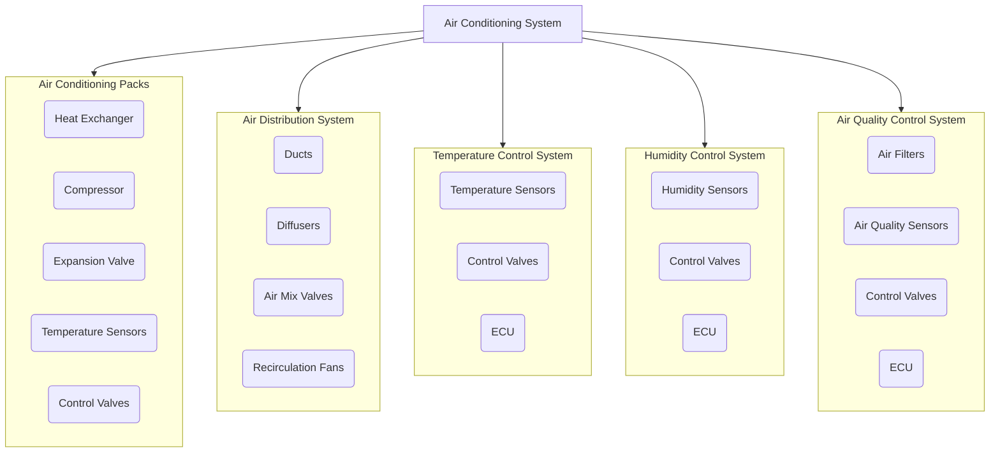
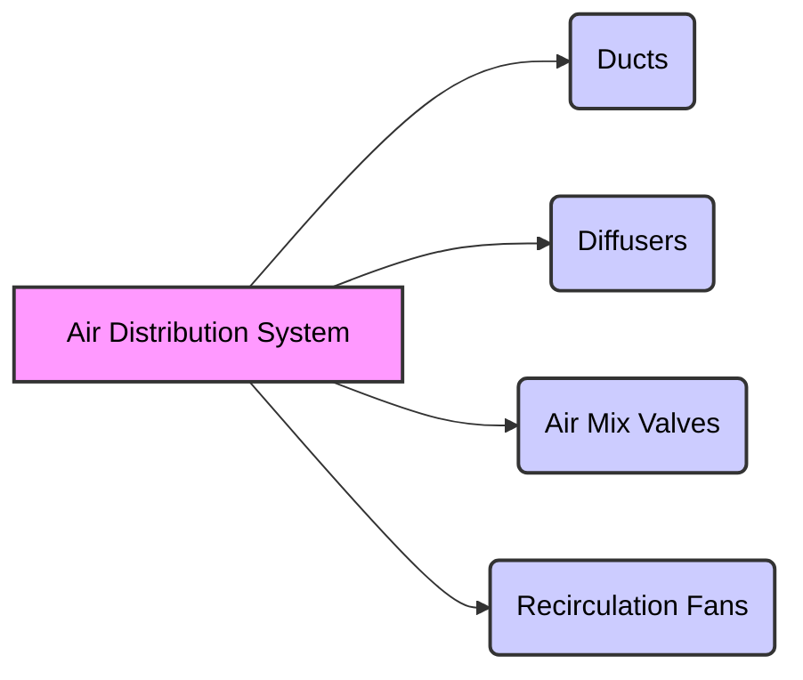
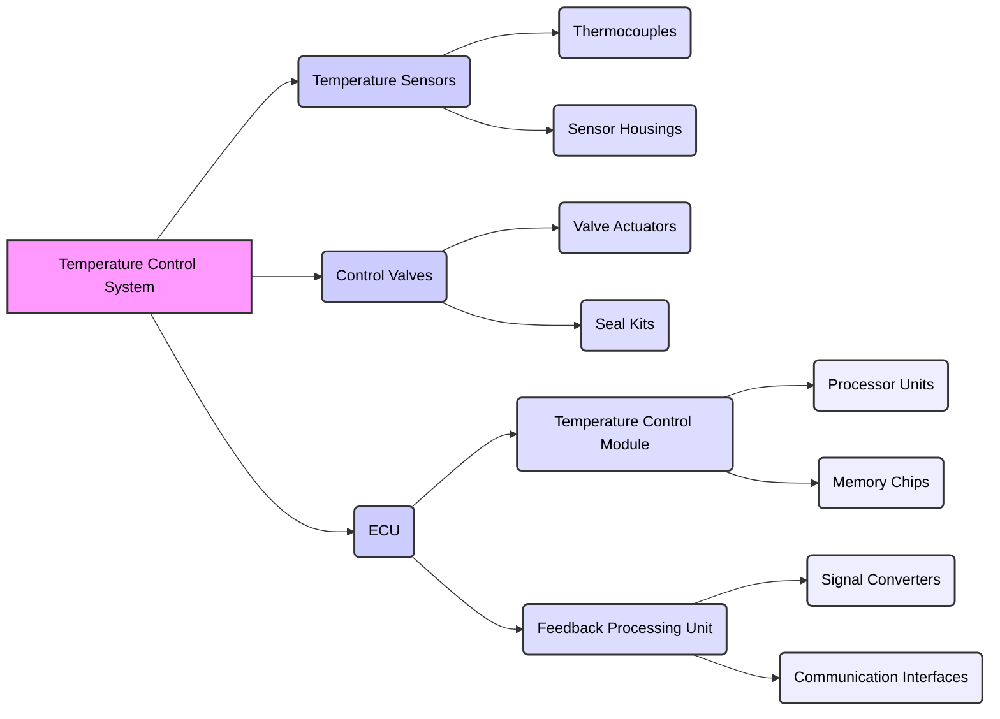
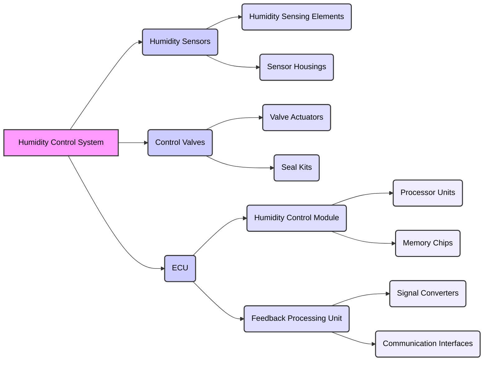
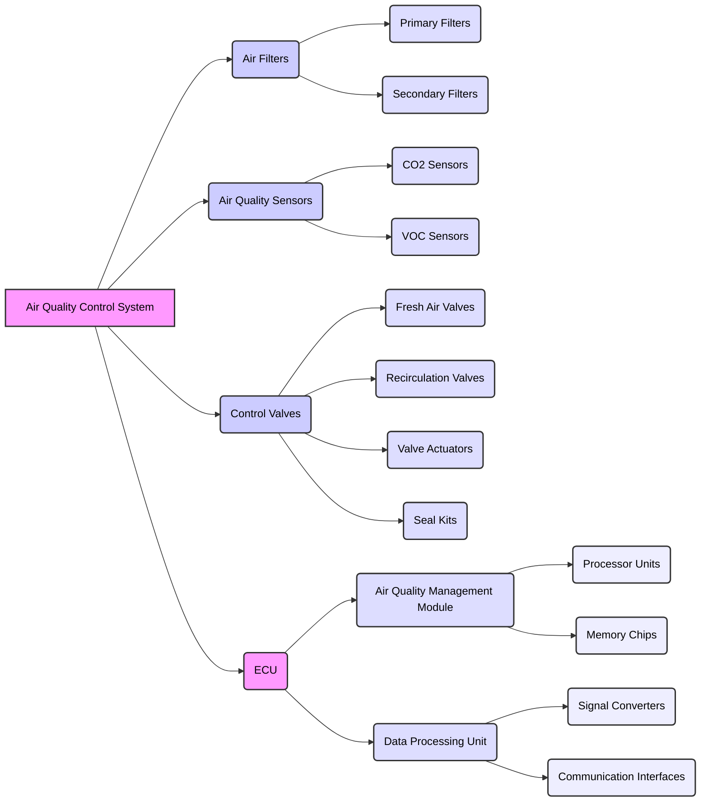

# Air Conditioning System Schematics (S1000D)
**Document Code:** GPAM-AMPEL-0201-21-001-A

---

## 1. Introduction

This Air Conditioning System Schematics document for the AMPEL360XWLRGA aircraft provides the necessary guidelines and specifications for the design, installation, and maintenance of the air conditioning system. This document ensures the proper functioning and operational efficiency of the air conditioning system, maintaining the comfort and safety of the aircraft's occupants.  *(Intended audience: aircraft maintenance technicians, engineers, and other qualified personnel involved in the maintenance of the AMPEL360XWLRGA aircraft's air conditioning system.)*

## 2. System Overview

The air conditioning system in the AMPEL360XWLRGA aircraft is designed to provide a comfortable cabin environment by controlling:
- **Temperature**
- **Humidity**
- **Air Quality**

It consists of five main subsystems:
1. **Air Conditioning Packs**
2. **Air Distribution System**
3. **Temperature Control System**
4. **Humidity Control System**
5. **Air Quality Control System**

---

## 3. Key Components and Functions

#### **3.1 Air Conditioning Packs**

Responsible for cooling and heating the air supplied to the cabin. Components include:
- **Heat Exchanger**: Transfers heat between air streams.
- **Compressor**: Compresses refrigerant for cooling.
- **Expansion Valve**: Regulates refrigerant flow.
- **Temperature Sensors**: Monitor air temperature.
- **Control Valves**: Adjust airflow or refrigerant flow.

#### **3.2 Air Distribution System**

Ensures even distribution of conditioned air throughout the cabin. Components include:
- **Ducts**: Main and branch ducts for airflow.
- **Diffusers**: Ceiling and wall diffusers for air delivery.
- **Air Mix Valves**: Manual and automatic valves to mix fresh and recirculated air.
- **Recirculation Fans**: Cabin and bay fans for air circulation.

#### **3.3 Temperature Control System**

Maintains the desired cabin temperature. Components include:
- **Temperature Sensors**: Monitor cabin and equipment bay temperatures.
  - **Detailed Components:** Thermocouples, Sensor Housings.
- **Control Valves**: Adjust airflow or refrigerant flow.
  - **Detailed Components:** Inlet and Outlet Control Valves, Seal Kits.
- **Electronic Control Unit (ECU)**: Processes sensor data and controls system operations.
  - **Detailed Components:** Processor Units, Memory Chips, Signal Converters, Communication Interfaces.

#### **3.4 Humidity Control System**

Maintains the desired cabin humidity level. Components include:
- **Humidity Sensors**: Monitor cabin and bay humidity levels.
  - **Detailed Components:** Humidity Sensing Elements, Sensor Housings.
- **Control Valves**: Adjust airflow to regulate humidity.
  - **Detailed Components:** Valve Actuators, Seal Kits.
- **Electronic Control Unit (ECU)**: Processes humidity data and controls system operations.
  - **Detailed Components:** Processor Units, Memory Chips, Signal Converters, Communication Interfaces.

#### **3.5 Air Quality Control System**

Ensures clean and fresh air in the cabin. Components include:
- **Air Filters**: Remove particles and contaminants.
  - **Detailed Components:** Primary and Secondary Filters.
- **Air Quality Sensors**: Monitor air quality.
  - **Detailed Components:** CO2 Sensors, Volatile Organic Compounds (VOCs) Sensors.
- **Control Valves**: Regulate fresh and recirculated air.
  - **Detailed Components:** Fresh Air Valves, Recirculation Valves, Valve Actuators, Seal Kits.
- **Electronic Control Unit (ECU)**: Manages air quality control.
  - **Detailed Components:** Processor Units, Memory Chips, Signal Converters, Communication Interfaces.

---

## 4. System Schematics

The following sections provide detailed schematics of the air conditioning system components and their interconnections.

#### **4.1 Air Conditioning Pack Schematic**


#### **4.2 Air Distribution System Schematic**


#### **4.3 Temperature Control System Schematic**


#### **4.4 Humidity Control System Schematic**



#### **4.5 Air Quality Control System Schematic**



---

# Maintenance DMRL

---

### **Refined S1000D DMC Assignments for Air Conditioning System**
**Format:**  
```
DMC-AAA-BBB-CCC-DDD-EEE-FFF-GGGG-LLLL
```
Where:
- **AAA**: ATA System Code
- **BBB**: Subsystem Code
- **CCC**: Data Type Code (Maintenance, Troubleshooting, etc.)
- **DDD**: Information Type Code (Procedure, Description, etc.)
- **EEE**: Model Identifier
- **FFF**: Variant Identifier
- **GGGG**: Language Code
- **LLLL**: Revision Level

---

## **Step 1: Define ATA System and Subsystems**
**ATA Chapter:**  
- **21 - Air Conditioning System**  
  - **Subsystems (BBB) Selection:**
    - `000` - General
    - `001` - Air Conditioning System
    - `002` - Air Distribution System
    - `003` - Temperature Control System
    - `004` - Humidity Control System
    - `005` - Air Quality Control System

---

## **Step 2: Define Data Types and Information Types**
**Data Type (CCC) Codes:**  
- `31` - Maintenance Practices  
- `32` - Troubleshooting  

**Information Type (DDD) Codes:**  
- `001` - General Maintenance Procedure  
- `002` - Troubleshooting Procedure  

---

## **Step 3: Assign DMCs**
### **A. Maintenance Procedures**
For **General Maintenance Procedures** of the **Air Conditioning System**, assign:

| System | Subsystem | Data Type | Info Type | Model | Variant | Lang | Rev | DMC |
|---------|------------|------------|------------|------------|------------|------------|------------|--------------------------------|
| 21 | 001 | 31 | 001 | AMPEL | 001 | EN-US | 0001 | `DMC-21-001-31-001-AMPEL-001-EN-US-0001` |
| 21 | 002 | 31 | 001 | AMPEL | 001 | EN-US | 0001 | `DMC-21-002-31-001-AMPEL-001-EN-US-0001` |
| 21 | 003 | 31 | 001 | AMPEL | 001 | EN-US | 0001 | `DMC-21-003-31-001-AMPEL-001-EN-US-0001` |
| 21 | 004 | 31 | 001 | AMPEL | 001 | EN-US | 0001 | `DMC-21-004-31-001-AMPEL-001-EN-US-0001` |
| 21 | 005 | 31 | 001 | AMPEL | 001 | EN-US | 0001 | `DMC-21-005-31-001-AMPEL-001-EN-US-0001` |

---

### **B. Troubleshooting Procedures**
For **Troubleshooting the Air Conditioning System**, assign:

| System | Subsystem | Data Type | Info Type | Model | Variant | Lang | Rev | DMC |
|---------|------------|------------|------------|------------|------------|------------|------------|--------------------------------|
| 21 | 001 | 32 | 002 | AMPEL | 001 | EN-US | 0001 | `DMC-21-001-32-002-AMPEL-001-EN-US-0001` |
| 21 | 002 | 32 | 002 | AMPEL | 001 | EN-US | 0001 | `DMC-21-002-32-002-AMPEL-001-EN-US-0001` |
| 21 | 003 | 32 | 002 | AMPEL | 001 | EN-US | 0001 | `DMC-21-003-32-002-AMPEL-001-EN-US-0001` |
| 21 | 004 | 32 | 002 | AMPEL | 001 | EN-US | 0001 | `DMC-21-004-32-002-AMPEL-001-EN-US-0001` |
| 21 | 005 | 32 | 002 | AMPEL | 001 | EN-US | 0001 | `DMC-21-005-32-002-AMPEL-001-EN-US-0001` |

---

## **Step 4: Assign DMCs to Sections**
Now, let’s map these **DMCs** to your **Maintenance and Troubleshooting Manual** sections.

### **5. Maintenance and Troubleshooting**
#### **5.1 Air Conditioning Packs**  
- **DMC:** `DMC-21-001-31-001-AMPEL-001-EN-US-0001`
  - Inspect and clean heat exchangers  
  - Check and replenish refrigerant levels  
  - Inspect and test compressors  
  - Inspect and test expansion valves  
  - Inspect and test temperature sensors  
  - Inspect and test control valves  

#### **5.2 Air Distribution System**  
- **DMC:** `DMC-21-002-31-001-AMPEL-001-EN-US-0001`
  - Inspect and clean ducts and diffusers  
  - Inspect and test air mix valves  
  - Inspect and test recirculation fans  

#### **5.3 Temperature Control System**  
- **DMC:** `DMC-21-003-31-001-AMPEL-001-EN-US-0001`
  - Inspect and test temperature sensors  
  - Inspect and test control valves  
  - Inspect and test Electronic Control Unit (ECU)  

#### **5.4 Humidity Control System**  
- **DMC:** `DMC-21-004-31-001-AMPEL-001-EN-US-0001`
  - Inspect and test humidity sensors  
  - Inspect and test control valves  
  - Inspect and test Electronic Control Unit (ECU)  

#### **5.5 Air Quality Control System**  
- **DMC:** `DMC-21-005-31-001-AMPEL-001-EN-US-0001`
  - Inspect and replace air filters  
  - Inspect and test air quality sensors  
  - Inspect and test control valves  
  - Inspect and test Electronic Control Unit (ECU)  

---

### **6. Troubleshooting Procedures**
#### **6.1 Air Conditioning Packs**  
- **DMC:** `DMC-21-001-32-002-AMPEL-001-EN-US-0001`
  - Diagnose issues with temperature sensors  
  - Troubleshoot ECU malfunctions  
  - Resolve refrigerant circulation problems  

#### **6.2 Air Distribution System**  
- **DMC:** `DMC-21-002-32-002-AMPEL-001-EN-US-0001`
  - Diagnose airflow inconsistencies  
  - Troubleshoot faulty air mix valves  

#### **6.3 Temperature Control System**  
- **DMC:** `DMC-21-003-32-002-AMPEL-001-EN-US-0001`
  - Diagnose inaccurate temperature readings  
  - Troubleshoot ECU malfunctions  

#### **6.4 Humidity Control System**  
- **DMC:** `DMC-21-004-32-002-AMPEL-001-EN-US-0001`
  - Diagnose sensor calibration errors  
  - Troubleshoot malfunctioning humidity control  

#### **6.5 Air Quality Control System**  
- **DMC:** `DMC-21-005-32-002-AMPEL-001-EN-US-0001`
  - Troubleshoot air filter clogging  
  - Diagnose malfunctioning air quality sensors  

---

## 6. Documentation and Records

All maintenance activities must be documented in the aircraft's maintenance logbook. The following information should be recorded for each maintenance task:

- Date and time of maintenance
- Description of task performed
- Name and signature of technician
- Part numbers and serial numbers of replaced components
- Any discrepancies or issues found and corrective actions taken

---

## 7. Compliance and Certification

The Air Conditioning System Schematics document complies with the following regulatory requirements and standards:

- Federal Aviation Administration (FAA) regulations
- European Union Aviation Safety Agency (EASA) regulations
- International Civil Aviation Organization (ICAO) standards
- Manufacturer's maintenance manual and service bulletins

---

## 8. Conclusion

The Air Conditioning System Schematics document for the AMPEL360XWLRGA aircraft provides essential guidelines and specifications for the design, installation, and maintenance of the air conditioning system. By adhering to the schematics and procedures outlined in this document, technicians can ensure the proper functioning and operational efficiency of the air conditioning system, maintaining the comfort and safety of the aircraft's occupants.

---

## 9. Revision History

| Version | Date       | Author(s)                | Description of Changes                                  |
| :------ | :--------- | :----------------------- | :-------------------------------------------------------- |
| 1.0     | 2025-02-14 | AI Assistant & Amedeo Pelliccia     | Initial Draft Document                                  |


---
**Document Code:** GPAM-AMPEL-0201-21-001-A
```


