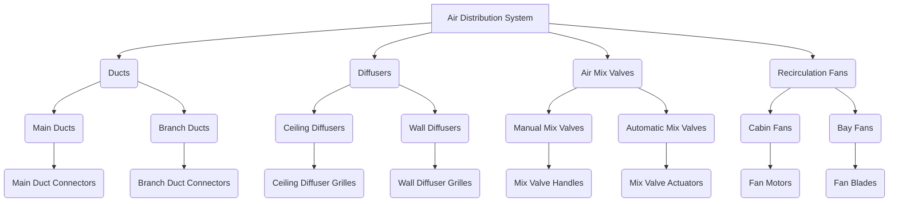
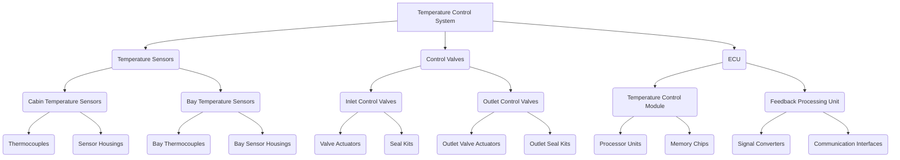
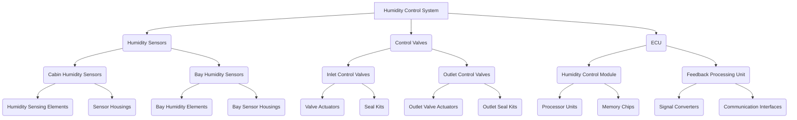
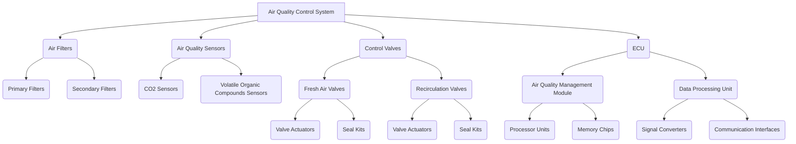

# Air Conditioning System Schematics (S1000D)

**Document Code:** GPAM-AMPEL-0201-21-001-A

## Introduction

The Air Conditioning System Schematics document for the AMPEL360XWLRGA aircraft provides the necessary guidelines and specifications for the design, installation, and maintenance of the air conditioning system. This document ensures the proper functioning and operational efficiency of the air conditioning system, maintaining the comfort and safety of the aircraft's occupants.

## System Overview

The air conditioning system in the AMPEL360XWLRGA aircraft is designed to provide a comfortable cabin environment by controlling the temperature, humidity, and air quality. The system consists of the following main components:

- Air Conditioning Packs
- Air Distribution System
- Temperature Control System
- Humidity Control System
- Air Quality Control System


## Air Conditioning Packs

The air conditioning packs are responsible for cooling and heating the air supplied to the cabin. Each pack consists of the following components:

- Heat Exchanger
- Compressor
- Expansion Valve
- Temperature Sensors
- Control Valves

## Air Distribution System

The air distribution system ensures the even distribution of conditioned air throughout the cabin. The system consists of the following components:

- Ducts
- Diffusers
- Air Mix Valves
- Recirculation Fans

## Temperature Control System

The temperature control system maintains the desired cabin temperature by regulating the operation of the air conditioning packs and the air distribution system. The system consists of the following components:

- Temperature Sensors
- Control Valves
- Electronic Control Unit (ECU)

## Humidity Control System

The humidity control system maintains the desired cabin humidity level by regulating the operation of the air conditioning packs and the air distribution system. The system consists of the following components:

- Humidity Sensors
- Control Valves
- Electronic Control Unit (ECU)

## Air Quality Control System

The air quality control system ensures the supply of clean and fresh air to the cabin by filtering and monitoring the air quality. The system consists of the following components:

- Air Filters
- Air Quality Sensors
- Control Valves
- Electronic Control Unit (ECU)

## System Schematics

The following sections provide detailed schematics of the air conditioning system components and their interconnections.

### Air Conditioning Pack Schematic

  ```mermaid
  flowchart TB
  A[Air Conditioning System]

  subgraph B["Air Conditioning Packs"]
    B1(Heat Exchanger)
    B2(Compressor)
    B3(Expansion Valve)
    B4(Temperature Sensors)
    B5(Control Valves)
  end

  subgraph C["Air Distribution System"]
    C1(Ducts)
    C2(Diffusers)
    C3(Air Mix Valves)
    C4(Recirculation Fans)
  end

  subgraph D["Temperature Control System"]
    D1(Temperature Sensors)
    D2(Control Valves)
    D3(ECU)
  end

  subgraph E["Humidity Control System"]
    E1(Humidity Sensors)
    E2(Control Valves)
    E3(ECU)
  end

  subgraph F["Air Quality Control System"]
    F1(Air Filters)
    F2(Air Quality Sensors)
    F3(Control Valves)
    F4(ECU)
  end

  A --> B
  A --> C
  A --> D
  A --> E
  A --> F

  B --> B1
  B --> B2
  B --> B3
  B --> B4
  B --> B5

  C --> C1
  C --> C2
  C --> C3
  C --> C4

  D --> D1
  D --> D2
  D --> D3

  E --> E1
  E --> E2
  E --> E3

  F --> F1
  F --> F2
  F --> F3
  F --> F4
  ```
### Air Conditioning Packs:
**Responsible for cooling and heating.**
- **Components**: Heat Exchanger, Compressor, Expansion Valve, Temperature Sensors, Control Valves.

### Air Distribution System:
**Even distribution of conditioned air.**
- **Components**: Ducts, Diffusers, Air Mix Valves, Recirculation Fans.

### Temperature Control System:
**Maintains desired temperature.**
- **Components**: Temperature Sensors, Control Valves, ECU.

### Humidity Control System:
**Maintains desired humidity.**
- **Components**: Humidity Sensors, Control Valves, ECU.

### Air Quality Control System:
**Ensures clean and fresh air.**
- **Components**: Air Filters, Air Quality Sensors, Control Valves, ECU.

### Air Distribution System Schematic



### Detailed Component Overview:

#### Temperature Sensors:
- **Measures the cabin and equipment bay temperatures.**
  - **Sub-components:**
    - **Cabin Temperature Sensors**: Monitor passenger area temperature.
    - **Bay Temperature Sensors**: Monitor temperatures in cargo or equipment bays.

#### Control Valves:
- **Adjust airflow or refrigerant flow to maintain desired temperatures.**
  - **Sub-components:**
    - **Inlet Control Valves**: Adjust the incoming airflow.
    - **Outlet Control Valves**: Control the air leaving the compartment.

#### Electronic Control Unit (ECU):
- **Central unit processing temperature data and controlling other system parts.**
  - **Sub-components:**
    - **Temperature Control Module**: Contains logic for maintaining temperature setpoints.
    - **Feedback Processing Unit**: Receives input from sensors and adjusts operations accordingly.

This breakdown provides a detailed view of each functional area within the Temperature Control System and its integral components.

### Temperature Control System Schematic



### Detailed Components:

#### Temperature Sensors:
- **Thermocouples**: An actual sensing element that measures temperature.
- **Sensor Housings**: Protect and mount the sensors.

#### Control Valves:
- **Valve Actuators**: Drive the motion to open or close the valves.
- **Seal Kits**: Ensure airtight operation and are regularly replaced due to wear.

#### Electronic Control Unit (ECU):
##### Temperature Control Module:
- **Processor Units**: Execute the control algorithms.
- **Memory Chips**: Store the operational software.

##### Feedback Processing Unit:
- **Signal Converters**: Transform sensor signals into readable data for the ECU.
- **Communication Interfaces**: Facilitate communication between the ECU and other system parts.

This detailed breakdown down to the last replaceable part offers a granular view of the system, focusing on critical components that might need regular maintenance or replacement.

### Humidity Control System Schematic

### Detailed Components:
#### Humidity Sensors:
- **Humidity Sensing Elements**: Actual components sensing the humidity levels.
- **Sensor Housings**: Enclose and protect the humidity sensing elements.

#### Control Valves:
- **Valve Actuators**: Mechanically control the opening and closing of the valves.
- **Seal Kits**: Ensure proper sealing to prevent leaks, contributing to effective humidity control.

#### Electronic Control Unit (ECU):
- **Humidity Control Module**:
  - **Processor Units**: Handle control calculations and processing for humidity regulation.
  - **Memory Chips**: Store control algorithms and settings.
- **Feedback Processing Unit**:
  - **Signal Converters**: Convert raw sensor data into actionable information for the ECU.
  - **Communication Interfaces**: Allow the ECU to interact with other systems and components.

### Flowchart


### Air Quality Control System Schematic

### Detailed Components:
#### Air Filters:
- **Primary Filters**: Remove large particles and debris from incoming air.
- **Secondary Filters**: Provide finer filtration for smaller particles or specific contaminants.

#### Air Quality Sensors:
- **CO2 Sensors**: Measure carbon dioxide levels to ensure adequate air quality.
- **Volatile Organic Compounds (VOCs) Sensors**: Detect harmful gases for improved cabin air safety.

#### Control Valves:
- **Fresh Air Valves & Recirculation Valves**:
  - **Valve Actuators**: Control the operation of valves.
  - **Seal Kits**: Maintain airtight seals, ensuring efficient valve operations.

#### Electronic Control Unit (ECU):
- **Air Quality Management Module**:
  - **Processor Units**: Execute air quality control tasks.
  - **Memory Chips**: Store data and algorithms for air quality monitoring and control.
- **Data Processing Unit**:
  - **Signal Converters**: Transform sensor inputs into useful data for control decisions.
  - **Communication Interfaces**: Link the ECU with other systems for integrated air quality control.

### Flowchart


## Maintenance and Troubleshooting

The following sections outline the maintenance and troubleshooting procedures for the air conditioning system components.

### Air Conditioning Packs

- Inspect and clean heat exchangers
- Check and replenish refrigerant levels
- Inspect and test compressors
- Inspect and test expansion valves
- Inspect and test temperature sensors
- Inspect and test control valves

### Air Distribution System

- Inspect and clean ducts and diffusers
- Inspect and test air mix valves
- Inspect and test recirculation fans

### Temperature Control System

- Inspect and test temperature sensors
- Inspect and test control valves
- Inspect and test electronic control unit (ECU)

### Humidity Control System

- Inspect and test humidity sensors
- Inspect and test control valves
- Inspect and test electronic control unit (ECU)

### Air Quality Control System

- Inspect and replace air filters
- Inspect and test air quality sensors
- Inspect and test control valves
- Inspect and test electronic control unit (ECU)

## Documentation and Records

All maintenance activities must be documented in the aircraft's maintenance logbook. The following information should be recorded for each maintenance task:

- Date and time of maintenance
- Description of task performed
- Name and signature of technician
- Part numbers and serial numbers of replaced components
- Any discrepancies or issues found and corrective actions taken

## Compliance and Certification

The Air Conditioning System Schematics document complies with the following regulatory requirements and standards:

- Federal Aviation Administration (FAA) regulations
- European Union Aviation Safety Agency (EASA) regulations
- International Civil Aviation Organization (ICAO) standards
- Manufacturer's maintenance manual and service bulletins

## Conclusion

The Air Conditioning System Schematics document for the AMPEL360XWLRGA aircraft provides essential guidelines and specifications for the design, installation, and maintenance of the air conditioning system. By adhering to the schematics and procedures outlined in this document, technicians can ensure the proper functioning and operational efficiency of the air conditioning system, maintaining the comfort and safety of the aircraft's occupants.
