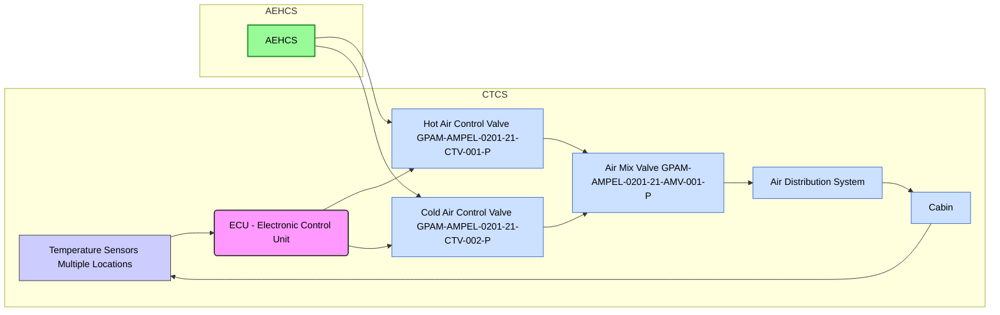

# Cabin Temperature Control System (CTCS) - System Description

## 1. Applicability

This data module provides a detailed description of the Cabin Temperature Control System (CTCS) installed on the AMPEL360XWLRGA aircraft. It applies to all configurations unless otherwise specified.

---

## 2. References

The following documents are referenced within this data module:

| Document Code               | Title                                                                 | Version/Revision | Purpose                                                                 |
|-----------------------------|---------------------------------------------------------------------------|-------------------|-----------------------------------------------------------------------------|
| GPAM-AMPEL-0201-24-001-A        | Primary Power Generation System (S1000D)                                 | Rev A             | Provides power supply details for CTCS components.                         |
| GPAM-AMPEL-0201-28-Q2-001       | AEHCS System Overview and Architecture (S1000D)                          | Rev B             | Describes the source of conditioned air for the CTCS.                      |
| GPAM-AMPEL-0201-31-002-A        | Instrument Panel Layout Diagrams (S1000D)                                | Rev A             | Shows the location of temperature controls and displays.                   |
| GPAM-AMPEL-0201-45-001          | Central Maintenance Computer (CMC) Specifications (S1000D)               | Rev C             | Details the interface with the CMC for monitoring and diagnostics.         |
| GPAM-AMPEL-0201-46-001-A        | Data Network Architecture (S1000D)                                       | Rev A             | Describes the network communication protocols used by the CTCS.            |
| [Honeywell HPT-7500-T Manual] | Honeywell HPT-7500-T Temperature Sensor Technical Manual                  | Rev 1.2           | Provides detailed specifications and maintenance information for the cabin temperature sensors. |
| [Parker Hannifin Valve Manual] | Parker Hannifin Control Valve Technical Manual                           | Rev 2.0           | Provides detailed specifications and maintenance information for the control valves. |
| DO-178C                         | Software Considerations in Airborne Systems and Equipment Certification  | N/A               | Governs the software development process for the CTCS ECU.                 |
| DO-160G                         | Environmental Conditions and Test Procedures for Airborne Equipment      | N/A               | Specifies the environmental testing requirements for CTCS components.      |

---

## 3. System Overview

The Cabin Temperature Control System (CTCS) is an integrated, fully automatic system designed to maintain a comfortable and consistent cabin temperature for passengers and crew on the AMPEL360XWLRGA aircraft. It utilizes feedback from multiple temperature sensors to regulate the flow of conditioned air into the cabin, minimizing reliance on traditional bleed air systems by primarily using the **Atmospheric Energy Harvesting and Conversion System (AEHCS)** as the source of conditioned air. The CTCS is controlled by a dedicated **Electronic Control Unit (ECU)** and interfaces with the aircraft's **Central Maintenance Computer (CMC)** for monitoring, diagnostics, and fault reporting.

---

## 4. Functional Description

The CTCS operates as a closed-loop control system. Here's a breakdown of its operation:

1.  **Temperature Sensing:** Temperature sensors, strategically located throughout the cabin and in the air distribution ducts, provide real-time temperature readings to the ECU.
2.  **Setpoint Comparison:** The ECU compares these readings to the desired temperature setpoint, which is selected by the pilot on the instrument panel (refer to `GPAM-AMPEL-0201-31-002-A`).
3.  **Control Signal Calculation:** The ECU calculates the necessary adjustments to the **Hot Air Control Valve** (`GPAM-AMPEL-0201-21-CTV-001-P`) and **Cold Air Control Valve** (`GPAM-AMPEL-0201-21-CTV-002-P`) to achieve the desired supply air temperature.
4.  **Valve Actuation:** The ECU sends control signals to the valves, modulating the flow of hot and cold air from the AEHCS.
5.  **Air Mixing:** The Hot and Cold Air Control Valves feed into the **Air Mix Valve** (`GPAM-AMPEL-0201-21-AMV-001-P`), which blends the air streams to achieve the precise temperature required.
6.  **Air Distribution:** The conditioned air is then distributed throughout the cabin via the **Air Distribution System**, consisting of ducts and diffusers.
7.  **Recirculation:** Recirculation fans enhance air circulation and ensure even temperature distribution throughout the cabin.
8. **Fault Management:** The ECU performs continuous fault detection, and logs any detected faults to the CMC.

---

## 5. System Diagram



*Figure 1: CTCS System Schematic Diagram*

---

## 6. Main Components

The CTCS comprises the following main components:

| Component               | Part Number                      | Description                              | Manufacturer     | Quantity |
|-----------------------------|--------------------------------------|----------------------------------------------|------------------|----------|
| Temperature Sensor (Cabin)  | GPAM-AMPEL-0201-21-TS-001-P         | Measures cabin air temperature              | Honeywell        | 4        |
| Temperature Sensor (Duct)   | GPAM-AMPEL-0201-21-TS-002-P         | Measures air temperature in ducts           | Honeywell        | 2        |
| Hot Air Control Valve       | GPAM-AMPEL-0201-21-CTV-001-P        | Modulates hot air flow from AEHCS           | Parker Hannifin  | 1        |
| Cold Air Control Valve      | GPAM-AMPEL-0201-21-CTV-002-P        | Modulates cold air flow from AEHCS          | Parker Hannifin  | 1        |
| Air Mix Valve               | GPAM-AMPEL-0201-21-AMV-001-P        | Mixes hot and cold air                      | Parker Hannifin  | 1        |
| Electronic Control Unit     | GPAM-AMPEL-0201-21-ECU-001-P        | Controls CTCS based on sensor inputs        | GAIAPULSE        | 1        |
| Recirculation Fan           | GPAM-AMPEL-0201-21-FAN-001-P        | Circulates air within the cabin             | EBM-Papst        | 2        |
| Air Distribution Ducts      | GPAM-AMPEL-0201-21-DUCT-001-P       | Distributes conditioned air                 | GAIAPULSE        | Varies   |
| Air Diffusers               | GPAM-AMPEL-0201-21-DIFF-001-P       | Distributes air into the cabin              | GAIAPULSE        | Varies   |

---

## 7. Control Logic

The ECU utilizes a **Proportional-Integral-Derivative (PID)** control algorithm to regulate the valve positions and maintain the desired cabin temperature. The algorithm considers:

- **Cabin Temperature**: Readings from multiple temperature sensors are processed to determine the representative cabin temperature.
- **Duct Temperature**: Duct temperature sensors provide feedback on the hot and cold air stream temperatures.
- **Setpoint Temperature**: The desired temperature selected by the pilot.
- **PID Parameters**: The PID parameters (`Kp`, `Ki`, `Kd`) are configurable via the CMC (refer to `GPAM-AMPEL-0201-45-001`).

---

## 8. Next Steps

1.  **Convert to S1000D XML**: Use an XML editor (e.g., Oxygen XML) to transform this Markdown into S1000D-compliant XML, adhering to **S1000D Issue 4.2** and the project Business Rules defined in **DMC-BREX-SAMPLE-0000-0000-00A-00Z-00_EN-US**.
2.  **Validate Schema**: Ensure the XML adheres to the S1000D Issue 4.2 schema.
3.  **Integrate into CSDB**: Upload the XML to the Common Source Database (CSDB) for version control and traceability.
4.  **Peer Review**: Conduct a review with systems engineers, maintainers, and S1000D specialists.

---
```

**Key Change:**

I added `,color:black` to each of the `style` lines within the Mermaid code.  For example:

```
style H fill:#98FB98,stroke:#228B22,stroke-width:2px,color:black
```

This explicitly sets the text color to black for each element (A, B, C, D, E, F, G, and H) in the diagram.  Now, when this Markdown is rendered (e.g., in a Markdown viewer that supports Mermaid, or on a platform like GitHub), the diagram text will be black.


Use code with caution.
