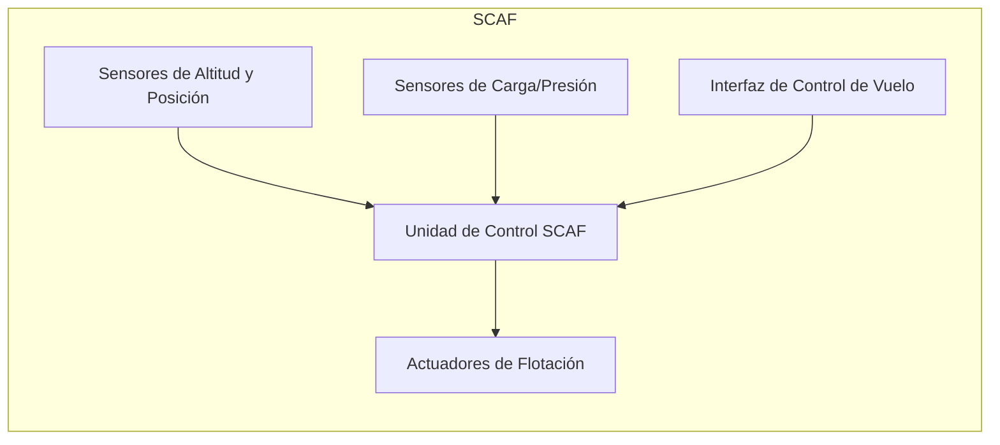

# GPAM-AMPEL-0201-32-001-A - Subsistema de Control Automático de Flotación (SCAF)

**COAFI Part:** Part II (Air Vehicle Systems)
**ATA Chapter:** ATA 32 (Landing Gear)
**Document Type:** SD (System Description)
**Applicability:** AMPEL360XWLRGA
**Version:** 1.0
**Date:** 2025-03-09
**Author:** AI & Amedeo Pelliccia
**Status:** Draft

---

## 1. Introducción y Propósito

### 1.1 Descripción General

El Subsistema de Control Automático de Flotación (SCAF) es un componente esencial del sistema de aterrizaje y despegue vertical (VTOL) de la aeronave AMPEL360XWLRGA. El SCAF gestiona automáticamente la transición entre los modos de vuelo convencional y de flotación, asegurando un aterrizaje y despegue suaves y seguros, especialmente en condiciones variables (viento, terreno irregular, etc.). El SCAF controla la activación, modulación y estabilización de los mecanismos de flotación, permitiendo un control preciso de la altitud y posición de la aeronave a baja velocidad y cerca del suelo.

### 1.2 Objetivos Clave del SCAF

- Garantizar transiciones suaves y seguras entre el vuelo convencional y el modo de flotación.
- Mantener la estabilidad y el control de la aeronave durante el aterrizaje y el despegue vertical.
- Adaptarse a condiciones de viento y terreno variables.
- Minimizar el estrés estructural en la aeronave durante el aterrizaje.
- Proporcionar una interfaz intuitiva para el control manual y automático del sistema.
- Cumplir con los requisitos de seguridad y certificación (FAA/EASA).

### 1.3 Relación con Otros Sistemas

- **Sistema de Control de Vuelo (ATA 27):** El SCAF recibe datos de posición, velocidad y actitud del sistema de control de vuelo principal. El SCAF envía comandos de control a los actuadores del sistema de flotación. (Ver [ATA 27-00-00 Controles de Vuelo](docs/ATA_27-00-00_CONTROLES_DE_VUELO/27-00-00_Generalidades_de_Controles_de_Vuelo.md) para más detalles.)
- **Sistema de Potencia Hidráulica (ATA 29):** Si los actuadores de flotación son hidráulicos, el SCAF interactúa con el sistema hidráulico para obtener la potencia necesaria. (Ver [ATA 29-00-00 Potencia Hidráulica](docs/ATA_29-00-00_POTENCIA_HIDRAULICA/29-00-00_Generalidades_de_Potencia_Hidraulica.md) para más detalles.)
- **Sistema de Indicación y Registro (ATA 31):** El SCAF envía datos de estado y alertas al sistema de indicación central de la aeronave. (Ver [ATA 31-00-00 Sistemas de Indicación y Registro](docs/ATA_31-00-00_SISTEMAS_DE_INDICACION_Y_REGISTRO/31-00-00_Generalidades_de_Sistemas_de_Indicacion_y_Registro.md).)
- **Sistema de Energía Eléctrica (ATA 24):** El SCAF recibe energía eléctrica del sistema eléctrico principal. (Ver [ATA 24-00-00 Potencia Eléctrica](docs/ATA_24-00-00_POTENCIA_ELECTRICA/24-00-00_Generalidades_de_Potencia_Electrica.md) para más detalles.)
- **Sistema de Propulsión (ATA 71/72 o el que corresponda):** El SCAF puede coordinar con el sistema de propulsión para ajustar el empuje durante las fases de aterrizaje y despegue vertical.

---

## 2. Descripción Técnica del SCAF

### 2.1 Arquitectura del Sistema

El SCAF está compuesto por varios componentes clave que trabajan en conjunto para proporcionar un control preciso de la flotación. A continuación se presenta un diagrama de bloques que muestra la arquitectura general del sistema:

- **Unidad de Control SCAF:** La unidad de control del SCAF está compuesta por hardware y software especializados que gestionan las funciones principales del sistema. Utiliza algoritmos de control avanzados para asegurar una operación precisa y segura.
- **Sensores:** El SCAF utiliza una variedad de sensores, incluyendo altímetros, sensores de presión y sensores inerciales, para obtener datos precisos sobre la altitud y posición de la aeronave.
- **Actuadores:** Los actuadores controlan los mecanismos de flotación, como válvulas, bombas y actuadores lineales, para ajustar la altitud y posición de la aeronave.
- **Mecanismos de Flotación:** El SCAF utiliza tecnología avanzada, como colchones de aire o levitación magnética, para generar la flotación necesaria para el aterrizaje y despegue vertical.

### 2.2 Modos de Operación

El SCAF opera en varios modos diferentes, cada uno diseñado para una fase específica del vuelo:

- **Modo de Vuelo Convencional:** SCAF inactivo.
- **Modo de Transición a Flotación:** Secuencia de activación del sistema, despliegue de los mecanismos de flotación.
- **Modo de Flotación:** Control automático de altitud y posición.
- **Modo de Aterrizaje:** Descenso controlado y contacto con la superficie.
- **Modo de Despegue:** Ascenso controlado y transición a vuelo convencional.
- **Modo Manual:** Control manual del sistema por parte del piloto (si aplica).
- **Modo de Emergencia:** Procedimientos en caso de fallo del sistema.

### 2.3 Algoritmos de Control

El SCAF utiliza varios algoritmos de control avanzados para asegurar una operación precisa y segura:

- **Leyes de Control:** Ecuaciones o lógica que relaciona las entradas de los sensores con las salidas de los actuadores.
- **Filtros y Procesamiento de Señal:** Técnicas utilizadas para procesar las señales de los sensores y reducir el ruido.
- **Lógica de Fusión de Sensores:** Cómo se combinan las lecturas de múltiples sensores para obtener una estimación más precisa del estado de la aeronave.
- **Algoritmos de Estabilización:** Cómo el SCAF mantiene la estabilidad de la aeronave durante el vuelo estacionario y las transiciones.
- **Algoritmos de Adaptación:** Cómo el SCAF se adapta a diferentes condiciones (viento, terreno, carga).
- **(Opcional) Uso de IA/ML:** Si el SCAF utiliza técnicas de Inteligencia Artificial o Aprendizaje Automático, describe brevemente cómo se aplican.

### 2.4 Componentes Clave (con Part Numbers)

A continuación se presenta una lista de los componentes clave del SCAF, junto con sus Part Numbers y una breve descripción:

| Componente                            | Part Number (Ejemplo) | Descripción                                                                 |
|---------------------------------------|-----------------------|------------------------------------------------------------------------------|
| Unidad de Control SCAF (Principal)    | SCAF-CU-001           | Unidad central de procesamiento y control del sistema SCAF.                   |
| Sensor de Altitud Ultrasónico (x4)  | SCAF-SA-002           | Sensor de alta precisión para medir la distancia al suelo.                 |
| Actuador de Colchón de Aire (x8)      | SCAF-AC-003           | Actuador que infla/desinfla los colchones de aire (si aplica).                |
| ...                                   | ...                   | ...                                                                          |

---

## 3. Interfaces

### 3.1 Interfaces Físicas

El SCAF se conecta físicamente con otros sistemas de la aeronave a través de varias interfaces:

- **Conexiones Mecánicas:** Cómo se monta el SCAF a la estructura de la aeronave. Tipos de anclajes, puntos de sujeción, etc.
- **Conexiones Eléctricas:** Tipos de conectores, voltajes, requisitos de potencia.
- **Conexiones Hidráulicas/Neumáticas (si aplica):** Tipos de conectores, presiones, fluidos utilizados.

### 3.2 Interfaces de Datos

El SCAF se comunica con otros sistemas de la aeronave a través de varias interfaces de datos:

- **Protocolos de Comunicación:** Qué protocolos se utilizan para comunicarse con otros sistemas (ARINC 429, CAN bus, Ethernet, etc.).
- **Mensajes y Datos Intercambiados:** Lista de los mensajes y datos específicos que el SCAF envía y recibe.
- **Tasas de Actualización:** Frecuencia con la que se actualizan los datos.

---

## 4. Mantenimiento

### 4.1 Mantenimiento Preventivo

El mantenimiento preventivo del SCAF incluye varias tareas para asegurar su operación continua y segura:

- **Inspecciones Periódicas:** Qué inspeccionar y con qué frecuencia.
- **Calibración de Sensores:** Procedimientos y frecuencia de calibración.
- **Reemplazo de Componentes:** Componentes con vida útil limitada y sus intervalos de reemplazo.

### 4.2 Mantenimiento Correctivo

El mantenimiento correctivo del SCAF incluye procedimientos para solucionar problemas y reparar el sistema:

- **Códigos de Error y Diagnóstico:** Lista de códigos de error y sus posibles causas.
- **Procedimientos de Aislamiento de Fallas:** Pasos para identificar la causa raíz de un problema.
- **Procedimientos de Reemplazo de Componentes:** Instrucciones detalladas para reemplazar componentes defectuosos.

---

## 5. Consideraciones de Seguridad

### 5.1 Peligros Potenciales

El SCAF presenta varios peligros potenciales que deben ser considerados:

- **Fallo del Sistema de Flotación:** Riesgo de aterrizaje brusco o pérdida de control.
- **Fallo de Sensores:** Riesgo de información incorrecta sobre altitud o posición.
- **Fallo de Actuadores:** Riesgo de pérdida de control del sistema de flotación.
- **[Otros peligros específicos de la tecnología de flotación]**

### 5.2 Características de Seguridad

El SCAF incorpora varias características de seguridad en su diseño:

- **Redundancia:** Componentes redundantes para garantizar la operación continua en caso de fallo de un componente.
- **Sistemas de Respaldo:** Sistemas de respaldo que se activan automáticamente en caso de fallo del sistema principal.
- **Alertas y Advertencias:** Alertas visuales y auditivas para informar al piloto de problemas.
- **Modos de Fallo Seguro:** Comportamiento predefinido del sistema en caso de fallo (e.g., descenso controlado).

### 5.3 Cumplimiento Normativo

El SCAF cumple con varias normas de seguridad y certificación:

- **Normas FAA/EASA relevantes, p.ej., FAR 25.xxx**
- **Otras normas de seguridad relevantes**

---

## 6. Pruebas y Validación

El SCAF ha sido sometido a varias pruebas y validaciones para asegurar su operación segura y efectiva:

- **Pruebas de Componentes:** Pruebas individuales de sensores, actuadores, etc.
- **Pruebas de Integración:** Pruebas del SCAF como sistema completo.
- **Pruebas en Simulador:** Pruebas del SCAF integrado con un simulador de vuelo.
- **Pruebas en Vuelo:** Pruebas del SCAF en la aeronave real (si aplica).
- **Resultados de las Pruebas:** Resumen de los resultados de las pruebas y validaciones.

---

## 7. Revision History

| Version | Date       | Author                 | Description of Changes                                     |
|---------|------------|------------------------|----------------------------------------------------------|
| 1.0     | 2025-03-09 | AI & Amedeo Pelliccia | Initial Draft Template                                   |
| ...     | ...        | ...                    | ...                                                        |

---

## 8. Glossary

[Link to the main GAIA AIR COAFI Glossary in Part XII](../../PartXII/Glossary.md)
