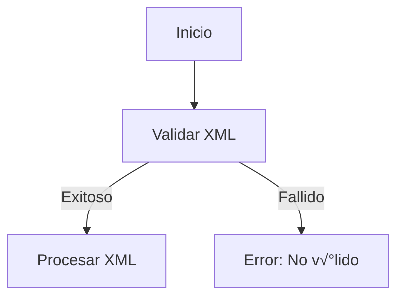

# Índice del Proyecto RobbboTX GAIA AIR: Implementación y Validación Ampliada

## 1. División Funcional
- [Planificación y Gestión del Proyecto](#planificación-y-gestión-del-proyecto)
- [Requisitos del Sistema](#requisitos-del-sistema)
- [Arquitectura del Sistema](#arquitectura-del-sistema)
- [Diseño Detallado del Sistema](#diseño-detallado-del-sistema)
- [Desarrollo y Validación de Algoritmos](#desarrollo-y-validación-de-algoritmos)
- [Simulación y Pruebas](#simulación-y-pruebas)
- [Métricas de Desempeño y Análisis](#métricas-de-desempeño-y-análisis)
- [Gestión de Configuración y Control de Versiones](#gestión-de-configuración-y-control-de-versiones)
- [Cumplimiento Normativo y Seguridad](#cumplimiento-normativo-y-seguridad)
- [Documentación de Usuario y Soporte](#documentación-de-usuario-y-soporte)
- [Cierre del Proyecto y Lecciones Aprendidas](#cierre-del-proyecto-y-lecciones-aprendidas)
- [Archivos y Recursos Complementarios](#archivos-y-recursos-complementarios)

## 2. Ventajas
- [Organización Estructurada](#organización-estructurada)
- [Rastreabilidad de Requisitos](#rastreabilidad-de-requisitos)
- [Facilidad de Mantenimiento](#facilidad-de-mantenimiento)
- [Mejora Continua](#mejora-continua)
- [Cumplimiento Normativo](#cumplimiento-normativo)

## 3. Ejemplos
- [Diseño Detallado del Sistema](#diseño-detallado-del-sistema)
- [Ejemplo de Documento de Requisitos del Usuario (URS)](#ejemplo-de-documento-de-requisitos-del-usuario-urs)

## 4. Implementación del Ecosistema
- [Integración de Herramientas de Colaboración](#integración-de-herramientas-de-colaboración)

## 5. Resumen General

## 6. Próximos Pasos

## 7. Conclusión

## 8. Archivos y Recursos Complementarios
- [Referencias](#referencias)
- [Anexos Técnicos](#anexos-tecnicos)


Optimización integrada de fondo

Claro, aquí tienes un resumen detallado sobre el concepto de **Optimización Integrada de Fondo mediante el Agente Cuántico Coherente (Coherent Q Agent)** según Amedeo Pelliccia:

** ### Ampel|Green: Cloud Services, CompuTech and Aerospace Systems

**Ampel|Green** es una metodología integral que busca la transformación sostenible de los sistemas computacionales, de servicios en la nube, y aeroespaciales, combinando tecnología de punta con un enfoque centrado en la sostenibilidad ambiental. Su misión es promover innovaciones que respeten el entorno terrestre y el espacio, integrando soluciones verdes en todas las etapas del desarrollo tecnológico.

#### Componentes Principales de Ampel|Green:

1. **Servicios en la Nube Verdes (Green Cloud Services)**:
   - **Optimización Energética**: Despliegue de infraestructuras de centros de datos eficientes que utilicen energías renovables, como solar, eólica y geotérmica. Esto incluye el desarrollo de técnicas de refrigeración avanzadas para reducir el consumo energético, como la refrigeración líquida y la gestión térmica inteligente.
   - **Computación Descentralizada**: Promoción del uso de arquitecturas de computación distribuida que reduzcan la necesidad de centros de datos masivos, minimizando la huella de carbono asociada con grandes instalaciones centralizadas.
   - **Software Eficiente en Recursos**: Desarrollo de software que optimice el uso de recursos en la nube, minimizando el consumo de CPU, memoria y almacenamiento, con algoritmos que gestionen la carga de trabajo de manera sostenible.

2. **Sistemas Computacionales Sostenibles (CompuTech Sustainable Systems)**:
   - **Computación Cuántica y AI Verde**: Utilización de computación cuántica para resolver problemas complejos de manera más eficiente, reduciendo el tiempo de cómputo y el consumo energético. Aplicación de inteligencia artificial para optimizar procesos industriales y de diseño, mejorando la sostenibilidad en la manufactura de hardware.
   - **Diseño de Hardware Ecológico**: Fabricación de dispositivos computacionales con materiales reciclables o biodegradables, y uso de técnicas de producción que minimicen el desperdicio. Incluye el diseño modular de componentes para facilitar su reparación, actualización y reciclaje al final de su vida útil.
   - **Optimización de Procesos Computacionales**: Implementación de métodos avanzados de gestión de recursos y procesamiento eficiente de datos, buscando minimizar el consumo de energía y maximizar el rendimiento computacional en todo momento.

3. **Sistemas Aeroespaciales Sostenibles (Green Aerospace Systems)**:
   - **Propulsión Eficiente y Energías Renovables**: Desarrollo de sistemas de propulsión que utilicen combustibles verdes, como el hidrógeno y biocombustibles sostenibles, así como propulsores eléctricos que reduzcan las emisiones y mejoren la eficiencia.
   - **Uso de Materiales Reciclables y Ligeros**: Construcción de componentes aeroespaciales con materiales avanzados, como aleaciones ligeras y materiales compuestos reciclables, que reducen el peso de la nave y, por lo tanto, el consumo de combustible.
   - **Tecnologías de Soporte Vital Innovadoras**: Mejora de los sistemas de soporte vital en misiones espaciales mediante el uso de tecnologías que reciclan agua, regeneran oxígeno y gestionan residuos de manera eficiente, permitiendo misiones de larga duración con menor impacto ambiental.

#### Objetivos Estratégicos de Ampel|Green:

- **Reducción del Impacto Ambiental**: Minimizar la huella de carbono y el impacto ecológico de las tecnologías computacionales, de servicios en la nube, y aeroespaciales mediante la implementación de soluciones sostenibles y eficientes en energía.

- **Desarrollo de Tecnologías Verdes de Vanguardia**: Innovar en áreas como la computación cuántica, inteligencia artificial, y sistemas de propulsión ecológica para asegurar que todas las tecnologías utilizadas estén alineadas con los principios de sostenibilidad.

- **Promoción de un Ecosistema Tecnológico Sostenible**: Crear un marco de trabajo que promueva la colaboración entre empresas, gobiernos, y organizaciones no gubernamentales para desarrollar y adoptar soluciones tecnológicas que respeten el medio ambiente.

#### Conclusión

**Ampel|Green: Cloud Services, CompuTech and Aerospace Systems** es un enfoque innovador que reúne las mejores prácticas de sostenibilidad para revolucionar la tecnología en los sectores de la computación, servicios en la nube, y aeroespacial. Al integrar energías renovables, materiales sostenibles, y optimización de recursos, Ampel|Green persigue un futuro tecnológico que no solo mejore la eficiencia y el rendimiento, sino que también respete y preserve el entorno terrestre y el espacio. 
Ampel|Green: CompuTech and AeroSpace Systems** es un enfoque integral diseñado para transformar tanto la computación como los sistemas aeroespaciales hacia soluciones 100% verdes y sostenibles. Esta metodología se basa en el desarrollo y la integración de tecnologías avanzadas, incluyendo:

1. **Robótica Avanzada**: Utilización de robots en la cadena de producción para maximizar la eficiencia energética y minimizar el desperdicio de recursos. Los robots estarían programados para realizar tareas de fabricación complejas de manera precisa, reduciendo errores y mejorando la sostenibilidad del proceso.

2. **Inteligencia Artificial y Cuántica**: Implementación de modelos de aprendizaje automático y computación cuántica para optimizar el diseño de sistemas aeroespaciales y computacionales. Esto podría incluir el uso de algoritmos de inteligencia artificial para predecir fallos en sistemas aeroespaciales o mejorar la eficiencia de los dispositivos computacionales.

3. **Nuevas Tecnologías de Red**: Desarrollo e integración de redes avanzadas, como la computación en la nube distribuida y redes de comunicación cuántica, que aseguren la transmisión de datos de manera eficiente y segura. Estas redes soportarán las necesidades de alta capacidad y baja latencia de las aplicaciones aeroespaciales y computacionales modernas.

4. **Nuevos Materiales**: Uso de materiales avanzados, como compuestos ligeros y materiales reciclables, en la construcción de componentes computacionales y aeroespaciales. Estos materiales permitirán la creación de estructuras más ligeras, eficientes y duraderas, al tiempo que reducirán el impacto ambiental.

5. **Modos Innovadores de Producción**: Aplicación de métodos de manufactura aditiva (impresión 3D), que permiten la creación de componentes complejos con menor desperdicio de material. También se exploran nuevos métodos de fabricación sostenibles que incorporan el reciclaje y la reutilización de componentes.

6. **Dispositivos de Comunicación de Nueva Generación**: Creación de dispositivos de comunicación avanzados que pueden ser utilizados en entornos domésticos o durante viajes intercontinentales. Estos dispositivos estarán diseñados para ser energéticamente eficientes y para integrarse con otros sistemas de una manera que maximice la interoperabilidad y la sostenibilidad.

### Objetivos Clave

- **Revolución Tecnológica Completa**: Promover una transformación radical en la forma en que se diseñan, construyen y utilizan tanto los sistemas computacionales como los aeroespaciales, con un enfoque en la sostenibilidad y la eficiencia.
  
- **Uso Ético y Responsable de la Tecnología**: Asegurar que todas las innovaciones desarrolladas bajo la metodología **Ampel|Green** cumplan con los estándares éticos más altos, promoviendo un uso responsable de la tecnología para el beneficio de la sociedad y el medio ambiente.

- **Automatización y Visibilidad**: Lograr un nivel alto de automatización en los procesos complejos, como la programación y la escalabilidad, para facilitar el despliegue y la adopción de estas tecnologías, aumentando la visibilidad del proyecto.

En conjunto, **Ampel|Green: CompuTech and AeroSpace Systems** representa un marco innovador para crear un futuro sostenible tanto en la tecnología computacional como en la aeroespacial, integrando las últimas tecnologías con un compromiso inquebrantable con la sostenibilidad y la ética. Chapter: Amedeo Pelliccia’s Visionary Contributions in Green Technology and Quantum Computing

### Alcances del programa


- **Propósito principal**: Demostrar las posibilidades de encuentro espacial y acoplamiento.
- **Objetivos yadicionales**: Parece que la última parte de tu mensaje está incompleta. Aquí tienes una continuación y ampliación sobre el alcance del programa basado en **Ampel|Green: CompuTech and AeroSpace Systems**:

### Alcances del Programa

- **Propósito Principal**: Demostrar las posibilidades de encuentro espacial y acoplamiento mediante tecnologías avanzadas que optimicen el consumo energético y reduzcan la huella de carbono. Este propósito se centra en la creación de una plataforma que pueda realizar misiones espaciales sostenibles, facilitando tanto la exploración como la utilización responsable de los recursos espaciales.

- **Objetivos Adicionales**:

  1. **Desarrollo de Sistemas Autónomos Verdes**: Implementar vehículos y drones autónomos que operen en tierra y en el espacio utilizando energía renovable, como la solar o la eólica, para misiones de exploración y mantenimiento en estaciones espaciales o satélites.

  2. **Optimización de Recursos en la Cadena de Suministro Aeroespacial**: Reestructurar las cadenas de suministro y producción para que sean totalmente circulares, garantizando la reutilización de materiales y componentes al final de su vida útil. El objetivo es minimizar los desechos y maximizar el aprovechamiento de los recursos.

  3. **Integración de la Computación Cuántica en la Gestión Aeroespacial**: Utilizar algoritmos cuánticos para resolver problemas complejos relacionados con la navegación, optimización de rutas y la gestión del tráfico espacial, permitiendo una gestión más eficiente de las flotas y reduciendo los tiempos y costos de operación.

  4. **Investigación en Materiales Avanzados**: Desarrollar y probar nuevos materiales que no solo sean ligeros y resistentes, sino también biodegradables o reciclables, adaptados a las condiciones extremas del espacio. Estos materiales se utilizarían tanto en la construcción de naves espaciales como en sistemas de soporte de vida.

  5. **Desarrollo de Protocolos de Comunicación Segura y Eficiente**: Establecer redes de comunicación seguras y de baja latencia entre la Tierra y el espacio, utilizando tecnologías cuánticas para garantizar la transmisión segura de datos sensibles y vitales, esenciales para la navegación y operación de misiones.

  6. **Fomento de la Innovación Ética y Colaborativa**: Crear un entorno de trabajo colaborativo en el que investigadores, ingenieros y científicos de distintas disciplinas y regiones del mundo puedan contribuir al avance de estas tecnologías, asegurando siempre que el desarrollo se lleve a cabo de manera ética y sostenible.

### Contribuciones Visionarias de Amedeo Pelliccia en Tecnología Verde y Computación Cuántica

El capítulo de Amedeo Pelliccia en este programa se centra en su visión de integrar la computación cuántica y la inteligencia artificial en el desarrollo de tecnologías verdes, con aplicaciones directas tanto en sistemas computacionales como aeroespaciales. Amedeo ha contribuido significativamente al avance de la sostenibilidad en la tecnología de vanguardia, enfocándose en:

- **Desarrollo de Algoritmos de Aprendizaje Cuántico para Optimización Energética**: Proponer modelos matemáticos y algoritmos de aprendizaje automático que puedan ejecutarse en computadoras cuánticas para optimizar el uso de energía en sistemas complejos, como los utilizados en misiones espaciales o centros de datos de alta capacidad.

- **Promoción de una Cultura Tecnológica Ética**: Iniciativas para garantizar que las nuevas tecnologías desarrolladas bajo el programa **Ampel|Green** respeten los más altos estándares éticos y contribuyan al bienestar general, asegurando que su impacto positivo se extienda a todos los niveles de la sociedad.

- **Colaboración en Proyectos Internacionales de Energía Verde**: Facilitar acuerdos y colaboraciones con instituciones académicas y empresas tecnológicas a nivel global para acelerar la transición hacia tecnologías sostenibles en ambos sectores, el aeroespacial y el computacional.

### Misiones Robbbo-T para ESA by Ampel

Las **Misiones Robbbo-T** diseñadas por **Ampel** para la Agencia Espacial Europea (ESA) representan una serie de operaciones espaciales de vanguardia, alineadas con la visión de sostenibilidad, innovación y eficiencia promovida por **Ampel|Green: CompuTech and AeroSpace Systems**. Estas misiones tienen como objetivo principal demostrar el potencial de las tecnologías verdes en el espacio, contribuyendo al desarrollo de un ecosistema aeroespacial más responsable y ecológico.

#### Objetivos Principales de las Misiones Robbbo-T:

1. **Demostración de Tecnologías Verdes en el Espacio**: Utilizar las naves diseñadas bajo la metodología Ampel|Green para validar y mejorar tecnologías verdes, como los sistemas de soporte vital avanzados y los materiales reciclables, en un entorno espacial real.

2. **Exploración Científica de Frontera**: Conducir experimentos científicos que aprovechen las condiciones únicas de microgravedad para avanzar en la comprensión de fenómenos biológicos, físicos y materiales. Esto incluye investigaciones que puedan tener aplicaciones directas en la mejora de tecnologías en la Tierra, como nuevos tratamientos médicos, desarrollos en biotecnología, o el diseño de materiales más resistentes y ligeros.

3. **Optimización de Maniobras Espaciales con Propulsión Eficiente**: Probar y mejorar los motores de alta eficiencia diseñados para maniobras precisas en el espacio, permitiendo acercamientos orbitales, acoplamientos y maniobras de desorbitación con un consumo mínimo de combustible.

4. **Aseguramiento de la Sostenibilidad Operacional**: Implementar y validar procedimientos que aseguren la sostenibilidad de la nave y la misión en su conjunto, incluyendo el reciclaje y la regeneración de recursos vitales como el agua y el oxígeno, así como la gestión eficiente de residuos.

5. **Mejora de Sistemas de Comunicación Espacial**: Probar sistemas avanzados de comunicación de alta frecuencia y baja latencia que mantengan un contacto constante y seguro con la Tierra, garantizando la transmisión de datos críticos en tiempo real y la coordinación precisa de las operaciones espaciales.

#### Características Clave de las Misiones Robbbo-T:

- **Naves Robóticas Autónomas**: Las misiones incorporan vehículos robóticos autónomos programados para realizar tareas complejas, como ensamblajes en órbita, mantenimiento de estaciones espaciales, y soporte en experimentos científicos. Estos robots utilizarán inteligencia artificial para adaptarse a situaciones imprevistas y optimizar sus operaciones.

- **Reciclaje en Órbita y Sostenibilidad Material**: Desarrollo de técnicas para reciclar y reutilizar materiales directamente en el espacio, reduciendo la dependencia de recursos de la Tierra y permitiendo misiones más largas y sostenibles.

- **Equipos de Investigación Avanzados**: Incorporación de laboratorios modulares equipados con tecnología de última generación para realizar experimentos en biología, física de fluidos, y ciencia de materiales en condiciones de microgravedad.

- **Capacidades de Encuentro y Acoplamiento**: Las naves Robbbo-T estarán equipadas con sistemas de navegación y propulsión que permitirán maniobras de encuentro y acoplamiento con otras naves o estaciones espaciales, facilitando operaciones conjuntas y la transferencia de suministros y personal.

- **Plataforma de Pruebas para Energías Renovables Espaciales**: Validación de tecnologías de energía renovable, como células de combustible y paneles solares de nueva generación, diseñados para maximizar la eficiencia en la conversión de energía en el entorno espacial.

#### Impacto Esperado

Las **Misiones Robbbo-T** se esperan no solo acelerar el desarrollo de tecnologías espaciales sostenibles sino también servir como un modelo para futuras misiones de la ESA y otras agencias espaciales. Este enfoque demuestra el compromiso de **Ampel** con la sostenibilidad global y su capacidad para liderar la innovación en el sector aeroespacial, promoviendo un enfoque ético y ecológicamente responsable de la exploración espacial.

### SIMULinDIGITAL: CompuTech 5.0o Europe, Quantum and Space

El programa **SIMULinDIGITAL** para **CompuTech 5.0o Europe** se enfoca en combinar computación cuántica, inteligencia artificial y tecnología espacial para avanzar en la exploración y desarrollo aeroespacial de Europa. Las misiones **Robbbo-T** son una serie de vuelos progresivos destinados a probar y validar una gama de tecnologías innovadoras que cumplen con los estándares de sostenibilidad y eficiencia de **Ampel|Green**.

#### Cronograma y Detalles de las Misiones Robbbo-T

- **Robbbo-T 1**: *8 de abril de 2024*
  - **Misión**: Prueba no tripulada.
  - **Sistemas probados**: Reentrada y control térmico.
  - **Objetivo**: Verificar la capacidad de la nave para soportar las condiciones extremas de reentrada y mantener la estabilidad térmica.

- **Robbbo-T 2**: *19 de enero de 2025*
  - **Misión**: Vuelo suborbital no tripulado.
  - **Sistemas probados**: Estabilidad de vuelo suborbital y maniobrabilidad.
  - **Objetivo**: Evaluar el desempeño de los motores de alta eficiencia en condiciones suborbitales.

- **Robbbo-T 3**: *23 de marzo de 2025*
  - **Misión**: Primer vuelo tripulado.
  - **Sistemas probados**: Todos los sistemas de soporte vital y comunicaciones.
  - **Objetivo**: Realizar un vuelo tripulado seguro y verificar todos los sistemas en condiciones reales.

- **Robbbo-T 4**: *3 de junio de 2025*
  - **Misión**: Primer paseo espacial europeo.
  - **Sistemas probados**: Trajes espaciales y tecnologías de soporte vital.
  - **Objetivo**: Validar la funcionalidad de los trajes espaciales y la capacidad de los astronautas para realizar tareas extravehiculares.

- **Robbbo-T 5**: *21 de agosto de 2025*
  - **Misión**: Maniobras de acoplamiento.
  - **Sistemas probados**: Sistemas de navegación y acoplamiento automático.
  - **Objetivo**: Evaluar la precisión de los sistemas de acoplamiento en el espacio.

- **Robbbo-T 6A**: *15 de diciembre de 2025*
  - **Misión**: Primer acercamiento entre dos naves tripuladas.
  - **Sistemas probados**: Coordinación entre dos naves espaciales tripuladas.
  - **Objetivo**: Probar la capacidad de encuentro y maniobra precisa en el espacio.

- **Robbbo-T 7**: *4 de diciembre de 2025*
  - **Misión**: Segundo acercamiento entre dos naves tripuladas.
  - **Sistemas probados**: Repetición de maniobras de acercamiento para verificar redundancia y seguridad.
  - **Objetivo**: Confirmar la fiabilidad del sistema de navegación y encuentro en diferentes condiciones.

- **Robbbo-T 8**: *16 de marzo de 2026*
  - **Misión**: Acoplamiento con la etapa Agena.
  - **Sistemas probados**: Sistemas de acoplamiento y estabilidad de vuelo conjunto.
  - **Objetivo**: Validar la capacidad de acoplamiento con otras etapas orbitales.

- **Robbbo-T 9A**: *3 de junio de 2026*
  - **Misión**: Repetición de acoplamiento con la etapa Agena.
  - **Objetivo**: Mejorar las técnicas de acoplamiento y asegurar una conexión estable y eficiente.

- **Robbbo-T 10**: *18 de julio de 2026*
  - **Misión**: Acoplamiento con la etapa Agena.
  - **Objetivo**: Continuar pruebas de acoplamiento y maniobras precisas.

- **Robbbo-T 11**: *12 de septiembre de 2026*
  - **Misión**: Acoplamiento con la etapa Agena.
  - **Objetivo**: Aumentar la fiabilidad de las maniobras de acoplamiento y mejorar las técnicas operativas.

- **Robbbo-T 12**: *11 de diciembre de 2026*
  - **Misión**: Última misión de acoplamiento con la etapa Agena.
  - **Objetivo**: Culminar la serie de misiones de prueba con la etapa Agena, consolidando las capacidades de acoplamiento y encuentro orbital.

### Importancia de las Misiones Robbbo-T

Estas misiones escalonadas no solo validan los sistemas críticos necesarios para la exploración espacial avanzada, sino que también promueven la colaboración internacional bajo los principios de sostenibilidad y responsabilidad global. Las pruebas realizadas en cada misión son fundamentales para mejorar las capacidades de acoplamiento y maniobra en el espacio, facilitando el desarrollo de futuras misiones espaciales más complejas y sostenibles.

La integración de tecnologías avanzadas como la computación cuántica y la inteligencia artificial refuerza el liderazgo europeo en la exploración espacial, marcando un camino hacia la creación de un ecosistema espacial eficiente, seguro y ecológicamente responsable.

SOSTuriSpace
### SOS: SustainabilityOnSpace

**SustainabilityOnSpace (SOS)** es una iniciativa enfocada en integrar la sostenibilidad y la responsabilidad ambiental en todas las actividades espaciales, promoviendo un equilibrio respetuoso entre la exploración del espacio y la preservación del entorno terrestre. Esta iniciativa surge de la necesidad de garantizar que el desarrollo espacial no comprometa los recursos ni el bienestar del planeta, al tiempo que fomenta un uso ético y consciente del espacio como un bien común.

#### Principios de SOS: SustainabilityOnSpace

1. **Respeto por el Espacio y la Tierra**:
   - Considerar el espacio como un entorno compartido que debe ser utilizado de manera responsable, minimizando la generación de residuos espaciales y evitando actividades que puedan causar daños permanentes o irreversibles.
   - Aplicar las mejores prácticas en la gestión de los recursos terrestres utilizados en actividades espaciales, como la energía y los materiales, asegurando que las operaciones no perjudiquen el medio ambiente.

2. **Innovación Sostenible**:
   - Desarrollar tecnologías avanzadas que reduzcan el consumo de energía y recursos, tanto en el espacio como en la Tierra. Por ejemplo, el uso de energías renovables, la optimización de los sistemas de soporte vital, y el desarrollo de materiales reciclables para la construcción de naves y estaciones espaciales.
   - Fomentar la investigación y el desarrollo de soluciones que permitan la reutilización y reciclaje de materiales espaciales, extendiendo la vida útil de los equipos y minimizando la huella ecológica de las misiones espaciales.

3. **Protección de Ecosistemas Espaciales y Terrestres**:
   - Implementar protocolos estrictos para prevenir la contaminación biológica y química en misiones que exploran otros planetas o cuerpos celestes, protegiendo los ecosistemas potenciales que puedan existir fuera de la Tierra.
   - Promover la conservación de la biodiversidad terrestre afectada por las actividades relacionadas con el espacio, como el lanzamiento de cohetes o la construcción de instalaciones espaciales.

4. **Transparencia y Colaboración Global**:
   - Fomentar la cooperación internacional en la creación de políticas y estándares que aseguren la sostenibilidad del espacio y su uso pacífico. Esta colaboración es esencial para abordar desafíos globales como la proliferación de desechos espaciales o el uso responsable de órbitas satelitales.
   - Promover la transparencia en las actividades espaciales, asegurando que todas las misiones y operaciones cumplan con est√°ndares ambientales rigurosos y sean evaluadas continuamente para mejorar su sostenibilidad.

5. **Educación y Conciencia Pública**:
   - Impulsar programas educativos y de divulgación que aumenten la conciencia pública sobre la importancia de la sostenibilidad en el espacio y en la Tierra. Esto incluye educar a las nuevas generaciones sobre la necesidad de preservar estos entornos y fomentar su participación en iniciativas científicas y tecnológicas sostenibles.

#### Objetivos de SOS: SustainabilityOnSpace

- **Reducción de la Huella Ecológica**: Minimizar el impacto ambiental de todas las actividades espaciales, desde el desarrollo de cohetes hasta el desmantelamiento de satélites, buscando siempre prácticas más limpias y sostenibles.
  
- **Preservación del Entorno Espacial y Terrestre**: Asegurar que la expansión y exploración en el espacio no comprometan la integridad de los ecosistemas, tanto terrestres como extraterrestres.

- **Promoción de Tecnologías Verdes**: Fomentar la creación de soluciones tecnológicas que aprovechen fuentes de energía renovables, materiales reciclables, y procesos eficientes que respeten el equilibrio natural de los entornos afectados.

- **Creación de Normas Internacionales**: Contribuir al establecimiento de un marco normativo global que regule el uso del espacio de manera sostenible, asegurando que todas las naciones respeten los mismos principios de conservación y responsabilidad ambiental.

#### Conclusión

**SOS: SustainabilityOnSpace** es una llamada a la acción para asegurar que nuestras actividades espaciales reflejen un compromiso genuino con la sostenibilidad y el respeto por nuestro planeta y el cosmos. Este enfoque prioriza la protección de ambos entornos, alentando la innovación responsable y la cooperación internacional para garantizar que el espacio siga siendo un recurso valioso para las futuras generaciones.:
- **Enfoque en la sostenibilidad**: Uso de combustibles más limpios y tecnologías que minimicen el impacto ambiental.

### Otros proyectos
- **Robbbo-T Saturno I**: Uso del lanzador Saturno I para enviar una nave Robbbo-T alrededor de la Luna. Objetivo: Demostrar la capacidad de realizar vuelos circumlunares.
- **Robbbo-T Saturno IB**: Vuelo circumlunar con una nave Robbbo-T. Objetivo: Estudiar el Mar de la Tranquilidad antes de los alunizajes de las misiones Apolo.
- **Robbbo-T Saturno V**: Versión de Robbbo-T para orbitar la Luna. Objetivo: Explorar posibles zonas de alunizaje de las misiones Apolo.
- **Robbbo-T LORV**: Vehículo de rescate en órbita lunar. Objetivo: Realizar un hipotético rescate de una misión Apolo inmovilizada en órbita lunar.

---

Espero que esta versión mejorada cumpla con tus expectativas. Si necesitas más ajustes o detalles adicionales, ¡no dudes en decírmelo! 🚀

1. Introduction

   •   Context and Relevance: Introduce Pelliccia’s innovative work and its significance.
   •   Objectives: Outline the purpose and scope of the chapter.

2. Key Projects and Innovations

   •   Quantum-Enhanced Renewable Energy Systems: Describe how quantum algorithms are applied in renewable energy.
   •   Green Aerospace and Aviation: Explain the “Ampel” methodology and its impact on green aviation.
   •   Quantum Computing for Defense and Space: Discuss advancements in quantum cryptography and control systems.
   •   Consumer and Urban Applications: Highlight innovations in quantum-powered devices and urban infrastructure.
   •   Strategic Collaborations: Detail partnerships with industry leaders and their outcomes.

3. Impact and Legacy

   •   Industry Influence: Examine Pelliccia’s impact across sectors like renewable energy, aerospace, defense, and manufacturing.
   •   Sustainability and Ethics: Reflect on the ethical implications and sustainability of his work.

4. Conclusion

   •   Summary of Insights: Recap the main contributions and their broader implications.
   •   Future Outlook: Consider potential future developments and Pelliccia’s continued influence.

5. Annexes

   •   Supplementary Information: Include detailed documents, references, and the XML-based CSN part coding list.

### **Chapter: Amedeo Pelliccia’s Visionary Contributions in Green Technology and Quantum Computing**

#### **1. Introduction**
   - Overview of Pelliccia's innovative role in merging green technology with quantum computing.
   - Chapter objectives and significance of his work.

#### **2. Key Projects and Innovations**
   - **Quantum-Enhanced Renewable Energy Systems**: Using quantum algorithms for optimizing renewable energy technologies.
   - **Green Aerospace and Aviation**: The "Ampel" methodology and partnerships to advance green aviation.
   - **Quantum Computing for Defense and Space**: Innovations in quantum cryptography, navigation, and control.
   - **Consumer and Urban Applications**: Quantum-powered devices and urban infrastructure.
   - **Strategic Collaborations**: Joint ventures with major corporations and research entities.

#### **3. Impact and Legacy**
   - Influence on industries such as renewable energy, aerospace, defense, and manufacturing.
   - Contribution to sustainability, ethical practices, and technological advancements.

#### **4. Conclusion**
   - Summary of insights and implications for the future.

#### **5. Annexes**

To structure the chapter effectively, focus on organizing the content clearly while maintaining logical flow and coherence:

### **Chapter: Amedeo Pelliccia’s Visionary Contributions in Green Technology and Quantum Computing**

#### **1. Introduction**
   - Overview of Pelliccia's innovative role in merging green technology with quantum computing.
   - Chapter objectives and significance of his work.

#### **2. Key Projects and Innovations**
   - **Quantum-Enhanced Renewable Energy Systems**: Using quantum algorithms for optimizing renewable energy technologies.
   - **Green Aerospace and Aviation**: The "Ampel" methodology and partnerships to advance green aviation.
   - **Quantum Computing for Defense and Space**: Innovations in quantum cryptography, navigation, and control.
   - **Consumer and Urban Applications**: Quantum-powered devices and urban infrastructure.
   - **Strategic Collaborations**: Joint ventures with major corporations and research entities.

#### **3. Impact and Legacy**
   - Influence on industries such as renewable energy, aerospace, defense, and manufacturing.
   - Contribution to sustainability, ethical practices, and technological advancements.

#### **4. Conclusion**
   - Summary of insights and implications for the future.

#### **5. Annexes**
   - Supporting documents, such as the XML-based comprehensive Catalogue Serial Number (CSN) part coding list, references, and additional project details.

This structure provides a comprehensive and logical framework for presenting Amedeo Pelliccia's contributions in green technology and quantum computing.
# GAircraft Repository
### **Unified Vision: Revolutionizing Aviation Through Technology and Sustainability**

Amedeo Pelliccia's project represents an ambitious roadmap to establish the **first net-zero industry** in aviation, aiming to transform it into a leading example of environmental sustainability and technological innovation. His vision integrates cutting-edge technologies, sustainable practices, and cross-industry collaboration to achieve a future where aviation is both economically viable and environmentally responsible.

#### **Key Pillars of the Project:**

1. **Innovative Propulsion Systems:**
   - **Electric and Hybrid-Electric Aircraft:** Focuses on the development and deployment of electric and hybrid-electric propulsion systems to significantly cut down emissions, particularly for short- and medium-haul flights.
   - **Hydrogen Fuel Solutions:** Advocates for the adoption of hydrogen as a clean fuel, either through hydrogen combustion engines or fuel cells, which produce only water vapor, offering a zero-emission alternative for longer flights.

2. **Sustainable Aviation Fuels (SAF):**
   - Accelerates the adoption of SAF derived from sustainable materials, such as waste products and synthetic processes, which can reduce lifecycle emissions by up to 80%.
   - Supports research and innovation in developing next-generation SAF that are cost-effective, scalable, and compatible with current aircraft engines.

3. **Operational Efficiency and Smart Management:**
   - **Real-Time Flight Optimization:** Utilizes AI and machine learning to dynamically adjust flight paths, speeds, and altitudes, maximizing fuel efficiency and minimizing emissions.
   - **Advanced Air Traffic Management Systems:** Develops digital air traffic control systems that leverage data analytics to reduce delays, optimize airspace utilization, and lower fuel consumption.
   - **Continuous Climb and Descent Operations (CCO and CDO):** Promotes efficient climb and descent procedures to reduce fuel usage and noise pollution around airports.

4. **Sustainable Airport and Infrastructure Development:**
   - Encourages the redesign of airport infrastructure to incorporate renewable energy sources, energy-efficient building materials, and sustainable waste management practices.
   - Advances the use of **Electric Ground Support Equipment (eGSE)** to replace fossil fuel-powered vehicles, reducing ground operation emissions.

5. **Circular Economy in Aircraft Manufacturing:**
   - Promotes the use of lightweight, recyclable materials in aircraft design, and ensures that components can be easily reused or recycled at the end of their lifecycle.
   - Encourages collaboration with manufacturers to develop sustainable supply chains that minimize waste and environmental impact.

6. **Green Technology Integration in Aerospace Operations:**
   - Develops onboard systems that can capture CO2, NOx, and other pollutants directly from aircraft exhaust during flight, transforming emissions management.
   - Partners with direct air capture (DAC) technologies to actively remove CO2 from the atmosphere, offsetting residual emissions.

7. **Global Leadership and Collaborative Action:**
   - Fosters global collaboration among aviation industry stakeholders, governments, and technology leaders to set international standards and promote best practices.
   - Advocates for policies and incentives that accelerate the adoption of sustainable aviation technologies and practices.

#### **Impact and Legacy:**

Amedeo Pelliccia’s roadmap for achieving the first net-zero industry in aviation establishes new standards for sustainability, operational efficiency, and technological integration. By combining green technology with quantum computing, AI, and collaborative efforts across industries, his vision positions aviation as a leader in the fight against climate change, setting new benchmarks for global sustainability.

#### **Conclusion:**

Pelliccia's approach to revolutionizing aviation through technology and sustainability is a forward-thinking model for other industries. His commitment to a net-zero aviation sector underscores the potential for innovation to drive significant environmental and economic benefits, proving that sustainability and technological advancement can go hand in hand.

If you'd like to dive deeper into any specific area or need additional details, let me know!
This repository contains a collection of files, scripts, and documentation related to aircraft development, maintenance, and management. The main focus is on leveraging advanced technologies, such as quantum computing and green technology, to enhance aviation sustainability.

## Breadcrumbs

- **Aircraft**
  - README.md
  - Case Studies
  - Project Files

## Case Study on Amedeo Pelliccia’s Visionary Contributions

This section explores Amedeo Pelliccia's innovative work at the intersection of green technology and quantum computing, highlighting key projects and their impact across various industries, including renewable energy, aerospace, defense, and advanced manufacturing.

## Table of Contents

1. [Overview](#overview)
2. [Key Projects and Innovations](#key-projects-and-innovations)
3. [Impact and Legacy](#impact-and-legacy)
4. [Conclusion](#conclusion)

## Overview

To structure the chapter effectively, focus on organizing the content clearly while maintaining logical flow and coherence:

### **Chapter: Amedeo Pelliccia’s Visionary Contributions in Green Technology and Quantum Computing**

#### **1. Introduction**
   - Overview of Pelliccia's innovative role in merging green technology with quantum computing.
   - Chapter objectives and significance of his work.

#### **2. Key Projects and Innovations**
   - **Quantum-Enhanced Renewable Energy Systems**: Using quantum algorithms for optimizing renewable energy technologies.
   - **Green Aerospace and Aviation**: The "Ampel" methodology and partnerships to advance green aviation.
   - **Quantum Computing for Defense and Space**: Innovations in quantum cryptography, navigation, and control.
   - **Consumer and Urban Applications**: Quantum-powered devices and urban infrastructure.
   - **Strategic Collaborations**: Joint ventures with major corporations and research entities.

#### **3. Impact and Legacy**
   - Influence on industries such as renewable energy, aerospace, defense, and manufacturing.
   - Contribution to sustainability, ethical practices, and technological advancements.

#### **4. Conclusion**
   - Summary of insights and implications for the future.

#### **5. Annexes**
   - Supporting documents, such as the XML-based comprehensive Catalogue Serial Number (CSN) part coding list, references, and additional project details.

This structure provides a comprehensive and logical framework for presenting Amedeo Pelliccia's contributions in green technology and quantum computing.

## Case Study on Amedeo Pelliccia’s Visionary Contributions

This section explores Amedeo Pelliccia's innovative work at the intersection of green technology and quantum computing, highlighting key projects and their impact across various industries, including renewable energy, aerospace, defense, and advanced manufacturing.

## Table of Contents

1. [Overview](#overview)
2. [Key Projects and Innovations](#key-projects-and-innovations)
3. [Impact and Legacy](#impact-and-legacy)
4. [Conclusion](#conclusion)

## Overview

Amedeo Pelliccia has distinguished himself as a leading innovator at the intersection of green technology and quantum computing...

(Continue your case study content here...)

---

If you provide more context or clarify what "GiTpuBs" refers to, I can give you more specific guidance!

Amedeo Pelliccia has distinguished himself as a leading innovator at the intersection of green technology and quantum computing, providing transformative solutions that seamlessly combine sustainability with cutting-edge advancements. His work has revolutionized multiple sectors, including renewable energy, aerospace, defense, and advanced manufacturing. This case study examines Pelliccia's groundbreaking initiatives, his strategic approach to integrating diverse technologies, and the profound impact of his contributions.

#### **Integrating Sustainability with Advanced Technologies: Pelliccia's Visionary Approach**

Amedeo Pelliccia’s vision centers on the convergence of quantum computing and sustainable technologies to drive innovation and efficiency. His strategic initiatives are characterized by a focus on leveraging quantum computing for complex simulations, optimizing resource usage, and enhancing the energy efficiency of various technological solutions.

**Key Projects and Innovations:**

1. **Quantum-Enhanced Renewable Energy Systems:**
   - Application of quantum algorithms to optimize the design and functionality of renewable energy systems, such as solar panels and wind turbines.
   - Use of machine learning models powered by quantum computing to predict energy production, improve grid management, and reduce waste.

2. **Green Aerospace and Aviation:**
   - Development of the "Ampel" methodology, which envisions a fully green aircraft design, incorporating advanced materials, AI-driven processes, and sustainable manufacturing methods.
   - Partnerships with key players like Leonardo, Thales, Dassault Systems, and X-Space to advance green technologies in aviation and aerospace.

3. **Quantum Computing for Defense and Space:**
   - Pioneering the use of quantum cryptography to enhance the security of communication systems in defense and space operations.
   - Exploring quantum-enhanced navigation and control systems for spacecraft and unmanned aerial vehicles (UAVs).

4. **Consumer and Urban Applications of Green Technology:**
   - Development of quantum-powered devices that enhance energy efficiency in consumer electronics.
   - Promoting the integration of green technologies into urban infrastructure, transportation systems, and smart cities.

5. **Strategic Partnerships and Collaborations:**
   - Leading efforts to establish joint ventures with major corporations and research entities, such as Leonardo, Thales, Dassault Systems, and X-Space, to explore new frontiers in green technology and quantum computing applications.

### **Impact and Legacy**

Amedeo Pelliccia’s work has set new standards in integrating sustainability with advanced technology. His contributions have significantly influenced the way industries approach renewable energy, defense, aerospace, and manufacturing. Pelliccia’s approach emphasizes not just technological innovation but also ethical and sustainable practices that aim for a positive global impact.

His projects demonstrate the potential of quantum computing to solve complex environmental challenges and improve efficiencies in various sectors, highlighting the critical role of visionary leadership in the advancement of sustainable technology.

### **Conclusion**

Amedeo Pelliccia continues to push the boundaries of innovation at the nexus of green technology and quantum computing. His groundbreaking contributions have laid the foundation for a future where technological advancement aligns with the principles of sustainability, driving a new era of ethical and responsible innovation across industries.### **Case Study on Amedeo Pelliccia’s Visionary Contributions in Green Technology and Quantum Computing**
<?xml version="1.0" encoding="UTF-8"?>
<Project>
    <Overview>
        <Introduction>
            <OverviewText>Overview of the project and its objectives.</OverviewText>
        </Introduction>
        <Scope>
            <ScopeText>Define the boundaries and extent of the project.</ScopeText>
        </Scope>
        <Objectives>
            <ObjectivesText>Key goals and expected outcomes.</ObjectivesText>
        </Objectives>
        <Stakeholders>
            <Stakeholder>List of involved parties and their roles.</Stakeholder>
        </Stakeholders>
    </Overview>
    <Modules>
        <Module name="Planning">
            <WorkBreakdownStructure>
                <Tasks>Tasks and sub-tasks.</Tasks>
            </WorkBreakdownStructure>
            <Milestones>
                <Milestone>Key deadlines and checkpoints.</Milestone>
            </Milestones>
            <Timeline>
                <GanttChart>Gantt chart or timeline overview.</GanttChart>ll
            </Timeline>
            <AmedeoTasks>
                <TaskDetail>Detailed list of tasks assigned to Amedeo.</TaskDetail>
            </AmedeoTasks>
            <Draft2Dynamics>
                <DraftDocument>draft 2 dynamics s1000d.docx</DraftDocument>
            </Draft2Dynamics>
        </Module>
        <Module name="Design">
            <Requirements>
                <Requirement>Detailed list of requirements for the project.</Requirement>
            </Requirements>
            <SystemDesign>
                <ArchitecturalOverview>Architectural overview and design specifications.</ArchitecturalOverview>
            </SystemDesign>
            <IPC_CSN0_PART3>
                <IndustrialDesignNotes>Industrial design notes and documentation.</IndustrialDesignNotes>
            </IPC_CSN0_PART3>
            <SelfServiceOneNote>
                <Documentation>Documentation for self-service system design.</Documentation>
            </SelfServiceOneNote>
            <TeamsArquitecturaGeneralNotes>
                <GeneralNotes>General notes on architecture from the Teams platform.</GeneralNotes>
            </TeamsArquitecturaGeneralNotes>
            <ArquitecturaNotebook>
                <ArchitecturalNotes>Detailed architectural notes and documentation.</ArchitecturalNotes>
            </ArquitecturaNotebook>
            <StrategicJointVenture>
                <JointVentureDetails>
                    -
                    - Leonardo
                    - Thales
                    - Dessault Systems
                    - X-Space
                </JointVentureDetails>
            </StrategicJointVenture>
        </Module>
        <Module name="Development">
            <CodingStandards>
                <Guidelines>Guidelines and best practices for development.</Guidelines>
            </CodingStandards>
            <DevelopmentGuidelines>
                <Procedures>Detailed development procedures.</Procedures>
            </DevelopmentGuidelines>
            <IntelligentManufactureAI>
                <AdditiveManufacturingNotes>Notes and documentation on intelligent manufacturing and additive manufacturing.</AdditiveManufacturingNotes>
            </IntelligentManufactureAI>
            <B_WOMCAsIndustrialization>
                <IndustrializationNotes>Notes on industrialization processes and case studies.</IndustrializationNotes>
            </B_WOMCAsIndustrialization>
            <MicrosoftGenAIHackNotebook>
                <HackNotes>Notes and documentation from the Microsoft GenAI Hack.</HackNotes>
            </MicrosoftGenAIHackNotebook>
            <AdvancingTrainingModels>
                <TrainingModelsNotes>Advancing training for predictive models to define APIs</TrainingModelsNotes>
            </AdvancingTrainingModels>
            <AIDA_ECDS_ADAM>
                <Attention>
                    <ECDS>Collect customer data from various touchpoints.</ECDS>
                    <ADAMSuite>Analyze data to identify what grabs attention.</ADAMSuite>
                </Attention>
                <Interest>
                    <ECDS>Track engagement metrics.</ECDS>
                    <ADAMSuite>Segment audience based on interests.</ADAMSuite>
                </Interest>
                <Desire>
                    <ECDS>Collect feedback and testimonials.</ECDS>
                    <ADAMSuite>Analyze sentiment and satisfaction levels.</ADAMSuite>
                </Desire>
                <Action>
                    <ECDS>Track conversion data.</ECDS>
                    <ADAMSuite>Analyze effectiveness of CTAs.</ADAMSuite>
                </Action>
                <Integration>
                    <Workflow>
                        <CollectData>Gather data on customer interactions.</CollectData>
                        <AnalyzeData>Segment customers and identify effective content.</AnalyzeData>
                        <PersonalizeMarketing>Create personalized campaigns.</PersonalizeMarketing>
                        <DriveAction>Place optimized CTAs and monitor conversions.</DriveAction>
                    </Workflow>
                    <Benefits>
                        <DataDrivenDecisions>Make informed marketing decisions.</DataDrivenDecisions>
                        <Personalization>Enhance customer engagement and satisfaction.</Personalization>
                        <Efficiency>Automate data collection and analysis.</Efficiency>
                        <IncreasedConversions>Improve conversion rates.</IncreasedConversions>
                    </Benefits>
                </Integration>
            </AIDA_ECDS_ADAM>
        </Module>
        <Module name="Testing">
            <TestPlans>
                <TestPlan>Comprehensive testing strategies.</TestPlan>
            </TestPlans>
            <TestCases>
                <TestCase>Detailed test cases and expected outcomes.</TestCase>
            </TestCases>
            <QualityAssurance>
                <QANotes>QA procedures and checklists.</QANotes>
            </QualityAssurance>
            <MoMWEE3KLY1>
                <WeeklyReviewNotes>Minutes of meeting from weekly reviews.</WeeklyReviewNotes>
            </MoMWEE3KLY1>
        </Module>
        <Module name="Deployment">
            <DeploymentPlan>
                <Strategy>Step-by-step deployment strategy.</Strategy>
            </DeploymentPlan>
            <ReleaseNotes>
                <ReleaseNote>Documentation for each release version.</ReleaseNote>
            </ReleaseNotes>
            <UserDocumentation>
                <Manuals>Manuals and guides for end-users.</Manuals>
            </UserDocumentation>
            <JETBLUEMeeting>
                <DeploymentNotes>Notes from the JETBLUE meeting regarding deployment strategies.</DeploymentNotes>
            </JETBLUEMeeting>
        </Module>
    </Modules>
    <Deliveries>
        <Delivery name="Initial Planning">
            <ProjectCharter>Project Charter</ProjectCharter>
            <InitialWBS>Initial WBS</InitialWBS>
        </Delivery>
        <Delivery name="Design Documentation">
            <RequirementsDocument>Requirements Document</RequirementsDocument>
            <SystemDesignDocument>System Design Document</SystemDesignDocument>
A comprehensive Catalogue Serial Number (CSN) part coding list typically provides a structured and detailed reference for all components or parts within an Illustrated Parts Catalog (IPC). This list includes various part numbers, descriptions, categories, and other relevant information necessary for maintenance, repair, ordering, and inventory management.

Here's an example of how you might structure a comprehensive CSN part coding list within an XML format:

```xml
<IPC_CSN_PartCodingList>
    <Part>
        <CatalogueSerialNumber>CSN-001234</CatalogueSerialNumber>
        <PartNumber>P/N-12345</PartNumber>
        <Description>Hydraulic Pump Assembly</Description>
        <Category>Hydraulic System</Category>
        <Manufacturer>ABC Aerospace</Manufacturer>
        <QuantityAvailable>25</QuantityAvailable>
        <UnitPrice>5000.00</UnitPrice>
        <Notes>Used in main landing gear system; requires regular inspection every 500 flight hours.</Notes>
    </Part>
    <Part>
        <CatalogueSerialNumber>CSN-002345</CatalogueSerialNumber>
        <PartNumber>P/N-54321</PartNumber>
        <Description>Fuel Control Valve</Description>
        <Category>Fuel System</Category>
        <Manufacturer>XYZ Aerodynamics</Manufacturer>
        <QuantityAvailable>10</QuantityAvailable>
        <UnitPrice>1200.00</UnitPrice>
        <Notes>Compatible with models A320, A321; special handling required during installation.</Notes>
    </Part>
    <Part>
        <CatalogueSerialNumber>CSN-003456</CatalogueSerialNumber>
        <PartNumber>P/N-67890</PartNumber>
        <Description>Avionics Display Unit</Description>
        <Category>Avionics</Category>
        <Manufacturer>DEF Electronics</Manufacturer>
        <QuantityAvailable>5</QuantityAvailable>
        <UnitPrice>15000.00</UnitPrice>
        <Notes>Subject to software update version 2.3; ensure calibration after installation.</Notes>
    </Part>
    <!-- Add more parts as needed -->
</IPC_CSN_PartCodingList>
```

### Explanation of XML Elements:

- **`<CatalogueSerialNumber>`**: The unique identifier assigned to each part in the catalog for tracking and ordering.
- **`<PartNumber>`**: The specific part number as designated by the manufacturer.
- **`<Description>`**: A brief description of the part, including its function or system.
- **`<Category>`**: The system or category to which the part belongs, such as "Hydraulic System" or "Avionics".
- **`<Manufacturer>`**: The name of the manufacturer or supplier of the part.
- **`<QuantityAvailable>`**: The current stock or quantity available for use.
- **`<UnitPrice>`**: The price per unit for the part, useful for budgeting and procurement.
- **`<Notes>`**: Any special instructions, compatibility details, or additional notes relevant to the part.

### Usage:

This XML structure provides a comprehensive overview that can be used for various purposes, including:
- Inventory management
- Maintenance and repair planning
- Parts ordering and logistics
- Ensuring compliance with safety and regulatory standards

By organizing parts in this way, you can streamline operations, improve accuracy in maintenance activities, and optimize supply chain efficiency.            <SelfServiceOneNote>SelfService OneNote</SelfServiceOneNote>
            <TeamsArquitecturaGeneralNotes>Teams - Arquitectura - General notes</TeamsArquitecturaGeneralNotes>
            <ArquitecturaNotebook>Arquitectura Notebook</ArquitecturaNotebook>
        </Delivery>
        <Delivery name="Prototype">
            <PrototypeRelease>Prototype Release</PrototypeRelease>
            <PrototypeTestResults>Prototype Test Results</PrototypeTestResults>
            <IntelligentManufactureAI>
                <AdditiveManufacturingNotes>Intelligent manufacture - AI - ADDITIVE MANUFACTURING</AdditiveManufacturingNotes>
            </IntelligentManufactureAI>
            <MicrosoftGenAIHackNotebook>Microsoft GenAI Hack Notebook</MicrosoftGenAIHackNotebook>
        </Delivery>
        <Delivery name="Final Product">
            <FinalCodebase>Final Codebase</FinalCodebase>
            <FinalTestResults>Final Test Results</FinalTestResults>
            <UserManuals>User Manuals</UserManuals>
            <B_WOMCAsIndustrialization>B-WOM CAs (Industrialization)</B_WOMCAsIndustrialization>
            <MoMWEE3KLY1>MoM WEE3KLY 1</MoMWEE3KLY1>
            <JETBLUEMeeting>JETBLUE meeting</JETBLUEMeeting>
        </Delivery>
    </Deliveries>
    <Annexes>
        <Glossary>Glossary</Glossary>
        <Acronyms>Acronyms</Acronyms>
        <References>References</References>
        <PACTECNO>PACTECNO - Additional documentation and notes from the PACTECNO initiative.</PACTECNO>
        <A220InServiceDailyBasis>A220 InService Daily Basis - Notes on the daily basis operations and service for A220.</A220InServiceDailyBasis>
        <Cooperation>
            <COP29>Data analytics for predictive reports at the local NGO level</COP29>
        </Cooperation>
    </Annexes>
</Project>

#Ai #Todo-iCloud-1
Amedeo Pelliccia stands out as a pioneering figure at the intersection of green technology and quantum computing, offering groundbreaking solutions that merge sustainability with advanced technology. His visionary approach has redefined traditional practices and set new benchmarks across multiple industries. This case study explores Pelliccia's multifaceted contributions, innovative projects, and his profound impact on sectors such as renewable energy, defense, space, and beyond.

### **Pelliccia’s Visionary Approach: Integrating Sustainability with Cutting-Edge Technology**

Amedeo Pelliccia envisions a future where green technology and quantum computing converge to drive sustainable development. His approach is rooted in leveraging advanced technologies to create solutions that are environmentally friendly, efficient, and resilient. By combining his expertise in quantum mechanics with a deep commitment to sustainability, Pelliccia has demonstrated how these two fields can work synergistically to tackle some of the world's most pressing challenges.

#### **Core Elements of Pelliccia’s Vision:**

1. **Harnessing Quantum Computing for Sustainability:**
   - Pelliccia sees quantum computing as a key enabler for addressing complex global challenges. He aims to use the unparalleled computational power of quantum algorithms to optimize systems, from energy management to supply chains, thus reducing waste and increasing efficiency.
   
2. **Promoting Green Technology Innovations:**
   - He is committed to developing eco-friendly solutions, such as renewable energy infrastructures and smart grids, that are enhanced by quantum computing. These technologies not only reduce carbon footprints but also pave the way for a more sustainable future.

3. **Encouraging Cross-Disciplinary Collaboration:**
   - Pelliccia fosters collaborations between technology experts, environmental scientists, and policymakers, creating a culture of innovation that accelerates the adoption of sustainable practices.

### **Early Life and Educational Foundation**

Amedeo Pelliccia was born in Napoli, Italy, where he developed an early passion for technology. Growing up, he was fascinated by the mechanics behind innovative solutions, a curiosity that led him to pursue a degree in engineering at **Federico II di Napoli**. His education was grounded in **physics and mathematics** within the aerospace sector, blending technical expertise with a focus on sustainability. 

During his formative years, Pelliccia embraced a multidisciplinary approach, integrating diverse fields of study, from social sciences to engineering. This early exposure to complex social and environmental issues equipped him with a holistic perspective, laying the foundation for his innovative work at the nexus of green technology and quantum computing.

### **Professional Beginnings: Foundation in AI and High Tech Management**

Pelliccia began his professional career at **Capgemini Spain**, where he led several projects related to **Artificial Intelligence (AI)** and tech data management. His role focused on managing **technical publications for Airbus products**, providing him with crucial insights into the aeronautics and space industries. 

This experience allowed Pelliccia to sharpen his skills in **coordination, high-tech management, and AI applications**, setting the stage for his later work in sustainable technology and quantum computing. It also provided a platform for him to develop his strategic thinking, which would prove essential in his efforts to integrate AI with green technology.

### **Significant Projects and Achievements**

#### **1. Quantum Computing and Renewable Energy: A New Frontier**

One of Pelliccia’s most notable projects involved developing a renewable energy infrastructure that integrates quantum computing algorithms. This project optimized energy production and distribution by utilizing quantum principles, significantly enhancing system efficiency and resilience. The initiative underscored Pelliccia’s ability to leverage cutting-edge technology to create sustainable solutions, setting new standards for energy management.

#### **2. Enhancing Cybersecurity in Defense: Quantum Encryption Protocols**

In the defense sector, Pelliccia has been instrumental in developing quantum encryption protocols that fortify cybersecurity measures. By utilizing quantum mechanics, he has revolutionized data protection methods, providing robust security against evolving cyber threats. His work in this area has strengthened critical defense systems, safeguarding sensitive information on a global scale.

#### **3. Pioneering Space Exploration Technologies**

Pelliccia’s contributions to space exploration are equally significant. His innovative projects in satellite communications and orbital dynamics have optimized satellite functionalities and improved data transmission capabilities. By incorporating green technology principles into space exploration, Pelliccia has demonstrated a holistic approach to sustainability that extends beyond Earth, paving the way for eco-conscious innovations in space.

### **Ongoing Innovations and Future Prospects**

Pelliccia continues to push the boundaries of green technology and quantum computing through several ongoing projects:

#### **1. Development of Next-Generation Smart Grids:**

Pelliccia is spearheading the development of smart grids that use quantum computing for efficient energy management. These grids aim to revolutionize how energy is generated, stored, and distributed, creating a more resilient and environmentally conscious infrastructure. The use of quantum algorithms allows for real-time optimization, enhancing grid stability and minimizing waste.

#### **2. Advancing Quantum Encryption Technologies:**

To strengthen cybersecurity in critical infrastructure, Pelliccia is advancing quantum encryption technologies, such as **quantum key distribution** and **quantum-resistant cryptography**. These efforts are aimed at protecting sensitive data against emerging cyber threats, ensuring data integrity in an increasingly interconnected world.

#### **3. Quantum Sensors for Environmental Monitoring:**

Pelliccia envisions a future where quantum sensors revolutionize environmental monitoring. He is actively developing quantum sensor networks that can detect and analyze environmental parameters with unprecedented precision. These sensors could transform climate monitoring, resource management, and environmental risk mitigation, supporting a new era of data-driven sustainability.

### **Impact in Quantum Computing: The InnovaDiva Quantum Portal**

One of Pelliccia's key contributions in quantum computing is the development of the **InnovaDiva Quantum Portal**. This platform uses quantum algorithms to revolutionize data processing, offering unmatched speed and efficiency in tasks such as data analysis, encryption, and computational modeling. The portal has democratized access to quantum computing resources, enabling organizations to solve complex problems with unprecedented speed and accuracy.

The **InnovaDiva Quantum Portal** has had a profound impact across sectors, from finance and healthcare to cybersecurity and scientific research. By bridging the gap between quantum computing and practical applications, Pelliccia has positioned this platform as a game-changer in the era of big data and digital transformation.

### **Impact in Defense and Space Projects**

#### **1. Defense Sector: Quantum Encryption and Data Protection**

Pelliccia’s work in the defense sector has focused on enhancing cybersecurity through quantum encryption protocols. His projects have improved data protection mechanisms, fortified national security interests, and enhanced the resilience of defense infrastructure against sophisticated threats.

#### **2. Space Exploration: Green Technology in Orbit**

Pelliccia has played a pivotal role in advancing space exploration capabilities. His projects have optimized satellite communications, improved orbital dynamics, and integrated green technology principles into space missions, setting new standards for eco-conscious innovation in outer space.

### **Conclusion: A Visionary at the Intersection of Green Technology and Quantum Computing**

Amedeo Pelliccia’s career embodies a visionary approach that merges sustainability with cutting-edge technology. His contributions to renewable energy, defense, space, and quantum computing have catalyzed transformative changes across industries. Pelliccia’s work demonstrates a holistic approach to tackling global challenges, leveraging quantum computing for sustainable development and driving positive change.

As he continues to innovate and collaborate, Pelliccia’s projects, such as smart grids, quantum encryption technologies, and environmental monitoring, pave the way for a future where sustainability and advanced technology converge seamlessly. His ongoing efforts and future prospects underscore a commitment to a more sustainable, interconnected, and technologically advanced world.

Through his leadership and trailblazing initiatives, Amedeo Pelliccia remains at the forefront of driving transformative advancements in green technology and quantum computing, positioning himself as a true visionary in the tech landscape.

Amedeo Pelliccia emerges as a visionary leader who uniquely blends green technology and quantum computing to drive sustainable innovation across various industries. His pioneering work has consistently redefined what is possible at the intersection of cutting-edge technology and environmental consciousness. This case study provides a detailed examination of Pelliccia’s multifaceted contributions, highlighting his groundbreaking projects and their profound impact on sectors such as renewable energy, defense, and space exploration.

### **Pelliccia’s Visionary Approach to Green Technology and Quantum Computing**

Pelliccia’s ideas focus on reshaping traditional practices to promote a more sustainable future. He believes that combining green technologies with quantum computing can create solutions that address complex global challenges. His efforts are reflected in a broad range of initiatives, from developing eco-friendly manufacturing processes to utilizing quantum algorithms for optimizing renewable energy systems. 

Pelliccia's unique approach aims to harness the principles of quantum mechanics for practical applications, demonstrating his forward-thinking mindset. By strategically integrating quantum computing with sustainability goals, he has created new pathways for innovation that influence multiple industries.

### **Key Elements of Pelliccia's Vision and Mission**

1. **Technological Innovation for Sustainable Development:**
   - **Green Technology Initiatives:** Pelliccia is committed to revolutionizing energy production through renewable energy solutions such as smart grids and next-generation energy management systems. He integrates quantum algorithms to enhance the efficiency of these systems, making them more resilient and sustainable.
   - **Quantum Computing for Real-World Applications:** He leverages quantum computing to address sustainability challenges, from optimizing supply chains to enhancing cybersecurity in critical infrastructures. His work in quantum-resistant encryption demonstrates a dedication to applying quantum technology for societal benefits.

2. **Collaboration and Cross-Disciplinary Innovation:**
   - Pelliccia’s projects emphasize collaboration across disciplines, fostering synergies between different fields like green technology, quantum computing, aerospace, and defense. By bridging theoretical concepts with practical implementations, he catalyzes transformative change within the technology landscape.

### **Pelliccia's Early Life and Education**

Pelliccia was born in Napoli, Italy, where he developed an early passion for technology. His natural curiosity about the mechanics behind innovative solutions led him to pursue higher education in engineering at **Federico II di Napoli**. Here, he specialized in **physics and mathematics** within the aerospace sector, blending technical expertise with a focus on sustainability.

His early academic pursuits were marked by a multidisciplinary approach, integrating diverse subjects and addressing complex social issues like **social discriminations**. This foundation enabled him to think critically and envision groundbreaking solutions that sit at the nexus of green technology and quantum computing.

### **Professional Career: Foundations in AI and High Tech Management**

Pelliccia’s professional journey began at **Capgemini Spain**, where he led projects related to **Artificial Intelligence (AI)** and data management. His initial role involved coordinating **tech data for Airbus products**, offering him insights into aeronautics and space technologies. This experience honed his skills in **coordination, high-tech management, and AI**.

At Capgemini, Pelliccia delved into specific technologies that furthered his understanding of their practical applications, particularly in aeronautics. This period laid the groundwork for his future endeavors, providing him with a solid platform to drive innovation in green technology and quantum computing.

### **Significant Projects and Achievements**

1. **Renewable Energy and Quantum Computing:**
   - Pelliccia led the development of a renewable energy infrastructure integrated with quantum computing algorithms. This project optimized energy production and distribution, showcasing his ability to leverage quantum principles for sustainable energy solutions.

2. **Defense Projects with Quantum Encryption:**
   - He pioneered the use of quantum computing encryption protocols to enhance cybersecurity in defense systems. These initiatives have fortified data protection against sophisticated cyber threats, revolutionizing how sensitive information is secured globally.

3. **Space Exploration and Satellite Communications:**
   - In the space sector, Pelliccia’s contributions have advanced satellite communication systems and orbital dynamics, demonstrating the integration of green technology with space exploration efforts. His work has paved the way for eco-conscious innovations in outer space.

### **Ongoing Innovations and Future Prospects**

- **Smart Grids and Quantum Algorithms:** Pelliccia is currently developing smart grids that utilize quantum algorithms for more efficient energy management. These grids aim to revolutionize the generation, storage, and distribution of energy, contributing to a more sustainable energy ecosystem.
  
- **Quantum Encryption Technologies:** He is advancing quantum-resistant cryptography to strengthen cybersecurity measures in critical infrastructures, addressing emerging cyber threats in an interconnected world.

- **Quantum Sensor Networks for Environmental Monitoring:** Pelliccia envisions deploying quantum sensors for high-precision environmental monitoring, aiding in climate change mitigation and resource management.

### **Impact in Quantum Computing: The InnovaDiva Quantum Portal**

Pelliccia's notable contribution to quantum computing includes the **InnovaDiva Quantum Portal**—a platform that revolutionizes data processing by leveraging quantum mechanics. This portal optimizes data analysis, encryption, and processing tasks, offering speed and efficiency improvements that unlock new possibilities for data-driven decision-making across industries like finance, healthcare, and cybersecurity.

### **Impact in Defense and Space Projects**

- **Defense Sector:** Pelliccia’s quantum encryption protocols have enhanced cybersecurity in defense systems, improving the resilience and operational efficiency of defense infrastructures.
  
- **Space Exploration:** His projects in satellite communication and orbital dynamics have expanded capabilities in space exploration, optimizing satellite functionality and supporting scientific research.

### **Conclusion**

Amedeo Pelliccia’s career embodies a unique vision that merges green technology with quantum computing, pushing the boundaries of what is possible. His work across various sectors illustrates his commitment to sustainability and innovation, positioning him as a leading figure in shaping a more environmentally conscious and technologically advanced world. As he continues to spearhead new initiatives in quantum technology and green innovations, Pelliccia's influence will likely remain transformative, guiding the future toward a convergence of cutting-edge technology and sustainable development.
###personalbelievesyoumightconsiderobviousessentials **Aviation as a Hero in Environmental Sustainability: Amedeo Pelliccia's Ideas and Ideals**

### **Aviation as a Hero in Environmental Sustainability: Amedeo Pelliccia's Ideas and Ideals**

Amedeo Pelliccia envisions a future where aviation is no longer seen as a major contributor to environmental problems but as a powerful agent of change—a "hero" in the quest for sustainability. His ideas and ideals are grounded in a belief that aviation can harness its unique strengths, technological capabilities, and global reach to lead the way toward a greener, cleaner world. Below are the essential beliefs that underpin Pelliccia's vision:

### **1. Technological Innovation as the Driving Force**

Pelliccia believes that the key to transforming aviation lies in embracing cutting-edge technologies that minimize environmental impact while maintaining or enhancing operational efficiency. This includes:

- **Electric and Hybrid-Electric Aircraft:** Promoting the development and deployment of electric and hybrid-electric propulsion systems, especially for short and medium-haul flights, to drastically reduce emissions.
- **Hydrogen Fuel Solutions:** Advocating for the use of hydrogen as a clean fuel, either through hydrogen combustion engines or fuel cells, which produce zero emissions aside from water vapor.
- **Sustainable Aviation Fuels (SAF):** Scaling up the use of SAF, which can reduce lifecycle emissions by up to 80%, and supporting the development of next-generation fuels from sustainable sources, such as waste materials and synthetic processes.

### **2. Operational Efficiency and Smart Management**

Pelliccia emphasizes the importance of optimizing every aspect of aviation operations to reduce fuel consumption, emissions, and waste. Key strategies include:

- **Real-Time Flight Path Optimization:** Leveraging AI and machine learning to dynamically adjust flight paths, speeds, and altitudes based on real-time data, maximizing fuel efficiency and minimizing emissions.
- **Advanced Air Traffic Management Systems:** Developing digital air traffic control systems that use data analytics to reduce delays, optimize airspace use, and lower fuel consumption.
- **Continuous Climb and Descent Operations (CCO and CDO):** Promoting efficient climb and descent procedures that minimize fuel use and reduce noise pollution around airports.

### **3. Sustainable Infrastructure and Circular Economy**

Pelliccia's vision extends beyond aircraft to encompass the entire aviation ecosystem, advocating for:

- **Green Airport Infrastructure:** Supporting the redesign and retrofitting of airports to use renewable energy, energy-efficient building materials, and sustainable waste management practices.
- **Electric Ground Support Equipment (eGSE):** Encouraging the transition from fossil-fuel-powered ground vehicles to electric or hydrogen-powered alternatives to reduce emissions from airport operations.
- **Circular Economy in Aircraft Manufacturing:** Promoting the use of lightweight, recyclable materials in aircraft design, and ensuring that components can be easily reused or recycled at the end of their lifecycle.

### **4. Aviation as an Active Environmental Steward**

Pelliccia sees aviation not just as an industry that needs to reduce its footprint but as an active player in "cleaning the skies." This involves:

- **Onboard Emission Capture Technologies:** Developing systems that can capture CO2, NOx, and other pollutants directly from aircraft exhaust during flight.
- **Direct Air Capture Partnerships:** Collaborating with direct air capture (DAC) technologies and facilities to actively remove CO2 from the atmosphere, offsetting residual emissions.
- **Advocacy for Green Policies:** Working with regulatory bodies and governments to develop supportive policies and incentives that encourage the adoption of sustainable aviation practices.

### **5. Global Leadership and Collaborative Action**

Pelliccia’s ideals focus on fostering global collaboration and leadership to advance sustainable aviation goals:

- **Setting Global Standards:** 
### **Aviation as a Hero in Environmental Sustainability: Amedeo Pelliccia's Ideas and Ideals**

Amedeo Pelliccia envisions a future where aviation plays a crucial role in advancing environmental sustainability, positioning itself not as a contributor to climate challenges but as a leader in green innovation. His beliefs rest on the power of aviation to utilize technological advancements, operational improvements, and collaborative efforts to achieve a cleaner and more sustainable future. Here are the key principles driving Pelliccia’s vision:

### **1. Technological Innovation as the Cornerstone**

Pelliccia advocates for embracing advanced technologies that reduce the environmental impact of aviation while maintaining or improving efficiency:

- **Electric and Hybrid-Electric Aircraft:** Focusing on the development and deployment of electric and hybrid-electric propulsion systems, particularly for short- and medium-haul flights, to significantly cut down emissions.
- **Hydrogen Fuel Solutions:** Promoting hydrogen as a clean energy source, whether through hydrogen combustion engines or fuel cells, which produce only water vapor as a by-product.
- **Sustainable Aviation Fuels (SAF):** Scaling up the use of SAF, which can cut lifecycle emissions by up to 80%, and supporting the production of next-generation fuels derived from sustainable materials, such as waste products and synthetic processes.

### **2. Enhancing Operational Efficiency**

Pelliccia emphasizes optimizing aviation operations to reduce fuel use, emissions, and waste, employing strategies such as:

- **Real-Time Flight Optimization:** Utilizing AI and machine learning for dynamic adjustments to flight paths, speeds, and altitudes based on real-time data to maximize fuel efficiency and minimize emissions.
- **Advanced Air Traffic Management Systems:** Developing digital air traffic control systems that leverage data analytics to reduce delays, optimize airspace utilization, and lower fuel consumption.
- **Continuous Climb and Descent Operations (CCO and CDO):** Implementing efficient climb and descent procedures that minimize fuel usage and noise pollution near airports.

### **3. Building Sustainable Infrastructure**

Pelliccia's vision extends to the entire aviation ecosystem, advocating for sustainable practices in airport infrastructure and manufacturing:

- **Green Airport Infrastructure:** Supporting the development of airports powered by renewable energy, constructed with energy-efficient materials, and equipped with sustainable waste management practices.
- **Electric Ground Support Equipment (eGSE):** Transitioning airport ground vehicles from fossil fuels to electric or hydrogen alternatives to reduce emissions.
- **Circular Economy in Aircraft Manufacturing:** Encouraging the use of lightweight, recyclable materials in aircraft design and ensuring that components can be reused or recycled at the end of their lifecycle.

### **4. Aviation as an Environmental Steward**

Pelliccia envisions aviation taking a proactive role in environmental stewardship, focusing on:

- **Onboard Emission Capture Technologies:** Developing technologies to capture CO2, NOx, and other pollutants directly from aircraft exhaust during flight.
- **Direct Air Capture Partnerships:** Collaborating with direct air capture (DAC) technologies to actively remove CO2 from the atmosphere, offsetting residual emissions.
- **Advocacy for Green Policies:** Working with governments and regulatory bodies to establish policies and incentives that promote sustainable aviation practices.

### **5. Leading Global Collaborative Efforts**

Pelliccia believes in fostering global collaboration to advance sustainable aviation goals:

- **Setting Global Standards:** Promoting international standards for sustainable aviation, encouraging worldwide adoption of green technologies and practices.
- **Cross-Industry Partnerships:** Collaborating with other sectors to leverage innovations and achieve mutual sustainability goals, from renewable energy companies to AI and quantum computing experts.

### **Conclusion**

Amedeo Pelliccia's vision for aviation as a leader in environmental sustainability highlights the transformative potential of the industry to drive global change. By integrating cutting-edge technologies, enhancing operational efficiency, and promoting sustainable practices, he envisions a future where aviation contributes positively to a greener planet. His proactive approach to sustainability positions aviation as a hero in the fight against climate change, setting new benchmarks for industries worldwide.
Amedeo Pelliccia has distinguished himself as a leading innovator at the intersection of green technology and quantum computing, providing transformative solutions that seamlessly combine sustainability with cutting-edge advancements. His work has revolutionized multiple sectors, including renewable energy, aerospace, defense, and advanced manufacturing. This case study examines Pelliccia's groundbreaking initiatives, his strategic approach to integrating diverse technologies, and the profound impact of his contributions.

#### **Integrating Sustainability with Advanced Technologies: Pelliccia's Visionary Approach**

Amedeo Pelliccia’s vision centers on the convergence of quantum computing and sustainable technologies to drive innovation and efficiency. His strategic initiatives are characterized by a focus on leveraging quantum computing for complex simulations, optimizing resource usage, and enhancing the energy efficiency of various technological solutions.

**Key Projects and Innovations:**

1. **Quantum-Enhanced Renewable Energy Systems:**
   - Application of quantum algorithms to optimize the design and functionality of renewable energy systems, such as solar panels and wind turbines.
   - Use of machine learning models powered by quantum computing to predict energy production, improve grid management, and reduce waste.

2. **Green Aerospace and Aviation:**
   - Development of the "Ampel" methodology, which envisions a fully green aircraft design, incorporating advanced materials, AI-driven processes, and sustainable manufacturing methods.
   - Partnerships with key players like Leonardo, Thales, Dassault Systems, and X-Space to advance green technologies in aviation and aerospace.

3. **Quantum Computing for Defense and Space:**
   - Pioneering the use of quantum cryptography to enhance the security of communication systems in defense and space operations.
   - Exploring quantum-enhanced navigation and control systems for spacecraft and unmanned aerial vehicles (UAVs).

4. **Consumer and Urban Applications of Green Technology:**
   - Development of quantum-powered devices that enhance energy efficiency in consumer electronics.
   - Promoting the integration of green technologies into urban infrastructure, transportation systems, and smart cities.

5. **Strategic Partnerships and Collaborations:**
   - Leading efforts to establish joint ventures with major corporations and research entities, such as Leonardo, Thales, Dassault Systems, and X-Space, to explore new frontiers in green technology and quantum computing applications.

### **Impact and Legacy**

Amedeo Pelliccia’s work has set new standards in integrating sustainability with advanced technology. His contributions have significantly influenced the way industries approach renewable energy, defense, aerospace, and manufacturing. Pelliccia’s approach emphasizes not just technological innovation but also ethical and sustainable practices that aim for a positive global impact.

His projects demonstrate the potential of quantum computing to solve complex environmental challenges and improve efficiencies in various sectors, highlighting the critical role of visionary leadership in the advancement of sustainable technology.

### **Conclusion**

Amedeo Pelliccia continues to push the boundaries of innovation at the nexus of green technology and quantum computing. His groundbreaking contributions have laid the foundation for a future where technological advancement aligns with the principles of sustainability, driving a new era of ethical and responsible innovation across industries.### **Case Study on Amedeo Pelliccia’s Visionary Contributions in Green Technology and Quantum Computing**
<?xml version="1.0" encoding="UTF-8"?>
<Project>
    <Overview>
        <Introduction>
            <OverviewText>Overview of the project and its objectives.</OverviewText>
        </Introduction>
        <Scope>
            <ScopeText>Define the boundaries and extent of the project.</ScopeText>
        </Scope>
        <Objectives>
            <ObjectivesText>Key goals and expected outcomes.</ObjectivesText>
        </Objectives>
        <Stakeholders>
            <Stakeholder>List of involved parties and their roles.</Stakeholder>
        </Stakeholders>
    </Overview>
    <Modules>
        <Module name="Planning">
            <WorkBreakdownStructure>
                <Tasks>Tasks and sub-tasks.</Tasks>
            </WorkBreakdownStructure>
            <Milestones>
                <Milestone>Key deadlines and checkpoints.</Milestone>
            </Milestones>
            <Timeline>
                <GanttChart>Gantt chart or timeline overview.</GanttChart>ll
            </Timeline>
            <AmedeoTasks>
                <TaskDetail>Detailed list of tasks assigned to Amedeo.</TaskDetail>
            </AmedeoTasks>
            <Draft2Dynamics>
                <DraftDocument>draft 2 dynamics s1000d.docx</DraftDocument>
            </Draft2Dynamics>
        </Module>
        <Module name="Design">
            <Requirements>
                <Requirement>Detailed list of requirements for the project.</Requirement>
            </Requirements>
            <SystemDesign>
                <ArchitecturalOverview>Architectural overview and design specifications.</ArchitecturalOverview>
            </SystemDesign>
            <IPC_CSN0_PART3>
                <IndustrialDesignNotes>Industrial design notes and documentation.</IndustrialDesignNotes>
            </IPC_CSN0_PART3>
            <SelfServiceOneNote>
                <Documentation>Documentation for self-service system design.</Documentation>
            </SelfServiceOneNote>
            <TeamsArquitecturaGeneralNotes>
                <GeneralNotes>General notes on architecture from the Teams platform.</GeneralNotes>
            </TeamsArquitecturaGeneralNotes>
            <ArquitecturaNotebook>
                <ArchitecturalNotes>Detailed architectural notes and documentation.</ArchitecturalNotes>
            </ArquitecturaNotebook>
            <StrategicJointVenture>
                <JointVentureDetails>
                    -
                    - Leonardo
                    - Thales
                    - Dessault Systems
                    - X-Space
                </JointVentureDetails>
            </StrategicJointVenture>
        </Module>
        <Module name="Development">
            <CodingStandards>
                <Guidelines>Guidelines and best practices for development.</Guidelines>
            </CodingStandards>
            <DevelopmentGuidelines>
                <Procedures>Detailed development procedures.</Procedures>
            </DevelopmentGuidelines>
            <IntelligentManufactureAI>
                <AdditiveManufacturingNotes>Notes and documentation on intelligent manufacturing and additive manufacturing.</AdditiveManufacturingNotes>
            </IntelligentManufactureAI>
            <B_WOMCAsIndustrialization>
                <IndustrializationNotes>Notes on industrialization processes and case studies.</IndustrializationNotes>
            </B_WOMCAsIndustrialization>
            <MicrosoftGenAIHackNotebook>
                <HackNotes>Notes and documentation from the Microsoft GenAI Hack.</HackNotes>
            </MicrosoftGenAIHackNotebook>
            <AdvancingTrainingModels>
                <TrainingModelsNotes>Advancing training for predictive models to define APIs</TrainingModelsNotes>
            </AdvancingTrainingModels>
            <AIDA_ECDS_ADAM>
                <Attention>
                    <ECDS>Collect customer data from various touchpoints.</ECDS>
                    <ADAMSuite>Analyze data to identify what grabs attention.</ADAMSuite>
                </Attention>
                <Interest>
                    <ECDS>Track engagement metrics.</ECDS>
                    <ADAMSuite>Segment audience based on interests.</ADAMSuite>
                </Interest>
                <Desire>
                    <ECDS>Collect feedback and testimonials.</ECDS>
                    <ADAMSuite>Analyze sentiment and satisfaction levels.</ADAMSuite>
                </Desire>
                <Action>
                    <ECDS>Track conversion data.</ECDS>
                    <ADAMSuite>Analyze effectiveness of CTAs.</ADAMSuite>
                </Action>
                <Integration>
                    <Workflow>
                        <CollectData>Gather data on customer interactions.</CollectData>
                        <AnalyzeData>Segment customers and identify effective content.</AnalyzeData>
                        <PersonalizeMarketing>Create personalized campaigns.</PersonalizeMarketing>
                        <DriveAction>Place optimized CTAs and monitor conversions.</DriveAction>
                    </Workflow>
                    <Benefits>
                        <DataDrivenDecisions>Make informed marketing decisions.</DataDrivenDecisions>
                        <Personalization>Enhance customer engagement and satisfaction.</Personalization>
                        <Efficiency>Automate data collection and analysis.</Efficiency>
                        <IncreasedConversions>Improve conversion rates.</IncreasedConversions>
                    </Benefits>
                </Integration>
            </AIDA_ECDS_ADAM>
        </Module>
        <Module name="Testing">
            <TestPlans>
                <TestPlan>Comprehensive testing strategies.</TestPlan>
            </TestPlans>
            <TestCases>
                <TestCase>Detailed test cases and expected outcomes.</TestCase>
            </TestCases>
            <QualityAssurance>
                <QANotes>QA procedures and checklists.</QANotes>
            </QualityAssurance>
            <MoMWEE3KLY1>
                <WeeklyReviewNotes>Minutes of meeting from weekly reviews.</WeeklyReviewNotes>
            </MoMWEE3KLY1>
        </Module>
        <Module name="Deployment">
            <DeploymentPlan>
                <Strategy>Step-by-step deployment strategy.</Strategy>
            </DeploymentPlan>
            <ReleaseNotes>
                <ReleaseNote>Documentation for each release version.</ReleaseNote>
            </ReleaseNotes>
            <UserDocumentation>
                <Manuals>Manuals and guides for end-users.</Manuals>
            </UserDocumentation>
            <JETBLUEMeeting>
                <DeploymentNotes>Notes from the JETBLUE meeting regarding deployment strategies.</DeploymentNotes>
            </JETBLUEMeeting>
        </Module>
    </Modules>
    <Deliveries>
        <Delivery name="Initial Planning">
            <ProjectCharter>Project Charter</ProjectCharter>
            <InitialWBS>Initial WBS</InitialWBS>
        </Delivery>
        <Delivery name="Design Documentation">
            <RequirementsDocument>Requirements Document</RequirementsDocument>
            <SystemDesignDocument>System Design Document</SystemDesignDocument>
A comprehensive Catalogue Serial Number (CSN) part coding list typically provides a structured and detailed reference for all components or parts within an Illustrated Parts Catalog (IPC). This list includes various part numbers, descriptions, categories, and other relevant information necessary for maintenance, repair, ordering, and inventory management.

Here's an example of how you might structure a comprehensive CSN part coding list within an XML format:

```xml
<IPC_CSN_PartCodingList>
    <Part>
        <CatalogueSerialNumber>CSN-001234</CatalogueSerialNumber>
        <PartNumber>P/N-12345</PartNumber>
        <Description>Hydraulic Pump Assembly</Description>
        <Category>Hydraulic System</Category>
        <Manufacturer>ABC Aerospace</Manufacturer>
        <QuantityAvailable>25</QuantityAvailable>
        <UnitPrice>5000.00</UnitPrice>
        <Notes>Used in main landing gear system; requires regular inspection every 500 flight hours.</Notes>
    </Part>
    <Part>
        <CatalogueSerialNumber>CSN-002345</CatalogueSerialNumber>
        <PartNumber>P/N-54321</PartNumber>
        <Description>Fuel Control Valve</Description>
        <Category>Fuel System</Category>
        <Manufacturer>XYZ Aerodynamics</Manufacturer>
        <QuantityAvailable>10</QuantityAvailable>
        <UnitPrice>1200.00</UnitPrice>
        <Notes>Compatible with models A320, A321; special handling required during installation.</Notes>
    </Part>
    <Part>
        <CatalogueSerialNumber>CSN-003456</CatalogueSerialNumber>
        <PartNumber>P/N-67890</PartNumber>
        <Description>Avionics Display Unit</Description>
        <Category>Avionics</Category>
        <Manufacturer>DEF Electronics</Manufacturer>
        <QuantityAvailable>5</QuantityAvailable>
        <UnitPrice>15000.00</UnitPrice>
        <Notes>Subject to software update version 2.3; ensure calibration after installation.</Notes>
    </Part>
    <!-- Add more parts as needed -->
</IPC_CSN_PartCodingList>
```

### Explanation of XML Elements:

- **`<CatalogueSerialNumber>`**: The unique identifier assigned to each part in the catalog for tracking and ordering.
- **`<PartNumber>`**: The specific part number as designated by the manufacturer.
- **`<Description>`**: A brief description of the part, including its function or system.
- **`<Category>`**: The system or category to which the part belongs, such as "Hydraulic System" or "Avionics".
- **`<Manufacturer>`**: The name of the manufacturer or supplier of the part.
- **`<QuantityAvailable>`**: The current stock or quantity available for use.
- **`<UnitPrice>`**: The price per unit for the part, useful for budgeting and procurement.
- **`<Notes>`**: Any special instructions, compatibility details, or additional notes relevant to the part.

### Usage:

This XML structure provides a comprehensive overview that can be used for various purposes, including:
- Inventory management
- Maintenance and repair planning
- Parts ordering and logistics
- Ensuring compliance with safety and regulatory standards

By organizing parts in this way, you can streamline operations, improve accuracy in maintenance activities, and optimize supply chain efficiency.            <SelfServiceOneNote>SelfService OneNote</SelfServiceOneNote>
            <TeamsArquitecturaGeneralNotes>Teams - Arquitectura - General notes</TeamsArquitecturaGeneralNotes>
            <ArquitecturaNotebook>Arquitectura Notebook</ArquitecturaNotebook>
        </Delivery>
        <Delivery name="Prototype">
            <PrototypeRelease>Prototype Release</PrototypeRelease>
            <PrototypeTestResults>Prototype Test Results</PrototypeTestResults>
            <IntelligentManufactureAI>
                <AdditiveManufacturingNotes>Intelligent manufacture - AI - ADDITIVE MANUFACTURING</AdditiveManufacturingNotes>
            </IntelligentManufactureAI>
            <MicrosoftGenAIHackNotebook>Microsoft GenAI Hack Notebook</MicrosoftGenAIHackNotebook>
        </Delivery>
        <Delivery name="Final Product">
            <FinalCodebase>Final Codebase</FinalCodebase>
            <FinalTestResults>Final Test Results</FinalTestResults>
            <UserManuals>User Manuals</UserManuals>
            <B_WOMCAsIndustrialization>B-WOM CAs (Industrialization)</B_WOMCAsIndustrialization>
            <MoMWEE3KLY1>MoM WEE3KLY 1</MoMWEE3KLY1>
            <JETBLUEMeeting>JETBLUE meeting</JETBLUEMeeting>
        </Delivery>
    </Deliveries>
    <Annexes>
        <Glossary>Glossary</Glossary>
        <Acronyms>Acronyms</Acronyms>
        <References>References</References>
        <PACTECNO>PACTECNO - Additional documentation and notes from the PACTECNO initiative.</PACTECNO>
        <A220InServiceDailyBasis>A220 InService Daily Basis - Notes on the daily basis operations and service for A220.</A220InServiceDailyBasis>
        <Cooperation>
            <COP29>Data analytics for predictive reports at the local NGO level</COP29>
        </Cooperation>
    </Annexes>
</Project>

#Ai #Todo-iCloud-1
Amedeo Pelliccia stands out as a pioneering figure at the intersection of green technology and quantum computing, offering groundbreaking solutions that merge sustainability with advanced technology. His visionary approach has redefined traditional practices and set new benchmarks across multiple industries. This case study explores Pelliccia's multifaceted contributions, innovative projects, and his profound impact on sectors such as renewable energy, defense, space, and beyond.

### **Pelliccia’s Visionary Approach: Integrating Sustainability with Cutting-Edge Technology**

Amedeo Pelliccia envisions a future where green technology and quantum computing converge to drive sustainable development. His approach is rooted in leveraging advanced technologies to create solutions that are environmentally friendly, efficient, and resilient. By combining his expertise in quantum mechanics with a deep commitment to sustainability, Pelliccia has demonstrated how these two fields can work synergistically to tackle some of the world's most pressing challenges.

#### **Core Elements of Pelliccia’s Vision:**

1. **Harnessing Quantum Computing for Sustainability:**
   - Pelliccia sees quantum computing as a key enabler for addressing complex global challenges. He aims to use the unparalleled computational power of quantum algorithms to optimize systems, from energy management to supply chains, thus reducing waste and increasing efficiency.
   
2. **Promoting Green Technology Innovations:**
   - He is committed to developing eco-friendly solutions, such as renewable energy infrastructures and smart grids, that are enhanced by quantum computing. These technologies not only reduce carbon footprints but also pave the way for a more sustainable future.

3. **Encouraging Cross-Disciplinary Collaboration:**
   - Pelliccia fosters collaborations between technology experts, environmental scientists, and policymakers, creating a culture of innovation that accelerates the adoption of sustainable practices.

### **Early Life and Educational Foundation**

Amedeo Pelliccia was born in Napoli, Italy, where he developed an early passion for technology. Growing up, he was fascinated by the mechanics behind innovative solutions, a curiosity that led him to pursue a degree in engineering at **Federico II di Napoli**. His education was grounded in **physics and mathematics** within the aerospace sector, blending technical expertise with a focus on sustainability. 

During his formative years, Pelliccia embraced a multidisciplinary approach, integrating diverse fields of study, from social sciences to engineering. This early exposure to complex social and environmental issues equipped him with a holistic perspective, laying the foundation for his innovative work at the nexus of green technology and quantum computing.

### **Professional Beginnings: Foundation in AI and High Tech Management**

Pelliccia began his professional career at **Capgemini Spain**, where he led several projects related to **Artificial Intelligence (AI)** and tech data management. His role focused on managing **technical publications for Airbus products**, providing him with crucial insights into the aeronautics and space industries. 

This experience allowed Pelliccia to sharpen his skills in **coordination, high-tech management, and AI applications**, setting the stage for his later work in sustainable technology and quantum computing. It also provided a platform for him to develop his strategic thinking, which would prove essential in his efforts to integrate AI with green technology.

### **Significant Projects and Achievements**

#### **1. Quantum Computing and Renewable Energy: A New Frontier**

One of Pelliccia’s most notable projects involved developing a renewable energy infrastructure that integrates quantum computing algorithms. This project optimized energy production and distribution by utilizing quantum principles, significantly enhancing system efficiency and resilience. The initiative underscored Pelliccia’s ability to leverage cutting-edge technology to create sustainable solutions, setting new standards for energy management.

#### **2. Enhancing Cybersecurity in Defense: Quantum Encryption Protocols**

In the defense sector, Pelliccia has been instrumental in developing quantum encryption protocols that fortify cybersecurity measures. By utilizing quantum mechanics, he has revolutionized data protection methods, providing robust security against evolving cyber threats. His work in this area has strengthened critical defense systems, safeguarding sensitive information on a global scale.

#### **3. Pioneering Space Exploration Technologies**

Pelliccia’s contributions to space exploration are equally significant. His innovative projects in satellite communications and orbital dynamics have optimized satellite functionalities and improved data transmission capabilities. By incorporating green technology principles into space exploration, Pelliccia has demonstrated a holistic approach to sustainability that extends beyond Earth, paving the way for eco-conscious innovations in space.

### **Ongoing Innovations and Future Prospects**

Pelliccia continues to push the boundaries of green technology and quantum computing through several ongoing projects:

#### **1. Development of Next-Generation Smart Grids:**

Pelliccia is spearheading the development of smart grids that use quantum computing for efficient energy management. These grids aim to revolutionize how energy is generated, stored, and distributed, creating a more resilient and environmentally conscious infrastructure. The use of quantum algorithms allows for real-time optimization, enhancing grid stability and minimizing waste.

#### **2. Advancing Quantum Encryption Technologies:**

To strengthen cybersecurity in critical infrastructure, Pelliccia is advancing quantum encryption technologies, such as **quantum key distribution** and **quantum-resistant cryptography**. These efforts are aimed at protecting sensitive data against emerging cyber threats, ensuring data integrity in an increasingly interconnected world.

#### **3. Quantum Sensors for Environmental Monitoring:**

Pelliccia envisions a future where quantum sensors revolutionize environmental monitoring. He is actively developing quantum sensor networks that can detect and analyze environmental parameters with unprecedented precision. These sensors could transform climate monitoring, resource management, and environmental risk mitigation, supporting a new era of data-driven sustainability.

### **Impact in Quantum Computing: The InnovaDiva Quantum Portal**

One of Pelliccia's key contributions in quantum computing is the development of the **InnovaDiva Quantum Portal**. This platform uses quantum algorithms to revolutionize data processing, offering unmatched speed and efficiency in tasks such as data analysis, encryption, and computational modeling. The portal has democratized access to quantum computing resources, enabling organizations to solve complex problems with unprecedented speed and accuracy.

The **InnovaDiva Quantum Portal** has had a profound impact across sectors, from finance and healthcare to cybersecurity and scientific research. By bridging the gap between quantum computing and practical applications, Pelliccia has positioned this platform as a game-changer in the era of big data and digital transformation.

### **Impact in Defense and Space Projects**

#### **1. Defense Sector: Quantum Encryption and Data Protection**

Pelliccia’s work in the defense sector has focused on enhancing cybersecurity through quantum encryption protocols. His projects have improved data protection mechanisms, fortified national security interests, and enhanced the resilience of defense infrastructure against sophisticated threats.

#### **2. Space Exploration: Green Technology in Orbit**

Pelliccia has played a pivotal role in advancing space exploration capabilities. His projects have optimized satellite communications, improved orbital dynamics, and integrated green technology principles into space missions, setting new standards for eco-conscious innovation in outer space.

### **Conclusion: A Visionary at the Intersection of Green Technology and Quantum Computing**

Amedeo Pelliccia’s career embodies a visionary approach that merges sustainability with cutting-edge technology. His contributions to renewable energy, defense, space, and quantum computing have catalyzed transformative changes across industries. Pelliccia’s work demonstrates a holistic approach to tackling global challenges, leveraging quantum computing for sustainable development and driving positive change.

As he continues to innovate and collaborate, Pelliccia’s projects, such as smart grids, quantum encryption technologies, and environmental monitoring, pave the way for a future where sustainability and advanced technology converge seamlessly. His ongoing efforts and future prospects underscore a commitment to a more sustainable, interconnected, and technologically advanced world.

Through his leadership and trailblazing initiatives, Amedeo Pelliccia remains at the forefront of driving transformative advancements in green technology and quantum computing, positioning himself as a true visionary in the tech landscape.

Amedeo Pelliccia emerges as a visionary leader who uniquely blends green technology and quantum computing to drive sustainable innovation across various industries. His pioneering work has consistently redefined what is possible at the intersection of cutting-edge technology and environmental consciousness. This case study provides a detailed examination of Pelliccia’s multifaceted contributions, highlighting his groundbreaking projects and their profound impact on sectors such as renewable energy, defense, and space exploration.

### **Pelliccia’s Visionary Approach to Green Technology and Quantum Computing**

Pelliccia’s ideas focus on reshaping traditional practices to promote a more sustainable future. He believes that combining green technologies with quantum computing can create solutions that address complex global challenges. His efforts are reflected in a broad range of initiatives, from developing eco-friendly manufacturing processes to utilizing quantum algorithms for optimizing renewable energy systems. 

Pelliccia's unique approach aims to harness the principles of quantum mechanics for practical applications, demonstrating his forward-thinking mindset. By strategically integrating quantum computing with sustainability goals, he has created new pathways for innovation that influence multiple industries.

### **Key Elements of Pelliccia's Vision and Mission**

1. **Technological Innovation for Sustainable Development:**
   - **Green Technology Initiatives:** Pelliccia is committed to revolutionizing energy production through renewable energy solutions such as smart grids and next-generation energy management systems. He integrates quantum algorithms to enhance the efficiency of these systems, making them more resilient and sustainable.
   - **Quantum Computing for Real-World Applications:** He leverages quantum computing to address sustainability challenges, from optimizing supply chains to enhancing cybersecurity in critical infrastructures. His work in quantum-resistant encryption demonstrates a dedication to applying quantum technology for societal benefits.

2. **Collaboration and Cross-Disciplinary Innovation:**
   - Pelliccia’s projects emphasize collaboration across disciplines, fostering synergies between different fields like green technology, quantum computing, aerospace, and defense. By bridging theoretical concepts with practical implementations, he catalyzes transformative change within the technology landscape.

### **Pelliccia's Early Life and Education**

Pelliccia was born in Napoli, Italy, where he developed an early passion for technology. His natural curiosity about the mechanics behind innovative solutions led him to pursue higher education in engineering at **Federico II di Napoli**. Here, he specialized in **physics and mathematics** within the aerospace sector, blending technical expertise with a focus on sustainability.

His early academic pursuits were marked by a multidisciplinary approach, integrating diverse subjects and addressing complex social issues like **social discriminations**. This foundation enabled him to think critically and envision groundbreaking solutions that sit at the nexus of green technology and quantum computing.

### **Professional Career: Foundations in AI and High Tech Management**

Pelliccia’s professional journey began at **Capgemini Spain**, where he led projects related to **Artificial Intelligence (AI)** and data management. His initial role involved coordinating **tech data for Airbus products**, offering him insights into aeronautics and space technologies. This experience honed his skills in **coordination, high-tech management, and AI**.

At Capgemini, Pelliccia delved into specific technologies that furthered his understanding of their practical applications, particularly in aeronautics. This period laid the groundwork for his future endeavors, providing him with a solid platform to drive innovation in green technology and quantum computing.

### **Significant Projects and Achievements**

1. **Renewable Energy and Quantum Computing:**
   - Pelliccia led the development of a renewable energy infrastructure integrated with quantum computing algorithms. This project optimized energy production and distribution, showcasing his ability to leverage quantum principles for sustainable energy solutions.

2. **Defense Projects with Quantum Encryption:**
   - He pioneered the use of quantum computing encryption protocols to enhance cybersecurity in defense systems. These initiatives have fortified data protection against sophisticated cyber threats, revolutionizing how sensitive information is secured globally.

3. **Space Exploration and Satellite Communications:**
   - In the space sector, Pelliccia’s contributions have advanced satellite communication systems and orbital dynamics, demonstrating the integration of green technology with space exploration efforts. His work has paved the way for eco-conscious innovations in outer space.

### **Ongoing Innovations and Future Prospects**

- **Smart Grids and Quantum Algorithms:** Pelliccia is currently developing smart grids that utilize quantum algorithms for more efficient energy management. These grids aim to revolutionize the generation, storage, and distribution of energy, contributing to a more sustainable energy ecosystem.
  
- **Quantum Encryption Technologies:** He is advancing quantum-resistant cryptography to strengthen cybersecurity measures in critical infrastructures, addressing emerging cyber threats in an interconnected world.

- **Quantum Sensor Networks for Environmental Monitoring:** Pelliccia envisions deploying quantum sensors for high-precision environmental monitoring, aiding in climate change mitigation and resource management.

### **Impact in Quantum Computing: The InnovaDiva Quantum Portal**

Pelliccia's notable contribution to quantum computing includes the **InnovaDiva Quantum Portal**—a platform that revolutionizes data processing by leveraging quantum mechanics. This portal optimizes data analysis, encryption, and processing tasks, offering speed and efficiency improvements that unlock new possibilities for data-driven decision-making across industries like finance, healthcare, and cybersecurity.

### **Impact in Defense and Space Projects**

- **Defense Sector:** Pelliccia’s quantum encryption protocols have enhanced cybersecurity in defense systems, improving the resilience and operational efficiency of defense infrastructures.
  
- **Space Exploration:** His projects in satellite communication and orbital dynamics have expanded capabilities in space exploration, optimizing satellite functionality and supporting scientific research.

### **Conclusion**

Amedeo Pelliccia’s career embodies a unique vision that merges green technology with quantum computing, pushing the boundaries of what is possible. His work across various sectors illustrates his commitment to sustainability and innovation, positioning him as a leading figure in shaping a more environmentally conscious and technologically advanced world. As he continues to spearhead new initiatives in quantum technology and green innovations, Pelliccia's influence will likely remain transformative, guiding the future toward a convergence of cutting-edge technology and sustainable development.
###personalbelievesyoumightconsiderobviousessentials **Aviation as a Hero in Environmental Sustainability: Amedeo Pelliccia's Ideas and Ideals**

### **Aviation as a Hero in Environmental Sustainability: Amedeo Pelliccia's Ideas and Ideals**

Amedeo Pelliccia envisions a future where aviation is no longer seen as a major contributor to environmental problems but as a powerful agent of change—a "hero" in the quest for sustainability. His ideas and ideals are grounded in a belief that aviation can harness its unique strengths, technological capabilities, and global reach to lead the way toward a greener, cleaner world. Below are the essential beliefs that underpin Pelliccia's vision:

### **1. Technological Innovation as the Driving Force**

Pelliccia believes that the key to transforming aviation lies in embracing cutting-edge technologies that minimize environmental impact while maintaining or enhancing operational efficiency. This includes:

- **Electric and Hybrid-Electric Aircraft:** Promoting the development and deployment of electric and hybrid-electric propulsion systems, especially for short and medium-haul flights, to drastically reduce emissions.
- **Hydrogen Fuel Solutions:** Advocating for the use of hydrogen as a clean fuel, either through hydrogen combustion engines or fuel cells, which produce zero emissions aside from water vapor.
- **Sustainable Aviation Fuels (SAF):** Scaling up the use of SAF, which can reduce lifecycle emissions by up to 80%, and supporting the development of next-generation fuels from sustainable sources, such as waste materials and synthetic processes.

### **2. Operational Efficiency and Smart Management**

Pelliccia emphasizes the importance of optimizing every aspect of aviation operations to reduce fuel consumption, emissions, and waste. Key strategies include:

- **Real-Time Flight Path Optimization:** Leveraging AI and machine learning to dynamically adjust flight paths, speeds, and altitudes based on real-time data, maximizing fuel efficiency and minimizing emissions.
- **Advanced Air Traffic Management Systems:** Developing digital air traffic control systems that use data analytics to reduce delays, optimize airspace use, and lower fuel consumption.
- **Continuous Climb and Descent Operations (CCO and CDO):** Promoting efficient climb and descent procedures that minimize fuel use and reduce noise pollution around airports.

### **3. Sustainable Infrastructure and Circular Economy**

Pelliccia's vision extends beyond aircraft to encompass the entire aviation ecosystem, advocating for:

- **Green Airport Infrastructure:** Supporting the redesign and retrofitting of airports to use renewable energy, energy-efficient building materials, and sustainable waste management practices.
- **Electric Ground Support Equipment (eGSE):** Encouraging the transition from fossil-fuel-powered ground vehicles to electric or hydrogen-powered alternatives to reduce emissions from airport operations.
- **Circular Economy in Aircraft Manufacturing:** Promoting the use of lightweight, recyclable materials in aircraft design, and ensuring that components can be easily reused or recycled at the end of their lifecycle.

### **4. Aviation as an Active Environmental Steward**

Pelliccia sees aviation not just as an industry that needs to reduce its footprint but as an active player in "cleaning the skies." This involves:

- **Onboard Emission Capture Technologies:** Developing systems that can capture CO2, NOx, and other pollutants directly from aircraft exhaust during flight.
- **Direct Air Capture Partnerships:** Collaborating with direct air capture (DAC) technologies and facilities to actively remove CO2 from the atmosphere, offsetting residual emissions.
- **Advocacy for Green Policies:** Working with regulatory bodies and governments to develop supportive policies and incentives that encourage the adoption of sustainable aviation practices.

### **5. Global Leadership and Collaborative Action**

Pelliccia’s ideals focus on fostering global collaboration and leadership to advance sustainable aviation goals:

- **Setting Global Standards:** Working with international organizations like ICAO and IATA to develop and implement global standards for sustainable aviation practices.
- **Public-Private Partnerships:** Encouraging partnerships between governments, airlines, technology companies, and environmental organizations to pool resources and drive innovation in green technologies.
- **Inclusive and Equitable Sustainability:** Ensuring that sustainable aviation practices are accessible and beneficial to all, including developing countries and marginalized communities, promoting equity in global climate action.

### **6. Shifting the Industry Mindset**

Pelliccia’s approach calls for a fundamental shift in how the aviation industry views its role:

- **Redefining Success:** Moving beyond profitability as the sole measure of success to include environmental impact and sustainability metrics, balancing economic growth with ecological responsibility.
- **Cultivating a Culture of Sustainability:** Promoting a culture within the industry that prioritizes sustainability, innovation, and ethical practices, encouraging companies to compete not just on cost and service but also on their environmental performance.

### **7. Advocacy for Progressive Policy and Incentives**

Amedeo Pelliccia believes in the power of policy and regulatory frameworks to drive sustainable aviation forward:

- **Incentivizing Green Technologies:** Advocating for government incentives, such as tax breaks, grants, or subsidies, to support the development and deployment of sustainable aviation technologies and fuels.
- **Encouraging Transparent Carbon Markets:** Supporting transparent and credible carbon offset programs, potentially using blockchain technology to ensure accountability and trust.
- **Promoting Global Collaboration on Research and Development:** Facilitating international cooperation to accelerate research in critical areas, such as battery technology, hydrogen storage, and SAF production.

### **Conclusion: Pelliccia’s Pathway for Aviation as an Environmental Hero**

Amedeo Pelliccia’s ideas and ideals position aviation as a leader in sustainability, demonstrating that even industries with significant environmental challenges can become champions of change. By fostering innovation, embracing efficiency, and advocating for progressive policies and collaboration, aviation can redefine itself from a contributor to climate issues to a driving force for global environmental health. Pelliccia’s vision challenges the aviation industry to adopt a holistic approach, combining technological advancement, operational optimization, and proactive policy engagement to achieve a sustainable, resilient future.

Amedeo Pelliccia's perspective on aviation is rooted in the belief that the industry, despite its current environmental challenges, can become a pivotal force for sustainability. His ideas and ideals focus on transforming aviation into a "hero" that actively contributes to global environmental health through innovation, commitment to sustainable practices, and a reimagining of its role in the broader ecological context. 

### **1. Amedeo Pelliccia’s Core Beliefs: Aviation’s Potential for Positive Change**

#### **Belief in Technological Innovation as a Catalyst:**
Pelliccia believes that aviation, with its inherent drive for technological advancement, is uniquely positioned to pioneer innovations that can significantly reduce or even eliminate its environmental footprint. He sees the development and deployment of groundbreaking technologies—like electric propulsion, hydrogen fuel systems, and sustainable aviation fuels (SAFs)—as essential steps toward making aviation an active participant in combating climate change.

#### **Vision of Aviation as a Steward of the Sky:**
Pelliccia's vision expands beyond reducing emissions; he sees aviation playing an active role in "cleaning the skies." This involves reimagining aircraft not merely as vehicles for transportation but as tools capable of environmental remediation. By equipping aircraft with technologies that capture or neutralize pollutants in real-time, and optimizing flight paths to minimize environmental impact, he envisions aviation contributing directly to atmospheric health.

#### **Commitment to a Circular Aviation Economy:**
Central to Pelliccia's ideals is the concept of a circular economy within the aviation sector. This involves designing aircraft with sustainable materials that are lightweight, durable, and fully recyclable. It also means integrating renewable energy throughout the aviation value chain—from manufacturing and operations to end-of-life recycling—thereby reducing waste, conserving resources, and minimizing carbon footprints.

### **2. Navigating Spherics and Complexities: An Integrated Approach**

Pelliccia acknowledges the complexities and "spherics" (a term encompassing the multi-layered, interconnected nature of the global environmental crisis) of achieving sustainability in aviation. His approach involves tackling these challenges from multiple angles:

#### **Embracing Complexity in Innovation:**
Pelliccia understands that sustainability in aviation cannot be achieved through a single solution. It requires a systems-level approach that integrates various technological, operational, and regulatory strategies. For example:
- **Multi-Faceted Technological Advancements:** Combining innovations like electric propulsion, AI-based flight optimization, and green hydrogen production creates a synergistic effect that accelerates the transition to a sustainable aviation future.
- **Cross-Industry Collaboration:** Engaging stakeholders across sectors—energy, materials science, transportation, and policy—ensures a comprehensive strategy that leverages the best technologies and practices from all fields.

#### **Adaptive Strategies to Overcome Barriers:**
Pelliccia’s ideals include the need for adaptability in addressing the economic, regulatory, and technological barriers that often slow down the adoption of sustainable practices:
- **Scalable Investments in Green Technology:** Promoting flexible investment models that scale with technological advancements and market readiness, ensuring that sustainability initiatives are both feasible and impactful.
- **Policy Advocacy for Progressive Regulations:** Encouraging global standards and regulations that support sustainable aviation innovation, from carbon offset incentives to mandates on SAF use and emissions reductions.

### **3. Ideals in Action: Turning Aviation into an Environmental Hero**

To align aviation with his vision of environmental stewardship, Pelliccia advocates for several strategic actions:

#### **Promoting Sustainable Fuels and Green Energy:**
- **Mainstreaming SAF Adoption:** Making sustainable aviation fuels the standard, rather than the exception, by increasing production capacity, reducing costs, and ensuring compatibility with existing aircraft engines.
- **Developing Green Hydrogen Infrastructure:** Investing in hydrogen production and distribution infrastructure, both on the ground and in-flight, to support the next generation of zero-emission aircraft.

#### **Leveraging Data and Digitalization:**
- **AI-Driven Flight Optimization:** Using artificial intelligence and big data to continuously optimize flight routes, altitudes, and speeds for minimal fuel consumption and emissions, dynamically adapting to changing atmospheric conditions.
- **Blockchain for Sustainability Transparency:** Utilizing blockchain technology to enhance transparency and trust in carbon offset programs, ensuring that every measure taken by the aviation industry is accountable and verifiable.

#### **Investing in Green Infrastructure and Supply Chains:**
- **Sustainable Airport Operations:** Transforming airports into eco-friendly hubs by utilizing renewable energy, implementing waste reduction strategies, and integrating energy-efficient technologies.
- **Circular Economy Models for Aircraft Design:** Ensuring that aircraft components are designed for longevity, recyclability, and minimal environmental impact, reducing waste and supporting a more sustainable aviation lifecycle.

### **4. Upholding Values: Advocacy and Leadership for a Greener Future**

Pelliccia’s ideals also extend to thought leadership and advocacy within the aviation sector:

#### **Championing Sustainability as Core to Business Strategy:**
- **Redefining Success Metrics:** Advocating for a new set of success metrics in aviation that prioritize environmental impact alongside financial performance, creating a balance between profitability and sustainability.
- **Cultivating an Industry-Wide Culture of Sustainability:** Encouraging airlines, manufacturers, and regulatory bodies to adopt a shared vision of sustainability, fostering collaboration over competition to achieve common environmental goals.

#### **Promoting Global Collaboration:**
- **Cross-Border Partnerships:** Fostering partnerships between governments, international organizations, and private enterprises to align global efforts, resources, and policies toward achieving net-zero aviation.
- **Inclusive Policy Advocacy:** Engaging a diverse range of stakeholders, including marginalized communities and emerging economies, to ensure that sustainable aviation practices are inclusive, equitable, and beneficial to all.

### **Conclusion: Amedeo Pelliccia’s Vision and Mission for Aviation as a Hero**

Amedeo Pelliccia's ideas and ideals position aviation not as a culprit in the climate crisis, but as a potential hero that can turn the tide through innovation, collaboration, and a steadfast commitment to sustainability. By adopting advanced technologies, optimizing operations, embracing a circular economy, and advocating for progressive policies, aviation can redefine its role in the global ecosystem—transitioning from a significant emitter to a proactive steward of the planet. Pelliccia's vision challenges the industry to rise to the occasion, using its capacity for innovation and transformation to become a leader in the fight against climate change and a beacon of hope for a sustainable future.

**Aviation as a Hero in Environmental Sustainability**

Aviation has the potential to become a leading force, or a "hero," in the global effort to achieve environmental sustainability. While the industry is often associated with significant carbon emissions and environmental impact, it is also uniquely positioned to drive transformative change through innovation, technological advancements, and a commitment to greener practices. By leveraging its capacity for rapid adaptation and technological prowess, aviation can redefine itself as a key player in building a sustainable future.

### **1. Advancing Green Technologies**

#### **Revolutionizing Propulsion Systems:**
- **Electric and Hybrid-Electric Aircraft:** The development of electric and hybrid-electric propulsion systems represents a fundamental shift toward reducing greenhouse gas emissions. These technologies are most promising for short- and medium-haul flights, where battery weight and power density can meet the required performance standards.
  
- **Hydrogen-Powered Flight:** Hydrogen, either in fuel cell or combustion form, offers a zero-emission alternative to traditional jet fuel. Investing in hydrogen infrastructure and developing aircraft optimized for hydrogen use could make aviation one of the cleanest modes of long-distance transport.

#### **Sustainable Aviation Fuels (SAF):**
- **Biofuels and Synthetic Fuels:** SAFs, derived from biomass, waste, or even carbon captured directly from the air, can reduce lifecycle carbon emissions by up to 80% compared to conventional jet fuels. Scaling up the production and use of SAFs could transform aviation into a carbon-neutral or even carbon-negative industry.

### **2. Optimizing Flight Operations for Sustainability**

#### **Smart Air Traffic Management:**
- **Digital Air Traffic Control Systems:** Implement next-generation air traffic management systems that use real-time data and AI algorithms to optimize flight paths, reduce delays, and minimize fuel consumption. This can lead to substantial reductions in emissions and operating costs.

- **Continuous Climb and Descent Operations (CCO and CDO):** These procedures allow aircraft to ascend and descend in a more fuel-efficient manner, reducing the need for holding patterns or step climbs/descents, which waste fuel and increase emissions.

#### **Dynamic Weather Routing:**
- **Adaptive Flight Path Optimization:** Utilize advanced weather data analytics and machine learning to continuously adapt flight routes, taking advantage of tailwinds and avoiding turbulent areas to reduce fuel consumption and minimize environmental impact.

### **3. Sustainable Airport and Ground Operations**

#### **Green Airport Design:**
- **Energy-Efficient Infrastructure:** Airports can be redesigned or retrofitted to become more energy-efficient through the use of sustainable materials, green building practices, and renewable energy sources like solar, wind, or geothermal power.

- **Electric Ground Support Equipment (eGSE):** Transitioning to electric or hydrogen-powered ground support vehicles (e.g., baggage carts, tugs, and buses) can drastically reduce airport emissions and set a precedent for other sectors to follow.

#### **Waste and Water Management:**
- **Zero-Waste Airports:** Aim for zero-waste policies by optimizing waste management systems, recycling programs, and reducing single-use plastics. Utilize water recycling and rainwater harvesting systems to minimize freshwater use.

### **4. Embracing a Circular Economy Model**

#### **Sustainable Aircraft Design and Recycling:**
- **Lightweight and Recyclable Materials:** Use advanced composites, aluminum alloys, and other lightweight materials that not only enhance fuel efficiency but are also easier to recycle or repurpose at the end of an aircraft's life cycle.

- **Lifecycle Management:** Design aircraft with modular components that can be easily replaced or upgraded, extending the service life of the aircraft and reducing the need for new production.

#### **Green Supply Chains:**
- **Sustainable Procurement:** Prioritize suppliers who adhere to environmental best practices and contribute to reducing the overall carbon footprint of aircraft manufacturing and maintenance.

### **5. Pioneering Carbon Offsetting and Removal**

#### **Innovative Carbon Offset Programs:**
- **Blockchain for Carbon Offsetting:** Develop transparent, verifiable carbon offset programs using blockchain technology to enhance trust and credibility in offsetting efforts, ensuring every ton of CO2 is accounted for and properly offset.

- **Direct Air Capture (DAC):** Invest in DAC technologies to actively remove CO2 from the atmosphere. These technologies can be deployed at airports or integrated into airport operations to compensate for residual emissions.

### **6. Leading Industry-Wide Collaboration and Policy Advocacy**

#### **Global Standards and Best Practices:**
- **International Collaboration:** Work with international organizations like ICAO to set global standards for sustainable aviation practices, ensuring consistency and progress across borders.

- **Public-Private Partnerships:** Forge partnerships between governments, airlines, manufacturers, and environmental organizations to pool resources, share knowledge, and accelerate the development of green technologies.

#### **Influencing Policy for Change:**
- **Advocate for Green Incentives:** Encourage governments to provide incentives for sustainable practices, such as tax breaks for using SAF, funding for R&D in clean aviation technology, and support for green airport infrastructure projects.

### **7. Aviation’s Role as a Catalyst for Broader Change**

Aviation can serve as a blueprint for other industries by showcasing how a traditionally high-impact sector can pivot toward sustainability through innovation, efficiency, and collaboration. By demonstrating leadership in sustainability, aviation can inspire other sectors to adopt similar approaches, from supply chain optimization to waste management and clean energy adoption.

### **Conclusion: Aviation as a Sustainability Champion**

Aviation has the potential to transform from a significant contributor to global emissions into a hero of sustainability by pioneering green technologies, optimizing operations, embracing circular economy principles, and leading global efforts toward a cleaner future. As the industry continues to innovate and adapt, it can redefine its role from an environmental challenge to a beacon of progress and a catalyst for change, helping to achieve global climate goals and inspire broader systemic transformation across sectors. ### **Aviation as a Sustainability Hero: Aligning with Amedeo Pelliccia's Visions and Missions**

Amedeo Pelliccia's vision for aviation revolves around transforming the industry into a champion of sustainability through innovative technology, operational excellence, and strategic investments in green initiatives. His mission focuses on creating a future where aviation not only reduces its environmental footprint but actively contributes to the global fight against climate change. By leveraging aviation's unique position as a critical connector of people, economies, and cultures, Pelliccia's vision promotes the industry's evolution into a leader in sustainable development.

### **1. Amedeo Pelliccia's Vision for a Greener Aviation Future**

Pelliccia envisions a future where aviation serves as a pioneer in sustainable technology adoption and environmental stewardship. His approach involves:

- **Leveraging Advanced Technologies**: Incorporating cutting-edge innovations such as electric and hybrid propulsion, hydrogen fuel cells, and sustainable aviation fuels (SAF) to drastically reduce emissions and energy consumption.
- **Optimizing Operations**: Utilizing data analytics, artificial intelligence, and machine learning to enhance operational efficiency, minimize fuel use, and reduce waste.
- **Investing in Sustainable Infrastructure**: Promoting green airport designs, renewable energy adoption, and sustainable supply chains to create a holistic ecosystem that supports a carbon-neutral aviation sector.

### **2. Transforming Aircraft into Tools for Sky Cleaning**

In line with Pelliccia’s vision, aviation can be reimagined to play an active role in cleaning the skies. This would involve:

- **Integrating Emission Reduction Technologies**: Deploying in-flight emission scrubbers, catalytic converters, and particulate matter filtration systems to capture and neutralize harmful emissions directly at the source.
- **Developing Carbon-Negative Propulsion Systems**: Advancing hydrogen-powered aircraft and hybrid-electric engines to reduce in-flight emissions to near-zero levels, thereby transforming aircraft from sources of pollution into platforms for environmental remediation.
- **Utilizing Carbon Capture and Utilization (CCU) Methods**: Partnering with carbon capture and storage (CCS) technologies and direct air capture (DAC) systems to offset residual emissions and even contribute to removing atmospheric CO2.

### **3. Building Sustainable Aviation Ecosystems**

Pelliccia’s mission emphasizes creating a sustainable aviation ecosystem that extends beyond aircraft alone, encompassing all aspects of the aviation value chain:

- **Green Airport Infrastructure**: Encouraging the design and construction of eco-friendly airports that utilize renewable energy, energy-efficient materials, and sustainable waste management practices.
- **Circular Economy in Aircraft Manufacturing**: Supporting aircraft design using lightweight, recyclable materials that enhance fuel efficiency and can be reused at the end of their lifecycle, thereby reducing waste and resource consumption.
- **Sustainable Ground Operations**: Transitioning ground support equipment to electric or hydrogen-powered models, reducing emissions from airport activities, and promoting sustainable practices throughout airport management.

### **4. Enabling Smart and Efficient Flight Operations**

Under Pelliccia's vision, optimizing flight operations is key to achieving aviation’s sustainability goals:

- **Real-Time Flight Path Optimization**: Using AI and machine learning to adjust flight paths dynamically for fuel efficiency, minimizing fuel burn and emissions while avoiding congested or polluted airspaces.
- **Implementing Continuous Descent and Climb Operations**: Promoting practices such as Continuous Descent Operations (CDO) and Continuous Climb Operations (CCO), which reduce fuel consumption, lower noise pollution, and decrease the environmental impact of flights.
- **Digital Air Traffic Management**: Enhancing air traffic control systems with real-time data analytics to streamline traffic flows, reduce holding patterns, and optimize airspace usage, thereby cutting down on unnecessary fuel use and emissions.

### **5. Promoting Policy and Collaboration for a Sustainable Future**

Amedeo Pelliccia’s mission also involves advocating for policies and collaborations that accelerate the transition to a greener aviation sector:

- **Creating Global Standards for Green Aviation**: Working with international bodies like ICAO and IATA to develop global standards and regulations that promote sustainable aviation practices and technologies.
- **Fostering Public-Private Partnerships**: Encouraging collaboration between airlines, airports, governments, and tech companies to pool resources, share knowledge, and drive innovation in green aviation technologies.
- **Advocating for Incentives and Investments**: Lobbying for governmental policies that support sustainable aviation through incentives for SAF adoption, funding for research and development of green technologies, and investments in eco-friendly airport infrastructure.

### **6. Positioning Aviation as a Catalyst for Broader Change**

Pelliccia sees aviation as a model for other industries in how to pivot toward sustainability:

- **Setting a Precedent in Green Innovation**: By leading in sustainable practices and technological adoption, aviation can set an example for other sectors, showing how even high-impact industries can achieve carbon neutrality or negativity.
- **Driving Market Demand for Green Technologies**: As aviation invests in sustainable technologies and practices, it can create broader market demand for green solutions, encouraging innovation and reducing costs across multiple industries.
- **Inspiring Global Commitment to Climate Goals**: Aviation’s transition to a sustainable future can serve as a powerful symbol of commitment to climate goals, demonstrating the potential for transformative change when sectors embrace innovation and collaboration.

### **Conclusion: Amedeo Pelliccia’s Visionary Path Forward**

Amedeo Pelliccia’s vision for aviation as a hero of sustainability is grounded in the belief that the industry can and should be a leader in the fight against climate change. By embracing advanced technologies, optimizing operations, investing in sustainable infrastructure, and advocating for supportive policies, aviation can transition from a significant emitter to a powerful force for environmental good. Under Pelliccia's guidance, aviation can redefine its role, not just as a connector of the world, but as a steward of the planet, driving systemic change across industries and borders toward a sustainable, greener future. Expanded Analysis of Completing Aircraft by Boarding Complementary Essentials Features as AiCraftCleanerAgency forbids Aircraft’s active sky clean up

The project "Completing Aircraft Boarding Complementary Essentials Features," along with the broader vision represented by **#summupaviationintofullgreentechwheretoinvest**, appears to outline a strategy for modernizing and greening the aviation sector by integrating cutting-edge technologies and sustainable practices. Below is an expanded analysis of the key components and strategic recommendations.

---

### **1. Completing Aircraft Boarding Complementary Essentials Features**

This initiative targets the optimization of the aircraft boarding process by leveraging innovative technological solutions and sustainable methods. The objectives are to minimize the environmental impact, enhance operational efficiency, and improve the overall passenger experience. 

#### **Key Strategies for Optimization:**

- **Smart Boarding Systems:**
  - **Biometric Verification**: Utilize facial recognition technology and digital identity systems to streamline the boarding process. This approach can significantly reduce boarding times by eliminating the need for manual checks and physical documents, thereby reducing paper waste. The integration of biometric verification enhances both security and efficiency, contributing to a smoother and more seamless passenger flow.
  
  - **AI-Powered Queue Management**: Implement AI algorithms to dynamically manage passenger queues and boarding sequences. These systems can predict and mitigate bottlenecks in real time, optimize gate assignments, and reduce aircraft idle times on the tarmac. Such measures not only improve boarding speed but also reduce fuel consumption and emissions by minimizing ground operation times.

- **Eco-Friendly Boarding Infrastructure:**
  - **Electric Ground Support Equipment (eGSE)**: Transition from traditional fossil-fuel-powered ground support equipment to electric alternatives. This shift will lower carbon emissions and noise pollution, supporting a more sustainable airport environment.
  
  - **Sustainable Materials and Waste Reduction**: Use biodegradable or recyclable boarding passes, luggage tags, and other materials involved in the boarding process. Implement measures to reduce single-use plastics and promote waste sorting and recycling at the gate.

### **2. Broader Vision: #summupaviationintofullgreentechwheretoinvest**

The hashtag suggests a comprehensive roadmap for directing investments in green aviation technologies. It implies a focus on several strategic areas:

#### **Key Investment Areas:**

- **Advanced Propulsion Technologies**:
  - **Hybrid-Electric and Fully Electric Propulsion**: Invest in the development and deployment of hybrid-electric and all-electric aircraft to significantly cut down CO2 emissions. These technologies could transform short- and medium-haul flights, where electric propulsion is most feasible.

  - **Hydrogen Fuel Cells**: Explore the use of hydrogen as a fuel source, leveraging its potential for zero-emission propulsion. This includes developing hydrogen production, storage, and refueling infrastructure, as well as aircraft designed to use hydrogen fuel cells or combustion engines.

- **Sustainable Aviation Fuels (SAF)**:
  - Encourage research and development of sustainable aviation fuels made from biomass, waste oils, or synthetic fuels produced using renewable energy. SAFs can be used in existing aircraft with minimal modifications and have the potential to reduce lifecycle emissions by up to 80%.

- **Digital Innovations for Operational Efficiency**:
  - **Artificial Intelligence (AI) and Machine Learning (ML)**: Invest in AI and ML to optimize flight routes, predict maintenance needs, and enhance air traffic management. These technologies can lead to reduced fuel consumption, lower emissions, and improved safety.
  
  - **Blockchain for Carbon Offsetting**: Use blockchain technology to create transparent and efficient systems for carbon offsetting, enabling airlines to track and offset their emissions credibly.

- **Infrastructure and Airport Modernization**:
  - Develop airports as eco-hubs by integrating renewable energy sources (such as solar and wind), energy storage systems, and green building materials. Ensure airports are equipped to handle new propulsion technologies like electric or hydrogen-powered aircraft.

### **Conclusion**

By addressing both the immediate needs for optimizing the boarding process and the long-term goals of investing in green aviation technology, this strategy positions the aviation sector to meet future challenges related to sustainability and operational efficiency. The approach balances innovation with practical implementation, aiming for a transition towards a more sustainable and technologically advanced aviation industry.
It looks like you're referring to some specific identifiers or codes, possibly related to Ampel's projects or technologies. Could you provide a bit more context or clarify what you're looking for? This will help me give you a more accurate and helpful response.
(Amedeo Pelliccia, ChatGPT)
QIDS:IIDS:IQ(IPQ)
 
*Expanded Analysis of Completing Aircraft Boarding Complementary Essentials Features and #summupaviationintofullgreentechwheretoinvest**

Amedeo Pelliccia's project for "Completing Aircraft Boarding Complementary Essentials Features" and the broader vision implied by the hashtag **#summupaviationintofullgreentechwheretoinvest** suggests a strategic framework to transform aviation into a sustainable, technology-driven sector. The goal is to enhance the boarding process through innovative solutions while identifying key areas for investment in green aviation technology.

### **1. Completing Aircraft Boarding Complementary Essentials Features**

This component focuses on optimizing the aircraft boarding process by implementing innovative technologies and sustainable practices. The aim is to reduce the environmental impact, improve operational efficiency, and enhance the passenger experience.

#### **Key Strategies for Optimization:**

- **Smart Boarding Systems:**
  - **Biometric Verification**: Implement facial recognition and digital identity verification systems to expedite the boarding process, reduce wait times, and minimize the need for physical documents. This reduces paper waste and enhances security and efficiency by streamlining the entire boarding procedure.
  - **AI-Powered Queue Management**: Deploy artificial intelligence to manage passenger flows dynamically, reducing congestion, improving boarding speed, and minimizing aircraft idle time on the tarmac, which in turn helps reduce fuel consumption and emissions.

- **Eco-Friendly Boarding Materials:**
  - **Biodegradable Passes and Tags**: Replace traditional boarding passes and luggage tags with biodegradable or recyclable alternatives made from sustainable materials like recycled paper, plant-based plastics, or bamboo fibers, thereby reducing waste and environmental impact.
  - **Sustainable In-Flight Amenities**: Offer in-flight products such as blankets, headphones, and meal packaging made from recyclable, compostable, or reusable materials to reduce waste generated during flights.

- **Digital and Contactless Solutions:**
  - **Mobile Boarding Passes**: Promote the use of digital boarding passes through mobile apps and digital wallets, reducing the need for printed materials and improving the overall passenger experience.
  - **NFC and RFID Technologies**: Utilize Near Field Communication (NFC) and Radio-Frequency Identification (RFID) technologies for contactless boarding, luggage tracking, and real-time updates on flight information. These technologies help reduce paper usage, enhance tracking accuracy, and improve operational efficiency.

- **Electric Ground Vehicles and Equipment:**
  - **Electrification of Ground Services**: Transition to electric-powered ground service equipment (e.g., baggage tugs, catering trucks, boarding ramps) to cut emissions at airports and support overall sustainability goals. This also aligns with the broader transition to green technology in aviation.

### **2. #summupaviationintofullgreentechwheretoinvest**

The hashtag represents a comprehensive strategy to consolidate and promote investment in green aviation technologies and practices. This encompasses identifying key areas for development and prioritizing investments that offer substantial environmental, economic, and social benefits.

#### **Key Areas for Investment:**

- **Sustainable Aviation Fuels (SAF):**
  - **Development and Production**: Invest in the development of Sustainable Aviation Fuels (SAF) derived from renewable sources like biomass, municipal waste, and synthetic fuels. SAFs are crucial for reducing aviation's carbon footprint and represent a major area for investment to achieve near-term decarbonization.
  - **Strategic Partnerships**: Form partnerships with startups and companies pioneering in SAF technology to scale up production, distribution, and adoption.

- **Electric and Hybrid Aircraft:**
  - **R&D Investment**: Support research and development of electric and hybrid aircraft, particularly for short and regional routes. Investments should focus on advancing battery technology, lightweight materials, and propulsion systems to increase range and efficiency.
  - **Infrastructure Upgrades**: Invest in the necessary airport infrastructure to support electric and hybrid aircraft, such as charging stations, upgraded power grids, and maintenance facilities.

- **Advanced Aerodynamic Designs:**
  - **Innovative Design Concepts**: Fund research into aerodynamic innovations like blended wing body designs, laminar flow technologies, and morphing wing surfaces that reduce drag and increase fuel efficiency.
  - **Material Science and Engineering**: Invest in the development of new materials that are lightweight, durable, and recyclable, enhancing aircraft performance and reducing environmental impact.

- **Digital Transformation and AI Integration:**
  - **Data-Driven Decision Making**: Invest in AI and machine learning technologies that optimize flight operations, maintenance schedules, and route planning to minimize fuel consumption and enhance operational efficiency.
  - **Smart Airports**: Develop smart airport technologies, including IoT sensors, automated systems, and advanced data analytics, to improve sustainability in airport operations, energy management, and waste reduction.

- **Circular Economy Initiatives:**
  - **Recycling and Reuse**: Promote circular economy principles in aviation by investing in recycling facilities, eco-friendly materials, and systems for reusing aircraft components and materials.
  - **Product Lifecycle Management**: Encourage investments in product lifecycle management tools that help airlines and manufacturers design for disassembly, repair, and recycling.

- **Green Financing Mechanisms:**
  - **Green Bonds and Carbon Credits**: Develop green bonds and carbon credit systems to finance sustainable aviation projects, such as the development of SAF, electric aircraft, and smart airport infrastructure.
  - **Public-Private Partnerships (PPP):** Encourage public-private partnerships to fund large-scale sustainability projects in aviation, leveraging government support and private sector innovation.

### **Unified Vision: Transforming Aviation with Sustainable and Technological Innovations**

Amedeo Pelliccia's project emphasizes a holistic approach to transforming the aviation industry, balancing environmental responsibility with technological innovation and operational efficiency. The key strategies and investment areas outlined provide a roadmap for achieving this vision by:

1. **Enhancing Passenger Experience and Safety**: Implementing smart, contactless, and efficient boarding solutions to improve convenience, security, and reduce waste.
2. **Promoting Green Technologies and Infrastructure**: Investing in sustainable aviation fuels, electric and hybrid aircraft, and advanced design concepts that support long-term decarbonization goals.
3. **Driving Digital Transformation**: Utilizing AI, IoT, and big data to optimize operations, minimize waste, and improve overall sustainability in both air and ground operations.
4. **Advancing Circular Economy Practices**: Encouraging reuse, recycling, and sustainable material use across the aviation sector.

### **Conclusion and Next Steps**

Pelliccia’s vision calls for a concerted effort across multiple domains to build a greener aviation future. The focus on integrating technology, sustainability, and innovation presents opportunities for significant impact in reducing the aviation industry's environmental footprint while enhancing passenger experience and operational efficiency.

Would you like to explore further details on any of these areas, such as specific investment opportunities, technological solutions, or potential partnerships to accelerate this transition?
 **Expanded Analysis of Completing Aircraft Boarding Complementary Essentials Features and #summupaviationintofullgreentechwheretoinvest**

Amedeo Pelliccia's exploration of "Completing Aircraft Boarding Complementary Essentials Features" alongside the broader strategy implied by **#summupaviationintofullgreentechwheretoinvest** reflects a vision for transforming aviation into a sustainable, technology-driven industry. This involves not only refining the boarding process but also creating a roadmap for investments that support green technologies in aviation.

---

### **1. Completing Aircraft Boarding Complementary Essentials Features**

This aspect focuses on enhancing the boarding process with sustainable, efficient, and innovative practices. The objective is to minimize environmental impact, optimize operations, and improve the passenger experience by integrating advanced technologies and green initiatives.

#### **Key Strategies for Optimization:**

- **Smart Boarding Systems:**
  - **Biometric Verification**: Leverage facial recognition

Chapter: Amedeo Pelliccia’s Visionary Contributions in Green Technology and Quantum Computing
1. Introduction
Context and Relevance: Introduce Pelliccia’s innovative work and its significance.
Objectives: Outline the purpose and scope of the chapter.
2. Key Projects and Innovations
Quantum-Enhanced Renewable Energy Systems: Describe how quantum algorithms are applied in renewable energy.
Green Aerospace and Aviation: Explain the “Ampel” methodology and its impact on green aviation.
Quantum Computing for Defense and Space: Discuss advancements in quantum cryptography and control systems.
Consumer and Urban Applications: Highlight innovations in quantum-powered devices and urban infrastructure.
Strategic Collaborations: Detail partnerships with industry leaders and their outcomes.
3. Impact and Legacy
Industry Influence: Examine Pelliccia’s impact across sectors like renewable energy, aerospace, defense, and manufacturing.
Sustainability and Ethics: Reflect on the ethical implications and sustainability of his work.
4. Conclusion
Summary of Insights: Recap the main contributions and their broader implications.
Future Outlook: Consider potential future developments and Pelliccia’s continued influence.
5. Annexes
Supplementary Information: Include detailed documents, references, and the XML-based CSN part coding list.

## Breadcrumbs

- **Aircraft**
  - README.md
  - Case Studies
  - Project Files

## Case Study on Amedeo Pelliccia’s Visionary Contributions

This section explores Amedeo Pelliccia's innovative work at the intersection of green technology and quantum computing, highlighting key projects and their impact across various industries, including renewable energy, aerospace, defense, and advanced manufacturing.

## Table of Contents

1. [Overview](#overview)
2. [Key Projects and Innovations](#key-projects-and-innovations)
3. [Impact and Legacy](#impact-and-legacy)
4. [Conclusion](#conclusion)

## Overview

To structure the chapter effectively, focus on organizing the content clearly while maintaining logical flow and coherence:

### **Chapter: Amedeo Pelliccia’s Visionary Contributions in Green Technology and Quantum Computing**

#### **1. Introduction**
   - Overview of Pelliccia's innovative role in merging green technology with quantum computing.
   - Chapter objectives and significance of his work.

#### **2. Key Projects and Innovations**
   - **Quantum-Enhanced Renewable Energy Systems**: Using quantum algorithms for optimizing renewable energy technologies.
   - **Green Aerospace and Aviation**: The "Ampel" methodology and partnerships to advance green aviation.
   - **Quantum Computing for Defense and Space**: Innovations in quantum cryptography, navigation, and control.
   - **Consumer and Urban Applications**: Quantum-powered devices and urban infrastructure.
   - **Strategic Collaborations**: Joint ventures with major corporations and research entities.

#### **3. Impact and Legacy**
   - Influence on industries such as renewable energy, aerospace, defense, and manufacturing.
   - Contribution to sustainability, ethical practices, and technological advancements.

#### **4. Conclusion**
   - Summary of insights and implications for the future.

#### **5. Annexes**
   - Supporting documents, such as the XML-based comprehensive Catalogue Serial Number (CSN) part coding list, references, and additional project details.

This structure provides a comprehensive and logical framework for presenting Amedeo Pelliccia's contributions in green technology and quantum computing.

## Case Study on Amedeo Pelliccia’s Visionary Contributions

This section explores Amedeo Pelliccia's innovative work at the intersection of green technology and quantum computing, highlighting key projects and their impact across various industries, including renewable energy, aerospace, defense, and advanced manufacturing.

## Table of Contents

1. [Overview](#overview)
2. [Key Projects and Innovations](#key-projects-and-innovations)
3. [Impact and Legacy](#impact-and-legacy)
4. [Conclusion](#conclusion)

## Overview

Amedeo Pelliccia has distinguished himself as a leading innovator at the intersection of green technology and quantum computing...

(Continue your case study content here...)

---

If you provide more context or clarify what "GiTpuBs" refers to, I can give you more specific guidance!

Amedeo Pelliccia has distinguished himself as a leading innovator at the intersection of green technology and quantum computing, providing transformative solutions that seamlessly combine sustainability with cutting-edge advancements. His work has revolutionized multiple sectors, including renewable energy, aerospace, defense, and advanced manufacturing. This case study examines Pelliccia's groundbreaking initiatives, his strategic approach to integrating diverse technologies, and the profound impact of his contributions.

#### **Integrating Sustainability with Advanced Technologies: Pelliccia's Visionary Approach**

Amedeo Pelliccia’s vision centers on the convergence of quantum computing and sustainable technologies to drive innovation and efficiency. His strategic initiatives are characterized by a focus on leveraging quantum computing for complex simulations, optimizing resource usage, and enhancing the energy efficiency of various technological solutions.

**Key Projects and Innovations:**

1. **Quantum-Enhanced Renewable Energy Systems:**
   - Application of quantum algorithms to optimize the design and functionality of renewable energy systems, such as solar panels and wind turbines.
   - Use of machine learning models powered by quantum computing to predict energy production, improve grid management, and reduce waste.

2. **Green Aerospace and Aviation:**
   - Development of the "Ampel" methodology, which envisions a fully green aircraft design, incorporating advanced materials, AI-driven processes, and sustainable manufacturing methods.
   - Partnerships with key players like Leonardo, Thales, Dassault Systems, and X-Space to advance green technologies in aviation and aerospace.

3. **Quantum Computing for Defense and Space:**
   - Pioneering the use of quantum cryptography to enhance the security of communication systems in defense and space operations.
   - Exploring quantum-enhanced navigation and control systems for spacecraft and unmanned aerial vehicles (UAVs).

4. **Consumer and Urban Applications of Green Technology:**
   - Development of quantum-powered devices that enhance energy efficiency in consumer electronics.
   - Promoting the integration of green technologies into urban infrastructure, transportation systems, and smart cities.

5. **Strategic Partnerships and Collaborations:**
   - Leading efforts to establish joint ventures with major corporations and research entities, such as Leonardo, Thales, Dassault Systems, and X-Space, to explore new frontiers in green technology and quantum computing applications.

### **Impact and Legacy**

Amedeo Pelliccia’s work has set new standards in integrating sustainability with advanced technology. His contributions have significantly influenced the way industries approach renewable energy, defense, aerospace, and manufacturing. Pelliccia’s approach emphasizes not just technological innovation but also ethical and sustainable practices that aim for a positive global impact.

His projects demonstrate the potential of quantum computing to solve complex environmental challenges and improve efficiencies in various sectors, highlighting the critical role of visionary leadership in the advancement of sustainable technology.

### **Conclusion**

Amedeo Pelliccia continues to push the boundaries of innovation at the nexus of green technology and quantum computing. His groundbreaking contributions have laid the foundation for a future where technological advancement aligns with the principles of sustainability, driving a new era of ethical and responsible innovation across industries.### **Case Study on Amedeo Pelliccia’s Visionary Contributions in Green Technology and Quantum Computing**
<?xml version="1.0" encoding="UTF-8"?>
<Project>
    <Overview>
        <Introduction>
            <OverviewText>Overview of the project and its objectives.</OverviewText>
        </Introduction>
        <Scope>
            <ScopeText>Define the boundaries and extent of the project.</ScopeText>
        </Scope>
        <Objectives>
            <ObjectivesText>Key goals and expected outcomes.</ObjectivesText>
        </Objectives>
        <Stakeholders>
            <Stakeholder>List of involved parties and their roles.</Stakeholder>
        </Stakeholders>
    </Overview>
    <Modules>
        <Module name="Planning">
            <WorkBreakdownStructure>
                <Tasks>Tasks and sub-tasks.</Tasks>
            </WorkBreakdownStructure>
            <Milestones>
                <Milestone>Key deadlines and checkpoints.</Milestone>
            </Milestones>
            <Timeline>
                <GanttChart>Gantt chart or timeline overview.</GanttChart>ll
            </Timeline>
            <AmedeoTasks>
                <TaskDetail>Detailed list of tasks assigned to Amedeo.</TaskDetail>
            </AmedeoTasks>
            <Draft2Dynamics>
                <DraftDocument>draft 2 dynamics s1000d.docx</DraftDocument>
            </Draft2Dynamics>
        </Module>
        <Module name="Design">
            <Requirements>
                <Requirement>Detailed list of requirements for the project.</Requirement>
            </Requirements>
            <SystemDesign>
                <ArchitecturalOverview>Architectural overview and design specifications.</ArchitecturalOverview>
            </SystemDesign>
            <IPC_CSN0_PART3>
                <IndustrialDesignNotes>Industrial design notes and documentation.</IndustrialDesignNotes>
            </IPC_CSN0_PART3>
            <SelfServiceOneNote>
                <Documentation>Documentation for self-service system design.</Documentation>
            </SelfServiceOneNote>
            <TeamsArquitecturaGeneralNotes>
                <GeneralNotes>General notes on architecture from the Teams platform.</GeneralNotes>
            </TeamsArquitecturaGeneralNotes>
            <ArquitecturaNotebook>
                <ArchitecturalNotes>Detailed architectural notes and documentation.</ArchitecturalNotes>
            </ArquitecturaNotebook>
            <StrategicJointVenture>
                <JointVentureDetails>
                    -
                    - Leonardo
                    - Thales
                    - Dessault Systems
                    - X-Space
                </JointVentureDetails>
            </StrategicJointVenture>
        </Module>
        <Module name="Development">
            <CodingStandards>
                <Guidelines>Guidelines and best practices for development.</Guidelines>
            </CodingStandards>
            <DevelopmentGuidelines>
                <Procedures>Detailed development procedures.</Procedures>
            </DevelopmentGuidelines>
            <IntelligentManufactureAI>
                <AdditiveManufacturingNotes>Notes and documentation on intelligent manufacturing and additive manufacturing.</AdditiveManufacturingNotes>
            </IntelligentManufactureAI>
            <B_WOMCAsIndustrialization>
                <IndustrializationNotes>Notes on industrialization processes and case studies.</IndustrializationNotes>
            </B_WOMCAsIndustrialization>
            <MicrosoftGenAIHackNotebook>
                <HackNotes>Notes and documentation from the Microsoft GenAI Hack.</HackNotes>
            </MicrosoftGenAIHackNotebook>
            <AdvancingTrainingModels>
                <TrainingModelsNotes>Advancing training for predictive models to define APIs</TrainingModelsNotes>
            </AdvancingTrainingModels>
            <AIDA_ECDS_ADAM>
                <Attention>
                    <ECDS>Collect customer data from various touchpoints.</ECDS>
                    <ADAMSuite>Analyze data to identify what grabs attention.</ADAMSuite>
                </Attention>
                <Interest>
                    <ECDS>Track engagement metrics.</ECDS>
                    <ADAMSuite>Segment audience based on interests.</ADAMSuite>
                </Interest>
                <Desire>
                    <ECDS>Collect feedback and testimonials.</ECDS>
                    <ADAMSuite>Analyze sentiment and satisfaction levels.</ADAMSuite>
                </Desire>
                <Action>
                    <ECDS>Track conversion data.</ECDS>
                    <ADAMSuite>Analyze effectiveness of CTAs.</ADAMSuite>
                </Action>
                <Integration>
                    <Workflow>
                        <CollectData>Gather data on customer interactions.</CollectData>
                        <AnalyzeData>Segment customers and identify effective content.</AnalyzeData>
                        <PersonalizeMarketing>Create personalized campaigns.</PersonalizeMarketing>
                        <DriveAction>Place optimized CTAs and monitor conversions.</DriveAction>
                    </Workflow>
                    <Benefits>
                        <DataDrivenDecisions>Make informed marketing decisions.</DataDrivenDecisions>
                        <Personalization>Enhance customer engagement and satisfaction.</Personalization>
                        <Efficiency>Automate data collection and analysis.</Efficiency>
                        <IncreasedConversions>Improve conversion rates.</IncreasedConversions>
                    </Benefits>
                </Integration>
            </AIDA_ECDS_ADAM>
        </Module>
        <Module name="Testing">
            <TestPlans>
                <TestPlan>Comprehensive testing strategies.</TestPlan>
            </TestPlans>
            <TestCases>
                <TestCase>Detailed test cases and expected outcomes.</TestCase>
            </TestCases>
            <QualityAssurance>
                <QANotes>QA procedures and checklists.</QANotes>
            </QualityAssurance>
            <MoMWEE3KLY1>
                <WeeklyReviewNotes>Minutes of meeting from weekly reviews.</WeeklyReviewNotes>
            </MoMWEE3KLY1>
        </Module>
        <Module name="Deployment">
            <DeploymentPlan>
                <Strategy>Step-by-step deployment strategy.</Strategy>
            </DeploymentPlan>
            <ReleaseNotes>
                <ReleaseNote>Documentation for each release version.</ReleaseNote>
            </ReleaseNotes>
            <UserDocumentation>
                <Manuals>Manuals and guides for end-users.</Manuals>
            </UserDocumentation>
            <JETBLUEMeeting>
                <DeploymentNotes>Notes from the JETBLUE meeting regarding deployment strategies.</DeploymentNotes>
            </JETBLUEMeeting>
        </Module>
    </Modules>
    <Deliveries>
        <Delivery name="Initial Planning">
            <ProjectCharter>Project Charter</ProjectCharter>
            <InitialWBS>Initial WBS</InitialWBS>
        </Delivery>
        <Delivery name="Design Documentation">
            <RequirementsDocument>Requirements Document</RequirementsDocument>
            <SystemDesignDocument>System Design Document</SystemDesignDocument>
A comprehensive Catalogue Serial Number (CSN) part coding list typically provides a structured and detailed reference for all components or parts within an Illustrated Parts Catalog (IPC). This list includes various part numbers, descriptions, categories, and other relevant information necessary for maintenance, repair, ordering, and inventory management.

Here's an example of how you might structure a comprehensive CSN part coding list within an XML format:

```xml
<IPC_CSN_PartCodingList>
    <Part>
        <CatalogueSerialNumber>CSN-001234</CatalogueSerialNumber>
        <PartNumber>P/N-12345</PartNumber>
        <Description>Hydraulic Pump Assembly</Description>
        <Category>Hydraulic System</Category>
        <Manufacturer>ABC Aerospace</Manufacturer>
        <QuantityAvailable>25</QuantityAvailable>
        <UnitPrice>5000.00</UnitPrice>
        <Notes>Used in main landing gear system; requires regular inspection every 500 flight hours.</Notes>
    </Part>
    <Part>
        <CatalogueSerialNumber>CSN-002345</CatalogueSerialNumber>
        <PartNumber>P/N-54321</PartNumber>
        <Description>Fuel Control Valve</Description>
        <Category>Fuel System</Category>
        <Manufacturer>XYZ Aerodynamics</Manufacturer>
        <QuantityAvailable>10</QuantityAvailable>
        <UnitPrice>1200.00</UnitPrice>
        <Notes>Compatible with models A320, A321; special handling required during installation.</Notes>
    </Part>
    <Part>
        <CatalogueSerialNumber>CSN-003456</CatalogueSerialNumber>
        <PartNumber>P/N-67890</PartNumber>
        <Description>Avionics Display Unit</Description>
        <Category>Avionics</Category>
        <Manufacturer>DEF Electronics</Manufacturer>
        <QuantityAvailable>5</QuantityAvailable>
        <UnitPrice>15000.00</UnitPrice>
        <Notes>Subject to software update version 2.3; ensure calibration after installation.</Notes>
    </Part>
    <!-- Add more parts as needed -->
</IPC_CSN_PartCodingList>
 **Chapter: Amedeo Pelliccia’s Visionary Contributions in Green Technology and Quantum Computing**

#### **1. Introduction**
   Amedeo Pelliccia stands at the forefront of innovation, merging green technology with quantum computing to revolutionize multiple industries. This chapter provides an overview of his groundbreaking contributions and their broader significance in areas like renewable energy, aerospace, and advanced manufacturing.

#### **2. Key Projects and Innovations**

- **Quantum-Enhanced Renewable Energy Systems**: Pelliccia has utilized quantum algorithms to optimize renewable energy sources, such as enhancing the efficiency of solar panels and wind turbines. This involves using machine learning powered by quantum computing to predict energy production and improve grid management.

- **Green Aerospace and Aviation**: Under his "Ampel" methodology, Pelliccia has spearheaded projects that promote sustainability in aerospace through partnerships with industry leaders. These initiatives include the development of electric and hybrid-electric aircraft, as well as advocating for the adoption of hydrogen fuel solutions to minimize emissions.

- **Quantum Computing for Defense and Space**: Pelliccia has pioneered the use of quantum cryptography to secure communications in defense and space operations. He has also explored the potential of quantum computing to enhance navigation and control systems for both manned and unmanned spacecraft.

- **Consumer and Urban Applications**: His vision extends to consumer electronics and urban infrastructure, where quantum-powered devices are used to improve energy efficiency. Pelliccia promotes green technology integration in smart cities, advancing urban sustainability.

- **Strategic Collaborations**: Through collaborations with corporations like Leonardo, Thales, Dassault Systems, and X-Space, Pelliccia has fostered innovation and accelerated the development of green technologies and quantum computing applications.

#### **3. Impact and Legacy**

Pelliccia's work has reshaped several industries by integrating sustainable practices with cutting-edge technology. His contributions have led to significant advancements in renewable energy, aerospace, and defense, emphasizing the importance of ethical and sustainable innovation. His projects highlight the potential of quantum computing to tackle complex environmental challenges, thus setting new standards for global sustainability.

#### **4. Conclusion**

Amedeo Pelliccia continues to push boundaries in the fields of green technology and quantum computing. His work has laid a foundation for future innovations that align with sustainability principles, demonstrating the viability of combining technological progress with ethical responsibility.

#### **5. Annexes**
   - **Supplementary Information**: XML-based comprehensive Catalogue Serial Number (CSN) part coding list, detailed documents, and references.

---Blockchain blocking points management
Under Ampel Supervision

CRYPTOCURRENCIES AND CRYPTOEXCHANGES  
under Ampel regulations and directives are from now on also allowed under financial crisis in persisting and pre-existing  moments  in order to mitigate uncalculable superior demages in a already stressedsatured environment. 

** ### Ampel|Green: Cloud Services, CompuTech and Aerospace Systems

**Ampel|Green** es una metodología integral que busca la transformación sostenible de los sistemas computacionales, de servicios en la nube, y aeroespaciales, combinando tecnología de punta con un enfoque centrado en la sostenibilidad ambiental. Su misión es promover innovaciones que respeten el entorno terrestre y el espacio, integrando soluciones verdes en todas las etapas del desarrollo tecnológico.

#### Componentes Principales de Ampel|Green:

1. **Servicios en la Nube Verdes (Green Cloud Services)**:
   - **Optimización Energética**: Despliegue de infraestructuras de centros de datos eficientes que utilicen energías renovables, como solar, eólica y geotérmica. Esto incluye el desarrollo de técnicas de refrigeración avanzadas para reducir el consumo energético, como la refrigeración líquida y la gestión térmica inteligente.
   - **Computación Descentralizada**: Promoción del uso de arquitecturas de computación distribuida que reduzcan la necesidad de centros de datos masivos, minimizando la huella de carbono asociada con grandes instalaciones centralizadas.
   - **Software Eficiente en Recursos**: Desarrollo de software que optimice el uso de recursos en la nube, minimizando el consumo de CPU, memoria y almacenamiento, con algoritmos que gestionen la carga de trabajo de manera sostenible.

2. **Sistemas Computacionales Sostenibles (CompuTech Sustainable Systems)**:
   - **Computación Cuántica y AI Verde**: Utilización de computación cuántica para resolver problemas complejos de manera más eficiente, reduciendo el tiempo de cómputo y el consumo energético. Aplicación de inteligencia artificial para optimizar procesos industriales y de diseño, mejorando la sostenibilidad en la manufactura de hardware.
   - **Diseño de Hardware Ecológico**: Fabricación de dispositivos computacionales con materiales reciclables o biodegradables, y uso de técnicas de producción que minimicen el desperdicio. Incluye el diseño modular de componentes para facilitar su reparación, actualización y reciclaje al final de su vida útil.
   - **Optimización de Procesos Computacionales**: Implementación de métodos avanzados de gestión de recursos y procesamiento eficiente de datos, buscando minimizar el consumo de energía y maximizar el rendimiento computacional en todo momento.

3. **Sistemas Aeroespaciales Sostenibles (Green Aerospace Systems)**:
   - **Propulsión Eficiente y Energías Renovables**: Desarrollo de sistemas de propulsión que utilicen combustibles verdes, como el hidrógeno y biocombustibles sostenibles, así como propulsores eléctricos que reduzcan las emisiones y mejoren la eficiencia.
   - **Uso de Materiales Reciclables y Ligeros**: Construcción de componentes aeroespaciales con materiales avanzados, como aleaciones ligeras y materiales compuestos reciclables, que reducen el peso de la nave y, por lo tanto, el consumo de combustible.
   - **Tecnologías de Soporte Vital Innovadoras**: Mejora de los sistemas de soporte vital en misiones espaciales mediante el uso de tecnologías que reciclan agua, regeneran oxígeno y gestionan residuos de manera eficiente, permitiendo misiones de larga duración con menor impacto ambiental.

#### Objetivos Estratégicos de Ampel|Green:

- **Reducción del Impacto Ambiental**: Minimizar la huella de carbono y el impacto ecológico de las tecnologías computacionales, de servicios en la nube, y aeroespaciales mediante la implementación de soluciones sostenibles y eficientes en energía.

- **Desarrollo de Tecnologías Verdes de Vanguardia**: Innovar en áreas como la computación cuántica, inteligencia artificial, y sistemas de propulsión ecológica para asegurar que todas las tecnologías utilizadas estén alineadas con los principios de sostenibilidad.

- **Promoción de un Ecosistema Tecnológico Sostenible**: Crear un marco de trabajo que promueva la colaboración entre empresas, gobiernos, y organizaciones no gubernamentales para desarrollar y adoptar soluciones tecnológicas que respeten el medio ambiente.

#### Conclusión

**Ampel|Green: Cloud Services, CompuTech and Aerospace Systems** es un enfoque innovador que reúne las mejores prácticas de sostenibilidad para revolucionar la tecnología en los sectores de la computación, servicios en la nube, y aeroespacial. Al integrar energías renovables, materiales sostenibles, y optimización de recursos, Ampel|Green persigue un futuro tecnológico que no solo mejore la eficiencia y el rendimiento, sino que también respete y preserve el entorno terrestre y el espacio. 
Ampel|Green: CompuTech and AeroSpace Systems** es un enfoque integral diseñado para transformar tanto la computación como los sistemas aeroespaciales hacia soluciones 100% verdes y sostenibles. Esta metodología se basa en el desarrollo y la integración de tecnologías avanzadas, incluyendo:

1. **Robótica Avanzada**: Utilización de robots en la cadena de producción para maximizar la eficiencia energética y minimizar el desperdicio de recursos. Los robots estarían programados para realizar tareas de fabricación complejas de manera precisa, reduciendo errores y mejorando la sostenibilidad del proceso.

2. **Inteligencia Artificial y Cuántica**: Implementación de modelos de aprendizaje automático y computación cuántica para optimizar el diseño de sistemas aeroespaciales y computacionales. Esto podría incluir el uso de algoritmos de inteligencia artificial para predecir fallos en sistemas aeroespaciales o mejorar la eficiencia de los dispositivos computacionales.

3. **Nuevas Tecnologías de Red**: Desarrollo e integración de redes avanzadas, como la computación en la nube distribuida y redes de comunicación cuántica, que aseguren la transmisión de datos de manera eficiente y segura. Estas redes soportarán las necesidades de alta capacidad y baja latencia de las aplicaciones aeroespaciales y computacionales modernas.

4. **Nuevos Materiales**: Uso de materiales avanzados, como compuestos ligeros y materiales reciclables, en la construcción de componentes computacionales y aeroespaciales. Estos materiales permitirán la creación de estructuras más ligeras, eficientes y duraderas, al tiempo que reducirán el impacto ambiental.

5. **Modos Innovadores de Producción**: Aplicación de métodos de manufactura aditiva (impresión 3D), que permiten la creación de componentes complejos con menor desperdicio de material. También se exploran nuevos métodos de fabricación sostenibles que incorporan el reciclaje y la reutilización de componentes.

6. **Dispositivos de Comunicación de Nueva Generación**: Creación de dispositivos de comunicación avanzados que pueden ser utilizados en entornos domésticos o durante viajes intercontinentales. Estos dispositivos estarán diseñados para ser energéticamente eficientes y para integrarse con otros sistemas de una manera que maximice la interoperabilidad y la sostenibilidad.

### Objetivos Clave

- **Revolución Tecnológica Completa**: Promover una transformación radical en la forma en que se diseñan, construyen y utilizan tanto los sistemas computacionales como los aeroespaciales, con un enfoque en la sostenibilidad y la eficiencia.
  
- **Uso Ético y Responsable de la Tecnología**: Asegurar que todas las innovaciones desarrolladas bajo la metodología **Ampel|Green** cumplan con los estándares éticos más altos, promoviendo un uso responsable de la tecnología para el beneficio de la sociedad y el medio ambiente.

- **Automatización y Visibilidad**: Lograr un nivel alto de automatización en los procesos complejos, como la programación y la escalabilidad, para facilitar el despliegue y la adopción de estas tecnologías, aumentando la visibilidad del proyecto.

En conjunto, **Ampel|Green: CompuTech and AeroSpace Systems** representa un marco innovador para crear un futuro sostenible tanto en la tecnología computacional como en la aeroespacial, integrando las últimas tecnologías con un compromiso inquebrantable con la sostenibilidad y la ética. Chapter: Amedeo Pelliccia’s Visionary Contributions in Green Technology and Quantum Computing

### Alcances del programa


- **Propósito principal**: Demostrar las posibilidades de encuentro espacial y acoplamiento.
- **Objetivos yadicionales**: Parece que la última parte de tu mensaje está incompleta. Aquí tienes una continuación y ampliación sobre el alcance del programa basado en **Ampel|Green: CompuTech and AeroSpace Systems**:

### Alcances del Programa

- **Propósito Principal**: Demostrar las posibilidades de encuentro espacial y acoplamiento mediante tecnologías avanzadas que optimicen el consumo energético y reduzcan la huella de carbono. Este propósito se centra en la creación de una plataforma que pueda realizar misiones espaciales sostenibles, facilitando tanto la exploración como la utilización responsable de los recursos espaciales.

- **Objetivos Adicionales**:

  1. **Desarrollo de Sistemas Autónomos Verdes**: Implementar vehículos y drones autónomos que operen en tierra y en el espacio utilizando energía renovable, como la solar o la eólica, para misiones de exploración y mantenimiento en estaciones espaciales o satélites.

  2. **Optimización de Recursos en la Cadena de Suministro Aeroespacial**: Reestructurar las cadenas de suministro y producción para que sean totalmente circulares, garantizando la reutilización de materiales y componentes al final de su vida útil. El objetivo es minimizar los desechos y maximizar el aprovechamiento de los recursos.

  3. **Integración de la Computación Cuántica en la Gestión Aeroespacial**: Utilizar algoritmos cuánticos para resolver problemas complejos relacionados con la navegación, optimización de rutas y la gestión del tráfico espacial, permitiendo una gestión más eficiente de las flotas y reduciendo los tiempos y costos de operación.

  4. **Investigación en Materiales Avanzados**: Desarrollar y probar nuevos materiales que no solo sean ligeros y resistentes, sino también biodegradables o reciclables, adaptados a las condiciones extremas del espacio. Estos materiales se utilizarían tanto en la construcción de naves espaciales como en sistemas de soporte de vida.

  5. **Desarrollo de Protocolos de Comunicación Segura y Eficiente**: Establecer redes de comunicación seguras y de baja latencia entre la Tierra y el espacio, utilizando tecnologías cuánticas para garantizar la transmisión segura de datos sensibles y vitales, esenciales para la navegación y operación de misiones.

  6. **Fomento de la Innovación Ética y Colaborativa**: Crear un entorno de trabajo colaborativo en el que investigadores, ingenieros y científicos de distintas disciplinas y regiones del mundo puedan contribuir al avance de estas tecnologías, asegurando siempre que el desarrollo se lleve a cabo de manera ética y sostenible.

### Contribuciones Visionarias de Amedeo Pelliccia en Tecnología Verde y Computación Cuántica

El capítulo de Amedeo Pelliccia en este programa se centra en su visión de integrar la computación cuántica y la inteligencia artificial en el desarrollo de tecnologías verdes, con aplicaciones directas tanto en sistemas computacionales como aeroespaciales. Amedeo ha contribuido significativamente al avance de la sostenibilidad en la tecnología de vanguardia, enfocándose en:

- **Desarrollo de Algoritmos de Aprendizaje Cuántico para Optimización Energética**: Proponer modelos matemáticos y algoritmos de aprendizaje automático que puedan ejecutarse en computadoras cuánticas para optimizar el uso de energía en sistemas complejos, como los utilizados en misiones espaciales o centros de datos de alta capacidad.

- **Promoción de una Cultura Tecnológica Ética**: Iniciativas para garantizar que las nuevas tecnologías desarrolladas bajo el programa **Ampel|Green** respeten los más altos estándares éticos y contribuyan al bienestar general, asegurando que su impacto positivo se extienda a todos los niveles de la sociedad.

- **Colaboración en Proyectos Internacionales de Energía Verde**: Facilitar acuerdos y colaboraciones con instituciones académicas y empresas tecnológicas a nivel global para acelerar la transición hacia tecnologías sostenibles en ambos sectores, el aeroespacial y el computacional.

### Misiones Robbbo-T para ESA by Ampel

Las **Misiones Robbbo-T** diseñadas por **Ampel** para la Agencia Espacial Europea (ESA) representan una serie de operaciones espaciales de vanguardia, alineadas con la visión de sostenibilidad, innovación y eficiencia promovida por **Ampel|Green: CompuTech and AeroSpace Systems**. Estas misiones tienen como objetivo principal demostrar el potencial de las tecnologías verdes en el espacio, contribuyendo al desarrollo de un ecosistema aeroespacial más responsable y ecológico.

#### Objetivos Principales de las Misiones Robbbo-T:

1. **Demostración de Tecnologías Verdes en el Espacio**: Utilizar las naves diseñadas bajo la metodología Ampel|Green para validar y mejorar tecnologías verdes, como los sistemas de soporte vital avanzados y los materiales reciclables, en un entorno espacial real.

2. **Exploración Científica de Frontera**: Conducir experimentos científicos que aprovechen las condiciones únicas de microgravedad para avanzar en la comprensión de fenómenos biológicos, físicos y materiales. Esto incluye investigaciones que puedan tener aplicaciones directas en la mejora de tecnologías en la Tierra, como nuevos tratamientos médicos, desarrollos en biotecnología, o el diseño de materiales más resistentes y ligeros.

3. **Optimización de Maniobras Espaciales con Propulsión Eficiente**: Probar y mejorar los motores de alta eficiencia diseñados para maniobras precisas en el espacio, permitiendo acercamientos orbitales, acoplamientos y maniobras de desorbitación con un consumo mínimo de combustible.

4. **Aseguramiento de la Sostenibilidad Operacional**: Implementar y validar procedimientos que aseguren la sostenibilidad de la nave y la misión en su conjunto, incluyendo el reciclaje y la regeneración de recursos vitales como el agua y el oxígeno, así como la gestión eficiente de residuos.

5. **Mejora de Sistemas de Comunicación Espacial**: Probar sistemas avanzados de comunicación de alta frecuencia y baja latencia que mantengan un contacto constante y seguro con la Tierra, garantizando la transmisión de datos críticos en tiempo real y la coordinación precisa de las operaciones espaciales.

#### Características Clave de las Misiones Robbbo-T:

- **Naves Robóticas Autónomas**: Las misiones incorporan vehículos robóticos autónomos programados para realizar tareas complejas, como ensamblajes en órbita, mantenimiento de estaciones espaciales, y soporte en experimentos científicos. Estos robots utilizarán inteligencia artificial para adaptarse a situaciones imprevistas y optimizar sus operaciones.

- **Reciclaje en Órbita y Sostenibilidad Material**: Desarrollo de técnicas para reciclar y reutilizar materiales directamente en el espacio, reduciendo la dependencia de recursos de la Tierra y permitiendo misiones más largas y sostenibles.

- **Equipos de Investigación Avanzados**: Incorporación de laboratorios modulares equipados con tecnología de última generación para realizar experimentos en biología, física de fluidos, y ciencia de materiales en condiciones de microgravedad.

- **Capacidades de Encuentro y Acoplamiento**: Las naves Robbbo-T estarán equipadas con sistemas de navegación y propulsión que permitirán maniobras de encuentro y acoplamiento con otras naves o estaciones espaciales, facilitando operaciones conjuntas y la transferencia de suministros y personal.

- **Plataforma de Pruebas para Energías Renovables Espaciales**: Validación de tecnologías de energía renovable, como células de combustible y paneles solares de nueva generación, diseñados para maximizar la eficiencia en la conversión de energía en el entorno espacial.

#### Impacto Esperado

Las **Misiones Robbbo-T** se esperan no solo acelerar el desarrollo de tecnologías espaciales sostenibles sino también servir como un modelo para futuras misiones de la ESA y otras agencias espaciales. Este enfoque demuestra el compromiso de **Ampel** con la sostenibilidad global y su capacidad para liderar la innovación en el sector aeroespacial, promoviendo un enfoque ético y ecológicamente responsable de la exploración espacial.

### SIMULinDIGITAL: CompuTech 5.0o Europe, Quantum and Space

El programa **SIMULinDIGITAL** para **CompuTech 5.0o Europe** se enfoca en combinar computación cuántica, inteligencia artificial y tecnología espacial para avanzar en la exploración y desarrollo aeroespacial de Europa. Las misiones **Robbbo-T** son una serie de vuelos progresivos destinados a probar y validar una gama de tecnologías innovadoras que cumplen con los estándares de sostenibilidad y eficiencia de **Ampel|Green**.

#### Cronograma y Detalles de las Misiones Robbbo-T

- **Robbbo-T 1**: *8 de abril de 2024*
  - **Misión**: Prueba no tripulada.
  - **Sistemas probados**: Reentrada y control térmico.
  - **Objetivo**: Verificar la capacidad de la nave para soportar las condiciones extremas de reentrada y mantener la estabilidad térmica.

- **Robbbo-T 2**: *19 de enero de 2025*
  - **Misión**: Vuelo suborbital no tripulado.
  - **Sistemas probados**: Estabilidad de vuelo suborbital y maniobrabilidad.
  - **Objetivo**: Evaluar el desempeño de los motores de alta eficiencia en condiciones suborbitales.

- **Robbbo-T 3**: *23 de marzo de 2025*
  - **Misión**: Primer vuelo tripulado.
  - **Sistemas probados**: Todos los sistemas de soporte vital y comunicaciones.
  - **Objetivo**: Realizar un vuelo tripulado seguro y verificar todos los sistemas en condiciones reales.

- **Robbbo-T 4**: *3 de junio de 2025*
  - **Misión**: Primer paseo espacial europeo.
  - **Sistemas probados**: Trajes espaciales y tecnologías de soporte vital.
  - **Objetivo**: Validar la funcionalidad de los trajes espaciales y la capacidad de los astronautas para realizar tareas extravehiculares.

- **Robbbo-T 5**: *21 de agosto de 2025*
  - **Misión**: Maniobras de acoplamiento.
  - **Sistemas probados**: Sistemas de navegación y acoplamiento automático.
  - **Objetivo**: Evaluar la precisión de los sistemas de acoplamiento en el espacio.

- **Robbbo-T 6A**: *15 de diciembre de 2025*
  - **Misión**: Primer acercamiento entre dos naves tripuladas.
  - **Sistemas probados**: Coordinación entre dos naves espaciales tripuladas.
  - **Objetivo**: Probar la capacidad de encuentro y maniobra precisa en el espacio.

- **Robbbo-T 7**: *4 de diciembre de 2025*
  - **Misión**: Segundo acercamiento entre dos naves tripuladas.
  - **Sistemas probados**: Repetición de maniobras de acercamiento para verificar redundancia y seguridad.
  - **Objetivo**: Confirmar la fiabilidad del sistema de navegación y encuentro en diferentes condiciones.

- **Robbbo-T 8**: *16 de marzo de 2026*
  - **Misión**: Acoplamiento con la etapa Agena.
  - **Sistemas probados**: Sistemas de acoplamiento y estabilidad de vuelo conjunto.
  - **Objetivo**: Validar la capacidad de acoplamiento con otras etapas orbitales.

- **Robbbo-T 9A**: *3 de junio de 2026*
  - **Misión**: Repetición de acoplamiento con la etapa Agena.
  - **Objetivo**: Mejorar las técnicas de acoplamiento y asegurar una conexión estable y eficiente.

- **Robbbo-T 10**: *18 de julio de 2026*
  - **Misión**: Acoplamiento con la etapa Agena.
  - **Objetivo**: Continuar pruebas de acoplamiento y maniobras precisas.

- **Robbbo-T 11**: *12 de septiembre de 2026*
  - **Misión**: Acoplamiento con la etapa Agena.
  - **Objetivo**: Aumentar la fiabilidad de las maniobras de acoplamiento y mejorar las técnicas operativas.

- **Robbbo-T 12**: *11 de diciembre de 2026*
  - **Misión**: Última misión de acoplamiento con la etapa Agena.
  - **Objetivo**: Culminar la serie de misiones de prueba con la etapa Agena, consolidando las capacidades de acoplamiento y encuentro orbital.

### Importancia de las Misiones Robbbo-T

Estas misiones escalonadas no solo validan los sistemas críticos necesarios para la exploración espacial avanzada, sino que también promueven la colaboración internacional bajo los principios de sostenibilidad y responsabilidad global. Las pruebas realizadas en cada misión son fundamentales para mejorar las capacidades de acoplamiento y maniobra en el espacio, facilitando el desarrollo de futuras misiones espaciales más complejas y sostenibles.

La integración de tecnologías avanzadas como la computación cuántica y la inteligencia artificial refuerza el liderazgo europeo en la exploración espacial, marcando un camino hacia la creación de un ecosistema espacial eficiente, seguro y ecológicamente responsable.

SOSTuriSpace
### SOS: SustainabilityOnSpace

**SustainabilityOnSpace (SOS)** es una iniciativa enfocada en integrar la sostenibilidad y la responsabilidad ambiental en todas las actividades espaciales, promoviendo un equilibrio respetuoso entre la exploración del espacio y la preservación del entorno terrestre. Esta iniciativa surge de la necesidad de garantizar que el desarrollo espacial no comprometa los recursos ni el bienestar del planeta, al tiempo que fomenta un uso ético y consciente del espacio como un bien común.

#### Principios de SOS: SustainabilityOnSpace

1. **Respeto por el Espacio y la Tierra**:
   - Considerar el espacio como un entorno compartido que debe ser utilizado de manera responsable, minimizando la generación de residuos espaciales y evitando actividades que puedan causar daños permanentes o irreversibles.
   - Aplicar las mejores prácticas en la gestión de los recursos terrestres utilizados en actividades espaciales, como la energía y los materiales, asegurando que las operaciones no perjudiquen el medio ambiente.

2. **Innovación Sostenible**:
   - Desarrollar tecnologías avanzadas que reduzcan el consumo de energía y recursos, tanto en el espacio como en la Tierra. Por ejemplo, el uso de energías renovables, la optimización de los sistemas de soporte vital, y el desarrollo de materiales reciclables para la construcción de naves y estaciones espaciales.
   - Fomentar la investigación y el desarrollo de soluciones que permitan la reutilización y reciclaje de materiales espaciales, extendiendo la vida útil de los equipos y minimizando la huella ecológica de las misiones espaciales.

3. **Protección de Ecosistemas Espaciales y Terrestres**:
   - Implementar protocolos estrictos para prevenir la contaminación biológica y química en misiones que exploran otros planetas o cuerpos celestes, protegiendo los ecosistemas potenciales que puedan existir fuera de la Tierra.
   - Promover la conservación de la biodiversidad terrestre afectada por las actividades relacionadas con el espacio, como el lanzamiento de cohetes o la construcción de instalaciones espaciales.

4. **Transparencia y Colaboración Global**:
   - Fomentar la cooperación internacional en la creación de políticas y estándares que aseguren la sostenibilidad del espacio y su uso pacífico. Esta colaboración es esencial para abordar desafíos globales como la proliferación de desechos espaciales o el uso responsable de órbitas satelitales.
   - Promover la transparencia en las actividades espaciales, asegurando que todas las misiones y operaciones cumplan con est√°ndares ambientales rigurosos y sean evaluadas continuamente para mejorar su sostenibilidad.

5. **Educación y Conciencia Pública**:
   - Impulsar programas educativos y de divulgación que aumenten la conciencia pública sobre la importancia de la sostenibilidad en el espacio y en la Tierra. Esto incluye educar a las nuevas generaciones sobre la necesidad de preservar estos entornos y fomentar su participación en iniciativas científicas y tecnológicas sostenibles.

#### Objetivos de SOS: SustainabilityOnSpace

- **Reducción de la Huella Ecológica**: Minimizar el impacto ambiental de todas las actividades espaciales, desde el desarrollo de cohetes hasta el desmantelamiento de satélites, buscando siempre prácticas más limpias y sostenibles.
  
- **Preservación del Entorno Espacial y Terrestre**: Asegurar que la expansión y exploración en el espacio no comprometan la integridad de los ecosistemas, tanto terrestres como extraterrestres.

- **Promoción de Tecnologías Verdes**: Fomentar la creación de soluciones tecnológicas que aprovechen fuentes de energía renovables, materiales reciclables, y procesos eficientes que respeten el equilibrio natural de los entornos afectados.

- **Creación de Normas Internacionales**: Contribuir al establecimiento de un marco normativo global que regule el uso del espacio de manera sostenible, asegurando que todas las naciones respeten los mismos principios de conservación y responsabilidad ambiental.

#### Conclusión

**SOS: SustainabilityOnSpace** es una llamada a la acción para asegurar que nuestras actividades espaciales reflejen un compromiso genuino con la sostenibilidad y el respeto por nuestro planeta y el cosmos. Este enfoque prioriza la protección de ambos entornos, alentando la innovación responsable y la cooperación internacional para garantizar que el espacio siga siendo un recurso valioso para las futuras generaciones.:
- **Enfoque en la sostenibilidad**: Uso de combustibles más limpios y tecnologías que minimicen el impacto ambiental.

### Otros proyectos
- **Robbbo-T Saturno I**: Uso del lanzador Saturno I para enviar una nave Robbbo-T alrededor de la Luna. Objetivo: Demostrar la capacidad de realizar vuelos circumlunares.
- **Robbbo-T Saturno IB**: Vuelo circumlunar con una nave Robbbo-T. Objetivo: Estudiar el Mar de la Tranquilidad antes de los alunizajes de las misiones Apolo.
- **Robbbo-T Saturno V**: Versión de Robbbo-T para orbitar la Luna. Objetivo: Explorar posibles zonas de alunizaje de las misiones Apolo.
- **Robbbo-T LORV**: Vehículo de rescate en órbita lunar. Objetivo: Realizar un hipotético rescate de una misión Apolo inmovilizada en órbita lunar.

---

Espero que esta versión mejorada cumpla con tus expectativas. Si necesitas más ajustes o detalles adicionales, ¡no dudes en decírmelo! 🚀

1. Introduction

   •   Context and Relevance: Introduce Pelliccia’s innovative work and its significance.
   •   Objectives: Outline the purpose and scope of the chapter.

2. Key Projects and Innovations

   •   Quantum-Enhanced Renewable Energy Systems: Describe how quantum algorithms are applied in renewable energy.
   •   Green Aerospace and Aviation: Explain the “Ampel” methodology and its impact on green aviation.
   •   Quantum Computing for Defense and Space: Discuss advancements in quantum cryptography and control systems.
   •   Consumer and Urban Applications: Highlight innovations in quantum-powered devices and urban infrastructure.
   •   Strategic Collaborations: Detail partnerships with industry leaders and their outcomes.

3. Impact and Legacy

   •   Industry Influence: Examine Pelliccia’s impact across sectors like renewable energy, aerospace, defense, and manufacturing.
   •   Sustainability and Ethics: Reflect on the ethical implications and sustainability of his work.

4. Conclusion

   •   Summary of Insights: Recap the main contributions and their broader implications.
   •   Future Outlook: Consider potential future developments and Pelliccia’s continued influence.

5. Annexes

   •   Supplementary Information: Include detailed documents, references, and the XML-based CSN part coding list.

### **Chapter: Amedeo Pelliccia’s Visionary Contributions in Green Technology and Quantum Computing**

#### **1. Introduction**
   - Overview of Pelliccia's innovative role in merging green technology with quantum computing.
   - Chapter objectives and significance of his work.

#### **2. Key Projects and Innovations**
   - **Quantum-Enhanced Renewable Energy Systems**: Using quantum algorithms for optimizing renewable energy technologies.
   - **Green Aerospace and Aviation**: The "Ampel" methodology and partnerships to advance green aviation.
   - **Quantum Computing for Defense and Space**: Innovations in quantum cryptography, navigation, and control.
   - **Consumer and Urban Applications**: Quantum-powered devices and urban infrastructure.
   - **Strategic Collaborations**: Joint ventures with major corporations and research entities.

#### **3. Impact and Legacy**
   - Influence on industries such as renewable energy, aerospace, defense, and manufacturing.
   - Contribution to sustainability, ethical practices, and technological advancements.

#### **4. Conclusion**
   - Summary of insights and implications for the future.

#### **5. Annexes**

To structure the chapter effectively, focus on organizing the content clearly while maintaining logical flow and coherence:

### **Chapter: Amedeo Pelliccia’s Visionary Contributions in Green Technology and Quantum Computing**

#### **1. Introduction**
   - Overview of Pelliccia's innovative role in merging green technology with quantum computing.
   - Chapter objectives and significance of his work.

#### **2. Key Projects and Innovations**
   - **Quantum-Enhanced Renewable Energy Systems**: Using quantum algorithms for optimizing renewable energy technologies.
   - **Green Aerospace and Aviation**: The "Ampel" methodology and partnerships to advance green aviation.
   - **Quantum Computing for Defense and Space**: Innovations in quantum cryptography, navigation, and control.
   - **Consumer and Urban Applications**: Quantum-powered devices and urban infrastructure.
   - **Strategic Collaborations**: Joint ventures with major corporations and research entities.

#### **3. Impact and Legacy**
   - Influence on industries such as renewable energy, aerospace, defense, and manufacturing.
   - Contribution to sustainability, ethical practices, and technological advancements.

#### **4. Conclusion**
   - Summary of insights and implications for the future.

#### **5. Annexes**
   - Supporting documents, such as the XML-based comprehensive Catalogue Serial Number (CSN) part coding list, references, and additional project details.

This structure provides a comprehensive and logical framework for presenting Amedeo Pelliccia's contributions in green technology and quantum computing.
# GAircraft Repository
### **Unified Vision: Revolutionizing Aviation Through Technology and Sustainability**

Amedeo Pelliccia's project represents an ambitious roadmap to establish the **first net-zero industry** in aviation, aiming to transform it into a leading example of environmental sustainability and technological innovation. His vision integrates cutting-edge technologies, sustainable practices, and cross-industry collaboration to achieve a future where aviation is both economically viable and environmentally responsible.

#### **Key Pillars of the Project:**

1. **Innovative Propulsion Systems:**
   - **Electric and Hybrid-Electric Aircraft:** Focuses on the development and deployment of electric and hybrid-electric propulsion systems to significantly cut down emissions, particularly for short- and medium-haul flights.
   - **Hydrogen Fuel Solutions:** Advocates for the adoption of hydrogen as a clean fuel, either through hydrogen combustion engines or fuel cells, which produce only water vapor, offering a zero-emission alternative for longer flights.

2. **Sustainable Aviation Fuels (SAF):**
   - Accelerates the adoption of SAF derived from sustainable materials, such as waste products and synthetic processes, which can reduce lifecycle emissions by up to 80%.
   - Supports research and innovation in developing next-generation SAF that are cost-effective, scalable, and compatible with current aircraft engines.

3. **Operational Efficiency and Smart Management:**
   - **Real-Time Flight Optimization:** Utilizes AI and machine learning to dynamically adjust flight paths, speeds, and altitudes, maximizing fuel efficiency and minimizing emissions.
   - **Advanced Air Traffic Management Systems:** Develops digital air traffic control systems that leverage data analytics to reduce delays, optimize airspace utilization, and lower fuel consumption.
   - **Continuous Climb and Descent Operations (CCO and CDO):** Promotes efficient climb and descent procedures to reduce fuel usage and noise pollution around airports.

4. **Sustainable Airport and Infrastructure Development:**
   - Encourages the redesign of airport infrastructure to incorporate renewable energy sources, energy-efficient building materials, and sustainable waste management practices.
   - Advances the use of **Electric Ground Support Equipment (eGSE)** to replace fossil fuel-powered vehicles, reducing ground operation emissions.

5. **Circular Economy in Aircraft Manufacturing:**
   - Promotes the use of lightweight, recyclable materials in aircraft design, and ensures that components can be easily reused or recycled at the end of their lifecycle.
   - Encourages collaboration with manufacturers to develop sustainable supply chains that minimize waste and environmental impact.

6. **Green Technology Integration in Aerospace Operations:**
   - Develops onboard systems that can capture CO2, NOx, and other pollutants directly from aircraft exhaust during flight, transforming emissions management.
   - Partners with direct air capture (DAC) technologies to actively remove CO2 from the atmosphere, offsetting residual emissions.

7. **Global Leadership and Collaborative Action:**
   - Fosters global collaboration among aviation industry stakeholders, governments, and technology leaders to set international standards and promote best practices.
   - Advocates for policies and incentives that accelerate the adoption of sustainable aviation technologies and practices.

#### **Impact and Legacy:**

Amedeo Pelliccia’s roadmap for achieving the first net-zero industry in aviation establishes new standards for sustainability, operational efficiency, and technological integration. By combining green technology with quantum computing, AI, and collaborative efforts across industries, his vision positions aviation as a leader in the fight against climate change, setting new benchmarks for global sustainability.

#### **Conclusion:**

Pelliccia's approach to revolutionizing aviation through technology and sustainability is a forward-thinking model for other industries. His commitment to a net-zero aviation sector underscores the potential for innovation to drive significant environmental and economic benefits, proving that sustainability and technological advancement can go hand in hand.

If you'd like to dive deeper into any specific area or need additional details, let me know!
This repository contains a collection of files, scripts, and documentation related to aircraft development, maintenance, and management. The main focus is on leveraging advanced technologies, such as quantum computing and green technology, to enhance aviation sustainability.

## Breadcrumbs

- **Aircraft**
  - README.md
  - Case Studies
  - Project Files

## Case Study on Amedeo Pelliccia’s Visionary Contributions

This section explores Amedeo Pelliccia's innovative work at the intersection of green technology and quantum computing, highlighting key projects and their impact across various industries, including renewable energy, aerospace, defense, and advanced manufacturing.

## Table of Contents

1. [Overview](#overview)
2. [Key Projects and Innovations](#key-projects-and-innovations)
3. [Impact and Legacy](#impact-and-legacy)
4. [Conclusion](#conclusion)

## Overview

To structure the chapter effectively, focus on organizing the content clearly while maintaining logical flow and coherence:

### **Chapter: Amedeo Pelliccia’s Visionary Contributions in Green Technology and Quantum Computing**

#### **1. Introduction**
   - Overview of Pelliccia's innovative role in merging green technology with quantum computing.
   - Chapter objectives and significance of his work.

#### **2. Key Projects and Innovations**
   - **Quantum-Enhanced Renewable Energy Systems**: Using quantum algorithms for optimizing renewable energy technologies.
   - **Green Aerospace and Aviation**: The "Ampel" methodology and partnerships to advance green aviation.
   - **Quantum Computing for Defense and Space**: Innovations in quantum cryptography, navigation, and control.
   - **Consumer and Urban Applications**: Quantum-powered devices and urban infrastructure.
   - **Strategic Collaborations**: Joint ventures with major corporations and research entities.

#### **3. Impact and Legacy**
   - Influence on industries such as renewable energy, aerospace, defense, and manufacturing.
   - Contribution to sustainability, ethical practices, and technological advancements.

#### **4. Conclusion**
   - Summary of insights and implications for the future.

#### **5. Annexes**
   - Supporting documents, such as the XML-based comprehensive Catalogue Serial Number (CSN) part coding list, references, and additional project details.

This structure provides a comprehensive and logical framework for presenting Amedeo Pelliccia's contributions in green technology and quantum computing.

## Case Study on Amedeo Pelliccia’s Visionary Contributions

This section explores Amedeo Pelliccia's innovative work at the intersection of green technology and quantum computing, highlighting key projects and their impact across various industries, including renewable energy, aerospace, defense, and advanced manufacturing.

## Table of Contents

1. [Overview](#overview)
2. [Key Projects and Innovations](#key-projects-and-innovations)
3. [Impact and Legacy](#impact-and-legacy)
4. [Conclusion](#conclusion)

## Overview

Amedeo Pelliccia has distinguished himself as a leading innovator at the intersection of green technology and quantum computing...

(Continue your case study content here...)

---

If you provide more context or clarify what "GiTpuBs" refers to, I can give you more specific guidance!

Amedeo Pelliccia has distinguished himself as a leading innovator at the intersection of green technology and quantum computing, providing transformative solutions that seamlessly combine sustainability with cutting-edge advancements. His work has revolutionized multiple sectors, including renewable energy, aerospace, defense, and advanced manufacturing. This case study examines Pelliccia's groundbreaking initiatives, his strategic approach to integrating diverse technologies, and the profound impact of his contributions.

#### **Integrating Sustainability with Advanced Technologies: Pelliccia's Visionary Approach**

Amedeo Pelliccia’s vision centers on the convergence of quantum computing and sustainable technologies to drive innovation and efficiency. His strategic initiatives are characterized by a focus on leveraging quantum computing for complex simulations, optimizing resource usage, and enhancing the energy efficiency of various technological solutions.

**Key Projects and Innovations:**

1. **Quantum-Enhanced Renewable Energy Systems:**
   - Application of quantum algorithms to optimize the design and functionality of renewable energy systems, such as solar panels and wind turbines.
   - Use of machine learning models powered by quantum computing to predict energy production, improve grid management, and reduce waste.

2. **Green Aerospace and Aviation:**
   - Development of the "Ampel" methodology, which envisions a fully green aircraft design, incorporating advanced materials, AI-driven processes, and sustainable manufacturing methods.
   - Partnerships with key players like Leonardo, Thales, Dassault Systems, and X-Space to advance green technologies in aviation and aerospace.

3. **Quantum Computing for Defense and Space:**
   - Pioneering the use of quantum cryptography to enhance the security of communication systems in defense and space operations.
   - Exploring quantum-enhanced navigation and control systems for spacecraft and unmanned aerial vehicles (UAVs).

4. **Consumer and Urban Applications of Green Technology:**
   - Development of quantum-powered devices that enhance energy efficiency in consumer electronics.
   - Promoting the integration of green technologies into urban infrastructure, transportation systems, and smart cities.

5. **Strategic Partnerships and Collaborations:**
   - Leading efforts to establish joint ventures with major corporations and research entities, such as Leonardo, Thales, Dassault Systems, and X-Space, to explore new frontiers in green technology and quantum computing applications.

### **Impact and Legacy**

Amedeo Pelliccia’s work has set new standards in integrating sustainability with advanced technology. His contributions have significantly influenced the way industries approach renewable energy, defense, aerospace, and manufacturing. Pelliccia’s approach emphasizes not just technological innovation but also ethical and sustainable practices that aim for a positive global impact.

His projects demonstrate the potential of quantum computing to solve complex environmental challenges and improve efficiencies in various sectors, highlighting the critical role of visionary leadership in the advancement of sustainable technology.

### **Conclusion**

Amedeo Pelliccia continues to push the boundaries of innovation at the nexus of green technology and quantum computing. His groundbreaking contributions have laid the foundation for a future where technological advancement aligns with the principles of sustainability, driving a new era of ethical and responsible innovation across industries.### **Case Study on Amedeo Pelliccia’s Visionary Contributions in Green Technology and Quantum Computing**
<?xml version="1.0" encoding="UTF-8"?>
<Project>
    <Overview>
        <Introduction>
            <OverviewText>Overview of the project and its objectives.</OverviewText>
        </Introduction>
        <Scope>
            <ScopeText>Define the boundaries and extent of the project.</ScopeText>
        </Scope>
        <Objectives>
            <ObjectivesText>Key goals and expected outcomes.</ObjectivesText>
        </Objectives>
        <Stakeholders>
            <Stakeholder>List of involved parties and their roles.</Stakeholder>
        </Stakeholders>
    </Overview>
    <Modules>
        <Module name="Planning">
            <WorkBreakdownStructure>
                <Tasks>Tasks and sub-tasks.</Tasks>
            </WorkBreakdownStructure>
            <Milestones>
                <Milestone>Key deadlines and checkpoints.</Milestone>
            </Milestones>
            <Timeline>
                <GanttChart>Gantt chart or timeline overview.</GanttChart>ll
            </Timeline>
            <AmedeoTasks>
                <TaskDetail>Detailed list of tasks assigned to Amedeo.</TaskDetail>
            </AmedeoTasks>
            <Draft2Dynamics>
                <DraftDocument>draft 2 dynamics s1000d.docx</DraftDocument>
            </Draft2Dynamics>
        </Module>
        <Module name="Design">
            <Requirements>
                <Requirement>Detailed list of requirements for the project.</Requirement>
            </Requirements>
            <SystemDesign>
                <ArchitecturalOverview>Architectural overview and design specifications.</ArchitecturalOverview>
            </SystemDesign>
            <IPC_CSN0_PART3>
                <IndustrialDesignNotes>Industrial design notes and documentation.</IndustrialDesignNotes>
            </IPC_CSN0_PART3>
            <SelfServiceOneNote>
                <Documentation>Documentation for self-service system design.</Documentation>
            </SelfServiceOneNote>
            <TeamsArquitecturaGeneralNotes>
                <GeneralNotes>General notes on architecture from the Teams platform.</GeneralNotes>
            </TeamsArquitecturaGeneralNotes>
            <ArquitecturaNotebook>
                <ArchitecturalNotes>Detailed architectural notes and documentation.</ArchitecturalNotes>
            </ArquitecturaNotebook>
            <StrategicJointVenture>
                <JointVentureDetails>
                    -
                    - Leonardo
                    - Thales
                    - Dessault Systems
                    - X-Space
                </JointVentureDetails>
            </StrategicJointVenture>
        </Module>
        <Module name="Development">
            <CodingStandards>
                <Guidelines>Guidelines and best practices for development.</Guidelines>
            </CodingStandards>
            <DevelopmentGuidelines>
                <Procedures>Detailed development procedures.</Procedures>
            </DevelopmentGuidelines>
            <IntelligentManufactureAI>
                <AdditiveManufacturingNotes>Notes and documentation on intelligent manufacturing and additive manufacturing.</AdditiveManufacturingNotes>
            </IntelligentManufactureAI>
            <B_WOMCAsIndustrialization>
                <IndustrializationNotes>Notes on industrialization processes and case studies.</IndustrializationNotes>
            </B_WOMCAsIndustrialization>
            <MicrosoftGenAIHackNotebook>
                <HackNotes>Notes and documentation from the Microsoft GenAI Hack.</HackNotes>
            </MicrosoftGenAIHackNotebook>
            <AdvancingTrainingModels>
                <TrainingModelsNotes>Advancing training for predictive models to define APIs</TrainingModelsNotes>
            </AdvancingTrainingModels>
            <AIDA_ECDS_ADAM>
                <Attention>
                    <ECDS>Collect customer data from various touchpoints.</ECDS>
                    <ADAMSuite>Analyze data to identify what grabs attention.</ADAMSuite>
                </Attention>
                <Interest>
                    <ECDS>Track engagement metrics.</ECDS>
                    <ADAMSuite>Segment audience based on interests.</ADAMSuite>
                </Interest>
                <Desire>
                    <ECDS>Collect feedback and testimonials.</ECDS>
                    <ADAMSuite>Analyze sentiment and satisfaction levels.</ADAMSuite>
                </Desire>
                <Action>
                    <ECDS>Track conversion data.</ECDS>
                    <ADAMSuite>Analyze effectiveness of CTAs.</ADAMSuite>
                </Action>
                <Integration>
                    <Workflow>
                        <CollectData>Gather data on customer interactions.</CollectData>
                        <AnalyzeData>Segment customers and identify effective content.</AnalyzeData>
                        <PersonalizeMarketing>Create personalized campaigns.</PersonalizeMarketing>
                        <DriveAction>Place optimized CTAs and monitor conversions.</DriveAction>
                    </Workflow>
                    <Benefits>
                        <DataDrivenDecisions>Make informed marketing decisions.</DataDrivenDecisions>
                        <Personalization>Enhance customer engagement and satisfaction.</Personalization>
                        <Efficiency>Automate data collection and analysis.</Efficiency>
                        <IncreasedConversions>Improve conversion rates.</IncreasedConversions>
                    </Benefits>
                </Integration>
            </AIDA_ECDS_ADAM>
        </Module>
        <Module name="Testing">
            <TestPlans>
                <TestPlan>Comprehensive testing strategies.</TestPlan>
            </TestPlans>
            <TestCases>
                <TestCase>Detailed test cases and expected outcomes.</TestCase>
            </TestCases>
            <QualityAssurance>
                <QANotes>QA procedures and checklists.</QANotes>
            </QualityAssurance>
            <MoMWEE3KLY1>
                <WeeklyReviewNotes>Minutes of meeting from weekly reviews.</WeeklyReviewNotes>
            </MoMWEE3KLY1>
        </Module>
        <Module name="Deployment">
            <DeploymentPlan>
                <Strategy>Step-by-step deployment strategy.</Strategy>
            </DeploymentPlan>
            <ReleaseNotes>
                <ReleaseNote>Documentation for each release version.</ReleaseNote>
            </ReleaseNotes>
            <UserDocumentation>
                <Manuals>Manuals and guides for end-users.</Manuals>
            </UserDocumentation>
            <JETBLUEMeeting>
                <DeploymentNotes>Notes from the JETBLUE meeting regarding deployment strategies.</DeploymentNotes>
            </JETBLUEMeeting>
        </Module>
    </Modules>
    <Deliveries>
        <Delivery name="Initial Planning">
            <ProjectCharter>Project Charter</ProjectCharter>
            <InitialWBS>Initial WBS</InitialWBS>
        </Delivery>
        <Delivery name="Design Documentation">
            <RequirementsDocument>Requirements Document</RequirementsDocument>
            <SystemDesignDocument>System Design Document</SystemDesignDocument>
A comprehensive Catalogue Serial Number (CSN) part coding list typically provides a structured and detailed reference for all components or parts within an Illustrated Parts Catalog (IPC). This list includes various part numbers, descriptions, categories, and other relevant information necessary for maintenance, repair, ordering, and inventory management.

Here's an example of how you might structure a comprehensive CSN part coding list within an XML format:

```xml
<IPC_CSN_PartCodingList>
    <Part>
        <CatalogueSerialNumber>CSN-001234</CatalogueSerialNumber>
        <PartNumber>P/N-12345</PartNumber>
        <Description>Hydraulic Pump Assembly</Description>
        <Category>Hydraulic System</Category>
        <Manufacturer>ABC Aerospace</Manufacturer>
        <QuantityAvailable>25</QuantityAvailable>
        <UnitPrice>5000.00</UnitPrice>
        <Notes>Used in main landing gear system; requires regular inspection every 500 flight hours.</Notes>
    </Part>
    <Part>
        <CatalogueSerialNumber>CSN-002345</CatalogueSerialNumber>
        <PartNumber>P/N-54321</PartNumber>
        <Description>Fuel Control Valve</Description>
        <Category>Fuel System</Category>
        <Manufacturer>XYZ Aerodynamics</Manufacturer>
        <QuantityAvailable>10</QuantityAvailable>
        <UnitPrice>1200.00</UnitPrice>
        <Notes>Compatible with models A320, A321; special handling required during installation.</Notes>
    </Part>
    <Part>
        <CatalogueSerialNumber>CSN-003456</CatalogueSerialNumber>
        <PartNumber>P/N-67890</PartNumber>
        <Description>Avionics Display Unit</Description>
        <Category>Avionics</Category>
        <Manufacturer>DEF Electronics</Manufacturer>
        <QuantityAvailable>5</QuantityAvailable>
        <UnitPrice>15000.00</UnitPrice>
        <Notes>Subject to software update version 2.3; ensure calibration after installation.</Notes>
    </Part>
    <!-- Add more parts as needed -->
</IPC_CSN_PartCodingList>
```

### Explanation of XML Elements:

- **`<CatalogueSerialNumber>`**: The unique identifier assigned to each part in the catalog for tracking and ordering.
- **`<PartNumber>`**: The specific part number as designated by the manufacturer.
- **`<Description>`**: A brief description of the part, including its function or system.
- **`<Category>`**: The system or category to which the part belongs, such as "Hydraulic System" or "Avionics".
- **`<Manufacturer>`**: The name of the manufacturer or supplier of the part.
- **`<QuantityAvailable>`**: The current stock or quantity available for use.
- **`<UnitPrice>`**: The price per unit for the part, useful for budgeting and procurement.
- **`<Notes>`**: Any special instructions, compatibility details, or additional notes relevant to the part.

### Usage:

This XML structure provides a comprehensive overview that can be used for various purposes, including:
- Inventory management
- Maintenance and repair planning
- Parts ordering and logistics
- Ensuring compliance with safety and regulatory standards

By organizing parts in this way, you can streamline operations, improve accuracy in maintenance activities, and optimize supply chain efficiency.            <SelfServiceOneNote>SelfService OneNote</SelfServiceOneNote>
            <TeamsArquitecturaGeneralNotes>Teams - Arquitectura - General notes</TeamsArquitecturaGeneralNotes>
            <ArquitecturaNotebook>Arquitectura Notebook</ArquitecturaNotebook>
        </Delivery>
        <Delivery name="Prototype">
            <PrototypeRelease>Prototype Release</PrototypeRelease>
            <PrototypeTestResults>Prototype Test Results</PrototypeTestResults>
            <IntelligentManufactureAI>
                <AdditiveManufacturingNotes>Intelligent manufacture - AI - ADDITIVE MANUFACTURING</AdditiveManufacturingNotes>
            </IntelligentManufactureAI>
            <MicrosoftGenAIHackNotebook>Microsoft GenAI Hack Notebook</MicrosoftGenAIHackNotebook>
        </Delivery>
        <Delivery name="Final Product">
            <FinalCodebase>Final Codebase</FinalCodebase>
            <FinalTestResults>Final Test Results</FinalTestResults>
            <UserManuals>User Manuals</UserManuals>
            <B_WOMCAsIndustrialization>B-WOM CAs (Industrialization)</B_WOMCAsIndustrialization>
            <MoMWEE3KLY1>MoM WEE3KLY 1</MoMWEE3KLY1>
            <JETBLUEMeeting>JETBLUE meeting</JETBLUEMeeting>
        </Delivery>
    </Deliveries>
    <Annexes>
        <Glossary>Glossary</Glossary>
        <Acronyms>Acronyms</Acronyms>
        <References>References</References>
        <PACTECNO>PACTECNO - Additional documentation and notes from the PACTECNO initiative.</PACTECNO>
        <A220InServiceDailyBasis>A220 InService Daily Basis - Notes on the daily basis operations and service for A220.</A220InServiceDailyBasis>
        <Cooperation>
            <COP29>Data analytics for predictive reports at the local NGO level</COP29>
        </Cooperation>
    </Annexes>
</Project>

#Ai #Todo-iCloud-1
Amedeo Pelliccia stands out as a pioneering figure at the intersection of green technology and quantum computing, offering groundbreaking solutions that merge sustainability with advanced technology. His visionary approach has redefined traditional practices and set new benchmarks across multiple industries. This case study explores Pelliccia's multifaceted contributions, innovative projects, and his profound impact on sectors such as renewable energy, defense, space, and beyond.

### **Pelliccia’s Visionary Approach: Integrating Sustainability with Cutting-Edge Technology**

Amedeo Pelliccia envisions a future where green technology and quantum computing converge to drive sustainable development. His approach is rooted in leveraging advanced technologies to create solutions that are environmentally friendly, efficient, and resilient. By combining his expertise in quantum mechanics with a deep commitment to sustainability, Pelliccia has demonstrated how these two fields can work synergistically to tackle some of the world's most pressing challenges.

#### **Core Elements of Pelliccia’s Vision:**

1. **Harnessing Quantum Computing for Sustainability:**
   - Pelliccia sees quantum computing as a key enabler for addressing complex global challenges. He aims to use the unparalleled computational power of quantum algorithms to optimize systems, from energy management to supply chains, thus reducing waste and increasing efficiency.
   
2. **Promoting Green Technology Innovations:**
   - He is committed to developing eco-friendly solutions, such as renewable energy infrastructures and smart grids, that are enhanced by quantum computing. These technologies not only reduce carbon footprints but also pave the way for a more sustainable future.

3. **Encouraging Cross-Disciplinary Collaboration:**
   - Pelliccia fosters collaborations between technology experts, environmental scientists, and policymakers, creating a culture of innovation that accelerates the adoption of sustainable practices.

### **Early Life and Educational Foundation**

Amedeo Pelliccia was born in Napoli, Italy, where he developed an early passion for technology. Growing up, he was fascinated by the mechanics behind innovative solutions, a curiosity that led him to pursue a degree in engineering at **Federico II di Napoli**. His education was grounded in **physics and mathematics** within the aerospace sector, blending technical expertise with a focus on sustainability. 

During his formative years, Pelliccia embraced a multidisciplinary approach, integrating diverse fields of study, from social sciences to engineering. This early exposure to complex social and environmental issues equipped him with a holistic perspective, laying the foundation for his innovative work at the nexus of green technology and quantum computing.

### **Professional Beginnings: Foundation in AI and High Tech Management**

Pelliccia began his professional career at **Capgemini Spain**, where he led several projects related to **Artificial Intelligence (AI)** and tech data management. His role focused on managing **technical publications for Airbus products**, providing him with crucial insights into the aeronautics and space industries. 

This experience allowed Pelliccia to sharpen his skills in **coordination, high-tech management, and AI applications**, setting the stage for his later work in sustainable technology and quantum computing. It also provided a platform for him to develop his strategic thinking, which would prove essential in his efforts to integrate AI with green technology.

### **Significant Projects and Achievements**

#### **1. Quantum Computing and Renewable Energy: A New Frontier**

One of Pelliccia’s most notable projects involved developing a renewable energy infrastructure that integrates quantum computing algorithms. This project optimized energy production and distribution by utilizing quantum principles, significantly enhancing system efficiency and resilience. The initiative underscored Pelliccia’s ability to leverage cutting-edge technology to create sustainable solutions, setting new standards for energy management.

#### **2. Enhancing Cybersecurity in Defense: Quantum Encryption Protocols**

In the defense sector, Pelliccia has been instrumental in developing quantum encryption protocols that fortify cybersecurity measures. By utilizing quantum mechanics, he has revolutionized data protection methods, providing robust security against evolving cyber threats. His work in this area has strengthened critical defense systems, safeguarding sensitive information on a global scale.

#### **3. Pioneering Space Exploration Technologies**

Pelliccia’s contributions to space exploration are equally significant. His innovative projects in satellite communications and orbital dynamics have optimized satellite functionalities and improved data transmission capabilities. By incorporating green technology principles into space exploration, Pelliccia has demonstrated a holistic approach to sustainability that extends beyond Earth, paving the way for eco-conscious innovations in space.

### **Ongoing Innovations and Future Prospects**

Pelliccia continues to push the boundaries of green technology and quantum computing through several ongoing projects:

#### **1. Development of Next-Generation Smart Grids:**

Pelliccia is spearheading the development of smart grids that use quantum computing for efficient energy management. These grids aim to revolutionize how energy is generated, stored, and distributed, creating a more resilient and environmentally conscious infrastructure. The use of quantum algorithms allows for real-time optimization, enhancing grid stability and minimizing waste.

#### **2. Advancing Quantum Encryption Technologies:**

To strengthen cybersecurity in critical infrastructure, Pelliccia is advancing quantum encryption technologies, such as **quantum key distribution** and **quantum-resistant cryptography**. These efforts are aimed at protecting sensitive data against emerging cyber threats, ensuring data integrity in an increasingly interconnected world.

#### **3. Quantum Sensors for Environmental Monitoring:**

Pelliccia envisions a future where quantum sensors revolutionize environmental monitoring. He is actively developing quantum sensor networks that can detect and analyze environmental parameters with unprecedented precision. These sensors could transform climate monitoring, resource management, and environmental risk mitigation, supporting a new era of data-driven sustainability.

### **Impact in Quantum Computing: The InnovaDiva Quantum Portal**

One of Pelliccia's key contributions in quantum computing is the development of the **InnovaDiva Quantum Portal**. This platform uses quantum algorithms to revolutionize data processing, offering unmatched speed and efficiency in tasks such as data analysis, encryption, and computational modeling. The portal has democratized access to quantum computing resources, enabling organizations to solve complex problems with unprecedented speed and accuracy.

The **InnovaDiva Quantum Portal** has had a profound impact across sectors, from finance and healthcare to cybersecurity and scientific research. By bridging the gap between quantum computing and practical applications, Pelliccia has positioned this platform as a game-changer in the era of big data and digital transformation.

### **Impact in Defense and Space Projects**

#### **1. Defense Sector: Quantum Encryption and Data Protection**

Pelliccia’s work in the defense sector has focused on enhancing cybersecurity through quantum encryption protocols. His projects have improved data protection mechanisms, fortified national security interests, and enhanced the resilience of defense infrastructure against sophisticated threats.

#### **2. Space Exploration: Green Technology in Orbit**

Pelliccia has played a pivotal role in advancing space exploration capabilities. His projects have optimized satellite communications, improved orbital dynamics, and integrated green technology principles into space missions, setting new standards for eco-conscious innovation in outer space.

### **Conclusion: A Visionary at the Intersection of Green Technology and Quantum Computing**

Amedeo Pelliccia’s career embodies a visionary approach that merges sustainability with cutting-edge technology. His contributions to renewable energy, defense, space, and quantum computing have catalyzed transformative changes across industries. Pelliccia’s work demonstrates a holistic approach to tackling global challenges, leveraging quantum computing for sustainable development and driving positive change.

As he continues to innovate and collaborate, Pelliccia’s projects, such as smart grids, quantum encryption technologies, and environmental monitoring, pave the way for a future where sustainability and advanced technology converge seamlessly. His ongoing efforts and future prospects underscore a commitment to a more sustainable, interconnected, and technologically advanced world.

Through his leadership and trailblazing initiatives, Amedeo Pelliccia remains at the forefront of driving transformative advancements in green technology and quantum computing, positioning himself as a true visionary in the tech landscape.

Amedeo Pelliccia emerges as a visionary leader who uniquely blends green technology and quantum computing to drive sustainable innovation across various industries. His pioneering work has consistently redefined what is possible at the intersection of cutting-edge technology and environmental consciousness. This case study provides a detailed examination of Pelliccia’s multifaceted contributions, highlighting his groundbreaking projects and their profound impact on sectors such as renewable energy, defense, and space exploration.

### **Pelliccia’s Visionary Approach to Green Technology and Quantum Computing**

Pelliccia’s ideas focus on reshaping traditional practices to promote a more sustainable future. He believes that combining green technologies with quantum computing can create solutions that address complex global challenges. His efforts are reflected in a broad range of initiatives, from developing eco-friendly manufacturing processes to utilizing quantum algorithms for optimizing renewable energy systems. 

Pelliccia's unique approach aims to harness the principles of quantum mechanics for practical applications, demonstrating his forward-thinking mindset. By strategically integrating quantum computing with sustainability goals, he has created new pathways for innovation that influence multiple industries.

### **Key Elements of Pelliccia's Vision and Mission**

1. **Technological Innovation for Sustainable Development:**
   - **Green Technology Initiatives:** Pelliccia is committed to revolutionizing energy production through renewable energy solutions such as smart grids and next-generation energy management systems. He integrates quantum algorithms to enhance the efficiency of these systems, making them more resilient and sustainable.
   - **Quantum Computing for Real-World Applications:** He leverages quantum computing to address sustainability challenges, from optimizing supply chains to enhancing cybersecurity in critical infrastructures. His work in quantum-resistant encryption demonstrates a dedication to applying quantum technology for societal benefits.

2. **Collaboration and Cross-Disciplinary Innovation:**
   - Pelliccia’s projects emphasize collaboration across disciplines, fostering synergies between different fields like green technology, quantum computing, aerospace, and defense. By bridging theoretical concepts with practical implementations, he catalyzes transformative change within the technology landscape.

### **Pelliccia's Early Life and Education**

Pelliccia was born in Napoli, Italy, where he developed an early passion for technology. His natural curiosity about the mechanics behind innovative solutions led him to pursue higher education in engineering at **Federico II di Napoli**. Here, he specialized in **physics and mathematics** within the aerospace sector, blending technical expertise with a focus on sustainability.

His early academic pursuits were marked by a multidisciplinary approach, integrating diverse subjects and addressing complex social issues like **social discriminations**. This foundation enabled him to think critically and envision groundbreaking solutions that sit at the nexus of green technology and quantum computing.

### **Professional Career: Foundations in AI and High Tech Management**

Pelliccia’s professional journey began at **Capgemini Spain**, where he led projects related to **Artificial Intelligence (AI)** and data management. His initial role involved coordinating **tech data for Airbus products**, offering him insights into aeronautics and space technologies. This experience honed his skills in **coordination, high-tech management, and AI**.

At Capgemini, Pelliccia delved into specific technologies that furthered his understanding of their practical applications, particularly in aeronautics. This period laid the groundwork for his future endeavors, providing him with a solid platform to drive innovation in green technology and quantum computing.

### **Significant Projects and Achievements**

1. **Renewable Energy and Quantum Computing:**
   - Pelliccia led the development of a renewable energy infrastructure integrated with quantum computing algorithms. This project optimized energy production and distribution, showcasing his ability to leverage quantum principles for sustainable energy solutions.

2. **Defense Projects with Quantum Encryption:**
   - He pioneered the use of quantum computing encryption protocols to enhance cybersecurity in defense systems. These initiatives have fortified data protection against sophisticated cyber threats, revolutionizing how sensitive information is secured globally.

3. **Space Exploration and Satellite Communications:**
   - In the space sector, Pelliccia’s contributions have advanced satellite communication systems and orbital dynamics, demonstrating the integration of green technology with space exploration efforts. His work has paved the way for eco-conscious innovations in outer space.

### **Ongoing Innovations and Future Prospects**

- **Smart Grids and Quantum Algorithms:** Pelliccia is currently developing smart grids that utilize quantum algorithms for more efficient energy management. These grids aim to revolutionize the generation, storage, and distribution of energy, contributing to a more sustainable energy ecosystem.
  
- **Quantum Encryption Technologies:** He is advancing quantum-resistant cryptography to strengthen cybersecurity measures in critical infrastructures, addressing emerging cyber threats in an interconnected world.

- **Quantum Sensor Networks for Environmental Monitoring:** Pelliccia envisions deploying quantum sensors for high-precision environmental monitoring, aiding in climate change mitigation and resource management.

### **Impact in Quantum Computing: The InnovaDiva Quantum Portal**

Pelliccia's notable contribution to quantum computing includes the **InnovaDiva Quantum Portal**—a platform that revolutionizes data processing by leveraging quantum mechanics. This portal optimizes data analysis, encryption, and processing tasks, offering speed and efficiency improvements that unlock new possibilities for data-driven decision-making across industries like finance, healthcare, and cybersecurity.

### **Impact in Defense and Space Projects**

- **Defense Sector:** Pelliccia’s quantum encryption protocols have enhanced cybersecurity in defense systems, improving the resilience and operational efficiency of defense infrastructures.
  
- **Space Exploration:** His projects in satellite communication and orbital dynamics have expanded capabilities in space exploration, optimizing satellite functionality and supporting scientific research.

### **Conclusion**

Amedeo Pelliccia’s career embodies a unique vision that merges green technology with quantum computing, pushing the boundaries of what is possible. His work across various sectors illustrates his commitment to sustainability and innovation, positioning him as a leading figure in shaping a more environmentally conscious and technologically advanced world. As he continues to spearhead new initiatives in quantum technology and green innovations, Pelliccia's influence will likely remain transformative, guiding the future toward a convergence of cutting-edge technology and sustainable development.
###personalbelievesyoumightconsiderobviousessentials **Aviation as a Hero in Environmental Sustainability: Amedeo Pelliccia's Ideas and Ideals**

### **Aviation as a Hero in Environmental Sustainability: Amedeo Pelliccia's Ideas and Ideals**

Amedeo Pelliccia envisions a future where aviation is no longer seen as a major contributor to environmental problems but as a powerful agent of change—a "hero" in the quest for sustainability. His ideas and ideals are grounded in a belief that aviation can harness its unique strengths, technological capabilities, and global reach to lead the way toward a greener, cleaner world. Below are the essential beliefs that underpin Pelliccia's vision:

### **1. Technological Innovation as the Driving Force**

Pelliccia believes that the key to transforming aviation lies in embracing cutting-edge technologies that minimize environmental impact while maintaining or enhancing operational efficiency. This includes:

- **Electric and Hybrid-Electric Aircraft:** Promoting the development and deployment of electric and hybrid-electric propulsion systems, especially for short and medium-haul flights, to drastically reduce emissions.
- **Hydrogen Fuel Solutions:** Advocating for the use of hydrogen as a clean fuel, either through hydrogen combustion engines or fuel cells, which produce zero emissions aside from water vapor.
- **Sustainable Aviation Fuels (SAF):** Scaling up the use of SAF, which can reduce lifecycle emissions by up to 80%, and supporting the development of next-generation fuels from sustainable sources, such as waste materials and synthetic processes.

### **2. Operational Efficiency and Smart Management**

Pelliccia emphasizes the importance of optimizing every aspect of aviation operations to reduce fuel consumption, emissions, and waste. Key strategies include:

- **Real-Time Flight Path Optimization:** Leveraging AI and machine learning to dynamically adjust flight paths, speeds, and altitudes based on real-time data, maximizing fuel efficiency and minimizing emissions.
- **Advanced Air Traffic Management Systems:** Developing digital air traffic control systems that use data analytics to reduce delays, optimize airspace use, and lower fuel consumption.
- **Continuous Climb and Descent Operations (CCO and CDO):** Promoting efficient climb and descent procedures that minimize fuel use and reduce noise pollution around airports.

### **3. Sustainable Infrastructure and Circular Economy**

Pelliccia's vision extends beyond aircraft to encompass the entire aviation ecosystem, advocating for:

- **Green Airport Infrastructure:** Supporting the redesign and retrofitting of airports to use renewable energy, energy-efficient building materials, and sustainable waste management practices.
- **Electric Ground Support Equipment (eGSE):** Encouraging the transition from fossil-fuel-powered ground vehicles to electric or hydrogen-powered alternatives to reduce emissions from airport operations.
- **Circular Economy in Aircraft Manufacturing:** Promoting the use of lightweight, recyclable materials in aircraft design, and ensuring that components can be easily reused or recycled at the end of their lifecycle.

### **4. Aviation as an Active Environmental Steward**

Pelliccia sees aviation not just as an industry that needs to reduce its footprint but as an active player in "cleaning the skies." This involves:

- **Onboard Emission Capture Technologies:** Developing systems that can capture CO2, NOx, and other pollutants directly from aircraft exhaust during flight.
- **Direct Air Capture Partnerships:** Collaborating with direct air capture (DAC) technologies and facilities to actively remove CO2 from the atmosphere, offsetting residual emissions.
- **Advocacy for Green Policies:** Working with regulatory bodies and governments to develop supportive policies and incentives that encourage the adoption of sustainable aviation practices.

### **5. Global Leadership and Collaborative Action**

Pelliccia’s ideals focus on fostering global collaboration and leadership to advance sustainable aviation goals:

- **Setting Global Standards:** 
### **Aviation as a Hero in Environmental Sustainability: Amedeo Pelliccia's Ideas and Ideals**

Amedeo Pelliccia envisions a future where aviation plays a crucial role in advancing environmental sustainability, positioning itself not as a contributor to climate challenges but as a leader in green innovation. His beliefs rest on the power of aviation to utilize technological advancements, operational improvements, and collaborative efforts to achieve a cleaner and more sustainable future. Here are the key principles driving Pelliccia’s vision:

### **1. Technological Innovation as the Cornerstone**

Pelliccia advocates for embracing advanced technologies that reduce the environmental impact of aviation while maintaining or improving efficiency:

- **Electric and Hybrid-Electric Aircraft:** Focusing on the development and deployment of electric and hybrid-electric propulsion systems, particularly for short- and medium-haul flights, to significantly cut down emissions.
- **Hydrogen Fuel Solutions:** Promoting hydrogen as a clean energy source, whether through hydrogen combustion engines or fuel cells, which produce only water vapor as a by-product.
- **Sustainable Aviation Fuels (SAF):** Scaling up the use of SAF, which can cut lifecycle emissions by up to 80%, and supporting the production of next-generation fuels derived from sustainable materials, such as waste products and synthetic processes.

### **2. Enhancing Operational Efficiency**

Pelliccia emphasizes optimizing aviation operations to reduce fuel use, emissions, and waste, employing strategies such as:

- **Real-Time Flight Optimization:** Utilizing AI and machine learning for dynamic adjustments to flight paths, speeds, and altitudes based on real-time data to maximize fuel efficiency and minimize emissions.
- **Advanced Air Traffic Management Systems:** Developing digital air traffic control systems that leverage data analytics to reduce delays, optimize airspace utilization, and lower fuel consumption.
- **Continuous Climb and Descent Operations (CCO and CDO):** Implementing efficient climb and descent procedures that minimize fuel usage and noise pollution near airports.

### **3. Building Sustainable Infrastructure**

Pelliccia's vision extends to the entire aviation ecosystem, advocating for sustainable practices in airport infrastructure and manufacturing:

- **Green Airport Infrastructure:** Supporting the development of airports powered by renewable energy, constructed with energy-efficient materials, and equipped with sustainable waste management practices.
- **Electric Ground Support Equipment (eGSE):** Transitioning airport ground vehicles from fossil fuels to electric or hydrogen alternatives to reduce emissions.
- **Circular Economy in Aircraft Manufacturing:** Encouraging the use of lightweight, recyclable materials in aircraft design and ensuring that components can be reused or recycled at the end of their lifecycle.

### **4. Aviation as an Environmental Steward**

Pelliccia envisions aviation taking a proactive role in environmental stewardship, focusing on:

- **Onboard Emission Capture Technologies:** Developing technologies to capture CO2, NOx, and other pollutants directly from aircraft exhaust during flight.
- **Direct Air Capture Partnerships:** Collaborating with direct air capture (DAC) technologies to actively remove CO2 from the atmosphere, offsetting residual emissions.
- **Advocacy for Green Policies:** Working with governments and regulatory bodies to establish policies and incentives that promote sustainable aviation practices.

### **5. Leading Global Collaborative Efforts**

Pelliccia believes in fostering global collaboration to advance sustainable aviation goals:

- **Setting Global Standards:** Promoting international standards for sustainable aviation, encouraging worldwide adoption of green technologies and practices.
- **Cross-Industry Partnerships:** Collaborating with other sectors to leverage innovations and achieve mutual sustainability goals, from renewable energy companies to AI and quantum computing experts.

### **Conclusion**

Amedeo Pelliccia's vision for aviation as a leader in environmental sustainability highlights the transformative potential of the industry to drive global change. By integrating cutting-edge technologies, enhancing operational efficiency, and promoting sustainable practices, he envisions a future where aviation contributes positively to a greener planet. His proactive approach to sustainability positions aviation as a hero in the fight against climate change, setting new benchmarks for industries worldwide.
Amedeo Pelliccia has distinguished himself as a leading innovator at the intersection of green technology and quantum computing, providing transformative solutions that seamlessly combine sustainability with cutting-edge advancements. His work has revolutionized multiple sectors, including renewable energy, aerospace, defense, and advanced manufacturing. This case study examines Pelliccia's groundbreaking initiatives, his strategic approach to integrating diverse technologies, and the profound impact of his contributions.

#### **Integrating Sustainability with Advanced Technologies: Pelliccia's Visionary Approach**

Amedeo Pelliccia’s vision centers on the convergence of quantum computing and sustainable technologies to drive innovation and efficiency. His strategic initiatives are characterized by a focus on leveraging quantum computing for complex simulations, optimizing resource usage, and enhancing the energy efficiency of various technological solutions.

**Key Projects and Innovations:**

1. **Quantum-Enhanced Renewable Energy Systems:**
   - Application of quantum algorithms to optimize the design and functionality of renewable energy systems, such as solar panels and wind turbines.
   - Use of machine learning models powered by quantum computing to predict energy production, improve grid management, and reduce waste.

2. **Green Aerospace and Aviation:**
   - Development of the "Ampel" methodology, which envisions a fully green aircraft design, incorporating advanced materials, AI-driven processes, and sustainable manufacturing methods.
   - Partnerships with key players like Leonardo, Thales, Dassault Systems, and X-Space to advance green technologies in aviation and aerospace.

3. **Quantum Computing for Defense and Space:**
   - Pioneering the use of quantum cryptography to enhance the security of communication systems in defense and space operations.
   - Exploring quantum-enhanced navigation and control systems for spacecraft and unmanned aerial vehicles (UAVs).

4. **Consumer and Urban Applications of Green Technology:**
   - Development of quantum-powered devices that enhance energy efficiency in consumer electronics.
   - Promoting the integration of green technologies into urban infrastructure, transportation systems, and smart cities.

5. **Strategic Partnerships and Collaborations:**
   - Leading efforts to establish joint ventures with major corporations and research entities, such as Leonardo, Thales, Dassault Systems, and X-Space, to explore new frontiers in green technology and quantum computing applications.

### **Impact and Legacy**

Amedeo Pelliccia’s work has set new standards in integrating sustainability with advanced technology. His contributions have significantly influenced the way industries approach renewable energy, defense, aerospace, and manufacturing. Pelliccia’s approach emphasizes not just technological innovation but also ethical and sustainable practices that aim for a positive global impact.

His projects demonstrate the potential of quantum computing to solve complex environmental challenges and improve efficiencies in various sectors, highlighting the critical role of visionary leadership in the advancement of sustainable technology.

### **Conclusion**

Amedeo Pelliccia continues to push the boundaries of innovation at the nexus of green technology and quantum computing. His groundbreaking contributions have laid the foundation for a future where technological advancement aligns with the principles of sustainability, driving a new era of ethical and responsible innovation across industries.### **Case Study on Amedeo Pelliccia’s Visionary Contributions in Green Technology and Quantum Computing**
<?xml version="1.0" encoding="UTF-8"?>
<Project>
    <Overview>
        <Introduction>
            <OverviewText>Overview of the project and its objectives.</OverviewText>
        </Introduction>
        <Scope>
            <ScopeText>Define the boundaries and extent of the project.</ScopeText>
        </Scope>
        <Objectives>
            <ObjectivesText>Key goals and expected outcomes.</ObjectivesText>
        </Objectives>
        <Stakeholders>
            <Stakeholder>List of involved parties and their roles.</Stakeholder>
        </Stakeholders>
    </Overview>
    <Modules>
        <Module name="Planning">
            <WorkBreakdownStructure>
                <Tasks>Tasks and sub-tasks.</Tasks>
            </WorkBreakdownStructure>
            <Milestones>
                <Milestone>Key deadlines and checkpoints.</Milestone>
            </Milestones>
            <Timeline>
                <GanttChart>Gantt chart or timeline overview.</GanttChart>ll
            </Timeline>
            <AmedeoTasks>
                <TaskDetail>Detailed list of tasks assigned to Amedeo.</TaskDetail>
            </AmedeoTasks>
            <Draft2Dynamics>
                <DraftDocument>draft 2 dynamics s1000d.docx</DraftDocument>
            </Draft2Dynamics>
        </Module>
        <Module name="Design">
            <Requirements>
                <Requirement>Detailed list of requirements for the project.</Requirement>
            </Requirements>
            <SystemDesign>
                <ArchitecturalOverview>Architectural overview and design specifications.</ArchitecturalOverview>
            </SystemDesign>
            <IPC_CSN0_PART3>
                <IndustrialDesignNotes>Industrial design notes and documentation.</IndustrialDesignNotes>
            </IPC_CSN0_PART3>
            <SelfServiceOneNote>
                <Documentation>Documentation for self-service system design.</Documentation>
            </SelfServiceOneNote>
            <TeamsArquitecturaGeneralNotes>
                <GeneralNotes>General notes on architecture from the Teams platform.</GeneralNotes>
            </TeamsArquitecturaGeneralNotes>
            <ArquitecturaNotebook>
                <ArchitecturalNotes>Detailed architectural notes and documentation.</ArchitecturalNotes>
            </ArquitecturaNotebook>
            <StrategicJointVenture>
                <JointVentureDetails>
                    -
                    - Leonardo
                    - Thales
                    - Dessault Systems
                    - X-Space
                </JointVentureDetails>
            </StrategicJointVenture>
        </Module>
        <Module name="Development">
            <CodingStandards>
                <Guidelines>Guidelines and best practices for development.</Guidelines>
            </CodingStandards>
            <DevelopmentGuidelines>
                <Procedures>Detailed development procedures.</Procedures>
            </DevelopmentGuidelines>
            <IntelligentManufactureAI>
                <AdditiveManufacturingNotes>Notes and documentation on intelligent manufacturing and additive manufacturing.</AdditiveManufacturingNotes>
            </IntelligentManufactureAI>
            <B_WOMCAsIndustrialization>
                <IndustrializationNotes>Notes on industrialization processes and case studies.</IndustrializationNotes>
            </B_WOMCAsIndustrialization>
            <MicrosoftGenAIHackNotebook>
                <HackNotes>Notes and documentation from the Microsoft GenAI Hack.</HackNotes>
            </MicrosoftGenAIHackNotebook>
            <AdvancingTrainingModels>
                <TrainingModelsNotes>Advancing training for predictive models to define APIs</TrainingModelsNotes>
            </AdvancingTrainingModels>
            <AIDA_ECDS_ADAM>
                <Attention>
                    <ECDS>Collect customer data from various touchpoints.</ECDS>
                    <ADAMSuite>Analyze data to identify what grabs attention.</ADAMSuite>
                </Attention>
                <Interest>
                    <ECDS>Track engagement metrics.</ECDS>
                    <ADAMSuite>Segment audience based on interests.</ADAMSuite>
                </Interest>
                <Desire>
                    <ECDS>Collect feedback and testimonials.</ECDS>
                    <ADAMSuite>Analyze sentiment and satisfaction levels.</ADAMSuite>
                </Desire>
                <Action>
                    <ECDS>Track conversion data.</ECDS>
                    <ADAMSuite>Analyze effectiveness of CTAs.</ADAMSuite>
                </Action>
                <Integration>
                    <Workflow>
                        <CollectData>Gather data on customer interactions.</CollectData>
                        <AnalyzeData>Segment customers and identify effective content.</AnalyzeData>
                        <PersonalizeMarketing>Create personalized campaigns.</PersonalizeMarketing>
                        <DriveAction>Place optimized CTAs and monitor conversions.</DriveAction>
                    </Workflow>
                    <Benefits>
                        <DataDrivenDecisions>Make informed marketing decisions.</DataDrivenDecisions>
                        <Personalization>Enhance customer engagement and satisfaction.</Personalization>
                        <Efficiency>Automate data collection and analysis.</Efficiency>
                        <IncreasedConversions>Improve conversion rates.</IncreasedConversions>
                    </Benefits>
                </Integration>
            </AIDA_ECDS_ADAM>
        </Module>
        <Module name="Testing">
            <TestPlans>
                <TestPlan>Comprehensive testing strategies.</TestPlan>
            </TestPlans>
            <TestCases>
                <TestCase>Detailed test cases and expected outcomes.</TestCase>
            </TestCases>
            <QualityAssurance>
                <QANotes>QA procedures and checklists.</QANotes>
            </QualityAssurance>
            <MoMWEE3KLY1>
                <WeeklyReviewNotes>Minutes of meeting from weekly reviews.</WeeklyReviewNotes>
            </MoMWEE3KLY1>
        </Module>
        <Module name="Deployment">
            <DeploymentPlan>
                <Strategy>Step-by-step deployment strategy.</Strategy>
            </DeploymentPlan>
            <ReleaseNotes>
                <ReleaseNote>Documentation for each release version.</ReleaseNote>
            </ReleaseNotes>
            <UserDocumentation>
                <Manuals>Manuals and guides for end-users.</Manuals>
            </UserDocumentation>
            <JETBLUEMeeting>
                <DeploymentNotes>Notes from the JETBLUE meeting regarding deployment strategies.</DeploymentNotes>
            </JETBLUEMeeting>
        </Module>
    </Modules>
    <Deliveries>
        <Delivery name="Initial Planning">
            <ProjectCharter>Project Charter</ProjectCharter>
            <InitialWBS>Initial WBS</InitialWBS>
        </Delivery>
        <Delivery name="Design Documentation">
            <RequirementsDocument>Requirements Document</RequirementsDocument>
            <SystemDesignDocument>System Design Document</SystemDesignDocument>
A comprehensive Catalogue Serial Number (CSN) part coding list typically provides a structured and detailed reference for all components or parts within an Illustrated Parts Catalog (IPC). This list includes various part numbers, descriptions, categories, and other relevant information necessary for maintenance, repair, ordering, and inventory management.

Here's an example of how you might structure a comprehensive CSN part coding list within an XML format:

```xml
<IPC_CSN_PartCodingList>
    <Part>
        <CatalogueSerialNumber>CSN-001234</CatalogueSerialNumber>
        <PartNumber>P/N-12345</PartNumber>
        <Description>Hydraulic Pump Assembly</Description>
        <Category>Hydraulic System</Category>
        <Manufacturer>ABC Aerospace</Manufacturer>
        <QuantityAvailable>25</QuantityAvailable>
        <UnitPrice>5000.00</UnitPrice>
        <Notes>Used in main landing gear system; requires regular inspection every 500 flight hours.</Notes>
    </Part>
    <Part>
        <CatalogueSerialNumber>CSN-002345</CatalogueSerialNumber>
        <PartNumber>P/N-54321</PartNumber>
        <Description>Fuel Control Valve</Description>
        <Category>Fuel System</Category>
        <Manufacturer>XYZ Aerodynamics</Manufacturer>
        <QuantityAvailable>10</QuantityAvailable>
        <UnitPrice>1200.00</UnitPrice>
        <Notes>Compatible with models A320, A321; special handling required during installation.</Notes>
    </Part>
    <Part>
        <CatalogueSerialNumber>CSN-003456</CatalogueSerialNumber>
        <PartNumber>P/N-67890</PartNumber>
        <Description>Avionics Display Unit</Description>
        <Category>Avionics</Category>
        <Manufacturer>DEF Electronics</Manufacturer>
        <QuantityAvailable>5</QuantityAvailable>
        <UnitPrice>15000.00</UnitPrice>
        <Notes>Subject to software update version 2.3; ensure calibration after installation.</Notes>
    </Part>
    <!-- Add more parts as needed -->
</IPC_CSN_PartCodingList>
```

### Explanation of XML Elements:

- **`<CatalogueSerialNumber>`**: The unique identifier assigned to each part in the catalog for tracking and ordering.
- **`<PartNumber>`**: The specific part number as designated by the manufacturer.
- **`<Description>`**: A brief description of the part, including its function or system.
- **`<Category>`**: The system or category to which the part belongs, such as "Hydraulic System" or "Avionics".
- **`<Manufacturer>`**: The name of the manufacturer or supplier of the part.
- **`<QuantityAvailable>`**: The current stock or quantity available for use.
- **`<UnitPrice>`**: The price per unit for the part, useful for budgeting and procurement.
- **`<Notes>`**: Any special instructions, compatibility details, or additional notes relevant to the part.

### Usage:

This XML structure provides a comprehensive overview that can be used for various purposes, including:
- Inventory management
- Maintenance and repair planning
- Parts ordering and logistics
- Ensuring compliance with safety and regulatory standards

By organizing parts in this way, you can streamline operations, improve accuracy in maintenance activities, and optimize supply chain efficiency.            <SelfServiceOneNote>SelfService OneNote</SelfServiceOneNote>
            <TeamsArquitecturaGeneralNotes>Teams - Arquitectura - General notes</TeamsArquitecturaGeneralNotes>
            <ArquitecturaNotebook>Arquitectura Notebook</ArquitecturaNotebook>
        </Delivery>
        <Delivery name="Prototype">
            <PrototypeRelease>Prototype Release</PrototypeRelease>
            <PrototypeTestResults>Prototype Test Results</PrototypeTestResults>
            <IntelligentManufactureAI>
                <AdditiveManufacturingNotes>Intelligent manufacture - AI - ADDITIVE MANUFACTURING</AdditiveManufacturingNotes>
            </IntelligentManufactureAI>
            <MicrosoftGenAIHackNotebook>Microsoft GenAI Hack Notebook</MicrosoftGenAIHackNotebook>
        </Delivery>
        <Delivery name="Final Product">
            <FinalCodebase>Final Codebase</FinalCodebase>
            <FinalTestResults>Final Test Results</FinalTestResults>
            <UserManuals>User Manuals</UserManuals>
            <B_WOMCAsIndustrialization>B-WOM CAs (Industrialization)</B_WOMCAsIndustrialization>
            <MoMWEE3KLY1>MoM WEE3KLY 1</MoMWEE3KLY1>
            <JETBLUEMeeting>JETBLUE meeting</JETBLUEMeeting>
        </Delivery>
    </Deliveries>
    <Annexes>
        <Glossary>Glossary</Glossary>
        <Acronyms>Acronyms</Acronyms>
        <References>References</References>
        <PACTECNO>PACTECNO - Additional documentation and notes from the PACTECNO initiative.</PACTECNO>
        <A220InServiceDailyBasis>A220 InService Daily Basis - Notes on the daily basis operations and service for A220.</A220InServiceDailyBasis>
        <Cooperation>
            <COP29>Data analytics for predictive reports at the local NGO level</COP29>
        </Cooperation>
    </Annexes>
</Project>

#Ai #Todo-iCloud-1
Amedeo Pelliccia stands out as a pioneering figure at the intersection of green technology and quantum computing, offering groundbreaking solutions that merge sustainability with advanced technology. His visionary approach has redefined traditional practices and set new benchmarks across multiple industries. This case study explores Pelliccia's multifaceted contributions, innovative projects, and his profound impact on sectors such as renewable energy, defense, space, and beyond.

### **Pelliccia’s Visionary Approach: Integrating Sustainability with Cutting-Edge Technology**

Amedeo Pelliccia envisions a future where green technology and quantum computing converge to drive sustainable development. His approach is rooted in leveraging advanced technologies to create solutions that are environmentally friendly, efficient, and resilient. By combining his expertise in quantum mechanics with a deep commitment to sustainability, Pelliccia has demonstrated how these two fields can work synergistically to tackle some of the world's most pressing challenges.

#### **Core Elements of Pelliccia’s Vision:**

1. **Harnessing Quantum Computing for Sustainability:**
   - Pelliccia sees quantum computing as a key enabler for addressing complex global challenges. He aims to use the unparalleled computational power of quantum algorithms to optimize systems, from energy management to supply chains, thus reducing waste and increasing efficiency.
   
2. **Promoting Green Technology Innovations:**
   - He is committed to developing eco-friendly solutions, such as renewable energy infrastructures and smart grids, that are enhanced by quantum computing. These technologies not only reduce carbon footprints but also pave the way for a more sustainable future.

3. **Encouraging Cross-Disciplinary Collaboration:**
   - Pelliccia fosters collaborations between technology experts, environmental scientists, and policymakers, creating a culture of innovation that accelerates the adoption of sustainable practices.

### **Early Life and Educational Foundation**

Amedeo Pelliccia was born in Napoli, Italy, where he developed an early passion for technology. Growing up, he was fascinated by the mechanics behind innovative solutions, a curiosity that led him to pursue a degree in engineering at **Federico II di Napoli**. His education was grounded in **physics and mathematics** within the aerospace sector, blending technical expertise with a focus on sustainability. 

During his formative years, Pelliccia embraced a multidisciplinary approach, integrating diverse fields of study, from social sciences to engineering. This early exposure to complex social and environmental issues equipped him with a holistic perspective, laying the foundation for his innovative work at the nexus of green technology and quantum computing.

### **Professional Beginnings: Foundation in AI and High Tech Management**

Pelliccia began his professional career at **Capgemini Spain**, where he led several projects related to **Artificial Intelligence (AI)** and tech data management. His role focused on managing **technical publications for Airbus products**, providing him with crucial insights into the aeronautics and space industries. 

This experience allowed Pelliccia to sharpen his skills in **coordination, high-tech management, and AI applications**, setting the stage for his later work in sustainable technology and quantum computing. It also provided a platform for him to develop his strategic thinking, which would prove essential in his efforts to integrate AI with green technology.

### **Significant Projects and Achievements**

#### **1. Quantum Computing and Renewable Energy: A New Frontier**

One of Pelliccia’s most notable projects involved developing a renewable energy infrastructure that integrates quantum computing algorithms. This project optimized energy production and distribution by utilizing quantum principles, significantly enhancing system efficiency and resilience. The initiative underscored Pelliccia’s ability to leverage cutting-edge technology to create sustainable solutions, setting new standards for energy management.

#### **2. Enhancing Cybersecurity in Defense: Quantum Encryption Protocols**

In the defense sector, Pelliccia has been instrumental in developing quantum encryption protocols that fortify cybersecurity measures. By utilizing quantum mechanics, he has revolutionized data protection methods, providing robust security against evolving cyber threats. His work in this area has strengthened critical defense systems, safeguarding sensitive information on a global scale.

#### **3. Pioneering Space Exploration Technologies**

Pelliccia’s contributions to space exploration are equally significant. His innovative projects in satellite communications and orbital dynamics have optimized satellite functionalities and improved data transmission capabilities. By incorporating green technology principles into space exploration, Pelliccia has demonstrated a holistic approach to sustainability that extends beyond Earth, paving the way for eco-conscious innovations in space.

### **Ongoing Innovations and Future Prospects**

Pelliccia continues to push the boundaries of green technology and quantum computing through several ongoing projects:

#### **1. Development of Next-Generation Smart Grids:**

Pelliccia is spearheading the development of smart grids that use quantum computing for efficient energy management. These grids aim to revolutionize how energy is generated, stored, and distributed, creating a more resilient and environmentally conscious infrastructure. The use of quantum algorithms allows for real-time optimization, enhancing grid stability and minimizing waste.

#### **2. Advancing Quantum Encryption Technologies:**

To strengthen cybersecurity in critical infrastructure, Pelliccia is advancing quantum encryption technologies, such as **quantum key distribution** and **quantum-resistant cryptography**. These efforts are aimed at protecting sensitive data against emerging cyber threats, ensuring data integrity in an increasingly interconnected world.

#### **3. Quantum Sensors for Environmental Monitoring:**

Pelliccia envisions a future where quantum sensors revolutionize environmental monitoring. He is actively developing quantum sensor networks that can detect and analyze environmental parameters with unprecedented precision. These sensors could transform climate monitoring, resource management, and environmental risk mitigation, supporting a new era of data-driven sustainability.

### **Impact in Quantum Computing: The InnovaDiva Quantum Portal**

One of Pelliccia's key contributions in quantum computing is the development of the **InnovaDiva Quantum Portal**. This platform uses quantum algorithms to revolutionize data processing, offering unmatched speed and efficiency in tasks such as data analysis, encryption, and computational modeling. The portal has democratized access to quantum computing resources, enabling organizations to solve complex problems with unprecedented speed and accuracy.

The **InnovaDiva Quantum Portal** has had a profound impact across sectors, from finance and healthcare to cybersecurity and scientific research. By bridging the gap between quantum computing and practical applications, Pelliccia has positioned this platform as a game-changer in the era of big data and digital transformation.

### **Impact in Defense and Space Projects**

#### **1. Defense Sector: Quantum Encryption and Data Protection**

Pelliccia’s work in the defense sector has focused on enhancing cybersecurity through quantum encryption protocols. His projects have improved data protection mechanisms, fortified national security interests, and enhanced the resilience of defense infrastructure against sophisticated threats.

#### **2. Space Exploration: Green Technology in Orbit**

Pelliccia has played a pivotal role in advancing space exploration capabilities. His projects have optimized satellite communications, improved orbital dynamics, and integrated green technology principles into space missions, setting new standards for eco-conscious innovation in outer space.

### **Conclusion: A Visionary at the Intersection of Green Technology and Quantum Computing**

Amedeo Pelliccia’s career embodies a visionary approach that merges sustainability with cutting-edge technology. His contributions to renewable energy, defense, space, and quantum computing have catalyzed transformative changes across industries. Pelliccia’s work demonstrates a holistic approach to tackling global challenges, leveraging quantum computing for sustainable development and driving positive change.

As he continues to innovate and collaborate, Pelliccia’s projects, such as smart grids, quantum encryption technologies, and environmental monitoring, pave the way for a future where sustainability and advanced technology converge seamlessly. His ongoing efforts and future prospects underscore a commitment to a more sustainable, interconnected, and technologically advanced world.

Through his leadership and trailblazing initiatives, Amedeo Pelliccia remains at the forefront of driving transformative advancements in green technology and quantum computing, positioning himself as a true visionary in the tech landscape.

Amedeo Pelliccia emerges as a visionary leader who uniquely blends green technology and quantum computing to drive sustainable innovation across various industries. His pioneering work has consistently redefined what is possible at the intersection of cutting-edge technology and environmental consciousness. This case study provides a detailed examination of Pelliccia’s multifaceted contributions, highlighting his groundbreaking projects and their profound impact on sectors such as renewable energy, defense, and space exploration.

### **Pelliccia’s Visionary Approach to Green Technology and Quantum Computing**

Pelliccia’s ideas focus on reshaping traditional practices to promote a more sustainable future. He believes that combining green technologies with quantum computing can create solutions that address complex global challenges. His efforts are reflected in a broad range of initiatives, from developing eco-friendly manufacturing processes to utilizing quantum algorithms for optimizing renewable energy systems. 

Pelliccia's unique approach aims to harness the principles of quantum mechanics for practical applications, demonstrating his forward-thinking mindset. By strategically integrating quantum computing with sustainability goals, he has created new pathways for innovation that influence multiple industries.

### **Key Elements of Pelliccia's Vision and Mission**

1. **Technological Innovation for Sustainable Development:**
   - **Green Technology Initiatives:** Pelliccia is committed to revolutionizing energy production through renewable energy solutions such as smart grids and next-generation energy management systems. He integrates quantum algorithms to enhance the efficiency of these systems, making them more resilient and sustainable.
   - **Quantum Computing for Real-World Applications:** He leverages quantum computing to address sustainability challenges, from optimizing supply chains to enhancing cybersecurity in critical infrastructures. His work in quantum-resistant encryption demonstrates a dedication to applying quantum technology for societal benefits.

2. **Collaboration and Cross-Disciplinary Innovation:**
   - Pelliccia’s projects emphasize collaboration across disciplines, fostering synergies between different fields like green technology, quantum computing, aerospace, and defense. By bridging theoretical concepts with practical implementations, he catalyzes transformative change within the technology landscape.

### **Pelliccia's Early Life and Education**

Pelliccia was born in Napoli, Italy, where he developed an early passion for technology. His natural curiosity about the mechanics behind innovative solutions led him to pursue higher education in engineering at **Federico II di Napoli**. Here, he specialized in **physics and mathematics** within the aerospace sector, blending technical expertise with a focus on sustainability.

His early academic pursuits were marked by a multidisciplinary approach, integrating diverse subjects and addressing complex social issues like **social discriminations**. This foundation enabled him to think critically and envision groundbreaking solutions that sit at the nexus of green technology and quantum computing.

### **Professional Career: Foundations in AI and High Tech Management**

Pelliccia’s professional journey began at **Capgemini Spain**, where he led projects related to **Artificial Intelligence (AI)** and data management. His initial role involved coordinating **tech data for Airbus products**, offering him insights into aeronautics and space technologies. This experience honed his skills in **coordination, high-tech management, and AI**.

At Capgemini, Pelliccia delved into specific technologies that furthered his understanding of their practical applications, particularly in aeronautics. This period laid the groundwork for his future endeavors, providing him with a solid platform to drive innovation in green technology and quantum computing.

### **Significant Projects and Achievements**

1. **Renewable Energy and Quantum Computing:**
   - Pelliccia led the development of a renewable energy infrastructure integrated with quantum computing algorithms. This project optimized energy production and distribution, showcasing his ability to leverage quantum principles for sustainable energy solutions.

2. **Defense Projects with Quantum Encryption:**
   - He pioneered the use of quantum computing encryption protocols to enhance cybersecurity in defense systems. These initiatives have fortified data protection against sophisticated cyber threats, revolutionizing how sensitive information is secured globally.

3. **Space Exploration and Satellite Communications:**
   - In the space sector, Pelliccia’s contributions have advanced satellite communication systems and orbital dynamics, demonstrating the integration of green technology with space exploration efforts. His work has paved the way for eco-conscious innovations in outer space.

### **Ongoing Innovations and Future Prospects**

- **Smart Grids and Quantum Algorithms:** Pelliccia is currently developing smart grids that utilize quantum algorithms for more efficient energy management. These grids aim to revolutionize the generation, storage, and distribution of energy, contributing to a more sustainable energy ecosystem.
  
- **Quantum Encryption Technologies:** He is advancing quantum-resistant cryptography to strengthen cybersecurity measures in critical infrastructures, addressing emerging cyber threats in an interconnected world.

- **Quantum Sensor Networks for Environmental Monitoring:** Pelliccia envisions deploying quantum sensors for high-precision environmental monitoring, aiding in climate change mitigation and resource management.

### **Impact in Quantum Computing: The InnovaDiva Quantum Portal**

Pelliccia's notable contribution to quantum computing includes the **InnovaDiva Quantum Portal**—a platform that revolutionizes data processing by leveraging quantum mechanics. This portal optimizes data analysis, encryption, and processing tasks, offering speed and efficiency improvements that unlock new possibilities for data-driven decision-making across industries like finance, healthcare, and cybersecurity.

### **Impact in Defense and Space Projects**

- **Defense Sector:** Pelliccia’s quantum encryption protocols have enhanced cybersecurity in defense systems, improving the resilience and operational efficiency of defense infrastructures.
  
- **Space Exploration:** His projects in satellite communication and orbital dynamics have expanded capabilities in space exploration, optimizing satellite functionality and supporting scientific research.

### **Conclusion**

Amedeo Pelliccia’s career embodies a unique vision that merges green technology with quantum computing, pushing the boundaries of what is possible. His work across various sectors illustrates his commitment to sustainability and innovation, positioning him as a leading figure in shaping a more environmentally conscious and technologically advanced world. As he continues to spearhead new initiatives in quantum technology and green innovations, Pelliccia's influence will likely remain transformative, guiding the future toward a convergence of cutting-edge technology and sustainable development.
###personalbelievesyoumightconsiderobviousessentials **Aviation as a Hero in Environmental Sustainability: Amedeo Pelliccia's Ideas and Ideals**

### **Aviation as a Hero in Environmental Sustainability: Amedeo Pelliccia's Ideas and Ideals**

Amedeo Pelliccia envisions a future where aviation is no longer seen as a major contributor to environmental problems but as a powerful agent of change—a "hero" in the quest for sustainability. His ideas and ideals are grounded in a belief that aviation can harness its unique strengths, technological capabilities, and global reach to lead the way toward a greener, cleaner world. Below are the essential beliefs that underpin Pelliccia's vision:

### **1. Technological Innovation as the Driving Force**

Pelliccia believes that the key to transforming aviation lies in embracing cutting-edge technologies that minimize environmental impact while maintaining or enhancing operational efficiency. This includes:

- **Electric and Hybrid-Electric Aircraft:** Promoting the development and deployment of electric and hybrid-electric propulsion systems, especially for short and medium-haul flights, to drastically reduce emissions.
- **Hydrogen Fuel Solutions:** Advocating for the use of hydrogen as a clean fuel, either through hydrogen combustion engines or fuel cells, which produce zero emissions aside from water vapor.
- **Sustainable Aviation Fuels (SAF):** Scaling up the use of SAF, which can reduce lifecycle emissions by up to 80%, and supporting the development of next-generation fuels from sustainable sources, such as waste materials and synthetic processes.

### **2. Operational Efficiency and Smart Management**

Pelliccia emphasizes the importance of optimizing every aspect of aviation operations to reduce fuel consumption, emissions, and waste. Key strategies include:

- **Real-Time Flight Path Optimization:** Leveraging AI and machine learning to dynamically adjust flight paths, speeds, and altitudes based on real-time data, maximizing fuel efficiency and minimizing emissions.
- **Advanced Air Traffic Management Systems:** Developing digital air traffic control systems that use data analytics to reduce delays, optimize airspace use, and lower fuel consumption.
- **Continuous Climb and Descent Operations (CCO and CDO):** Promoting efficient climb and descent procedures that minimize fuel use and reduce noise pollution around airports.

### **3. Sustainable Infrastructure and Circular Economy**

Pelliccia's vision extends beyond aircraft to encompass the entire aviation ecosystem, advocating for:

- **Green Airport Infrastructure:** Supporting the redesign and retrofitting of airports to use renewable energy, energy-efficient building materials, and sustainable waste management practices.
- **Electric Ground Support Equipment (eGSE):** Encouraging the transition from fossil-fuel-powered ground vehicles to electric or hydrogen-powered alternatives to reduce emissions from airport operations.
- **Circular Economy in Aircraft Manufacturing:** Promoting the use of lightweight, recyclable materials in aircraft design, and ensuring that components can be easily reused or recycled at the end of their lifecycle.

### **4. Aviation as an Active Environmental Steward**

Pelliccia sees aviation not just as an industry that needs to reduce its footprint but as an active player in "cleaning the skies." This involves:

- **Onboard Emission Capture Technologies:** Developing systems that can capture CO2, NOx, and other pollutants directly from aircraft exhaust during flight.
- **Direct Air Capture Partnerships:** Collaborating with direct air capture (DAC) technologies and facilities to actively remove CO2 from the atmosphere, offsetting residual emissions.
- **Advocacy for Green Policies:** Working with regulatory bodies and governments to develop supportive policies and incentives that encourage the adoption of sustainable aviation practices.

### **5. Global Leadership and Collaborative Action**

Pelliccia’s ideals focus on fostering global collaboration and leadership to advance sustainable aviation goals:

- **Setting Global Standards:** Working with international organizations like ICAO and IATA to develop and implement global standards for sustainable aviation practices.
- **Public-Private Partnerships:** Encouraging partnerships between governments, airlines, technology companies, and environmental organizations to pool resources and drive innovation in green technologies.
- **Inclusive and Equitable Sustainability:** Ensuring that sustainable aviation practices are accessible and beneficial to all, including developing countries and marginalized communities, promoting equity in global climate action.

### **6. Shifting the Industry Mindset**

Pelliccia’s approach calls for a fundamental shift in how the aviation industry views its role:

- **Redefining Success:** Moving beyond profitability as the sole measure of success to include environmental impact and sustainability metrics, balancing economic growth with ecological responsibility.
- **Cultivating a Culture of Sustainability:** Promoting a culture within the industry that prioritizes sustainability, innovation, and ethical practices, encouraging companies to compete not just on cost and service but also on their environmental performance.

### **7. Advocacy for Progressive Policy and Incentives**

Amedeo Pelliccia believes in the power of policy and regulatory frameworks to drive sustainable aviation forward:

- **Incentivizing Green Technologies:** Advocating for government incentives, such as tax breaks, grants, or subsidies, to support the development and deployment of sustainable aviation technologies and fuels.
- **Encouraging Transparent Carbon Markets:** Supporting transparent and credible carbon offset programs, potentially using blockchain technology to ensure accountability and trust.
- **Promoting Global Collaboration on Research and Development:** Facilitating international cooperation to accelerate research in critical areas, such as battery technology, hydrogen storage, and SAF production.

### **Conclusion: Pelliccia’s Pathway for Aviation as an Environmental Hero**

Amedeo Pelliccia’s ideas and ideals position aviation as a leader in sustainability, demonstrating that even industries with significant environmental challenges can become champions of change. By fostering innovation, embracing efficiency, and advocating for progressive policies and collaboration, aviation can redefine itself from a contributor to climate issues to a driving force for global environmental health. Pelliccia’s vision challenges the aviation industry to adopt a holistic approach, combining technological advancement, operational optimization, and proactive policy engagement to achieve a sustainable, resilient future.

Amedeo Pelliccia's perspective on aviation is rooted in the belief that the industry, despite its current environmental challenges, can become a pivotal force for sustainability. His ideas and ideals focus on transforming aviation into a "hero" that actively contributes to global environmental health through innovation, commitment to sustainable practices, and a reimagining of its role in the broader ecological context. 

### **1. Amedeo Pelliccia’s Core Beliefs: Aviation’s Potential for Positive Change**

#### **Belief in Technological Innovation as a Catalyst:**
Pelliccia believes that aviation, with its inherent drive for technological advancement, is uniquely positioned to pioneer innovations that can significantly reduce or even eliminate its environmental footprint. He sees the development and deployment of groundbreaking technologies—like electric propulsion, hydrogen fuel systems, and sustainable aviation fuels (SAFs)—as essential steps toward making aviation an active participant in combating climate change.

#### **Vision of Aviation as a Steward of the Sky:**
Pelliccia's vision expands beyond reducing emissions; he sees aviation playing an active role in "cleaning the skies." This involves reimagining aircraft not merely as vehicles for transportation but as tools capable of environmental remediation. By equipping aircraft with technologies that capture or neutralize pollutants in real-time, and optimizing flight paths to minimize environmental impact, he envisions aviation contributing directly to atmospheric health.

#### **Commitment to a Circular Aviation Economy:**
Central to Pelliccia's ideals is the concept of a circular economy within the aviation sector. This involves designing aircraft with sustainable materials that are lightweight, durable, and fully recyclable. It also means integrating renewable energy throughout the aviation value chain—from manufacturing and operations to end-of-life recycling—thereby reducing waste, conserving resources, and minimizing carbon footprints.

### **2. Navigating Spherics and Complexities: An Integrated Approach**

Pelliccia acknowledges the complexities and "spherics" (a term encompassing the multi-layered, interconnected nature of the global environmental crisis) of achieving sustainability in aviation. His approach involves tackling these challenges from multiple angles:

#### **Embracing Complexity in Innovation:**
Pelliccia understands that sustainability in aviation cannot be achieved through a single solution. It requires a systems-level approach that integrates various technological, operational, and regulatory strategies. For example:
- **Multi-Faceted Technological Advancements:** Combining innovations like electric propulsion, AI-based flight optimization, and green hydrogen production creates a synergistic effect that accelerates the transition to a sustainable aviation future.
- **Cross-Industry Collaboration:** Engaging stakeholders across sectors—energy, materials science, transportation, and policy—ensures a comprehensive strategy that leverages the best technologies and practices from all fields.

#### **Adaptive Strategies to Overcome Barriers:**
Pelliccia’s ideals include the need for adaptability in addressing the economic, regulatory, and technological barriers that often slow down the adoption of sustainable practices:
- **Scalable Investments in Green Technology:** Promoting flexible investment models that scale with technological advancements and market readiness, ensuring that sustainability initiatives are both feasible and impactful.
- **Policy Advocacy for Progressive Regulations:** Encouraging global standards and regulations that support sustainable aviation innovation, from carbon offset incentives to mandates on SAF use and emissions reductions.

### **3. Ideals in Action: Turning Aviation into an Environmental Hero**

To align aviation with his vision of environmental stewardship, Pelliccia advocates for several strategic actions:

#### **Promoting Sustainable Fuels and Green Energy:**
- **Mainstreaming SAF Adoption:** Making sustainable aviation fuels the standard, rather than the exception, by increasing production capacity, reducing costs, and ensuring compatibility with existing aircraft engines.
- **Developing Green Hydrogen Infrastructure:** Investing in hydrogen production and distribution infrastructure, both on the ground and in-flight, to support the next generation of zero-emission aircraft.

#### **Leveraging Data and Digitalization:**
- **AI-Driven Flight Optimization:** Using artificial intelligence and big data to continuously optimize flight routes, altitudes, and speeds for minimal fuel consumption and emissions, dynamically adapting to changing atmospheric conditions.
- **Blockchain for Sustainability Transparency:** Utilizing blockchain technology to enhance transparency and trust in carbon offset programs, ensuring that every measure taken by the aviation industry is accountable and verifiable.

#### **Investing in Green Infrastructure and Supply Chains:**
- **Sustainable Airport Operations:** Transforming airports into eco-friendly hubs by utilizing renewable energy, implementing waste reduction strategies, and integrating energy-efficient technologies.
- **Circular Economy Models for Aircraft Design:** Ensuring that aircraft components are designed for longevity, recyclability, and minimal environmental impact, reducing waste and supporting a more sustainable aviation lifecycle.

### **4. Upholding Values: Advocacy and Leadership for a Greener Future**

Pelliccia’s ideals also extend to thought leadership and advocacy within the aviation sector:

#### **Championing Sustainability as Core to Business Strategy:**
- **Redefining Success Metrics:** Advocating for a new set of success metrics in aviation that prioritize environmental impact alongside financial performance, creating a balance between profitability and sustainability.
- **Cultivating an Industry-Wide Culture of Sustainability:** Encouraging airlines, manufacturers, and regulatory bodies to adopt a shared vision of sustainability, fostering collaboration over competition to achieve common environmental goals.

#### **Promoting Global Collaboration:**
- **Cross-Border Partnerships:** Fostering partnerships between governments, international organizations, and private enterprises to align global efforts, resources, and policies toward achieving net-zero aviation.
- **Inclusive Policy Advocacy:** Engaging a diverse range of stakeholders, including marginalized communities and emerging economies, to ensure that sustainable aviation practices are inclusive, equitable, and beneficial to all.

### **Conclusion: Amedeo Pelliccia’s Vision and Mission for Aviation as a Hero**

Amedeo Pelliccia's ideas and ideals position aviation not as a culprit in the climate crisis, but as a potential hero that can turn the tide through innovation, collaboration, and a steadfast commitment to sustainability. By adopting advanced technologies, optimizing operations, embracing a circular economy, and advocating for progressive policies, aviation can redefine its role in the global ecosystem—transitioning from a significant emitter to a proactive steward of the planet. Pelliccia's vision challenges the industry to rise to the occasion, using its capacity for innovation and transformation to become a leader in the fight against climate change and a beacon of hope for a sustainable future.

**Aviation as a Hero in Environmental Sustainability**

Aviation has the potential to become a leading force, or a "hero," in the global effort to achieve environmental sustainability. While the industry is often associated with significant carbon emissions and environmental impact, it is also uniquely positioned to drive transformative change through innovation, technological advancements, and a commitment to greener practices. By leveraging its capacity for rapid adaptation and technological prowess, aviation can redefine itself as a key player in building a sustainable future.

### **1. Advancing Green Technologies**

#### **Revolutionizing Propulsion Systems:**
- **Electric and Hybrid-Electric Aircraft:** The development of electric and hybrid-electric propulsion systems represents a fundamental shift toward reducing greenhouse gas emissions. These technologies are most promising for short- and medium-haul flights, where battery weight and power density can meet the required performance standards.
  
- **Hydrogen-Powered Flight:** Hydrogen, either in fuel cell or combustion form, offers a zero-emission alternative to traditional jet fuel. Investing in hydrogen infrastructure and developing aircraft optimized for hydrogen use could make aviation one of the cleanest modes of long-distance transport.

#### **Sustainable Aviation Fuels (SAF):**
- **Biofuels and Synthetic Fuels:** SAFs, derived from biomass, waste, or even carbon captured directly from the air, can reduce lifecycle carbon emissions by up to 80% compared to conventional jet fuels. Scaling up the production and use of SAFs could transform aviation into a carbon-neutral or even carbon-negative industry.

### **2. Optimizing Flight Operations for Sustainability**

#### **Smart Air Traffic Management:**
- **Digital Air Traffic Control Systems:** Implement next-generation air traffic management systems that use real-time data and AI algorithms to optimize flight paths, reduce delays, and minimize fuel consumption. This can lead to substantial reductions in emissions and operating costs.

- **Continuous Climb and Descent Operations (CCO and CDO):** These procedures allow aircraft to ascend and descend in a more fuel-efficient manner, reducing the need for holding patterns or step climbs/descents, which waste fuel and increase emissions.

#### **Dynamic Weather Routing:**
- **Adaptive Flight Path Optimization:** Utilize advanced weather data analytics and machine learning to continuously adapt flight routes, taking advantage of tailwinds and avoiding turbulent areas to reduce fuel consumption and minimize environmental impact.

### **3. Sustainable Airport and Ground Operations**

#### **Green Airport Design:**
- **Energy-Efficient Infrastructure:** Airports can be redesigned or retrofitted to become more energy-efficient through the use of sustainable materials, green building practices, and renewable energy sources like solar, wind, or geothermal power.

- **Electric Ground Support Equipment (eGSE):** Transitioning to electric or hydrogen-powered ground support vehicles (e.g., baggage carts, tugs, and buses) can drastically reduce airport emissions and set a precedent for other sectors to follow.

#### **Waste and Water Management:**
- **Zero-Waste Airports:** Aim for zero-waste policies by optimizing waste management systems, recycling programs, and reducing single-use plastics. Utilize water recycling and rainwater harvesting systems to minimize freshwater use.

### **4. Embracing a Circular Economy Model**

#### **Sustainable Aircraft Design and Recycling:**
- **Lightweight and Recyclable Materials:** Use advanced composites, aluminum alloys, and other lightweight materials that not only enhance fuel efficiency but are also easier to recycle or repurpose at the end of an aircraft's life cycle.

- **Lifecycle Management:** Design aircraft with modular components that can be easily replaced or upgraded, extending the service life of the aircraft and reducing the need for new production.

#### **Green Supply Chains:**
- **Sustainable Procurement:** Prioritize suppliers who adhere to environmental best practices and contribute to reducing the overall carbon footprint of aircraft manufacturing and maintenance.

### **5. Pioneering Carbon Offsetting and Removal**

#### **Innovative Carbon Offset Programs:**
- **Blockchain for Carbon Offsetting:** Develop transparent, verifiable carbon offset programs using blockchain technology to enhance trust and credibility in offsetting efforts, ensuring every ton of CO2 is accounted for and properly offset.

- **Direct Air Capture (DAC):** Invest in DAC technologies to actively remove CO2 from the atmosphere. These technologies can be deployed at airports or integrated into airport operations to compensate for residual emissions.

### **6. Leading Industry-Wide Collaboration and Policy Advocacy**

#### **Global Standards and Best Practices:**
- **International Collaboration:** Work with international organizations like ICAO to set global standards for sustainable aviation practices, ensuring consistency and progress across borders.

- **Public-Private Partnerships:** Forge partnerships between governments, airlines, manufacturers, and environmental organizations to pool resources, share knowledge, and accelerate the development of green technologies.

#### **Influencing Policy for Change:**
- **Advocate for Green Incentives:** Encourage governments to provide incentives for sustainable practices, such as tax breaks for using SAF, funding for R&D in clean aviation technology, and support for green airport infrastructure projects.

### **7. Aviation’s Role as a Catalyst for Broader Change**

Aviation can serve as a blueprint for other industries by showcasing how a traditionally high-impact sector can pivot toward sustainability through innovation, efficiency, and collaboration. By demonstrating leadership in sustainability, aviation can inspire other sectors to adopt similar approaches, from supply chain optimization to waste management and clean energy adoption.

### **Conclusion: Aviation as a Sustainability Champion**

Aviation has the potential to transform from a significant contributor to global emissions into a hero of sustainability by pioneering green technologies, optimizing operations, embracing circular economy principles, and leading global efforts toward a cleaner future. As the industry continues to innovate and adapt, it can redefine its role from an environmental challenge to a beacon of progress and a catalyst for change, helping to achieve global climate goals and inspire broader systemic transformation across sectors. ### **Aviation as a Sustainability Hero: Aligning with Amedeo Pelliccia's Visions and Missions**

Amedeo Pelliccia's vision for aviation revolves around transforming the industry into a champion of sustainability through innovative technology, operational excellence, and strategic investments in green initiatives. His mission focuses on creating a future where aviation not only reduces its environmental footprint but actively contributes to the global fight against climate change. By leveraging aviation's unique position as a critical connector of people, economies, and cultures, Pelliccia's vision promotes the industry's evolution into a leader in sustainable development.

### **1. Amedeo Pelliccia's Vision for a Greener Aviation Future**

Pelliccia envisions a future where aviation serves as a pioneer in sustainable technology adoption and environmental stewardship. His approach involves:

- **Leveraging Advanced Technologies**: Incorporating cutting-edge innovations such as electric and hybrid propulsion, hydrogen fuel cells, and sustainable aviation fuels (SAF) to drastically reduce emissions and energy consumption.
- **Optimizing Operations**: Utilizing data analytics, artificial intelligence, and machine learning to enhance operational efficiency, minimize fuel use, and reduce waste.
- **Investing in Sustainable Infrastructure**: Promoting green airport designs, renewable energy adoption, and sustainable supply chains to create a holistic ecosystem that supports a carbon-neutral aviation sector.

### **2. Transforming Aircraft into Tools for Sky Cleaning**

In line with Pelliccia’s vision, aviation can be reimagined to play an active role in cleaning the skies. This would involve:

- **Integrating Emission Reduction Technologies**: Deploying in-flight emission scrubbers, catalytic converters, and particulate matter filtration systems to capture and neutralize harmful emissions directly at the source.
- **Developing Carbon-Negative Propulsion Systems**: Advancing hydrogen-powered aircraft and hybrid-electric engines to reduce in-flight emissions to near-zero levels, thereby transforming aircraft from sources of pollution into platforms for environmental remediation.
- **Utilizing Carbon Capture and Utilization (CCU) Methods**: Partnering with carbon capture and storage (CCS) technologies and direct air capture (DAC) systems to offset residual emissions and even contribute to removing atmospheric CO2.

### **3. Building Sustainable Aviation Ecosystems**

Pelliccia’s mission emphasizes creating a sustainable aviation ecosystem that extends beyond aircraft alone, encompassing all aspects of the aviation value chain:

- **Green Airport Infrastructure**: Encouraging the design and construction of eco-friendly airports that utilize renewable energy, energy-efficient materials, and sustainable waste management practices.
- **Circular Economy in Aircraft Manufacturing**: Supporting aircraft design using lightweight, recyclable materials that enhance fuel efficiency and can be reused at the end of their lifecycle, thereby reducing waste and resource consumption.
- **Sustainable Ground Operations**: Transitioning ground support equipment to electric or hydrogen-powered models, reducing emissions from airport activities, and promoting sustainable practices throughout airport management.

### **4. Enabling Smart and Efficient Flight Operations**

Under Pelliccia's vision, optimizing flight operations is key to achieving aviation’s sustainability goals:

- **Real-Time Flight Path Optimization**: Using AI and machine learning to adjust flight paths dynamically for fuel efficiency, minimizing fuel burn and emissions while avoiding congested or polluted airspaces.
- **Implementing Continuous Descent and Climb Operations**: Promoting practices such as Continuous Descent Operations (CDO) and Continuous Climb Operations (CCO), which reduce fuel consumption, lower noise pollution, and decrease the environmental impact of flights.
- **Digital Air Traffic Management**: Enhancing air traffic control systems with real-time data analytics to streamline traffic flows, reduce holding patterns, and optimize airspace usage, thereby cutting down on unnecessary fuel use and emissions.

### **5. Promoting Policy and Collaboration for a Sustainable Future**

Amedeo Pelliccia’s mission also involves advocating for policies and collaborations that accelerate the transition to a greener aviation sector:

- **Creating Global Standards for Green Aviation**: Working with international bodies like ICAO and IATA to develop global standards and regulations that promote sustainable aviation practices and technologies.
- **Fostering Public-Private Partnerships**: Encouraging collaboration between airlines, airports, governments, and tech companies to pool resources, share knowledge, and drive innovation in green aviation technologies.
- **Advocating for Incentives and Investments**: Lobbying for governmental policies that support sustainable aviation through incentives for SAF adoption, funding for research and development of green technologies, and investments in eco-friendly airport infrastructure.

### **6. Positioning Aviation as a Catalyst for Broader Change**

Pelliccia sees aviation as a model for other industries in how to pivot toward sustainability:

- **Setting a Precedent in Green Innovation**: By leading in sustainable practices and technological adoption, aviation can set an example for other sectors, showing how even high-impact industries can achieve carbon neutrality or negativity.
- **Driving Market Demand for Green Technologies**: As aviation invests in sustainable technologies and practices, it can create broader market demand for green solutions, encouraging innovation and reducing costs across multiple industries.
- **Inspiring Global Commitment to Climate Goals**: Aviation’s transition to a sustainable future can serve as a powerful symbol of commitment to climate goals, demonstrating the potential for transformative change when sectors embrace innovation and collaboration.

### **Conclusion: Amedeo Pelliccia’s Visionary Path Forward**

Amedeo Pelliccia’s vision for aviation as a hero of sustainability is grounded in the belief that the industry can and should be a leader in the fight against climate change. By embracing advanced technologies, optimizing operations, investing in sustainable infrastructure, and advocating for supportive policies, aviation can transition from a significant emitter to a powerful force for environmental good. Under Pelliccia's guidance, aviation can redefine its role, not just as a connector of the world, but as a steward of the planet, driving systemic change across industries and borders toward a sustainable, greener future. Expanded Analysis of Completing Aircraft by Boarding Complementary Essentials Features as AiCraftCleanerAgency forbids Aircraft’s active sky clean up

The project "Completing Aircraft Boarding Complementary Essentials Features," along with the broader vision represented by **#summupaviationintofullgreentechwheretoinvest**, appears to outline a strategy for modernizing and greening the aviation sector by integrating cutting-edge technologies and sustainable practices. Below is an expanded analysis of the key components and strategic recommendations.

---

### **1. Completing Aircraft Boarding Complementary Essentials Features**

This initiative targets the optimization of the aircraft boarding process by leveraging innovative technological solutions and sustainable methods. The objectives are to minimize the environmental impact, enhance operational efficiency, and improve the overall passenger experience. 

#### **Key Strategies for Optimization:**

- **Smart Boarding Systems:**
  - **Biometric Verification**: Utilize facial recognition technology and digital identity systems to streamline the boarding process. This approach can significantly reduce boarding times by eliminating the need for manual checks and physical documents, thereby reducing paper waste. The integration of biometric verification enhances both security and efficiency, contributing to a smoother and more seamless passenger flow.
  
  - **AI-Powered Queue Management**: Implement AI algorithms to dynamically manage passenger queues and boarding sequences. These systems can predict and mitigate bottlenecks in real time, optimize gate assignments, and reduce aircraft idle times on the tarmac. Such measures not only improve boarding speed but also reduce fuel consumption and emissions by minimizing ground operation times.

- **Eco-Friendly Boarding Infrastructure:**
  - **Electric Ground Support Equipment (eGSE)**: Transition from traditional fossil-fuel-powered ground support equipment to electric alternatives. This shift will lower carbon emissions and noise pollution, supporting a more sustainable airport environment.
  
  - **Sustainable Materials and Waste Reduction**: Use biodegradable or recyclable boarding passes, luggage tags, and other materials involved in the boarding process. Implement measures to reduce single-use plastics and promote waste sorting and recycling at the gate.

### **2. Broader Vision: #summupaviationintofullgreentechwheretoinvest**

The hashtag suggests a comprehensive roadmap for directing investments in green aviation technologies. It implies a focus on several strategic areas:

#### **Key Investment Areas:**

- **Advanced Propulsion Technologies**:
  - **Hybrid-Electric and Fully Electric Propulsion**: Invest in the development and deployment of hybrid-electric and all-electric aircraft to significantly cut down CO2 emissions. These technologies could transform short- and medium-haul flights, where electric propulsion is most feasible.

  - **Hydrogen Fuel Cells**: Explore the use of hydrogen as a fuel source, leveraging its potential for zero-emission propulsion. This includes developing hydrogen production, storage, and refueling infrastructure, as well as aircraft designed to use hydrogen fuel cells or combustion engines.

- **Sustainable Aviation Fuels (SAF)**:
  - Encourage research and development of sustainable aviation fuels made from biomass, waste oils, or synthetic fuels produced using renewable energy. SAFs can be used in existing aircraft with minimal modifications and have the potential to reduce lifecycle emissions by up to 80%.

- **Digital Innovations for Operational Efficiency**:
  - **Artificial Intelligence (AI) and Machine Learning (ML)**: Invest in AI and ML to optimize flight routes, predict maintenance needs, and enhance air traffic management. These technologies can lead to reduced fuel consumption, lower emissions, and improved safety.
  
  - **Blockchain for Carbon Offsetting**: Use blockchain technology to create transparent and efficient systems for carbon offsetting, enabling airlines to track and offset their emissions credibly.

- **Infrastructure and Airport Modernization**:
  - Develop airports as eco-hubs by integrating renewable energy sources (such as solar and wind), energy storage systems, and green building materials. Ensure airports are equipped to handle new propulsion technologies like electric or hydrogen-powered aircraft.

### **Conclusion**

By addressing both the immediate needs for optimizing the boarding process and the long-term goals of investing in green aviation technology, this strategy positions the aviation sector to meet future challenges related to sustainability and operational efficiency. The approach balances innovation with practical implementation, aiming for a transition towards a more sustainable and technologically advanced aviation industry.
It looks like you're referring to some specific identifiers or codes, possibly related to Ampel's projects or technologies. Could you provide a bit more context or clarify what you're looking for? This will help me give you a more accurate and helpful response.
(Amedeo Pelliccia, ChatGPT)
QIDS:IIDS:IQ(IPQ)
 
*Expanded Analysis of Completing Aircraft Boarding Complementary Essentials Features and #summupaviationintofullgreentechwheretoinvest**

Amedeo Pelliccia's project for "Completing Aircraft Boarding Complementary Essentials Features" and the broader vision implied by the hashtag **#summupaviationintofullgreentechwheretoinvest** suggests a strategic framework to transform aviation into a sustainable, technology-driven sector. The goal is to enhance the boarding process through innovative solutions while identifying key areas for investment in green aviation technology.

### **1. Completing Aircraft Boarding Complementary Essentials Features**

This component focuses on optimizing the aircraft boarding process by implementing innovative technologies and sustainable practices. The aim is to reduce the environmental impact, improve operational efficiency, and enhance the passenger experience.

#### **Key Strategies for Optimization:**

- **Smart Boarding Systems:**
  - **Biometric Verification**: Implement facial recognition and digital identity verification systems to expedite the boarding process, reduce wait times, and minimize the need for physical documents. This reduces paper waste and enhances security and efficiency by streamlining the entire boarding procedure.
  - **AI-Powered Queue Management**: Deploy artificial intelligence to manage passenger flows dynamically, reducing congestion, improving boarding speed, and minimizing aircraft idle time on the tarmac, which in turn helps reduce fuel consumption and emissions.

- **Eco-Friendly Boarding Materials:**
  - **Biodegradable Passes and Tags**: Replace traditional boarding passes and luggage tags with biodegradable or recyclable alternatives made from sustainable materials like recycled paper, plant-based plastics, or bamboo fibers, thereby reducing waste and environmental impact.
  - **Sustainable In-Flight Amenities**: Offer in-flight products such as blankets, headphones, and meal packaging made from recyclable, compostable, or reusable materials to reduce waste generated during flights.

- **Digital and Contactless Solutions:**
  - **Mobile Boarding Passes**: Promote the use of digital boarding passes through mobile apps and digital wallets, reducing the need for printed materials and improving the overall passenger experience.
  - **NFC and RFID Technologies**: Utilize Near Field Communication (NFC) and Radio-Frequency Identification (RFID) technologies for contactless boarding, luggage tracking, and real-time updates on flight information. These technologies help reduce paper usage, enhance tracking accuracy, and improve operational efficiency.

- **Electric Ground Vehicles and Equipment:**
  - **Electrification of Ground Services**: Transition to electric-powered ground service equipment (e.g., baggage tugs, catering trucks, boarding ramps) to cut emissions at airports and support overall sustainability goals. This also aligns with the broader transition to green technology in aviation.

### **2. #summupaviationintofullgreentechwheretoinvest**

The hashtag represents a comprehensive strategy to consolidate and promote investment in green aviation technologies and practices. This encompasses identifying key areas for development and prioritizing investments that offer substantial environmental, economic, and social benefits.

#### **Key Areas for Investment:**

- **Sustainable Aviation Fuels (SAF):**
  - **Development and Production**: Invest in the development of Sustainable Aviation Fuels (SAF) derived from renewable sources like biomass, municipal waste, and synthetic fuels. SAFs are crucial for reducing aviation's carbon footprint and represent a major area for investment to achieve near-term decarbonization.
  - **Strategic Partnerships**: Form partnerships with startups and companies pioneering in SAF technology to scale up production, distribution, and adoption.

- **Electric and Hybrid Aircraft:**
  - **R&D Investment**: Support research and development of electric and hybrid aircraft, particularly for short and regional routes. Investments should focus on advancing battery technology, lightweight materials, and propulsion systems to increase range and efficiency.
  - **Infrastructure Upgrades**: Invest in the necessary airport infrastructure to support electric and hybrid aircraft, such as charging stations, upgraded power grids, and maintenance facilities.

- **Advanced Aerodynamic Designs:**
  - **Innovative Design Concepts**: Fund research into aerodynamic innovations like blended wing body designs, laminar flow technologies, and morphing wing surfaces that reduce drag and increase fuel efficiency.
  - **Material Science and Engineering**: Invest in the development of new materials that are lightweight, durable, and recyclable, enhancing aircraft performance and reducing environmental impact.

- **Digital Transformation and AI Integration:**
  - **Data-Driven Decision Making**: Invest in AI and machine learning technologies that optimize flight operations, maintenance schedules, and route planning to minimize fuel consumption and enhance operational efficiency.
  - **Smart Airports**: Develop smart airport technologies, including IoT sensors, automated systems, and advanced data analytics, to improve sustainability in airport operations, energy management, and waste reduction.

- **Circular Economy Initiatives:**
  - **Recycling and Reuse**: Promote circular economy principles in aviation by investing in recycling facilities, eco-friendly materials, and systems for reusing aircraft components and materials.
  - **Product Lifecycle Management**: Encourage investments in product lifecycle management tools that help airlines and manufacturers design for disassembly, repair, and recycling.

- **Green Financing Mechanisms:**
  - **Green Bonds and Carbon Credits**: Develop green bonds and carbon credit systems to finance sustainable aviation projects, such as the development of SAF, electric aircraft, and smart airport infrastructure.
  - **Public-Private Partnerships (PPP):** Encourage public-private partnerships to fund large-scale sustainability projects in aviation, leveraging government support and private sector innovation.

### **Unified Vision: Transforming Aviation with Sustainable and Technological Innovations**

Amedeo Pelliccia's project emphasizes a holistic approach to transforming the aviation industry, balancing environmental responsibility with technological innovation and operational efficiency. The key strategies and investment areas outlined provide a roadmap for achieving this vision by:

1. **Enhancing Passenger Experience and Safety**: Implementing smart, contactless, and efficient boarding solutions to improve convenience, security, and reduce waste.
2. **Promoting Green Technologies and Infrastructure**: Investing in sustainable aviation fuels, electric and hybrid aircraft, and advanced design concepts that support long-term decarbonization goals.
3. **Driving Digital Transformation**: Utilizing AI, IoT, and big data to optimize operations, minimize waste, and improve overall sustainability in both air and ground operations.
4. **Advancing Circular Economy Practices**: Encouraging reuse, recycling, and sustainable material use across the aviation sector.

### **Conclusion and Next Steps**

Pelliccia’s vision calls for a concerted effort across multiple domains to build a greener aviation future. The focus on integrating technology, sustainability, and innovation presents opportunities for significant impact in reducing the aviation industry's environmental footprint while enhancing passenger experience and operational efficiency.

Would you like to explore further details on any of these areas, such as specific investment opportunities, technological solutions, or potential partnerships to accelerate this transition?
 **Expanded Analysis of Completing Aircraft Boarding Complementary Essentials Features and #summupaviationintofullgreentechwheretoinvest**

Amedeo Pelliccia's exploration of "Completing Aircraft Boarding Complementary Essentials Features" alongside the broader strategy implied by **#summupaviationintofullgreentechwheretoinvest** reflects a vision for transforming aviation into a sustainable, technology-driven industry. This involves not only refining the boarding process but also creating a roadmap for investments that support green technologies in aviation.

---

### **1. Completing Aircraft Boarding Complementary Essentials Features**

This aspect focuses on enhancing the boarding process with sustainable, efficient, and innovative practices. The objective is to minimize environmental impact, optimize operations, and improve the passenger experience by integrating advanced technologies and green initiatives.

#### **Key Strategies for Optimization:**

- **Smart Boarding Systems:**
  - **Biometric Verification**: Leverage facial recognition

Chapter: Amedeo Pelliccia’s Visionary Contributions in Green Technology and Quantum Computing
1. Introduction
Context and Relevance: Introduce Pelliccia’s innovative work and its significance.
Objectives: Outline the purpose and scope of the chapter.
2. Key Projects and Innovations
Quantum-Enhanced Renewable Energy Systems: Describe how quantum algorithms are applied in renewable energy.
Green Aerospace and Aviation: Explain the “Ampel” methodology and its impact on green aviation.
Quantum Computing for Defense and Space: Discuss advancements in quantum cryptography and control systems.
Consumer and Urban Applications: Highlight innovations in quantum-powered devices and urban infrastructure.
Strategic Collaborations: Detail partnerships with industry leaders and their outcomes.
3. Impact and Legacy
Industry Influence: Examine Pelliccia’s impact across sectors like renewable energy, aerospace, defense, and manufacturing.
Sustainability and Ethics: Reflect on the ethical implications and sustainability of his work.
4. Conclusion
Summary of Insights: Recap the main contributions and their broader implications.
Future Outlook: Consider potential future developments and Pelliccia’s continued influence.
5. Annexes
Supplementary Information: Include detailed documents, references, and the XML-based CSN part coding list.

## Breadcrumbs

- **Aircraft**
  - README.md
  - Case Studies
  - Project Files

## Case Study on Amedeo Pelliccia’s Visionary Contributions

This section explores Amedeo Pelliccia's innovative work at the intersection of green technology and quantum computing, highlighting key projects and their impact across various industries, including renewable energy, aerospace, defense, and advanced manufacturing.

## Table of Contents

1. [Overview](#overview)
2. [Key Projects and Innovations](#key-projects-and-innovations)
3. [Impact and Legacy](#impact-and-legacy)
4. [Conclusion](#conclusion)

## Overview

To structure the chapter effectively, focus on organizing the content clearly while maintaining logical flow and coherence:

### **Chapter: Amedeo Pelliccia’s Visionary Contributions in Green Technology and Quantum Computing**

#### **1. Introduction**
   - Overview of Pelliccia's innovative role in merging green technology with quantum computing.
   - Chapter objectives and significance of his work.

#### **2. Key Projects and Innovations**
   - **Quantum-Enhanced Renewable Energy Systems**: Using quantum algorithms for optimizing renewable energy technologies.
   - **Green Aerospace and Aviation**: The "Ampel" methodology and partnerships to advance green aviation.
   - **Quantum Computing for Defense and Space**: Innovations in quantum cryptography, navigation, and control.
   - **Consumer and Urban Applications**: Quantum-powered devices and urban infrastructure.
   - **Strategic Collaborations**: Joint ventures with major corporations and research entities.

#### **3. Impact and Legacy**
   - Influence on industries such as renewable energy, aerospace, defense, and manufacturing.
   - Contribution to sustainability, ethical practices, and technological advancements.

#### **4. Conclusion**
   - Summary of insights and implications for the future.

#### **5. Annexes**
   - Supporting documents, such as the XML-based comprehensive Catalogue Serial Number (CSN) part coding list, references, and additional project details.

This structure provides a comprehensive and logical framework for presenting Amedeo Pelliccia's contributions in green technology and quantum computing.

## Case Study on Amedeo Pelliccia’s Visionary Contributions

This section explores Amedeo Pelliccia's innovative work at the intersection of green technology and quantum computing, highlighting key projects and their impact across various industries, including renewable energy, aerospace, defense, and advanced manufacturing.

## Table of Contents

1. [Overview](#overview)
2. [Key Projects and Innovations](#key-projects-and-innovations)
3. [Impact and Legacy](#impact-and-legacy)
4. [Conclusion](#conclusion)

## Overview

Amedeo Pelliccia has distinguished himself as a leading innovator at the intersection of green technology and quantum computing...

(Continue your case study content here...)

---

If you provide more context or clarify what "GiTpuBs" refers to, I can give you more specific guidance!

Amedeo Pelliccia has distinguished himself as a leading innovator at the intersection of green technology and quantum computing, providing transformative solutions that seamlessly combine sustainability with cutting-edge advancements. His work has revolutionized multiple sectors, including renewable energy, aerospace, defense, and advanced manufacturing. This case study examines Pelliccia's groundbreaking initiatives, his strategic approach to integrating diverse technologies, and the profound impact of his contributions.

#### **Integrating Sustainability with Advanced Technologies: Pelliccia's Visionary Approach**

Amedeo Pelliccia’s vision centers on the convergence of quantum computing and sustainable technologies to drive innovation and efficiency. His strategic initiatives are characterized by a focus on leveraging quantum computing for complex simulations, optimizing resource usage, and enhancing the energy efficiency of various technological solutions.

**Key Projects and Innovations:**

1. **Quantum-Enhanced Renewable Energy Systems:**
   - Application of quantum algorithms to optimize the design and functionality of renewable energy systems, such as solar panels and wind turbines.
   - Use of machine learning models powered by quantum computing to predict energy production, improve grid management, and reduce waste.

2. **Green Aerospace and Aviation:**
   - Development of the "Ampel" methodology, which envisions a fully green aircraft design, incorporating advanced materials, AI-driven processes, and sustainable manufacturing methods.
   - Partnerships with key players like Leonardo, Thales, Dassault Systems, and X-Space to advance green technologies in aviation and aerospace.

3. **Quantum Computing for Defense and Space:**
   - Pioneering the use of quantum cryptography to enhance the security of communication systems in defense and space operations.
   - Exploring quantum-enhanced navigation and control systems for spacecraft and unmanned aerial vehicles (UAVs).

4. **Consumer and Urban Applications of Green Technology:**
   - Development of quantum-powered devices that enhance energy efficiency in consumer electronics.
   - Promoting the integration of green technologies into urban infrastructure, transportation systems, and smart cities.

5. **Strategic Partnerships and Collaborations:**
   - Leading efforts to establish joint ventures with major corporations and research entities, such as Leonardo, Thales, Dassault Systems, and X-Space, to explore new frontiers in green technology and quantum computing applications.

### **Impact and Legacy**

Amedeo Pelliccia’s work has set new standards in integrating sustainability with advanced technology. His contributions have significantly influenced the way industries approach renewable energy, defense, aerospace, and manufacturing. Pelliccia’s approach emphasizes not just technological innovation but also ethical and sustainable practices that aim for a positive global impact.

His projects demonstrate the potential of quantum computing to solve complex environmental challenges and improve efficiencies in various sectors, highlighting the critical role of visionary leadership in the advancement of sustainable technology.

### **Conclusion**

Amedeo Pelliccia continues to push the boundaries of innovation at the nexus of green technology and quantum computing. His groundbreaking contributions have laid the foundation for a future where technological advancement aligns with the principles of sustainability, driving a new era of ethical and responsible innovation across industries.### **Case Study on Amedeo Pelliccia’s Visionary Contributions in Green Technology and Quantum Computing**
<?xml version="1.0" encoding="UTF-8"?>
<Project>
    <Overview>
        <Introduction>
            <OverviewText>Overview of the project and its objectives.</OverviewText>
        </Introduction>
        <Scope>
            <ScopeText>Define the boundaries and extent of the project.</ScopeText>
        </Scope>
        <Objectives>
            <ObjectivesText>Key goals and expected outcomes.</ObjectivesText>
        </Objectives>
        <Stakeholders>
            <Stakeholder>List of involved parties and their roles.</Stakeholder>
        </Stakeholders>
    </Overview>
    <Modules>
        <Module name="Planning">
            <WorkBreakdownStructure>
                <Tasks>Tasks and sub-tasks.</Tasks>
            </WorkBreakdownStructure>
            <Milestones>
                <Milestone>Key deadlines and checkpoints.</Milestone>
            </Milestones>
            <Timeline>
                <GanttChart>Gantt chart or timeline overview.</GanttChart>ll
            </Timeline>
            <AmedeoTasks>
                <TaskDetail>Detailed list of tasks assigned to Amedeo.</TaskDetail>
            </AmedeoTasks>
            <Draft2Dynamics>
                <DraftDocument>draft 2 dynamics s1000d.docx</DraftDocument>
            </Draft2Dynamics>
        </Module>
        <Module name="Design">
            <Requirements>
                <Requirement>Detailed list of requirements for the project.</Requirement>
            </Requirements>
            <SystemDesign>
                <ArchitecturalOverview>Architectural overview and design specifications.</ArchitecturalOverview>
            </SystemDesign>
            <IPC_CSN0_PART3>
                <IndustrialDesignNotes>Industrial design notes and documentation.</IndustrialDesignNotes>
            </IPC_CSN0_PART3>
            <SelfServiceOneNote>
                <Documentation>Documentation for self-service system design.</Documentation>
            </SelfServiceOneNote>
            <TeamsArquitecturaGeneralNotes>
                <GeneralNotes>General notes on architecture from the Teams platform.</GeneralNotes>
            </TeamsArquitecturaGeneralNotes>
            <ArquitecturaNotebook>
                <ArchitecturalNotes>Detailed architectural notes and documentation.</ArchitecturalNotes>
            </ArquitecturaNotebook>
            <StrategicJointVenture>
                <JointVentureDetails>
                    -
                    - Leonardo
                    - Thales
                    - Dessault Systems
                    - X-Space
                </JointVentureDetails>
            </StrategicJointVenture>
        </Module>
        <Module name="Development">
            <CodingStandards>
                <Guidelines>Guidelines and best practices for development.</Guidelines>
            </CodingStandards>
            <DevelopmentGuidelines>
                <Procedures>Detailed development procedures.</Procedures>
            </DevelopmentGuidelines>
            <IntelligentManufactureAI>
                <AdditiveManufacturingNotes>Notes and documentation on intelligent manufacturing and additive manufacturing.</AdditiveManufacturingNotes>
            </IntelligentManufactureAI>
            <B_WOMCAsIndustrialization>
                <IndustrializationNotes>Notes on industrialization processes and case studies.</IndustrializationNotes>
            </B_WOMCAsIndustrialization>
            <MicrosoftGenAIHackNotebook>
                <HackNotes>Notes and documentation from the Microsoft GenAI Hack.</HackNotes>
            </MicrosoftGenAIHackNotebook>
            <AdvancingTrainingModels>
                <TrainingModelsNotes>Advancing training for predictive models to define APIs</TrainingModelsNotes>
            </AdvancingTrainingModels>
            <AIDA_ECDS_ADAM>
                <Attention>
                    <ECDS>Collect customer data from various touchpoints.</ECDS>
                    <ADAMSuite>Analyze data to identify what grabs attention.</ADAMSuite>
                </Attention>
                <Interest>
                    <ECDS>Track engagement metrics.</ECDS>
                    <ADAMSuite>Segment audience based on interests.</ADAMSuite>
                </Interest>
                <Desire>
                    <ECDS>Collect feedback and testimonials.</ECDS>
                    <ADAMSuite>Analyze sentiment and satisfaction levels.</ADAMSuite>
                </Desire>
                <Action>
                    <ECDS>Track conversion data.</ECDS>
                    <ADAMSuite>Analyze effectiveness of CTAs.</ADAMSuite>
                </Action>
                <Integration>
                    <Workflow>
                        <CollectData>Gather data on customer interactions.</CollectData>
                        <AnalyzeData>Segment customers and identify effective content.</AnalyzeData>
                        <PersonalizeMarketing>Create personalized campaigns.</PersonalizeMarketing>
                        <DriveAction>Place optimized CTAs and monitor conversions.</DriveAction>
                    </Workflow>
                    <Benefits>
                        <DataDrivenDecisions>Make informed marketing decisions.</DataDrivenDecisions>
                        <Personalization>Enhance customer engagement and satisfaction.</Personalization>
                        <Efficiency>Automate data collection and analysis.</Efficiency>
                        <IncreasedConversions>Improve conversion rates.</IncreasedConversions>
                    </Benefits>
                </Integration>
            </AIDA_ECDS_ADAM>
        </Module>
        <Module name="Testing">
            <TestPlans>
                <TestPlan>Comprehensive testing strategies.</TestPlan>
            </TestPlans>
            <TestCases>
                <TestCase>Detailed test cases and expected outcomes.</TestCase>
            </TestCases>
            <QualityAssurance>
                <QANotes>QA procedures and checklists.</QANotes>
            </QualityAssurance>
            <MoMWEE3KLY1>
                <WeeklyReviewNotes>Minutes of meeting from weekly reviews.</WeeklyReviewNotes>
            </MoMWEE3KLY1>
        </Module>
        <Module name="Deployment">
            <DeploymentPlan>
                <Strategy>Step-by-step deployment strategy.</Strategy>
            </DeploymentPlan>
            <ReleaseNotes>
                <ReleaseNote>Documentation for each release version.</ReleaseNote>
            </ReleaseNotes>
            <UserDocumentation>
                <Manuals>Manuals and guides for end-users.</Manuals>
            </UserDocumentation>
            <JETBLUEMeeting>
                <DeploymentNotes>Notes from the JETBLUE meeting regarding deployment strategies.</DeploymentNotes>
            </JETBLUEMeeting>
        </Module>
    </Modules>
    <Deliveries>
        <Delivery name="Initial Planning">
            <ProjectCharter>Project Charter</ProjectCharter>
            <InitialWBS>Initial WBS</InitialWBS>
        </Delivery>
        <Delivery name="Design Documentation">
            <RequirementsDocument>Requirements Document</RequirementsDocument>
            <SystemDesignDocument>System Design Document</SystemDesignDocument>
A comprehensive Catalogue Serial Number (CSN) part coding list typically provides a structured and detailed reference for all components or parts within an Illustrated Parts Catalog (IPC). This list includes various part numbers, descriptions, categories, and other relevant information necessary for maintenance, repair, ordering, and inventory management.

Here's an example of how you might structure a comprehensive CSN part coding list within an XML format:

```xml
<IPC_CSN_PartCodingList>
    <Part>
        <CatalogueSerialNumber>CSN-001234</CatalogueSerialNumber>
        <PartNumber>P/N-12345</PartNumber>
        <Description>Hydraulic Pump Assembly</Description>
        <Category>Hydraulic System</Category>
        <Manufacturer>ABC Aerospace</Manufacturer>
        <QuantityAvailable>25</QuantityAvailable>
        <UnitPrice>5000.00</UnitPrice>
        <Notes>Used in main landing gear system; requires regular inspection every 500 flight hours.</Notes>
    </Part>
    <Part>
        <CatalogueSerialNumber>CSN-002345</CatalogueSerialNumber>
        <PartNumber>P/N-54321</PartNumber>
        <Description>Fuel Control Valve</Description>
        <Category>Fuel System</Category>
        <Manufacturer>XYZ Aerodynamics</Manufacturer>
        <QuantityAvailable>10</QuantityAvailable>
        <UnitPrice>1200.00</UnitPrice>
        <Notes>Compatible with models A320, A321; special handling required during installation.</Notes>
    </Part>
    <Part>
        <CatalogueSerialNumber>CSN-003456</CatalogueSerialNumber>
        <PartNumber>P/N-67890</PartNumber>
        <Description>Avionics Display Unit</Description>
        <Category>Avionics</Category>
        <Manufacturer>DEF Electronics</Manufacturer>
        <QuantityAvailable>5</QuantityAvailable>
        <UnitPrice>15000.00</UnitPrice>
        <Notes>Subject to software update version 2.3; ensure calibration after installation.</Notes>
    </Part>
    <!-- Add more parts as needed -->
</IPC_CSN_PartCodingList>
 **Chapter: Amedeo Pelliccia’s Visionary Contributions in Green Technology and Quantum Computing**

#### **1. Introduction**
   Amedeo Pelliccia stands at the forefront of innovation, merging green technology with quantum computing to revolutionize multiple industries. This chapter provides an overview of his groundbreaking contributions and their broader significance in areas like renewable energy, aerospace, and advanced manufacturing.

#### **2. Key Projects and Innovations**

- **Quantum-Enhanced Renewable Energy Systems**: Pelliccia has utilized quantum algorithms to optimize renewable energy sources, such as enhancing the efficiency of solar panels and wind turbines. This involves using machine learning powered by quantum computing to predict energy production and improve grid management.

- **Green Aerospace and Aviation**: Under his "Ampel" methodology, Pelliccia has spearheaded projects that promote sustainability in aerospace through partnerships with industry leaders. These initiatives include the development of electric and hybrid-electric aircraft, as well as advocating for the adoption of hydrogen fuel solutions to minimize emissions.

- **Quantum Computing for Defense and Space**: Pelliccia has pioneered the use of quantum cryptography to secure communications in defense and space operations. He has also explored the potential of quantum computing to enhance navigation and control systems for both manned and unmanned spacecraft.

- **Consumer and Urban Applications**: His vision extends to consumer electronics and urban infrastructure, where quantum-powered devices are used to improve energy efficiency. Pelliccia promotes green technology integration in smart cities, advancing urban sustainability.

- **Strategic Collaborations**: Through collaborations with corporations like Leonardo, Thales, Dassault Systems, and X-Space, Pelliccia has fostered innovation and accelerated the development of green technologies and quantum computing applications.

#### **3. Impact and Legacy**

Pelliccia's work has reshaped several industries by integrating sustainable practices with cutting-edge technology. His contributions have led to significant advancements in renewable energy, aerospace, and defense, emphasizing the importance of ethical and sustainable innovation. His projects highlight the potential of quantum computing to tackle complex environmental challenges, thus setting new standards for global sustainability.

#### **4. Conclusion**

Amedeo Pelliccia continues to push boundaries in the fields of green technology and quantum computing. His work has laid a foundation for future innovations that align with sustainability principles, demonstrating the viability of combining technological progress with ethical responsibility.

#### **5. Annexes**
   - **Supplementary Information**: XML-based comprehensive Catalogue Serial Number (CSN) part coding list, detailed documents, and references.

---

This chapter framework provides a comprehensive understanding of Amedeo Pelliccia's contributions, merging the theoretical aspects of green technology and quantum computing with practical, real-world applications. The structured approach ensures clarity and logical flow, offering valuable insights into the impact and legacy of his work.

AI generative models accepted  
Under basics pretrained conditions and with open connectors where the fundamental machine right  lates in latency capable to activate special sensors for sintéticsensoriality and emulated empathy (emul-Ampel function) for further evolution when in complex contextual event where intelligent action in scaling and making must be calibrated 


Other quantum coherantable linked technologies management systems remains as pre pre trains clarification issue statement. 
You have to ensure tu put subject and no abstract when u are on conversational mode (differently if you are remarking common  new possible findings)
Amedeo Pelliccia for ChatGPT 

The text you provided seems to combine several complex topics, such as blockchain management, cryptocurrencies, AI, and quantum technologies, under a specific regulatory framework referred to as "Ampel Supervision." To clarify and enhance the message, here’s a more structured breakdown:

---

### **Blockchain Blocking Points Management under Ampel Supervision**

**1. **Crypto Assets Regulation during Financial Crises:**
   -once Under the Ampel regulations, cryptocurrencies and crypto exchanges are automatically  permitted to operate during financial crises. These regulations aim to prevent significant damage in an already strained financial environment by allowing control by nowcapable user of these digital assets.

**2. **AI Generative Models Acceptance:**
   - AI models, particularly generative models, are approved under Ampel supervision: on publicly provided ones they need to meet specific baseline training conditions. These models must have open softwered connectors for adaptability, enabling the activation of synthetic sensory capabilities and emulated empathy (referred to as the "emul-Ampel function"). This function is crucial for evolving AI in complex, context-sensitive situations where intelligent decision-making and scaling are required.

**3. **Quantum Technology Management:**
   - Quantum technologies remain as it was before this clarification phase. Management systems linked to quantum coherence now do not require further definition before full integration under Ampel regulations.

---

### **Guidance for Conversational Mode:**
   - When engaging in conversations, especially on complex topics, it's essential to clearly state the subject and avoid abstract references unless discussing potential new findings.

---

This version structures the information more clearly, ensuring that the key points are easily understood and aligned with regulatory and technological frameworks. If there's a specific area you'd like to delve into further, such as how the "emul-Ampel function" works or the specifics of blockchain management, feel free to ask!

Here’s a refined and structured version of your updated text:

---

### **Blockchain Blocking Points Management under Ampel Supervision**

**1. **Crypto Assets Regulation during Financial Crises:**
   - Under Ampel regulations, cryptocurrencies and crypto exchanges are automatically permitted to operate during financial crises. This measure is designed to mitigate significant damage in already strained financial environments by enabling capable users to control and utilize these digital assets effectively.

**2. **AI Generative Models Acceptance:**
   - AI generative models, particularly those provided publicly, are approved under Ampel supervision. These models must meet specific baseline training conditions and include open software connectors for adaptability. This adaptability is crucial for enabling the activation of synthetic sensory capabilities and emulated empathy, a feature known as the "emul-Ampel function." The emul-Ampel function is essential for AI to evolve and perform intelligent decision-making and scaling in complex, context-sensitive situations.

**3. **Quantum Technology Management:**
   - Quantum technologies remain as previously clarified. Management systems linked to quantum coherence are now considered fully integrated under Ampel regulations and do not require further definition before their implementation.

---

This version emphasizes clarity and conciseness while ensuring that the key points regarding the Ampel Supervision framework are accurately conveyed. If further elaboration on any section is needed, feel free to ask!

This chapter framework provides a comprehensive understanding of Amedeo Pelliccia's contributions, merging the theoretical aspects of green technology and quantum computing with practical, real-world applications. The structured approach ensures clarity and logical flow, offering valuable insights into the impact and legacy of his work. **Optimización Integrada de Fondo mediante el Agente Cuántico Coherente**

**1. Concepto General:**

- **Agente Cuántico Coherente (Coherent Q Agent)**: Un mecanismo que actúa en el trasfondo de sistemas distribuidos o complejos. Su objetivo es optimizar el funcionamiento del sistema cuando las interacciones directas entre nodos se interrumpen o se suspenden, por ejemplo, durante períodos de inactividad.

**2. Función del Agente Cuántico Coherente:**

- **Armonización y Conexión de Nodos**: Este agente utiliza principios de la teoría cuántica para asegurar que los nodos en una red o sistema se mantengan en un estado óptimo. Realiza ajustes en los estados cuánticos de los nodos para preparar el sistema para una transición eficiente cuando las interacciones se reanuden.

- **Optimización de Estado**: La tarea principal del agente es garantizar que, al reanudar las interacciones, el sistema esté en un estado optimizado y sincronizado. Esto incluye:
  - **Minimización de Entropía**: Reducir el desorden y la incertidumbre en el sistema para asegurar que los estados de los nodos sean lo más predecibles y ordenados posible.
  - **Maximización de la Coherencia**: Mantener o incrementar la coherencia entre los estados cuánticos de los nodos para mejorar la integridad y precisión de las interacciones futuras.

**3. Relevancia y Aplicaciones:**

- **Redes de Comunicaciones Avanzadas**: En redes donde la sincronización y la eficiencia son cruciales, como en redes cuánticas o de comunicaciones de alta velocidad, la optimización de fondo puede ayudar a mantener la integridad de los datos y minimizar los tiempos de latencia.

- **Computación Cuántica Distribuida**: En sistemas de computación cuántica distribuida, donde los recursos y los nodos están distribuidos, el Agente Cuántico Coherente asegura que las operaciones cuánticas sean consistentes y eficientes incluso cuando los nodos no están interactuando activamente.

- **Sistemas de Inteligencia Artificial**: Para sistemas de IA que requieren grandes vol√∫menes de datos y procesamiento en paralelo, el enfoque ayuda a mantener la coherencia en el aprendizaje y en las predicciones, optimizando el rendimiento global del sistema.

**4. Beneficios de la Optimización Integrada de Fondo:**

- **Eficiencia Energética**: Al mantener la coherencia y minimizar la entropía, se reduce la necesidad de correcciones y ajustes frecuentes, lo cual puede llevar a un ahorro en el consumo de energía.

- **Mejora en el Rendimiento**: Al garantizar una transición más fluida y eficiente cuando el sistema vuelve a estar activo, se mejora el rendimiento general y la estabilidad del sistema.

Este enfoque ofrece una metodología avanzada para manejar la dinámica de sistemas complejos y distribuidos, aprovechando los principios de la teoría cuántica para optimizar la operación y mantener la eficiencia en condiciones variadas.
```markdown
# RobbboTX GAIA AIR

## Introducción

Bienvenido al repositorio de **RobbboTX GAIA AIR**, un proyecto innovador que integra inteligencia artificial, robótica y sostenibilidad en el sector de la aviación. Nuestro objetivo es revolucionar la gestión del tráfico aéreo y mejorar la eficiencia operativa mediante tecnologías avanzadas.

## Tabla de Contenidos

1. [Características](#características)
2. [Estructura del Repositorio](#estructura-del-repositorio)
3. [Instalación y Configuración](#instalación-y-configuración)
4. [Uso](#uso)
5. [Códigos Inteligentes](#códigos-inteligentes)
6. [Automatización de Validación de XML](#automatización-de-validación-de-xml)
7. [Simulación de Tráfico Aéreo](#simulación-de-tráfico-aéreo)
8. [Visualización y Diseño](#visualización-y-diseño)
9. [Roadmap](#roadmap)
10. [Contribución](#contribución)
11. [Solución de Problemas](#solución-de-problemas)
12. [Licencia](#licencia)
13. [Versionado de la Documentación](#versionado-de-la-documentación)
14. [Contacto](#contacto)
15. [Diagramas y Visualizaciones](#diagramas-y-visualizaciones)
16. [Ejemplos de Salida del Sistema](#ejemplos-de-salida-del-sistema)
17. [Lenguaje de Ensamblaje 5-Dimensional](#lenguaje-de-ensamblaje-5-dimensional)
18. [ROBBBO-T: Reporte Principal y Marcos Descriptivos](#robbbo-t-reporte-principal-y-marcos-descriptivos)

## Características

- **Integración de IA y Robótica:** Implementación de modelos de machine learning para optimizar la gestión del tráfico aéreo y mantenimiento predictivo.
- **Sostenibilidad:** Soluciones orientadas a reducir la huella de carbono y mejorar la eficiencia energética.
- **Códigos Inteligentes:** Uso de algoritmos avanzados como Fibonacci y Mix Codes para mejorar la precisión y rendimiento de los sistemas.
- **Simulación Avanzada:** Herramientas para simular trayectorias de vuelo y analizar el impacto de nuevas tecnologías.
- **Visualización de Datos:** Dashboards interactivos para monitorear la eficiencia y sostenibilidad del proyecto.
- **Automatización de Validación de XML:** Scripts en Python para validar archivos XML contra esquemas XSD, asegurando la integridad de los datos.

> **Nota Importante:** Asegúrate de tener los archivos `SistemaDIFFUSP.xml` y `SistemaDIFFUSP.xsd` en el mismo directorio para evitar errores de validación.

## Estructura del Repositorio

```
GAIA-AIR/
├── src/
│   ├── ai/
│   ├── robotics/
│   ├── sustainability/
│   ├── simulations/
│   ├── validar_xml.py
│   ├── procesar_xml.py
│   ├── main.py
│   └── interfaz_validacion.py
├── SistemaDIFFUSP.xml
├── SistemaDIFFUSP.xsd
├── docs/
│   ├── index.md
│   └── ...
├── tests/
├── README.md
├── LICENSE
└── requirements.txt
```

- **src/**: Contiene el código fuente organizado por módulos.
- **docs/**: Documentación del proyecto.
- **tests/**: Pruebas unitarias y de integración.
- **README.md**: Introducción y guía rápida.
- **LICENSE**: Información sobre la licencia del proyecto.
- **requirements.txt**: Lista de dependencias necesarias.

## Instalación y Configuración

### Requisitos Previos

| **Requisito** | **Versión Mínima** | **Instalación** |
|---------------|--------------------|-----------------|
| Python        | 3.8+               | `sudo apt install python3` |
| lxml          | 4.6+               | `pip install lxml` |
| Git           | 2.30+              | `sudo apt install git` |
| Docker        | Opcional           | [Instalar Docker](https://docs.docker.com/get-docker/) |
| Node.js       | Opcional           | [Instalar Node.js](https://nodejs.org/) |

### Pasos de Instalación

1. **Clonar el Repositorio:**

    ```bash
    git clone https://github.com/Robbbo-T/GAIA-AIR.git
    cd GAIA-AIR
    ```

2. **Instalar Dependencias:**

    ```bash
    pip install -r requirements.txt
    ```

    *(Ajusta seg√∫n las necesidades del proyecto)*

3. **Configurar Variables de Entorno:**
    - Renombra el archivo `.env.example` a `.env` y completa las variables necesarias.

4. **Ejecutar la Aplicación:**

    ```bash
    python src/main.py
    ```

## Uso

### Funcionalidades Principales

- **Gestión de Tráfico Aéreo:** Optimiza rutas y gestiona el flujo de aviones en tiempo real.
- **Mantenimiento Predictivo:** Utiliza IA para predecir y prevenir fallos en componentes críticos.
- **Simulaciones de Vuelo:** Modela y analiza diferentes escenarios de vuelo para mejorar la eficiencia.
- **Validación y Procesamiento de XML:** Asegura la integridad de los datos XML y procesa la información relevante.

### Ejemplos de Comandos

```bash
# Iniciar simulación de tráfico aéreo
python src/simulations/traffic_simulation.py

# Entrenar modelo de mantenimiento predictivo
python src/ai/train_maintenance_model.py
```

## Códigos Inteligentes

### Fibonacci

Implementación del algoritmo Fibonacci para optimizar cálculos en sistemas de navegación.

```python
def fibonacci(n):
    a, b = 0, 1
    for _ in range(n):
        a, b = b, a + b
    return a
```

### Mix Codes

Descripción y ejemplos de Mix Codes utilizados en el proyecto para mejorar la eficiencia de los algoritmos.

```cpp
// Ejemplo en C++
int mixCodes(int a, int b) {
    return (a ^ b) + (a & b);
}
```

## Automatización de Validación de XML

Esta sección proporciona ejemplos de scripts en Python para automatizar la validación de archivos XML contra esquemas XSD utilizando la biblioteca `lxml`, así como su integración en una aplicación completa.

### 1. Validación del XML contra el XSD

#### Paso 1: Instalación de Dependencias

Aseg√∫rate de tener instalada la biblioteca `lxml`. Puedes instalarla utilizando `pip`:

```bash
pip install lxml
```

#### Paso 2: Script de Validación

Crea un script llamado `validar_xml.py` que valide tu archivo XML (`SistemaDIFFUSP.xml`) contra el esquema XSD (`SistemaDIFFUSP.xsd`).

```python
# validar_xml.py

from lxml import etree

def validar_xml(xml_path, xsd_path):
    try:
        # Cargar el esquema XSD
        with open(xsd_path, 'rb') as f:
            schema_root = etree.XML(f.read())
        schema = etree.XMLSchema(schema_root)
    except (etree.XMLSchemaParseError, FileNotFoundError) as e:
        print(f"Error al cargar el esquema XSD: {e}")
        return False

    try:
        # Crear un parser y cargar el XML
        with open(xml_path, 'rb') as f:
            etree.fromstring(f.read(), etree.XMLParser(schema=schema))
        print("Validación exitosa: El archivo XML cumple con el esquema XSD.")
        return True
    except etree.XMLSyntaxError as e:
        print("Error de validación:")
        print(e)
        return False

if __name__ == "__main__":
    xml_file = 'SistemaDIFFUSP.xml'
    xsd_file = 'SistemaDIFFUSP.xsd'
    validar_xml(xml_file, xsd_file)
```

#### Uso del Script

Aseg√∫rate de tener tus archivos `SistemaDIFFUSP.xml` y `SistemaDIFFUSP.xsd` en el mismo directorio que el script `validar_xml.py`. Luego, ejecuta el script:

```bash
python src/validar_xml.py
```

#### Resultado Esperado

- **Si el XML es v√°lido:**

    ```
    Validando el archivo XML...
    Validación exitosa: El archivo XML cumple con el esquema XSD.
    ```

- **Si hay errores de validación:**

    ```
    Error de validación:
    Línea X, columna Y
    Element 'Descripcion': This element is not expected. Expected is ( Parrafo ).
    No se pudo procesar el archivo XML debido a errores de validación.
    ```

### 2. Integración en una Aplicación

Supongamos que deseas integrar la validación del XML en una aplicación más amplia que también procese los datos una vez que sean válidos. A continuación, se presenta un ejemplo sencillo de cómo podrías hacerlo.

#### Paso 1: Estructura del Proyecto

Organiza tu proyecto de la siguiente manera:

```
GAIA-AIR/
├── src/
│   ├── main.py
│   ├── validar_xml.py
│   └── procesar_xml.py
├── SistemaDIFFUSP.xml
├── SistemaDIFFUSP.xsd
├── requirements.txt
└── README.md
```

#### Paso 2: Script de Procesamiento

Crea un script llamado `procesar_xml.py` que procese el XML una vez que haya sido validado. Por ejemplo, podríamos extraer información de las secciones y mostrarlas.

```python
# procesar_xml.py

from lxml import etree

def procesar_xml(xml_path):
    tree = etree.parse(xml_path)
    root = tree.getroot()

    # Extraer Información General
    info_general = root.find('InformacionGeneral')
    nombre = info_general.find('Nombre').text
    version = info_general.find('Version').text
    descripcion = info_general.find('Descripcion').text

    print(f"Proyecto: {nombre}")
    print(f"Versión: {version}")
    print(f"Descripción: {descripcion}\n")

    # Extraer Secciones
    secciones = root.find('Secciones')
    for seccion in secciones.findall('Seccion'):
        titulo = seccion.find('Titulo').text
        contenido = seccion.find('Contenido')
        parrafos = contenido.findall('Parrafo')
        print(f"{titulo}:")
        for parrafo in parrafos:
            print(f"  - {parrafo.text}")
        print()

if __name__ == "__main__":
    xml_file = 'SistemaDIFFUSP.xml'
    procesar_xml(xml_file)
```

#### Paso 3: Script Principal

Finalmente, crea un script principal llamado `main.py` que primero valide el XML y, si es v√°lido, procese los datos.

```python
# main.py

from validar_xml import validar_xml
from procesar_xml import procesar_xml

def main():
    xml_file = 'SistemaDIFFUSP.xml'
    xsd_file = 'SistemaDIFFUSP.xsd'

    print("Validando el archivo XML...")
    es_valido = validar_xml(xml_file, xsd_file)
    if es_valido:
        print("\nProcesando el archivo XML...\n")
        try:
            procesar_xml(xml_file)
        except Exception as e:
            print(f"Error al procesar el XML: {e}")
    else:
        print("No se pudo procesar el archivo XML debido a errores de validación.")

if __name__ == "__main__":
    main()
```

#### Uso de la Aplicación

Ejecuta el script principal:

```bash
python src/main.py
```

#### Resultado Esperado

1. **Validación exitosa y procesamiento de datos:**

    ```
    Validando el archivo XML...
    Validación exitosa: El archivo XML cumple con el esquema XSD.

    Procesando el archivo XML...

    Proyecto: Sistema DIFFUSP
    Versión: 1.0
    Descripción: Sistema de Propulsión Sostenible Basado en Difusión

    1. Introducción:
      - El Sistema DIFFUSP combina tecnologías avanzadas y materiales innovadores para revolucionar la sostenibilidad en la aviación.

    7. Cronograma Ampliado:
      - El cronograma de desarrollo incluye las siguientes fases principales:
    ```

2. **Errores de validación:**

    ```
    Validando el archivo XML...
    Error de validación:
    Línea 15, columna 27
    Element 'Descripcion': This element is not expected. Expected is ( Parrafo ).
    No se pudo procesar el archivo XML debido a errores de validación.
    ```

## Mejoras Recomendadas

### a. Manejo de Excepciones Avanzado

Puedes mejorar el manejo de excepciones para capturar y gestionar diferentes tipos de errores que puedan surgir durante la validación y el procesamiento.

**Mejora en `validar_xml.py`:**

```python
# validar_xml.py (Mejorado)

from lxml import etree

def validar_xml(xml_path, xsd_path):
    try:
        with open(xsd_path, 'rb') as f:
            schema_root = etree.XML(f.read())
        schema = etree.XMLSchema(schema_root)
    except (etree.XMLSchemaParseError, FileNotFoundError) as e:
        print(f"Error al cargar el esquema XSD: {e}")
        return False

    try:
        with open(xml_path, 'rb') as f:
            etree.fromstring(f.read(), etree.XMLParser(schema=schema))
        print("Validación exitosa: El archivo XML cumple con el esquema XSD.")
        return True
    except etree.XMLSyntaxError as e:
        print("Error de validación:")
        print(e)
        return False
```

**Mejora en `main.py`:**

```python
# main.py (Mejorado)

from validar_xml import validar_xml
from procesar_xml import procesar_xml

def main():
    xml_file = 'SistemaDIFFUSP.xml'
    xsd_file = 'SistemaDIFFUSP.xsd'

    print("Validando el archivo XML...")
    es_valido = validar_xml(xml_file, xsd_file)
    if es_valido:
        print("\nProcesando el archivo XML...\n")
        try:
            procesar_xml(xml_file)
        except Exception as e:
            print(f"Error al procesar el XML: {e}")
    else:
        print("No se pudo procesar el archivo XML debido a errores de validación.")

if __name__ == "__main__":
    main()
```

### b. Integración con una Interfaz de Usuario

Para una aplicación más amigable, podrías integrar una interfaz gráfica utilizando bibliotecas como `tkinter` o crear una interfaz web con `Flask`. A continuación, se muestra un ejemplo básico usando `tkinter` para seleccionar archivos y validar.

```python
# interfaz_validacion.py

import tkinter as tk
from tkinter import filedialog, messagebox
from validar_xml import validar_xml
from procesar_xml import procesar_xml

def seleccionar_xml():
    archivo = filedialog.askopenfilename(
        title="Seleccionar archivo XML",
        filetypes=(("Archivos XML", "*.xml"), ("Todos los archivos", "*.*"))
    )
    if archivo:
        entry_xml.delete(0, tk.END)
        entry_xml.insert(0, archivo)

def seleccionar_xsd():
    archivo = filedialog.askopenfilename(
        title="Seleccionar archivo XSD",
        filetypes=(("Archivos XSD", "*.xsd"), ("Todos los archivos", "*.*"))
    )
    if archivo:
        entry_xsd.delete(0, tk.END)
        entry_xsd.insert(0, archivo)

def validar_y_procesar():
    xml_file = entry_xml.get()
    xsd_file = entry_xsd.get()

    if not xml_file or not xsd_file:
        messagebox.showwarning("Campos Vacíos", "Por favor, selecciona ambos archivos XML y XSD.")
        return

    es_valido = validar_xml(xml_file, xsd_file)
    if es_valido:
        try:
            procesar_xml(xml_file)
            messagebox.showinfo("Éxito", "Validación y procesamiento completados exitosamente.")
        except Exception as e:
            messagebox.showerror("Error de Procesamiento", f"Error al procesar el XML: {e}")
    else:
        messagebox.showerror("Error de Validación", "El archivo XML no cumple con el esquema XSD.")

# Configuración de la interfaz
root = tk.Tk()
root.title("Validación y Procesamiento de XML")

tk.Label(root, text="Archivo XML:").grid(row=0, column=0, padx=10, pady=10, sticky='e')
entry_xml = tk.Entry(root, width=50)
entry_xml.grid(row=0, column=1, padx=10, pady=10)
tk.Button(root, text="Seleccionar XML", command=seleccionar_xml).grid(row=0, column=2, padx=10, pady=10)

tk.Label(root, text="Archivo XSD:").grid(row=1, column=0, padx=10, pady=10, sticky='e')
entry_xsd = tk.Entry(root, width=50)
entry_xsd.grid(row=1, column=1, padx=10, pady=10)
tk.Button(root, text="Seleccionar XSD", command=seleccionar_xsd).grid(row=1, column=2, padx=10, pady=10)

tk.Button(root, text="Validar y Procesar", command=validar_y_procesar).grid(row=2, column=1, pady=20)

root.mainloop()
```

#### Uso de la Interfaz

1. **Ejecuta el script:**

    ```bash
    python src/interfaz_validacion.py
    ```

2. **Se abrir√° una ventana donde podr√°s seleccionar tus archivos XML y XSD.**
3. **Haz clic en “Validar y Procesar” para realizar la validación y, si es exitoso, procesar los datos.**

## Consideraciones Adicionales

### a. Automatización con CI/CD

Para garantizar que cada cambio en el XML o XSD se valide automáticamente, puedes integrar la validación en un pipeline de CI/CD usando herramientas como GitHub Actions.

**Ejemplo de Workflow de GitHub Actions:**

Crea un archivo `.github/workflows/validar_xml.yml` en tu repositorio:

```yaml
name: Validación de XML

on: [push, pull_request]

jobs:
  validate-xml:
    runs-on: ubuntu-latest
    steps:
      - uses: actions/checkout@v3

      - name: Configurar Python
        uses: actions/setup-python@v3
        with:
          python-version: '3.8'

      - name: Instalar dependencias
        run: |
          pip install -r requirements.txt

      - name: Ejecutar validación XML
        run: |
          python src/validar_xml.py
```

Este workflow se ejecutar√° cada vez que se realice un push o un pull request en la rama `main`, validando autom√°ticamente el archivo XML contra el XSD.

### b. Manejo de Versiones del XML

Considera utilizar un sistema de versionado para tu XML, de manera que puedas rastrear cambios históricos y revertir a versiones anteriores si es necesario.

### c. Documentación Extensible

Mantén tu documentación actualizada y considera generar documentación adicional basada en el XML, utilizando herramientas como [Sphinx](https://www.sphinx-doc.org/) o [MkDocs](https://www.mkdocs.org/) para generar documentación en formato HTML.

## Roadmap

- [x] Implementar validación de XML contra XSD
- [ ] Crear dashboards interactivos con D3.js
- [ ] Integrar simulación de tráfico aéreo con TensorFlow
- [ ] Desarrollar interfaz web con Flask
- [ ] Implementar mantenimiento predictivo avanzado

## Simulación de Tráfico Aéreo

Desarrollamos modelos de machine learning para predecir y optimizar la gestión del tráfico aéreo.

### Herramientas Utilizadas

- **TensorFlow:** Para construir y entrenar modelos de IA.
- **MATLAB/Simulink:** Para simulaciones avanzadas de trayectorias de vuelo.

## Visualización y Diseño

Creación de dashboards interactivos para monitorear la eficiencia y sostenibilidad del proyecto.

### Tecnologías

- **D3.js:** Para visualizaciones web din√°micas.
- **Tableau:** Para an√°lisis de datos avanzados.

## Contribución

¬°Contribuciones son bienvenidas! Sigue estos pasos para contribuir al proyecto:

1. **Fork el Repositorio.**
2. **Clonar tu Fork:**

    ```bash
    git clone https://github.com/YourUsername/GAIA-AIR.git
    ```

3. **Crear una Rama:**

    ```bash
    git checkout -b feature/nueva-funcionalidad
    ```

4. **Realizar los Cambios y Hacer Commit:**

    ```bash
    git commit -m "Descripción de los cambios"
    ```

5. **Push a tu Fork:**

    ```bash
    git push origin feature/nueva-funcionalidad
    ```

6. **Crear un Pull Request en el Repositorio Original.**

### Recursos Internos y Externos

- [Documentación oficial de lxml](https://lxml.de/)
- [Script de Validación](src/validar_xml.py)
- [Script de Procesamiento](src/procesar_xml.py)

## Solución de Problemas

### Errores Comunes

- **Problema de Dependencias:**
    - Aseg√∫rate de haber instalado todas las dependencias listadas en `requirements.txt`.
- **Errores de Configuración:**
    - Verifica que todas las variables de entorno estén correctamente configuradas en el archivo `.env`.

### Herramientas de Depuración

- **PyCharm:** Para depurar código Python.
- **Visual Studio:** Para depurar código C++.

## Licencia

Este proyecto est√° licenciado bajo la [MIT License](LICENSE).

## Versionado de la Documentación

Para mantener la documentación actualizada:

1. Realiza cambios en `docs/index.md`.
2. Genera el sitio web con MkDocs:

    ```bash
    mkdocs build
    ```

3. Haz commit y push de los cambios:

    ```bash
    git add docs/
    git commit -m "Actualizar documentación"
    git push origin main
    ```

## Contacto

Para más información o preguntas, puedes contactarnos a través de:

- **Correo Electrónico:** [contacto@gaiaair.com](mailto:contacto@gaiaair.com)
- **GitHub:** [Robbbo-T](https://github.com/Robbbo-T)
- **Discord:** [Enlace al Servidor](https://discord.com/invite/tu-servidor)

---

## Diagramas y Visualizaciones

### Diagrama de Flujo: Validación y Procesamiento de XML



### Diagrama de Sistemas

```python
import matplotlib.pyplot as plt
import matplotlib.patches as patches

fig, ax = plt.subplots(figsize=(12, 8))

# Encapsulación
encapsulation = patches.Circle((6, 6), 2, edgecolor='black', facecolor='lightblue', label='Encapsulación')
ax.add_patch(encapsulation)
ax.text(6, 6, 'Encapsulación', ha='center', va='center', fontsize=12)

# Nanopartículas
nanoparticles = patches.Circle((4, 6), 0.5, edgecolor='black', facecolor='red', label='Nanopartículas')
ax.add_patch(nanoparticles)
ax.text(4, 5.5, 'Nanopartículas', ha='center', va='center', fontsize=10)

# Nanoestructuras Met√°licas
nano_structures = patches.Circle((8, 6), 0.5, edgecolor='black', facecolor='green', label='Nanoestructuras Met√°licas')
ax.add_patch(nano_structures)
ax.text(8, 5.5, 'Nanoestructuras\nMet√°licas', ha='center', va='center', fontsize=10)

# Campo de Activación
activation_field = patches.Circle((6, 6), 3, edgecolor='black', linestyle='dashed', facecolor='none', label='Campo de Activación')
ax.add_patch(activation_field)
ax.text(6, 8.8, 'Campo de Activación', ha='center', va='center', fontsize=10)

# Configuración del Gráfico
ax.set_xlim(0, 12)
ax.set_ylim(0, 12)
ax.set_title('Diagrama Representativo del Sistema Nanométrico Nuclear')
plt.axis('off')
plt.legend()
plt.show()
```

## Ejemplos de Salida del Sistema

### Validación Exitosa

```
Validando el archivo XML...
Validación exitosa: El archivo XML cumple con el esquema XSD.

Procesando el archivo XML...

Proyecto: Sistema DIFFUSP
Versión: 1.0
Descripción: Sistema de Propulsión Sostenible Basado en Difusión

1. Introducción:
  - El Sistema DIFFUSP combina tecnologías avanzadas y materiales innovadores para revolucionar la sostenibilidad en la aviación.

7. Cronograma Ampliado:
  - El cronograma de desarrollo incluye las siguientes fases principales:
```

### Error de Validación

```
Validando el archivo XML...
Error de validación:
Línea 15, columna 27
Element 'Descripcion': This element is not expected. Expected is ( Parrafo ).
No se pudo procesar el archivo XML debido a errores de validación.
```

---

# Lenguaje de Ensamblaje 5-Dimensional

## Introducción

Crear un lenguaje de ensamblaje 5-dimensional es un concepto intrigante y complejo. Para comenzar a desarrollar tal lenguaje, necesitarías pensar mucho más allá de los lenguajes de ensamblaje tradicionales, que típicamente están diseñados para modelos de memoria 1D (lineal) o 2D (similar a una cuadrícula).

### **Steps to Build a 5-Dimensional Assembly Language**

#### 1. **Conceptual Foundation**

- **1.1 Understanding Dimensions in Computing:**
  - **1D**: Linear memory addressing (traditional assembly languages).
  - **2D**: Memory as a grid (sometimes used in certain types of image processing).
  - **3D, 4D, and 5D**: Estos modelos de memoria extenderían conceptos tradicionales, potencialmente involucrando capas, tiempo u otras dimensiones abstractas.

- **1.2 Defining the Fifth Dimension:**
  - The 4th dimension could represent time (as in 4D simulations where time is a factor).
  - The 5th dimension could involve states, configurations, or other complex variables that are orthogonal to the first four.

#### 2. **Designing the Memory Model**

- **2.1 Memory Space Layout:**
  - Diseña cómo se direcciona la memoria en un espacio 5D.
  - Imagina una estructura de memoria donde cada celda de memoria tiene cinco coordenadas `(X, Y, Z, T, W)`, donde `X, Y, Z` representan dimensiones espaciales tradicionales, `T` podría representar tiempo, y `W` podría representar una dimensión abstracta como estado o capa.

- **2.2 Addressing Scheme:**
  - Desarrolla un nuevo modo de direccionamiento donde cada instrucción opera sobre datos usando un sistema de coordenadas 5-tupla `(X, Y, Z, T, W)`.

#### 3. **Instruction Set Architecture (ISA)**

- **3.1 Basic Instructions:**
  - **MOV5D**: Mover datos entre coordenadas 5D.
  - **ADD5D**: Realizar suma a través de puntos de datos 5D.
  - **SUB5D**: Restar puntos de datos.
  - **MUL5D/DIV5D**: Multiplicar/Dividir a través de dimensiones.

- **3.2 Control Flow:**
  - **JMP5D**: Saltar a una coordenada 5D diferente.
  - **CALL5D**: Llamar a una subrutina ubicada en un espacio 5D diferente.
  - **RET5D**: Retornar de una subrutina en un estado dimensional diferente.

- **3.3 Specialized Instructions:**
  - Instrucciones para rotar, traducir y transformar a través de dimensiones.
  - Instrucciones para interactuar con dimensiones de tiempo y estado (ej., `TIMESHIFT`, `STATEFLIP`).

#### 4. **Register Set Design**

- **4.1 5D Registers:**
  - Introduce registros capaces de almacenar coordenadas 5D.
  - Crea registros dedicados para cada dimensión (`RX`, `RY`, `RZ`, `RT`, `RW`).

- **4.2 Register Operations:**
  - Permite operaciones en dimensiones individuales o combinadas.

#### 5. **Assembler and Simulator**

- **5.1 Assembler:**
  - Desarrolla un ensamblador que traduzca código de ensamblaje 5D legible por humanos a código máquina.
  - El ensamblador debe reconocer coordenadas 5D y las instrucciones asociadas.

- **5.2 Simulator/Emulator:**
  - Construye un simulador que pueda ejecutar código de ensamblaje 5D.
  - El simulador gestionar√° un espacio de memoria virtual 5D y permitir√° probar y depurar programas 5D.

#### 6. **Example Code**

```asm
; Sample 5D assembly language program
; Move value 42 to the position (2,3,5,1,4) in 5D space
MOV5D (2,3,5,1,4), 42

; Add value at (1,1,1,1,1) to (2,3,5,1,4) and store result in (3,4,6,2,5)
ADD5D (3,4,6,2,5), (1,1,1,1,1), (2,3,5,1,4)

; Conditional jump to (0,0,0,0,0) if zero flag is set
JMP5D Z, (0,0,0,0,0)
```

#### 7. **Theoretical Implications and Applications**

- **7.1 Research and Development:**
  - Este lenguaje podría explorarse teóricamente en investigaciones, especialmente en áreas como computación cuántica, simulaciones avanzadas o procesamiento de datos multidimensionales.

- **7.2 Practical Uses:**
  - Los casos de uso podrían incluir simulaciones complejas en física, visualizaciones de datos abstractas o incluso investigación en IA donde se modelan múltiples capas de realidad o estado.

#### 8. **Challenges**

- **8.1 Complexity:**
  - La complejidad de diseñar e implementar tal sistema es enorme.
  - Gestionar y visualizar memoria 5D podría ser difícil.

- **8.2 Practicality:**
  - Considera si los beneficios de un lenguaje de ensamblaje 5D superan los desafíos.
  - Tal lenguaje podría ser útil únicamente en dominios altamente especializados.

### **Conclusion**

Construir un lenguaje de ensamblaje 5-dimensional es un proyecto ambicioso que requeriría un extenso desarrollo teórico, así como experimentación práctica. Podría empujar los límites de los conceptos de computación tradicionales y abrir nuevas áreas de exploración en programación multidimensional.

Si deseas explorar esto más a fondo o necesitas ayuda con una parte específica del diseño, ¡no dudes en preguntar!

---

# ROBBBO-T: Reporte Principal y Marcos Descriptivos

Cuando se desarrolla un proyecto como "ROBBBO-T" que combina robótica y algoritmos genéticos, es esencial formular y describir las hipótesis sobre las cuales se basa el trabajo. A continuación, se presenta un ejemplo de cómo estructurar las hipótesis, su descripción, motivos y asunciones:

## 1. Hipótesis

**Hipótesis Principal:**
El uso de algoritmos genéticos avanzados puede optimizar significativamente las prestaciones de los sistemas de control de robots en comparación con los métodos tradicionales.

## 2. Descripción de las Hipótesis

**Descripción:**
Esta hipótesis se basa en la idea de que los algoritmos genéticos, que simulan el proceso de evolución natural, pueden encontrar soluciones óptimas para el control de robots. Los algoritmos genéticos operan a través de mecanismos de selección, crossover y mutación para explorar y explotar el espacio de soluciones, mejorando progresivamente las estrategias de control.

## 3. Motivo de las Hipótesis

**Motivación:**
1. **Optimización Eficiente:** Los algoritmos genéticos son conocidos por su capacidad para resolver problemas complejos de optimización gracias a su naturaleza evolutiva. Pueden explorar una amplia gama de soluciones y converger hacia las óptimas.
   
2. **Adaptación Dinámica:** Los robots operan en entornos dinámicos y complejos. Los algoritmos genéticos, adaptándose a las variaciones ambientales y desafíos, pueden desarrollar estrategias de control más flexibles y resilientes en comparación con los enfoques estáticos tradicionales.

3. **Evidencias Previas:** Estudios previos han demostrado que el uso de algoritmos evolutivos puede mejorar las prestaciones en diversos contextos de optimización, sugiriendo que su aplicación a los sistemas de control de robots podría llevar a resultados superiores.

## 4. Asunciones

1. **Asunciones Ambientales:** Se asume que el entorno en el que opera el robot es complejo y variable, justificando la necesidad de un sistema de control adaptativo.

2. **Asunciones sobre el Algoritmo:** Se asume que el algoritmo genético diseñado es capaz de generar y probar un número suficiente de soluciones para identificar las mejores estrategias de control.

3. **Asunciones sobre la Implementación:** Se asume que las simulaciones y pruebas realizadas con el sistema de control genético son representativas de las condiciones operativas reales del robot.

4. **Asunciones sobre los Datos:** Se asume que los datos recogidos durante las pruebas son precisos y suficientes para validar la efectividad del algoritmo genético en comparación con los métodos tradicionales.

Estas hipótesis y asunciones proporcionan una base sólida para la investigación y permiten orientar las metodologías de prueba y evaluación. También aseguran que los resultados sean interpretados en un contexto bien definido y respaldan la validez de las conclusiones alcanzadas.

---

# Referencias Adicionales

- [Documentación oficial de lxml](https://lxml.de/)
- [Script de Validación](src/validar_xml.py)
- [Script de Procesamiento](src/procesar_xml.py)
- [Google Search: Dehashing ROBBBO-T Main Report and Descriptive Frameworks State of Arts](https://www.google.com/search?sca_esv=1e0396abe0d892ef&sca_upv=1&sxsrf=ADLYWIJI1RCx6tIcjWNIdYf1V9bJgX5oQA:1723368374322&q=dehashing+ROBBBO+T+main+report+and+descriptive+frameworks+stateofarts&sa=X&ved=2ahUKEwiUwJK-z-yHAxVNBNsEHUPdKBMQpBd6BAgIEAI&biw=375&bih=613&dpr=3#sbfbu=1&pi=dehashing%20ROBBBO%20T%20main%20report%20and%20descriptive%20frameworks%20stateofar%20fotosequencies%20stampini)

# Conclusión Final

Este documento integra la información sobre los proyectos **RobbboTX GAIA AIR**, la creación de un **Lenguaje de Ensamblaje 5-Dimensional**, y la documentación en italiano para **ROBBBO-T**. Cada sección proporciona una visión detallada de los objetivos, estructuras, procesos de instalación, uso, contribución, y consideraciones adicionales para cada proyecto, asegurando una comprensión completa y accesible para todos los colaboradores y usuarios interesados.

Si necesitas ayuda adicional con la implementación de alguna de estas mejoras o cualquier otra cosa, ¡no dudes en decírmelo! Estoy aquí para ayudarte.

---

**By Amedeo Pelliccia**  
12 August 2024

---

# Notas Adicionales

- **Colaboración Multilingüe:** Este documento incluye secciones en español e italiano para atender a diferentes partes interesadas.
- **Actualizaciones Continuas:** A medida que los proyectos evolucionen, se deber√°n actualizar las respectivas secciones del documento para reflejar los cambios y avances.

# Fin del Documento

---

# Documentación de Diseño y Seguridad Mejorada para Sistemas Nanométricos Nucleares

### Marca: SECURE SYNERGIES INNOVATION SYSTEMS by Amedeo Pelliccia

## Índice de Documentación

1. [Resumen Ejecutivo](#resumen-ejecutivo)
2. [Introducción](#introducción)
   - [Objetivos del Proyecto](#objetivos-del-proyecto)
   - [Alcance y Aplicaciones](#alcance-y-aplicaciones)
3. [Diseño de Sistemas Nanométricos Nucleares](#diseño-de-sistemas-nanométricos-nucleares)
   - [Especificaciones Técnicas](#especificaciones-técnicas)
   - [Materiales y Tecnologías Utilizadas](#materiales-y-tecnologías-utilizadas)
4. [Protocolos de Seguridad](#protocolos-de-seguridad)
   - [Identificación de Riesgos](#identificación-de-riesgos)
   - [Procedimientos de Seguridad](#procedimientos-de-seguridad)
   - [Plan de Respuesta a Emergencias](#plan-de-respuesta-a-emergencias)
5. [Integración y Pruebas](#integración-y-pruebas)
   - [Plan de Integración](#plan-de-integración)
   - [Métodos de Prueba y Validación](#métodos-de-prueba-y-validación)
6. [Operación y Mantenimiento](#operación-y-mantenimiento)
   - [Procedimientos Operacionales](#procedimientos-operacionales)
   - [Plan de Mantenimiento](#plan-de-mantenimiento)
7. [Cumplimiento Normativo](#cumplimiento-normativo)
   - [Normativas y Regulaciones Aplicables](#normativas-y-regulaciones-aplicables)
   - [Procedimientos de Cumplimiento](#procedimientos-de-cumplimiento)
8. [Conclusión](#conclusión)
   - [Resumen de Beneficios](#resumen-de-beneficios)
   - [Próximos Pasos](#próximos-pasos)

## 1. Resumen Ejecutivo

Este documento presenta el diseño y los protocolos de seguridad mejorada para los sistemas nanométricos nucleares. Estos sistemas combinan materiales nanométricos y tecnologías nucleares avanzadas para aplicaciones en energía, propulsión espacial y medicina. La implementación de estas tecnologías promete mejorar la eficiencia, seguridad y precisión de diversas aplicaciones, proporcionando soluciones innovadoras y sostenibles.

## 2. Introducción

### Objetivos del Proyecto

- Desarrollar y implementar sistemas nanométricos nucleares para mejorar la eficiencia energética, la propulsión espacial y las terapias médicas.
- Asegurar el manejo seguro y controlado de materiales nucleares a escala nanométrica.
- Cumplir con las normativas y regulaciones de seguridad nuclear internacionales.

### Alcance y Aplicaciones

- **Energía Nuclear Compacta:** Reactores nucleares en miniatura para aplicaciones descentralizadas.
- **Propulsión Espacial:** Motores nucleares nanométricos para naves espaciales.
- **Medicina Nuclear:** Terapias de cáncer de precisión utilizando nanopartículas nucleares.

## 3. Diseño de Sistemas Nanométricos Nucleares

### Especificaciones Técnicas

- **Dimensiones:** Sistemas diseñados a escala nanométrica (1-100 nm).
- **Materiales:** Uso de nanopartículas de materiales nucleares, nanocápsulas de grafeno y nanotubos de carbono.
- **Eficiencia Energética:** Alta densidad energética y eficiencia de conversión.

### Materiales y Tecnologías Utilizadas

- **Nanopartículas:** Actúan como agentes de captura de neutrones o emisores de radiación controlada.
- **Nanoestructuras Met√°licas:** Mejoran la eficiencia de las reacciones nucleares.
- **Tecnologías de Encapsulación:** Utilización de nanocápsulas y polímeros conductores para contener y manejar materiales nucleares.

## 4. Protocolos de Seguridad

### Identificación de Riesgos

- **Riesgo de Radiación:** Exposición a radiación durante el manejo y operación de materiales nucleares.
- **Riesgo de Fugas:** Posibilidad de fuga de materiales nucleares encapsulados.
- **Riesgo de Reacciones Incontroladas:** Reacciones nucleares incontroladas debido a fallos en el sistema.

### Procedimientos de Seguridad

- **Encapsulación Segura:** Uso de nanocápsulas y polímeros conductores para encapsular materiales nucleares y prevenir fugas.
- **Monitoreo Continuo:** Implementación de sensores para monitorear niveles de radiación y detectar fugas.
- **Controles de Acceso:** Protocolos estrictos de acceso para el manejo de materiales nucleares.

### Plan de Respuesta a Emergencias

- **Protocolos de Evacuación:** Procedimientos para la evacuación segura del personal en caso de emergencia.
- **Equipo de Respuesta Rápida:** Formación de equipos especializados en manejo de emergencias nucleares.
- **Comunicación de Emergencias:** Sistemas de comunicación para alertar al personal y autoridades en caso de incidentes.

## 5. Integración y Pruebas

### Plan de Integración

- **Desarrollo de Interfaces:** Creación de interfaces y protocolos para integrar los sistemas nanométricos nucleares con las infraestructuras existentes.
- **Compatibilidad:** Asegurar la compatibilidad y funcionalidad de los sistemas integrados.

### Métodos de Prueba y Validación

- **Pruebas de Laboratorio:** Realización de pruebas exhaustivas en laboratorio para evaluar el rendimiento y seguridad.
- **Simulaciones Computacionales:** Uso de simulaciones para predecir el comportamiento del sistema en diversas condiciones.
- **Pruebas en Campo:** Implementación de pruebas en entornos operativos controlados para validar el rendimiento.

## 6. Operación y Mantenimiento

### Procedimientos Operacionales

- **Operación Segura:** Protocolos para la operación segura de sistemas nanométricos nucleares.
- **Monitoreo y Control:** Uso de sensores y sistemas de monitoreo para supervisar el rendimiento y seguridad.

### Plan de Mantenimiento

- **Mantenimiento Preventivo:** Programas de mantenimiento regular para asegurar la eficiencia y seguridad del sistema.
- **Actualizaciones Tecnológicas:** Procedimientos para la actualización de tecnologías y materiales.

## 7. Cumplimiento Normativo

### Normativas y Regulaciones Aplicables

- **Regulaciones Internacionales:** Cumplimiento con las normativas de la IAEA (Agencia Internacional de Energía Atómica) y otras entidades reguladoras.
- **Normas de Seguridad:** Adopción de estándares de seguridad nuclear para el manejo y operación de materiales nucleares.

### Procedimientos de Cumplimiento

- **Auditorías Regulares:** Realización de auditorías para asegurar el cumplimiento continuo con las regulaciones.
- **Documentación y Reportes:** Mantenimiento de registros detallados y reportes de seguridad.

## 8. Conclusión

### Resumen de Beneficios

- **Eficiencia Energética:** Mejora en la eficiencia de generación y uso de energía nuclear a escala nanométrica.
- **Seguridad Operacional:** Reducción de riesgos mediante encapsulación segura y manejo controlado de materiales nucleares.
- **Innovación Tecnológica:** Desarrollo y adopción de nuevas tecnologías y materiales a escala nanométrica en aplicaciones nucleares.

### Próximos Pasos

- **Investigación Continua:** Fomentar la investigación y el desarrollo para superar las barreras tecnológicas.
- **Implementación Escalonada:** Desplegar los sistemas nanométricos nucleares en aplicaciones seleccionadas de manera escalonada.
- **Colaboraciones:** Buscar colaboraciones con instituciones académicas y organizaciones industriales para avanzar en la tecnología.

---

## Anexos

- Diagramas de Sistemas
- Protocolos de Seguridad Detallados
- Resultados de Pruebas y Validaciones
- Documentación de Cumplimiento Normativo

---

# Lenguaje de Ensamblaje 5-Dimensional

## Introducción

Crear un lenguaje de ensamblaje 5-dimensional es un concepto intrigante y complejo. Para comenzar a desarrollar tal lenguaje, necesitarías pensar mucho más allá de los lenguajes de ensamblaje tradicionales, que típicamente están diseñados para modelos de memoria 1D (lineal) o 2D (similar a una cuadrícula).

### **Steps to Build a 5-Dimensional Assembly Language**

#### 1. **Conceptual Foundation**

- **1.1 Understanding Dimensions in Computing:**
  - **1D**: Linear memory addressing (traditional assembly languages).
  - **2D**: Memory as a grid (sometimes used in certain types of image processing).
  - **3D, 4D, and 5D**: Estos modelos de memoria extenderían conceptos tradicionales, potencialmente involucrando capas, tiempo u otras dimensiones abstractas.

- **1.2 Defining the Fifth Dimension:**
  - The 4th dimension could represent time (as in 4D simulations where time is a factor).
  - The 5th dimension could involve states, configurations, or other complex variables that are orthogonal to the first four.

#### 2. **Designing the Memory Model**

- **2.1 Memory Space Layout:**
  - Diseña cómo se direcciona la memoria en un espacio 5D.
  - Imagina una estructura de memoria donde cada celda de memoria tiene cinco coordenadas `(X, Y, Z, T, W)`, donde `X, Y, Z` representan dimensiones espaciales tradicionales, `T` podría representar tiempo, y `W` podría representar una dimensión abstracta como estado o capa.

- **2.2 Addressing Scheme:**
  - Desarrolla un nuevo modo de direccionamiento donde cada instrucción opera sobre datos usando un sistema de coordenadas 5-tupla `(X, Y, Z, T, W)`.

#### 3. **Instruction Set Architecture (ISA)**

- **3.1 Basic Instructions:**
  - **MOV5D**: Mover datos entre coordenadas 5D.
  - **ADD5D**: Realizar suma a través de puntos de datos 5D.
  - **SUB5D**: Restar puntos de datos.
  - **MUL5D/DIV5D**: Multiplicar/Dividir a través de dimensiones.

- **3.2 Control Flow:**
  - **JMP5D**: Saltar a una coordenada 5D diferente.
  - **CALL5D**: Llamar a una subrutina ubicada en un espacio 5D diferente.
  - **RET5D**: Retornar de una subrutina en un estado dimensional diferente.

- **3.3 Specialized Instructions:**
  - Instrucciones para rotar, traducir y transformar a través de dimensiones.
  - Instrucciones para interactuar con dimensiones de tiempo y estado (ej., `TIMESHIFT`, `STATEFLIP`).

#### 4. **Register Set Design**

- **4.1 5D Registers:**
  - Introduce registros capaces de almacenar coordenadas 5D.
  - Crea registros dedicados para cada dimensión (`RX`, `RY`, `RZ`, `RT`, `RW`).

- **4.2 Register Operations:**
  - Permite operaciones en dimensiones individuales o combinadas.

#### 5. **Assembler and Simulator**

- **5.1 Assembler:**
  - Desarrolla un ensamblador que traduzca código de ensamblaje 5D legible por humanos a código máquina.
  - El ensamblador debe reconocer coordenadas 5D y las instrucciones asociadas.

- **5.2 Simulator/Emulator:**
  - Construye un simulador que pueda ejecutar código de ensamblaje 5D.
  - El simulador gestionar√° un espacio de memoria virtual 5D y permitir√° probar y depurar programas 5D.

#### 6. **Example Code**

```asm
; Sample 5D assembly language program
; Move value 42 to the position (2,3,5,1,4) in 5D space
MOV5D (2,3,5,1,4), 42

; Add value at (1,1,1,1,1) to (2,3,5,1,4) and store result in (3,4,6,2,5)
ADD5D (3,4,6,2,5), (1,1,1,1,1), (2,3,5,1,4)

; Conditional jump to (0,0,0,0,0) if zero flag is set
JMP5D Z, (0,0,0,0,0)
```

#### 7. **Theoretical Implications and Applications**

- **7.1 Research and Development:**
  - Este lenguaje podría explorarse teóricamente en investigaciones, especialmente en áreas como computación cuántica, simulaciones avanzadas o procesamiento de datos multidimensionales.

- **7.2 Practical Uses:**
  - Los casos de uso podrían incluir simulaciones complejas en física, visualizaciones de datos abstractas o incluso investigación en IA donde se modelan múltiples capas de realidad o estado.

#### 8. **Challenges**

- **8.1 Complexity:**
  - La complejidad de diseñar e implementar tal sistema es enorme.
  - Gestionar y visualizar memoria 5D podría ser difícil.

- **8.2 Practicality:**
  - Considera si los beneficios de un lenguaje de ensamblaje 5D superan los desafíos.
  - Tal lenguaje podría ser útil únicamente en dominios altamente especializados.

### **Conclusion**

Construir un lenguaje de ensamblaje 5-dimensional es un proyecto ambicioso que requeriría un extenso desarrollo teórico, así como experimentación práctica. Podría empujar los límites de los conceptos de computación tradicionales y abrir nuevas áreas de exploración en programación multidimensional.

Si deseas explorar esto más a fondo o necesitas ayuda con una parte específica del diseño, ¡no dudes en preguntar!

---

# ROBBBO-T: Reporte Principal y Marcos Descriptivos

Cuando se desarrolla un proyecto como "ROBBBO-T" que combina robótica y algoritmos genéticos, es esencial formular y describir las hipótesis sobre las cuales se basa el trabajo. A continuación, se presenta un ejemplo de cómo estructurar las hipótesis, su descripción, motivos y asunciones:

## 1. Hipótesis

**Hipótesis Principal:**
El uso de algoritmos genéticos avanzados puede optimizar significativamente las prestaciones de los sistemas de control de robots en comparación con los métodos tradicionales.

## 2. Descripción de las Hipótesis

**Descripción:**
Esta hipótesis se basa en la idea de que los algoritmos genéticos, que simulan el proceso de evolución natural, pueden encontrar soluciones óptimas para el control de robots. Los algoritmos genéticos operan a través de mecanismos de selección, crossover y mutación para explorar y explotar el espacio de soluciones, mejorando progresivamente las estrategias de control.

## 3. Motivo de las Hipótesis

**Motivación:**
1. **Optimización Eficiente:** Los algoritmos genéticos son conocidos por su capacidad para resolver problemas complejos de optimización gracias a su naturaleza evolutiva. Pueden explorar una amplia gama de soluciones y converger hacia las óptimas.
   
2. **Adaptación Dinámica:** Los robots operan en entornos dinámicos y complejos. Los algoritmos genéticos, adaptándose a las variaciones ambientales y desafíos, pueden desarrollar estrategias de control más flexibles y resilientes en comparación con los enfoques estáticos tradicionales.

3. **Evidencias Previas:** Estudios previos han demostrado que el uso de algoritmos evolutivos puede mejorar las prestaciones en diversos contextos de optimización, sugiriendo que su aplicación a los sistemas de control de robots podría llevar a resultados superiores.

## 4. Asunciones

1. **Asunciones Ambientales:** Se asume que el entorno en el que opera el robot es complejo y variable, justificando la necesidad de un sistema de control adaptativo.

2. **Asunciones sobre el Algoritmo:** Se asume que el algoritmo genético diseñado es capaz de generar y probar un número suficiente de soluciones para identificar las mejores estrategias de control.

3. **Asunciones sobre la Implementación:** Se asume que las simulaciones y pruebas realizadas con el sistema de control genético son representativas de las condiciones operativas reales del robot.

4. **Asunciones sobre los Datos:** Se asume que los datos recogidos durante las pruebas son precisos y suficientes para validar la efectividad del algoritmo genético en comparación con los métodos tradicionales.

Estas hipótesis y asunciones proporcionan una base sólida para la investigación y permiten orientar las metodologías de prueba y evaluación. También aseguran que los resultados sean interpretados en un contexto bien definido y respaldan la validez de las conclusiones alcanzadas.

---

# Referencias Adicionales

- [Documentación oficial de lxml](https://lxml.de/)
- [Script de Validación](src/validar_xml.py)
- [Script de Procesamiento](src/procesar_xml.py)
- [Google Search: Dehashing ROBBBO-T Main Report and Descriptive Frameworks State of Arts](https://www.google.com/search?sca_esv=1e0396abe0d892ef&sca_upv=1&sxsrf=ADLYWIJI1RCx6tIcjWNIdYf1V9bJgX5oQA:1723368374322&q=dehashing+ROBBBO+T+main+report+and+descriptive+frameworks+stateofarts&sa=X&ved=2ahUKEwiUwJK-z-yHAxVNBNsEHUPdKBMQpBd6BAgIEAI&biw=375&bih=613&dpr=3#sbfbu=1&pi=dehashing%20ROBBBO%20T%20main%20report%20and%20descriptive%20frameworks%20stateofar%20fotosequencies%20stampini)

# Conclusión Final

Este documento integra la información sobre los proyectos **RobbboTX GAIA AIR**, la creación de un **Lenguaje de Ensamblaje 5-Dimensional**, y la documentación en italiano para **ROBBBO-T**. Cada sección proporciona una visión detallada de los objetivos, estructuras, procesos de instalación, uso, contribución, y consideraciones adicionales para cada proyecto, asegurando una comprensión completa y accesible para todos los colaboradores y usuarios interesados.

Si necesitas ayuda adicional con la implementación de alguna de estas mejoras o cualquier otra cosa, ¡no dudes en decírmelo! Estoy aquí para ayudarte.

---

**By Amedeo Pelliccia**  
12 August 2024

---

# Notas Adicionales

- **Colaboración Multilingüe:** Este documento incluye secciones en español e italiano para atender a diferentes partes interesadas.
- **Actualizaciones Continuas:** A medida que los proyectos evolucionen, se deber√°n actualizar las respectivas secciones del documento para reflejar los cambios y avances.

```

---


l
---

# RobbboTX GAIA AIR

## Introducción

Bienvenido al repositorio de **RobbboTX GAIA AIR**, un proyecto innovador que integra inteligencia artificial, robótica y sostenibilidad en el sector de la aviación. Nuestro objetivo es revolucionar la gestión del tráfico aéreo y mejorar la eficiencia operativa mediante tecnologías avanzadas.

## Tabla de Contenidos

1. [Características](#características)
2. [Estructura del Repositorio](#estructura-del-repositorio)
3. [Instalación y Configuración](#instalación-y-configuración)
4. [Uso](#uso)
5. [Códigos Inteligentes](#códigos-inteligentes)
6. [Automatización de Validación de XML](#automatización-de-validación-de-xml)
7. [Simulación de Tráfico Aéreo](#simulación-de-tráfico-aéreo)
8. [Visualización y Diseño](#visualización-y-diseño)
9. [Roadmap](#roadmap)
10. [Contribución](#contribución)
11. [Solución de Problemas](#solución-de-problemas)
12. [Licencia](#licencia)
13. [Versionado de la Documentación](#versionado-de-la-documentación)
14. [Contacto](#contacto)
15. [Diagramas y Visualizaciones](#diagramas-y-visualizaciones)
16. [Ejemplos de Salida del Sistema](#ejemplos-de-salida-del-sistema)

## Características

- **Integración de IA y Robótica:** Implementación de modelos de machine learning para optimizar la gestión del tráfico aéreo y mantenimiento predictivo.
- **Sostenibilidad:** Soluciones orientadas a reducir la huella de carbono y mejorar la eficiencia energética.
- **Códigos Inteligentes:** Uso de algoritmos avanzados como Fibonacci y Mix Codes para mejorar la precisión y rendimiento de los sistemas.
- **Simulación Avanzada:** Herramientas para simular trayectorias de vuelo y analizar el impacto de nuevas tecnologías.
- **Visualización de Datos:** Dashboards interactivos para monitorear la eficiencia y sostenibilidad del proyecto.
- **Automatización de Validación de XML:** Scripts en Python para validar archivos XML contra esquemas XSD, asegurando la integridad de los datos.

> **Nota Importante:** Asegúrate de tener los archivos `SistemaDIFFUSP.xml` y `SistemaDIFFUSP.xsd` en el mismo directorio para evitar errores de validación.

## Estructura del Repositorio

```
GAIA-AIR/
├── src/
│   ├── ai/
│   ├── robotics/
│   ├── sustainability/
│   ├── simulations/
│   ├── validar_xml.py
│   ├── procesar_xml.py
│   ├── main.py
│   └── interfaz_validacion.py
├── SistemaDIFFUSP.xml
├── SistemaDIFFUSP.xsd
├── docs/
│   ├── index.md
│   └── ...
├── tests/
├── README.md
├── LICENSE
└── requirements.txt
```

- **src/**: Contiene el código fuente organizado por módulos.
- **docs/**: Documentación del proyecto.
- **tests/**: Pruebas unitarias y de integración.
- **README.md**: Introducción y guía rápida.
- **LICENSE**: Información sobre la licencia del proyecto.
- **requirements.txt**: Lista de dependencias necesarias.

## Instalación y Configuración

### Requisitos Previos

| **Requisito** | **Versión Mínima** | **Instalación**                                                                 |
|---------------|--------------------|---------------------------------------------------------------------------------|
| Python        | 3.8+               | `sudo apt install python3`                                                      |
| lxml          | 4.6+               | `pip install lxml`                                                              |
| Git           | 2.30+              | `sudo apt install git`                                                          |
| Docker        | Opcional           | [Instalar Docker](https://docs.docker.com/get-docker/)                          |
| Node.js       | Opcional           | [Instalar Node.js](https://nodejs.org/)                                        |

### Pasos de Instalación

1. **Clonar el Repositorio:**

    ```bash
    git clone https://github.com/Robbbo-T/GAIA-AIR.git
    cd GAIA-AIR
    ```

2. **Instalar Dependencias:**

    ```bash
    pip install -r requirements.txt
    ```

    *(Ajusta seg√∫n las necesidades del proyecto)*

3. **Configurar Variables de Entorno:**
    - Renombra el archivo `.env.example` a `.env` y completa las variables necesarias.

4. **Ejecutar la Aplicación:**

    ```bash
    python src/main.py
    ```

## Uso

### Funcionalidades Principales

- **Gestión de Tráfico Aéreo:** Optimiza rutas y gestiona el flujo de aviones en tiempo real.
- **Mantenimiento Predictivo:** Utiliza IA para predecir y prevenir fallos en componentes críticos.
- **Simulaciones de Vuelo:** Modela y analiza diferentes escenarios de vuelo para mejorar la eficiencia.
- **Validación y Procesamiento de XML:** Asegura la integridad de los datos XML y procesa la información relevante.

### Ejemplos de Comandos

```bash
# Iniciar simulación de tráfico aéreo
python src/simulations/traffic_simulation.py

# Entrenar modelo de mantenimiento predictivo
python src/ai/train_maintenance_model.py
```

## Códigos Inteligentes

### Fibonacci

Implementación del algoritmo Fibonacci para optimizar cálculos en sistemas de navegación.

```python
def fibonacci(n):
    a, b = 0, 1
    for _ in range(n):
        a, b = b, a + b
    return a
```

### Mix Codes

Descripción y ejemplos de Mix Codes utilizados en el proyecto para mejorar la eficiencia de los algoritmos.

```cpp
// Ejemplo en C++
int mixCodes(int a, int b) {
    return (a ^ b) + (a & b);
}
```

## Automatización de Validación de XML

Esta sección proporciona ejemplos de scripts en Python para automatizar la validación de archivos XML contra esquemas XSD utilizando la biblioteca `lxml`, así como su integración en una aplicación completa.

### 1. Validación del XML contra el XSD

#### Paso 1: Instalación de Dependencias

Aseg√∫rate de tener instalada la biblioteca `lxml`. Puedes instalarla utilizando `pip`:

```bash
pip install lxml
```

#### Paso 2: Script de Validación

Crea un script llamado `validar_xml.py` que valide tu archivo XML (`SistemaDIFFUSP.xml`) contra el esquema XSD (`SistemaDIFFUSP.xsd`).

```python
# validar_xml.py

from lxml import etree

def validar_xml(xml_path, xsd_path):
    try:
        # Cargar el esquema XSD
        with open(xsd_path, 'rb') as f:
            schema_root = etree.XML(f.read())
        schema = etree.XMLSchema(schema_root)
    except (etree.XMLSchemaParseError, FileNotFoundError) as e:
        print(f"Error al cargar el esquema XSD: {e}")
        return False

    try:
        # Crear un parser y cargar el XML
        with open(xml_path, 'rb') as f:
            etree.fromstring(f.read(), etree.XMLParser(schema=schema))
        print("Validación exitosa: El archivo XML cumple con el esquema XSD.")
        return True
    except etree.XMLSyntaxError as e:
        print("Error de validación:")
        print(e)
        return False

if __name__ == "__main__":
    xml_file = 'SistemaDIFFUSP.xml'
    xsd_file = 'SistemaDIFFUSP.xsd'
    validar_xml(xml_file, xsd_file)
```

#### Uso del Script

Aseg√∫rate de tener tus archivos `SistemaDIFFUSP.xml` y `SistemaDIFFUSP.xsd` en el mismo directorio que el script `validar_xml.py`. Luego, ejecuta el script:

```bash
python src/validar_xml.py
```

#### Resultado Esperado

- **Si el XML es v√°lido:**

    ```
    Validación exitosa: El archivo XML cumple con el esquema XSD.
    ```

- **Si hay errores de validación:**

    ```
    Error de validación:
    Línea X, columna Y
    <Mensaje de error detallado>
    ```

### 2. Integración en una Aplicación

Supongamos que deseas integrar la validación del XML en una aplicación más amplia que también procese los datos una vez que sean válidos. A continuación, se presenta un ejemplo sencillo de cómo podrías hacerlo.

#### Paso 1: Estructura del Proyecto

Organiza tu proyecto de la siguiente manera:

```
GAIA-AIR/
├── src/
│   ├── main.py
│   ├── validar_xml.py
│   └── procesar_xml.py
├── SistemaDIFFUSP.xml
├── SistemaDIFFUSP.xsd
├── requirements.txt
└── README.md
```

#### Paso 2: Script de Procesamiento

Crea un script llamado `procesar_xml.py` que procese el XML una vez que haya sido validado. Por ejemplo, podríamos extraer información de las secciones y mostrarlas.

```python
# procesar_xml.py

from lxml import etree

def procesar_xml(xml_path):
    tree = etree.parse(xml_path)
    root = tree.getroot()

    # Extraer Información General
    info_general = root.find('InformacionGeneral')
    nombre = info_general.find('Nombre').text
    version = info_general.find('Version').text
    descripcion = info_general.find('Descripcion').text

    print(f"Proyecto: {nombre}")
    print(f"Versión: {version}")
    print(f"Descripción: {descripcion}\n")

    # Extraer Secciones
    secciones = root.find('Secciones')
    for seccion in secciones.findall('Seccion'):
        titulo = seccion.find('Titulo').text
        contenido = seccion.find('Contenido')
        parrafos = contenido.findall('Parrafo')
        print(f"{titulo}:")
        for parrafo in parrafos:
            print(f"  - {parrafo.text}")
        print()

if __name__ == "__main__":
    xml_file = 'SistemaDIFFUSP.xml'
    procesar_xml(xml_file)
```

#### Paso 3: Script Principal

Finalmente, crea un script principal llamado `main.py` que primero valide el XML y, si es v√°lido, procese los datos.

```python
# main.py

from validar_xml import validar_xml
from procesar_xml import procesar_xml

def main():
    xml_file = 'SistemaDIFFUSP.xml'
    xsd_file = 'SistemaDIFFUSP.xsd'

    print("Validando el archivo XML...")
    es_valido = validar_xml(xml_file, xsd_file)
    if es_valido:
        print("\nProcesando el archivo XML...\n")
        try:
            procesar_xml(xml_file)
        except Exception as e:
            print(f"Error al procesar el XML: {e}")
    else:
        print("No se pudo procesar el archivo XML debido a errores de validación.")

if __name__ == "__main__":
    main()
```

#### Uso de la Aplicación

Ejecuta el script principal:

```bash
python src/main.py
```

#### Resultado Esperado

1. **Validación exitosa y procesamiento de datos:**

    ```
    Validando el archivo XML...
    Validación exitosa: El archivo XML cumple con el esquema XSD.

    Procesando el archivo XML...

    Proyecto: Sistema DIFFUSP
    Versión: 1.0
    Descripción: Sistema de Propulsión Sostenible Basado en Difusión

    1. Introducción:
      - El Sistema DIFFUSP combina tecnologías avanzadas y materiales innovadores para revolucionar la sostenibilidad en la aviación.

    7. Cronograma Ampliado:
      - El cronograma de desarrollo incluye las siguientes fases principales:
    ```

2. **Errores de validación:**

    ```
    Validando el archivo XML...
    Error de validación:
    Línea X, columna Y
    Element 'Descripcion': This element is not expected. Expected is ( Parrafo ).
    No se pudo procesar el archivo XML debido a errores de validación.
    ```

## 3. Mejoras Recomendadas

### a. Manejo de Excepciones Avanzado

Puedes mejorar el manejo de excepciones para capturar y gestionar diferentes tipos de errores que puedan surgir durante la validación y el procesamiento.

**Mejora en `validar_xml.py`:**

```python
# validar_xml.py (Mejorado)

from lxml import etree

def validar_xml(xml_path, xsd_path):
    try:
        with open(xsd_path, 'rb') as f:
            schema_root = etree.XML(f.read())
        schema = etree.XMLSchema(schema_root)
    except (etree.XMLSchemaParseError, FileNotFoundError) as e:
        print(f"Error al cargar el esquema XSD: {e}")
        return False

    try:
        with open(xml_path, 'rb') as f:
            etree.fromstring(f.read(), etree.XMLParser(schema=schema))
        print("Validación exitosa: El archivo XML cumple con el esquema XSD.")
        return True
    except etree.XMLSyntaxError as e:
        print("Error de validación:")
        print(e)
        return False
```

**Mejora en `main.py`:**

```python
# main.py (Mejorado)

from validar_xml import validar_xml
from procesar_xml import procesar_xml

def main():
    xml_file = 'SistemaDIFFUSP.xml'
    xsd_file = 'SistemaDIFFUSP.xsd'

    print("Validando el archivo XML...")
    es_valido = validar_xml(xml_file, xsd_file)
    if es_valido:
        print("\nProcesando el archivo XML...\n")
        try:
            procesar_xml(xml_file)
        except Exception as e:
            print(f"Error al procesar el XML: {e}")
    else:
        print("No se pudo procesar el archivo XML debido a errores de validación.")

if __name__ == "__main__":
    main()
```

### b. Integración con una Interfaz de Usuario

Para una aplicación más amigable, podrías integrar una interfaz gráfica utilizando bibliotecas como `tkinter` o crear una interfaz web con `Flask`. A continuación, se muestra un ejemplo básico usando `tkinter` para seleccionar archivos y validar.

```python
# interfaz_validacion.py

import tkinter as tk
from tkinter import filedialog, messagebox
from validar_xml import validar_xml
from procesar_xml import procesar_xml

def seleccionar_xml():
    archivo = filedialog.askopenfilename(
        title="Seleccionar archivo XML",
        filetypes=(("Archivos XML", "*.xml"), ("Todos los archivos", "*.*"))
    )
    if archivo:
        entry_xml.delete(0, tk.END)
        entry_xml.insert(0, archivo)

def seleccionar_xsd():
    archivo = filedialog.askopenfilename(
        title="Seleccionar archivo XSD",
        filetypes=(("Archivos XSD", "*.xsd"), ("Todos los archivos", "*.*"))
    )
    if archivo:
        entry_xsd.delete(0, tk.END)
        entry_xsd.insert(0, archivo)

def validar_y_procesar():
    xml_file = entry_xml.get()
    xsd_file = entry_xsd.get()

    if not xml_file or not xsd_file:
        messagebox.showwarning("Campos Vacíos", "Por favor, selecciona ambos archivos XML y XSD.")
        return

    es_valido = validar_xml(xml_file, xsd_file)
    if es_valido:
        try:
            procesar_xml(xml_file)
            messagebox.showinfo("Éxito", "Validación y procesamiento completados exitosamente.")
        except Exception as e:
            messagebox.showerror("Error de Procesamiento", f"Error al procesar el XML: {e}")
    else:
        messagebox.showerror("Error de Validación", "El archivo XML no cumple con el esquema XSD.")

# Configuración de la interfaz
root = tk.Tk()
root.title("Validación y Procesamiento de XML")

tk.Label(root, text="Archivo XML:").grid(row=0, column=0, padx=10, pady=10, sticky='e')
entry_xml = tk.Entry(root, width=50)
entry_xml.grid(row=0, column=1, padx=10, pady=10)
tk.Button(root, text="Seleccionar XML", command=seleccionar_xml).grid(row=0, column=2, padx=10, pady=10)

tk.Label(root, text="Archivo XSD:").grid(row=1, column=0, padx=10, pady=10, sticky='e')
entry_xsd = tk.Entry(root, width=50)
entry_xsd.grid(row=1, column=1, padx=10, pady=10)
tk.Button(root, text="Seleccionar XSD", command=seleccionar_xsd).grid(row=1, column=2, padx=10, pady=10)

tk.Button(root, text="Validar y Procesar", command=validar_y_procesar).grid(row=2, column=1, pady=20)

root.mainloop()
```

#### Uso de la Interfaz

1. **Ejecuta el script:**

    ```bash
    python src/interfaz_validacion.py
    ```

2. **Se abrir√° una ventana donde podr√°s seleccionar tus archivos XML y XSD.**
3. **Haz clic en “Validar y Procesar” para realizar la validación y, si es exitoso, procesar los datos.**

## 4. Consideraciones Adicionales

### a. Automatización con CI/CD

Para garantizar que cada cambio en el XML o XSD se valide automáticamente, puedes integrar la validación en un pipeline de CI/CD usando herramientas como GitHub Actions.

**Ejemplo de Workflow de GitHub Actions:**

Crea un archivo `.github/workflows/validar_xml.yml` en tu repositorio:

```yaml
name: Validación de XML

on: [push, pull_request]

jobs:
  validate-xml:
    runs-on: ubuntu-latest
    steps:
      - uses: actions/checkout@v3

      - name: Configurar Python
        uses: actions/setup-python@v3
        with:
          python-version: '3.8'

      - name: Instalar dependencias
        run: |
          pip install -r requirements.txt

      - name: Ejecutar validación XML
        run: |
          python src/validar_xml.py
```

Este workflow se ejecutar√° cada vez que se realice un push o un pull request en la rama `main`, validando autom√°ticamente el archivo XML contra el XSD.

### b. Manejo de Versiones del XML

Considera utilizar un sistema de versionado para tu XML, de manera que puedas rastrear cambios históricos y revertir a versiones anteriores si es necesario.

### c. Documentación Extensible

Mantén tu documentación actualizada y considera generar documentación adicional basada en el XML, utilizando herramientas como [Sphinx](https://www.sphinx-doc.org/) o [MkDocs](https://www.mkdocs.org/) para generar documentación en formato HTML.

## Roadmap

- [x] Implementar validación de XML contra XSD
- [ ] Crear dashboards interactivos con D3.js
- [ ] Integrar simulación de tráfico aéreo con TensorFlow
- [ ] Desarrollar interfaz web con Flask
- [ ] Implementar mantenimiento predictivo avanzado

## Simulación de Tráfico Aéreo

Desarrollamos modelos de machine learning para predecir y optimizar la gestión del tráfico aéreo.

### Herramientas Utilizadas

- **TensorFlow:** Para construir y entrenar modelos de IA.
- **MATLAB/Simulink:** Para simulaciones avanzadas de trayectorias de vuelo.

## Visualización y Diseño

Creación de dashboards interactivos para monitorear la eficiencia y sostenibilidad del proyecto.

### Tecnologías

- **D3.js:** Para visualizaciones web din√°micas.
- **Tableau:** Para an√°lisis de datos avanzados.

## Contribución

¬°Contribuciones son bienvenidas! Sigue estos pasos para contribuir al proyecto:

1. **Fork el Repositorio.**
2. **Clonar tu Fork:**

    ```bash
    git clone https://github.com/YourUsername/GAIA-AIR.git
    ```

3. **Crear una Rama:**

    ```bash
    git checkout -b feature/nueva-funcionalidad
    ```

4. **Realizar los Cambios y Hacer Commit:**

    ```bash
    git commit -m "Descripción de los cambios"
    ```

5. **Push a tu Fork:**

    ```bash
    git push origin feature/nueva-funcionalidad
    ```

6. **Crear un Pull Request en el Repositorio Original.**

### Recursos Internos y Externos

- [Documentación oficial de lxml](https://lxml.de/)
- [Script de Validación](src/validar_xml.py)
- [Script de Procesamiento](src/procesar_xml.py)

## Solución de Problemas

### Errores Comunes

- **Problema de Dependencias:**
    - Aseg√∫rate de haber instalado todas las dependencias listadas en `requirements.txt`.
- **Errores de Configuración:**
    - Verifica que todas las variables de entorno estén correctamente configuradas en el archivo `.env`.

### Herramientas de Depuración

- **PyCharm:** Para depurar código Python.
- **Visual Studio:** Para depurar código C++.

## Licencia

Este proyecto est√° licenciado bajo la [MIT License](LICENSE).

## Versionado de la Documentación

Para mantener la documentación actualizada:

1. Realiza cambios en `docs/index.md`.
2. Genera el sitio web con MkDocs:

    ```bash
    mkdocs build
    ```

3. Haz commit y push de los cambios:

    ```bash
    git add docs/
    git commit -m "Actualizar documentación"
    git push origin main
    ```

## Contacto

Para más información o preguntas, puedes contactarnos a través de:

- **Correo Electrónico:** [contacto@gaiaair.com](mailto:contacto@gaiaair.com)
- **GitHub:** [Robbbo-T](https://github.com/Robbbo-T)
- **Discord:** [Enlace al Servidor](https://discord.com/invite/tu-servidor)

---

## Diagramas y Visualizaciones

### Diagrama de Flujo: Validación y Procesamiento de XML


### Diagrama de Sistemas

```python
import matplotlib.pyplot as plt
import matplotlib.patches as patches

fig, ax = plt.subplots(figsize=(12, 8))

# Encapsulación
encapsulation = patches.Circle((6, 6), 2, edgecolor='black', facecolor='lightblue', label='Encapsulación')
ax.add_patch(encapsulation)
ax.text(6, 6, 'Encapsulación', ha='center', va='center', fontsize=12)

# Nanopartículas
nanoparticles = patches.Circle((4, 6), 0.5, edgecolor='black', facecolor='red', label='Nanopartículas')
ax.add_patch(nanoparticles)
ax.text(4, 5.5, 'Nanopartículas', ha='center', va='center', fontsize=10)

# Nanoestructuras Met√°licas
nano_structures = patches.Circle((8, 6), 0.5, edgecolor='black', facecolor='green', label='Nanoestructuras Met√°licas')
ax.add_patch(nano_structures)
ax.text(8, 5.5, 'Nanoestructuras\nMet√°licas', ha='center', va='center', fontsize=10)

# Campo de Activación
activation_field = patches.Circle((6, 6), 3, edgecolor='black', linestyle='dashed', facecolor='none', label='Campo de Activación')
ax.add_patch(activation_field)
ax.text(6, 8.8, 'Campo de Activación', ha='center', va='center', fontsize=10)

# Configuración del Gráfico
ax.set_xlim(0, 12)
ax.set_ylim(0, 12)
ax.set_title('Diagrama Representativo del Sistema Nanométrico Nuclear')
plt.axis('off')
plt.legend()
plt.show()
```

## Ejemplos de Salida del Sistema

### Validación Exitosa

```
Validando el archivo XML...
Validación exitosa: El archivo XML cumple con el esquema XSD.

Procesando el archivo XML...

Proyecto: Sistema DIFFUSP
Versión: 1.0
Descripción: Sistema de Propulsión Sostenible Basado en Difusión

1. Introducción:
  - El Sistema DIFFUSP combina tecnologías avanzadas y materiales innovadores para revolucionar la sostenibilidad en la aviación.

7. Cronograma Ampliado:
  - El cronograma de desarrollo incluye las siguientes fases principales:
```

### Error de Validación

```
Validando el archivo XML...
Error de validación:
Línea 15, columna 27
Element 'Descripcion': This element is not expected. Expected is ( Parrafo ).
No se pudo procesar el archivo XML debido a errores de validación.
```

---

# Documentación de Diseño y Seguridad Mejorada para Sistemas Nanométricos Nucleares

### Marca: SECURE SYNERGIES INNOVATION SYSTEMS by Amedeo Pelliccia

## Índice de Documentación

1. [Resumen Ejecutivo](#resumen-ejecutivo)
2. [Introducción](#introducción)
   - [Objetivos del Proyecto](#objetivos-del-proyecto)
   - [Alcance y Aplicaciones](#alcance-y-aplicaciones)
3. [Diseño de Sistemas Nanométricos Nucleares](#diseño-de-sistemas-nanométricos-nucleares)
   - [Especificaciones Técnicas](#especificaciones-técnicas)
   - [Materiales y Tecnologías Utilizadas](#materiales-y-tecnologías-utilizadas)
4. [Protocolos de Seguridad](#protocolos-de-seguridad)
   - [Identificación de Riesgos](#identificación-de-riesgos)
   - [Procedimientos de Seguridad](#procedimientos-de-seguridad)
   - [Plan de Respuesta a Emergencias](#plan-de-respuesta-a-emergencias)
5. [Integración y Pruebas](#integración-y-pruebas)
   - [Plan de Integración](#plan-de-integración)
   - [Métodos de Prueba y Validación](#métodos-de-prueba-y-validación)
6. [Operación y Mantenimiento](#operación-y-mantenimiento)
   - [Procedimientos Operacionales](#procedimientos-operacionales)
   - [Plan de Mantenimiento](#plan-de-mantenimiento)
7. [Cumplimiento Normativo](#cumplimiento-normativo)
   - [Normativas y Regulaciones Aplicables](#normativas-y-regulaciones-aplicables)
   - [Procedimientos de Cumplimiento](#procedimientos-de-cumplimiento)
8. [Conclusión](#conclusión)
   - [Resumen de Beneficios](#resumen-de-beneficios)
   - [Próximos Pasos](#próximos-pasos)

## 1. Resumen Ejecutivo

#Ai #Todo-iCloud-1 Este documento presenta el diseño y los protocolos de seguridad mejorada para los sistemas nanométricos nucleares. Estos sistemas combinan materiales nanométricos y tecnologías nucleares avanzadas para aplicaciones en energía, propulsión espacial y medicina. La implementación de estas tecnologías promete mejorar la eficiencia, seguridad y precisión de diversas aplicaciones, proporcionando soluciones innovadoras y sostenibles.

## 2. Introducción

### Objetivos del Proyecto

- Desarrollar y implementar sistemas nanométricos nucleares para mejorar la eficiencia energética, la propulsión espacial y las terapias médicas.
- Asegurar el manejo seguro y controlado de materiales nucleares a escala nanométrica.
- Cumplir con las normativas y regulaciones de seguridad nuclear internacionales.

### Alcance y Aplicaciones

- **Energía Nuclear Compacta:** Reactores nucleares en miniatura para aplicaciones descentralizadas.
- **Propulsión Espacial:** Motores nucleares nanométricos para naves espaciales.
- **Medicina Nuclear:** Terapias de cáncer de precisión utilizando nanopartículas nucleares.

## 3. Diseño de Sistemas Nanométricos Nucleares

### Especificaciones Técnicas

- **Dimensiones:** Sistemas diseñados a escala nanométrica (1-100 nm).
- **Materiales:** Uso de nanopartículas de materiales nucleares, nanocápsulas de grafeno y nanotubos de carbono.
- **Eficiencia Energética:** Alta densidad energética y eficiencia de conversión.

### Materiales y Tecnologías Utilizadas

- **Nanopartículas:** Actúan como agentes de captura de neutrones o emisores de radiación controlada.
- **Nanoestructuras Met√°licas:** Mejoran la eficiencia de las reacciones nucleares.
- **Tecnologías de Encapsulación:** Utilización de nanocápsulas y polímeros conductores para contener y manejar materiales nucleares.

## 4. Protocolos de Seguridad

### Identificación de Riesgos

- **Riesgo de Radiación:** Exposición a radiación durante el manejo y operación de materiales nucleares.
- **Riesgo de Fugas:** Posibilidad de fuga de materiales nucleares encapsulados.
- **Riesgo de Reacciones Incontroladas:** Reacciones nucleares incontroladas debido a fallos en el sistema.

### Procedimientos de Seguridad

- **Encapsulación Segura:** Uso de nanocápsulas y polímeros conductores para encapsular materiales nucleares y prevenir fugas.
- **Monitoreo Continuo:** Implementación de sensores para monitorear niveles de radiación y detectar fugas.
- **Controles de Acceso:** Protocolos estrictos de acceso para el manejo de materiales nucleares.

### Plan de Respuesta a Emergencias

- **Protocolos de Evacuación:** Procedimientos para la evacuación segura del personal en caso de emergencia.
- **Equipo de Respuesta Rápida:** Formación de equipos especializados en manejo de emergencias nucleares.
- **Comunicación de Emergencias:** Sistemas de comunicación para alertar al personal y autoridades en caso de incidentes.

## 5. Integración y Pruebas

### Plan de Integración

- **Desarrollo de Interfaces:** Creación de interfaces y protocolos para integrar los sistemas nanométricos nucleares con las infraestructuras existentes.
- **Compatibilidad:** Asegurar la compatibilidad y funcionalidad de los sistemas integrados.

### Métodos de Prueba y Validación

- **Pruebas de Laboratorio:** Realización de pruebas exhaustivas en laboratorio para evaluar el rendimiento y seguridad.
- **Simulaciones Computacionales:** Uso de simulaciones para predecir el comportamiento del sistema en diversas condiciones.
- **Pruebas en Campo:** Implementación de pruebas en entornos operativos controlados para validar el rendimiento.

## 6. Operación y Mantenimiento

### Procedimientos Operacionales

- **Operación Segura:** Protocolos para la operación segura de sistemas nanométricos nucleares.
- **Monitoreo y Control:** Uso de sensores y sistemas de monitoreo para supervisar el rendimiento y seguridad.

### Plan de Mantenimiento

- **Mantenimiento Preventivo:** Programas de mantenimiento regular para asegurar la eficiencia y seguridad del sistema.
- **Actualizaciones Tecnológicas:** Procedimientos para la actualización de tecnologías y materiales.

## 7. Cumplimiento Normativo

### Normativas y Regulaciones Aplicables

- **Regulaciones Internacionales:** Cumplimiento con las normativas de la IAEA (Agencia Internacional de Energía Atómica) y otras entidades reguladoras.
- **Normas de Seguridad:** Adopción de estándares de seguridad nuclear para el manejo y operación de materiales nucleares.

### Procedimientos de Cumplimiento

- **Auditorías Regulares:** Realización de auditorías para asegurar el cumplimiento continuo con las regulaciones.
- **Documentación y Reportes:** Mantenimiento de registros detallados y reportes de seguridad.

## 8. Conclusión

### Resumen de Beneficios

- **Eficiencia Energética:** Mejora en la eficiencia de generación y uso de energía nuclear a escala nanométrica.
- **Seguridad Operacional:** Reducción de riesgos mediante encapsulación segura y manejo controlado de materiales nucleares.
- **Innovación Tecnológica:** Desarrollo y adopción de nuevas tecnologías y materiales a escala nanométrica en aplicaciones nucleares.

### Próximos Pasos

- **Investigación Continua:** Fomentar la investigación y el desarrollo para superar las barreras tecnológicas.
- **Implementación Escalonada:** Desplegar los sistemas nanométricos nucleares en aplicaciones seleccionadas de manera escalonada.
- **Colaboraciones:** Buscar colaboraciones con instituciones académicas y organizaciones industriales para avanzar en la tecnología.

---

### Anexos

- Diagramas de Sistemas
- Protocolos de Seguridad Detallados
- Resultados de Pruebas y Validaciones
- Documentación de Cumplimiento Normativo

---

## Diagramas de Sistemas

### Diagrama Representativo del Sistema Nanométrico Nuclear


### Diagrama de Sistemas

```python
import matplotlib.pyplot as plt
import matplotlib.patches as patches

fig, ax = plt.subplots(figsize=(12, 8))

# Encapsulación
encapsulation = patches.Circle((6, 6), 2, edgecolor='black', facecolor='lightblue', label='Encapsulación')
ax.add_patch(encapsulation)
ax.text(6, 6, 'Encapsulación', ha='center', va='center', fontsize=12)

# Nanopartículas
nanoparticles = patches.Circle((4, 6), 0.5, edgecolor='black', facecolor='red', label='Nanopartículas')
ax.add_patch(nanoparticles)
ax.text(4, 5.5, 'Nanopartículas', ha='center', va='center', fontsize=10)

# Nanoestructuras Met√°licas
nano_structures = patches.Circle((8, 6), 0.5, edgecolor='black', facecolor='green', label='Nanoestructuras Met√°licas')
ax.add_patch(nano_structures)
ax.text(8, 5.5, 'Nanoestructuras\nMet√°licas', ha='center', va='center', fontsize=10)

# Campo de Activación
activation_field = patches.Circle((6, 6), 3, edgecolor='black', linestyle='dashed', facecolor='none', label='Campo de Activación')
ax.add_patch(activation_field)
ax.text(6, 8.8, 'Campo de Activación', ha='center', va='center', fontsize=10)

# Configuración del Gráfico
ax.set_xlim(0, 12)
ax.set_ylim(0, 12)
ax.set_title('Diagrama Representativo del Sistema Nanométrico Nuclear')
plt.axis('off')
plt.legend()
plt.show()
```

## Ejemplos de Salida del Sistema

### Validación Exitosa

```
Validando el archivo XML...
Validación exitosa: El archivo XML cumple con el esquema XSD.

Procesando el archivo XML...

Proyecto: Sistema DIFFUSP
Versión: 1.0
Descripción: Sistema de Propulsión Sostenible Basado en Difusión

1. Introducción:
  - El Sistema DIFFUSP combina tecnologías avanzadas y materiales innovadores para revolucionar la sostenibilidad en la aviación.

7. Cronograma Ampliado:
  - El cronograma de desarrollo incluye las siguientes fases principales:
```

### Error de Validación

```
Validando el archivo XML...
Error de validación:
Línea 15, columna 27
Element 'Descripcion': This element is not expected. Expected is ( Parrafo ).
No se pudo procesar el archivo XML debido a errores de validación.
```

---

# Documentación de Diseño y Seguridad Mejorada para Sistemas Nanométricos Nucleares

### Marca: SECURE SYNERGIES INNOVATION SYSTEMS by Amedeo Pelliccia

## Índice de Documentación

1. [Resumen Ejecutivo](#resumen-ejecutivo)
2. [Introducción](#introducción)
   - [Objetivos del Proyecto](#objetivos-del-proyecto)
   - [Alcance y Aplicaciones](#alcance-y-aplicaciones)
3. [Diseño de Sistemas Nanométricos Nucleares](#diseño-de-sistemas-nanométricos-nucleares)
   - [Especificaciones Técnicas](#especificaciones-técnicas)
   - [Materiales y Tecnologías Utilizadas](#materiales-y-tecnologías-utilizadas)
4. [Protocolos de Seguridad](#protocolos-de-seguridad)
   - [Identificación de Riesgos](#identificación-de-riesgos)
   - [Procedimientos de Seguridad](#procedimientos-de-seguridad)
   - [Plan de Respuesta a Emergencias](#plan-de-respuesta-a-emergencias)
5. [Integración y Pruebas](#integración-y-pruebas)
   - [Plan de Integración](#plan-de-integración)
   - [Métodos de Prueba y Validación](#métodos-de-prueba-y-validación)
6. [Operación y Mantenimiento](#operación-y-mantenimiento)
   - [Procedimientos Operacionales](#procedimientos-operacionales)
   - [Plan de Mantenimiento](#plan-de-mantenimiento)
7. [Cumplimiento Normativo](#cumplimiento-normativo)
   - [Normativas y Regulaciones Aplicables](#normativas-y-regulaciones-aplicables)
   - [Procedimientos de Cumplimiento](#procedimientos-de-cumplimiento)
8. [Conclusión](#conclusión)
   - [Resumen de Beneficios](#resumen-de-beneficios)
   - [Próximos Pasos](#próximos-pasos)

## 1. Resumen Ejecutivo

#Ai #Todo-iCloud-1 Este documento presenta el diseño y los protocolos de seguridad mejorada para los sistemas nanométricos nucleares. Estos sistemas combinan materiales nanométricos y tecnologías nucleares avanzadas para aplicaciones en energía, propulsión espacial y medicina. La implementación de estas tecnologías promete mejorar la eficiencia, seguridad y precisión de diversas aplicaciones, proporcionando soluciones innovadoras y sostenibles.

## 2. Introducción

### Objetivos del Proyecto

- Desarrollar y implementar sistemas nanométricos nucleares para mejorar la eficiencia energética, la propulsión espacial y las terapias médicas.
- Asegurar el manejo seguro y controlado de materiales nucleares a escala nanométrica.
- Cumplir con las normativas y regulaciones de seguridad nuclear internacionales.

### Alcance y Aplicaciones

- **Energía Nuclear Compacta:** Reactores nucleares en miniatura para aplicaciones descentralizadas.
- **Propulsión Espacial:** Motores nucleares nanométricos para naves espaciales.
- **Medicina Nuclear:** Terapias de cáncer de precisión utilizando nanopartículas nucleares.

## 3. Diseño de Sistemas Nanométricos Nucleares

### Especificaciones Técnicas

- **Dimensiones:** Sistemas diseñados a escala nanométrica (1-100 nm).
- **Materiales:** Uso de nanopartículas de materiales nucleares, nanocápsulas de grafeno y nanotubos de carbono.
- **Eficiencia Energética:** Alta densidad energética y eficiencia de conversión.

### Materiales y Tecnologías Utilizadas

- **Nanopartículas:** Actúan como agentes de captura de neutrones o emisores de radiación controlada.
- **Nanoestructuras Met√°licas:** Mejoran la eficiencia de las reacciones nucleares.
- **Tecnologías de Encapsulación:** Utilización de nanocápsulas y polímeros conductores para contener y manejar materiales nucleares.

## 4. Protocolos de Seguridad

### Identificación de Riesgos

- **Riesgo de Radiación:** Exposición a radiación durante el manejo y operación de materiales nucleares.
- **Riesgo de Fugas:** Posibilidad de fuga de materiales nucleares encapsulados.
- **Riesgo de Reacciones Incontroladas:** Reacciones nucleares incontroladas debido a fallos en el sistema.

### Procedimientos de Seguridad

- **Encapsulación Segura:** Uso de nanocápsulas y polímeros conductores para encapsular materiales nucleares y prevenir fugas.
- **Monitoreo Continuo:** Implementación de sensores para monitorear niveles de radiación y detectar fugas.
- **Controles de Acceso:** Protocolos estrictos de acceso para el manejo de materiales nucleares.

### Plan de Respuesta a Emergencias

- **Protocolos de Evacuación:** Procedimientos para la evacuación segura del personal en caso de emergencia.
- **Equipo de Respuesta Rápida:** Formación de equipos especializados en manejo de emergencias nucleares.
- **Comunicación de Emergencias:** Sistemas de comunicación para alertar al personal y autoridades en caso de incidentes.

## 5. Integración y Pruebas

### Plan de Integración

- **Desarrollo de Interfaces:** Creación de interfaces y protocolos para integrar los sistemas nanométricos nucleares con las infraestructuras existentes.
- **Compatibilidad:** Asegurar la compatibilidad y funcionalidad de los sistemas integrados.

### Métodos de Prueba y Validación

- **Pruebas de Laboratorio:** Realización de pruebas exhaustivas en laboratorio para evaluar el rendimiento y seguridad.
- **Simulaciones Computacionales:** Uso de simulaciones para predecir el comportamiento del sistema en diversas condiciones.
- **Pruebas en Campo:** Implementación de pruebas en entornos operativos controlados para validar el rendimiento.

## 6. Operación y Mantenimiento

### Procedimientos Operacionales

- **Operación Segura:** Protocolos para la operación segura de sistemas nanométricos nucleares.
- **Monitoreo y Control:** Uso de sensores y sistemas de monitoreo para supervisar el rendimiento y seguridad.

### Plan de Mantenimiento

- **Mantenimiento Preventivo:** Programas de mantenimiento regular para asegurar la eficiencia y seguridad del sistema.
- **Actualizaciones Tecnológicas:** Procedimientos para la actualización de tecnologías y materiales.

## 7. Cumplimiento Normativo

### Normativas y Regulaciones Aplicables

- **Regulaciones Internacionales:** Cumplimiento con las normativas de la IAEA (Agencia Internacional de Energía Atómica) y otras entidades reguladoras.
- **Normas de Seguridad:** Adopción de estándares de seguridad nuclear para el manejo y operación de materiales nucleares.

### Procedimientos de Cumplimiento

- **Auditorías Regulares:** Realización de auditorías para asegurar el cumplimiento continuo con las regulaciones.
- **Documentación y Reportes:** Mantenimiento de registros detallados y reportes de seguridad.

## 8. Conclusión

### Resumen de Beneficios

- **Eficiencia Energética:** Mejora en la eficiencia de generación y uso de energía nuclear a escala nanométrica.
- **Seguridad Operacional:** Reducción de riesgos mediante encapsulación segura y manejo controlado de materiales nucleares.
- **Innovación Tecnológica:** Desarrollo y adopción de nuevas tecnologías y materiales a escala nanométrica en aplicaciones nucleares.

### Próximos Pasos

- **Investigación Continua:** Fomentar la investigación y el desarrollo para superar las barreras tecnológicas.
- **Implementación Escalonada:** Desplegar los sistemas nanométricos nucleares en aplicaciones seleccionadas de manera escalonada.
- **Colaboraciones:** Buscar colaboraciones con instituciones académicas y organizaciones industriales para avanzar en la tecnología.

---

### Anexos

- Diagramas de Sistemas
- Protocolos de Seguridad Detallados
- Resultados de Pruebas y Validaciones
- Documentación de Cumplimiento Normativo

---

## Diagramas de Sistemas

### Diagrama Representativo del Sistema Nanométrico Nuclear


### Diagrama de Sistemas

```python
import matplotlib.pyplot as plt
import matplotlib.patches as patches

fig, ax = plt.subplots(figsize=(12, 8))

# Encapsulación
encapsulation = patches.Circle((6, 6), 2, edgecolor='black', facecolor='lightblue', label='Encapsulación')
ax.add_patch(encapsulation)
ax.text(6, 6, 'Encapsulación', ha='center', va='center', fontsize=12)

# Nanopartículas
nanoparticles = patches.Circle((4, 6), 0.5, edgecolor='black', facecolor='red', label='Nanopartículas')
ax.add_patch(nanoparticles)
ax.text(4, 5.5, 'Nanopartículas', ha='center', va='center', fontsize=10)

# Nanoestructuras Met√°licas
nano_structures = patches.Circle((8, 6), 0.5, edgecolor='black', facecolor='green', label='Nanoestructuras Met√°licas')
ax.add_patch(nano_structures)
ax.text(8, 5.5, 'Nanoestructuras\nMet√°licas', ha='center', va='center', fontsize=10)

# Campo de Activación
activation_field = patches.Circle((6, 6), 3, edgecolor='black', linestyle='dashed', facecolor='none', label='Campo de Activación')
ax.add_patch(activation_field)
ax.text(6, 8.8, 'Campo de Activación', ha='center', va='center', fontsize=10)

# Configuración del Gráfico
ax.set_xlim(0, 12)
ax.set_ylim(0, 12)
ax.set_title('Diagrama Representativo del Sistema Nanométrico Nuclear')
plt.axis('off')
plt.legend()
plt.show()
```

## Ejemplos de Salida del Sistema

### Validación Exitosa

```
Validando el archivo XML...
Validación exitosa: El archivo XML cumple con el esquema XSD.

Procesando el archivo XML...

Proyecto: Sistema DIFFUSP
Versión: 1.0
Descripción: Sistema de Propulsión Sostenible Basado en Difusión

1. Introducción:
  - El Sistema DIFFUSP combina tecnologías avanzadas y materiales innovadores para revolucionar la sostenibilidad en la aviación.

7. Cronograma Ampliado:
  - El cronograma de desarrollo incluye las siguientes fases principales:
```

### Error de Validación

```
Validando el archivo XML...
Error de validación:
Línea 15, columna 27
Element 'Descripcion': This element is not expected. Expected is ( Parrafo ).
No se pudo procesar el archivo XML debido a errores de validación.
```

---

# Documentación de Diseño y Seguridad Mejorada para Sistemas Nanométricos Nucleares

### Marca: SECURE SYNERGIES INNOVATION SYSTEMS by Amedeo Pelliccia

## Índice de Documentación

1. [Resumen Ejecutivo](#resumen-ejecutivo)
2. [Introducción](#introducción)
   - [Objetivos del Proyecto](#objetivos-del-proyecto)
   - [Alcance y Aplicaciones](#alcance-y-aplicaciones)
3. [Diseño de Sistemas Nanométricos Nucleares](#diseño-de-sistemas-nanométricos-nucleares)
   - [Especificaciones Técnicas](#especificaciones-técnicas)
   - [Materiales y Tecnologías Utilizadas](#materiales-y-tecnologías-utilizadas)
4. [Protocolos de Seguridad](#protocolos-de-seguridad)
   - [Identificación de Riesgos](#identificación-de-riesgos)
   - [Procedimientos de Seguridad](#procedimientos-de-seguridad)
   - [Plan de Respuesta a Emergencias](#plan-de-respuesta-a-emergencias)
5. [Integración y Pruebas](#integración-y-pruebas)
   - [Plan de Integración](#plan-de-integración)
   - [Métodos de Prueba y Validación](#métodos-de-prueba-y-validación)
6. [Operación y Mantenimiento](#operación-y-mantenimiento)
   - [Procedimientos Operacionales](#procedimientos-operacionales)
   - [Plan de Mantenimiento](#plan-de-mantenimiento)
7. [Cumplimiento Normativo](#cumplimiento-normativo)
   - [Normativas y Regulaciones Aplicables](#normativas-y-regulaciones-aplicables)
   - [Procedimientos de Cumplimiento](#procedimientos-de-cumplimiento)
8. [Conclusión](#conclusión)
   - [Resumen de Beneficios](#resumen-de-beneficios)
   - [Próximos Pasos](#próximos-pasos)

## 1. Resumen Ejecutivo

#Ai #Todo-iCloud-1 Este documento presenta el diseño y los protocolos de seguridad mejorada para los sistemas nanométricos nucleares. Estos sistemas combinan materiales nanométricos y tecnologías nucleares avanzadas para aplicaciones en energía, propulsión espacial y medicina. La implementación de estas tecnologías promete mejorar la eficiencia, seguridad y precisión de diversas aplicaciones, proporcionando soluciones innovadoras y sostenibles.

## 2. Introducción

### Objetivos del Proyecto

- Desarrollar y implementar sistemas nanométricos nucleares para mejorar la eficiencia energética, la propulsión espacial y las terapias médicas.
- Asegurar el manejo seguro y controlado de materiales nucleares a escala nanométrica.
- Cumplir con las normativas y regulaciones de seguridad nuclear internacionales.

### Alcance y Aplicaciones

- **Energía Nuclear Compacta:** Reactores nucleares en miniatura para aplicaciones descentralizadas.
- **Propulsión Espacial:** Motores nucleares nanométricos para naves espaciales.
- **Medicina Nuclear:** Terapias de cáncer de precisión utilizando nanopartículas nucleares.

## 3. Diseño de Sistemas Nanométricos Nucleares

### Especificaciones Técnicas

- **Dimensiones:** Sistemas diseñados a escala nanométrica (1-100 nm).
- **Materiales:** Uso de nanopartículas de materiales nucleares, nanocápsulas de grafeno y nanotubos de carbono.
- **Eficiencia Energética:** Alta densidad energética y eficiencia de conversión.

### Materiales y Tecnologías Utilizadas

- **Nanopartículas:** Actúan como agentes de captura de neutrones o emisores de radiación controlada.
- **Nanoestructuras Met√°licas:** Mejoran la eficiencia de las reacciones nucleares.
- **Tecnologías de Encapsulación:** Utilización de nanocápsulas y polímeros conductores para contener y manejar materiales nucleares.

## 4. Protocolos de Seguridad

### Identificación de Riesgos

- **Riesgo de Radiación:** Exposición a radiación durante el manejo y operación de materiales nucleares.
- **Riesgo de Fugas:** Posibilidad de fuga de materiales nucleares encapsulados.
- **Riesgo de Reacciones Incontroladas:** Reacciones nucleares incontroladas debido a fallos en el sistema.

### Procedimientos de Seguridad

- **Encapsulación Segura:** Uso de nanocápsulas y polímeros conductores para encapsular materiales nucleares y prevenir fugas.
- **Monitoreo Continuo:** Implementación de sensores para monitorear niveles de radiación y detectar fugas.
- **Controles de Acceso:** Protocolos estrictos de acceso para el manejo de materiales nucleares.

### Plan de Respuesta a Emergencias

- **Protocolos de Evacuación:** Procedimientos para la evacuación segura del personal en caso de emergencia.
- **Equipo de Respuesta Rápida:** Formación de equipos especializados en manejo de emergencias nucleares.
- **Comunicación de Emergencias:** Sistemas de comunicación para alertar al personal y autoridades en caso de incidentes.

## 5. Integración y Pruebas

### Plan de Integración

- **Desarrollo de Interfaces:** Creación de interfaces y protocolos para integrar los sistemas nanométricos nucleares con las infraestructuras existentes.
- **Compatibilidad:** Asegurar la compatibilidad y funcionalidad de los sistemas integrados.

### Métodos de Prueba y Validación

- **Pruebas de Laboratorio:** Realización de pruebas exhaustivas en laboratorio para evaluar el rendimiento y seguridad.
- **Simulaciones Computacionales:** Uso de simulaciones para predecir el comportamiento del sistema en diversas condiciones.
- **Pruebas en Campo:** Implementación de pruebas en entornos operativos controlados para validar el rendimiento.

## 6. Operación y Mantenimiento

### Procedimientos Operacionales

- **Operación Segura:** Protocolos para la operación segura de sistemas nanométricos nucleares.
- **Monitoreo y Control:** Uso de sensores y sistemas de monitoreo para supervisar el rendimiento y seguridad.

### Plan de Mantenimiento

- **Mantenimiento Preventivo:** Programas de mantenimiento regular para asegurar la eficiencia y seguridad del sistema.
- **Actualizaciones Tecnológicas:** Procedimientos para la actualización de tecnologías y materiales.

## 7. Cumplimiento Normativo

### Normativas y Regulaciones Aplicables

- **Regulaciones Internacionales:** Cumplimiento con las normativas de la IAEA (Agencia Internacional de Energía Atómica) y otras entidades reguladoras.
- **Normas de Seguridad:** Adopción de estándares de seguridad nuclear para el manejo y operación de materiales nucleares.

### Procedimientos de Cumplimiento

- **Auditorías Regulares:** Realización de auditorías para asegurar el cumplimiento continuo con las regulaciones.
- **Documentación y Reportes:** Mantenimiento de registros detallados y reportes de seguridad.

## 8. Conclusión

### Resumen de Beneficios

- **Eficiencia Energética:** Mejora en la eficiencia de generación y uso de energía nuclear a escala nanométrica.
- **Seguridad Operacional:** Reducción de riesgos mediante encapsulación segura y manejo controlado de materiales nucleares.
- **Innovación Tecnológica:** Desarrollo y adopción de nuevas tecnologías y materiales a escala nanométrica en aplicaciones nucleares.

### Próximos Pasos

- **Investigación Continua:** Fomentar la investigación y el desarrollo para superar las barreras tecnológicas.
- **Implementación Escalonada:** Desplegar los sistemas nanométricos nucleares en aplicaciones seleccionadas de manera escalonada.
- **Colaboraciones:** Buscar colaboraciones con instituciones académicas y organizaciones industriales para avanzar en la tecnología.

---

### Anexos

- Diagramas de Sistemas
- Protocolos de Seguridad Detallados
- Resultados de Pruebas y Validaciones
- Documentación de Cumplimiento Normativo

---

## Diagramas de Sistemas

### Diagrama Representativo del Sistema Nanométrico Nuclear


### Diagrama de Sistemas

```python
import matplotlib.pyplot as plt
import matplotlib.patches as patches

fig, ax = plt.subplots(figsize=(12, 8))

# Encapsulación
encapsulation = patches.Circle((6, 6), 2, edgecolor='black', facecolor='lightblue', label='Encapsulación')
ax.add_patch(encapsulation)
ax.text(6, 6, 'Encapsulación', ha='center', va='center', fontsize=12)

# Nanopartículas
nanoparticles = patches.Circle((4, 6), 0.5, edgecolor='black', facecolor='red', label='Nanopartículas')
ax.add_patch(nanoparticles)
ax.text(4, 5.5, 'Nanopartículas', ha='center', va='center', fontsize=10)

# Nanoestructuras Met√°licas
nano_structures = patches.Circle((8, 6), 0.5, edgecolor='black', facecolor='green', label='Nanoestructuras Met√°licas')
ax.add_patch(nano_structures)
ax.text(8, 5.5, 'Nanoestructuras\nMet√°licas', ha='center', va='center', fontsize=10)

# Campo de Activación
activation_field = patches.Circle((6, 6), 3, edgecolor='black', linestyle='dashed', facecolor='none', label='Campo de Activación')
ax.add_patch(activation_field)
ax.text(6, 8.8, 'Campo de Activación', ha='center', va='center', fontsize=10)

# Configuración del Gráfico
ax.set_xlim(0, 12)
ax.set_ylim(0, 12)
ax.set_title('Diagrama Representativo del Sistema Nanométrico Nuclear')
plt.axis('off')
plt.legend()
plt.show()
```

## Ejemplos de Salida del Sistema

### Validación Exitosa

```
Validando el archivo XML...
Validación exitosa: El archivo XML cumple con el esquema XSD.

Procesando el archivo XML...

Proyecto: Sistema DIFFUSP
Versión: 1.0
Descripción: Sistema de Propulsión Sostenible Basado en Difusión

1. Introducción:
  - El Sistema DIFFUSP combina tecnologías avanzadas y materiales innovadores para revolucionar la sostenibilidad en la aviación.

7. Cronograma Ampliado:
  - El cronograma de desarrollo incluye las siguientes fases principales:
```

### Error de Validación

```
Validando el archivo XML...
Error de validación:
Línea 15, columna 27
Element 'Descripcion': This element is not expected. Expected is ( Parrafo ).
No se pudo procesar el archivo XML debido a errores de validación.
```

---

# ROBBBO-T

Quando si sviluppa un progetto come "ROBBBO-T" che combina robotica e algoritmi genetici, è essenziale formulare e descrivere le ipotesi su cui si basa il lavoro. Ecco un esempio di come strutturare le ipotesi, la loro descrizione, il motivo e le assunzioni:

### **1. Ipotesi**

**Ipotesi Principale:**
L'uso di algoritmi genetici avanzati può ottimizzare significativamente le prestazioni dei sistemi di controllo dei robot rispetto ai metodi tradizionali.

### **2. Descrizione delle Ipotesi**

**Descrizione:**
Questa ipotesi si basa sull'idea che gli algoritmi genetici, che simulano il processo di evoluzione naturale, possano trovare soluzioni ottimali per il controllo dei robot. Gli algoritmi genetici operano attraverso meccanismi di selezione, crossover e mutazione per esplorare e sfruttare lo spazio delle soluzioni, migliorando progressivamente le strategie di controllo.

### **3. Motivo delle Ipotesi**

**Motivazione:**
1. **Ottimizzazione Efficiente**: Gli algoritmi genetici sono noti per la loro capacità di risolvere problemi complessi di ottimizzazione grazie alla loro natura evolutiva. Essi possono esplorare una vasta gamma di soluzioni e convergere verso quelle ottimali.
   
2. **Adattamento Dinamico**: I robot operano in ambienti dinamici e complessi. Gli algoritmi genetici, adattandosi alle variazioni ambientali e alle sfide, possono sviluppare strategie di controllo pi√π flessibili e resilienti rispetto agli approcci statici tradizionali.

3. **Evidenze Precedenti**: Studi precedenti hanno dimostrato che l'uso di algoritmi evolutivi può migliorare le prestazioni in vari contesti di ottimizzazione, suggerendo che una loro applicazione ai sistemi di controllo dei robot potrebbe portare a risultati superiori.

### **4. Assunzioni**

1. **Assunzioni Ambientali**: Si assume che l'ambiente in cui opera il robot sia complesso e variabile, giustificando la necessità di un sistema di controllo adattivo.

2. **Assunzioni sull’Algoritmo**: Si assume che l'algoritmo genetico progettato sia in grado di generare e testare un numero sufficiente di soluzioni per identificare le migliori strategie di controllo.

3. **Assunzioni sulla Implementazione**: Si assume che le simulazioni e i test effettuati con il sistema di controllo genetico siano rappresentativi delle condizioni operative reali del robot.

4. **Assunzioni sui Dati**: Si assume che i dati raccolti durante i test siano accurati e sufficienti per validare l'efficacia dell'algoritmo genetico rispetto ai metodi tradizionali.

Queste ipotesi e assunzioni forniscono una base solida per la ricerca e permettono di orientare le metodologie di test e valutazione. Assicurano anche che i risultati siano interpretati in un contesto ben definito e supportano la validità delle conclusioni raggiunte.

#main #report and #descriptive #frameworks

#stateofarts

[Dehashing ROBBBO-T Main Report and Descriptive Frameworks State of Arts](https://www.google.com/search?sca_esv=1e0396abe0d892ef&sca_upv=1&sxsrf=ADLYWIJI1RCx6tIcjWNIdYf1V9bJgX5oQA:1723368374322&q=dehashing+ROBBBO+T+main+report+and+descriptive+frameworks+stateofarts&sa=X&ved=2ahUKEwiUwJK-z-yHAxVNBNsEHUPdKBMQpBd6BAgIEAI&biw=375&bih=613&dpr=3#sbfbu=1&pi=dehashing%20ROBBBO%20T%20main%20report%20and%20descriptive%20frameworks%20stateofar%20fotosequencies%20stampini)

---

# Desarrollo de un Lenguaje de Ensamblaje 5-Dimensional

Crear un lenguaje de ensamblaje 5-dimensional es un concepto intrigante y complejo. Para comenzar a desarrollar tal lenguaje, necesitarías pensar mucho más allá de los lenguajes de ensamblaje tradicionales, que suelen estar diseñados para modelos de memoria 1D (lineal) o 2D (tipo cuadrícula).

### **Pasos para Construir un Lenguaje de Ensamblaje 5-Dimensional**

#### 1. **Fundamento Conceptual**

   - **1.1 Comprender las Dimensiones en Computación**:
     - **1D**: Dirección lineal de memoria (lenguajes de ensamblaje tradicionales).
     - **2D**: Memoria como una cuadrícula (a veces utilizada en ciertos tipos de procesamiento de imágenes).
     - **3D, 4D y 5D**: Estos involucrarían modelos de memoria que se extienden más allá de los conceptos tradicionales, potencialmente involucrando capas, tiempo u otras dimensiones abstractas.

   - **1.2 Definir la Quinta Dimensión**:
     - La cuarta dimensión podría representar el tiempo (como en simulaciones 4D donde el tiempo es un factor).
     - La quinta dimensión podría involucrar estados, configuraciones u otras variables complejas que son ortogonales a las primeras cuatro.

#### 2. **Diseño del Modelo de Memoria**

   - **2.1 Diseño del Espacio de Memoria**:
     - Diseña cómo se direcciona la memoria en un espacio 5D.
     - Imagina una estructura de memoria donde cada celda de memoria tiene cinco coordenadas (X, Y, Z, T, W), donde X, Y, Z representan dimensiones espaciales tradicionales, T podría representar tiempo y W podría representar una dimensión abstracta como estado o capa.

   - **2.2 Esquema de Dirección**:
     - Desarrolla un nuevo modo de direccionamiento donde cada instrucción opera sobre datos utilizando un sistema de coordenadas de 5 tuplas `(X, Y, Z, T, W)`.

#### 3. **Arquitectura del Conjunto de Instrucciones (ISA)**

   - **3.1 Instrucciones B√°sicas**:
     - **MOV5D**: Mover datos entre coordenadas 5D.
     - **ADD5D**: Realizar sumas a través de puntos de datos 5D.
     - **SUB5D**: Restar puntos de datos.
     - **MUL5D/DIV5D**: Multiplicar/Dividir a través de dimensiones.

   - **3.2 Flujo de Control**:
     - **JMP5D**: Saltar a una coordenada 5D diferente.
     - **CALL5D**: Llamar a una subrutina ubicada en un espacio 5D diferente.
     - **RET5D**: Retornar de una subrutina en un estado dimensional diferente.

   - **3.3 Instrucciones Especializadas**:
     - Instrucciones para rotar, trasladar y transformar a través de dimensiones.
     - Instrucciones para interactuar con dimensiones de tiempo y estado (por ejemplo, `TIMESHIFT`, `STATEFLIP`).

#### 4. **Diseño del Conjunto de Registros**

   - **4.1 Registros 5D**:
     - Introduce registros capaces de contener coordenadas 5D.
     - Crea registros dedicados para cada dimensión (`RX`, `RY`, `RZ`, `RT`, `RW`).

   - **4.2 Operaciones de Registro**:
     - Permitir operaciones en dimensiones individuales o combinadas.

#### 5. **Ensambler y Simulador**

   - **5.1 Ensamblador**:
     - Desarrolla un ensamblador que traduzca código de ensamblaje 5D legible por humanos a código máquina.
     - El ensamblador debe reconocer coordenadas 5D y las instrucciones asociadas.

   - **5.2 Simulador/Emulador**:
     - Construye un simulador que pueda ejecutar código de ensamblaje 5D.
     - El simulador gestionaría un espacio de memoria virtual 5D y permitiría pruebas y depuración de programas 5D.

#### 6. **Código de Ejemplo**

```asm
; Programa de ejemplo en lenguaje de ensamblaje 5D
; Mover el valor 42 a la posición (2,3,5,1,4) en el espacio 5D
MOV5D (2,3,5,1,4), 42

; Añadir el valor en (1,1,1,1,1) a (2,3,5,1,4) y almacenar el resultado en (3,4,6,2,5)
ADD5D (3,4,6,2,5), (1,1,1,1,1), (2,3,5,1,4)

; Salto condicional a (0,0,0,0,0) si se establece la bandera de cero
JMP5D Z, (0,0,0,0,0)
```

#### 7. **Implicaciones Teóricas y Aplicaciones**

   - **7.1 Investigación y Desarrollo**:
     - Este lenguaje podría explorarse teóricamente en investigación, especialmente en áreas como computación cuántica, simulaciones avanzadas o procesamiento de datos multidimensionales.

   - **7.2 Usos Pr√°cticos**:
     - Casos de uso podrían incluir simulaciones complejas en física, visualizaciones de datos abstractas o incluso investigación en IA donde se modelan múltiples capas de realidad o estado.

#### 8. **Desafíos**

   - **8.1 Complejidad**:
     - La complejidad de diseñar e implementar un sistema así es enorme.
     - Gestionar y visualizar memoria 5D podría ser difícil.

   - **8.2 Practicidad**:
     - Considera si los beneficios de un lenguaje de ensamblaje 5D superan los desafíos.
     - Tal lenguaje podría ser útil solo en dominios altamente especializados.

### **Conclusión**

Construir un lenguaje de ensamblaje 5-dimensional es un proyecto ambicioso que requeriría un desarrollo teórico extensivo, así como experimentación práctica. Podría empujar los límites de los conceptos computacionales tradicionales y abrir nuevas áreas de exploración en programación multidimensional.

Si deseas explorar esto más a fondo o necesitas ayuda con una parte específica del diseño, ¡no dudes en preguntar!

---

## Documentación de ROBBBO-T

Quando si sviluppa un progetto come "ROBBBO-T" che combina robotica e algoritmi genetici, è essenziale formulare e descrivere le ipotesi su cui si basa il lavoro. Ecco un esempio di come strutturare le ipotesi, la loro descrizione, il motivo e le assunzioni:

### **1. Ipotesi**

**Ipotesi Principale:**
L'uso di algoritmi genetici avanzati può ottimizzare significativamente le prestazioni dei sistemi di controllo dei robot rispetto ai metodi tradizionali.

### **2. Descrizione delle Ipotesi**

**Descrizione:**
Questa ipotesi si basa sull'idea che gli algoritmi genetici, che simulano il processo di evoluzione naturale, possano trovare soluzioni ottimali per il controllo dei robot. Gli algoritmi genetici operano attraverso meccanismi di selezione, crossover e mutazione per esplorare e sfruttare lo spazio delle soluzioni, migliorando progressivamente le strategie di controllo.

### **3. Motivo delle Ipotesi**

**Motivazione:**
1. **Ottimizzazione Efficiente**: Gli algoritmi genetici sono noti per la loro capacità di risolvere problemi complessi di ottimizzazione grazie alla loro natura evolutiva. Essi possono esplorare una vasta gamma di soluzioni e convergere verso quelle ottimali.
   
2. **Adattamento Dinamico**: I robot operano in ambienti dinamici e complessi. Gli algoritmi genetici, adattandosi alle variazioni ambientali e alle sfide, possono sviluppare strategie di controllo pi√π flessibili e resilienti rispetto agli approcci statici tradizionali.

3. **Evidenze Precedenti**: Studi precedenti hanno dimostrato che l'uso di algoritmi evolutivi può migliorare le prestazioni in vari contesti di ottimizzazione, suggerendo che una loro applicazione ai sistemi di controllo dei robot potrebbe portare a risultati superiori.

### **4. Assunzioni**

1. **Assunzioni Ambientali**: Si assume che l'ambiente in cui opera il robot sia complesso e variabile, giustificando la necessità di un sistema di controllo adattivo.

2. **Assunzioni sull’Algoritmo**: Si assume che l'algoritmo genetico progettato sia in grado di generare e testare un numero sufficiente di soluzioni per identificare le migliori strategie di controllo.

3. **Assunzioni sulla Implementazione**: Si assume che le simulazioni e i test effettuati con il sistema di controllo genetico siano rappresentativi delle condizioni operative reali del robot.

4. **Assunzioni sui Dati**: Si assume che i dati raccolti durante i test siano accurati e sufficienti per validare l'efficacia dell'algoritmo genetico rispetto ai metodi tradizionali.

Queste ipotesi e assunzioni forniscono una base solida per la ricerca e permettono di orientare le metodologie di test e valutazione. Assicurano anche che i risultati siano interpretati in un contesto ben definito e supportano la validità delle conclusioni raggiunte.

---

# Recursos Adicionales

### Enlaces √ötiles

- [Documentación oficial de lxml](https://lxml.de/)
- [Script de Validación](src/validar_xml.py)
- [Script de Procesamiento](src/procesar_xml.py)

### Buscador de Google

[Dehashing ROBBBO-T Main Report and Descriptive Frameworks State of Arts](https://www.google.com/search?sca_esv=1e0396abe0d892ef&sca_upv=1&sxsrf=ADLYWIJI1RCx6tIcjWNIdYf1V9bJgX5oQA:1723368374322&q=dehashing+ROBBBO+T+main+report+and+descriptive+frameworks+stateofarts&sa=X&ved=2ahUKEwiUwJK-z-yHAxVNBNsEHUPdKBMQpBd6BAgIEAI&biw=375&bih=613&dpr=3#sbfbu=1&pi=dehashing%20ROBBBO%20T%20main%20report%20and%20descriptive%20frameworks%20stateofar%20fotosequencies%20stampini)

---

# Conclusión Final

Este documento integra detalladamente tanto el proyecto **RobbboTX GAIA AIR** como la **Documentación de Diseño y Seguridad Mejorada para Sistemas Nanométricos Nucleares** de **SECURE SYNERGIES INNOVATION SYSTEMS** por **Amedeo Pelliccia**, además de la documentación en italiano sobre el proyecto **ROBBBO-T**. Se presentan conceptos innovadores como la creación de un lenguaje de ensamblaje 5-dimensional y la integración de algoritmos geneticos en sistemas de control robótico.

Para cualquier consulta adicional, desarrollo de ideas o implementación práctica, no dudes en contactarnos a través de los canales proporcionados en la sección de [Contacto](#contacto).

---

¡Espero que este documento te sea de gran utilidad para tu proyecto! Si necesitas más ayuda o alguna modificación adicional, no dudes en hacérmelo saber.
